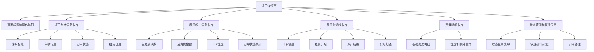

# 租赁管理模块前端界面风格统一设计

## 一、需求概述

当前租赁管理模块下的订单详情、订单编辑等界面风格与客户管理和车辆管理模块界面风格不一致，需要将租赁管理模块的界面风格统一到与客户、车辆模块相同的设计规范。

## 二、现状分析

### 2.1 客户和车辆模块的统一风格特征

通过分析客户管理和车辆管理模块的界面，归纳出以下设计规范：

#### 详情页设计规范
- 使用全宽布局（col-12），充分利用屏幕空间
- 信息卡片采用 shadow-sm 阴影效果
- 卡片标题背景使用主题色（bg-primary、bg-success、bg-info）配白色文字
- 信息展示采用多列响应式布局（col-lg-3 col-md-6）
- 每个信息项使用带边框的卡片容器（p-3 border rounded）
- 小标题使用浅色文字（text-muted small mb-1）
- 统计信息区域使用背景色隔离（bg-light border-start border-[color] border-5）

#### 表单页设计规范
- 表单容器使用全宽布局（col-12），取消居中限制
- 卡片使用大阴影（shadow-lg border-0）
- 表单字段采用响应式多列布局（col-lg-3/4 col-md-6）
- 表单分组标题使用（text-primary fw-semibold）配图标
- 填写说明使用突出样式（渐变背景卡片 + 彩色边框）
- 按钮布局采用右对齐并排显示（d-flex justify-content-end gap-3）

#### 删除确认页设计规范
- 使用全宽布局（col-12）
- 危险警告使用粗边框（border-start border-danger border-5）
- 信息展示采用横向卡片布局（col-lg-3 col-md-6 col-sm-6）
- 卡片添加阴影效果（shadow-sm）

### 2.2 租赁模块的现有风格问题

#### 订单详情页（rental_detail.html）
- 使用传统的 col-md-8 + col-md-4 布局，未充分利用空间
- 采用独立 HTML 文档，未继承统一的 base 模板
- 信息展示使用传统表格（dl-dt-dd），而非卡片化布局
- 统计信息缺少视觉隔离和突出显示
- 缺少客户、车辆模块的多列响应式布局风格

#### 订单编辑页（rental_form.html）
- 已采用全宽布局，符合规范
- 表单布局已采用响应式设计（col-lg-6 col-md-6）
- 缺少填写说明的突出样式卡片
- 整体风格基本符合，但缺少一致性细节调整

#### 取消订单页（rental_confirm_cancel.html）
- 布局使用全宽（col-12），符合规范
- 信息卡片使用响应式布局（col-lg-4 col-md-6）
- 已使用阴影效果和主题色
- 整体风格较为一致，需细节优化

#### 归还车辆页（rental_confirm_return.html）
- 布局使用全宽（col-12），符合规范
- 信息展示较为简洁
- 整体风格基本一致

## 三、设计目标

将租赁管理模块的所有界面风格统一到与客户管理、车辆管理模块一致的设计规范，确保：

1. 布局风格一致：全宽布局、响应式多列设计
2. 视觉风格一致：卡片阴影、主题色应用、边框样式
3. 信息组织一致：卡片化信息展示、统计信息隔离
4. 交互风格一致：按钮布局、表单验证提示
5. 模板继承一致：统一继承 base 模板

## 四、设计方案

### 4.1 订单详情页优化方案

#### 4.1.1 整体布局调整
- 将独立 HTML 文档改为继承 base 模板
- 主内容区采用全宽布局（col-12）
- 取消传统的主侧边栏布局，改为垂直堆叠卡片式布局

#### 4.1.2 订单基本信息区域
- 使用全宽卡片（col-12）
- 卡片标题使用主题色背景（bg-primary text-white）
- 信息展示采用多列响应式布局（col-lg-3 col-md-6）
- 每个信息项使用带边框的独立容器（p-3 border rounded h-100）
- 小标题使用（text-muted small mb-1）配图标
- 数值使用（fw-semibold）强调

#### 4.1.3 租赁统计信息区域
- 独立卡片展示统计数据
- 卡片标题使用成功色背景（bg-success text-white）
- 统计数据采用居中多列布局（col-lg-3 col-md-6 text-center）
- 每个统计项使用边框容器（p-3 border rounded）
- 数值使用大号字体（h3）和主题色

#### 4.1.4 租赁时间线区域
- 保持现有时间线设计
- 调整卡片标题样式与其他模块一致
- 优化时间线项的间距和视觉效果

#### 4.1.5 费用明细区域
- 采用全宽展示
- 使用响应式多列布局展示基础费用和额外费用
- 每个费用项使用带背景色的容器（bg-light border）
- 总计金额使用突出样式

#### 4.1.6 操作和快速信息区域
- 从侧边栏移至底部或顶部操作区
- 状态管理和快速信息合并展示
- 采用响应式布局

### 4.2 订单编辑页优化方案

#### 4.2.1 添加填写说明卡片
参考客户编辑页面，添加突出的填写说明：
- 使用渐变背景卡片（linear-gradient background）
- 卡片标题使用白色粗体文字
- 说明内容使用多列响应式布局（col-lg-4 col-md-6）
- 每个说明项使用彩色边框容器（border-left: 4px solid）
- 不同类型说明使用不同主题色（success、primary、warning）

#### 4.2.2 表单布局细节优化
- 统一图标使用方式
- 统一必填项标识（text-danger *）
- 统一错误提示样式
- 优化字段间距（g-4）

#### 4.2.3 费用预览区域优化
- 调整卡片样式与其他模块一致
- 优化费用展示的可读性

### 4.3 取消订单页优化方案

#### 4.3.1 信息展示优化
- 保持全宽布局和响应式多列
- 统一卡片阴影和边框样式
- 调整小标题和数值的显示方式与详情页一致

#### 4.3.2 警告提示优化
- 统一警告框样式
- 使用一致的边框和图标

### 4.4 归还车辆页优化方案

#### 4.4.1 订单信息展示优化
- 改进信息卡片布局
- 采用与详情页一致的信息展示方式
- 优化费用预览区域

#### 4.4.2 表单区域优化
- 统一表单字段样式
- 优化提示信息展示

## 五、统一设计规范

### 5.1 布局规范

| 场景 | 布局规则 |
|------|---------|
| 详情页主内容 | col-12 全宽布局 |
| 表单页主容器 | col-12 全宽布局 |
| 删除确认页 | col-12 全宽布局 |
| 信息多列展示 | col-lg-3 col-md-6（四列）或 col-lg-4 col-md-6（三列） |
| 表单字段布局 | col-lg-3/4 col-md-6 根据字段数量 |
| 按钮组布局 | d-flex justify-content-end gap-3 |

### 5.2 卡片样式规范

| 卡片类型 | 样式类 |
|---------|--------|
| 普通信息卡片 | card shadow-sm |
| 重要操作卡片 | card shadow-lg border-0 |
| 卡片标题（主要） | card-header bg-primary text-white |
| 卡片标题（成功） | card-header bg-success text-white |
| 卡片标题（信息） | card-header bg-info text-white |
| 卡片标题（危险） | card-header bg-danger text-white |
| 信息项容器 | p-3 border rounded h-100 |
| 统计项容器 | p-3 border rounded（可选 text-center） |

### 5.3 文字样式规范

| 文字类型 | 样式类 |
|---------|--------|
| 卡片大标题 | h5 mb-0 或 card-title mb-0 |
| 分组小标题 | h6 text-primary fw-semibold 或 fw-bold |
| 信息项标签 | text-muted small mb-1 |
| 信息项数值 | fw-semibold |
| 统计数值 | h3 text-[color] mb-2 |
| 表单标签 | form-label fw-semibold |

### 5.4 颜色和边框规范

| 元素 | 颜色/边框 |
|------|----------|
| 主要操作 | bg-primary / border-primary |
| 成功提示 | bg-success / border-success / text-success |
| 信息提示 | bg-info / border-info / text-info |
| 警告提示 | bg-warning / border-warning / text-warning |
| 危险操作 | bg-danger / border-danger / text-danger |
| 统计区域隔离 | bg-light border-start border-[color] border-5 |
| 填写说明边框 | border-left: 4px solid [color] |

### 5.5 间距规范

| 场景 | 间距类 |
|------|--------|
| 卡片间距 | mb-4 |
| 行内间距 | g-4 或 g-3 |
| 卡片内边距 | p-4 或 card-body p-4 |
| 按钮间距 | gap-3 |
| 分组顶部间距 | mt-4 |

### 5.6 图标使用规范

| 图标位置 | 使用方式 |
|---------|---------|
| 卡片标题 | `<i class="bi bi-[icon] me-2"></i>标题文字` |
| 信息项标签 | `<i class="bi bi-[icon] me-1"></i>标签文字` |
| 按钮 | `<i class="bi bi-[icon]"></i> 按钮文字` 或仅图标 |
| 分组标题 | `<i class="bi bi-[icon] me-2"></i>标题文字` |

## 六、实施范围

### 6.1 需要修改的模板文件

| 文件路径 | 优化内容 |
|---------|---------|
| templates/rentals/rental_detail.html | 改为继承 base 模板，重构整体布局和信息展示方式 |
| templates/rentals/rental_form.html | 添加填写说明卡片，优化表单布局细节 |
| templates/rentals/rental_confirm_cancel.html | 统一信息展示样式，优化警告提示 |
| templates/rentals/rental_confirm_return.html | 优化信息展示和表单布局 |

### 6.2 不需要修改的内容

- 后端视图逻辑保持不变
- 数据传递方式保持不变
- JavaScript 交互逻辑保持不变（仅调整选择器如有必要）
- URL 路由保持不变

## 七、设计细节说明

### 7.1 订单详情页信息组织流程



### 7.2 信息卡片布局结构

每个信息项的标准结构：

```
┌─────────────────────────────────────────┐
│ [图标] 小标题 (text-muted small mb-1)   │
│ 数值内容 (fw-semibold)                   │
└─────────────────────────────────────────┘
```

### 7.3 响应式布局策略

| 屏幕尺寸 | 信息列数 | 布局类 |
|---------|---------|--------|
| 大屏（≥992px） | 4列 | col-lg-3 |
| 中屏（≥768px） | 2列 | col-md-6 |
| 小屏（<768px） | 1列 | 自动全宽 |

表单字段根据内容复杂度调整：
- 简单字段（如姓名、电话）：col-lg-3 col-md-6（4列布局）
- 中等字段（如地址、备注）：col-lg-4 col-md-6（3列布局）
- 复杂字段（如富文本）：col-lg-6 col-md-6（2列布局）

### 7.4 填写说明卡片设计

渐变背景卡片：
- 卡片容器：使用 linear-gradient 渐变背景
- 标题区：bg-transparent border-0，白色粗体文字
- 内容区：bg-white rounded-bottom，多列响应式布局
- 说明项：使用彩色左边框（4px solid）和浅色背景

不同主题色对应：
- 绿色（success）：#10b981，背景 #f0fdf4
- 蓝色（primary）：#3b82f6，背景 #eff6ff
- 黄色（warning）：#f59e0b，背景 #fef3c7

## 八、预期效果

### 8.1 视觉统一性
- 租赁管理模块与客户、车辆模块视觉风格完全一致
- 用户在不同模块间切换时体验连贯流畅

### 8.2 空间利用率
- 全宽布局充分利用屏幕空间
- 响应式设计适配各种屏幕尺寸

### 8.3 信息可读性
- 卡片化布局清晰分组
- 统计信息视觉突出
- 重要信息层次分明

### 8.4 用户体验
- 操作流程一致性强
- 视觉引导明确
- 减少认知负担

## 九、兼容性说明

### 9.1 浏览器兼容
- 依赖 Bootstrap 5 框架
- 支持现代主流浏览器
- 响应式设计适配移动端

### 9.2 数据兼容
- 仅修改展示层，不影响数据结构
- 保持与后端接口的兼容性

### 9.3 功能兼容
- 保留所有现有功能
- 不破坏现有交互逻辑

## 十、验证标准

### 10.1 布局验证
- 所有页面使用全宽布局（col-12）
- 信息展示采用响应式多列布局
- 按钮布局右对齐并排显示

### 10.2 样式验证
- 卡片阴影效果一致
- 主题色应用统一
- 文字样式符合规范

### 10.3 响应式验证
- 在不同屏幕尺寸下布局正常
- 移动端显示友好

### 10.4 功能验证
- 所有现有功能正常工作
- 表单提交和验证正常
- 数据展示准确完整
