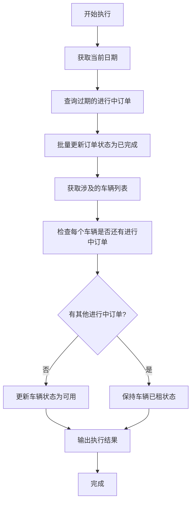

# 租赁订单与车辆状态自动更新功能设计

## 一、功能概述

### 1.1 功能目标
实现基于本地时间的自动化状态更新,当租赁结束日期已过期时,自动将订单状态更新为"已完成",并将相关车辆状态更新为"可用"。

### 1.2 应用场景
例如:当前日期为11月13日,系统自动查找所有结束日期在11月13日之前且状态为"进行中"的订单,将其状态改为"已完成",并释放对应车辆

## 二、更新规则

### 2.1 订单更新规则
- 查找条件:状态为"进行中(ONGOING)" 且 结束日期 < 当前日期
- 更新操作:将订单状态改为"已完成(COMPLETED)"

### 2.2 车辆更新规则
- 更新条件:订单状态变为"已完成"后,检查该车辆是否还有其他"进行中"的订单
- 更新操作:如果没有其他进行中订单,将车辆状态从"已租(RENTED)"改为"可用(AVAILABLE)"

### 2.3 时间判断
- 使用 Python 的 date.today() 获取当前日期
- 比较逻辑: end_date < date.today()

## 三、实现方案

### 3.1 技术选择
使用 Django Management Command 创建自定义管理命令,配合系统 Cron 定时执行

### 3.2 执行流程



### 3.3 命令结构
- 命令名称: update_expired_rentals
- 文件位置: rentals/management/commands/update_expired_rentals.py
- 执行命令: python manage.py update_expired_rentals

## 四、核心逻辑

### 4.1 查询过期订单
使用 Django ORM 查询: `Rental.objects.filter(status='ONGOING', end_date__lt=date.today())`

### 4.2 更新订单状态
批量更新: `expired_rentals.update(status='COMPLETED')`

### 4.3 更新车辆状态
遍历每个车辆,检查是否还有进行中订单,如果没有则更新状态为可用

## 五、定时执行

### 5.1 Cron 配置
在 Linux/Mac 系统的 crontab 中添加:
```
0 1 * * * cd /path/to/project && python manage.py update_expired_rentals
```
表示每天凌晨1点自动执行

### 5.2 Windows 任务计划
使用 Windows 任务计划程序,设置每天定时运行该命令

### 5.3 手动执行
可随时手动运行: `python manage.py update_expired_rentals`

## 六、输出信息

### 6.1 控制台输出
命令执行时输出:
- 更新的订单数量
- 更新的车辆数量
- 执行结果(成功/失败)

## 七、注意事项

### 7.1 日期判断
- 使用严格小于(<)判断,当天结束的订单不会被更新
- 例如:11月13日当天结束的订单,在11月13日不会更新,需到11月14日才更新

### 7.2 车辆状态
- 只有当车辆没有任何"进行中"订单时,才将状态改为"可用"
- 如果车辆有多个订单,需等所有订单都完成才释放车辆

## 八、测试验证

### 8.1 功能测试
- 创建几条结束日期为过去的"进行中"订单
- 运行命令,验证订单状态是否更新为"已完成"
- 验证车辆状态是否正确更新为"可用"

### 8.2 边界测试
- 测试当天结束的订单不会被更新
- 测试车辆有多个订单时的状态变化

