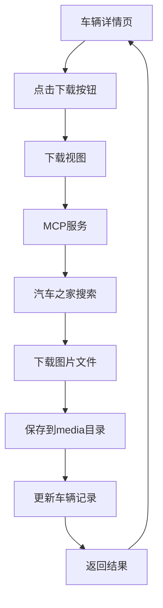
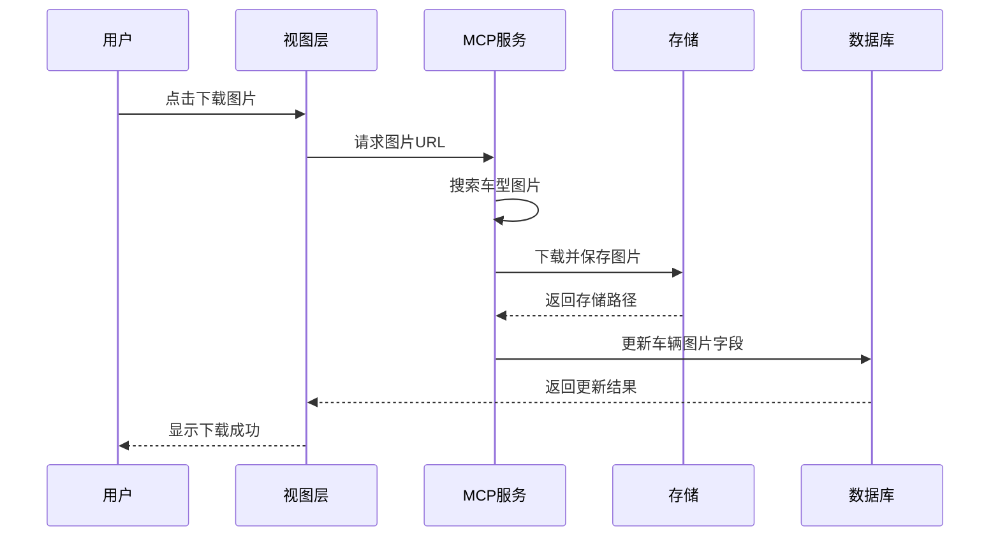

# 车辆图片自动下载功能设计方案

## 1. 功能目标

为车辆管理系统的**管理员界面**增加车辆图片下载功能,通过车辆品牌型号从汽车之家获取车辆外观图和内饰图,丰富车辆详情页展示效果。

功能定位:
- 仅管理员可使用图片下载功能
- 在管理员的车辆详情页提供下载入口
- 下载后的图片对所有用户可见

作为课程作业项目,本方案力求简洁实用,重点实现核心功能。

## 2. 需求分析

### 2.1 核心需求

- 根据车辆品牌和型号从汽车之家获取车辆外观图和内饰图
- 图片下载后保存到本地media目录
- 在车辆详情页展示下载的图片
- 提供手动触发下载功能

### 2.2 业务场景

- 场景一: 管理员登录后,在车辆管理后台的车辆详情页手动触发图片下载
- 场景二: 图片下载成功后,所有用户访问该车辆详情页时可查看图片
- 场景三: 图片下载失败时向管理员显示错误提示

### 2.3 技术约束

- 项目基于Django框架
- 需采用MCP(Model Context Protocol)服务架构
- 需考虑网络请求的超时和错误处理
- 需遵守目标网站的爬虫协议

## 3. 系统架构设计

### 3.1 整体架构

采用简化的三层架构:
- 表现层: 车辆详情页面、图片展示区域
- 业务层: 图片下载视图、MCP服务调用
- 数据层: 车辆模型扩展(添加图片字段)

### 3.2 MCP服务设计

MCP服务作为Django应用内的独立模块,负责与汽车之家交互获取图片。

服务职责:
- 接收车辆品牌型号信息
- 从汽车之家搜索车型图片
- 下载图片到本地
- 返回图片保存路径

### 3.3 架构流程图

## 4. 数据模型设计

### 4.1 车辆模型扩展(简化版)

为Vehicle模型增加两个图片字段即可。

| 字段名 | 数据类型 | 说明 | 是否必填 |
|--------|---------|------|---------||
| exterior_image | ImageField | 外观图 | 否 |
| interior_image | ImageField | 内饰图 | 否 |

### 4.2 数据模型说明

简化设计,不需要额外的图片元数据模型,直接在Vehicle模型中存储图片即可。每种类型只存储一张图片,满足基本展示需求。

## 5. MCP服务设计

### 5.1 MCP服务职责定义

MCP服务作为简单的工具模块,负责从汽车之家获取图片。

核心职责:
- 根据品牌型号搜索车型
- 解析网页获取图片URL
- 下载图片到本地

### 5.2 MCP服务接口设计

#### 5.2.1 图片查询接口(简化版)

接口名称: fetch_vehicle_images

输入参数:
| 参数名 | 类型 | 说明 | 是否必填 |
|--------|------|------|---------||
| brand | String | 车辆品牌 | 是 |
| model | String | 车辆型号 | 是 |

输出结果:
| 字段名 | 类型 | 说明 |
|--------|------|------|
| success | Boolean | 是否成功 |
| exterior_url | String | 外观图URL |
| interior_url | String | 内饰图URL |
| message | String | 错误信息 |

#### 5.2.2 简化说明

作为课程作业,不需要复杂的健康检查接口,基本的错误处理即可满足需求。

### 5.3 汽车之家数据获取方案

实现简单的決车之家图片获取功能。

实现策略:
- 构造搜索URL(汽车之家车型搜索页)
- 使用requests库请求网页
- 使用BeautifulSoup解析HTML获取图片URL
- 下载第一张外观图和第一张内饰图

### 5.4 实现简化说明

作为课程作业:
- 只实现汽车之家数据源
- 不需要多数据源适配器
- 不需要降级策略
- 不需要质量评分系统

### 5.5 部署方案

MCP服务集成在Django项目内,作为一个utils模块。

部署架构:
- 创建 vehicles/utils/image_downloader.py
- 封装MCP服务逻辑
- 通过Python导入直接调用

优点:
- 部署简单,无需额外服务
- 调用延迟低
- 便于开发和调试

## 6. 图片处理流程设计

### 6.1 图片下载流程(简化版)

### 6.2 图片存储策略

采用简单的存储路径结构。

路径模板:
- media/vehicles/{vehicle_id}/exterior.jpg
- media/vehicles/{vehicle_id}/interior.jpg

路径规则:
- vehicle_id: 车辆主键ID
- 固定文件名,重新下载时直接覆盖

## 7. 业务功能设计(简化版)

### 7.1 手动下载功能(管理员专用)

在管理员的车辆详情页提供手动触发图片下载的入口。

权限要求:
- 仅管理员登录后可见下载按钮
- 普通用户不显示下载功能

触发位置:
- 管理员访问车辆详情页时,在侧边栏"快速操作"区域
- 添加"下载车辆图片"按钮

交互流程:
1. 管理员点击"下载车辆图片"按钮
2. 后端验证管理员权限
3. 调用MCP服务下载图片
4. 下载完成后刷新页面展示图片
5. 失败时显示错误提示

状态反馈:
- 下载中: 显示进度提示"正在下载图片..."
- 成功: 显示成功消息"图片下载成功"
- 失败: 显示具体错误"未找到匹配车型图片"

## 8. 前端界面设计

### 8.1 车辆详情页图片展示区

在车辆详情页新增图片展示区域,优化信息呈现。

布局方案:
- 在"车辆信息"卡片上方增加"车辆图片"卡片
- 采用轮播图或图片画廊形式展示
- 区分外观图和内饰图标签页

展示逻辑:
- 有图片时显示图片轮播组件
- 无图片时显示占位图和"下载图片"提示
- 点击图片可放大浏览(灯箱效果)

图片展示组件结构:
- 主图区: 显示当前选中的大图
- 缩略图区: 显示所有图片缩略图供切换
- 标签页: 外观图/内饰图分类切换
- 操作按钮: 上一张/下一张/放大查看

### 8.2 下载按钮与状态提示(管理员视图)

在管理员界面的快速操作区添加图片下载按钮及状态显示。

权限控制:
- 仅管理员登录时显示下载按钮
- 前端根据用户权限动态显示/隐藏
- 使用Django模板的条件判断

按钮设计:
- 按钮文本: "下载车辆图片"
- 图标: 下载图标(bi-download)
- 样式: btn btn-info,区别于其他操作按钮

状态显示:
- 未下载: 显示下载按钮(仅管理员可见)
- 下载中: 按钮禁用,显示加载动画和进度文本
- 已下载: 显示"重新下载"按钮和下载时间
- 下载失败: 显示"重试下载"按钮和错误提示

状态提示位置:
- 按钮下方显示小字提示
- 示例: "最后下载: 2024-01-15 14:30" 或 "下载失败: 未找到匹配车型"

### 8.3 简化说明

作为课程作业:
- 不需要复杂的列表页缩略图预览
- 不需要批量下载管理界面

## 9. 后端接口设计(简化版)

### 9.1 手动下载接口(需要管理员权限)

路径: /vehicles/{vehicle_id}/download-images/

请求方法: POST

权限要求:
- 需要管理员权限(is_staff=True)
- 使用@user_passes_test或@permission_required装饰器

响应结果:
| 字段名 | 类型 | 说明 |
|--------|------|------|
| success | Boolean | 是否成功 |
| message | String | 提示信息 |

错误响应:
| HTTP状态码 | 说明 |
|-----------| ------|
| 403 | 无权限(非管理员) |
| 404 | 车辆不存在 |
| 500 | 下载失败 |

### 9.2 批量下载接口

路径: /vehicles/batch-download-images/

请求方法: POST

请求参数:
| 参数名 | 类型 | 说明 | 是否必填 |
|--------|------|------|---------|
| vehicle_ids | Array | 车辆ID列表 | 是 |
| skip_existing | Boolean | 跳过已有图片的车辆 | 否 |

响应结果:
| 字段名 | 类型 | 说明 |
|--------|------|------|
| success | Boolean | 是否成功 |
| task_id | String | 批量任务ID |
| message | String | 提示信息 |

任务创建后通过任务状态接口查询进度。

### 9.3 任务状态查询接口

路径: /vehicles/download-task/{task_id}/

请求方法: GET

响应结果:
| 字段名 | 类型 | 说明 |
|--------|------|------|
| task_id | String | 任务ID |
| status | String | 任务状态(pending/running/completed/failed) |
| progress | Integer | 完成进度(0-100) |
| total_count | Integer | 总数 |
| success_count | Integer | 成功数 |
| failed_count | Integer | 失败数 |
| created_at | DateTime | 创建时间 |
| updated_at | DateTime | 更新时间 |
| details | Array | 各车辆下载详情 |

details数组元素结构:
| 字段名 | 类型 | 说明 |
|--------|------|------|
| vehicle_id | Integer | 车辆ID |
| vehicle_name | String | 车辆名称 |
| status | String | 下载状态 |
| error_message | String | 错误信息(如有) |

### 9.4 图片列表接口

路径: /vehicles/{vehicle_id}/images/

请求方法: GET

请求参数:
| 参数名 | 类型 | 说明 | 是否必填 |
|--------|------|------|---------|
| image_type | String | 筛选图片类型 | 否 |

响应结果:
| 字段名 | 类型 | 说明 |
|--------|------|------|
| success | Boolean | 是否成功 |
| data | Array | 图片列表 |

图片数据结构:
| 字段名 | 类型 | 说明 |
|--------|------|------|
| id | Integer | 图片ID |
| image_type | String | 图片类型 |
| url | String | 图片访问URL |
| thumb_url | String | 缩略图URL |
| source | String | 来源 |
| is_primary | Boolean | 是否主图 |
| created_at | DateTime | 创建时间 |

### 9.5 图片删除接口

路径: /vehicles/images/{image_id}/

请求方法: DELETE

响应结果:
| 字段名 | 类型 | 说明 |
|--------|------|------|
| success | Boolean | 是否成功 |
| message | String | 提示信息 |

## 10. 异常处理(简化版)

### 10.1 基本错误处理

处理常见错误场景:
- 网络超时: 设置10秒超时,显示错误信息
- 车型不存在: 提示用户检查品牌型号
- 文件保存失败: 检查目录权限,记录日志

### 10.2 日志记录

记录关键操作:
- 下载成功/失败
- 错误堆栈信息
- 车辆品牌型号

## 11. 实施计划(简化版)

### 11.1 开发阶段

阶段一: 数据模型设计(1天)
- 扩展Vehicle模型,添加图片字段
- 数据库迁移

阶段二: MCP服务开发(2天)
- 实现汽车之家图片搜索
- 实现图片下载功能

阶段三: 后端接口开发(1天)
- 实现下载视图和接口
- 集成MCP服务

阶段四: 前端界面开发(1天)
- 车辆详情页图片展示
- 下载按钮和状态提示

阶段五: 测试与优化(1天)
- 功能测试
- 错误处理完善

### 11.2 技术选型

推荐技术栈:
- HTTP客户端: requests
- HTML解析: BeautifulSoup4
- 图片处理: Pillow(可选)

### 11.3 重要说明

作为课程作业,以下内容可简化或省略:
- 不需要复杂的缓存机制
- 不需要异步任务队列
- 不需要批量下载功能
- 不需要复杂的性能优化

权限控制说明:
- 下载功能仅限管理员使用
- 在视图函数中使用@user_passes_test(lambda u: u.is_staff)装饰器
- 前端模板使用控制按钮显示
- 下载后的图片所有用户均可查看

### 12.1 访问权限控制

确保只有授权用户可操作图片下载功能。

权限设计:
- 查看图片: 所有用户均可查看
- 下载图片: 需要管理员权限
- 删除图片: 需要管理员权限
- 批量操作: 需要超级管理员权限

权限检查:
- 在视图层使用装饰器检查权限
- API接口验证用户身份和权限
- 前端根据权限显示或隐藏操作按钮

审计日志:
- 记录所有图片下载操作
- 记录操作用户和时间
- 记录删除图片的操作
- 定期审查异常操作

### 12.2 防爬虫策略

避免对数据源网站造成过大负担,遵守爬虫协议。

爬虫规范:
- 遵守robots.txt协议
- 设置合理的请求间隔(至少1秒)
- 使用真实的User-Agent
- 避免高频并发请求

频率限制:
- 单个数据源每分钟最多30次请求
- IP地址轮换(如适用)
- 请求失败后延长间隔时间
- 被封禁后自动暂停数据源

友好策略:
- 缓存搜索结果减少重复请求
- 优先使用官方API而非爬虫
- 标识请求来源和用途
- 遵守网站服务条款

### 12.3 数据验证

验证下载的图片内容,防止恶意文件。

验证规则:
- 文件类型: 仅允许JPG、PNG、WEBP格式
- 文件大小: 限制单文件最大5MB
- 图片尺寸: 验证宽高在合理范围(100-5000px)
- 文件头检查: 验证文件真实格式与扩展名一致

内容安全:
- 扫描图片是否包含恶意脚本
- 重新编码图片去除潜在威胁
- 隔离用户上传与系统下载图片
- 定期扫描存储目录安全性

错误图片处理:
- 验证失败的图片拒绝保存
- 记录验证失败日志
- 通知管理员审查
- 提供手动删除工具

### 12.4 敏感信息保护

保护配置信息和用户隐私。

配置安全:
- API密钥存储在环境变量中
- 数据库密码加密存储
- 敏感配置不提交到版本控制
- 生产环境独立配置文件

数据脱敏:
- 日志中隐藏敏感参数
- API响应不暴露内部路径
- 错误信息避免泄露系统细节

传输安全:
- 生产环境强制HTTPS
- API接口使用Token认证
- 图片URL添加时效性签名(可选)

## 13. 测试方案

### 13.1 单元测试

对关键模块和函数进行单元测试。

测试覆盖范围:
- MCP服务各数据源适配器
- 图片质量评估函数
- 图片下载和保存逻辑
- 模型方法和查询逻辑
- 缓存读写功能

测试用例设计:
- 正常场景: 成功下载和保存图片
- 异常场景: 网络超时、文件保存失败
- 边界场景: 空品牌名、特殊字符
- Mock外部依赖: 模拟HTTP请求和文件系统

测试工具:
- 使用Django TestCase编写测试
- 使用Mock模拟外部服务
- 使用coverage检查测试覆盖率
- 目标覆盖率80%以上

### 13.2 集成测试

测试各模块协同工作的正确性。

测试场景:
- 完整下载流程: 从触发到保存成功
- 多数据源降级: 主数据源失败切换备选
- 批量下载任务: 任务创建到执行完成
- 缓存机制: 缓存命中和失效验证

测试数据:
- 准备多种品牌型号的测试车辆
- 模拟不同状态的数据源响应
- 构造正常和异常的图片数据
- 准备测试图片文件

测试环境:
- 使用测试数据库隔离生产数据
- 模拟外部服务响应
- 独立的文件存储路径
- 测试完成后自动清理

### 13.3 性能测试

验证系统在负载下的性能表现。

测试指标:
- 单车辆下载响应时间: 目标<10秒
- 批量下载吞吐量: 每分钟处理>=10辆
- 并发请求处理能力: 支持10个并发下载
- 数据库查询耗时: 目标<100ms

测试工具:
- 使用Locust或JMeter进行压力测试
- 使用Django Debug Toolbar分析查询
- 使用Profiler分析代码性能瓶颈

测试场景:
- 模拟10个用户同时下载图片
- 批量下载100辆车辆图片
- 高频查询图片列表接口
- 长时间运行稳定性测试

性能优化目标:
- 响应时间P95<15秒
- 系统资源占用<70%
- 无内存泄漏
- 错误率<1%

### 13.4 用户验收测试

从用户角度验证功能可用性和易用性。

测试内容:
- 手动下载功能是否符合预期
- 批量下载操作是否便捷
- 图片展示效果是否满意
- 错误提示是否清晰友好

测试流程:
1. 选择多个不同品牌车型进行下载测试
2. 验证下载的图片是否准确匹配车型
3. 测试各种异常场景的用户体验
4. 收集用户反馈和改进建议

验收标准:
- 主流品牌车型下载成功率>=85%
- 图片质量满足展示要求
- 操作流程简单直观
- 错误处理用户友好

## 14. 实施计划

### 14.1 开发阶段划分

将项目分为多个迭代阶段,逐步实现功能。

阶段一: 基础架构搭建(预计3天)
- 设计并实现VehicleImage模型
- 搭建MCP服务框架
- 实现单个数据源适配器(汽车之家)
- 完成图片下载和保存基础功能

阶段二: 核心功能开发(预计5天)
- 实现手动下载接口和视图
- 完成图片质量评估机制
- 实现图片压缩和缩略图生成
- 开发前端图片展示组件
- 集成到车辆详情页

阶段三: 扩展功能开发(预计4天)
- 实现多数据源适配器
- 开发数据源降级策略
- 实现批量下载功能
- 开发异步任务队列
- 实现重试机制

阶段四: 优化与测试(预计3天)
- 性能优化和缓存实现
- 完善异常处理和日志
- 编写单元测试和集成测试
- 修复测试发现的问题

阶段五: 部署与上线(预计2天)
- 准备生产环境配置
- 部署MCP服务
- 数据迁移和初始化
- 用户培训和文档编写
- 监控和告警配置

### 14.2 技术选型建议

推荐的技术栈和工具。

核心框架:
- MCP服务框架: FastAPI(如独立部署)或Django App(如集成部署)
- 异步任务: Celery + Redis
- HTTP客户端: httpx或requests
- 图片处理: Pillow

数据源处理:
- HTML解析: BeautifulSoup4或lxml
- 网页自动化: Playwright或Selenium(如需要)
- API调用: 使用官方SDK(如有)

存储与缓存:
- 缓存: Redis
- 对象存储: 本地文件系统或云存储(OSS/S3)

监控与日志:
- 日志: Python logging模块
- 监控: Prometheus + Grafana(可选)
- 错误追踪: Sentry(可选)

### 14.3 风险评估

识别潜在风险及应对措施。

技术风险:
| 风险 | 影响 | 应对措施 |
|------|------|---------|
| 数据源网站结构变化 | 适配器失效 | 定期检查和更新,多数据源备份 |
| 反爬虫机制加强 | 无法获取图片 | 使用官方API,降低请求频率 |
| 图片质量评估不准确 | 下载低质量图片 | 优化评估算法,人工审核 |
| 存储空间不足 | 下载失败 | 监控空间,自动清理,扩容 |

业务风险:
| 风险 | 影响 | 应对措施 |
|------|------|---------|
| 图片版权问题 | 法律纠纷 | 仅用于内部展示,标注来源 |
| 用户期望过高 | 满意度下降 | 明确功能限制,管理预期 |
| 下载速度慢 | 用户体验差 | 异步处理,进度提示 |

运维风险:
| 风险 | 影响 | 应对措施 |
|------|------|---------|
| MCP服务故障 | 功能不可用 | 服务监控,自动重启,降级策略 |
| 任务队列积压 | 系统负载高 | 限流,扩容worker,优先级调度 |

### 14.4 后续扩展方向

功能上线后的可能改进方向。

功能扩展:
- 支持更多图片类型(细节图、全景图)
- 接入更多数据源(易车、懂车帝等)
- 支持视频资源下载
- 图片AI识别和分类
- 用户上传补充图片

技术升级:
- 引入图像识别验证车型匹配度
- 使用AI去除水印
- 智能图片推荐算法
- 分布式图片存储
- 边缘节点加速

体验优化:
- 图片对比查看功能
- 自定义图片排序
- 图片标签和注释
- 移动端适配优化
- 图片分享功能

## 15. 配置参数说明

系统提供可配置参数,便于调整行为和性能。

### 15.1 MCP服务配置

在配置文件或环境变量中定义MCP服务参数。

| 配置项 | 类型 | 默认值 | 说明 |
|--------|------|--------|------|
| MCP_SERVICE_ENABLED | Boolean | True | 是否启用MCP服务 |
| MCP_SERVICE_URL | String | http://localhost:8001 | MCP服务地址(独立部署时) |
| MCP_REQUEST_TIMEOUT | Integer | 30 | 请求超时时间(秒) |
| MCP_MAX_RETRIES | Integer | 3 | 最大重试次数 |
| MCP_RETRY_DELAY | Integer | 5 | 重试间隔(秒) |

### 15.2 数据源配置

配置各数据源的优先级和参数。

| 配置项 | 类型 | 默认值 | 说明 |
|--------|------|--------|------|
| IMAGE_SOURCE_PRIORITY | Array | ['official','autohome','search'] | 数据源优先级列表 |
| AUTOHOME_API_KEY | String | - | 汽车之家API密钥(如需要) |
| ENABLE_OFFICIAL_WEBSITE | Boolean | True | 是否启用官网数据源 |
| ENABLE_AUTOHOME | Boolean | True | 是否启用汽车之家 |
| ENABLE_SEARCH_ENGINE | Boolean | True | 是否启用搜索引擎 |

### 15.3 下载配置

控制图片下载行为的参数。

| 配置项 | 类型 | 默认值 | 说明 |
|--------|------|--------|------|
| AUTO_DOWNLOAD_ON_CREATE | Boolean | True | 创建车辆时自动下载 |
| MAX_IMAGES_PER_TYPE | Integer | 5 | 每种类型最大图片数 |
| MIN_IMAGE_WIDTH | Integer | 800 | 最小图片宽度(像素) |
| MIN_IMAGE_HEIGHT | Integer | 600 | 最小图片高度(像素) |
| MAX_IMAGE_SIZE | Integer | 5242880 | 最大文件大小(字节,5MB) |
| IMAGE_QUALITY | Integer | 85 | JPEG压缩质量(0-100) |
| GENERATE_THUMBNAIL | Boolean | True | 是否生成缩略图 |
| THUMBNAIL_SIZE | Tuple | (200,150) | 缩略图尺寸 |

### 15.4 存储配置

图片存储路径和策略配置。

| 配置项 | 类型 | 默认值 | 说明 |
|--------|------|--------|------|
| VEHICLE_IMAGES_ROOT | String | media/vehicles/images | 图片存储根目录 |
| STORAGE_BACKEND | String | filesystem | 存储后端(filesystem/s3/oss) |
| ENABLE_CDN | Boolean | False | 是否启用CDN |
| CDN_DOMAIN | String | - | CDN域名 |
| MAX_STORAGE_SIZE | Integer | 10737418240 | 最大存储空间(字节,10GB) |
| CLEAN_ORPHAN_IMAGES | Boolean | True | 是否自动清理孤儿图片 |

### 15.5 任务队列配置

异步任务相关配置。

| 配置项 | 类型 | 默认值 | 说明 |
|--------|------|--------|------|
| CELERY_BROKER_URL | String | redis://localhost:6379/0 | 任务队列地址 |
| CELERY_RESULT_BACKEND | String | redis://localhost:6379/0 | 结果存储地址 |
| DOWNLOAD_TASK_PRIORITY | Integer | 5 | 下载任务优先级(1-10) |
| MAX_CONCURRENT_DOWNLOADS | Integer | 5 | 最大并发下载数 |
| TASK_TIME_LIMIT | Integer | 300 | 单任务最大执行时间(秒) |

### 15.6 缓存配置

缓存策略相关配置。

| 配置项 | 类型 | 默认值 | 说明 |
|--------|------|--------|------|
| ENABLE_IMAGE_CACHE | Boolean | True | 是否启用图片缓存 |
| CACHE_BACKEND | String | redis | 缓存后端 |
| SEARCH_RESULT_CACHE_TIME | Integer | 86400 | 搜索结果缓存时长(秒) |
| IMAGE_LIST_CACHE_TIME | Integer | 3600 | 图片列表缓存时长(秒) |
| SOURCE_HEALTH_CACHE_TIME | Integer | 300 | 数据源健康状态缓存时长(秒) |

配置建议:
- 开发环境可降低超时时间和重试次数,加快调试
- 生产环境建议启用缓存和CDN提升性能
- 根据实际存储空间调整配额限制
- 根据服务器性能调整并发数量

## 16. 部署检查清单

上线前需完成的检查项目。

### 16.1 环境准备

- [ ] Python版本>=3.8
- [ ] Django版本兼容性确认
- [ ] Redis服务正常运行
- [ ] Celery Worker启动并运行
- [ ] 存储目录创建且权限正确
- [ ] 数据库迁移完成
- [ ] 环境变量配置正确

### 16.2 功能测试

- [ ] 手动下载单车辆图片成功
- [ ] 批量下载多车辆图片成功
- [ ] 图片展示正常无错误
- [ ] 缩略图生成正确
- [ ] 图片删除功能正常
- [ ] 重试机制工作正常
- [ ] 错误提示友好准确

### 16.3 性能验证

- [ ] 单车辆下载响应时间符合预期
- [ ] 批量下载性能满足要求
- [ ] 并发请求处理正常
- [ ] 缓存命中率达标
- [ ] 数据库查询优化完成
- [ ] 内存和CPU占用正常

### 16.4 安全检查

- [ ] 权限控制生效
- [ ] 敏感信息已加密
- [ ] 文件上传验证完善
- [ ] API接口鉴权正常
- [ ] 日志脱敏处理
- [ ] HTTPS配置正确(生产环境)

### 16.5 监控告警

- [ ] 日志收集配置完成
- [ ] 关键指标监控设置
- [ ] 告警规则配置正确
- [ ] 告警通知渠道测试通过
- [ ] 数据源健康检查运行
- [ ] 存储空间监控生效

### 16.6 文档准备

- [ ] 用户使用手册编写
- [ ] API接口文档完善
- [ ] 配置参数说明清晰
- [ ] 故障排查指南准备
- [ ] 运维操作文档完成
- [ ] 更新系统架构文档
