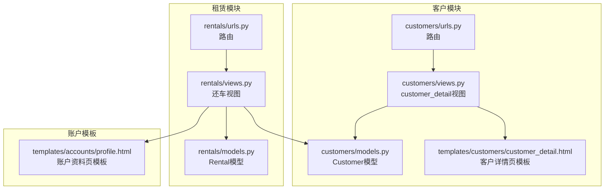
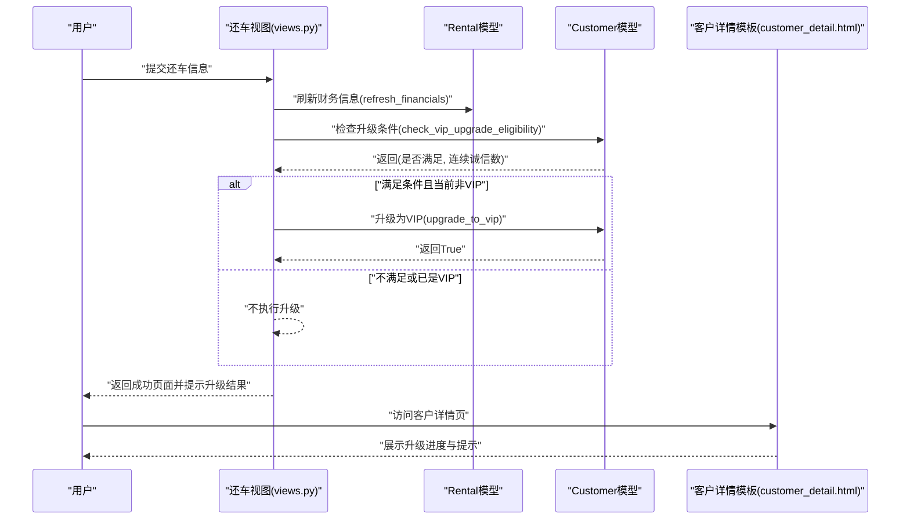
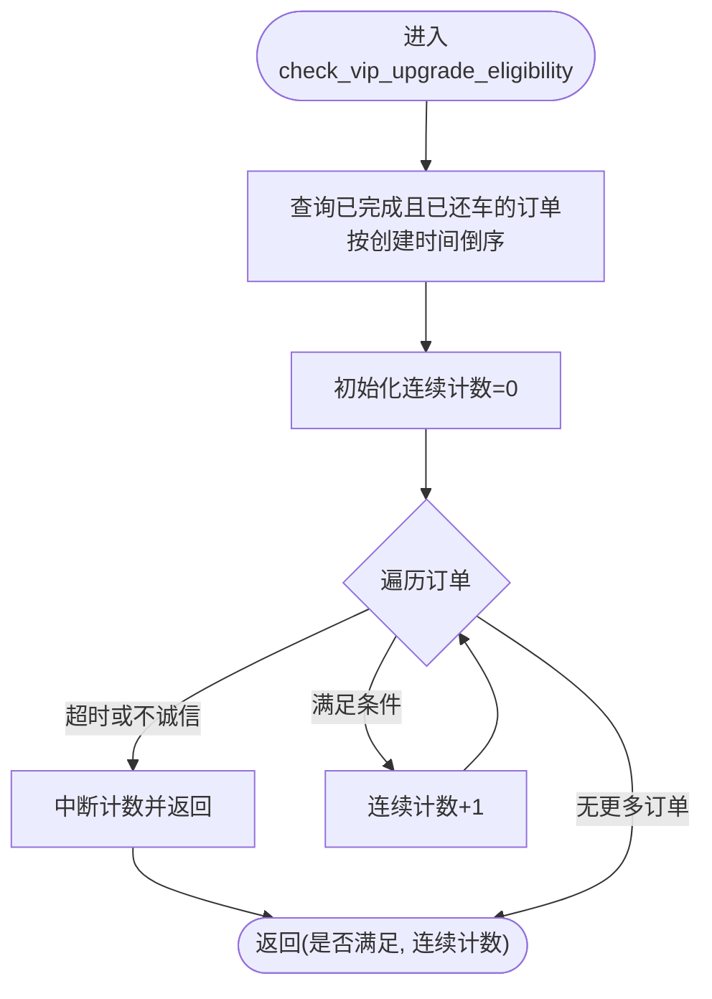
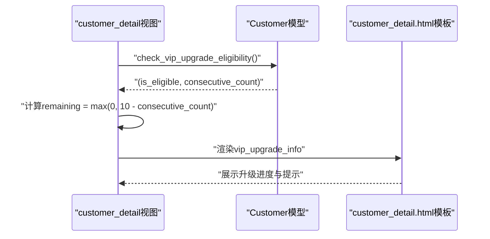
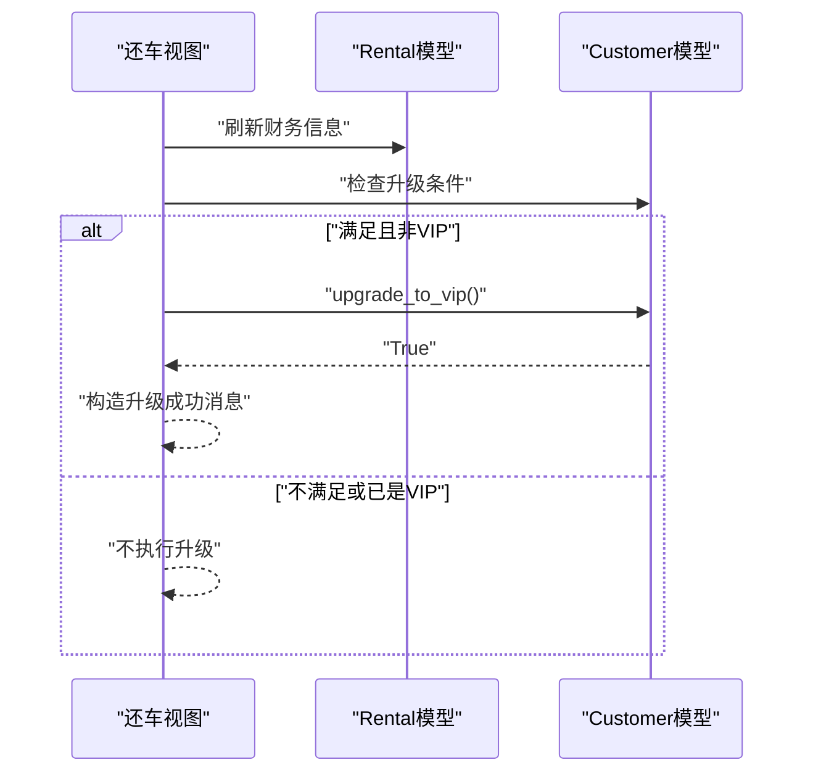
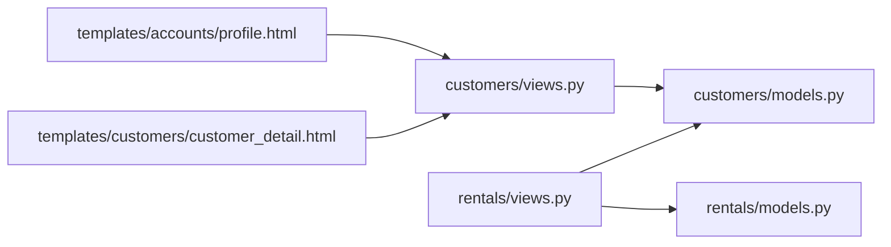

# VIP自动升级机制

<cite>
**本文引用的文件**
- [customers/models.py](file://code/car_rental_system/customers/models.py)
- [customers/views.py](file://code/car_rental_system/customers/views.py)
- [customers/urls.py](file://code/car_rental_system/customers/urls.py)
- [customers/customer_detail.html](file://code/car_rental_system/templates/customers/customer_detail.html)
- [accounts/profile.html](file://code/car_rental_system/templates/accounts/profile.html)
- [rentals/models.py](file://code/car_rental_system/rentals/models.py)
- [rentals/views.py](file://code/car_rental_system/rentals/views.py)
- [rentals/urls.py](file://code/car_rental_system/rentals/urls.py)
</cite>

## 目录
1. [引言](#引言)
2. [项目结构](#项目结构)
3. [核心组件](#核心组件)
4. [架构总览](#架构总览)
5. [详细组件分析](#详细组件分析)
6. [依赖关系分析](#依赖关系分析)
7. [性能考量](#性能考量)
8. [故障排查指南](#故障排查指南)
9. [结论](#结论)

## 引言
本文件全面解析系统中VIP自动升级功能的业务逻辑与技术实现，重点覆盖以下内容：
- Customer模型中check_vip_upgrade_eligibility方法的算法逻辑：如何查询客户最近的已完成订单，验证是否满足“连续10个订单无超时费用且诚信归还”的条件。
- customer_detail视图如何调用该方法并计算剩余升级进度，以及相关信息在前端模板中的展示方式。
- upgrade_to_vip方法的实现细节与数据更新策略。
- 实际代码示例路径，帮助定位到具体实现位置。
- 状态判断与边界情况处理说明。

## 项目结构
VIP自动升级涉及三个主要模块：
- 客户模块（customers）：负责会员等级与升级条件判定。
- 租赁模块（rentals）：负责订单生命周期与还车流程，在还车完成后触发升级检查。
- 模板层（templates）：负责在客户详情页与账户资料页展示升级进度与提示。

图表来源
- [customers/models.py](file://code/car_rental_system/customers/models.py#L1-L160)
- [customers/views.py](file://code/car_rental_system/customers/views.py#L79-L121)
- [customers/urls.py](file://code/car_rental_system/customers/urls.py#L9-L19)
- [customers/customer_detail.html](file://code/car_rental_system/templates/customers/customer_detail.html#L141-L181)
- [rentals/models.py](file://code/car_rental_system/rentals/models.py#L1-L160)
- [rentals/views.py](file://code/car_rental_system/rentals/views.py#L350-L381)
- [rentals/urls.py](file://code/car_rental_system/rentals/urls.py#L9-L22)
- [accounts/profile.html](file://code/car_rental_system/templates/accounts/profile.html#L141-L203)

章节来源
- [customers/models.py](file://code/car_rental_system/customers/models.py#L1-L160)
- [customers/views.py](file://code/car_rental_system/customers/views.py#L79-L121)
- [rentals/views.py](file://code/car_rental_system/rentals/views.py#L350-L381)

## 核心组件
- Customer模型
  - 提供check_vip_upgrade_eligibility方法：按最新到最旧顺序遍历已完成订单，连续计数满足“无超时费用”和“诚信归还（异地还车选择与实际一致）”的订单数量，达到10个即视为满足条件。
  - 提供upgrade_to_vip方法：若当前非VIP，则将其member_level更新为VIP，并同步更新updated_at。
- Rental模型
  - 包含overdue_fee、actual_return_location、pickup_location、is_cross_location_return等字段，用于check_vip_upgrade_eligibility的判断依据。
  - 在还车流程中，会刷新财务信息并检查是否满足VIP升级条件，满足则自动升级。
- 视图与模板
  - customer_detail视图：在客户详情页计算并传递升级进度信息给模板。
  - 模板customer_detail.html与accounts/profile.html：展示升级条件、当前连续诚信订单数、剩余订单数与提示信息。

章节来源
- [customers/models.py](file://code/car_rental_system/customers/models.py#L101-L154)
- [rentals/models.py](file://code/car_rental_system/rentals/models.py#L39-L120)
- [rentals/views.py](file://code/car_rental_system/rentals/views.py#L350-L381)
- [customers/views.py](file://code/car_rental_system/customers/views.py#L79-L121)
- [customers/customer_detail.html](file://code/car_rental_system/templates/customers/customer_detail.html#L141-L181)
- [accounts/profile.html](file://code/car_rental_system/templates/accounts/profile.html#L141-L203)

## 架构总览
VIP自动升级的关键流程如下：
- 用户完成一次订单并还车后，系统在还车视图中刷新财务信息，并对客户发起升级条件检查。
- 若客户当前不是VIP且满足“连续10个已完成订单无超时费用且诚信归还”，则自动将其升级为VIP。
- 客户详情页与账户资料页展示升级进度与提示，帮助用户了解当前状态与剩余目标。

图表来源
- [rentals/views.py](file://code/car_rental_system/rentals/views.py#L350-L381)
- [customers/models.py](file://code/car_rental_system/customers/models.py#L101-L154)
- [customers/customer_detail.html](file://code/car_rental_system/templates/customers/customer_detail.html#L141-L181)

## 详细组件分析

### Customer模型：check_vip_upgrade_eligibility与upgrade_to_vip
- check_vip_upgrade_eligibility算法要点
  - 查询条件：仅统计已完成且实际还车日期已记录的订单，按创建时间倒序，确保从最近订单开始检查。
  - 连续计数规则：逐个订单检查是否满足两个条件：
    - 无超时费用：overdue_fee大于0视为不满足。
    - 诚信归还：若存在实际还车地点与取车地点，比较“实际是否异地还车”与“下单时是否选择异地还车”，二者不一致视为不诚信。
  - 中断规则：一旦遇到任一不满足条件的订单，立即停止计数并返回当前连续计数。
  - 结果：若连续计数达到10，则满足升级条件；否则返回当前连续计数。
- upgrade_to_vip数据更新策略
  - 仅当当前member_level不是VIP时才更新，避免重复写入。
  - 使用save(update_fields=['member_level', 'updated_at'])精确更新字段，减少不必要的数据库开销。

图表来源
- [customers/models.py](file://code/car_rental_system/customers/models.py#L101-L154)

章节来源
- [customers/models.py](file://code/car_rental_system/customers/models.py#L101-L154)

### customer_detail视图：调用与进度计算
- 视图逻辑
  - 当客户非VIP时，调用customer.check_vip_upgrade_eligibility获取(是否满足, 连续诚信数)，并计算remaining = max(0, 10 - consecutive_count)。
  - 将vip_upgrade_info传递给模板，包含is_eligible、consecutive_count、remaining三项关键信息。
- 模板展示
  - customer_detail.html：展示升级条件、当前连续诚信订单数、剩余订单数与提示卡片。
  - accounts/profile.html：在账户资料页展示VIP升级进度与提示，包括进度条与剩余订单数。

图表来源
- [customers/views.py](file://code/car_rental_system/customers/views.py#L79-L121)
- [customers/customer_detail.html](file://code/car_rental_system/templates/customers/customer_detail.html#L141-L181)
- [accounts/profile.html](file://code/car_rental_system/templates/accounts/profile.html#L141-L203)

章节来源
- [customers/views.py](file://code/car_rental_system/customers/views.py#L79-L121)
- [customers/customer_detail.html](file://code/car_rental_system/templates/customers/customer_detail.html#L141-L181)
- [accounts/profile.html](file://code/car_rental_system/templates/accounts/profile.html#L141-L203)

### 还车流程中的VIP自动升级
- 触发时机
  - 在还车视图中，完成还车后会刷新财务信息，并再次检查客户是否满足VIP升级条件。
- 升级执行
  - 若满足条件且当前非VIP，则调用upgrade_to_vip进行升级。
  - 成功升级后，系统在消息中提示“由于连续10个订单表现优异，已自动升级为VIP会员”。

图表来源
- [rentals/views.py](file://code/car_rental_system/rentals/views.py#L350-L381)
- [customers/models.py](file://code/car_rental_system/customers/models.py#L147-L154)

章节来源
- [rentals/views.py](file://code/car_rental_system/rentals/views.py#L350-L381)
- [customers/models.py](file://code/car_rental_system/customers/models.py#L147-L154)

### 数据模型与字段支撑
- Customer模型
  - member_level：决定是否需要检查升级条件。
- Rental模型
  - overdue_fee：用于判断是否存在超时费用。
  - actual_return_location/pickup_location/is_cross_location_return：用于判断是否诚信归还。
  - status/actual_return_date：用于筛选已完成且已还车的订单。

章节来源
- [customers/models.py](file://code/car_rental_system/customers/models.py#L73-L87)
- [rentals/models.py](file://code/car_rental_system/rentals/models.py#L39-L120)

## 依赖关系分析
- 模块耦合
  - rentals/views依赖customers/models的check_vip_upgrade_eligibility与upgrade_to_vip。
  - customers/views依赖customers/models的check_vip_upgrade_eligibility。
  - 模板依赖视图传入的上下文变量vip_upgrade_info。
- 外部依赖
  - Django ORM查询与事务控制。
  - 模板渲染与静态资源加载。

图表来源
- [rentals/views.py](file://code/car_rental_system/rentals/views.py#L350-L381)
- [customers/views.py](file://code/car_rental_system/customers/views.py#L79-L121)
- [customers/models.py](file://code/car_rental_system/customers/models.py#L101-L154)
- [customers/customer_detail.html](file://code/car_rental_system/templates/customers/customer_detail.html#L141-L181)
- [accounts/profile.html](file://code/car_rental_system/templates/accounts/profile.html#L141-L203)
- [rentals/models.py](file://code/car_rental_system/rentals/models.py#L1-L160)

章节来源
- [rentals/views.py](file://code/car_rental_system/rentals/views.py#L350-L381)
- [customers/views.py](file://code/car_rental_system/customers/views.py#L79-L121)
- [customers/models.py](file://code/car_rental_system/customers/models.py#L101-L154)
- [customers/customer_detail.html](file://code/car_rental_system/templates/customers/customer_detail.html#L141-L181)
- [accounts/profile.html](file://code/car_rental_system/templates/accounts/profile.html#L141-L203)
- [rentals/models.py](file://code/car_rental_system/rentals/models.py#L1-L160)

## 性能考量
- 查询优化
  - check_vip_upgrade_eligibility按创建时间倒序查询已完成且已还车的订单，避免了不必要的全表扫描。
  - 使用Decimal进行金额比较，保证精度。
- 写入优化
  - upgrade_to_vip使用save(update_fields=['member_level', 'updated_at'])，仅更新必要字段，降低写入开销。
- 模板渲染
  - customer_detail视图通过一次查询与聚合计算出统计信息，避免多次数据库往返。

章节来源
- [customers/models.py](file://code/car_rental_system/customers/models.py#L101-L154)
- [customers/views.py](file://code/car_rental_system/customers/views.py#L79-L121)

## 故障排查指南
- 常见问题与边界情况
  - 未满足升级条件：连续计数不足10或遇到任一不满足条件的订单，将中断计数并返回当前连续计数。此时模板会显示剩余订单数与进度条。
  - 已是VIP：即使满足条件也不会重复升级，upgrade_to_vip会直接返回False。
  - 异地还车不一致：若下单时选择异地还车但实际未异地还车，或相反，将被视为不诚信，计入不满足条件。
  - 超时费用：若订单存在overdue_fee，将被视为不满足条件。
- 排查步骤
  - 在customer_detail页面查看vip_upgrade_info的consecutive_count与remaining，确认当前进度。
  - 检查最近已完成订单的overdue_fee与异地还车字段是否符合预期。
  - 确认还车流程是否正确触发了财务刷新与升级检查。

章节来源
- [customers/views.py](file://code/car_rental_system/customers/views.py#L79-L121)
- [customers/models.py](file://code/car_rental_system/customers/models.py#L101-L154)
- [rentals/views.py](file://code/car_rental_system/rentals/views.py#L350-L381)

## 结论
VIP自动升级机制通过Customer模型的check_vip_upgrade_eligibility与upgrade_to_vip方法，结合rentals/views中的还车流程，实现了“连续10个已完成订单无超时费用且诚信归还”的自动化升级。customer_detail与accounts/profile模板清晰展示了升级条件、当前进度与剩余目标，提升了用户体验。该实现具备良好的可读性与可维护性，并通过精确字段更新与查询优化保障了性能与稳定性。