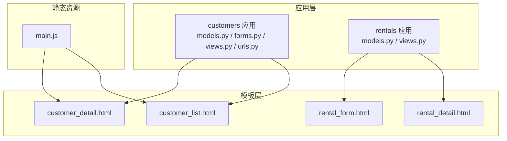
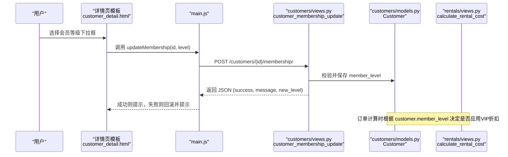
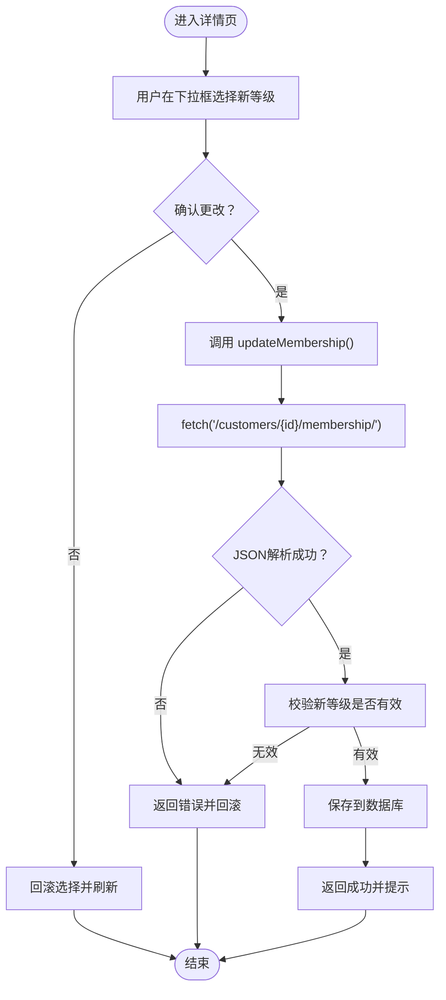
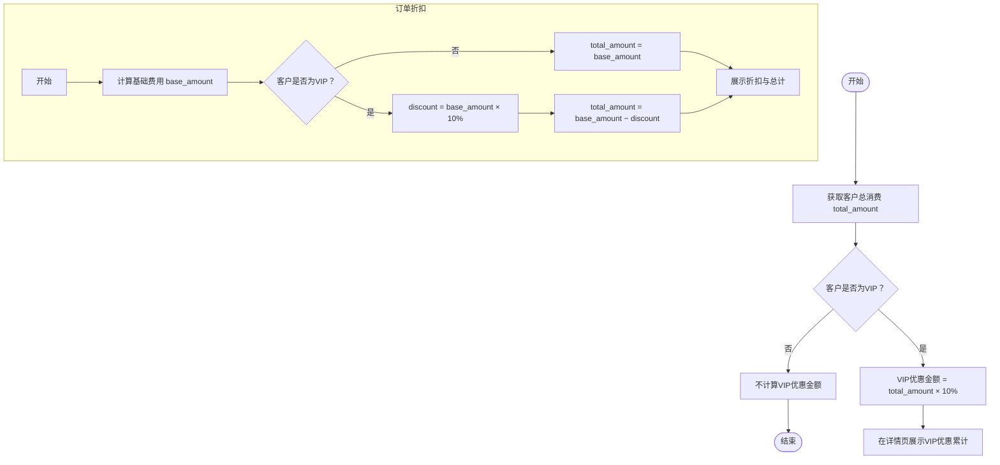
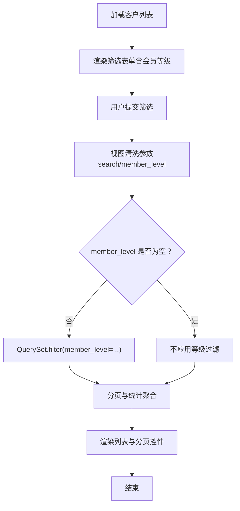
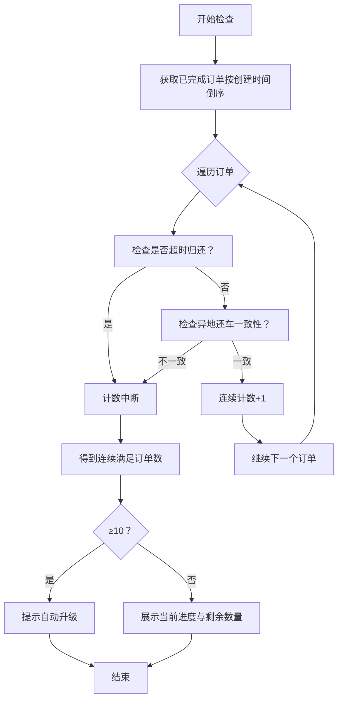
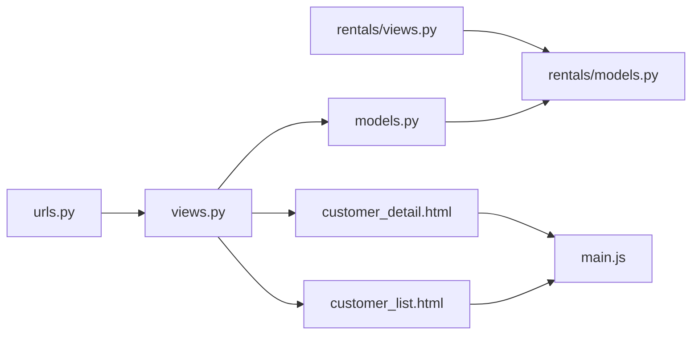

# 会员等级与VIP体系

<cite>
**本文引用的文件**
- [customers/models.py](file://code/car_rental_system/customers/models.py)
- [customers/forms.py](file://code/car_rental_system/customers/forms.py)
- [customers/views.py](file://code/car_rental_system/customers/views.py)
- [customers/urls.py](file://code/car_rental_system/customers/urls.py)
- [templates/customers/customer_detail.html](file://code/car_rental_system/templates/customers/customer_detail.html)
- [templates/customers/customer_list.html](file://code/car_rental_system/templates/customers/customer_list.html)
- [static/js/main.js](file://code/car_rental_system/static/js/main.js)
- [rentals/views.py](file://code/car_rental_system/rentals/views.py)
- [rentals/models.py](file://code/car_rental_system/rentals/models.py)
- [templates/rentals/rental_form.html](file://code/car_rental_system/templates/rentals/rental_form.html)
- [templates/rentals/rental_detail.html](file://code/car_rental_system/templates/rentals/rental_detail.html)
</cite>

## 目录
1. [引言](#引言)
2. [项目结构](#项目结构)
3. [核心组件](#核心组件)
4. [架构总览](#架构总览)
5. [详细组件分析](#详细组件分析)
6. [依赖关系分析](#依赖关系分析)
7. [性能考量](#性能考量)
8. [故障排查指南](#故障排查指南)
9. [结论](#结论)
10. [附录](#附录)

## 引言
本文件围绕“客户会员等级系统”的设计与实现进行深入解析，重点覆盖：
- Customer 模型中 member_level 字段的枚举设计与数据库存储
- 在界面中的展示方式（列表页与详情页）
- 通过 MembershipUpdateForm 表单与 Ajax 接口 customer_membership_update 实现的会员等级动态更新机制
- VIP 客户在系统中的特殊权益体现（折扣计算）及在客户详情页中 VIP 优惠金额的计算逻辑
- 模板文件中会员等级筛选功能在列表页的集成方式

## 项目结构
本系统采用 Django 应用分层组织，会员等级相关逻辑集中在 customers 应用；前端交互由模板与静态 JS 协同完成；折扣计算贯穿订单流程并在多个模板中呈现。

图表来源
- [customers/models.py](file://code/car_rental_system/customers/models.py#L1-L160)
- [customers/forms.py](file://code/car_rental_system/customers/forms.py#L1-L158)
- [customers/views.py](file://code/car_rental_system/customers/views.py#L1-L262)
- [customers/urls.py](file://code/car_rental_system/customers/urls.py#L1-L19)
- [templates/customers/customer_detail.html](file://code/car_rental_system/templates/customers/customer_detail.html#L1-L383)
- [templates/customers/customer_list.html](file://code/car_rental_system/templates/customers/customer_list.html#L1-L191)
- [static/js/main.js](file://code/car_rental_system/static/js/main.js#L1-L606)
- [rentals/views.py](file://code/car_rental_system/rentals/views.py#L487-L518)
- [rentals/models.py](file://code/car_rental_system/rentals/models.py#L1-L200)
- [templates/rentals/rental_form.html](file://code/car_rental_system/templates/rentals/rental_form.html#L264-L286)
- [templates/rentals/rental_detail.html](file://code/car_rental_system/templates/rentals/rental_detail.html#L279-L299)

章节来源
- [customers/models.py](file://code/car_rental_system/customers/models.py#L1-L160)
- [customers/forms.py](file://code/car_rental_system/customers/forms.py#L1-L158)
- [customers/views.py](file://code/car_rental_system/customers/views.py#L1-L262)
- [customers/urls.py](file://code/car_rental_system/customers/urls.py#L1-L19)
- [templates/customers/customer_detail.html](file://code/car_rental_system/templates/customers/customer_detail.html#L1-L383)
- [templates/customers/customer_list.html](file://code/car_rental_system/templates/customers/customer_list.html#L1-L191)
- [static/js/main.js](file://code/car_rental_system/static/js/main.js#L1-L606)
- [rentals/views.py](file://code/car_rental_system/rentals/views.py#L487-L518)
- [rentals/models.py](file://code/car_rental_system/rentals/models.py#L1-L200)
- [templates/rentals/rental_form.html](file://code/car_rental_system/templates/rentals/rental_form.html#L264-L286)
- [templates/rentals/rental_detail.html](file://code/car_rental_system/templates/rentals/rental_detail.html#L279-L299)

## 核心组件
- 会员等级枚举与模型字段
  - Customer 模型定义了 member_level 的枚举选项，并将其作为 CharField 存储，提供默认值与索引。
  - 通过 MEMBER_LEVEL_CHOICES 提供中文标签，便于在表单与模板中展示。
- 会员等级更新表单
  - MembershipUpdateForm 仅包含 member_level 字段，渲染为下拉选择框，用于在详情页动态更新。
- 列表页筛选表单
  - CustomerSearchForm 提供按会员等级筛选的下拉选项，来源于 Customer.MEMBER_LEVEL_CHOICES。
- Ajax 动态更新接口
  - customer_membership_update 接收 POST 请求，校验新等级是否合法，保存后返回 JSON 结果。
- 前端交互
  - customer_detail.html 中的会员等级下拉框绑定 onChange 事件，调用 updateMembership 函数，通过 fetch 发送 Ajax 请求，实现无刷新更新。
- VIP 折扣权益
  - 客户详情页统计 VIP 节省金额（基于总消费的 10%）。
  - 订单层面在计算费用时对 VIP 客户应用 10% 折扣。

章节来源
- [customers/models.py](file://code/car_rental_system/customers/models.py#L1-L160)
- [customers/forms.py](file://code/car_rental_system/customers/forms.py#L118-L158)
- [customers/views.py](file://code/car_rental_system/customers/views.py#L194-L231)
- [templates/customers/customer_detail.html](file://code/car_rental_system/templates/customers/customer_detail.html#L104-L113)
- [templates/customers/customer_list.html](file://code/car_rental_system/templates/customers/customer_list.html#L22-L31)
- [rentals/views.py](file://code/car_rental_system/rentals/views.py#L487-L518)

## 架构总览
会员等级系统涉及后端模型与视图、表单与模板、以及前端 JavaScript 的协同工作。

图表来源
- [templates/customers/customer_detail.html](file://code/car_rental_system/templates/customers/customer_detail.html#L104-L113)
- [static/js/main.js](file://code/car_rental_system/static/js/main.js#L446-L468)
- [customers/views.py](file://code/car_rental_system/customers/views.py#L194-L231)
- [customers/models.py](file://code/car_rental_system/customers/models.py#L1-L160)
- [rentals/views.py](file://code/car_rental_system/rentals/views.py#L487-L518)

## 详细组件分析

### 1) 会员等级枚举设计与存储
- 设计要点
  - 使用 ChoiceField 定义枚举，包含 NORMAL 与 VIP 两个选项，并提供中文标签。
  - 默认值为 NORMAL，确保新客户初始状态为普通会员。
  - 在 Meta 中为 member_level 建立索引，提升筛选与排序效率。
- 数据结构复杂度
  - 枚举为常量规模，查询与更新均为 O(1)。
  - 索引的存在使按等级筛选的成本显著降低。
- 业务意义
  - 为后续 VIP 升级条件判断与折扣计算提供基础。

章节来源
- [customers/models.py](file://code/car_rental_system/customers/models.py#L1-L160)

### 2) 会员等级动态更新机制（表单 + Ajax）
- 表单层
  - MembershipUpdateForm 仅包含 member_level 字段，渲染为带 id 的下拉框，便于前端脚本定位。
- 视图层
  - customer_membership_update 接收 JSON 请求体，校验新等级是否属于枚举，若合法则保存并返回成功信息；否则返回错误。
  - 对 JSON 解析异常与通用异常进行捕获，保证接口健壮性。
- 前端层
  - 详情页模板中，会员等级下拉框绑定 onChange 事件，调用 updateMembership。
  - updateMembership 使用 fetch 发起 POST 请求，携带 CSRF Token，处理响应并提示结果。
  - 若失败，会回滚选择并提示错误。
- 控制流图

图表来源
- [templates/customers/customer_detail.html](file://code/car_rental_system/templates/customers/customer_detail.html#L104-L113)
- [static/js/main.js](file://code/car_rental_system/static/js/main.js#L446-L468)
- [customers/views.py](file://code/car_rental_system/customers/views.py#L194-L231)

章节来源
- [customers/forms.py](file://code/car_rental_system/customers/forms.py#L138-L158)
- [customers/views.py](file://code/car_rental_system/customers/views.py#L194-L231)
- [templates/customers/customer_detail.html](file://code/car_rental_system/templates/customers/customer_detail.html#L104-L113)
- [static/js/main.js](file://code/car_rental_system/static/js/main.js#L446-L468)

### 3) VIP 客户的特殊权益与折扣计算
- 客户详情页 VIP 优惠金额
  - 统计客户总消费金额 total_amount，若客户为 VIP 且总消费大于 0，则 VIP 优惠金额 = total_amount × 10%。
  - 该金额在详情页“租赁统计”模块中单独展示，直观反映 VIP 历史优惠累积。
- 订单层面折扣
  - 在订单费用计算函数中，若客户为 VIP，则折扣 = 基础费用 × 10%，最终应付 = 基础费用 − 折扣。
  - 折扣在订单表单与订单详情页均以视觉化方式呈现，突出 VIP 权益。
- 折扣计算流程图

图表来源
- [customers/views.py](file://code/car_rental_system/customers/views.py#L79-L121)
- [rentals/views.py](file://code/car_rental_system/rentals/views.py#L487-L518)
- [templates/rentals/rental_form.html](file://code/car_rental_system/templates/rentals/rental_form.html#L264-L286)
- [templates/rentals/rental_detail.html](file://code/car_rental_system/templates/rentals/rental_detail.html#L279-L299)

章节来源
- [customers/views.py](file://code/car_rental_system/customers/views.py#L79-L121)
- [rentals/views.py](file://code/car_rental_system/rentals/views.py#L487-L518)
- [templates/rentals/rental_form.html](file://code/car_rental_system/templates/rentals/rental_form.html#L264-L286)
- [templates/rentals/rental_detail.html](file://code/car_rental_system/templates/rentals/rental_detail.html#L279-L299)

### 4) 会员等级筛选功能在列表页的集成
- 表单与选项
  - CustomerSearchForm 的 member_level 字段来源于 Customer.MEMBER_LEVEL_CHOICES，支持空值（全部）与两种等级。
- 模板渲染
  - customer_list.html 中的筛选表单读取 search_form.member_level 的 choices 并根据当前值设置 selected。
- 视图处理
  - customer_list 视图接收 GET 参数，若 member_level 非空则在 QuerySet 中过滤对应等级，再进行分页与统计聚合。
- 筛选流程图

图表来源
- [customers/forms.py](file://code/car_rental_system/customers/forms.py#L118-L136)
- [templates/customers/customer_list.html](file://code/car_rental_system/templates/customers/customer_list.html#L22-L31)
- [customers/views.py](file://code/car_rental_system/customers/views.py#L34-L76)

章节来源
- [customers/forms.py](file://code/car_rental_system/customers/forms.py#L118-L136)
- [templates/customers/customer_list.html](file://code/car_rental_system/templates/customers/customer_list.html#L22-L31)
- [customers/views.py](file://code/car_rental_system/customers/views.py#L34-L76)

### 5) VIP 升级条件与自动升级提示
- 升级条件
  - 连续 10 个已完成订单，满足：
    - 无超时归还（overdue_fee 为 0）
    - 无不诚信异地还车（实际还车地点与预期一致）
- 计算逻辑
  - 从最新订单开始向前遍历，累计连续满足条件的订单数，一旦遇到不满足即停止计数。
  - 若连续数达到 10，则视为满足升级条件。
- 详情页展示
  - 当客户非 VIP 时，若满足条件会在详情页显示“VIP升级资格”卡片，包含当前连续数与剩余需求数。
- 升级流程图

图表来源
- [customers/models.py](file://code/car_rental_system/customers/models.py#L101-L145)
- [templates/customers/customer_detail.html](file://code/car_rental_system/templates/customers/customer_detail.html#L141-L181)

章节来源
- [customers/models.py](file://code/car_rental_system/customers/models.py#L101-L145)
- [templates/customers/customer_detail.html](file://code/car_rental_system/templates/customers/customer_detail.html#L141-L181)

## 依赖关系分析
- 模块耦合
  - customers/views 依赖 customers/models 与 rentals/models（通过外键关系与统计聚合）。
  - 前端模板依赖 static/js/main.js 中的通用 Ajax 与提示函数。
- 外部依赖
  - Bootstrap 与 Font Awesome 通过 CDN 加载，提升前端体验。
- URL 映射
  - customers/urls.py 将 /customers/<int:pk>/membership/ 映射到 customer_membership_update 视图。

图表来源
- [customers/urls.py](file://code/car_rental_system/customers/urls.py#L1-L19)
- [customers/views.py](file://code/car_rental_system/customers/views.py#L1-L262)
- [customers/models.py](file://code/car_rental_system/customers/models.py#L1-L160)
- [templates/customers/customer_detail.html](file://code/car_rental_system/templates/customers/customer_detail.html#L1-L383)
- [templates/customers/customer_list.html](file://code/car_rental_system/templates/customers/customer_list.html#L1-L191)
- [static/js/main.js](file://code/car_rental_system/static/js/main.js#L1-L606)
- [rentals/views.py](file://code/car_rental_system/rentals/views.py#L487-L518)
- [rentals/models.py](file://code/car_rental_system/rentals/models.py#L1-L200)

章节来源
- [customers/urls.py](file://code/car_rental_system/customers/urls.py#L1-L19)
- [customers/views.py](file://code/car_rental_system/customers/views.py#L1-L262)
- [customers/models.py](file://code/car_rental_system/customers/models.py#L1-L160)
- [templates/customers/customer_detail.html](file://code/car_rental_system/templates/customers/customer_detail.html#L1-L383)
- [templates/customers/customer_list.html](file://code/car_rental_system/templates/customers/customer_list.html#L1-L191)
- [static/js/main.js](file://code/car_rental_system/static/js/main.js#L1-L606)
- [rentals/views.py](file://code/car_rental_system/rentals/views.py#L487-L518)
- [rentals/models.py](file://code/car_rental_system/rentals/models.py#L1-L200)

## 性能考量
- 查询优化
  - 列表页使用 select_related 与 annotate 进行聚合统计，避免 N+1 查询问题。
  - 为 member_level 建立索引，提升筛选与排序性能。
- 前端交互
  - 使用 fetch 发起 Ajax 请求，避免整页刷新，提升用户体验。
- 计算成本
  - VIP 折扣与升级条件计算为线性扫描，受订单数量影响；可通过缓存或定时任务优化。

[本节为通用指导，无需列出具体文件来源]

## 故障排查指南
- Ajax 更新失败
  - 检查请求体 JSON 格式与 member_level 是否在枚举范围内。
  - 查看视图返回的错误信息，确认异常类型（解析错误或通用异常）。
- 前端提示未出现
  - 确认 main.js 中的 showAlert 调用链与模板中的 updateMembership 函数是否正确执行。
  - 检查 CSRF Token 是否随请求发送。
- 列表筛选无效
  - 确认模板中筛选表单的 name 与 value 与视图清洗逻辑一致。
  - 检查 URL 参数是否正确传递到分页链接。

章节来源
- [customers/views.py](file://code/car_rental_system/customers/views.py#L194-L231)
- [static/js/main.js](file://code/car_rental_system/static/js/main.js#L446-L468)
- [templates/customers/customer_list.html](file://code/car_rental_system/templates/customers/customer_list.html#L22-L31)

## 结论
该会员等级系统以简洁的枚举设计为基础，结合表单与 Ajax 实现了会员等级的即时更新；在详情页与订单层面分别体现了 VIP 的历史优惠与实时折扣权益；列表页集成了会员等级筛选，便于运营人员快速定位目标客户。整体架构清晰、扩展性强，具备良好的可维护性与用户体验。

[本节为总结性内容，无需列出具体文件来源]

## 附录
- 关键路径参考
  - 会员等级枚举与模型字段：[customers/models.py](file://code/car_rental_system/customers/models.py#L1-L160)
  - 会员等级更新表单：[customers/forms.py](file://code/car_rental_system/customers/forms.py#L138-L158)
  - Ajax 更新接口：[customers/views.py](file://code/car_rental_system/customers/views.py#L194-L231)
  - 详情页动态更新交互：[templates/customers/customer_detail.html](file://code/car_rental_system/templates/customers/customer_detail.html#L104-L113)、[static/js/main.js](file://code/car_rental_system/static/js/main.js#L446-L468)
  - VIP 优惠金额计算：[customers/views.py](file://code/car_rental_system/customers/views.py#L79-L121)
  - 订单折扣计算：[rentals/views.py](file://code/car_rental_system/rentals/views.py#L487-L518)
  - 列表页筛选集成：[templates/customers/customer_list.html](file://code/car_rental_system/templates/customers/customer_list.html#L22-L31)、[customers/forms.py](file://code/car_rental_system/customers/forms.py#L118-L136)