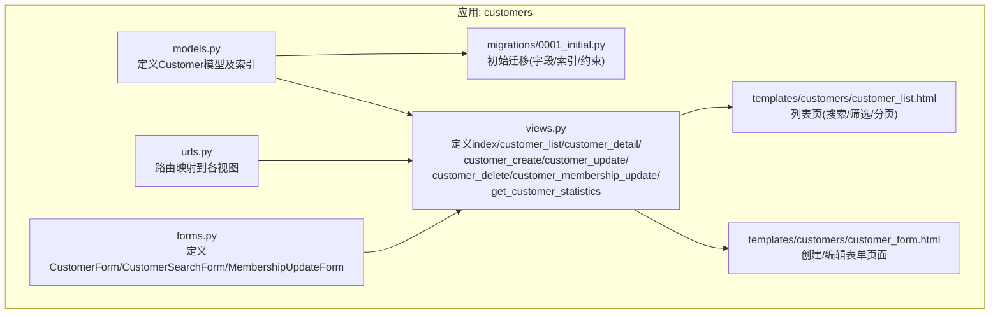
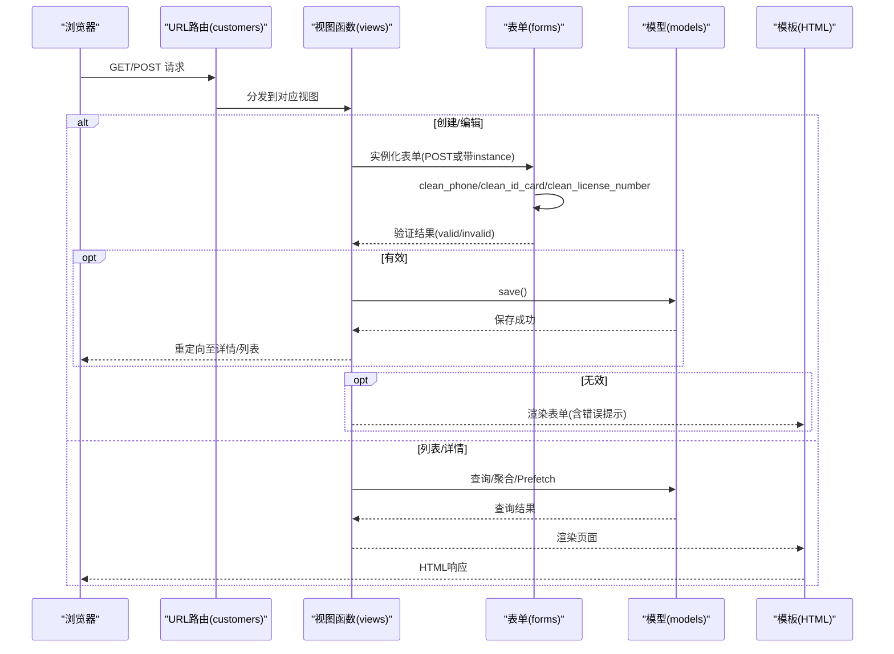
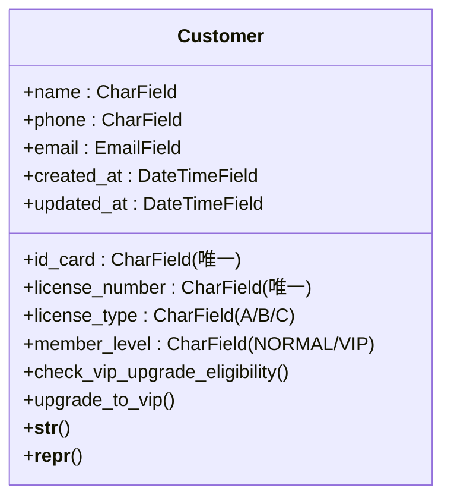
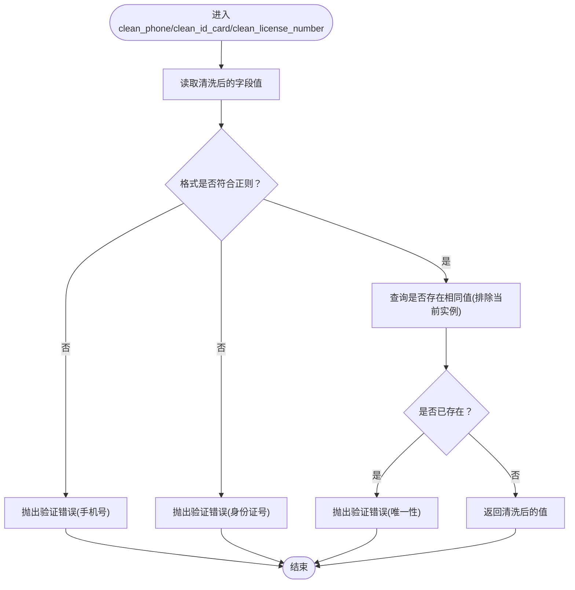
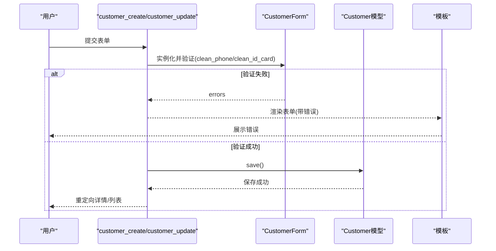
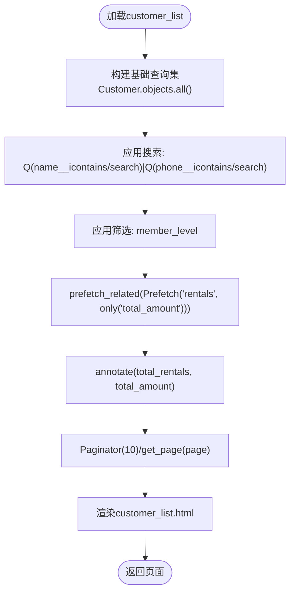
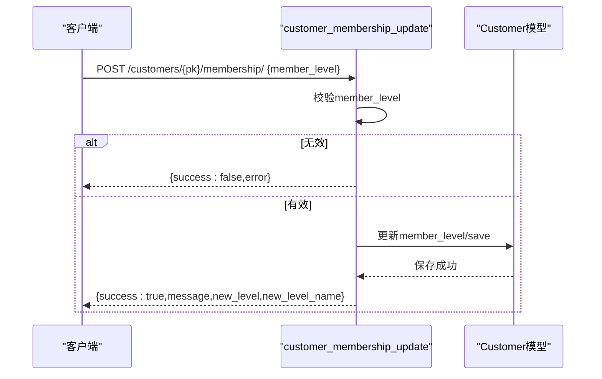
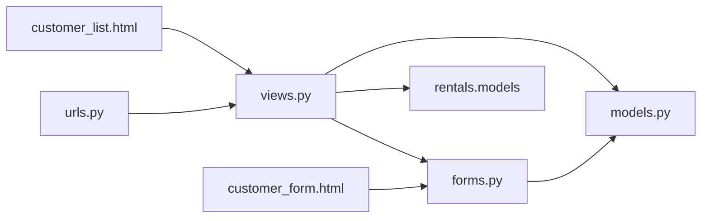

# 客户基本信息管理

<cite>
**本文引用的文件**
- [models.py](file://code/car_rental_system/customers/models.py)
- [forms.py](file://code/car_rental_system/customers/forms.py)
- [views.py](file://code/car_rental_system/customers/views.py)
- [urls.py](file://code/car_rental_system/customers/urls.py)
- [customer_form.html](file://code/car_rental_system/templates/customers/customer_form.html)
- [customer_list.html](file://code/car_rental_system/templates/customers/customer_list.html)
- [0001_initial.py](file://code/car_rental_system/customers/migrations/0001_initial.py)
- [test_customer_management.py](file://code/car_rental_system/test_customer_management.py)
</cite>

## 目录
1. [简介](#简介)
2. [项目结构](#项目结构)
3. [核心组件](#核心组件)
4. [架构总览](#架构总览)
5. [详细组件分析](#详细组件分析)
6. [依赖关系分析](#依赖关系分析)
7. [性能考量](#性能考量)
8. [故障排查指南](#故障排查指南)
9. [结论](#结论)
10. [附录](#附录)

## 简介
本文件系统化阐述“客户基本信息管理”功能的实现机制，围绕 Customer 模型的字段设计与验证规则、CustomerForm 表单的正则与唯一性校验、创建与编辑的数据处理流程、customer_create 与 customer_update 视图的前后端交互与错误处理、客户列表页的分页、搜索与筛选，以及通过 Prefetch 优化查询避免 N+1 的实践进行深入解析，并辅以可视化图示帮助理解。

## 项目结构
客户管理模块位于 customers 应用下，包含模型、表单、视图、URL、模板与迁移文件，形成清晰的 MVC 分层与职责边界。

图表来源
- [models.py](file://code/car_rental_system/customers/models.py#L1-L160)
- [forms.py](file://code/car_rental_system/customers/forms.py#L1-L158)
- [views.py](file://code/car_rental_system/customers/views.py#L1-L262)
- [urls.py](file://code/car_rental_system/customers/urls.py#L1-L19)
- [customer_form.html](file://code/car_rental_system/templates/customers/customer_form.html#L1-L232)
- [customer_list.html](file://code/car_rental_system/templates/customers/customer_list.html#L1-L191)
- [0001_initial.py](file://code/car_rental_system/customers/migrations/0001_initial.py#L1-L38)

章节来源
- [models.py](file://code/car_rental_system/customers/models.py#L1-L160)
- [forms.py](file://code/car_rental_system/customers/forms.py#L1-L158)
- [views.py](file://code/car_rental_system/customers/views.py#L1-L262)
- [urls.py](file://code/car_rental_system/customers/urls.py#L1-L19)
- [customer_form.html](file://code/car_rental_system/templates/customers/customer_form.html#L1-L232)
- [customer_list.html](file://code/car_rental_system/templates/customers/customer_list.html#L1-L191)
- [0001_initial.py](file://code/car_rental_system/customers/migrations/0001_initial.py#L1-L38)

## 核心组件
- Customer 模型：定义客户姓名、电话、邮箱、身份证号、驾照信息、会员等级等字段，内置正则验证器与唯一性约束，并提供会员升级与统计辅助方法。
- CustomerForm 表单：对手机号、身份证号、驾驶证号进行格式与唯一性校验；对会员等级等字段提供标签、帮助文本与渲染控件。
- 视图函数：提供首页、列表、详情、创建、编辑、删除、会员等级 Ajax 更新与统计接口；列表页采用 Prefetch 与聚合统计避免 N+1。
- URL 映射：将前端请求路由到对应视图。
- 模板：表单模板负责展示字段、错误提示与填写说明；列表模板负责搜索、筛选、分页与统计列。

章节来源
- [models.py](file://code/car_rental_system/customers/models.py#L1-L160)
- [forms.py](file://code/car_rental_system/customers/forms.py#L1-L158)
- [views.py](file://code/car_rental_system/customers/views.py#L1-L262)
- [urls.py](file://code/car_rental_system/customers/urls.py#L1-L19)
- [customer_form.html](file://code/car_rental_system/templates/customers/customer_form.html#L1-L232)
- [customer_list.html](file://code/car_rental_system/templates/customers/customer_list.html#L1-L191)

## 架构总览
从前端到后端的数据流如下：浏览器发起请求到 URL，由路由分发到视图；视图根据请求方法与参数调用表单或模型；表单负责字段验证与唯一性检查；模型负责持久化与约束；模板负责渲染响应。

图表来源
- [urls.py](file://code/car_rental_system/customers/urls.py#L1-L19)
- [views.py](file://code/car_rental_system/customers/views.py#L124-L162)
- [forms.py](file://code/car_rental_system/customers/forms.py#L59-L115)
- [models.py](file://code/car_rental_system/customers/models.py#L1-L160)
- [customer_form.html](file://code/car_rental_system/templates/customers/customer_form.html#L1-L232)
- [customer_list.html](file://code/car_rental_system/templates/customers/customer_list.html#L1-L191)

## 详细组件分析

### Customer 模型字段设计与验证规则
- 字段与约束
  - 姓名：CharField，最大长度 100，必填。
  - 电话：CharField，最大长度 20，必填；使用正则验证器确保 11 位手机号格式；支持空值/非空配置。
  - 邮箱：EmailField，允许为空。
  - 身份证号：CharField，长度 18，唯一；使用正则验证器确保 18 位格式；唯一性约束由数据库保证。
  - 驾驶证号：CharField，最大长度 20，唯一；唯一性约束由数据库保证。
  - 驱动类型：CharField，枚举选项 A/B/C，默认 C。
  - 会员等级：CharField，枚举 NORMAL/VIP，默认 NORMAL。
  - 时间戳：created_at、updated_at。
- 索引与排序
  - 数据库索引：id_card、license_number、phone、member_level。
  - 默认排序：按创建时间倒序。
- 业务方法
  - 检查 VIP 升级条件：基于已完成订单的诚信度与是否超时归还进行连续计数判断。
  - 升级为 VIP：当非 VIP 时更新会员等级并保存。

图表来源
- [models.py](file://code/car_rental_system/customers/models.py#L1-L160)
- [0001_initial.py](file://code/car_rental_system/customers/migrations/0001_initial.py#L1-L38)

章节来源
- [models.py](file://code/car_rental_system/customers/models.py#L1-L160)
- [0001_initial.py](file://code/car_rental_system/customers/migrations/0001_initial.py#L1-L38)

### CustomerForm 表单验证逻辑
- 字段与渲染
  - 字段集合：name、phone、email、id_card、license_number、license_type、member_level。
  - 控件与标签、帮助文本、占位符均在表单中定义。
- 手机号验证
  - 正则：11 位数字，以 1 开头，第二位 3-9。
  - 唯一性：排除当前编辑对象的主键，防止自更新冲突。
- 身份证号验证
  - 正则：18 位标准格式。
  - 唯一性：排除当前编辑对象的主键。
- 驾驶证号验证
  - 唯一性：排除当前编辑对象的主键。
- 会员等级更新表单
  - MembershipUpdateForm 用于 Ajax 更新会员等级，字段必填。

图表来源
- [forms.py](file://code/car_rental_system/customers/forms.py#L59-L115)

章节来源
- [forms.py](file://code/car_rental_system/customers/forms.py#L1-L158)

### 创建与编辑客户的数据处理流程
- customer_create
  - POST：实例化表单，若验证通过则保存，成功后跳转至详情页并显示成功消息。
  - GET：渲染空表单。
- customer_update
  - POST：以 instance=customer 实例化表单，验证通过后保存并跳转详情。
  - GET：渲染已填充数据的表单。
- 错误处理
  - 表单验证失败时，回显错误信息并保留输入。
  - 成功时使用消息框架提示用户。

图表来源
- [views.py](file://code/car_rental_system/customers/views.py#L124-L162)
- [forms.py](file://code/car_rental_system/customers/forms.py#L59-L115)
- [customer_form.html](file://code/car_rental_system/templates/customers/customer_form.html#L1-L232)

章节来源
- [views.py](file://code/car_rental_system/customers/views.py#L124-L162)
- [customer_form.html](file://code/car_rental_system/templates/customers/customer_form.html#L1-L232)

### 客户列表页的分页、搜索与筛选，以及 Prefetch 优化
- 搜索与筛选
  - 支持按姓名或手机号模糊搜索；支持按会员等级筛选。
  - 使用 Q 查询组合姓名与手机号的 OR 条件。
- 统计与聚合
  - 使用 annotate 对每个客户进行 Count('rentals') 与 Sum('rentals__total_amount')，避免 N+1。
- Prefetch 优化
  - 使用 Prefetch('rentals', queryset=Rental.objects.only('total_amount')) 减少额外字段查询。
- 分页
  - 每页 10 条；在搜索/筛选条件下正确计算总数与页码。
- 模板渲染
  - 展示客户基本信息、联系方式、会员等级、租赁次数与累计消费、操作按钮。

图表来源
- [views.py](file://code/car_rental_system/customers/views.py#L34-L76)
- [customer_list.html](file://code/car_rental_system/templates/customers/customer_list.html#L1-L191)

章节来源
- [views.py](file://code/car_rental_system/customers/views.py#L34-L76)
- [customer_list.html](file://code/car_rental_system/templates/customers/customer_list.html#L1-L191)

### 会员等级 Ajax 更新与错误处理
- 接口
  - POST customers:<pk>/membership/，接收 JSON {member_level}。
- 校验
  - 仅接受合法枚举值；否则返回错误。
- 更新
  - 成功时返回新等级名称与消息。
- 异常
  - JSON 解析失败、其他异常均返回错误信息。

图表来源
- [views.py](file://code/car_rental_system/customers/views.py#L194-L231)

章节来源
- [views.py](file://code/car_rental_system/customers/views.py#L194-L231)

### 客户详情页与统计
- 详情页
  - 展示客户基本信息与关联车辆的租赁记录，按创建时间倒序。
  - 统计：总租赁次数、总消费金额、按状态分组统计。
  - VIP 节省金额：假设 VIP 享受 9 折优惠。
  - VIP 升级条件检查：基于已完成订单的诚信度与是否超时归还进行连续计数。
- 业务方法
  - check_vip_upgrade_eligibility：返回是否满足升级条件与连续诚信订单数。
  - upgrade_to_vip：非 VIP 时更新等级。

章节来源
- [views.py](file://code/car_rental_system/customers/views.py#L79-L121)
- [models.py](file://code/car_rental_system/customers/models.py#L101-L153)

## 依赖关系分析
- 视图依赖
  - views 依赖 models、forms、rentals.models（用于统计与升级条件）。
- 表单依赖
  - forms 依赖 models.Customer，用于唯一性校验与字段定义。
- 模板依赖
  - customer_form.html 依赖 CustomerForm 字段与错误展示。
  - customer_list.html 依赖搜索表单与分页对象。
- URL 依赖
  - urls.py 将路径映射到 views 中的具体函数。

图表来源
- [views.py](file://code/car_rental_system/customers/views.py#L1-L262)
- [forms.py](file://code/car_rental_system/customers/forms.py#L1-L158)
- [models.py](file://code/car_rental_system/customers/models.py#L1-L160)
- [urls.py](file://code/car_rental_system/customers/urls.py#L1-L19)
- [customer_form.html](file://code/car_rental_system/templates/customers/customer_form.html#L1-L232)
- [customer_list.html](file://code/car_rental_system/templates/customers/customer_list.html#L1-L191)

章节来源
- [views.py](file://code/car_rental_system/customers/views.py#L1-L262)
- [forms.py](file://code/car_rental_system/customers/forms.py#L1-L158)
- [models.py](file://code/car_rental_system/customers/models.py#L1-L160)
- [urls.py](file://code/car_rental_system/customers/urls.py#L1-L19)
- [customer_form.html](file://code/car_rental_system/templates/customers/customer_form.html#L1-L232)
- [customer_list.html](file://code/car_rental_system/templates/customers/customer_list.html#L1-L191)

## 性能考量
- 避免 N+1 查询
  - 在列表页使用 prefetch_related + annotate，一次性获取每个客户的租赁数量与总金额，避免循环访问导致的多次查询。
- 索引优化
  - 数据库层面为 id_card、license_number、phone、member_level 建立索引，提升搜索与筛选效率。
- 聚合统计
  - 使用 Count/Sum 聚合减少 ORM 循环遍历带来的开销。
- 分页
  - Paginator 控制每页数量，避免一次性加载过多数据。

章节来源
- [views.py](file://code/car_rental_system/customers/views.py#L34-L76)
- [models.py](file://code/car_rental_system/customers/models.py#L89-L100)
- [0001_initial.py](file://code/car_rental_system/customers/migrations/0001_initial.py#L1-L38)

## 故障排查指南
- 表单验证失败
  - 手机号/身份证号格式错误：检查正则表达式是否匹配输入。
  - 唯一性冲突：确认目标值是否已被其他客户占用；编辑时需排除当前记录主键。
- 列表页空白或统计异常
  - 检查搜索/筛选参数是否正确传递；确认 annotate 是否生效。
  - 确认 Prefetch 的字段仅包含必要字段，避免多余查询。
- 会员等级更新失败
  - 确认请求体 JSON 结构与字段名；检查枚举值是否合法。
  - 捕获异常并查看返回的错误信息。
- 删除客户失败
  - 若存在未完成的租赁订单，系统会阻止删除并提示原因。

章节来源
- [forms.py](file://code/car_rental_system/customers/forms.py#L59-L115)
- [views.py](file://code/car_rental_system/customers/views.py#L165-L191)
- [views.py](file://code/car_rental_system/customers/views.py#L194-L231)
- [test_customer_management.py](file://code/car_rental_system/test_customer_management.py#L1-L224)

## 结论
本功能通过严谨的模型字段设计与表单验证、完善的视图处理流程、以及列表页的 Prefetch 与聚合统计，实现了高效稳定的客户基本信息管理。手机号与身份证号的双重正则与唯一性校验保障了数据质量；列表页的搜索、筛选与分页提升了用户体验；Ajax 会员等级更新提供了便捷的后台维护能力。建议在后续迭代中持续关注索引覆盖与查询计划，以进一步优化复杂场景下的性能表现。

## 附录
- 关键实现位置参考
  - 模型字段与验证：[models.py](file://code/car_rental_system/customers/models.py#L1-L160)
  - 表单验证与渲染：[forms.py](file://code/car_rental_system/customers/forms.py#L1-L158)
  - 列表页与统计：[views.py](file://code/car_rental_system/customers/views.py#L34-L76)
  - 创建/编辑流程：[views.py](file://code/car_rental_system/customers/views.py#L124-L162)
  - 会员等级 Ajax 更新：[views.py](file://code/car_rental_system/customers/views.py#L194-L231)
  - URL 映射：[urls.py](file://code/car_rental_system/customers/urls.py#L1-L19)
  - 表单模板：[customer_form.html](file://code/car_rental_system/templates/customers/customer_form.html#L1-L232)
  - 列表模板：[customer_list.html](file://code/car_rental_system/templates/customers/customer_list.html#L1-L191)
  - 初始迁移（字段/索引/约束）：[0001_initial.py](file://code/car_rental_system/customers/migrations/0001_initial.py#L1-L38)
  - 功能测试脚本：[test_customer_management.py](file://code/car_rental_system/test_customer_management.py#L1-L224)