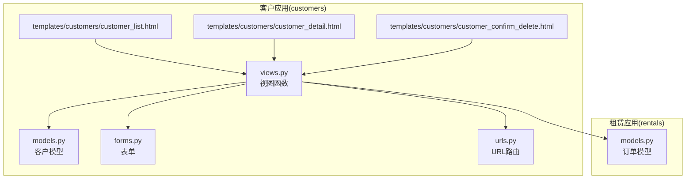
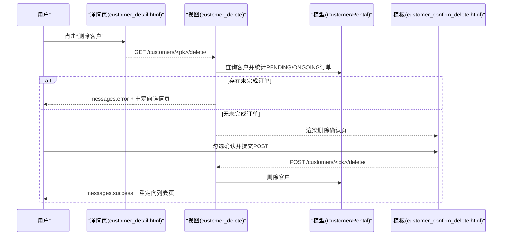
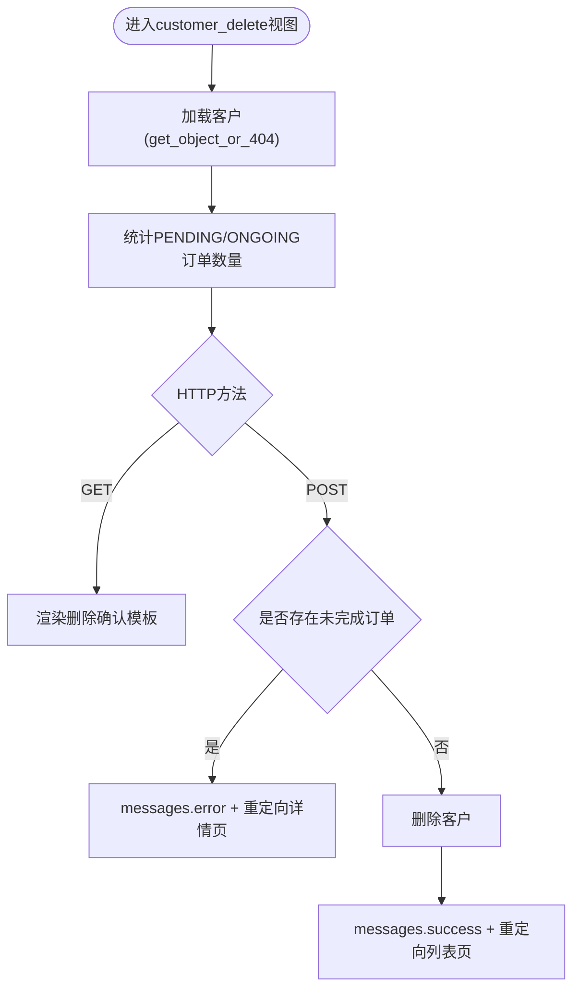
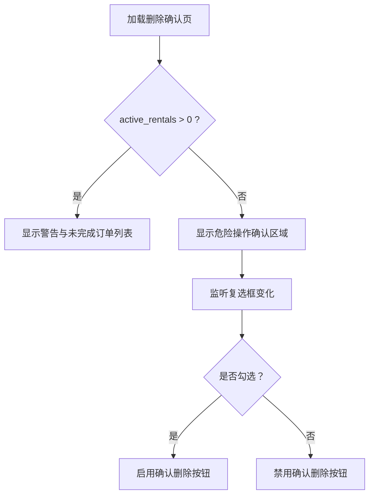
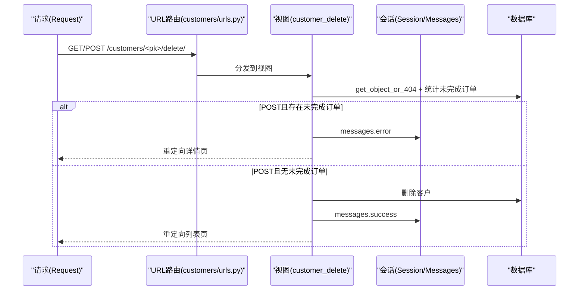
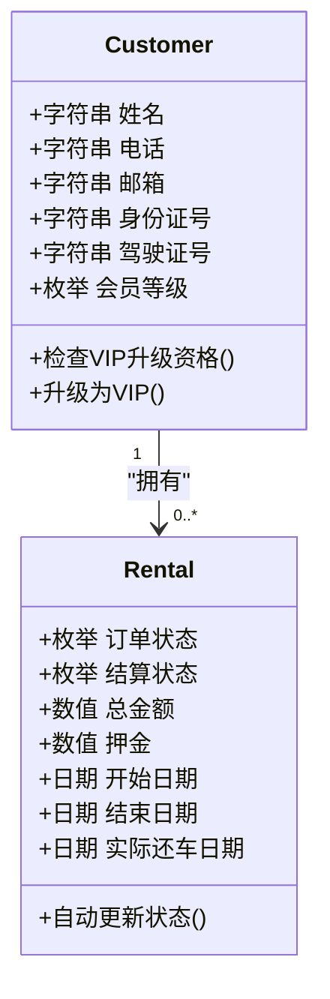
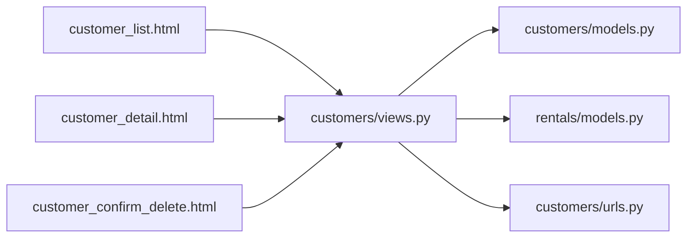

# 客户生命周期管理

<cite>
**本文引用的文件**
- [customers/views.py](file://code/car_rental_system/customers/views.py)
- [customers/models.py](file://code/car_rental_system/customers/models.py)
- [rentals/models.py](file://code/car_rental_system/rentals/models.py)
- [templates/customers/customer_confirm_delete.html](file://code/car_rental_system/templates/customers/customer_confirm_delete.html)
- [templates/customers/customer_detail.html](file://code/car_rental_system/templates/customers/customer_detail.html)
- [templates/customers/customer_list.html](file://code/car_rental_system/templates/customers/customer_list.html)
- [customers/urls.py](file://code/car_rental_system/customers/urls.py)
- [customers/forms.py](file://code/car_rental_system/customers/forms.py)
- [test_customer_management.py](file://code/car_rental_system/test_customer_management.py)
</cite>

## 目录
1. [引言](#引言)
2. [项目结构](#项目结构)
3. [核心组件](#核心组件)
4. [架构总览](#架构总览)
5. [详细组件分析](#详细组件分析)
6. [依赖关系分析](#依赖关系分析)
7. [性能考量](#性能考量)
8. [故障排查指南](#故障排查指南)
9. [结论](#结论)
10. [附录](#附录)

## 引言
本文件系统化阐述客户全生命周期管理流程，重点聚焦“客户删除”前的业务规则校验机制。文档围绕以下目标展开：
- 明确客户删除前的业务规则：禁止删除存在未完成（PENDING/ONGOING）租赁订单的客户。
- 解释customer_delete视图如何检查未完成订单并据此决定是否允许删除。
- 描述删除确认页面的交互设计与错误提示机制。
- 结合Django的get_object_or_404与messages框架，说明安全删除流程的实现。
- 总结客户创建、更新、删除操作中的异常处理与用户反馈机制。

## 项目结构
本系统采用Django应用分层组织，客户模块位于customers子目录，包含模型、视图、表单、模板与URL配置；租赁模块位于rentals子目录，提供订单状态与财务相关模型；前端模板位于templates/customers下，负责展示与交互。

图表来源
- [customers/views.py](file://code/car_rental_system/customers/views.py#L1-L262)
- [customers/models.py](file://code/car_rental_system/customers/models.py#L1-L160)
- [rentals/models.py](file://code/car_rental_system/rentals/models.py#L1-L401)
- [customers/urls.py](file://code/car_rental_system/customers/urls.py#L1-L19)
- [templates/customers/customer_list.html](file://code/car_rental_system/templates/customers/customer_list.html#L1-L191)
- [templates/customers/customer_detail.html](file://code/car_rental_system/templates/customers/customer_detail.html#L1-L383)
- [templates/customers/customer_confirm_delete.html](file://code/car_rental_system/templates/customers/customer_confirm_delete.html#L1-L166)

章节来源
- [customers/views.py](file://code/car_rental_system/customers/views.py#L1-L262)
- [customers/models.py](file://code/car_rental_system/customers/models.py#L1-L160)
- [rentals/models.py](file://code/car_rental_system/rentals/models.py#L1-L401)
- [customers/urls.py](file://code/car_rental_system/customers/urls.py#L1-L19)

## 核心组件
- 客户模型（Customer）：定义客户基本信息、会员等级、索引与VIP升级策略。
- 订单模型（Rental）：定义订单状态（含PENDING/ONGOING/OVERDUE/COMPLETED/CANCELLED）、结算状态、财务字段与自动状态更新逻辑。
- 客户视图（customer_delete）：实现删除前的业务规则校验与安全删除流程。
- 删除确认模板（customer_confirm_delete.html）：渲染删除确认页面，展示未完成订单并提供交互控件。
- 客户详情模板（customer_detail.html）：提供删除入口与未完成订单概览。
- 客户列表模板（customer_list.html）：提供批量管理入口。
- URL路由（customers/urls.py）：将删除请求映射到视图。
- 表单（CustomerForm）：在创建/更新时进行字段级验证与唯一性约束。

章节来源
- [customers/models.py](file://code/car_rental_system/customers/models.py#L1-L160)
- [rentals/models.py](file://code/car_rental_system/rentals/models.py#L1-L170)
- [customers/views.py](file://code/car_rental_system/customers/views.py#L165-L191)
- [templates/customers/customer_confirm_delete.html](file://code/car_rental_system/templates/customers/customer_confirm_delete.html#L1-L166)
- [templates/customers/customer_detail.html](file://code/car_rental_system/templates/customers/customer_detail.html#L324-L331)
- [templates/customers/customer_list.html](file://code/car_rental_system/templates/customers/customer_list.html#L112-L126)
- [customers/urls.py](file://code/car_rental_system/customers/urls.py#L9-L19)
- [customers/forms.py](file://code/car_rental_system/customers/forms.py#L1-L158)

## 架构总览
客户生命周期管理以“视图-模型-模板”三层协作为主，删除流程的关键路径如下：
- 用户在客户详情页点击删除按钮，进入删除确认页。
- 视图加载客户并统计其PENDING/ONGOING订单数量。
- 若存在未完成订单，视图通过messages框架提示错误并返回详情页。
- 若无未完成订单，用户勾选确认后提交表单，视图执行删除并提示成功，跳转列表页。

图表来源
- [templates/customers/customer_detail.html](file://code/car_rental_system/templates/customers/customer_detail.html#L324-L331)
- [customers/views.py](file://code/car_rental_system/customers/views.py#L165-L191)
- [templates/customers/customer_confirm_delete.html](file://code/car_rental_system/templates/customers/customer_confirm_delete.html#L1-L166)
- [customers/models.py](file://code/car_rental_system/customers/models.py#L1-L160)
- [rentals/models.py](file://code/car_rental_system/rentals/models.py#L1-L170)

## 详细组件分析

### 客户删除业务规则与视图实现
- 业务规则：禁止删除存在未完成（PENDING/ONGOING）租赁订单的客户。
- 视图逻辑：
  - 使用get_object_or_404确保客户存在，否则抛出404。
  - 统计客户关联的PENDING/ONGOING订单数量。
  - 若POST请求且存在未完成订单，通过messages.error提示并重定向详情页。
  - 若POST请求且无未完成订单，执行删除并通过messages.success提示，重定向列表页。
  - 若GET请求，渲染删除确认模板并传入客户与未完成订单数。

图表来源
- [customers/views.py](file://code/car_rental_system/customers/views.py#L165-L191)

章节来源
- [customers/views.py](file://code/car_rental_system/customers/views.py#L165-L191)

### 删除确认页面交互与错误提示
- 页面结构：
  - 当存在未完成订单时，显示警告提示与相关订单表格，阻止继续删除。
  - 当无未完成订单时，展示危险操作确认区域、客户信息与租赁记录统计，并提供确认复选框与提交按钮。
- 交互逻辑：
  - 复选框勾选后才启用“确认删除”按钮，防止误删。
  - 提交后由视图执行删除并返回消息。

图表来源
- [templates/customers/customer_confirm_delete.html](file://code/car_rental_system/templates/customers/customer_confirm_delete.html#L1-L166)

章节来源
- [templates/customers/customer_confirm_delete.html](file://code/car_rental_system/templates/customers/customer_confirm_delete.html#L1-L166)

### 安全删除流程与Django框架集成
- get_object_or_404：保证删除对象存在，避免空引用与越权访问。
- messages框架：统一错误与成功提示，提升用户体验与可追溯性。
- URL路由：将删除请求映射到customer_delete视图，确保路径规范与命名空间隔离。

图表来源
- [customers/urls.py](file://code/car_rental_system/customers/urls.py#L9-L19)
- [customers/views.py](file://code/car_rental_system/customers/views.py#L165-L191)

章节来源
- [customers/urls.py](file://code/car_rental_system/customers/urls.py#L9-L19)
- [customers/views.py](file://code/car_rental_system/customers/views.py#L165-L191)

### 客户创建、更新、删除的异常处理与用户反馈
- 创建与更新：
  - 使用CustomerForm进行字段级验证（手机号、身份证、驾驶证号的格式与唯一性）。
  - 成功时通过messages.success提示，失败时表单回显错误信息。
- 删除：
  - 通过messages.error提示未完成订单导致的删除失败。
  - 成功删除后通过messages.success提示并跳转列表页。
- 测试覆盖：
  - 单元测试脚本对CRUD流程、表单验证、搜索、分页与统计数据进行验证，保障流程稳定性。

章节来源
- [customers/forms.py](file://code/car_rental_system/customers/forms.py#L1-L158)
- [customers/views.py](file://code/car_rental_system/customers/views.py#L124-L162)
- [test_customer_management.py](file://code/car_rental_system/test_customer_management.py#L1-L224)

### 客户与订单的数据模型关系
- 客户与订单是一对多关系：Customer → rentals。
- 订单状态枚举包含PENDING/ONGOING/OVERDUE/COMPLETED/CANCELLED，删除前仅关注PENDING/ONGOING两类。
- VIP升级策略与订单历史统计在客户模型中实现，辅助删除决策（例如避免删除高价值VIP客户）。

图表来源
- [customers/models.py](file://code/car_rental_system/customers/models.py#L1-L160)
- [rentals/models.py](file://code/car_rental_system/rentals/models.py#L1-L170)

章节来源
- [customers/models.py](file://code/car_rental_system/customers/models.py#L1-L160)
- [rentals/models.py](file://code/car_rental_system/rentals/models.py#L1-L170)

## 依赖关系分析
- 视图依赖：
  - customers/views.py依赖customers/models.py与rentals/models.py，用于查询客户与其订单状态。
  - 视图依赖Django内置的get_object_or_404与messages框架。
- 模板依赖：
  - customer_confirm_delete.html依赖customer_detail.html的删除入口与上下文变量。
  - customer_detail.html提供删除入口与未完成订单概览。
  - customer_list.html提供批量管理入口。
- URL依赖：
  - customers/urls.py将删除请求映射到customer_delete视图。

图表来源
- [customers/views.py](file://code/car_rental_system/customers/views.py#L1-L262)
- [customers/models.py](file://code/car_rental_system/customers/models.py#L1-L160)
- [rentals/models.py](file://code/car_rental_system/rentals/models.py#L1-L401)
- [customers/urls.py](file://code/car_rental_system/customers/urls.py#L1-L19)
- [templates/customers/customer_list.html](file://code/car_rental_system/templates/customers/customer_list.html#L112-L126)
- [templates/customers/customer_detail.html](file://code/car_rental_system/templates/customers/customer_detail.html#L324-L331)
- [templates/customers/customer_confirm_delete.html](file://code/car_rental_system/templates/customers/customer_confirm_delete.html#L1-L166)

章节来源
- [customers/views.py](file://code/car_rental_system/customers/views.py#L1-L262)
- [customers/urls.py](file://code/car_rental_system/customers/urls.py#L1-L19)

## 性能考量
- 查询优化：
  - 在客户列表页使用prefetch_related与annotate减少N+1查询，提高分页与统计效率。
  - 在删除确认页仅统计PENDING/ONGOING订单数量，避免加载完整订单列表。
- 状态更新：
  - 订单状态自动更新使用缓存限制更新频率，降低数据库压力。
- 前端交互：
  - 删除确认页通过JavaScript启用/禁用按钮，减少无效提交。

章节来源
- [customers/views.py](file://code/car_rental_system/customers/views.py#L34-L76)
- [rentals/models.py](file://code/car_rental_system/rentals/models.py#L171-L230)
- [templates/customers/customer_confirm_delete.html](file://code/car_rental_system/templates/customers/customer_confirm_delete.html#L152-L166)

## 故障排查指南
- 删除被阻止：
  - 现象：删除确认页显示“无法删除客户”，提示存在未完成订单。
  - 排查：确认客户是否存在PENDING/ONGOING订单；若存在，需先完成或取消对应订单后再尝试删除。
- 404错误：
  - 现象：访问不存在的客户删除URL。
  - 排查：检查URL参数pk是否正确；确认客户是否存在。
- 表单验证失败：
  - 现象：创建/更新时提示手机号/身份证/驾驶证号格式或唯一性错误。
  - 排查：核对输入格式与唯一性约束；查看表单错误信息。
- 消息未显示：
  - 现象：删除成功/失败后未看到提示。
  - 排查：确认模板中是否渲染messages；检查浏览器控制台与Django日志。

章节来源
- [customers/views.py](file://code/car_rental_system/customers/views.py#L165-L191)
- [customers/forms.py](file://code/car_rental_system/customers/forms.py#L1-L158)
- [templates/customers/customer_confirm_delete.html](file://code/car_rental_system/templates/customers/customer_confirm_delete.html#L1-L166)

## 结论
本系统通过明确的业务规则（禁止删除存在未完成订单的客户）与严谨的Django实践（get_object_or_404、messages、URL路由与模板交互），实现了安全可控的客户删除流程。视图层在删除前进行即时校验，模板层提供清晰的交互与提示，配合表单验证与测试脚本，确保了功能的可靠性与用户体验的一致性。

## 附录
- 关键实现位置参考：
  - 删除视图：[customers/views.py](file://code/car_rental_system/customers/views.py#L165-L191)
  - 删除确认模板：[templates/customers/customer_confirm_delete.html](file://code/car_rental_system/templates/customers/customer_confirm_delete.html#L1-L166)
  - 客户详情模板（删除入口）：[templates/customers/customer_detail.html](file://code/car_rental_system/templates/customers/customer_detail.html#L324-L331)
  - 客户列表模板（批量入口）：[templates/customers/customer_list.html](file://code/car_rental_system/templates/customers/customer_list.html#L112-L126)
  - URL路由：[customers/urls.py](file://code/car_rental_system/customers/urls.py#L9-L19)
  - 表单验证：[customers/forms.py](file://code/car_rental_system/customers/forms.py#L1-L158)
  - 客户模型（VIP升级策略）：[customers/models.py](file://code/car_rental_system/customers/models.py#L101-L146)
  - 订单模型（状态枚举与自动更新）：[rentals/models.py](file://code/car_rental_system/rentals/models.py#L12-L170)