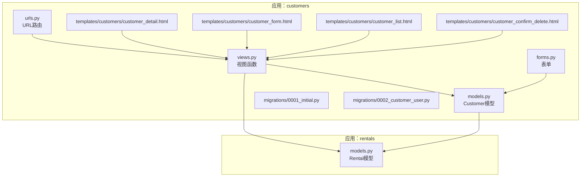
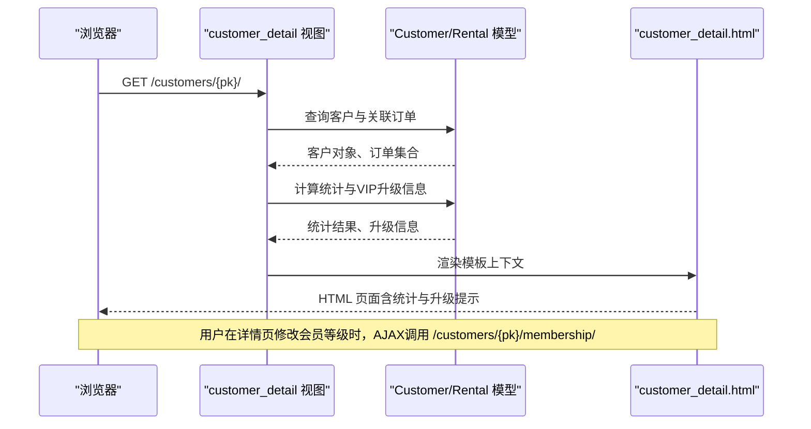
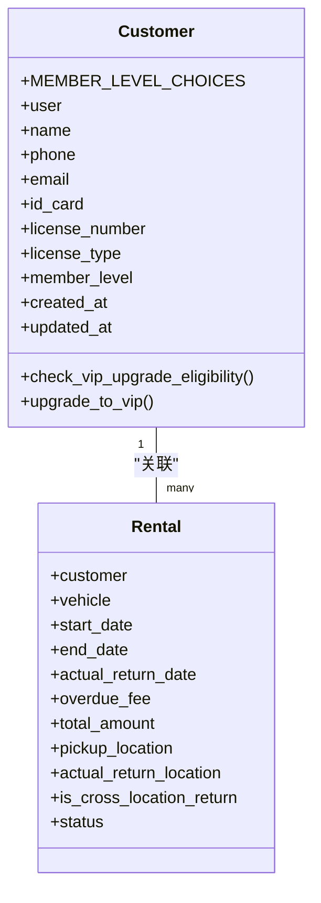
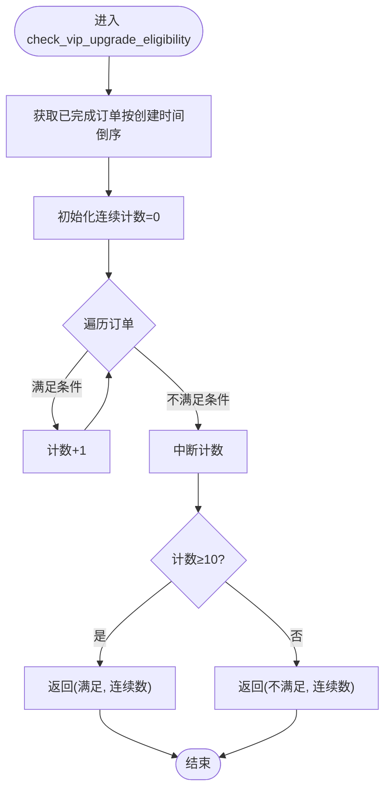
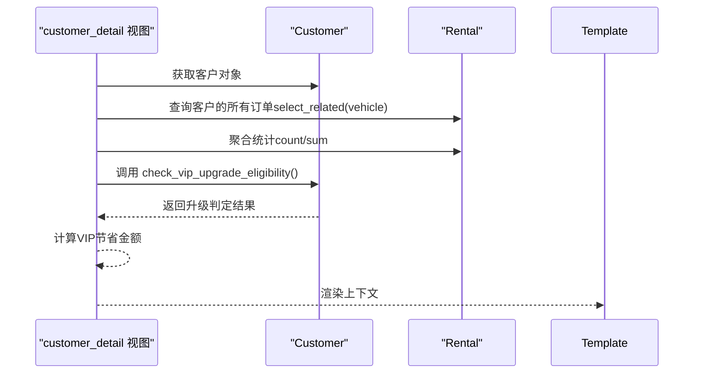
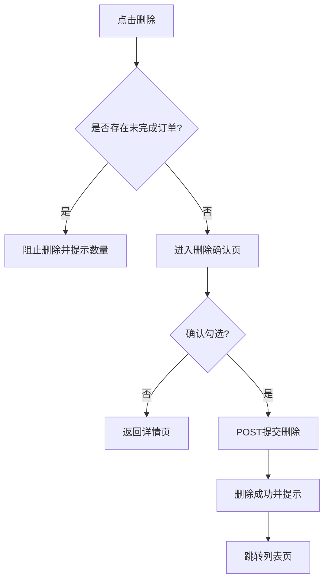
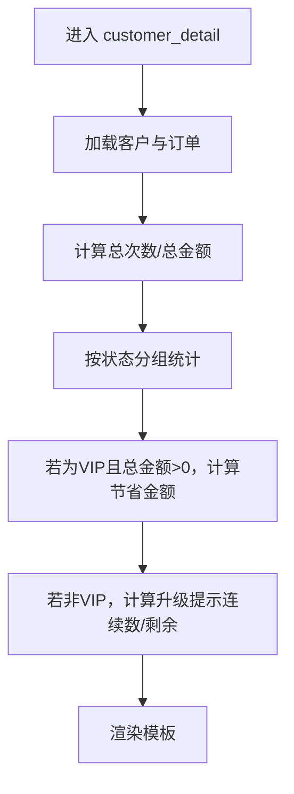
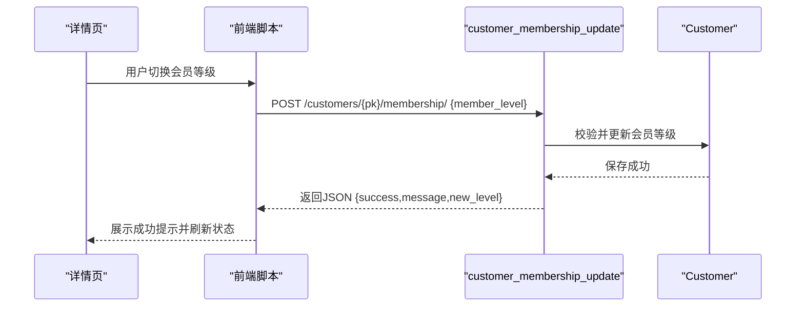
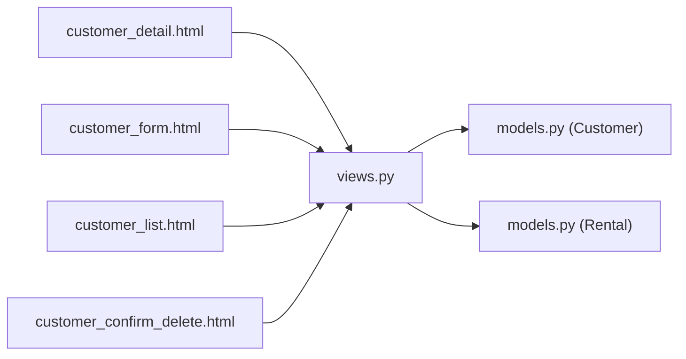

# 客户管理模块

<cite>
**本文引用的文件**
- [customers/models.py](file://code/car_rental_system/customers/models.py)
- [customers/views.py](file://code/car_rental_system/customers/views.py)
- [customers/forms.py](file://code/car_rental_system/customers/forms.py)
- [customers/urls.py](file://code/car_rental_system/customers/urls.py)
- [customers/migrations/0001_initial.py](file://code/car_rental_system/customers/migrations/0001_initial.py)
- [customers/migrations/0002_customer_user.py](file://code/car_rental_system/customers/migrations/0002_customer_user.py)
- [templates/customers/customer_detail.html](file://code/car_rental_system/templates/customers/customer_detail.html)
- [templates/customers/customer_form.html](file://code/car_rental_system/templates/customers/customer_form.html)
- [templates/customers/customer_list.html](file://code/car_rental_system/templates/customers/customer_list.html)
- [templates/customers/customer_confirm_delete.html](file://code/car_rental_system/templates/customers/customer_confirm_delete.html)
- [rentals/models.py](file://code/car_rental_system/rentals/models.py)
- [test_customer_management.py](file://code/car_rental_system/test_customer_management.py)
- [create_customer_test_data.py](file://code/car_rental_system/create_customer_test_data.py)
</cite>

## 目录
1. [引言](#引言)
2. [项目结构](#项目结构)
3. [核心组件](#核心组件)
4. [架构总览](#架构总览)
5. [详细组件分析](#详细组件分析)
6. [依赖分析](#依赖分析)
7. [性能考虑](#性能考虑)
8. [故障排查指南](#故障排查指南)
9. [结论](#结论)
10. [附录](#附录)

## 引言
本文件全面阐述客户管理模块的设计与实现，重点覆盖以下方面：
- Customer 模型的结构设计与字段约束
- 会员等级（普通/VIP）及其在界面与后端中的体现
- VIP 自动升级规则：连续10个已完成订单表现优异（无超时还车、无不诚信异地还车）
- 客户与租赁订单之间的关联关系及统计逻辑
- 客户信息编辑与删除的权限控制机制
- 客户详情页中“租赁统计信息”的生成逻辑
- 结合模板文件，说明用户界面与后端数据交互方式

## 项目结构
客户管理模块位于应用 customers 中，包含模型、视图、表单、URL路由、模板与迁移文件；同时与租赁模块 rentals 存在外键关联。

图表来源
- [customers/models.py](file://code/car_rental_system/customers/models.py#L1-L160)
- [customers/views.py](file://code/car_rental_system/customers/views.py#L1-L262)
- [customers/forms.py](file://code/car_rental_system/customers/forms.py#L1-L158)
- [customers/urls.py](file://code/car_rental_system/customers/urls.py#L1-L19)
- [templates/customers/customer_detail.html](file://code/car_rental_system/templates/customers/customer_detail.html#L1-L383)
- [templates/customers/customer_form.html](file://code/car_rental_system/templates/customers/customer_form.html#L1-L232)
- [templates/customers/customer_list.html](file://code/car_rental_system/templates/customers/customer_list.html#L1-L191)
- [templates/customers/customer_confirm_delete.html](file://code/car_rental_system/templates/customers/customer_confirm_delete.html#L1-L166)
- [rentals/models.py](file://code/car_rental_system/rentals/models.py#L1-L200)

章节来源
- [customers/models.py](file://code/car_rental_system/customers/models.py#L1-L160)
- [customers/views.py](file://code/car_rental_system/customers/views.py#L1-L262)
- [customers/forms.py](file://code/car_rental_system/customers/forms.py#L1-L158)
- [customers/urls.py](file://code/car_rental_system/customers/urls.py#L1-L19)
- [templates/customers/customer_detail.html](file://code/car_rental_system/templates/customers/customer_detail.html#L1-L383)
- [templates/customers/customer_form.html](file://code/car_rental_system/templates/customers/customer_form.html#L1-L232)
- [templates/customers/customer_list.html](file://code/car_rental_system/templates/customers/customer_list.html#L1-L191)
- [templates/customers/customer_confirm_delete.html](file://code/car_rental_system/templates/customers/customer_confirm_delete.html#L1-L166)
- [rentals/models.py](file://code/car_rental_system/rentals/models.py#L1-L200)

## 核心组件
- Customer 模型：定义客户基本信息、会员等级、唯一性约束与索引；提供 VIP 升级判定与升级方法。
- 视图层：提供客户首页、列表、详情、创建、编辑、删除、AJAX会员等级更新与统计API。
- 表单层：统一的客户信息表单与搜索表单，包含字段校验与唯一性检查。
- 模板层：详情页展示统计信息与升级提示；列表页支持搜索与筛选；删除确认页限制删除条件。
- 关联模型：Rental 模型通过外键关联 Customer，用于统计与升级判定。

章节来源
- [customers/models.py](file://code/car_rental_system/customers/models.py#L1-L160)
- [customers/views.py](file://code/car_rental_system/customers/views.py#L1-L262)
- [customers/forms.py](file://code/car_rental_system/customers/forms.py#L1-L158)
- [rentals/models.py](file://code/car_rental_system/rentals/models.py#L1-L200)

## 架构总览
客户管理模块采用经典的 MVC 架构：
- 模型（Model）：Customer 与 Rental，负责数据结构与业务规则（如 VIP 升级判定）。
- 视图（View）：基于 Django 函数视图，负责处理请求、查询数据、渲染模板与返回JSON。
- 模板（Template）：前端页面负责展示与交互，AJAX 调用更新会员等级。

图表来源
- [customers/views.py](file://code/car_rental_system/customers/views.py#L79-L121)
- [templates/customers/customer_detail.html](file://code/car_rental_system/templates/customers/customer_detail.html#L100-L115)
- [customers/models.py](file://code/car_rental_system/customers/models.py#L101-L154)

## 详细组件分析

### Customer 模型设计与字段
- 字段与约束
  - 姓名、手机号、邮箱、身份证号、驾驶证号、驾照类型、会员等级、创建/更新时间
  - 手机号与身份证号、驾驶证号唯一性约束
  - 会员等级枚举：普通、VIP
  - 索引：id_card、license_number、phone、member_level
- 关联关系
  - 一对一关联到 Django 用户模型（可选），便于后续登录与权限扩展
- VIP 升级判定
  - 方法：check_vip_upgrade_eligibility
  - 规则：连续10个已完成订单，满足“无超时还车”且“异地还车行为诚信”
  - 升级方法：upgrade_to_vip（仅当非VIP时生效）

图表来源
- [customers/models.py](file://code/car_rental_system/customers/models.py#L1-L160)
- [rentals/models.py](file://code/car_rental_system/rentals/models.py#L1-L200)

章节来源
- [customers/models.py](file://code/car_rental_system/customers/models.py#L1-L160)
- [customers/migrations/0001_initial.py](file://code/car_rental_system/customers/migrations/0001_initial.py#L1-L38)
- [customers/migrations/0002_customer_user.py](file://code/car_rental_system/customers/migrations/0002_customer_user.py#L1-L22)

### VIP 自动升级规则与实现
- 升级条件
  - 连续10个已完成订单
  - 无超时归还（overdue_fee > 0.00）
  - 无不诚信异地还车（实际还车地点与期望异地还车标记一致）
- 判定流程
  - 从最新完成订单开始向前遍历，累计连续满足条件的订单数，遇不满足即停止
  - 当连续数达到10时，视为满足升级条件
- 升级触发
  - 视图层在详情页展示升级提示；系统可在还车结算时调用 upgrade_to_vip 完成升级（模型提供方法）

图表来源
- [customers/models.py](file://code/car_rental_system/customers/models.py#L101-L145)

章节来源
- [customers/models.py](file://code/car_rental_system/customers/models.py#L101-L145)

### 客户与租赁订单的关联关系
- 外键关系
  - Rental.customer → Customer（一对多）
  - Rental.vehicle → Vehicle（一对多）
- 统计与查询
  - 视图 customer_detail：按状态聚合、计算总消费与租赁次数
  - 视图 customer_list：使用 annotate 计算每个客户的 total_rentals 与 total_amount，避免 N+1 查询
  - 模型 Customer：提供 check_vip_upgrade_eligibility 基于已完成订单进行升级判定

图表来源
- [customers/views.py](file://code/car_rental_system/customers/views.py#L79-L121)
- [rentals/models.py](file://code/car_rental_system/rentals/models.py#L1-L200)

章节来源
- [customers/views.py](file://code/car_rental_system/customers/views.py#L34-L121)
- [rentals/models.py](file://code/car_rental_system/rentals/models.py#L1-L200)

### 客户信息编辑与删除权限控制
- 编辑（customer_update）
  - 通过 CustomerForm 渲染与提交，表单对手机号、身份证号、驾驶证号进行格式与唯一性校验
  - 视图保存后跳转详情页
- 删除（customer_delete）
  - 若客户存在未完成订单（PENDING/ONGOING），阻止删除并在详情页给出提示
  - 删除确认页要求勾选确认框才允许提交
  - 成功删除后返回列表页

图表来源
- [customers/views.py](file://code/car_rental_system/customers/views.py#L165-L191)
- [templates/customers/customer_confirm_delete.html](file://code/car_rental_system/templates/customers/customer_confirm_delete.html#L1-L166)

章节来源
- [customers/views.py](file://code/car_rental_system/customers/views.py#L143-L191)
- [templates/customers/customer_confirm_delete.html](file://code/car_rental_system/templates/customers/customer_confirm_delete.html#L1-L166)

### 客户详情页统计信息生成逻辑
- 统计项
  - 总租赁次数：订单计数
  - 总消费金额：订单金额求和
  - 订单状态分布：按状态分组计数
  - VIP节省金额：若为VIP且总消费>0，则按10%估算节省
- 升级提示
  - 非VIP客户：展示连续诚信订单数与剩余需求数
  - VIP客户：不展示升级提示

图表来源
- [customers/views.py](file://code/car_rental_system/customers/views.py#L79-L121)
- [templates/customers/customer_detail.html](file://code/car_rental_system/templates/customers/customer_detail.html#L183-L242)

章节来源
- [customers/views.py](file://code/car_rental_system/customers/views.py#L79-L121)
- [templates/customers/customer_detail.html](file://code/car_rental_system/templates/customers/customer_detail.html#L183-L242)

### 用户界面与后端数据交互
- 会员等级 AJAX 更新
  - 前端在详情页通过 fetch 发送 POST 请求到 /customers/{pk}/membership/
  - 后端 customer_membership_update 接收 JSON，校验会员等级枚举，更新并返回结果
- 表单提交
  - 新增/编辑：POST 提交到对应 URL，表单验证通过后保存并跳转详情
- 列表页搜索与筛选
  - GET 参数携带搜索关键词与会员等级，后端 customer_list 进行过滤与分页

图表来源
- [templates/customers/customer_detail.html](file://code/car_rental_system/templates/customers/customer_detail.html#L333-L383)
- [customers/views.py](file://code/car_rental_system/customers/views.py#L194-L231)

章节来源
- [templates/customers/customer_detail.html](file://code/car_rental_system/templates/customers/customer_detail.html#L333-L383)
- [customers/views.py](file://code/car_rental_system/customers/views.py#L194-L231)

### 表单与验证
- CustomerForm
  - 字段：name、phone、email、id_card、license_number、license_type、member_level
  - 校验：手机号格式与唯一性、身份证号格式与唯一性、驾驶证号唯一性
- CustomerSearchForm
  - 支持按姓名/手机号搜索与会员等级筛选
- MembershipUpdateForm
  - 仅包含 member_level 字段，必填

章节来源
- [customers/forms.py](file://code/car_rental_system/customers/forms.py#L1-L158)

### URL 路由
- 应用命名空间 customers
- 主要路由
  - 首页、列表、创建、详情、编辑、删除、AJAX会员等级更新、统计API

章节来源
- [customers/urls.py](file://code/car_rental_system/customers/urls.py#L1-L19)

## 依赖分析
- 模块耦合
  - customers.views 依赖 customers.models 与 rentals.models
  - templates 依赖 views 提供的上下文变量
- 外部依赖
  - Django ORM、表单与模板系统
  - 前端 Bootstrap 图标库（bi、bs-icon）

图表来源
- [customers/views.py](file://code/car_rental_system/customers/views.py#L1-L262)
- [customers/models.py](file://code/car_rental_system/customers/models.py#L1-L160)
- [rentals/models.py](file://code/car_rental_system/rentals/models.py#L1-L200)
- [templates/customers/customer_detail.html](file://code/car_rental_system/templates/customers/customer_detail.html#L1-L383)
- [templates/customers/customer_form.html](file://code/car_rental_system/templates/customers/customer_form.html#L1-L232)
- [templates/customers/customer_list.html](file://code/car_rental_system/templates/customers/customer_list.html#L1-L191)
- [templates/customers/customer_confirm_delete.html](file://code/car_rental_system/templates/customers/customer_confirm_delete.html#L1-L166)

## 性能考虑
- 查询优化
  - 列表页使用 annotate 计算 total_rentals 与 total_amount，避免 N+1 查询
  - 详情页使用 select_related('vehicle') 加载车辆信息，减少查询次数
- 分页
  - 列表页使用 Paginator 控制每页数量，提升大数据量下的响应速度
- 索引
  - Customer 模型建立 id_card、license_number、phone、member_level 索引，加速搜索与筛选
- 前端交互
  - 会员等级更新采用 AJAX，避免整页刷新，提升用户体验

章节来源
- [customers/views.py](file://code/car_rental_system/customers/views.py#L34-L121)
- [customers/models.py](file://code/car_rental_system/customers/models.py#L89-L100)

## 故障排查指南
- 会员等级更新失败
  - 检查请求体 JSON 是否正确，枚举值是否合法
  - 查看后端异常捕获返回的错误信息
- 删除客户失败
  - 确认是否存在未完成订单（PENDING/ONGOING），若有则无法删除
  - 在删除确认页勾选确认框后再提交
- 表单验证错误
  - 手机号格式与唯一性、身份证号格式与唯一性、驾驶证号唯一性
  - 在表单渲染时查看错误提示，修正输入内容

章节来源
- [customers/views.py](file://code/car_rental_system/customers/views.py#L165-L191)
- [customers/views.py](file://code/car_rental_system/customers/views.py#L194-L231)
- [customers/forms.py](file://code/car_rental_system/customers/forms.py#L59-L115)

## 结论
客户管理模块围绕 Customer 与 Rental 的关联关系构建，实现了：
- 完整的客户信息管理（增删改查、搜索筛选）
- VIP 自动升级规则与可视化提示
- 详尽的租赁统计与权限控制
- 前后端分离的数据交互与性能优化

该模块设计清晰、职责明确，具备良好的扩展性与维护性。

## 附录
- 测试与数据准备
  - 单元测试脚本覆盖 CRUD、表单验证、搜索、分页与统计
  - 测试数据脚本批量创建客户与租赁历史，便于演示与验证

章节来源
- [test_customer_management.py](file://code/car_rental_system/test_customer_management.py#L1-L200)
- [create_customer_test_data.py](file://code/car_rental_system/create_customer_test_data.py#L1-L402)