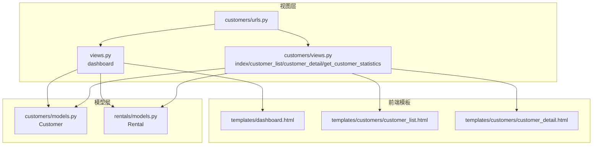
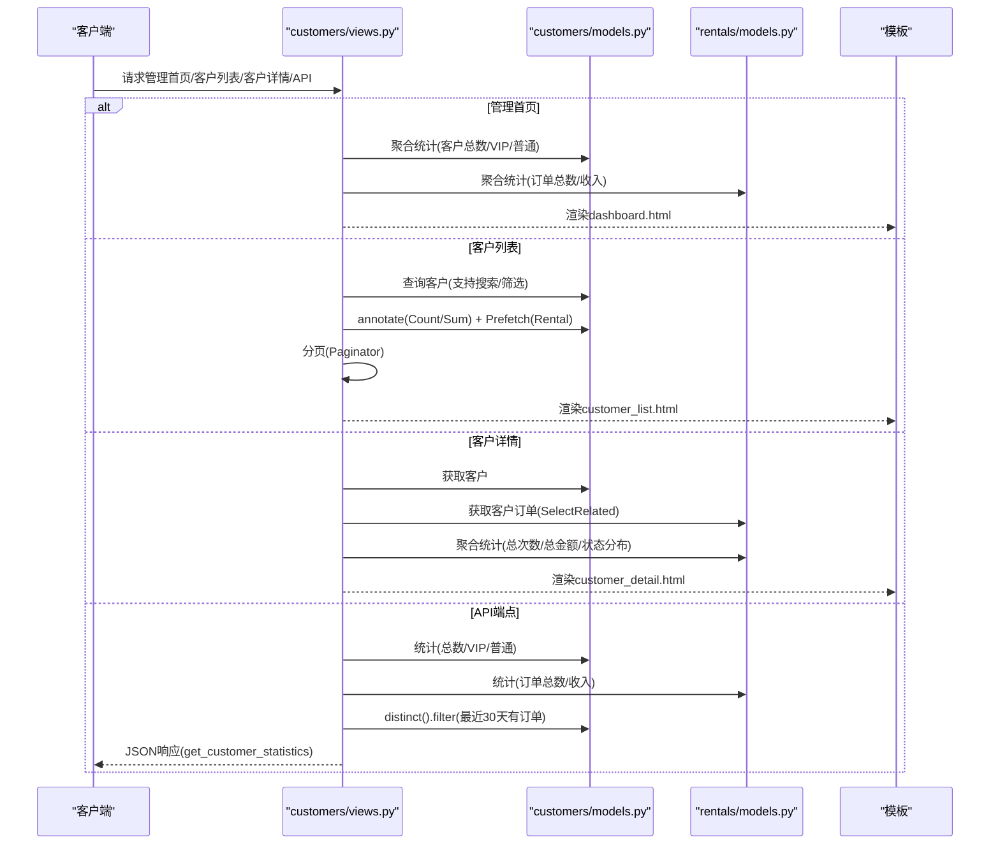
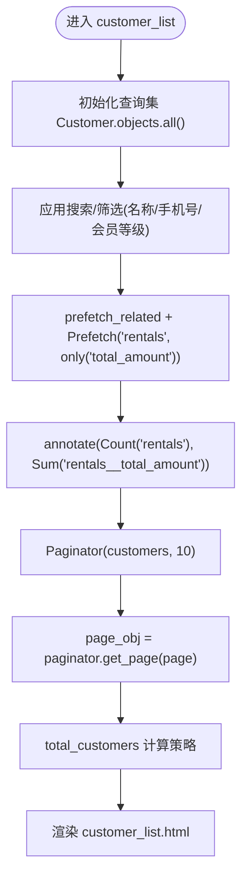
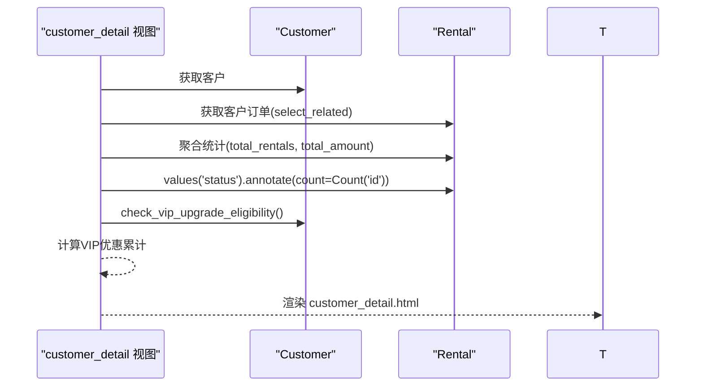
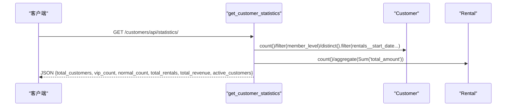
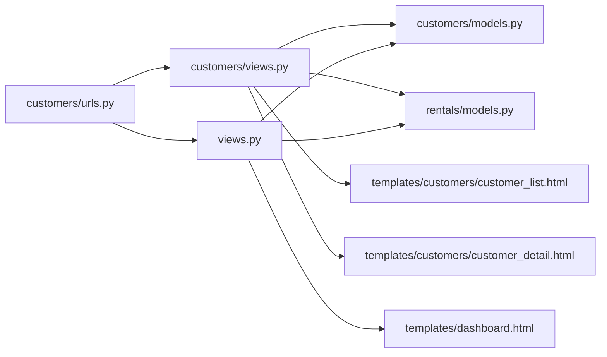

# 客户统计与数据分析

<cite>
**本文引用的文件**
- [customers/views.py](file://code/car_rental_system/customers/views.py)
- [customers/models.py](file://code/car_rental_system/customers/models.py)
- [rentals/models.py](file://code/car_rental_system/rentals/models.py)
- [customers/forms.py](file://code/car_rental_system/customers/forms.py)
- [customers/urls.py](file://code/car_rental_system/customers/urls.py)
- [views.py](file://code/car_rental_system/views.py)
- [templates/dashboard.html](file://code/car_rental_system/templates/dashboard.html)
- [templates/customers/customer_list.html](file://code/car_rental_system/templates/customers/customer_list.html)
- [templates/customers/customer_detail.html](file://code/car_rental_system/templates/customers/customer_detail.html)
</cite>

## 目录
1. [简介](#简介)
2. [项目结构](#项目结构)
3. [核心组件](#核心组件)
4. [架构总览](#架构总览)
5. [详细组件分析](#详细组件分析)
6. [依赖关系分析](#依赖关系分析)
7. [性能考量](#性能考量)
8. [故障排查指南](#故障排查指南)
9. [结论](#结论)
10. [附录](#附录)

## 简介
本文件聚焦“客户模块”的统计功能实现，涵盖：
- 客户总数、VIP/普通会员数量的计算逻辑
- customer_list 视图中使用 annotate 和 Sum 聚合函数统计客户租赁次数与消费总额，并通过 Prefetch 优化关联查询性能
- get_customer_statistics API 端点提供的统计指标（如活跃客户数）及其计算方式
- 结合前端模板，说明统计信息在管理首页与客户详情页的可视化呈现方式，以及分页处理对统计总数的影响

## 项目结构
围绕客户统计的关键文件组织如下：
- 视图层：customers/views.py、views.py（仪表板）、customers/urls.py
- 模型层：customers/models.py、rentals/models.py
- 表单层：customers/forms.py
- 前端模板：templates/dashboard.html、templates/customers/customer_list.html、templates/customers/customer_detail.html

图表来源
- [customers/views.py](file://code/car_rental_system/customers/views.py#L1-L262)
- [views.py](file://code/car_rental_system/views.py#L1-L116)
- [customers/urls.py](file://code/car_rental_system/customers/urls.py#L1-L19)
- [customers/models.py](file://code/car_rental_system/customers/models.py#L1-L160)
- [rentals/models.py](file://code/car_rental_system/rentals/models.py#L1-L170)
- [templates/dashboard.html](file://code/car_rental_system/templates/dashboard.html#L1-L162)
- [templates/customers/customer_list.html](file://code/car_rental_system/templates/customers/customer_list.html#L1-L191)
- [templates/customers/customer_detail.html](file://code/car_rental_system/templates/customers/customer_detail.html#L1-L383)

章节来源
- [customers/views.py](file://code/car_rental_system/customers/views.py#L1-L262)
- [views.py](file://code/car_rental_system/views.py#L1-L116)
- [customers/urls.py](file://code/car_rental_system/customers/urls.py#L1-L19)

## 核心组件
- 客户统计视图：index、customer_list、customer_detail、get_customer_statistics
- 客户模型：包含会员等级、唯一标识字段、索引与校验
- 租赁模型：包含客户外键、金额字段、状态字段、索引
- 前端模板：dashboard.html、customer_list.html、customer_detail.html

章节来源
- [customers/views.py](file://code/car_rental_system/customers/views.py#L1-L262)
- [customers/models.py](file://code/car_rental_system/customers/models.py#L1-L160)
- [rentals/models.py](file://code/car_rental_system/rentals/models.py#L1-L170)
- [templates/dashboard.html](file://code/car_rental_system/templates/dashboard.html#L1-L162)
- [templates/customers/customer_list.html](file://code/car_rental_system/templates/customers/customer_list.html#L1-L191)
- [templates/customers/customer_detail.html](file://code/car_rental_system/templates/customers/customer_detail.html#L1-L383)

## 架构总览
客户统计功能由“视图层-模型层-模板层”协同完成：
- 视图层负责统计聚合、搜索筛选、分页与API响应
- 模型层提供数据结构与索引，支撑高效查询
- 模板层负责统计信息的可视化展示

图表来源
- [customers/views.py](file://code/car_rental_system/customers/views.py#L16-L262)
- [views.py](file://code/car_rental_system/views.py#L21-L116)
- [templates/dashboard.html](file://code/car_rental_system/templates/dashboard.html#L1-L162)
- [templates/customers/customer_list.html](file://code/car_rental_system/templates/customers/customer_list.html#L1-L191)
- [templates/customers/customer_detail.html](file://code/car_rental_system/templates/customers/customer_detail.html#L1-L383)

## 详细组件分析

### 客户总数与VIP/普通会员数量统计
- 管理首页统计：dashboard 视图使用聚合查询一次性统计车辆、客户、订单与收入，避免多次往返数据库
- 客户总数与会员分布：dashboard 中对 Customer 使用 Count + filter 统计 total、regular、vip
- 客户详情页统计：customer_detail 中对 Customer 的 rentals 聚合统计 total_rentals 与 total_amount

章节来源
- [views.py](file://code/car_rental_system/views.py#L21-L116)
- [customers/views.py](file://code/car_rental_system/customers/views.py#L79-L121)

### customer_list 视图：annotate + Sum + Prefetch 的统计与性能优化
- 搜索与筛选：CustomerSearchForm 支持按姓名/手机号模糊搜索与会员等级筛选
- 关联统计：通过 annotate 统计每个客户的 total_rentals 与 total_amount，避免 N+1 查询
- 关联优化：prefetch_related + Prefetch('rentals', queryset=Rental.objects.only('total_amount')) 减少查询次数
- 分页与总数：Paginator 控制每页数量；total_customers 在无搜索/筛选条件下使用 customers.count()，否则使用 page_obj.paginator.count，避免重复扫描全表

图表来源
- [customers/views.py](file://code/car_rental_system/customers/views.py#L34-L76)
- [customers/forms.py](file://code/car_rental_system/customers/forms.py#L118-L158)
- [templates/customers/customer_list.html](file://code/car_rental_system/templates/customers/customer_list.html#L1-L191)

章节来源
- [customers/views.py](file://code/car_rental_system/customers/views.py#L34-L76)
- [customers/forms.py](file://code/car_rental_system/customers/forms.py#L118-L158)
- [templates/customers/customer_list.html](file://code/car_rental_system/templates/customers/customer_list.html#L1-L191)

### 客户详情页：订单统计与状态分布
- 订单列表：select_related('vehicle') 保证订单与车辆信息的关联查询
- 统计指标：
  - total_rentals：订单数量
  - total_amount：订单总金额 Sum('total_amount')
  - status_stats：按状态分组统计 Count('id')
  - VIP优惠累计：当客户为VIP且存在消费时，按折扣比例估算累计节省
- VIP升级资格：调用 Customer.check_vip_upgrade_eligibility 返回连续诚信订单数与剩余需求

图表来源
- [customers/views.py](file://code/car_rental_system/customers/views.py#L79-L121)
- [customers/models.py](file://code/car_rental_system/customers/models.py#L101-L145)
- [templates/customers/customer_detail.html](file://code/car_rental_system/templates/customers/customer_detail.html#L1-L383)

章节来源
- [customers/views.py](file://code/car_rental_system/customers/views.py#L79-L121)
- [customers/models.py](file://code/car_rental_system/customers/models.py#L101-L145)
- [templates/customers/customer_detail.html](file://code/car_rental_system/templates/customers/customer_detail.html#L1-L383)

### get_customer_statistics API 端点：活跃客户与其他指标
- 指标定义：
  - total_customers：Customer 总数
  - vip_count / normal_count：会员等级分布
  - total_rentals：Rental 总数
  - total_revenue：Rental 的 total_amount 聚合求和
  - active_customers：最近30天有租赁开始日期的客户数（distinct 去重）
- 返回格式：JSONResponse，包含上述指标

图表来源
- [customers/views.py](file://code/car_rental_system/customers/views.py#L233-L262)
- [customers/urls.py](file://code/car_rental_system/customers/urls.py#L1-L19)

章节来源
- [customers/views.py](file://code/car_rental_system/customers/views.py#L233-L262)
- [customers/urls.py](file://code/car_rental_system/customers/urls.py#L1-L19)

### 前端模板中的统计可视化
- 管理首页（dashboard.html）：
  - 客户统计卡片：显示 total、regular、vip
  - 订单统计卡片：显示 total、active、completed、cancelled
  - 收入统计卡片：显示 total、monthly、today
- 客户列表（customer_list.html）：
  - 展示每行客户的 total_rentals 与 total_amount（来自 annotate）
  - 分页导航与页码提示
- 客户详情（customer_detail.html）：
  - 总租赁次数与总消费金额
  - VIP优惠累计（当适用）
  - 订单状态分布卡片
  - 最近租赁历史表格

章节来源
- [templates/dashboard.html](file://code/car_rental_system/templates/dashboard.html#L1-L162)
- [templates/customers/customer_list.html](file://code/car_rental_system/templates/customers/customer_list.html#L1-L191)
- [templates/customers/customer_detail.html](file://code/car_rental_system/templates/customers/customer_detail.html#L1-L383)

## 依赖关系分析
- 视图依赖模型：customers/views.py 依赖 Customer 与 Rental；views.py 依赖 Vehicle/Customer/Rental
- 模板依赖视图上下文：dashboard.html 使用 vehicle_stats、customer_stats、rental_stats、revenue_stats；customer_list.html 使用 page_obj、total_customers；customer_detail.html 使用 customer、rentals、统计指标
- URL路由：customers/urls.py 将 /list/、/<int:pk>/、/api/statistics/ 等映射到对应视图

图表来源
- [customers/urls.py](file://code/car_rental_system/customers/urls.py#L1-L19)
- [customers/views.py](file://code/car_rental_system/customers/views.py#L1-L262)
- [views.py](file://code/car_rental_system/views.py#L1-L116)
- [customers/models.py](file://code/car_rental_system/customers/models.py#L1-L160)
- [rentals/models.py](file://code/car_rental_system/rentals/models.py#L1-L170)
- [templates/dashboard.html](file://code/car_rental_system/templates/dashboard.html#L1-L162)
- [templates/customers/customer_list.html](file://code/car_rental_system/templates/customers/customer_list.html#L1-L191)
- [templates/customers/customer_detail.html](file://code/car_rental_system/templates/customers/customer_detail.html#L1-L383)

章节来源
- [customers/urls.py](file://code/car_rental_system/customers/urls.py#L1-L19)
- [customers/views.py](file://code/car_rental_system/customers/views.py#L1-L262)
- [views.py](file://code/car_rental_system/views.py#L1-L116)

## 性能考量
- 避免 N+1 查询：
  - customer_list 使用 prefetch_related + Prefetch('rentals', only('total_amount'))，并在 annotate 中直接聚合 sum，减少二次查询
  - customer_detail 使用 select_related('vehicle')，避免每次循环访问 vehicle 字段触发额外查询
- 单次聚合查询：
  - dashboard 使用聚合查询一次性统计车辆、客户、订单与收入，减少多次 count/aggregate 的往返
- 分页与总数计算：
  - 无筛选时使用 customers.count()，有筛选时使用 page_obj.paginator.count，避免重复扫描全表
- 索引与过滤：
  - Customer/rentals 模型定义了多处索引，有助于搜索、筛选与聚合查询的性能提升

章节来源
- [customers/views.py](file://code/car_rental_system/customers/views.py#L34-L76)
- [views.py](file://code/car_rental_system/views.py#L21-L116)
- [customers/models.py](file://code/car_rental_system/customers/models.py#L90-L100)
- [rentals/models.py](file://code/car_rental_system/rentals/models.py#L160-L170)

## 故障排查指南
- 客户列表总数异常
  - 现象：搜索/筛选后总数与分页不一致
  - 原因：total_customers 在有筛选时使用 page_obj.paginator.count，避免重复 count
  - 处理：确认筛选条件是否生效，检查分页参数
- VIP升级资格不准确
  - 现象：VIP升级提示与预期不符
  - 原因：check_vip_upgrade_eligibility 依赖已完成订单且无超时、无不诚信异地还车
  - 处理：检查客户历史订单状态与异地还车记录
- API 活跃客户数为 0 或偏低
  - 现象：active_customers 与预期不符
  - 原因：活跃客户定义为最近30天有 start_date 的客户，distinct 去重
  - 处理：确认订单 start_date 是否正确、是否存在重复客户

章节来源
- [customers/views.py](file://code/car_rental_system/customers/views.py#L34-L76)
- [customers/views.py](file://code/car_rental_system/customers/views.py#L233-L262)
- [customers/models.py](file://code/car_rental_system/customers/models.py#L101-L145)

## 结论
本项目在客户统计方面采用聚合查询与关联优化相结合的方式，既保证了统计准确性，又提升了查询性能。管理首页与客户详情页通过简洁直观的卡片与表格呈现关键指标，配合分页与搜索筛选，满足日常运营与管理需求。API 端点为外部集成提供了标准化的数据接口。

## 附录
- 关键实现路径参考
  - 客户总数与会员分布：[views.py](file://code/car_rental_system/views.py#L21-L116)
  - 客户列表统计与性能优化：[customers/views.py](file://code/car_rental_system/customers/views.py#L34-L76)
  - 客户详情统计与状态分布：[customers/views.py](file://code/car_rental_system/customers/views.py#L79-L121)
  - VIP升级资格计算：[customers/models.py](file://code/car_rental_system/customers/models.py#L101-L145)
  - API 活跃客户与收入统计：[customers/views.py](file://code/car_rental_system/customers/views.py#L233-L262)
  - 前端可视化模板：
    - [templates/dashboard.html](file://code/car_rental_system/templates/dashboard.html#L1-L162)
    - [templates/customers/customer_list.html](file://code/car_rental_system/templates/customers/customer_list.html#L1-L191)
    - [templates/customers/customer_detail.html](file://code/car_rental_system/templates/customers/customer_detail.html#L1-L383)