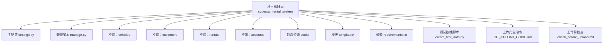
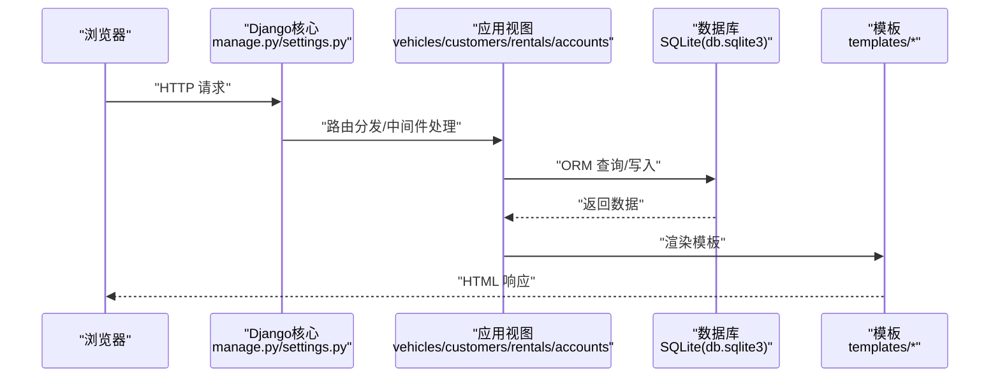
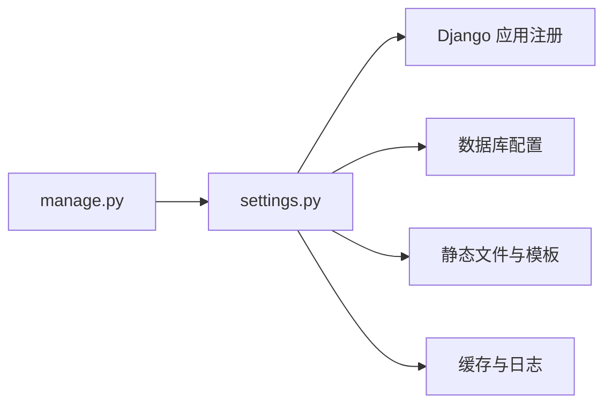

# 快速入门

<cite>
**本文引用的文件**
- [README.md](file://README.md)
- [QUICK_START.md](file://code/car_rental_system/QUICK_START.md)
- [requirements.txt](file://code/car_rental_system/requirements.txt)
- [manage.py](file://code/car_rental_system/manage.py)
- [settings.py](file://code/car_rental_system/car_rental_system/settings.py)
- [local_settings.py.example](file://code/car_rental_system/car_rental_system/local_settings.py.example)
- [GIT_UPLOAD_GUIDE.md](file://code/car_rental_system/GIT_UPLOAD_GUIDE.md)
- [check_before_upload.md](file://code/car_rental_system/check_before_upload.md)
- [迁移执行说明.md](file://code/car_rental_system/迁移执行说明.md)
- [create_test_data.py](file://code/car_rental_system/create_test_data.py)
- [test_models.py](file://code/car_rental_system/test_models.py)
</cite>

## 目录
1. [简介](#简介)
2. [项目结构](#项目结构)
3. [核心组件](#核心组件)
4. [架构总览](#架构总览)
5. [详细组件分析](#详细组件分析)
6. [依赖分析](#依赖分析)
7. [性能考虑](#性能考虑)
8. [故障排查指南](#故障排查指南)
9. [结论](#结论)
10. [附录](#附录)

## 简介
本指南面向新开发者，帮助你在30分钟内完成租车管理系统的本地环境搭建与运行。你将学会：
- 搭建Python/Django开发环境
- 安装依赖（requirements.txt）
- 初始化数据库（迁移）
- 生成测试数据（create_test_data.py）
- 启动开发服务器
- 常见问题排查（迁移失败、静态文件加载异常等）
- 上传前的安全检查与规范（check_before_upload.md、GIT_UPLOAD_GUIDE.md）

## 项目结构
项目采用标准Django多应用结构，核心应用包括车辆管理、客户管理、租赁管理、账户管理；主项目配置位于 car_rental_system 目录；静态资源与模板分别位于 static 与 templates 目录。

图表来源
- [settings.py](file://code/car_rental_system/car_rental_system/settings.py#L1-L179)
- [manage.py](file://code/car_rental_system/manage.py#L1-L23)
- [requirements.txt](file://code/car_rental_system/requirements.txt#L1-L4)

章节来源
- [README.md](file://README.md#L1-L120)

## 核心组件
- Django项目入口与配置
  - manage.py：Django命令入口，负责执行runserver、migrate、createsuperuser等命令。
  - settings.py：项目全局配置，包含应用注册、中间件、静态文件、数据库、国际化、缓存、日志等。
- 应用层
  - vehicles、customers、rentals、accounts：四个核心应用，分别对应车辆、客户、租赁、账户功能。
- 静态资源与模板
  - static/css/style.css、static/js/main.js、static/js/resource-loader.js：前端样式与脚本。
  - templates 下各子目录：HTML模板文件，配合Django模板引擎渲染页面。
- 测试与工具
  - create_test_data.py：一键生成测试数据（车辆、客户、订单），便于快速验证功能。
  - test_models.py：Django Shell测试脚本，验证模型关系与查询。
  - 迁移执行说明.md：迁移失败时的排查与修复指引。
  - GIT_UPLOAD_GUIDE.md、check_before_upload.md：上传前安全检查与规范。

章节来源
- [manage.py](file://code/car_rental_system/manage.py#L1-L23)
- [settings.py](file://code/car_rental_system/car_rental_system/settings.py#L1-L179)
- [requirements.txt](file://code/car_rental_system/requirements.txt#L1-L4)
- [create_test_data.py](file://code/car_rental_system/create_test_data.py#L1-L217)
- [test_models.py](file://code/car_rental_system/test_models.py#L1-L74)
- [迁移执行说明.md](file://code/car_rental_system/迁移执行说明.md#L1-L112)
- [GIT_UPLOAD_GUIDE.md](file://code/car_rental_system/GIT_UPLOAD_GUIDE.md#L1-L195)
- [check_before_upload.md](file://code/car_rental_system/check_before_upload.md#L1-L123)

## 架构总览
下图展示了从浏览器请求到Django处理再到数据库与模板渲染的整体流程。

图表来源
- [manage.py](file://code/car_rental_system/manage.py#L1-L23)
- [settings.py](file://code/car_rental_system/car_rental_system/settings.py#L1-L179)

## 详细组件分析

### 本地环境搭建与依赖安装
- 环境要求
  - Python 3.8+，pip。
- 安装依赖
  - 在项目根目录（包含 manage.py 的目录）执行安装命令，安装 requirements.txt 中列出的依赖。
- 虚拟环境建议
  - 推荐使用虚拟环境隔离依赖，避免系统Python环境冲突。

章节来源
- [README.md](file://README.md#L119-L148)
- [requirements.txt](file://code/car_rental_system/requirements.txt#L1-L4)

### 数据库初始化（迁移）
- 首次运行或更新模型后，需执行数据库迁移以创建或更新表结构。
- 常见问题
  - 迁移失败：检查Python/Django版本、数据库文件权限、是否已有其他进程占用数据库。
  - 迁移后字段缺失：参考迁移执行说明，确认迁移命令执行成功，并查看迁移输出。

章节来源
- [README.md](file://README.md#L183-L195)
- [迁移执行说明.md](file://code/car_rental_system/迁移执行说明.md#L1-L112)

### 启动开发服务器
- 在项目根目录执行runserver命令启动开发服务器，默认监听本地回环地址。
- 指定端口：可传入端口号参数启动。
- 访问地址
  - 主界面（登录页面）：http://127.0.0.1:8000/
  - 登录页面：http://127.0.0.1:8000/accounts/login/
  - 用户主页：http://127.0.0.1:8000/accounts/home/
  - 管理后台：http://127.0.0.1:8000/admin/

章节来源
- [README.md](file://README.md#L149-L173)
- [QUICK_START.md](file://code/car_rental_system/QUICK_START.md#L1-L28)

### 生成测试数据
- 使用 create_test_data.py 一键生成测试数据（车辆、客户、订单），便于快速验证功能。
- 该脚本会清理现有数据并重新创建，适合初次运行或重置测试环境。
- 另可使用 test_models.py 在Django Shell中进行模型关系与查询验证。

章节来源
- [create_test_data.py](file://code/car_rental_system/create_test_data.py#L1-L217)
- [test_models.py](file://code/car_rental_system/test_models.py#L1-L74)

### 上传前安全检查与规范
- 上传前检查清单
  - 确认数据库文件（db.sqlite3）未被跟踪。
  - 确认敏感配置文件（local_settings.py、.env）未被跟踪。
  - 使用 git status 检查将要提交的文件，确保不包含敏感文件。
- 上传步骤
  - 使用 GitHub Desktop 或 Git 命令行进行初始化、add、commit、push。
- 安全建议
  - 使用 .env 或 local_settings.py 存储敏感信息，避免硬编码到 settings.py。
  - 如已误传敏感文件，按指南重写历史并强制推送，同时更改密钥与密码。

章节来源
- [check_before_upload.md](file://code/car_rental_system/check_before_upload.md#L1-L123)
- [GIT_UPLOAD_GUIDE.md](file://code/car_rental_system/GIT_UPLOAD_GUIDE.md#L1-L195)
- [local_settings.py.example](file://code/car_rental_system/car_rental_system/local_settings.py.example#L1-L29)

## 依赖分析
- 项目依赖
  - Django：核心Web框架。
  - Pillow：图像处理（如头像上传）。
- 配置依赖
  - settings.py 中定义了数据库（SQLite）、静态文件、模板、缓存、日志等配置。
  - manage.py 将环境变量 DJANGO_SETTINGS_MODULE 指向 settings.py。

图表来源
- [manage.py](file://code/car_rental_system/manage.py#L1-L23)
- [settings.py](file://code/car_rental_system/car_rental_system/settings.py#L1-L179)

章节来源
- [requirements.txt](file://code/car_rental_system/requirements.txt#L1-L4)
- [settings.py](file://code/car_rental_system/car_rental_system/settings.py#L1-L179)

## 性能考虑
- 缓存与数据库优化
  - 使用内存缓存提升性能。
  - SQLite连接超时配置，减少锁等待。
  - 日志配置便于定位性能问题。
- 前端资源
  - 静态文件目录与URL配置，确保开发时静态资源可加载。

章节来源
- [settings.py](file://code/car_rental_system/car_rental_system/settings.py#L1-L179)

## 故障排查指南

### 迁移失败
- 现象
  - 控制台报错，迁移未生效。
- 排查步骤
  - 确认Python/Django版本与依赖一致。
  - 关闭开发服务器后再执行迁移。
  - 检查数据库文件权限与是否被其他进程占用。
  - 参考迁移执行说明中的验证步骤与注意事项。

章节来源
- [迁移执行说明.md](file://code/car_rental_system/迁移执行说明.md#L1-L112)

### 静态文件加载异常
- 现象
  - 页面样式或脚本未加载。
- 排查步骤
  - 确认 settings.py 中 STATIC_URL 与 STATICFILES_DIRS 配置正确。
  - 确认 static 目录结构与文件存在。
  - 在开发环境下无需收集静态文件，直接通过Django服务提供。

章节来源
- [settings.py](file://code/car_rental_system/car_rental_system/settings.py#L118-L130)

### 上传敏感信息风险
- 现象
  - 误将 db.sqlite3、local_settings.py、.env 提交到仓库。
- 处理步骤
  - 立即移除跟踪并提交忽略规则。
  - 更改所有密钥与密码。
  - 如已公开，按指南重写历史并强制推送，通知团队成员。

章节来源
- [check_before_upload.md](file://code/car_rental_system/check_before_upload.md#L1-L123)
- [GIT_UPLOAD_GUIDE.md](file://code/car_rental_system/GIT_UPLOAD_GUIDE.md#L1-L195)

## 结论
通过本指南，你可以在30分钟内完成环境搭建、数据库初始化、测试数据生成与开发服务器启动。遇到迁移失败或上传风险时，可依据提供的检查清单与操作步骤快速定位并解决。建议在开发过程中持续关注上传安全与迁移规范，确保团队协作顺畅与项目安全。

## 附录

### 快速操作清单
- 安装依赖：在项目根目录执行安装命令。
- 初始化数据库：执行迁移命令。
- 启动服务器：执行runserver命令。
- 生成测试数据：执行测试数据脚本。
- 上传前检查：使用检查清单与脚本确认敏感文件未被跟踪。

章节来源
- [README.md](file://README.md#L119-L195)
- [check_before_upload.md](file://code/car_rental_system/check_before_upload.md#L1-L123)
- [GIT_UPLOAD_GUIDE.md](file://code/car_rental_system/GIT_UPLOAD_GUIDE.md#L1-L195)