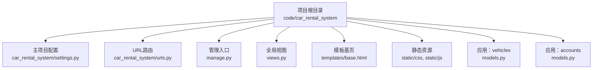
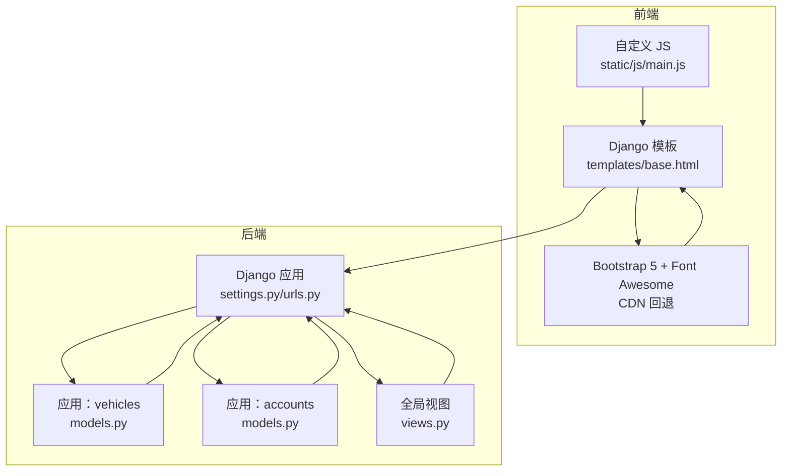
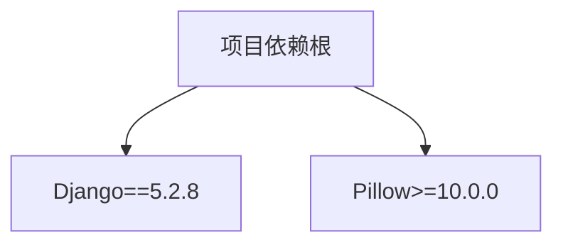
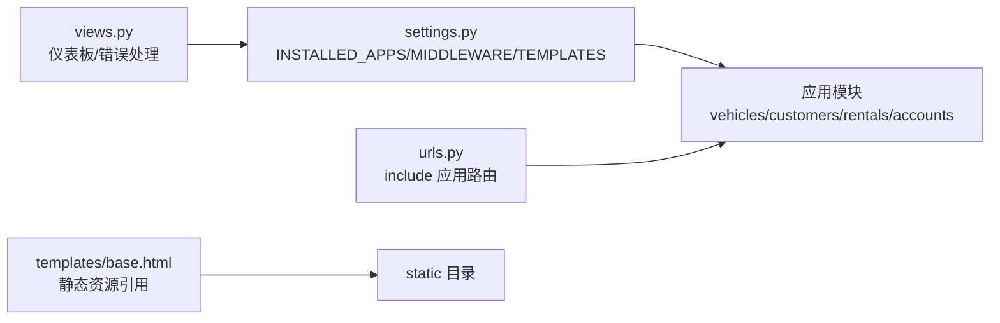

# 技术栈与依赖

<cite>
**本文引用的文件**
- [requirements.txt](file://code/car_rental_system/requirements.txt)
- [settings.py](file://code/car_rental_system/car_rental_system/settings.py)
- [urls.py](file://code/car_rental_system/car_rental_system/urls.py)
- [manage.py](file://code/car_rental_system/manage.py)
- [views.py](file://code/car_rental_system/views.py)
- [base.html](file://code/car_rental_system/templates/base.html)
- [main.js](file://code/car_rental_system/static/js/main.js)
- [models.py（vehicles）](file://code/car_rental_system/vehicles/models.py)
- [models.py（accounts）](file://code/car_rental_system/accounts/models.py)
- [README.md](file://README.md)
</cite>

## 目录
1. [简介](#简介)
2. [项目结构](#项目结构)
3. [核心组件](#核心组件)
4. [架构总览](#架构总览)
5. [详细组件分析](#详细组件分析)
6. [依赖关系分析](#依赖关系分析)
7. [性能与版本建议](#性能与版本建议)
8. [故障排查指南](#故障排查指南)
9. [结论](#结论)

## 简介
本技术栈文档聚焦于项目所采用的关键技术组件与版本要求，重点说明：
- Django 5.2.8 在本项目中的核心作用与配置要点
- Pillow 图像处理库在用户头像等图片场景中的应用
- 前端技术栈：Bootstrap 5 与 jQuery 的使用现状与替代建议
- settings.py 中的关键配置项：数据库、静态文件、中间件、国际化与时区、缓存与日志等
- 依赖管理机制与版本锁定策略
- 生产环境兼容性建议与潜在冲突风险
- 结合 requirements.txt 展示完整的依赖树结构

## 项目结构
项目采用典型的 Django 多应用结构，主项目目录包含 settings、urls、wsgi 等入口配置；各功能域（vehicles、customers、rentals、accounts）作为独立应用模块；模板与静态资源分别位于 templates 与 static 目录。

图表来源
- [settings.py](file://code/car_rental_system/car_rental_system/settings.py#L1-L179)
- [urls.py](file://code/car_rental_system/car_rental_system/urls.py#L1-L43)
- [manage.py](file://code/car_rental_system/manage.py#L1-L23)
- [views.py](file://code/car_rental_system/views.py#L1-L227)
- [base.html](file://code/car_rental_system/templates/base.html#L1-L291)
- [main.js](file://code/car_rental_system/static/js/main.js#L1-L606)
- [models.py（vehicles）](file://code/car_rental_system/vehicles/models.py#L1-L85)
- [models.py（accounts）](file://code/car_rental_system/accounts/models.py#L1-L318)

章节来源
- [README.md](file://README.md#L1-L278)

## 核心组件
- 后端框架：Django 5.2.8（严格版本锁定）
- 图像处理：Pillow >= 10.0.0（用于用户头像等图片上传与处理）
- 前端框架：Bootstrap 5（通过 CDN 加载，含回退策略）
- 前端脚本：jQuery（在模板中存在对 jQuery 的引用，但项目主 JS 未显式依赖）

章节来源
- [requirements.txt](file://code/car_rental_system/requirements.txt#L1-L4)
- [base.html](file://code/car_rental_system/templates/base.html#L1-L291)
- [main.js](file://code/car_rental_system/static/js/main.js#L1-L606)

## 架构总览
系统采用 Django MVC 架构，前端模板通过 Django 模板引擎渲染，静态资源由 Django 在开发模式下提供，生产环境通常由 Web 服务器或 CDN 提供。

图表来源
- [settings.py](file://code/car_rental_system/car_rental_system/settings.py#L1-L179)
- [urls.py](file://code/car_rental_system/car_rental_system/urls.py#L1-L43)
- [base.html](file://code/car_rental_system/templates/base.html#L1-L291)
- [main.js](file://code/car_rental_system/static/js/main.js#L1-L606)
- [models.py（vehicles）](file://code/car_rental_system/vehicles/models.py#L1-L85)
- [models.py（accounts）](file://code/car_rental_system/accounts/models.py#L1-L318)
- [views.py](file://code/car_rental_system/views.py#L1-L227)

## 详细组件分析

### Django 核心配置与作用
- 入口与运行：通过 manage.py 设置 DJANGO_SETTINGS_MODULE 并调用 Django 命令行执行器
- 应用与中间件：INSTALLED_APPS 与 MIDDLEWARE 定义了系统功能与请求处理链
- 模板与静态资源：TEMPLATES 指向 templates 目录，STATICFILES_DIRS 指向 static 目录；开发模式下通过 urls.py 提供静态文件服务
- 数据库：默认 sqlite3，数据库文件位于项目根目录
- 国际化与时区：简体中文与 Asia/Shanghai
- 缓存与日志：内存缓存 LocMemCache，SQLite 连接超时优化，控制台日志输出
- 错误页面：404/500/403 分别映射至 views.py 中的处理器

章节来源
- [manage.py](file://code/car_rental_system/manage.py#L1-L23)
- [settings.py](file://code/car_rental_system/car_rental_system/settings.py#L1-L179)
- [urls.py](file://code/car_rental_system/car_rental_system/urls.py#L1-L43)
- [views.py](file://code/car_rental_system/views.py#L1-L227)

### Pillow 图像处理库的应用场景
- 用户头像：accounts 应用的 UserProfile 模型包含 ImageField 字段，用于存储用户头像
- 上传路径：upload_to='avatars/'，便于统一管理与清理
- 依赖声明：requirements.txt 中明确声明 Pillow>=10.0.0

章节来源
- [models.py（accounts）](file://code/car_rental_system/accounts/models.py#L1-L318)
- [requirements.txt](file://code/car_rental_system/requirements.txt#L1-L4)

### 前端技术栈：Bootstrap 5 与 jQuery
- Bootstrap 5：通过国内 CDN 加载 CSS/JS，并提供 jsDelivr 回退；同时在 base.html 中引入 Font Awesome 图标库
- jQuery：模板中存在对 jQuery 的引用（例如在 base.html 中的 script 标签处），但项目主 JS 文件 main.js 未显式依赖 jQuery
- 建议：若需使用 jQuery 插件，应在模板中按需引入；否则可逐步移除 jQuery，改用原生 JS 与 Bootstrap 5 组件

章节来源
- [base.html](file://code/car_rental_system/templates/base.html#L1-L291)
- [main.js](file://code/car_rental_system/static/js/main.js#L1-L606)

### settings.py 关键配置项解析
- 安全与部署：DEBUG、ALLOWED_HOSTS、SECRET_KEY
- 应用与中间件：INSTALLED_APPS、MIDDLEWARE、ROOT_URLCONF、TEMPLATES
- 数据库：DATABASES 默认 sqlite3，附加 timeout 选项优化并发访问
- 认证与密码校验：AUTH_PASSWORD_VALIDATORS
- 国际化与时区：LANGUAGE_CODE、TIME_ZONE、USE_I18N、USE_TZ
- 静态文件：STATIC_URL、STATICFILES_DIRS；开发模式下通过 urls.py 提供静态文件
- 登录与重定向：LOGIN_URL、LOGIN_REDIRECT_URL、LOGOUT_REDIRECT_URL
- 错误页面：HANDLER404、HANDLER500、HANDLER403
- 默认主键：DEFAULT_AUTO_FIELD
- 缓存：CACHES 使用内存缓存，提升查询性能
- 日志：LOGGING 输出到控制台，便于开发调试

章节来源
- [settings.py](file://code/car_rental_system/car_rental_system/settings.py#L1-L179)
- [urls.py](file://code/car_rental_system/car_rental_system/urls.py#L1-L43)

### 依赖管理机制与版本锁定
- 依赖来源：requirements.txt 明确列出 Django 与 Pillow 的版本要求
- 版本锁定：Django==5.2.8（严格版本），Pillow>=10.0.0（最低版本）
- 安装流程：README.md 提供 pip 安装与虚拟环境激活说明
- 更新策略：建议使用 pip-tools 或 pipenv 管理依赖锁文件，避免隐式升级导致的不兼容

章节来源
- [requirements.txt](file://code/car_rental_system/requirements.txt#L1-L4)
- [README.md](file://README.md#L119-L195)

### 依赖树结构（基于 requirements.txt）

图表来源
- [requirements.txt](file://code/car_rental_system/requirements.txt#L1-L4)

## 依赖关系分析
- Django 与应用模块：settings.py 中 INSTALLED_APPS 注册 vehicles、customers、rentals、accounts；urls.py 通过 include 将各应用路由整合
- 模板与静态资源：base.html 通过  引用 static 目录下的 CSS/JS；开发模式下 urls.py 动态挂载静态文件服务
- 视图与错误处理：views.py 提供仪表板、评价管理与错误页面处理，settings.py 将 404/500/403 映射到对应视图

图表来源
- [settings.py](file://code/car_rental_system/car_rental_system/settings.py#L1-L179)
- [urls.py](file://code/car_rental_system/car_rental_system/urls.py#L1-L43)
- [base.html](file://code/car_rental_system/templates/base.html#L1-L291)
- [views.py](file://code/car_rental_system/views.py#L1-L227)

章节来源
- [settings.py](file://code/car_rental_system/car_rental_system/settings.py#L1-L179)
- [urls.py](file://code/car_rental_system/car_rental_system/urls.py#L1-L43)
- [views.py](file://code/car_rental_system/views.py#L1-L227)

## 性能与版本建议
- Django 5.2.8：严格锁定版本，确保与项目现有配置兼容；升级前需进行回归测试
- Pillow 10.0.0+：满足 ImageField 等图片处理需求；建议在生产环境使用二进制预编译包以降低构建成本
- Bootstrap 5：CDN 加速与回退策略有效；建议在生产环境启用 CDN 缓存与 HTTPS
- jQuery：若无必要，建议逐步移除以减少体积；如需插件，按需引入并压缩
- 缓存与日志：内存缓存适合开发；生产环境建议替换为 Redis/Memcached 并配置日志分级输出
- 数据库：sqlite3 适合开发与小规模数据；生产建议迁移到 PostgreSQL/MySQL 并开启连接池与索引优化

[本节为通用建议，无需特定文件引用]

## 故障排查指南
- 无法导入 Django：检查 manage.py 是否正确设置 DJANGO_SETTINGS_MODULE，确认虚拟环境已激活
- 静态资源 404：确认 DEBUG=True 且 urls.py 已在开发模式下挂载静态文件服务
- 图片上传异常：检查 Pillow 是否安装，ImageField upload_to 路径是否存在写权限
- 404/500/403 页面：确认 settings.py 中 HANDLER_* 已正确指向 views.py 中的处理器
- 数据库连接超时：检查 DATABASES['default']['OPTIONS']['timeout'] 配置

章节来源
- [manage.py](file://code/car_rental_system/manage.py#L1-L23)
- [urls.py](file://code/car_rental_system/car_rental_system/urls.py#L1-L43)
- [settings.py](file://code/car_rental_system/car_rental_system/settings.py#L1-L179)
- [views.py](file://code/car_rental_system/views.py#L1-L227)

## 结论
本项目以 Django 5.2.8 为核心，结合 Pillow 实现图片上传与处理，前端采用 Bootstrap 5 与 jQuery（按需使用）。settings.py 中的关键配置覆盖了数据库、静态文件、中间件、国际化、缓存与日志等方面。建议在生产环境中替换 sqlite3、启用更稳健的缓存与日志方案，并考虑移除不必要的 jQuery 依赖以优化性能。依赖管理应通过锁文件工具进行版本控制，确保团队协作与部署一致性。