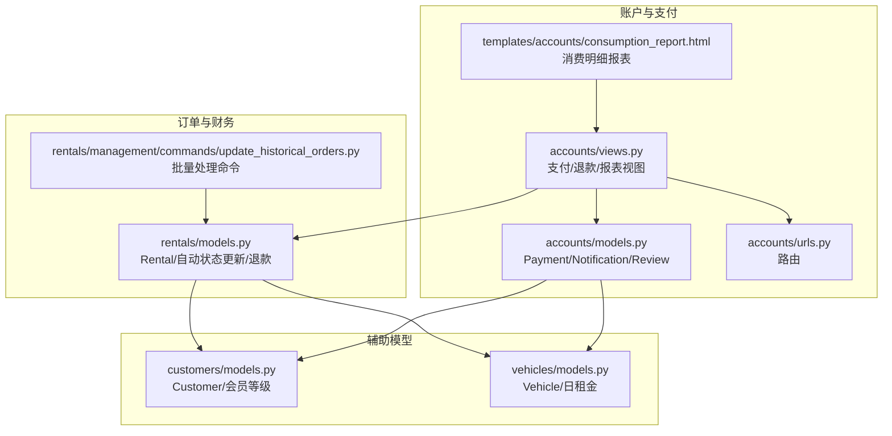
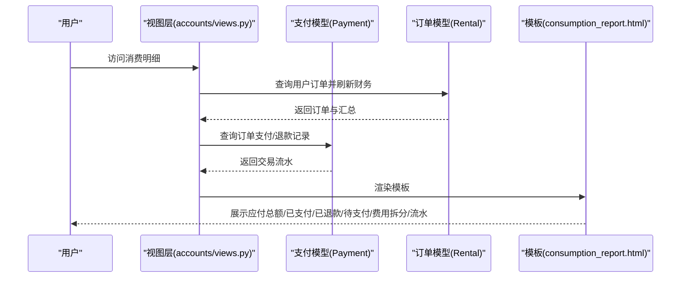
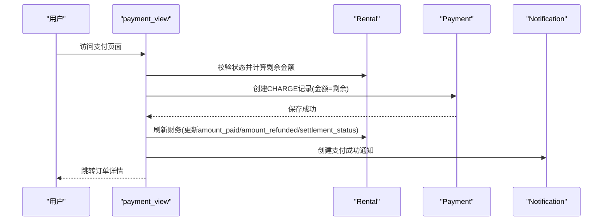
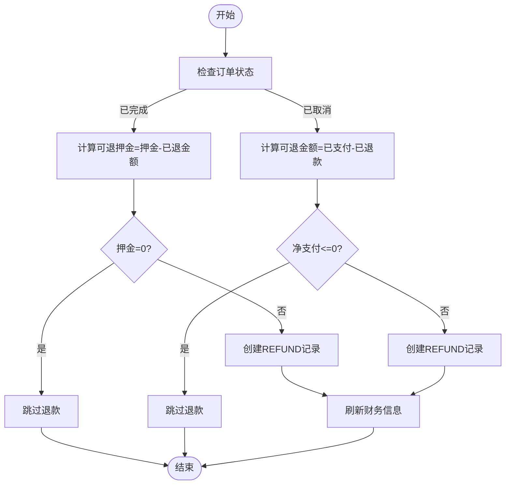
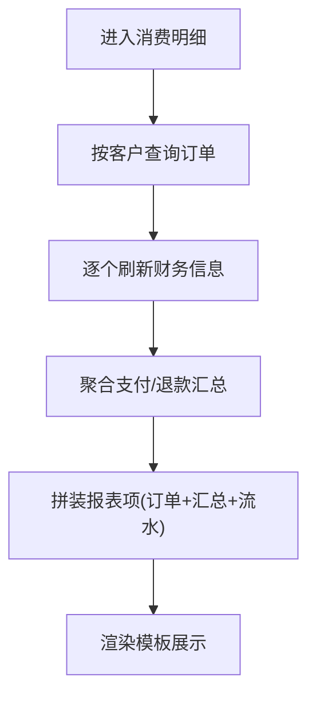
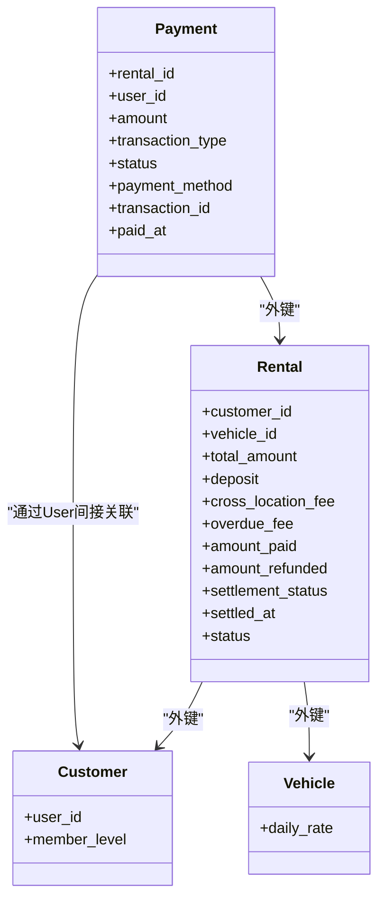

# 支付与财务系统

<cite>
**本文引用的文件**
- [accounts/models.py](file://code/car_rental_system/accounts/models.py)
- [accounts/migrations/0002_payment_extra_fields.py](file://code/car_rental_system/accounts/migrations/0002_payment_extra_fields.py)
- [rentals/models.py](file://code/car_rental_system/rentals/models.py)
- [rentals/management/commands/update_historical_orders.py](file://code/car_rental_system/rentals/management/commands/update_historical_orders.py)
- [accounts/views.py](file://code/car_rental_system/accounts/views.py)
- [accounts/urls.py](file://code/car_rental_system/accounts/urls.py)
- [templates/accounts/consumption_report.html](file://code/car_rental_system/templates/accounts/consumption_report.html)
- [退款信息显示说明.md](file://code/car_rental_system/退款信息显示说明.md)
- [customers/models.py](file://code/car_rental_system/customers/models.py)
- [vehicles/models.py](file://code/car_rental_system/vehicles/models.py)
</cite>

## 目录
1. [简介](#简介)
2. [项目结构](#项目结构)
3. [核心组件](#核心组件)
4. [架构总览](#架构总览)
5. [详细组件分析](#详细组件分析)
6. [依赖关系分析](#依赖关系分析)
7. [性能考量](#性能考量)
8. [故障排查指南](#故障排查指南)
9. [结论](#结论)
10. [附录](#附录)

## 简介
本文件面向“支付与财务系统”，围绕订单支付、退款处理、结算状态管理与消费明细报表展开，重点解释 Payment 模型的设计与业务含义，梳理支付流程与订单的关联机制，阐明退款时资金返还逻辑（尤其是 VIP 会员免押金政策的影响），并说明消费报告页面的数据聚合与展示逻辑。同时结合退款信息显示说明文档，给出退款记录的可视化设计原则与用户体验考量。

## 项目结构
支付与财务系统主要分布在 accounts 与 rentals 两个子应用中：
- accounts：用户资料、支付记录、通知、消费明细报表等
- rentals：订单模型、状态机与财务刷新、退款处理命令等
- templates/accounts：前端模板，包括消费明细报表页面

图表来源
- [accounts/models.py](file://code/car_rental_system/accounts/models.py#L147-L251)
- [accounts/views.py](file://code/car_rental_system/accounts/views.py#L1390-L1422)
- [accounts/urls.py](file://code/car_rental_system/accounts/urls.py#L1-L50)
- [templates/accounts/consumption_report.html](file://code/car_rental_system/templates/accounts/consumption_report.html#L1-L154)
- [rentals/models.py](file://code/car_rental_system/rentals/models.py#L1-L401)
- [rentals/management/commands/update_historical_orders.py](file://code/car_rental_system/rentals/management/commands/update_historical_orders.py#L1-L311)
- [customers/models.py](file://code/car_rental_system/customers/models.py#L1-L160)
- [vehicles/models.py](file://code/car_rental_system/vehicles/models.py#L1-L85)

章节来源
- [accounts/models.py](file://code/car_rental_system/accounts/models.py#L147-L251)
- [rentals/models.py](file://code/car_rental_system/rentals/models.py#L1-L401)
- [accounts/views.py](file://code/car_rental_system/accounts/views.py#L1390-L1422)
- [accounts/urls.py](file://code/car_rental_system/accounts/urls.py#L1-L50)
- [templates/accounts/consumption_report.html](file://code/car_rental_system/templates/accounts/consumption_report.html#L1-L154)
- [rentals/management/commands/update_historical_orders.py](file://code/car_rental_system/rentals/management/commands/update_historical_orders.py#L1-L311)
- [customers/models.py](file://code/car_rental_system/customers/models.py#L1-L160)
- [vehicles/models.py](file://code/car_rental_system/vehicles/models.py#L1-L85)

## 核心组件
- Payment 模型：记录支付与退款，包含金额、支付方式、交易类型、状态、描述、第三方交易号、支付时间等字段，与 Rental、User 建立外键关联。
- Rental 模型：订单主体，包含订单状态、结算状态、总金额、押金、异地还车费用、超时费用、累计支付与累计退款等字段，并提供自动状态更新、财务刷新、押金退款等方法。
- 视图层：提供支付页面、订单详情、消费明细报表等视图，负责调用模型方法与模板渲染。
- 消费明细报表模板：按订单聚合展示应付总额、已支付、已退款、待支付、费用拆分与流水明细。
- 批量处理命令：批量更新历史订单状态、退还押金与已取消订单的已支付金额、刷新所有订单财务信息。

章节来源
- [accounts/models.py](file://code/car_rental_system/accounts/models.py#L147-L251)
- [rentals/models.py](file://code/car_rental_system/rentals/models.py#L1-L401)
- [accounts/views.py](file://code/car_rental_system/accounts/views.py#L1287-L1422)
- [templates/accounts/consumption_report.html](file://code/car_rental_system/templates/accounts/consumption_report.html#L1-L154)
- [rentals/management/commands/update_historical_orders.py](file://code/car_rental_system/rentals/management/commands/update_historical_orders.py#L1-L311)

## 架构总览
支付与财务系统采用“模型-视图-模板”三层结构：
- 模型层：Payment、Rental、Customer、Vehicle 提供数据与业务逻辑。
- 视图层：accounts/views.py 中的支付、退款、报表等视图协调模型与模板。
- 模板层：consumption_report.html 展示聚合后的消费明细与流水。

图表来源
- [accounts/views.py](file://code/car_rental_system/accounts/views.py#L1390-L1422)
- [templates/accounts/consumption_report.html](file://code/car_rental_system/templates/accounts/consumption_report.html#L1-L154)
- [rentals/models.py](file://code/car_rental_system/rentals/models.py#L296-L333)
- [accounts/models.py](file://code/car_rental_system/accounts/models.py#L147-L251)

## 详细组件分析

### Payment 模型设计与业务含义
- 字段与枚举
  - 交易类型：区分支付与退款
  - 支付方式：支持多种支付渠道
  - 状态：待支付、已支付、支付失败、已退款
  - 关联字段：rental、user
  - 时间与编号：paid_at、transaction_id
- 业务要点
  - 通过 transaction_type 与 status 区分支付与退款，便于报表聚合与状态判断
  - 通过 rental.user 关联用户与订单，保证权限控制与财务对账
  - 通过 transaction_id 记录第三方交易号，便于对账与审计

章节来源
- [accounts/models.py](file://code/car_rental_system/accounts/models.py#L147-L251)
- [accounts/migrations/0002_payment_extra_fields.py](file://code/car_rental_system/accounts/migrations/0002_payment_extra_fields.py#L1-L42)

### 支付流程与订单关联机制
- 支付页面
  - 仅允许待确认或进行中的订单支付
  - 金额为“应付总额 - 已支付 + 已退款”的差额（由 Rental.refresh_financials 与 get_payment_summary 计算）
  - 成功支付后创建一条 CHARGE 类型的 Payment 记录，状态为 PAID
- 订单与支付的关联
  - Payment.rental 外键指向 Rental
  - Payment.user 外键指向 User，用于权限校验与报表过滤
- 结算状态管理
  - Rental.refresh_financials 会统计 PAID 的 CHARGE 总额与 REFUNDED 的 REFUND 总额，据此更新 amount_paid、amount_refunded 与 settlement_status

图表来源
- [accounts/views.py](file://code/car_rental_system/accounts/views.py#L1287-L1363)
- [rentals/models.py](file://code/car_rental_system/rentals/models.py#L296-L333)
- [accounts/models.py](file://code/car_rental_system/accounts/models.py#L147-L251)

章节来源
- [accounts/views.py](file://code/car_rental_system/accounts/views.py#L1287-L1363)
- [rentals/models.py](file://code/car_rental_system/rentals/models.py#L296-L333)

### 退款处理与资金返还逻辑
- 退款触发场景
  - 订单完成：退还押金（VIP 会员免押金）
  - 订单取消：退还已支付金额（已扣减已退款）
- 退款金额计算
  - 押金退款：押金 - 已退还金额
  - 取消退款：已支付 - 已退款（净支付）
- 退款记录创建
  - 退款记录为 REFUND 类型，状态为 REFUNDED，支付方式 BANK，带描述与交易号
- VIP 会员免押金政策
  - Rental.save 中对 VIP 客户设置 deposit=0，因此 refund_deposit 不会生成退款记录
  - 但系统仍会刷新财务信息，确保报表与结算状态正确

图表来源
- [rentals/models.py](file://code/car_rental_system/rentals/models.py#L334-L394)
- [accounts/views.py](file://code/car_rental_system/accounts/views.py#L1026-L1091)
- [customers/models.py](file://code/car_rental_system/customers/models.py#L1-L160)

章节来源
- [rentals/models.py](file://code/car_rental_system/rentals/models.py#L334-L394)
- [accounts/views.py](file://code/car_rental_system/accounts/views.py#L1026-L1091)
- [customers/models.py](file://code/car_rental_system/customers/models.py#L1-L160)

### 结算状态管理
- settlement_status 的更新依据
  - 若订单已完成且应付总额 ≤ 已支付，则结算状态为 SETTLED，并记录 settled_at
  - 若已支付 > 0，则为 PARTIAL
  - 否则为 UNSETTLED，并清空 settled_at
- 自动刷新
  - 订单详情与消费明细视图均会调用 refresh_financials，确保数据一致性

章节来源
- [rentals/models.py](file://code/car_rental_system/rentals/models.py#L296-L333)

### 消费明细报表的数据聚合与展示
- 数据来源
  - 按客户查询订单，逐个刷新财务信息
  - 获取订单的所有支付/退款记录，按时间倒序
- 聚合指标
  - 应付总额、已支付、已退款、待支付、费用拆分（基础租金、押金、异地还车费、净支付）
- 展示逻辑
  - 每个订单卡片展示状态与结算状态徽章
  - 费用拆分与流水表格分别呈现
  - 当订单已完成或已取消且存在退款时，显示“已退还”徽章

图表来源
- [accounts/views.py](file://code/car_rental_system/accounts/views.py#L1390-L1422)
- [templates/accounts/consumption_report.html](file://code/car_rental_system/templates/accounts/consumption_report.html#L1-L154)

章节来源
- [accounts/views.py](file://code/car_rental_system/accounts/views.py#L1390-L1422)
- [templates/accounts/consumption_report.html](file://code/car_rental_system/templates/accounts/consumption_report.html#L1-L154)

### 历史订单批量处理与退款显示修复
- 批量命令功能
  - 更新订单状态（PENDING→ONGOING、ONGOING→OVERDUE）
  - 退还已完成订单的押金与已取消订单的已支付金额
  - 刷新所有订单财务信息
- 退款显示说明
  - 历史订单财务信息未刷新或退款记录未创建会导致报表不显示退款
  - 提供预览与执行两种模式，支持跳过状态更新、押金退还与财务刷新
  - 现在查看订单详情或消费明细会自动刷新当前订单/全部订单的财务信息

章节来源
- [rentals/management/commands/update_historical_orders.py](file://code/car_rental_system/rentals/management/commands/update_historical_orders.py#L1-L311)
- [退款信息显示说明.md](file://code/car_rental_system/退款信息显示说明.md#L1-L124)
- [accounts/views.py](file://code/car_rental_system/accounts/views.py#L854-L902)
- [accounts/views.py](file://code/car_rental_system/accounts/views.py#L1390-L1422)

## 依赖关系分析
- Payment 依赖 Rental 与 User，用于权限控制与财务对账
- Rental 依赖 Customer 与 Vehicle，用于计算总金额、押金与费用
- 视图层依赖模型层与模板层，负责业务流程编排与展示
- 批量命令依赖 Rental 与 Payment，用于历史数据修复

图表来源
- [accounts/models.py](file://code/car_rental_system/accounts/models.py#L147-L251)
- [rentals/models.py](file://code/car_rental_system/rentals/models.py#L1-L401)
- [customers/models.py](file://code/car_rental_system/customers/models.py#L1-L160)
- [vehicles/models.py](file://code/car_rental_system/vehicles/models.py#L1-L85)

章节来源
- [accounts/models.py](file://code/car_rental_system/accounts/models.py#L147-L251)
- [rentals/models.py](file://code/car_rental_system/rentals/models.py#L1-L401)
- [customers/models.py](file://code/car_rental_system/customers/models.py#L1-L160)
- [vehicles/models.py](file://code/car_rental_system/vehicles/models.py#L1-L85)

## 性能考量
- 索引与查询优化
  - Payment 增加了 transaction_type 等索引，有利于按类型与订单查询
  - Rental 与 Vehicle 均有常用字段索引，提升筛选与排序性能
- 聚合与缓存
  - get_payment_summary 使用聚合查询一次性统计已支付与已退款
  - Rental.auto_update_status 使用缓存避免频繁更新
- 批量处理
  - 批量命令支持 dry-run 与分步执行，降低风险与数据库压力

章节来源
- [accounts/migrations/0002_payment_extra_fields.py](file://code/car_rental_system/accounts/migrations/0002_payment_extra_fields.py#L1-L42)
- [rentals/models.py](file://code/car_rental_system/rentals/models.py#L171-L229)
- [accounts/views.py](file://code/car_rental_system/accounts/views.py#L1390-L1422)

## 故障排查指南
- 退款未显示
  - 历史订单财务信息未刷新：执行批量更新命令或查看订单详情/消费明细时自动刷新
  - 退款记录未创建：检查订单状态、押金与用户关联
- VIP 会员无押金
  - VIP 客户 deposit=0，不会产生押金退款记录，但财务信息仍会正确刷新
- 支付金额异常
  - 检查订单状态与剩余金额计算逻辑，确认已扣减已退款
- 历史数据修复
  - 使用批量命令预览后再执行，必要时跳过状态更新或押金退还以减少影响

章节来源
- [退款信息显示说明.md](file://code/car_rental_system/退款信息显示说明.md#L1-L124)
- [rentals/management/commands/update_historical_orders.py](file://code/car_rental_system/rentals/management/commands/update_historical_orders.py#L1-L311)
- [accounts/views.py](file://code/car_rental_system/accounts/views.py#L854-L902)
- [accounts/views.py](file://code/car_rental_system/accounts/views.py#L1390-L1422)

## 结论
本系统通过 Payment 与 Rental 的紧密协作，实现了清晰的支付与退款流程，并以消费明细报表直观呈现用户的费用构成与流水。VIP 会员免押金政策在模型层得到体现，退款逻辑与报表展示保持一致。批量处理命令与自动刷新机制有效解决了历史数据与显示一致性问题，提升了用户体验与系统可靠性。

## 附录
- 退款记录可视化设计原则
  - 明确区分支付与退款类型，使用正负金额与不同颜色/徽章标识
  - 在订单详情与消费明细中同步展示退款状态与金额
  - 对历史订单提供一键刷新与批量修复能力
- 用户体验考量
  - 支付页面明确剩余金额与费用拆分
  - 消费明细卡片突出订单状态与结算状态
  - 退款完成后及时推送通知并更新报表