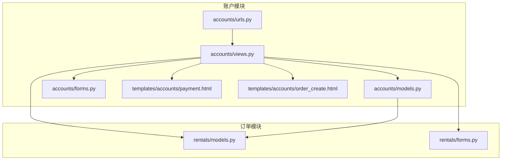
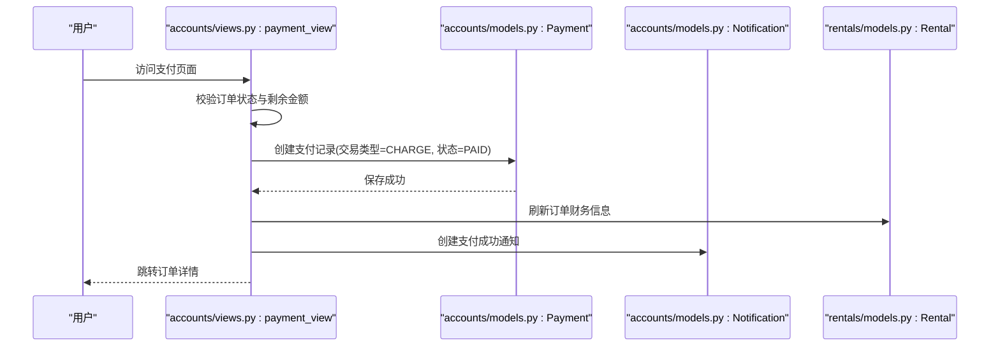
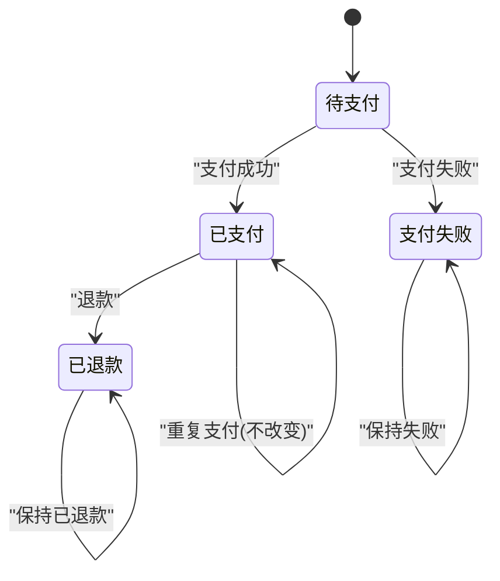
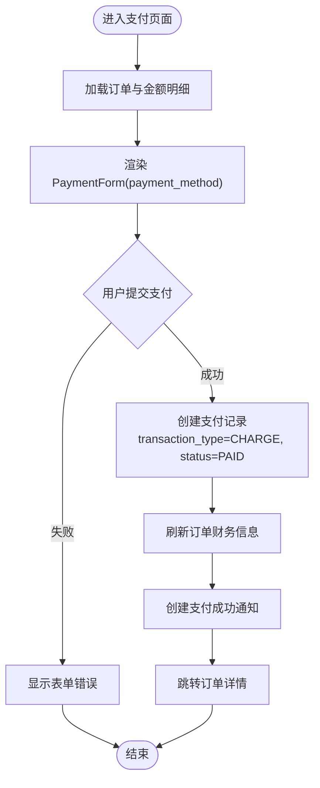
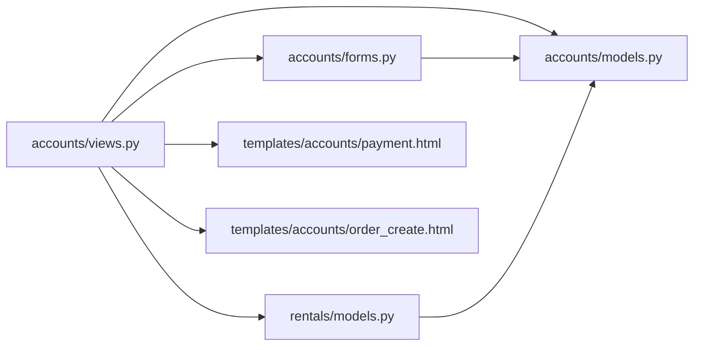

# 支付处理

<cite>
**本文引用的文件**
- [accounts/models.py](file://code/car_rental_system/accounts/models.py)
- [accounts/forms.py](file://code/car_rental_system/accounts/forms.py)
- [accounts/views.py](file://code/car_rental_system/accounts/views.py)
- [accounts/urls.py](file://code/car_rental_system/accounts/urls.py)
- [accounts/migrations/0002_payment_extra_fields.py](file://code/car_rental_system/accounts/migrations/0002_payment_extra_fields.py)
- [templates/accounts/payment.html](file://code/car_rental_system/templates/accounts/payment.html)
- [templates/accounts/order_create.html](file://code/car_rental_system/templates/accounts/order_create.html)
- [rentals/models.py](file://code/car_rental_system/rentals/models.py)
- [rentals/forms.py](file://code/car_rental_system/rentals/forms.py)
</cite>

## 目录
1. [引言](#引言)
2. [项目结构](#项目结构)
3. [核心组件](#核心组件)
4. [架构总览](#架构总览)
5. [详细组件分析](#详细组件分析)
6. [依赖关系分析](#依赖关系分析)
7. [性能考量](#性能考量)
8. [故障排查指南](#故障排查指南)
9. [结论](#结论)
10. [附录](#附录)

## 引言
本文件围绕“支付流程”的实现机制展开，重点说明 Payment 模型中 payment_method、transaction_type 和 status 字段的业务含义与状态转换逻辑；解释支付表单（PaymentForm）的验证规则与前端交互；结合 order_create.html 模板阐述支付页面的用户界面设计与数据绑定；并说明支付成功后的订单状态更新与通知生成，以及支付失败的异常处理思路。

## 项目结构
支付流程涉及账户模块（accounts）、订单模块（rentals）与模板层（templates）。关键文件如下：
- 模型层：accounts/models.py 中的 Payment 与 Notification；rentals/models.py 中的 Rental
- 表单层：accounts/forms.py 中的 PaymentForm；rentals/forms.py 中的 RentalForm
- 视图层：accounts/views.py 中的 payment_view、order_detail_view、order_create_view、order_return_view、order_cancel_view；以及 get_payment_summary、get_order_amount_breakdown 等工具函数
- URL 层：accounts/urls.py 中的支付相关路由
- 模板层：templates/accounts/payment.html（支付页面）、templates/accounts/order_create.html（订单创建页面）

图表来源
- [accounts/urls.py](file://code/car_rental_system/accounts/urls.py#L1-L50)
- [accounts/views.py](file://code/car_rental_system/accounts/views.py#L1289-L1362)
- [accounts/models.py](file://code/car_rental_system/accounts/models.py#L147-L251)
- [accounts/forms.py](file://code/car_rental_system/accounts/forms.py#L300-L314)
- [templates/accounts/payment.html](file://code/car_rental_system/templates/accounts/payment.html#L1-L226)
- [templates/accounts/order_create.html](file://code/car_rental_system/templates/accounts/order_create.html#L1-L301)
- [rentals/models.py](file://code/car_rental_system/rentals/models.py#L12-L169)
- [rentals/forms.py](file://code/car_rental_system/rentals/forms.py#L11-L121)

章节来源
- [accounts/urls.py](file://code/car_rental_system/accounts/urls.py#L1-L50)
- [accounts/views.py](file://code/car_rental_system/accounts/views.py#L1289-L1362)
- [accounts/models.py](file://code/car_rental_system/accounts/models.py#L147-L251)
- [accounts/forms.py](file://code/car_rental_system/accounts/forms.py#L300-L314)
- [templates/accounts/payment.html](file://code/car_rental_system/templates/accounts/payment.html#L1-L226)
- [templates/accounts/order_create.html](file://code/car_rental_system/templates/accounts/order_create.html#L1-L301)
- [rentals/models.py](file://code/car_rental_system/rentals/models.py#L12-L169)
- [rentals/forms.py](file://code/car_rental_system/rentals/forms.py#L11-L121)

## 核心组件
- Payment 模型：承载支付记录，包含 payment_method（支付方式）、transaction_type（交易类型）、status（支付状态）、amount（金额）、transaction_id（交易号）、paid_at（支付时间）等字段，并提供索引与排序。
- PaymentForm 表单：最小化字段，仅暴露 payment_method，便于用户选择支付方式。
- 支付视图 payment_view：负责渲染支付页面、校验订单状态与剩余金额、创建支付记录并生成通知。
- 订单视图：order_detail_view、order_create_view、order_return_view、order_cancel_view 提供金额计算、状态更新与通知生成。
- 模板 payment.html：展示订单信息、金额明细、支付方式选择与提交按钮；右侧展示支付记录与说明。
- 模板 order_create.html：展示订单创建页面，包含日期计算、异地还车逻辑与门店选择交互。

章节来源
- [accounts/models.py](file://code/car_rental_system/accounts/models.py#L147-L251)
- [accounts/forms.py](file://code/car_rental_system/accounts/forms.py#L300-L314)
- [accounts/views.py](file://code/car_rental_system/accounts/views.py#L1289-L1362)
- [templates/accounts/payment.html](file://code/car_rental_system/templates/accounts/payment.html#L1-L226)
- [templates/accounts/order_create.html](file://code/car_rental_system/templates/accounts/order_create.html#L1-L301)
- [rentals/models.py](file://code/car_rental_system/rentals/models.py#L12-L169)

## 架构总览
支付流程的关键路径如下：
- 用户进入支付页面，系统计算剩余应付金额并渲染 PaymentForm。
- 用户提交支付方式后，视图创建一条 CHARGE 类型的 Payment 记录，状态设为 PAID，生成交易号与支付时间。
- 系统刷新订单财务信息，创建“支付成功”通知，随后跳转回订单详情。
- 订单详情页根据支付记录汇总应付、已付、已退、净支付与剩余金额，指导后续操作。

图表来源
- [accounts/views.py](file://code/car_rental_system/accounts/views.py#L1289-L1362)
- [accounts/models.py](file://code/car_rental_system/accounts/models.py#L147-L251)
- [rentals/models.py](file://code/car_rental_system/rentals/models.py#L296-L333)

## 详细组件分析

### Payment 模型字段与状态转换
- payment_method（支付方式）：枚举值包括 ALIPAY、WECHAT、BANK、CASH，用于标识用户选择的支付渠道。
- transaction_type（交易类型）：枚举值包括 CHARGE（支付）、REFUND（退款），用于区分正向收费与退款。
- status（支付状态）：枚举值包括 PENDING（待支付）、PAID（已支付）、FAILED（支付失败）、REFUNDED（已退款）。
- 金额与时间：amount、transaction_id、paid_at、created_at、updated_at 等字段支撑金额计算、交易号生成与时间追踪。
- 索引与排序：按 user/status、rental、transaction_id、transaction_type 等建立索引，提升查询效率。

状态转换逻辑（基于代码实现与业务语义）：
- 待支付 → 已支付：用户完成支付后，transaction_type=CHARGE，status=PAID。
- 已支付 → 已退款：订单取消或异常情况下，transaction_type=REFUND，status=REFUNDED。
- 待支付 → 支付失败：若支付失败，status=FAILED（当前视图模拟为已支付，真实场景可扩展为 FAILED）。

图表来源
- [accounts/models.py](file://code/car_rental_system/accounts/models.py#L147-L251)

章节来源
- [accounts/models.py](file://code/car_rental_system/accounts/models.py#L147-L251)
- [accounts/migrations/0002_payment_extra_fields.py](file://code/car_rental_system/accounts/migrations/0002_payment_extra_fields.py#L1-L42)

### 支付表单（PaymentForm）与前端交互
- 表单字段：仅包含 payment_method，标签为“支付方式”，必填。
- 前端模板 payment.html：
  - 展示订单基本信息、金额明细（基础租金、押金、异地还车费用、应付总额、已支付、已退款、净支付、待支付）。
  - 支付方式选择区域，绑定 PaymentForm.payment_method。
  - 提交按钮显示“确认支付 ¥{remaining_amount}”，点击后触发 POST 请求。
  - 右侧展示支付记录与说明，使用 get_payment_method_display、get_transaction_type_display、get_status_display 进行人性化展示。

图表来源
- [templates/accounts/payment.html](file://code/car_rental_system/templates/accounts/payment.html#L1-L226)
- [accounts/forms.py](file://code/car_rental_system/accounts/forms.py#L300-L314)
- [accounts/views.py](file://code/car_rental_system/accounts/views.py#L1289-L1362)

章节来源
- [accounts/forms.py](file://code/car_rental_system/accounts/forms.py#L300-L314)
- [templates/accounts/payment.html](file://code/car_rental_system/templates/accounts/payment.html#L1-L226)
- [accounts/views.py](file://code/car_rental_system/accounts/views.py#L1289-L1362)

### 订单金额计算与交易号生成
- 金额计算：
  - get_order_amount_breakdown：分解基础租金、押金、异地还车费用与应付总额。
  - get_payment_summary：汇总已支付（仅 CHARGE 且 status=PAID）、已退款（仅 REFUND 且 status=REFUNDED）、净支付与剩余金额。
- 交易号生成：视图中使用当前时间戳生成 transaction_id，作为示例交易号。
- 金额绑定：模板中通过上下文变量（如 base_amount、deposit_amount、cross_location_fee、order_total_amount、amount_paid、refunded_amount、net_paid、remaining_amount）进行数据绑定。

章节来源
- [accounts/views.py](file://code/car_rental_system/accounts/views.py#L225-L269)
- [accounts/views.py](file://code/car_rental_system/accounts/views.py#L1289-L1362)
- [templates/accounts/payment.html](file://code/car_rental_system/templates/accounts/payment.html#L59-L101)

### 支付成功后的订单状态更新与通知
- 支付成功后，系统调用 Rental.refresh_financials 刷新累计支付与退款金额，并根据支付情况更新结算状态。
- 创建 Notification，类型为 PAYMENT_SUCCESS，标题与内容包含订单号与支付金额。
- 支付成功后跳转回订单详情，用户可查看支付记录与订单状态。

章节来源
- [accounts/views.py](file://code/car_rental_system/accounts/views.py#L1316-L1343)
- [rentals/models.py](file://code/car_rental_system/rentals/models.py#L296-L333)
- [accounts/models.py](file://code/car_rental_system/accounts/models.py#L253-L318)

### 支付失败的异常处理
- 当前支付视图在提交时直接将状态设为 PAID 并创建记录，用于演示。
- 若需支持失败场景，可在视图中捕获异常或引入第三方回调，将 status 设为 FAILED，并创建相应通知类型（PAYMENT_FAILED）。

章节来源
- [accounts/views.py](file://code/car_rental_system/accounts/views.py#L1316-L1343)
- [accounts/models.py](file://code/car_rental_system/accounts/models.py#L253-L318)

### 结合 order_create.html 的界面设计与数据绑定
- 订单创建页面展示了日期联动计算（开始日期与结束日期联动计算租赁天数）、异地还车开关控制还车地点输入、门店选择模态框与“其他”还车地点的手动输入逻辑。
- 页面右侧提供订单说明与客户信息卡片，增强用户体验。
- 该页面与支付页面共同构成完整的订单生命周期：创建订单 → 计算金额 → 支付 → 归还 → 结算。

章节来源
- [templates/accounts/order_create.html](file://code/car_rental_system/templates/accounts/order_create.html#L1-L301)
- [templates/accounts/order_create.html](file://code/car_rental_system/templates/accounts/order_create.html#L302-L463)
- [templates/accounts/order_create.html](file://code/car_rental_system/templates/accounts/order_create.html#L464-L800)

## 依赖关系分析
- 视图依赖：
  - payment_view 依赖 PaymentForm、Payment、Notification、Rental.refresh_financials、get_payment_summary、get_order_amount_breakdown。
  - order_detail_view 依赖 Rental.auto_update_status、get_payment_summary、get_order_amount_breakdown。
  - order_create_view 依赖 RentalForm、calculate_rental_amount、Notification。
  - order_return_view 依赖 ReturnForm、Rental.refund_deposit、Rental.refresh_financials。
  - order_cancel_view 依赖 Payment（退款记录）、Rental.refresh_financials。
- 模型依赖：
  - Payment 依赖 Rental、User。
  - Rental 依赖 Customer、Vehicle，并在 save/calculate_order_total/refund_deposit/refresh_financials 中与 Payment 协作。
- 模板依赖：
  - payment.html 依赖 PaymentForm 与上下文中的金额与支付记录。
  - order_create.html 依赖 RentalForm 与前端脚本实现交互。

图表来源
- [accounts/views.py](file://code/car_rental_system/accounts/views.py#L1289-L1362)
- [accounts/forms.py](file://code/car_rental_system/accounts/forms.py#L300-L314)
- [accounts/models.py](file://code/car_rental_system/accounts/models.py#L147-L251)
- [rentals/models.py](file://code/car_rental_system/rentals/models.py#L12-L169)
- [templates/accounts/payment.html](file://code/car_rental_system/templates/accounts/payment.html#L1-L226)
- [templates/accounts/order_create.html](file://code/car_rental_system/templates/accounts/order_create.html#L1-L301)

章节来源
- [accounts/views.py](file://code/car_rental_system/accounts/views.py#L1289-L1362)
- [accounts/forms.py](file://code/car_rental_system/accounts/forms.py#L300-L314)
- [accounts/models.py](file://code/car_rental_system/accounts/models.py#L147-L251)
- [rentals/models.py](file://code/car_rental_system/rentals/models.py#L12-L169)
- [templates/accounts/payment.html](file://code/car_rental_system/templates/accounts/payment.html#L1-L226)
- [templates/accounts/order_create.html](file://code/car_rental_system/templates/accounts/order_create.html#L1-L301)

## 性能考量
- 查询优化：Payment 模型针对 user/status、rental、transaction_id、transaction_type 建立索引，有助于快速筛选支付记录与退款记录。
- 订单状态自动更新：Rental.auto_update_status 使用缓存（5分钟）避免频繁更新，减少数据库压力。
- 金额汇总：get_payment_summary 与 get_order_amount_breakdown 通过聚合查询一次性计算，避免多次往返数据库。
- 前端交互：order_create.html 的日期联动与异地还车逻辑在客户端完成，减少不必要的请求。

章节来源
- [accounts/models.py](file://code/car_rental_system/accounts/models.py#L237-L248)
- [rentals/models.py](file://code/car_rental_system/rentals/models.py#L171-L229)
- [accounts/views.py](file://code/car_rental_system/accounts/views.py#L225-L269)
- [templates/accounts/order_create.html](file://code/car_rental_system/templates/accounts/order_create.html#L302-L463)

## 故障排查指南
- 支付页面无法提交：
  - 检查订单状态是否为 PENDING 或 ONGOING，且 remaining_amount > 0。
  - 确认 PaymentForm 的 payment_method 是否必填并通过验证。
- 金额不正确：
  - 核对 get_order_amount_breakdown 与 get_payment_summary 的计算逻辑，确保基础租金、押金、异地还车费用与超时费用参与计算。
- 支付成功但订单未更新：
  - 确认 Rental.refresh_financials 是否被调用，以及结算状态是否正确更新。
- 通知未生成：
  - 检查 Notification 的创建逻辑与相关字段（notification_type、title、content、related_rental）是否正确赋值。

章节来源
- [accounts/views.py](file://code/car_rental_system/accounts/views.py#L1289-L1362)
- [accounts/views.py](file://code/car_rental_system/accounts/views.py#L225-L269)
- [rentals/models.py](file://code/car_rental_system/rentals/models.py#L296-L333)
- [accounts/models.py](file://code/car_rental_system/accounts/models.py#L253-L318)

## 结论
本系统通过 Payment 模型与 PaymentForm 实现了简洁而清晰的支付入口，配合 Rental 的金额计算与状态管理，形成了从订单创建、支付到归还与结算的完整闭环。支付页面采用前后端协作的方式，既保证了用户体验，又通过严格的字段与状态约束确保业务一致性。未来可在此基础上扩展第三方支付回调、失败重试与更细粒度的通知策略。

## 附录
- 关键上下文变量（payment.html）：rental、remaining_amount、amount_paid、net_paid、refunded_amount、base_amount、deposit_amount、cross_location_fee、order_total_amount、has_cross_location_fee、recent_payments、form。
- 关键上下文变量（order_create.html）：form、customer、store_locations、districts、days-info 动态提示、还车地点选择与“其他”输入联动。

章节来源
- [templates/accounts/payment.html](file://code/car_rental_system/templates/accounts/payment.html#L1-L226)
- [templates/accounts/order_create.html](file://code/car_rental_system/templates/accounts/order_create.html#L1-L301)