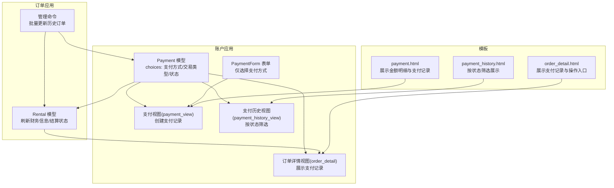
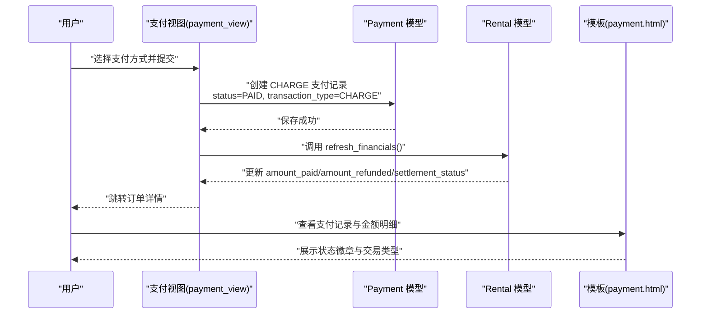
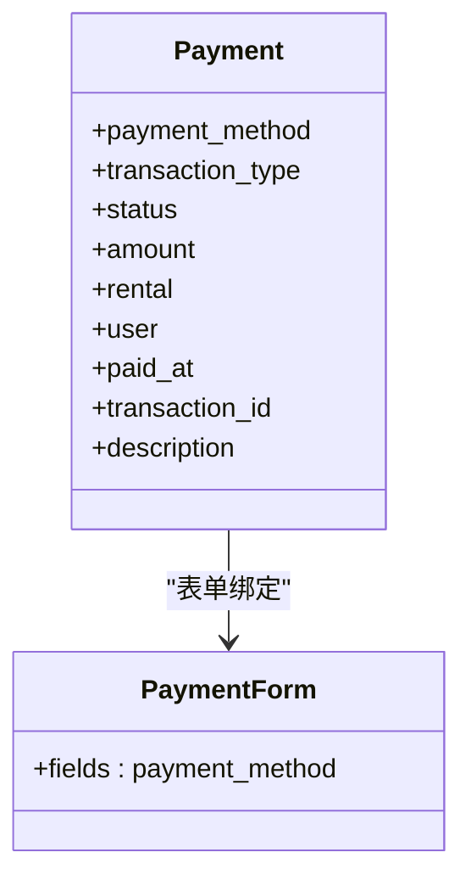
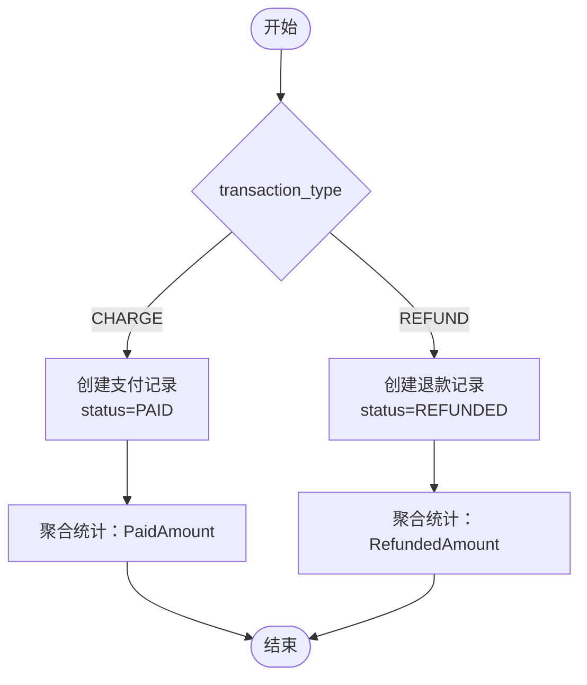
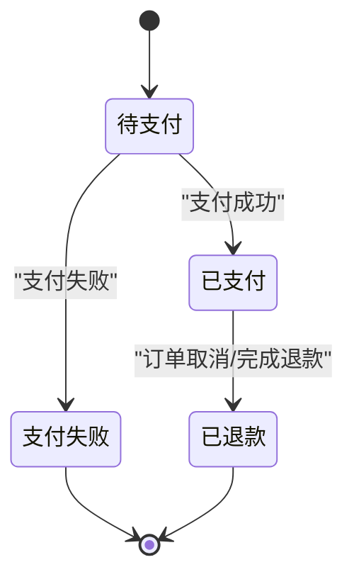
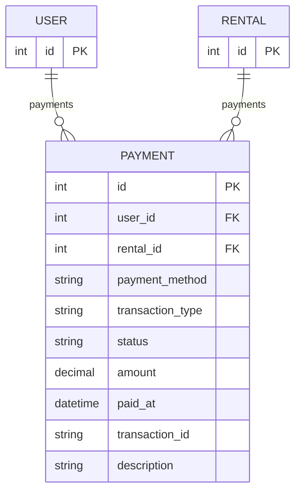

# 支付模型字段说明

<cite>
**本文引用的文件**
- [accounts/models.py](file://code/car_rental_system/accounts/models.py)
- [accounts/migrations/0001_initial.py](file://code/car_rental_system/accounts/migrations/0001_initial.py)
- [accounts/migrations/0002_payment_extra_fields.py](file://code/car_rental_system/accounts/migrations/0002_payment_extra_fields.py)
- [accounts/forms.py](file://code/car_rental_system/accounts/forms.py)
- [accounts/views.py](file://code/car_rental_system/accounts/views.py)
- [rentals/models.py](file://code/car_rental_system/rentals/models.py)
- [templates/accounts/payment.html](file://code/car_rental_system/templates/accounts/payment.html)
- [templates/accounts/payment_history.html](file://code/car_rental_system/templates/accounts/payment_history.html)
- [templates/accounts/order_detail.html](file://code/car_rental_system/templates/accounts/order_detail.html)
- [退款信息显示说明.md](file://code/car_rental_system/退款信息显示说明.md)
- [批量更新历史订单说明.md](file://code/car_rental_system/批量更新历史订单说明.md)
- [rentals/management/commands/update_historical_orders.py](file://code/car_rental_system/rentals/management/commands/update_historical_orders.py)
</cite>

## 目录
1. [引言](#引言)
2. [项目结构](#项目结构)
3. [核心组件](#核心组件)
4. [架构总览](#架构总览)
5. [详细组件分析](#详细组件分析)
6. [依赖关系分析](#依赖关系分析)
7. [性能考量](#性能考量)
8. [故障排查指南](#故障排查指南)
9. [结论](#结论)

## 引言
本文围绕 Payment 模型中的三个核心字段 payment_method、transaction_type 和 status 展开，系统说明其业务含义、设计考量与在完整支付生命周期中的作用。我们将结合数据库迁移、模型定义、视图业务逻辑、模板展示以及退款自动化脚本，全面解析这些字段如何协同支撑“支付”与“退款”的业务闭环，并给出状态机转换条件与触发场景，帮助读者从代码层面准确理解字段的设计意图与使用边界。

## 项目结构
与 Payment 字段相关的关键模块分布如下：
- 模型层：Payment 定义于账户应用的 models.py，包含字段 choices 与索引。
- 迁移层：初始迁移与后续新增字段的迁移文件定义了字段的数据库形态与默认值。
- 视图层：支付页面、支付历史、订单详情等视图对字段进行读写与筛选。
- 表单层：PaymentForm 仅暴露支付方式字段，便于前端选择。
- 模板层：前端页面展示字段的显示与筛选结果。
- 订单模型：Rental 模型通过聚合查询与刷新逻辑，将 Payment 的状态与金额映射到订单结算状态。
- 退款自动化：管理命令与订单模型方法负责历史订单的退款与财务刷新。

图表来源
- [accounts/models.py](file://code/car_rental_system/accounts/models.py#L147-L248)
- [accounts/forms.py](file://code/car_rental_system/accounts/forms.py#L300-L314)
- [accounts/views.py](file://code/car_rental_system/accounts/views.py#L1289-L1387)
- [rentals/models.py](file://code/car_rental_system/rentals/models.py#L296-L394)
- [templates/accounts/payment.html](file://code/car_rental_system/templates/accounts/payment.html#L1-L226)
- [templates/accounts/payment_history.html](file://code/car_rental_system/templates/accounts/payment_history.html#L1-L56)
- [templates/accounts/order_detail.html](file://code/car_rental_system/templates/accounts/order_detail.html#L364-L391)
- [rentals/management/commands/update_historical_orders.py](file://code/car_rental_system/rentals/management/commands/update_historical_orders.py#L65-L270)

章节来源
- [accounts/models.py](file://code/car_rental_system/accounts/models.py#L147-L248)
- [accounts/migrations/0001_initial.py](file://code/car_rental_system/accounts/migrations/0001_initial.py#L74-L95)
- [accounts/migrations/0002_payment_extra_fields.py](file://code/car_rental_system/accounts/migrations/0002_payment_extra_fields.py#L11-L41)
- [accounts/forms.py](file://code/car_rental_system/accounts/forms.py#L300-L314)
- [accounts/views.py](file://code/car_rental_system/accounts/views.py#L1289-L1387)
- [rentals/models.py](file://code/car_rental_system/rentals/models.py#L296-L394)
- [templates/accounts/payment.html](file://code/car_rental_system/templates/accounts/payment.html#L1-L226)
- [templates/accounts/payment_history.html](file://code/car_rental_system/templates/accounts/payment_history.html#L1-L56)
- [templates/accounts/order_detail.html](file://code/car_rental_system/templates/accounts/order_detail.html#L364-L391)
- [退款信息显示说明.md](file://code/car_rental_system/退款信息显示说明.md#L1-L124)
- [批量更新历史订单说明.md](file://code/car_rental_system/批量更新历史订单说明.md#L1-L75)
- [rentals/management/commands/update_historical_orders.py](file://code/car_rental_system/rentals/management/commands/update_historical_orders.py#L65-L270)

## 核心组件
- Payment 模型：承载支付与退款记录，关键字段为 payment_method、transaction_type、status。
- PaymentForm：仅允许用户选择支付方式，简化前端交互。
- 视图层：支付页面创建支付记录并更新订单财务；支付历史按状态筛选；订单详情展示支付记录与可支付状态。
- 模板层：前端展示金额明细、支付记录列表与状态徽章。
- 订单模型：提供 refresh_financials 与 refund_deposit 等方法，将 Payment 的状态映射到订单结算状态与金额字段。
- 退款自动化：管理命令批量为已完成订单退还押金、为已取消订单退还已支付金额，并刷新财务信息。

章节来源
- [accounts/models.py](file://code/car_rental_system/accounts/models.py#L147-L248)
- [accounts/forms.py](file://code/car_rental_system/accounts/forms.py#L300-L314)
- [accounts/views.py](file://code/car_rental_system/accounts/views.py#L1289-L1387)
- [rentals/models.py](file://code/car_rental_system/rentals/models.py#L296-L394)
- [templates/accounts/payment.html](file://code/car_rental_system/templates/accounts/payment.html#L1-L226)
- [templates/accounts/payment_history.html](file://code/car_rental_system/templates/accounts/payment_history.html#L1-L56)
- [templates/accounts/order_detail.html](file://code/car_rental_system/templates/accounts/order_detail.html#L364-L391)
- [rentals/management/commands/update_historical_orders.py](file://code/car_rental_system/rentals/management/commands/update_historical_orders.py#L65-L270)

## 架构总览
Payment 字段在系统中的作用链路如下：
- 用户在支付页面选择支付方式，提交后由视图创建一条 CHARGE 类型的支付记录，状态为 PAID。
- 订单模型通过聚合查询统计已支付金额与已退款金额，据此更新订单的 amount_paid、amount_refunded 与 settlement_status。
- 模板层展示支付记录、金额明细与状态徽章，支持按状态筛选支付历史。
- 退款场景通过订单模型或管理命令创建 REFUND 类型的支付记录，状态为 REFUNDED，并刷新订单财务信息。

图表来源
- [accounts/views.py](file://code/car_rental_system/accounts/views.py#L1289-L1343)
- [accounts/models.py](file://code/car_rental_system/accounts/models.py#L147-L248)
- [rentals/models.py](file://code/car_rental_system/rentals/models.py#L296-L333)
- [templates/accounts/payment.html](file://code/car_rental_system/templates/accounts/payment.html#L1-L226)

## 详细组件分析

### 字段一：payment_method（支付方式）
- 业务含义
  - 描述本次支付所使用的渠道或介质，用于区分线上第三方支付与线下现金。
- 支持的支付方式
  - 支付宝、微信支付、银行卡、现金。
- 设计考量
  - 通过 choices 限定取值范围，保证数据一致性与前端展示友好。
  - 默认值为支付宝，便于快速上线与兼容主流线上支付。
- 在业务流程中的作用
  - 前端仅展示支付方式供用户选择，后端在创建支付记录时写入该字段。
  - 模板层通过 get_payment_method_display 展示中文名称，提升可读性。
- 实际使用路径
  - 表单：PaymentForm 仅包含 payment_method 字段，便于用户快速选择。
  - 视图：支付页面接收用户选择并写入新建的 Payment 记录。
  - 模板：展示支付方式中文名称与状态徽章。

图表来源
- [accounts/models.py](file://code/car_rental_system/accounts/models.py#L147-L248)
- [accounts/forms.py](file://code/car_rental_system/accounts/forms.py#L300-L314)

章节来源
- [accounts/models.py](file://code/car_rental_system/accounts/models.py#L147-L248)
- [accounts/forms.py](file://code/car_rental_system/accounts/forms.py#L300-L314)
- [templates/accounts/payment.html](file://code/car_rental_system/templates/accounts/payment.html#L105-L146)

### 字段二：transaction_type（交易类型）
- 业务含义
  - 区分“支付”与“退款”，用于在聚合统计与报表中正确计算已支付与已退款金额。
- 支持的类型
  - 支付（CHARGE）、退款（REFUND）。
- 设计考量
  - 通过 choices 限定取值，配合 status 字段共同构成支付/退款的双维度状态。
  - 新增字段时明确默认值为 CHARGE，避免历史数据歧义。
- 在业务流程中的作用
  - 支付页面创建支付记录时，transaction_type 固定为 CHARGE。
  - 订单取消或订单完成时，系统创建退款记录，transaction_type 为 REFUND。
  - 订单模型与支付历史视图均按 transaction_type 过滤统计。
- 实际使用路径
  - 视图：支付页面创建支付记录时设置为 CHARGE。
  - 订单模型：refund_deposit 与管理命令在退款时设置为 REFUND。
  - 模板：支付历史与订单详情按类型展示不同颜色与符号。

图表来源
- [accounts/views.py](file://code/car_rental_system/accounts/views.py#L1316-L1333)
- [rentals/models.py](file://code/car_rental_system/rentals/models.py#L334-L394)
- [rentals/management/commands/update_historical_orders.py](file://code/car_rental_system/rentals/management/commands/update_historical_orders.py#L241-L270)

章节来源
- [accounts/migrations/0002_payment_extra_fields.py](file://code/car_rental_system/accounts/migrations/0002_payment_extra_fields.py#L11-L41)
- [accounts/views.py](file://code/car_rental_system/accounts/views.py#L1316-L1333)
- [rentals/models.py](file://code/car_rental_system/rentals/models.py#L334-L394)
- [templates/accounts/payment_history.html](file://code/car_rental_system/templates/accounts/payment_history.html#L28-L47)

### 字段三：status（支付状态）
- 业务含义
  - 描述支付记录的当前状态，用于区分待支付、已支付、支付失败、已退款等阶段。
- 支持的状态
  - 待支付（PENDING）、已支付（PAID）、支付失败（FAILED）、已退款（REFUNDED）。
- 设计考量
  - 通过 choices 限定取值，保证状态机的完整性与一致性。
  - 默认值为 PENDING，便于后续在外部支付回调或退款回调中更新为最终态。
- 状态机设计与转换条件
  - PENDING → PAID：支付成功回调或模拟支付成功（支付页面直接设置为 PAID 并保存）。
  - PENDING → FAILED：支付失败回调或异常处理。
  - PAID → REFUNDED：订单取消或订单完成后的押金/已支付金额退款。
  - FAILED → 不转换：失败状态通常不再回滚，作为审计依据保留。
- 触发场景
  - 支付页面：用户提交后，视图层直接将新建记录状态设为 PAID 并保存。
  - 订单模型：refund_deposit 与管理命令在退款时将记录状态设为 REFUNDED。
  - 模板层：根据状态显示不同徽章颜色，直观反映支付结果。
- 实际使用路径
  - 视图：支付页面创建支付记录时设置为 PAID。
  - 订单模型：refresh_financials 与 refund_deposit 刷新订单财务信息。
  - 支付历史：按 status 过滤展示不同状态的记录。

图表来源
- [accounts/models.py](file://code/car_rental_system/accounts/models.py#L147-L207)
- [accounts/views.py](file://code/car_rental_system/accounts/views.py#L1316-L1333)
- [rentals/models.py](file://code/car_rental_system/rentals/models.py#L296-L333)

章节来源
- [accounts/models.py](file://code/car_rental_system/accounts/models.py#L147-L207)
- [accounts/views.py](file://code/car_rental_system/accounts/views.py#L1316-L1333)
- [templates/accounts/payment.html](file://code/car_rental_system/templates/accounts/payment.html#L192-L219)
- [templates/accounts/payment_history.html](file://code/car_rental_system/templates/accounts/payment_history.html#L28-L47)

## 依赖关系分析
- Payment 与 Rental：一对多关系，一个订单可有多条支付/退款记录；订单模型通过聚合查询将 Payment 的金额与状态映射到订单结算状态。
- Payment 与 User：一对多关系，一个用户可有多笔支付记录；用于支付历史与通知关联。
- PaymentForm：仅包含 payment_method 字段，简化前端交互。
- 模板层：通过 get_payment_method_display、get_transaction_type_display、get_status_display 展示中文描述，增强可读性。
- 退款自动化：管理命令与订单模型方法共同完成历史订单的退款与财务刷新。

图表来源
- [accounts/models.py](file://code/car_rental_system/accounts/models.py#L147-L248)
- [rentals/models.py](file://code/car_rental_system/rentals/models.py#L12-L170)

章节来源
- [accounts/models.py](file://code/car_rental_system/accounts/models.py#L147-L248)
- [rentals/models.py](file://code/car_rental_system/rentals/models.py#L12-L170)

## 性能考量
- 索引设计
  - Payment 模型对 user/status、rental、transaction_id、transaction_type 建立索引，有利于按用户、订单、交易号与交易类型进行高效查询与筛选。
- 聚合统计
  - 订单模型与支付历史视图均采用聚合查询统计已支付与已退款金额，避免逐条遍历，提高性能。
- 缓存与批量处理
  - 订单状态自动更新使用缓存避免频繁更新，减少数据库压力。
- 建议
  - 在高并发场景下，建议对支付回调与退款回调接口增加幂等校验与队列化处理，避免重复入账。
  - 对历史数据的批量刷新与退款操作，建议在维护窗口执行，降低对在线业务的影响。

章节来源
- [accounts/models.py](file://code/car_rental_system/accounts/models.py#L237-L248)
- [accounts/views.py](file://code/car_rental_system/accounts/views.py#L243-L268)
- [rentals/models.py](file://code/car_rental_system/rentals/models.py#L171-L229)
- [批量更新历史订单说明.md](file://code/car_rental_system/批量更新历史订单说明.md#L1-L75)

## 故障排查指南
- 支付记录未显示已退款金额
  - 可能原因：历史订单财务信息未刷新、退款记录未创建。
  - 解决方案：执行批量更新命令刷新财务信息，或在订单详情页面自动刷新。
- 退款记录未生成
  - 可能原因：订单尚未完成或取消，或系统未触发退款逻辑。
  - 解决方案：检查订单状态与相关业务逻辑，必要时手动触发退款或使用管理命令。
- 支付历史筛选无效
  - 可能原因：未正确传递状态参数或模板未渲染。
  - 解决方案：确认支付历史视图的筛选参数与模板渲染逻辑。

章节来源
- [退款信息显示说明.md](file://code/car_rental_system/退款信息显示说明.md#L1-L124)
- [批量更新历史订单说明.md](file://code/car_rental_system/批量更新历史订单说明.md#L1-L75)
- [accounts/views.py](file://code/car_rental_system/accounts/views.py#L1365-L1387)
- [templates/accounts/payment_history.html](file://code/car_rental_system/templates/accounts/payment_history.html#L1-L56)

## 结论
Payment 模型的 payment_method、transaction_type 与 status 三字段共同构成了支付生命周期的核心数据骨架：
- payment_method 明确支付渠道，保障前端选择与后端记账的一致性；
- transaction_type 将“支付/退款”与“状态”解耦，使聚合统计与报表呈现更清晰；
- status 字段通过有限状态机约束，确保支付与退款流程的可追溯与可审计。
结合视图层的业务逻辑、订单模型的财务刷新与模板层的展示，系统实现了从支付到退款的完整闭环。同时，管理命令与自动化刷新机制有效解决了历史数据的遗留问题，提升了系统的整体一致性与用户体验。