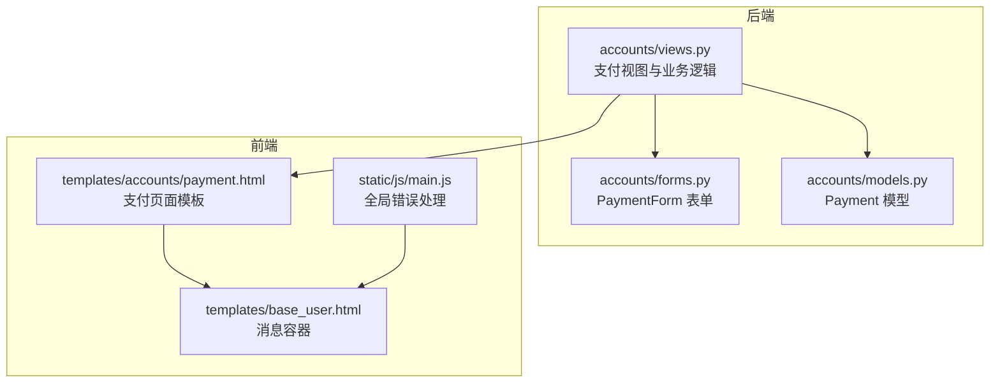
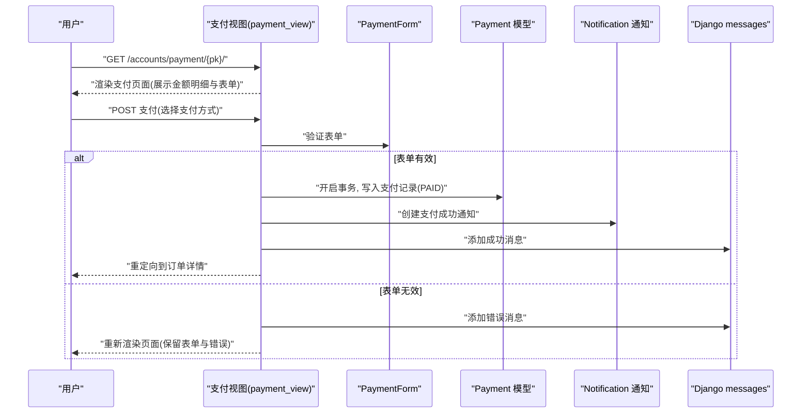
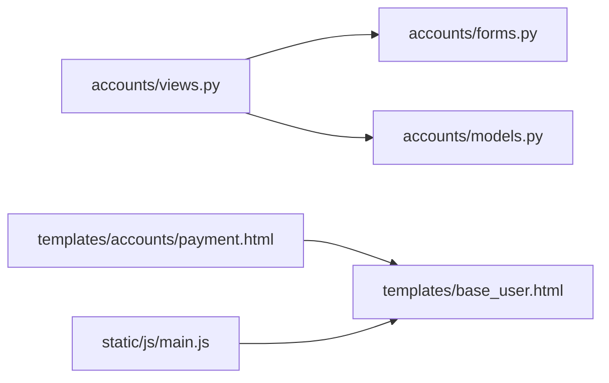

# 支付异常处理

<cite>
**本文引用的文件**
- [accounts/views.py](file://code/car_rental_system/accounts/views.py)
- [accounts/forms.py](file://code/car_rental_system/accounts/forms.py)
- [accounts/models.py](file://code/car_rental_system/accounts/models.py)
- [templates/accounts/payment.html](file://code/car_rental_system/templates/accounts/payment.html)
- [templates/base_user.html](file://code/car_rental_system/templates/base_user.html)
- [static/js/main.js](file://code/car_rental_system/static/js/main.js)
</cite>

## 目录
1. [简介](#简介)
2. [项目结构](#项目结构)
3. [核心组件](#核心组件)
4. [架构总览](#架构总览)
5. [详细组件分析](#详细组件分析)
6. [依赖关系分析](#依赖关系分析)
7. [性能考量](#性能考量)
8. [故障排查指南](#故障排查指南)
9. [结论](#结论)

## 简介
本文件聚焦于系统中“支付流程”的异常处理机制，结合后端视图函数与前端模板，解释如何在多种异常场景下（如网络超时、支付金额验证失败、第三方支付接口错误等）进行捕获与处理，并向用户呈现友好且可操作的错误提示。同时，结合支付页面模板中的错误提示区域与前端 JavaScript 的全局错误处理，说明前后端如何协同提供清晰的重试指引与问题解决方案。

## 项目结构
围绕支付流程的关键文件与职责如下：
- 后端视图层：负责接收支付请求、校验订单与金额、持久化支付记录、创建通知与消息提示。
- 表单层：约束支付方式字段，保证必填与合法。
- 模型层：定义支付记录的数据结构、状态与枚举。
- 前端模板：渲染支付页面、展示金额明细、错误提示与支付记录。
- 前端 JS：提供全局错误捕获与统一提示，增强用户体验。

图表来源
- [accounts/views.py](file://code/car_rental_system/accounts/views.py#L1290-L1362)
- [accounts/forms.py](file://code/car_rental_system/accounts/forms.py#L300-L314)
- [accounts/models.py](file://code/car_rental_system/accounts/models.py#L147-L248)
- [templates/accounts/payment.html](file://code/car_rental_system/templates/accounts/payment.html#L1-L226)
- [templates/base_user.html](file://code/car_rental_system/templates/base_user.html#L179-L196)
- [static/js/main.js](file://code/car_rental_system/static/js/main.js#L580-L606)

章节来源
- [accounts/views.py](file://code/car_rental_system/accounts/views.py#L1290-L1362)
- [accounts/forms.py](file://code/car_rental_system/accounts/forms.py#L300-L314)
- [accounts/models.py](file://code/car_rental_system/accounts/models.py#L147-L248)
- [templates/accounts/payment.html](file://code/car_rental_system/templates/accounts/payment.html#L1-L226)
- [templates/base_user.html](file://code/car_rental_system/templates/base_user.html#L179-L196)
- [static/js/main.js](file://code/car_rental_system/static/js/main.js#L580-L606)

## 核心组件
- 支付视图函数：负责订单权限校验、状态校验、金额校验、事务内落库、通知创建与消息提示。
- 支付表单：约束支付方式字段，确保必填。
- 支付模型：定义支付金额、方式、类型、状态、第三方交易号等字段。
- 支付页面模板：展示订单与金额明细、支付方式选择、错误提示区与支付记录。
- 基础模板：提供消息容器，统一渲染 Django messages。
- 前端 JS：全局捕获 JS 错误与未处理 Promise 拒绝，统一弹窗提示。

章节来源
- [accounts/views.py](file://code/car_rental_system/accounts/views.py#L1290-L1362)
- [accounts/forms.py](file://code/car_rental_system/accounts/forms.py#L300-L314)
- [accounts/models.py](file://code/car_rental_system/accounts/models.py#L147-L248)
- [templates/accounts/payment.html](file://code/car_rental_system/templates/accounts/payment.html#L1-L226)
- [templates/base_user.html](file://code/car_rental_system/templates/base_user.html#L179-L196)
- [static/js/main.js](file://code/car_rental_system/static/js/main.js#L580-L606)

## 架构总览
支付流程的后端控制流如下：

图表来源
- [accounts/views.py](file://code/car_rental_system/accounts/views.py#L1290-L1362)
- [accounts/forms.py](file://code/car_rental_system/accounts/forms.py#L300-L314)
- [accounts/models.py](file://code/car_rental_system/accounts/models.py#L147-L248)

## 详细组件分析

### 支付视图(payment_view)的异常处理
- 订单权限与状态校验
  - 若订单不属于当前用户，提示无权限并重定向。
  - 若订单状态不在“待确认/进行中”，提示仅能支付待确认或进行中的订单并重定向。
- 已支付完成检测
  - 若剩余应付金额小于等于零，提示已完成并重定向。
- 表单验证与事务落库
  - 表单有效：开启事务，写入支付记录（状态为已支付、交易号、支付时间等），刷新订单财务信息，创建支付成功通知，添加成功消息并重定向。
  - 表单无效：添加错误消息并回显表单与错误。
- 前端消息展示
  - 视图通过 Django messages 生成消息，基础模板统一渲染为 Bootstrap Alert。

章节来源
- [accounts/views.py](file://code/car_rental_system/accounts/views.py#L1290-L1362)
- [templates/base_user.html](file://code/car_rental_system/templates/base_user.html#L179-L196)

### 支付表单(PaymentForm)与金额验证
- 字段约束
  - 支付方式字段必填，由表单层保证。
- 金额来源与校验
  - 视图中将应付金额设置为“剩余应付金额”，并在事务内落库，避免外部篡改。
  - 若金额为负或为零，视图提前拦截并提示已完成。

章节来源
- [accounts/forms.py](file://code/car_rental_system/accounts/forms.py#L300-L314)
- [accounts/views.py](file://code/car_rental_system/accounts/views.py#L1290-L1362)

### 支付模型(Payment)与状态枚举
- 关键字段
  - 金额、支付方式、交易类型、状态、第三方交易号、支付时间等。
- 状态与类型
  - 状态包含“待支付/已支付/支付失败/已退款”；交易类型区分“支付/退款”。

章节来源
- [accounts/models.py](file://code/car_rental_system/accounts/models.py#L147-L248)

### 支付页面模板(payment.html)的错误提示区域
- 金额明细与支付说明
  - 展示基础租金、押金、异地还车费用、应付总额、已支付、已退款、净支付与待支付金额。
- 支付方式选择与表单错误
  - 支付方式字段必填，若为空或非法，表单层会生成错误并在页面上显示。
- 支付记录展示
  - 展示最近支付记录，便于用户核对。
- 模板消息容器
  - 通过基础模板的消息容器统一渲染后端 messages，形成统一的错误/成功提示。

章节来源
- [templates/accounts/payment.html](file://code/car_rental_system/templates/accounts/payment.html#L1-L226)
- [templates/base_user.html](file://code/car_rental_system/templates/base_user.html#L179-L196)

### 前端 JavaScript 的全局异常处理
- 全局错误捕获
  - 捕获 JS 运行时错误与未处理的 Promise 拒绝，统一弹窗提示“系统发生错误，请刷新页面重试”或“网络请求失败，请检查网络连接”，并记录日志。
- 与后端消息的配合
  - 后端 messages 与前端 alert 容器共同作用，确保用户看到明确的错误或成功提示。

章节来源
- [static/js/main.js](file://code/car_rental_system/static/js/main.js#L580-L606)
- [templates/base_user.html](file://code/car_rental_system/templates/base_user.html#L179-L196)

## 依赖关系分析
- 视图依赖表单与模型
  - 支付视图依赖 PaymentForm 进行字段校验，依赖 Payment 模型进行持久化。
- 模板依赖基础模板
  - 支付页面模板继承用户基础模板，复用消息容器。
- 前端 JS 与模板协作
  - 前端全局错误处理与模板消息容器共同提升异常可见性与可恢复性。

图表来源
- [accounts/views.py](file://code/car_rental_system/accounts/views.py#L1290-L1362)
- [accounts/forms.py](file://code/car_rental_system/accounts/forms.py#L300-L314)
- [accounts/models.py](file://code/car_rental_system/accounts/models.py#L147-L248)
- [templates/accounts/payment.html](file://code/car_rental_system/templates/accounts/payment.html#L1-L226)
- [templates/base_user.html](file://code/car_rental_system/templates/base_user.html#L179-L196)
- [static/js/main.js](file://code/car_rental_system/static/js/main.js#L580-L606)

## 性能考量
- 事务与一致性
  - 支付流程在事务内完成，确保支付记录与订单财务信息的一致性，避免并发导致的数据不一致。
- 查询与渲染
  - 支付页面会加载最近支付记录与金额汇总，建议在模板中按需渲染，避免一次性加载过多数据。
- 前端错误处理
  - 全局错误处理减少重复代码，提升用户体验；同时避免页面崩溃导致的二次错误。

## 故障排查指南
- 网络超时/请求失败
  - 现象：点击支付后无响应或出现“网络请求失败，请检查网络连接”的提示。
  - 排查：检查网络连通性、CDN 加载情况；查看浏览器开发者工具 Network 面板；确认后端日志与前端控制台错误。
  - 建议：提供“重试”按钮或自动刷新；在模板中增加“刷新页面重试”的引导。
  
  章节来源
  - [static/js/main.js](file://code/car_rental_system/static/js/main.js#L580-L606)
  - [templates/accounts/payment.html](file://code/car_rental_system/templates/accounts/payment.html#L1-L226)

- 支付金额验证失败
  - 现象：表单显示“支付方式不能为空”等错误。
  - 排查：确认表单字段是否必填；检查表单渲染与错误输出区域。
  - 建议：在模板中对必填字段加星号标识，并在错误区域给出明确提示。

  章节来源
  - [accounts/forms.py](file://code/car_rental_system/accounts/forms.py#L300-L314)
  - [templates/accounts/payment.html](file://code/car_rental_system/templates/accounts/payment.html#L105-L146)

- 第三方支付接口错误（模拟场景）
  - 现象：支付成功后订单状态未更新或通知未创建。
  - 排查：检查事务是否提交、通知是否创建、消息是否添加；确认后端日志。
  - 建议：在视图中增加更细粒度的异常捕获与回滚逻辑，确保失败时回滚并提示“支付失败，请稍后重试”。

  章节来源
  - [accounts/views.py](file://code/car_rental_system/accounts/views.py#L1290-L1362)

- 已支付完成仍显示支付按钮
  - 现象：剩余应付金额为零时仍可进入支付页面。
  - 排查：确认视图对剩余金额的判断与重定向逻辑。
  - 建议：在模板中也做一次“剩余金额为零”的提示，避免用户重复点击。

  章节来源
  - [accounts/views.py](file://code/car_rental_system/accounts/views.py#L1290-L1362)
  - [templates/accounts/payment.html](file://code/car_rental_system/templates/accounts/payment.html#L1-L226)

## 结论
本系统在支付流程中通过“视图层校验 + 表单层约束 + 模型层落库 + 模板消息 + 前端全局错误处理”的多层协同，实现了对常见异常场景的覆盖与用户友好的提示。建议后续进一步增强：
- 在支付视图中增加更细粒度的异常捕获与回滚，明确“支付失败”的原因与重试指引；
- 在模板中增加“重试/刷新”的显式按钮与更清晰的问题解决方案；
- 对第三方支付接口错误进行模拟与文档化，便于后续对接真实支付网关时快速定位问题。