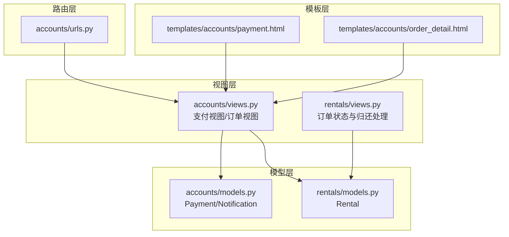
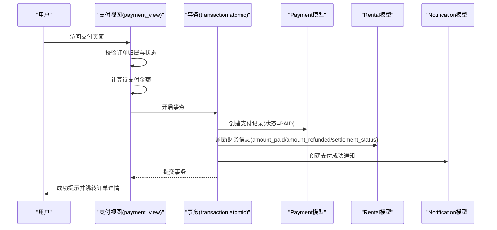
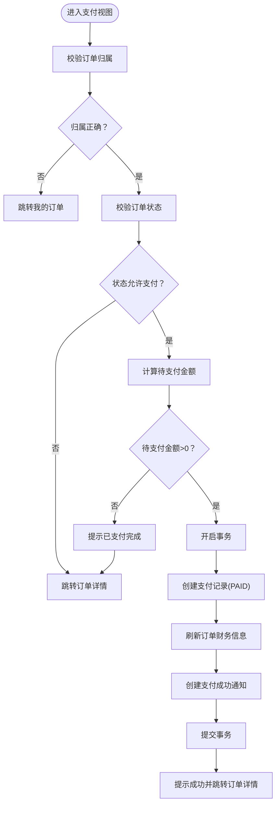
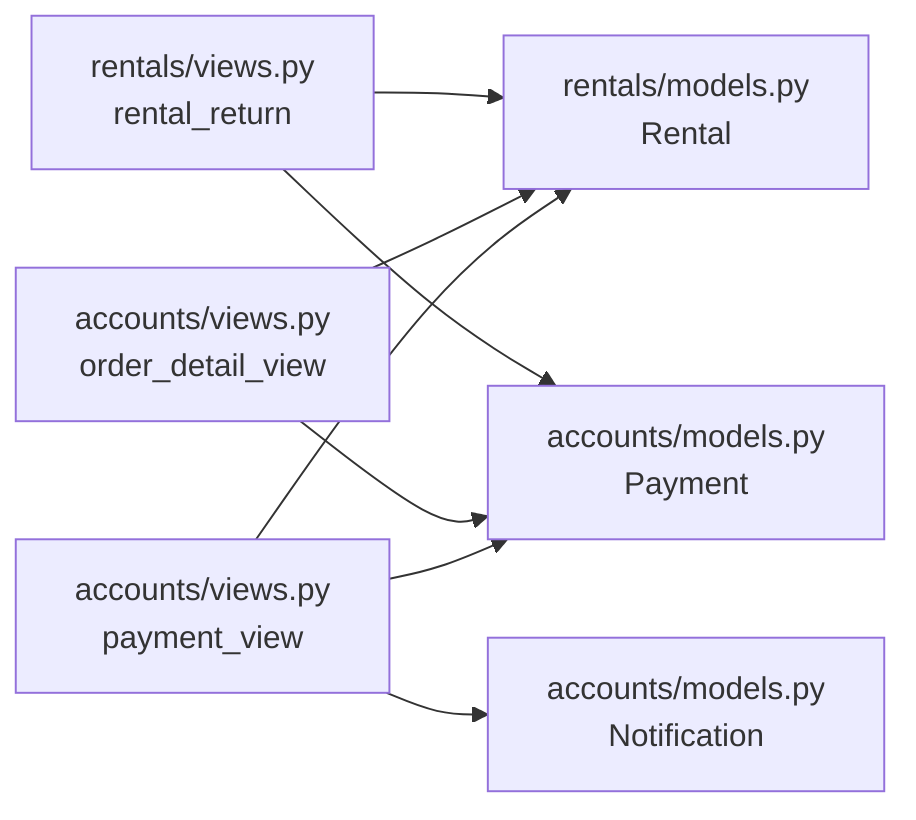

# 支付流程与状态管理

<cite>
**本文引用的文件**
- [accounts/views.py](file://code/car_rental_system/accounts/views.py)
- [accounts/models.py](file://code/car_rental_system/accounts/models.py)
- [rentals/models.py](file://code/car_rental_system/rentals/models.py)
- [rentals/views.py](file://code/car_rental_system/rentals/views.py)
- [accounts/urls.py](file://code/car_rental_system/accounts/urls.py)
- [templates/accounts/payment.html](file://code/car_rental_system/templates/accounts/payment.html)
- [templates/accounts/order_detail.html](file://code/car_rental_system/templates/accounts/order_detail.html)
</cite>

## 目录
1. [引言](#引言)
2. [项目结构](#项目结构)
3. [核心组件](#核心组件)
4. [架构总览](#架构总览)
5. [详细组件分析](#详细组件分析)
6. [依赖关系分析](#依赖关系分析)
7. [性能考量](#性能考量)
8. [故障排查指南](#故障排查指南)
9. [结论](#结论)

## 引言
本文件面向“支付流程与状态管理”的完整生命周期，覆盖从用户进入支付页面、选择支付方式、确认支付金额，到支付结果处理的全过程。重点说明：
- 支付成功后系统如何更新Rental订单状态、创建支付记录并生成相应的系统通知；
- 支付失败时的异常处理机制（错误类型识别、用户提示信息展示与重试逻辑）；
- 结合视图函数中的事务处理与状态变更代码，解释如何保证数据一致性；
- 分析支付状态与订单状态的联动关系。

## 项目结构
围绕支付流程的关键模块与文件如下：
- 视图层：账户与订单相关的视图函数负责支付入口、金额计算、状态校验与事务控制。
- 模型层：Payment、Rental、Notification模型定义支付记录、订单与通知的数据结构。
- URL路由：定义支付入口路径与相关页面访问路径。
- 模板层：支付页面与订单详情页面提供用户交互与状态展示。

图表来源
- [accounts/views.py](file://code/car_rental_system/accounts/views.py#L1289-L1363)
- [rentals/views.py](file://code/car_rental_system/rentals/views.py#L279-L392)
- [accounts/models.py](file://code/car_rental_system/accounts/models.py#L147-L251)
- [rentals/models.py](file://code/car_rental_system/rentals/models.py#L12-L170)
- [accounts/urls.py](file://code/car_rental_system/accounts/urls.py#L36-L40)
- [templates/accounts/payment.html](file://code/car_rental_system/templates/accounts/payment.html#L1-L148)
- [templates/accounts/order_detail.html](file://code/car_rental_system/templates/accounts/order_detail.html#L1-L200)

章节来源
- [accounts/views.py](file://code/car_rental_system/accounts/views.py#L1289-L1363)
- [accounts/models.py](file://code/car_rental_system/accounts/models.py#L147-L251)
- [rentals/models.py](file://code/car_rental_system/rentals/models.py#L12-L170)
- [accounts/urls.py](file://code/car_rental_system/accounts/urls.py#L36-L40)
- [templates/accounts/payment.html](file://code/car_rental_system/templates/accounts/payment.html#L1-L148)
- [templates/accounts/order_detail.html](file://code/car_rental_system/templates/accounts/order_detail.html#L1-L200)

## 核心组件
- Payment模型：记录支付/退款的金额、方式、状态、交易号与时间戳，以及关联的用户与订单。
- Rental模型：维护订单状态、结算状态、累计支付/退款金额、押金与异地还车费用等，并提供自动刷新财务信息与押金退还能力。
- Notification模型：记录系统通知类型（如支付成功/失败），并与订单关联。
- 支付视图(payment_view)：校验订单归属与状态、计算待支付金额、在事务中创建支付记录并刷新财务信息、生成通知。
- 订单详情视图(order_detail_view)：展示订单与支付摘要，决定是否允许支付。
- 归还处理(rental_return)：在订单完成时触发押金退还与财务刷新。

章节来源
- [accounts/models.py](file://code/car_rental_system/accounts/models.py#L147-L251)
- [rentals/models.py](file://code/car_rental_system/rentals/models.py#L12-L170)
- [accounts/views.py](file://code/car_rental_system/accounts/views.py#L1289-L1363)
- [rentals/views.py](file://code/car_rental_system/rentals/views.py#L279-L392)

## 架构总览
支付流程的端到端交互如下：

图表来源
- [accounts/views.py](file://code/car_rental_system/accounts/views.py#L1289-L1363)
- [accounts/models.py](file://code/car_rental_system/accounts/models.py#L147-L251)
- [rentals/models.py](file://code/car_rental_system/rentals/models.py#L296-L333)

## 详细组件分析

### 支付页面与流程（payment_view）
- 入口与权限校验
  - 仅允许订单所属客户访问支付页面。
  - 仅允许“预订中/PENDING”或“进行中/ONGOING”的订单进入支付。
- 金额计算
  - 通过辅助函数计算订单总金额、押金、异地还车费用与已支付/已退款金额，得出待支付余额。
- 事务与一致性
  - 在事务中创建支付记录，设置状态为“已支付”，并写入交易号与支付时间。
  - 提交后调用订单财务刷新方法，确保累计支付/退款与结算状态同步。
- 通知生成
  - 创建一条“支付成功”类型的系统通知，关联当前订单与用户。
- 结果与跳转
  - 成功后提示用户并跳转到订单详情页面。

图表来源
- [accounts/views.py](file://code/car_rental_system/accounts/views.py#L1289-L1363)

章节来源
- [accounts/views.py](file://code/car_rental_system/accounts/views.py#L1289-L1363)

### 订单详情与支付入口（order_detail_view）
- 自动更新订单状态，确保展示最新状态。
- 刷新订单财务信息，计算累计支付/退款与剩余金额。
- 决定是否允许支付：仅当订单状态为“预订中/PENDING”或“进行中/ONGOING”，且剩余金额大于零时才允许支付。
- 展示订单与支付摘要，供用户确认。

章节来源
- [accounts/views.py](file://code/car_rental_system/accounts/views.py#L854-L903)

### 支付记录与通知模型（Payment/Notification）
- Payment模型
  - 字段涵盖金额、支付方式、交易类型（支付/退款）、状态（待支付/PENDING、已支付/PAID、支付失败/FAILED、已退款/REFUNDED）、交易号、支付时间等。
  - 关联用户与订单，便于按用户或订单检索。
- Notification模型
  - 通知类型包含“支付成功/PAYMENT_SUCCESS”、“支付失败/PAYMENT_FAILED”等，便于后续扩展。
  - 关联用户与订单，支持按用户与类型筛选。

章节来源
- [accounts/models.py](file://code/car_rental_system/accounts/models.py#L147-L251)

### 订单状态与财务联动（Rental）
- 财务刷新
  - 根据支付记录（状态=PAID，交易类型=CHARGE）与退款记录（状态=REFUNDED，交易类型=REFUND）刷新累计支付与累计退款。
  - 根据订单总额与已支付金额更新结算状态（未结算/UNSETTLED、部分结算/PARTIAL、已结算/SETTLED）。
- 押金退还
  - 在订单完成时，若存在未退还的押金，创建退款记录并刷新财务信息。
- 状态联动
  - 归还处理中，订单状态由“进行中/ONGOING”或“已超时未归还/OVERDUE”更新为“已完成/COMPLETED”，并根据车辆是否仍有其他进行中订单决定车辆状态是否恢复为“可用/AVAILABLE”。

章节来源
- [rentals/models.py](file://code/car_rental_system/rentals/models.py#L296-L394)
- [rentals/views.py](file://code/car_rental_system/rentals/views.py#L279-L392)

### 支付失败与异常处理
- 当前实现中，支付视图在事务中直接将状态设为“已支付”。若需模拟失败场景，可在事务中抛出异常或回滚，从而保持一致性。
- 建议的失败处理机制（概念性说明）：
  - 错误类型识别：网络异常、第三方支付平台返回失败、金额不匹配、并发冲突等。
  - 用户提示：在视图层捕获异常并返回友好提示，同时保留待支付金额不变。
  - 重试逻辑：前端引导用户重试，或在后端实现幂等的重试队列（建议使用消息队列与唯一交易号）。
  - 通知：创建“支付失败”类型的通知，便于用户与运营追踪。

（本节为通用实践建议，不直接对应现有代码实现）

## 依赖关系分析
- 支付视图依赖：
  - 订单模型：用于状态校验与财务刷新。
  - 支付模型：用于创建支付记录。
  - 通知模型：用于创建支付成功通知。
  - 辅助函数：金额计算与支付汇总。
- 订单详情视图依赖：
  - 订单模型：用于刷新财务信息与展示状态。
  - 支付模型：用于展示支付记录与汇总。
- 归还处理依赖：
  - 订单模型：用于状态变更、押金退还与财务刷新。
  - 支付模型：用于退款记录创建。

图表来源
- [accounts/views.py](file://code/car_rental_system/accounts/views.py#L1289-L1363)
- [accounts/views.py](file://code/car_rental_system/accounts/views.py#L854-L903)
- [rentals/views.py](file://code/car_rental_system/rentals/views.py#L279-L392)
- [accounts/models.py](file://code/car_rental_system/accounts/models.py#L147-L251)
- [rentals/models.py](file://code/car_rental_system/rentals/models.py#L296-L394)

章节来源
- [accounts/views.py](file://code/car_rental_system/accounts/views.py#L1289-L1363)
- [accounts/views.py](file://code/car_rental_system/accounts/views.py#L854-L903)
- [rentals/views.py](file://code/car_rental_system/rentals/views.py#L279-L392)
- [accounts/models.py](file://code/car_rental_system/accounts/models.py#L147-L251)
- [rentals/models.py](file://code/car_rental_system/rentals/models.py#L296-L394)

## 性能考量
- 事务范围：支付流程在事务中执行，确保支付记录、财务刷新与通知的一致性，避免中间态。
- 查询优化：订单详情与支付页面使用select_related/prefetch_related减少查询次数；模板侧展示最近支付记录，避免重复计算。
- 缓存与索引：订单模型与支付模型具备索引，有助于高频查询；自动状态更新使用缓存降低频繁更新带来的压力。

（本节为通用指导，不直接分析具体代码片段）

## 故障排查指南
- 支付无法进入
  - 检查订单状态是否为“预订中/PENDING”或“进行中/ONGOING”，且剩余金额大于零。
  - 确认当前用户为订单所属客户。
- 支付成功但状态未更新
  - 查看事务是否成功提交；核对财务刷新逻辑是否被调用。
- 支付成功通知未出现
  - 检查通知创建逻辑与通知类型是否正确。
- 归还后押金未退
  - 确认订单状态已更新为“已完成/COMPLETED”，并检查押金退还逻辑是否执行。

章节来源
- [accounts/views.py](file://code/car_rental_system/accounts/views.py#L1289-L1363)
- [accounts/views.py](file://code/car_rental_system/accounts/views.py#L854-L903)
- [rentals/models.py](file://code/car_rental_system/rentals/models.py#L334-L394)
- [rentals/views.py](file://code/car_rental_system/rentals/views.py#L279-L392)

## 结论
- 支付流程在视图层通过事务保障一致性，创建支付记录、刷新订单财务信息并生成系统通知，形成闭环。
- 支付成功后，系统通过财务刷新与结算状态联动，确保订单与支付记录的准确映射。
- 支付失败的异常处理与重试机制尚未在现有代码中实现，建议引入幂等重试与失败通知，提升用户体验与系统可靠性。
- 支付状态与订单状态存在清晰的联动关系：支付完成影响结算状态，归还完成触发押金退还与最终状态变更。