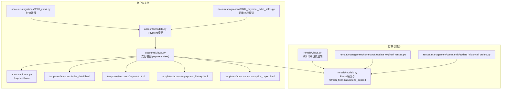
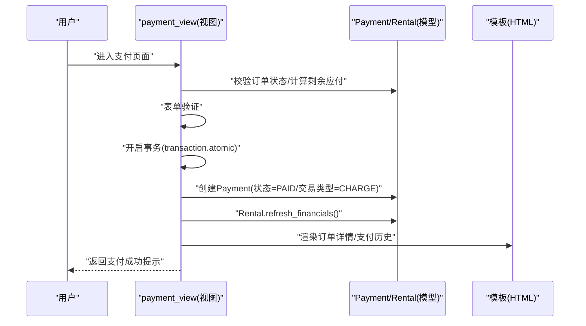
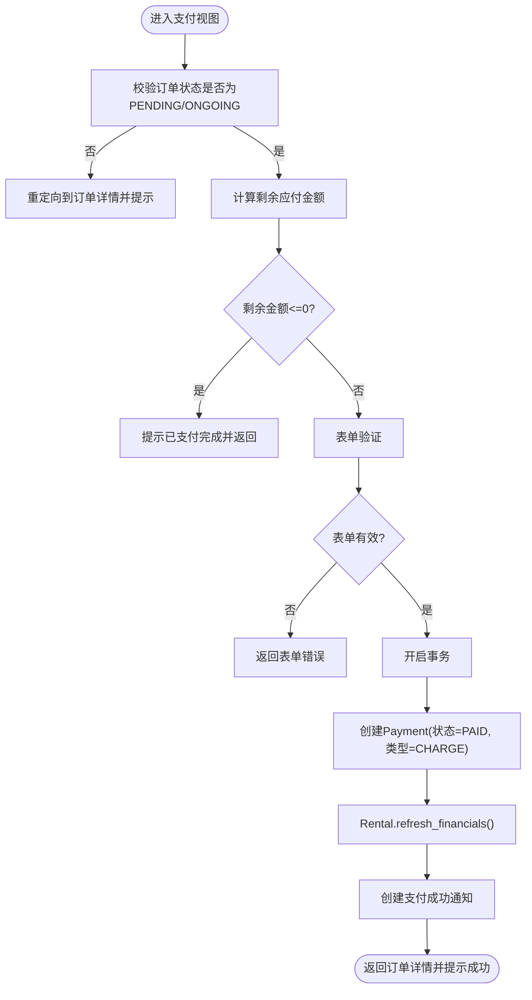
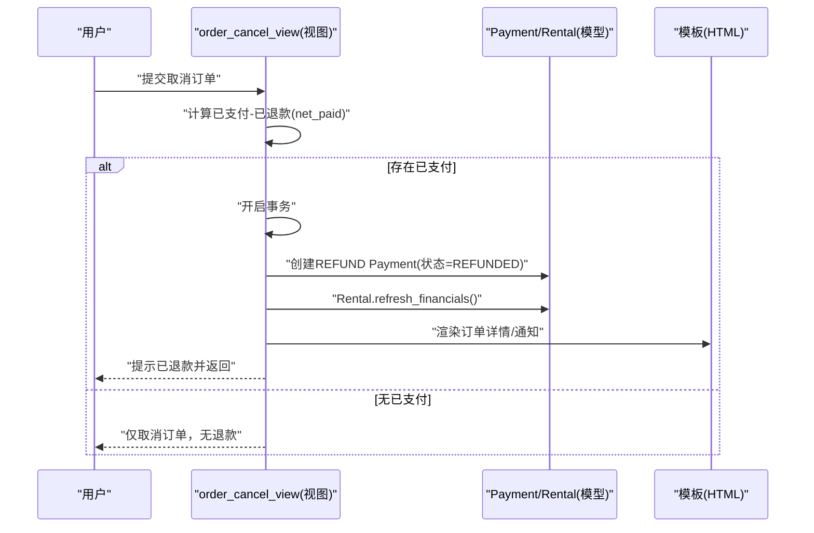
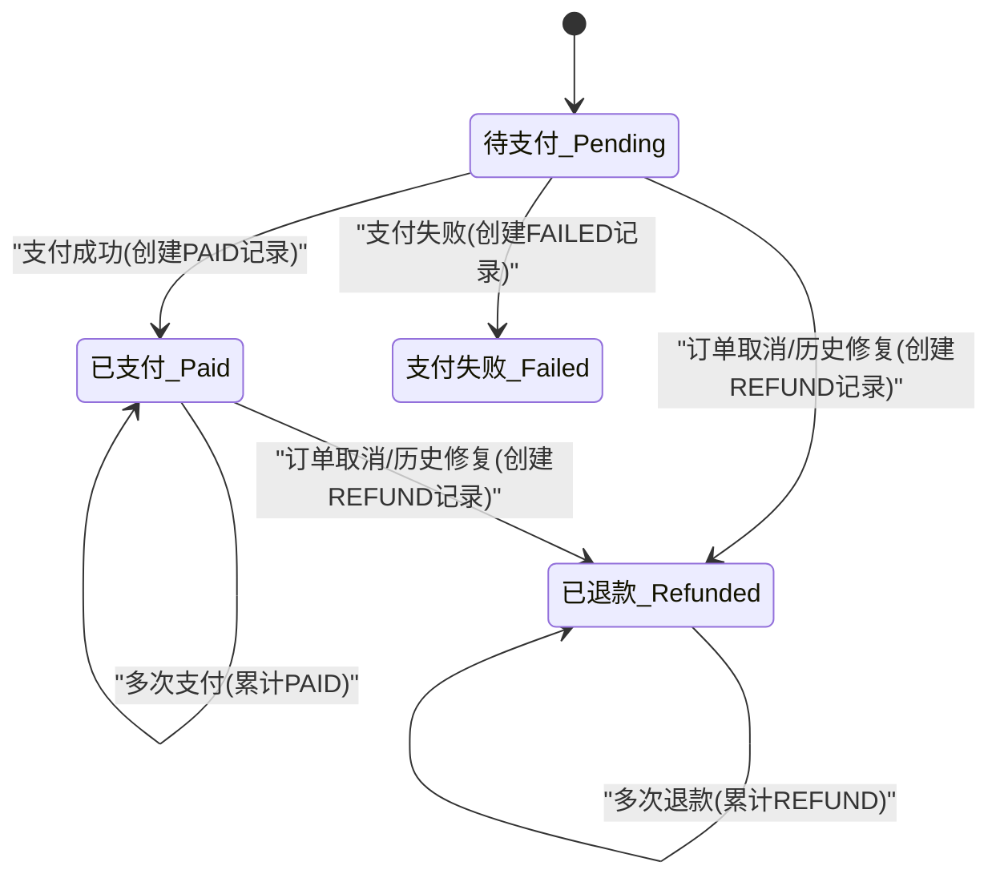
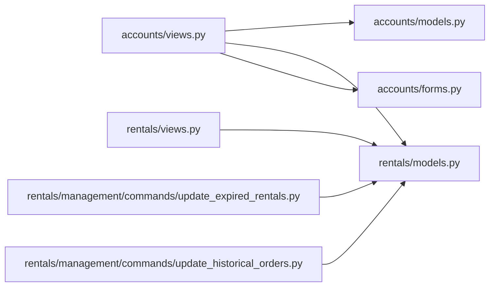

# 支付状态转换

<cite>
**本文引用的文件**
- [accounts/models.py](file://code/car_rental_system/accounts/models.py)
- [accounts/views.py](file://code/car_rental_system/accounts/views.py)
- [rentals/models.py](file://code/car_rental_system/rentals/models.py)
- [rentals/views.py](file://code/car_rental_system/rentals/views.py)
- [accounts/forms.py](file://code/car_rental_system/accounts/forms.py)
- [accounts/migrations/0001_initial.py](file://code/car_rental_system/accounts/migrations/0001_initial.py)
- [accounts/migrations/0002_payment_extra_fields.py](file://code/car_rental_system/accounts/migrations/0002_payment_extra_fields.py)
- [templates/accounts/order_detail.html](file://code/car_rental_system/templates/accounts/order_detail.html)
- [templates/accounts/payment.html](file://code/car_rental_system/templates/accounts/payment.html)
- [templates/accounts/payment_history.html](file://code/car_rental_system/templates/accounts/payment_history.html)
- [templates/accounts/consumption_report.html](file://code/car_rental_system/templates/accounts/consumption_report.html)
- [rentals/management/commands/update_expired_rentals.py](file://code/car_rental_system/rentals/management/commands/update_expired_rentals.py)
- [rentals/management/commands/update_historical_orders.py](file://code/car_rental_system/rentals/management/commands/update_historical_orders.py)
- [退款信息显示说明.md](file://code/car_rental_system/退款信息显示说明.md)
</cite>

## 目录
1. [引言](#引言)
2. [项目结构](#项目结构)
3. [核心组件](#核心组件)
4. [架构总览](#架构总览)
5. [详细组件分析](#详细组件分析)
6. [依赖关系分析](#依赖关系分析)
7. [性能考量](#性能考量)
8. [故障排查指南](#故障排查指南)
9. [结论](#结论)

## 引言
本文件围绕“支付状态在系统中的完整生命周期”展开，目标是：
- 明确从待支付(PENDING)到已支付(PAID)、支付失败(FAILED)、已退款(REFUNDED)的转换规则；
- 解释在views.py中处理支付请求时，如何通过事务确保状态变更的数据一致性；
- 说明状态转换对关联Rental订单的影响；
- 结合Payment模型的状态字段定义，解释各状态的业务含义与转换条件；
- 提供状态转换图示例，帮助非技术读者理解。

## 项目结构
本系统采用分层清晰的Django项目结构，支付相关的核心代码集中在accounts子应用，订单与财务结算逻辑集中在rentals子应用，前端模板位于templates目录。

图表来源
- [accounts/models.py](file://code/car_rental_system/accounts/models.py#L147-L251)
- [accounts/views.py](file://code/car_rental_system/accounts/views.py#L1289-L1362)
- [accounts/forms.py](file://code/car_rental_system/accounts/forms.py#L300-L314)
- [accounts/migrations/0001_initial.py](file://code/car_rental_system/accounts/migrations/0001_initial.py#L74-L95)
- [accounts/migrations/0002_payment_extra_fields.py](file://code/car_rental_system/accounts/migrations/0002_payment_extra_fields.py#L1-L40)
- [templates/accounts/order_detail.html](file://code/car_rental_system/templates/accounts/order_detail.html#L390-L425)
- [templates/accounts/payment.html](file://code/car_rental_system/templates/accounts/payment.html#L205-L223)
- [templates/accounts/payment_history.html](file://code/car_rental_system/templates/accounts/payment_history.html#L34-L54)
- [templates/accounts/consumption_report.html](file://code/car_rental_system/templates/accounts/consumption_report.html#L95-L142)
- [rentals/models.py](file://code/car_rental_system/rentals/models.py#L296-L333)
- [rentals/views.py](file://code/car_rental_system/rentals/views.py#L422-L447)
- [rentals/management/commands/update_expired_rentals.py](file://code/car_rental_system/rentals/management/commands/update_expired_rentals.py#L144-L173)
- [rentals/management/commands/update_historical_orders.py](file://code/car_rental_system/rentals/management/commands/update_historical_orders.py#L241-L270)

章节来源
- [accounts/models.py](file://code/car_rental_system/accounts/models.py#L147-L251)
- [accounts/views.py](file://code/car_rental_system/accounts/views.py#L1289-L1362)
- [rentals/models.py](file://code/car_rental_system/rentals/models.py#L296-L333)

## 核心组件
- Payment模型：定义支付状态(PENDING/PAID/FAILED/REFUNDED)、交易类型(CHARGE/REFUND)、支付方式、金额、交易号、支付时间等字段，并与Rental和User建立外键关联。
- Rental模型：维护订单状态、结算状态、累计支付/退款金额、押金、异地还车费用、超时费用等，并提供refresh_financials与refund_deposit方法用于刷新财务与自动退款。
- 支付视图(payment_view)：负责校验订单状态、计算剩余应付金额、在事务中创建支付记录并刷新订单财务信息。
- 取消订单视图(order_cancel_view)：在事务中将已支付金额转为REFUND记录并刷新财务信息。
- 前端模板：展示支付状态、交易类型、金额、描述、交易号等，便于用户核对。

章节来源
- [accounts/models.py](file://code/car_rental_system/accounts/models.py#L147-L251)
- [rentals/models.py](file://code/car_rental_system/rentals/models.py#L296-L333)
- [accounts/views.py](file://code/car_rental_system/accounts/views.py#L1289-L1362)
- [templates/accounts/order_detail.html](file://code/car_rental_system/templates/accounts/order_detail.html#L390-L425)
- [templates/accounts/payment.html](file://code/car_rental_system/templates/accounts/payment.html#L205-L223)
- [templates/accounts/payment_history.html](file://code/car_rental_system/templates/accounts/payment_history.html#L34-L54)
- [templates/accounts/consumption_report.html](file://code/car_rental_system/templates/accounts/consumption_report.html#L95-L142)

## 架构总览
支付状态转换贯穿“视图层-模型层-模板层”的协作：
- 视图层：接收用户请求，校验权限与订单状态，计算应付金额，使用事务创建Payment记录，调用Rental.refresh_financials刷新财务。
- 模型层：Payment与Rental模型定义状态与字段，Rental提供refresh_financials与refund_deposit，自动维护结算状态与退款。
- 模板层：渲染支付状态、交易类型、金额、描述、交易号等，直观反馈状态变化。

图表来源
- [accounts/views.py](file://code/car_rental_system/accounts/views.py#L1289-L1362)
- [rentals/models.py](file://code/car_rental_system/rentals/models.py#L296-L333)
- [templates/accounts/order_detail.html](file://code/car_rental_system/templates/accounts/order_detail.html#L390-L425)
- [templates/accounts/payment.html](file://code/car_rental_system/templates/accounts/payment.html#L205-L223)
- [templates/accounts/payment_history.html](file://code/car_rental_system/templates/accounts/payment_history.html#L34-L54)
- [templates/accounts/consumption_report.html](file://code/car_rental_system/templates/accounts/consumption_report.html#L95-L142)

## 详细组件分析

### Payment模型与状态定义
- 状态字段：PENDING(待支付)、PAID(已支付)、FAILED(支付失败)、REFUNDED(已退款)
- 交易类型：CHARGE(支付)、REFUND(退款)
- 关联关系：Payment外键到Rental与User，支持按用户、订单、交易号、交易类型等索引查询
- 业务含义：
  - PENDING：支付尚未完成，通常由系统初始化或等待第三方回调
  - PAID：支付成功，金额计入累计支付
  - FAILED：支付失败，系统应保留失败记录以便审计
  - REFUNDED：退款成功，金额计入累计退款

章节来源
- [accounts/models.py](file://code/car_rental_system/accounts/models.py#L147-L251)
- [accounts/migrations/0001_initial.py](file://code/car_rental_system/accounts/migrations/0001_initial.py#L74-L95)
- [accounts/migrations/0002_payment_extra_fields.py](file://code/car_rental_system/accounts/migrations/0002_payment_extra_fields.py#L1-L40)

### 支付视图(payment_view)与事务一致性
- 权限与状态校验：仅允许PENDING或ONGOING的订单支付；必须属于当前用户
- 金额计算：使用get_payment_summary计算剩余应付金额，避免超额支付
- 事务保障：使用transaction.atomic包裹创建Payment与刷新财务，保证原子性
- 状态变更：创建Payment时直接设置status=PAID、transaction_type=CHARGE
- 后续动作：调用Rental.refresh_financials刷新累计支付/退款与结算状态，并创建支付成功通知

图表来源
- [accounts/views.py](file://code/car_rental_system/accounts/views.py#L1289-L1362)
- [accounts/forms.py](file://code/car_rental_system/accounts/forms.py#L300-L314)
- [rentals/models.py](file://code/car_rental_system/rentals/models.py#L296-L333)

章节来源
- [accounts/views.py](file://code/car_rental_system/accounts/views.py#L1289-L1362)
- [accounts/forms.py](file://code/car_rental_system/accounts/forms.py#L300-L314)
- [rentals/models.py](file://code/car_rental_system/rentals/models.py#L296-L333)

### 取消订单与退款流程
- 在order_cancel_view中，若存在已支付金额(net_paid>0)，在事务中创建REFUND类型的Payment记录，状态为REFUNDED，并刷新Rental财务信息
- 该流程确保退款与支付记录的一致性，避免出现“已退款但财务未更新”的情况

图表来源
- [accounts/views.py](file://code/car_rental_system/accounts/views.py#L1027-L1091)
- [rentals/models.py](file://code/car_rental_system/rentals/models.py#L296-L333)
- [rentals/views.py](file://code/car_rental_system/rentals/views.py#L422-L447)

章节来源
- [accounts/views.py](file://code/car_rental_system/accounts/views.py#L1027-L1091)
- [rentals/views.py](file://code/car_rental_system/rentals/views.py#L422-L447)

### 自动退款与历史订单修复
- 过期订单自动结算脚本(update_expired_rentals.py)与历史订单修复脚本(update_historical_orders.py)会在订单完成后自动为符合条件的订单创建REFUND记录并刷新财务信息
- 退款信息显示说明文档提供了批量修复与验证退款信息的方法

章节来源
- [rentals/management/commands/update_expired_rentals.py](file://code/car_rental_system/rentals/management/commands/update_expired_rentals.py#L144-L173)
- [rentals/management/commands/update_historical_orders.py](file://code/car_rental_system/rentals/management/commands/update_historical_orders.py#L241-L270)
- [退款信息显示说明.md](file://code/car_rental_system/退款信息显示说明.md#L1-L58)

### 状态转换图示例
以下为从PENDING到PAID/FAILED/REFUNDED的典型转换路径：

图表来源
- [accounts/models.py](file://code/car_rental_system/accounts/models.py#L147-L251)
- [accounts/views.py](file://code/car_rental_system/accounts/views.py#L1289-L1362)
- [accounts/views.py](file://code/car_rental_system/accounts/views.py#L1027-L1091)
- [rentals/management/commands/update_expired_rentals.py](file://code/car_rental_system/rentals/management/commands/update_expired_rentals.py#L144-L173)
- [rentals/management/commands/update_historical_orders.py](file://code/car_rental_system/rentals/management/commands/update_historical_orders.py#L241-L270)

## 依赖关系分析
- 模块耦合：
  - accounts.views依赖accounts.models、rentals.models、accounts.forms与模板
  - rentals.models被accounts.views与rentals.management.commands调用
- 外部依赖：
  - Django事务(transaction.atomic)保证支付与财务刷新的原子性
  - 索引字段(transaction_type、rental、user、transaction_id)提升查询效率
- 潜在风险：
  - 若第三方回调缺失，FAILED状态需由业务逻辑补充
  - 历史订单财务信息需定期刷新，避免显示不一致

图表来源
- [accounts/views.py](file://code/car_rental_system/accounts/views.py#L1289-L1362)
- [accounts/models.py](file://code/car_rental_system/accounts/models.py#L147-L251)
- [rentals/models.py](file://code/car_rental_system/rentals/models.py#L296-L333)
- [accounts/forms.py](file://code/car_rental_system/accounts/forms.py#L300-L314)
- [rentals/views.py](file://code/car_rental_system/rentals/views.py#L422-L447)
- [rentals/management/commands/update_expired_rentals.py](file://code/car_rental_system/rentals/management/commands/update_expired_rentals.py#L144-L173)
- [rentals/management/commands/update_historical_orders.py](file://code/car_rental_system/rentals/management/commands/update_historical_orders.py#L241-L270)

章节来源
- [accounts/views.py](file://code/car_rental_system/accounts/views.py#L1289-L1362)
- [rentals/models.py](file://code/car_rental_system/rentals/models.py#L296-L333)

## 性能考量
- 索引优化：Payment模型对user/status、rental、transaction_id、transaction_type建立索引，有助于快速筛选与统计
- 查询聚合：get_payment_summary与Rental.refresh_financials使用聚合查询，减少循环与多次数据库往返
- 事务范围：将创建Payment与刷新财务放在同一事务中，避免中间态导致的重复退款或财务不一致

章节来源
- [accounts/models.py](file://code/car_rental_system/accounts/models.py#L237-L248)
- [accounts/views.py](file://code/car_rental_system/accounts/views.py#L1289-L1362)
- [rentals/models.py](file://code/car_rental_system/rentals/models.py#L296-L333)

## 故障排查指南
- 支付后状态未更新
  - 检查是否在事务中创建Payment并调用了Rental.refresh_financials
  - 确认模板渲染是否正确显示状态与交易类型
- 历史订单退款未显示
  - 执行历史订单修复命令，自动为已完成订单创建REFUND记录并刷新财务
  - 查看退款信息显示说明文档，确认退款记录类型为REFUND且状态为REFUNDED
- 订单取消后仍有已支付
  - 确认order_cancel_view已创建REFUND记录并刷新财务
  - 检查net_paid计算是否正确（已支付-已退款）

章节来源
- [accounts/views.py](file://code/car_rental_system/accounts/views.py#L1027-L1091)
- [rentals/management/commands/update_historical_orders.py](file://code/car_rental_system/rentals/management/commands/update_historical_orders.py#L241-L270)
- [退款信息显示说明.md](file://code/car_rental_system/退款信息显示说明.md#L1-L58)

## 结论
- 支付状态转换以Payment模型为核心，结合Rental模型的财务刷新与退款机制，形成闭环
- 通过事务确保支付与财务更新的原子性，避免并发场景下的数据不一致
- FAILED状态在现有代码中未显式触发，建议在第三方回调或异常处理中补充FAILED记录
- 历史订单可通过管理命令批量修复，确保退款与财务信息准确显示