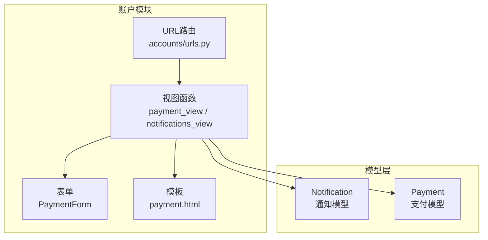
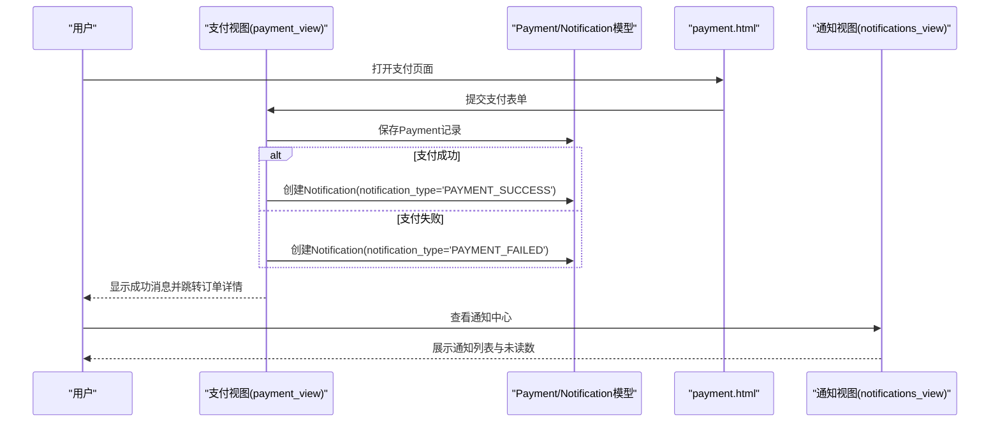
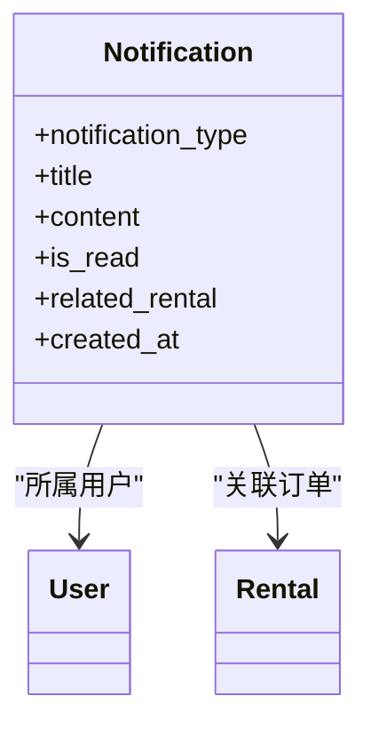
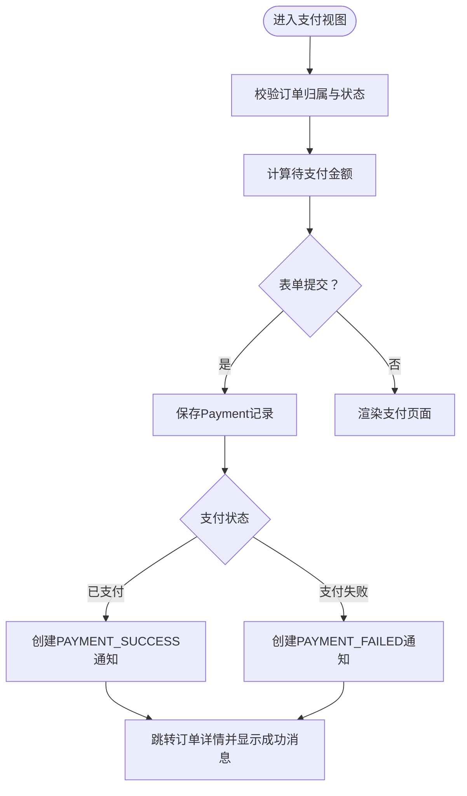
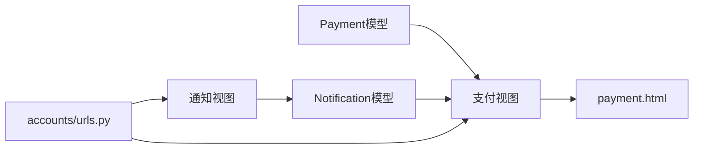

# 支付通知机制

<cite>
**本文引用的文件**
- [models.py](file://code/car_rental_system/accounts/models.py)
- [views.py](file://code/car_rental_system/accounts/views.py)
- [urls.py](file://code/car_rental_system/accounts/urls.py)
- [payment.html](file://code/car_rental_system/templates/accounts/payment.html)
- [0001_initial.py](file://code/car_rental_system/accounts/migrations/0001_initial.py)
- [forms.py](file://code/car_rental_system/accounts/forms.py)
</cite>

## 目录
1. [引言](#引言)
2. [项目结构](#项目结构)
3. [核心组件](#核心组件)
4. [架构总览](#架构总览)
5. [详细组件分析](#详细组件分析)
6. [依赖关系分析](#依赖关系分析)
7. [性能考量](#性能考量)
8. [故障排查指南](#故障排查指南)
9. [结论](#结论)

## 引言
本文件全面阐述系统在支付过程中的通知生成与处理机制，重点覆盖以下方面：
- 支付成功(PAYMENT_SUCCESS)与支付失败(PAYMENT_FAILED)通知的触发条件与流程
- Notification模型的设计如何支持支付相关通知
- 在支付视图中如何创建与管理这些通知
- 结合payment.html模板的用户界面反馈，说明前端如何展示支付结果通知，确保用户获得及时的状态更新

## 项目结构
围绕支付通知的关键文件组织如下：
- 模型层：Notification与Payment模型定义，提供通知类型枚举与支付状态枚举
- 视图层：支付视图负责创建支付记录并生成支付成功通知；通知视图负责展示与标记通知
- 模板层：payment.html展示支付金额明细与支付表单，提交后引导用户查看订单详情与通知
- URL层：定义支付与通知相关路由

图表来源
- [views.py](file://code/car_rental_system/accounts/views.py#L1290-L1362)
- [models.py](file://code/car_rental_system/accounts/models.py#L147-L248)
- [0001_initial.py](file://code/car_rental_system/accounts/migrations/0001_initial.py#L55-L95)
- [urls.py](file://code/car_rental_system/accounts/urls.py#L36-L45)
- [payment.html](file://code/car_rental_system/templates/accounts/payment.html#L1-L226)

章节来源
- [views.py](file://code/car_rental_system/accounts/views.py#L1290-L1362)
- [models.py](file://code/car_rental_system/accounts/models.py#L147-L318)
- [0001_initial.py](file://code/car_rental_system/accounts/migrations/0001_initial.py#L55-L95)
- [urls.py](file://code/car_rental_system/accounts/urls.py#L36-L45)
- [payment.html](file://code/car_rental_system/templates/accounts/payment.html#L1-L226)

## 核心组件
- Notification模型
  - 通知类型包含“支付成功”“支付失败”等，支持按用户与是否已读筛选
  - 关联订单字段便于在通知中快速定位业务上下文
- Payment模型
  - 支付状态包含“待支付”“已支付”“支付失败”“已退款”，用于驱动通知类型选择
- 支付视图
  - 校验订单归属与状态，计算待支付金额，保存支付记录并创建对应通知
- 通知视图
  - 展示用户的通知列表，支持按“已读/未读”筛选与批量标记已读

章节来源
- [models.py](file://code/car_rental_system/accounts/models.py#L253-L318)
- [models.py](file://code/car_rental_system/accounts/models.py#L147-L248)
- [views.py](file://code/car_rental_system/accounts/views.py#L1290-L1362)
- [views.py](file://code/car_rental_system/accounts/views.py#L1425-L1476)

## 架构总览
支付通知的端到端流程如下：
- 用户进入支付页面，提交支付表单
- 后端校验订单状态与金额，保存Payment记录
- 根据支付结果创建Notification（成功或失败）
- 用户收到消息提示与通知入口，可在通知中心查看

图表来源
- [views.py](file://code/car_rental_system/accounts/views.py#L1290-L1362)
- [models.py](file://code/car_rental_system/accounts/models.py#L147-L248)
- [models.py](file://code/car_rental_system/accounts/models.py#L253-L318)
- [payment.html](file://code/car_rental_system/templates/accounts/payment.html#L103-L146)

## 详细组件分析

### Notification模型设计
- 通知类型枚举
  - 包含“支付成功”“支付失败”等业务类型，便于前端与后端统一识别
- 关联关系
  - 与User多对一，与Rental多对一（可为空），支持按用户与订单维度检索
- 索引与排序
  - 按用户与是否已读索引，按创建时间倒序，提升查询效率
- 用途
  - 在支付成功/失败时创建对应通知，携带订单编号与金额信息，便于用户追溯

图表来源
- [models.py](file://code/car_rental_system/accounts/models.py#L253-L318)
- [0001_initial.py](file://code/car_rental_system/accounts/migrations/0001_initial.py#L55-L73)

章节来源
- [models.py](file://code/car_rental_system/accounts/models.py#L253-L318)
- [0001_initial.py](file://code/car_rental_system/accounts/migrations/0001_initial.py#L55-L73)

### Payment模型与支付状态
- 支付状态枚举
  - “待支付”“已支付”“支付失败”“已退款”，用于驱动通知类型选择
- 关联关系
  - 与User、Rental多对一，支持按用户与订单维度检索
- 索引与排序
  - 按用户与状态、订单、交易号等索引，提升财务统计与退款处理效率

章节来源
- [models.py](file://code/car_rental_system/accounts/models.py#L147-L248)
- [0001_initial.py](file://code/car_rental_system/accounts/migrations/0001_initial.py#L74-L95)

### 支付视图中的通知创建
- 触发条件
  - 用户提交支付表单且通过校验
  - 保存Payment记录后，根据状态创建对应通知
- 成功通知
  - 当Payment.status为“已支付”时，创建notification_type='PAYMENT_SUCCESS'的通知
- 失败通知
  - 当Payment.status为“支付失败”时，创建notification_type='PAYMENT_FAILED'的通知
- 上下文传递
  - 通知内容包含订单编号与金额，便于用户核对

图表来源
- [views.py](file://code/car_rental_system/accounts/views.py#L1290-L1362)
- [models.py](file://code/car_rental_system/accounts/models.py#L147-L248)
- [models.py](file://code/car_rental_system/accounts/models.py#L253-L318)

章节来源
- [views.py](file://code/car_rental_system/accounts/views.py#L1290-L1362)

### 通知视图与前端展示
- 通知列表
  - 支持按“已读/未读”筛选，分页展示
  - 未读数在个人中心与通知页顶部展示
- 前端模板
  - payment.html展示支付金额明细与支付表单，提交后通过消息提示与跳转引导用户查看通知
  - 通知中心模板展示通知列表，支持点击标记为已读

章节来源
- [views.py](file://code/car_rental_system/accounts/views.py#L1425-L1476)
- [urls.py](file://code/car_rental_system/accounts/urls.py#L42-L45)
- [payment.html](file://code/car_rental_system/templates/accounts/payment.html#L1-L226)

## 依赖关系分析
- 模型依赖
  - Notification依赖User与Rental，用于标识通知归属与业务上下文
  - Payment依赖User与Rental，用于记录支付行为与财务状态
- 视图依赖
  - 支付视图依赖PaymentForm与Payment/Notification模型
  - 通知视图依赖Notification模型与分页器
- URL依赖
  - 支付与通知路由分别指向对应视图函数

图表来源
- [views.py](file://code/car_rental_system/accounts/views.py#L1290-L1362)
- [views.py](file://code/car_rental_system/accounts/views.py#L1425-L1476)
- [models.py](file://code/car_rental_system/accounts/models.py#L147-L248)
- [models.py](file://code/car_rental_system/accounts/models.py#L253-L318)
- [urls.py](file://code/car_rental_system/accounts/urls.py#L36-L45)

章节来源
- [views.py](file://code/car_rental_system/accounts/views.py#L1290-L1362)
- [views.py](file://code/car_rental_system/accounts/views.py#L1425-L1476)
- [models.py](file://code/car_rental_system/accounts/models.py#L147-L248)
- [models.py](file://code/car_rental_system/accounts/models.py#L253-L318)
- [urls.py](file://code/car_rental_system/accounts/urls.py#L36-L45)

## 性能考量
- 查询优化
  - Notification与Payment均建立复合索引，建议在高并发场景下保持索引命中率
- 事务一致性
  - 支付与通知创建在同一事务中，避免状态不一致
- 前端反馈
  - payment.html在提交后立即显示成功消息并跳转，减少用户等待时间

[本节为通用指导，无需列出具体文件来源]

## 故障排查指南
- 支付失败通知未生成
  - 检查支付视图中是否正确设置Payment.status为“支付失败”
  - 确认Notification(notification_type='PAYMENT_FAILED')是否被创建
- 通知未显示或未读数不更新
  - 检查通知视图是否正确过滤is_read字段
  - 确认前端模板是否正确渲染未读数与列表
- 订单状态与通知不一致
  - 核对支付视图中的状态判断与跳转逻辑
  - 确保在保存Payment后调用refresh_financials等刷新逻辑

章节来源
- [views.py](file://code/car_rental_system/accounts/views.py#L1290-L1362)
- [views.py](file://code/car_rental_system/accounts/views.py#L1425-L1476)
- [models.py](file://code/car_rental_system/accounts/models.py#L147-L248)
- [models.py](file://code/car_rental_system/accounts/models.py#L253-L318)

## 结论
本系统通过清晰的模型设计与严格的视图流程，实现了支付成功与支付失败两类关键通知的自动化生成与展示。Notification模型的类型枚举与关联关系为业务上下文提供了强支撑，而支付视图在保存支付记录后即刻创建对应通知，配合payment.html的即时反馈与通知中心的集中展示，确保用户能够及时、准确地获知支付结果与后续状态变化。