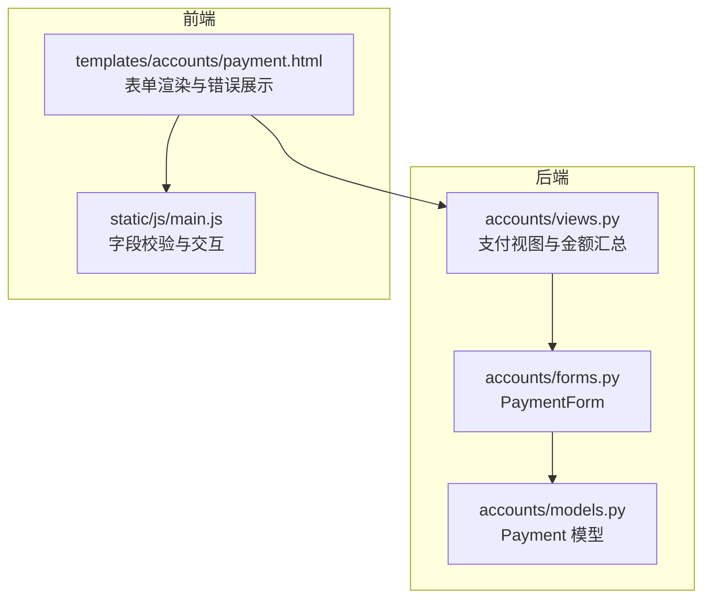
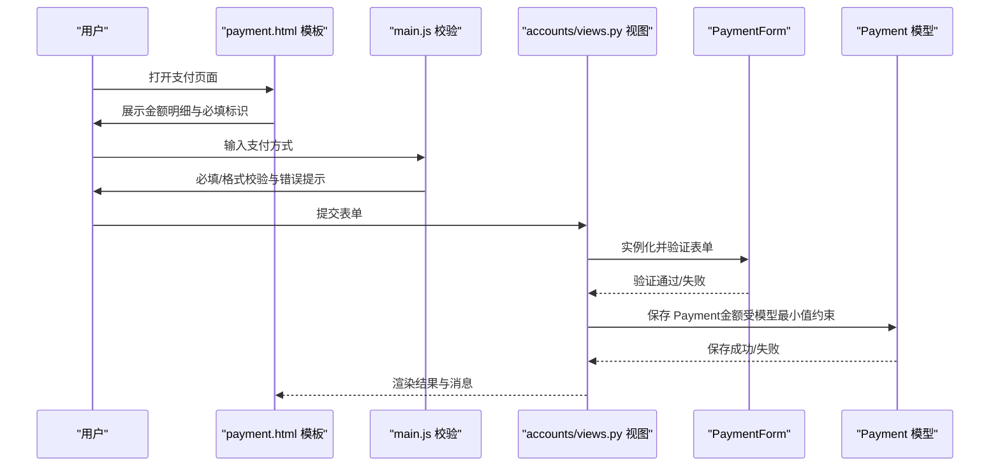
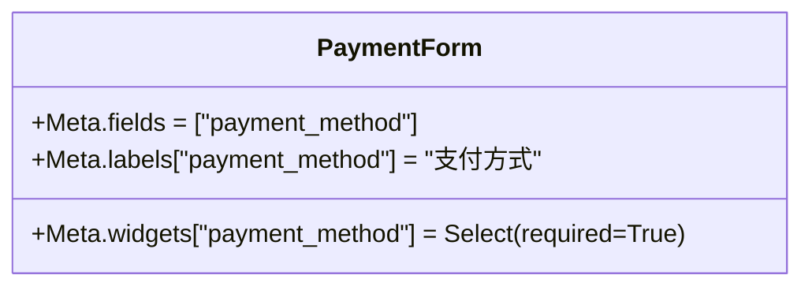
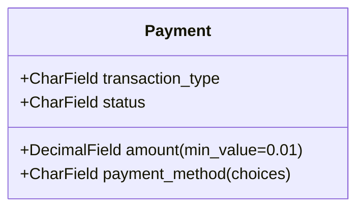
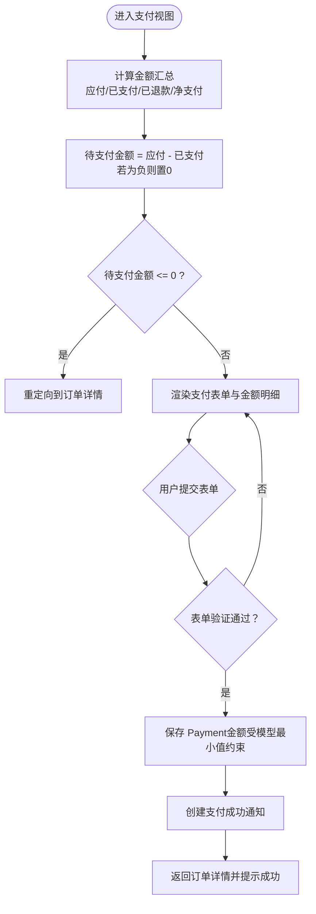
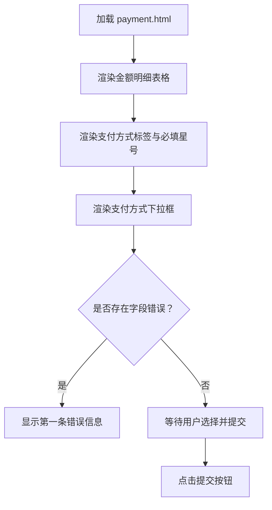
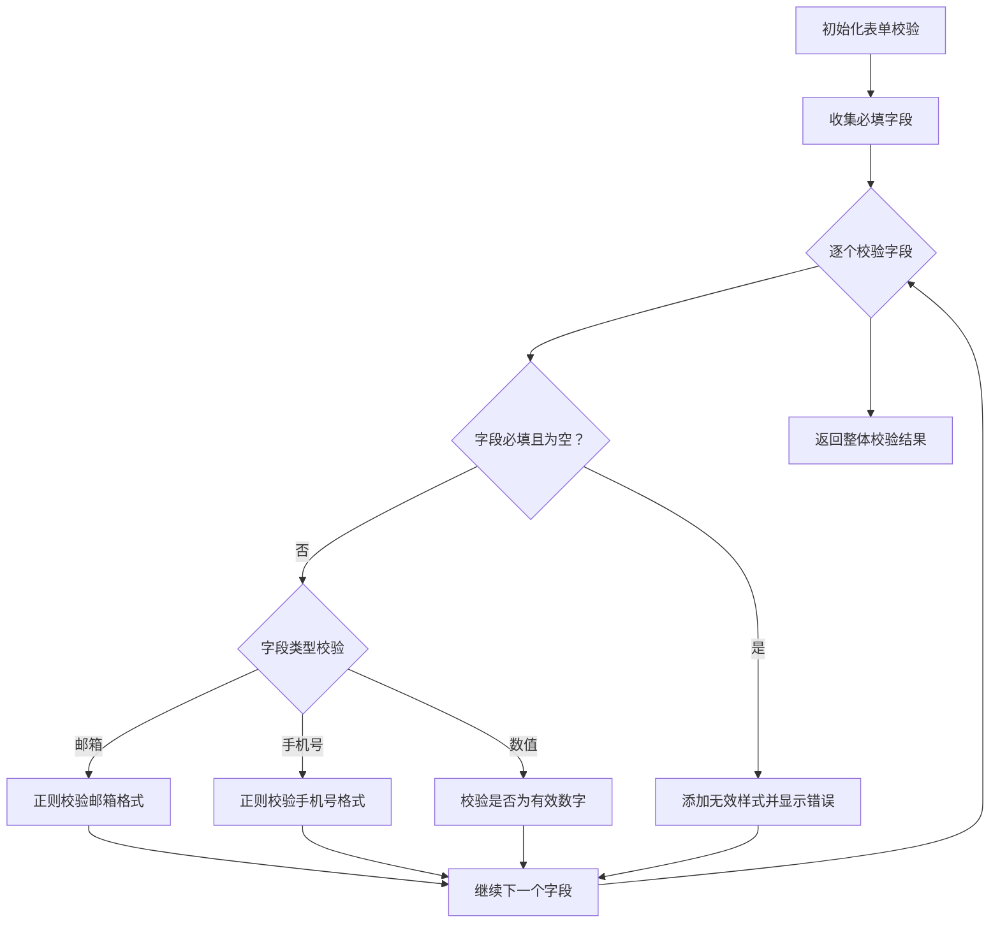
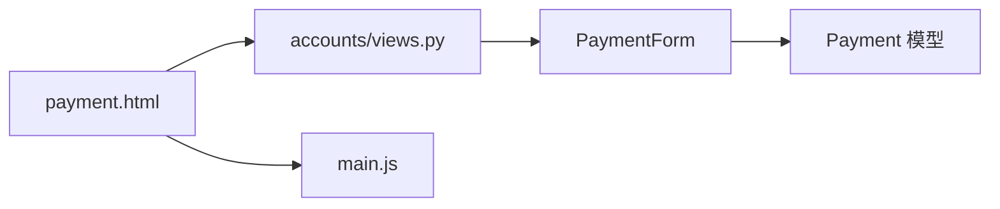

# 支付表单验证机制

<cite>
**本文引用的文件列表**
- [accounts/forms.py](file://code/car_rental_system/accounts/forms.py)
- [accounts/models.py](file://code/car_rental_system/accounts/models.py)
- [accounts/views.py](file://code/car_rental_system/accounts/views.py)
- [templates/accounts/payment.html](file://code/car_rental_system/templates/accounts/payment.html)
- [static/js/main.js](file://code/car_rental_system/static/js/main.js)
</cite>

## 目录
1. [引言](#引言)
2. [项目结构](#项目结构)
3. [核心组件](#核心组件)
4. [架构总览](#架构总览)
5. [详细组件分析](#详细组件分析)
6. [依赖关系分析](#依赖关系分析)
7. [性能考量](#性能考量)
8. [故障排查指南](#故障排查指南)
9. [结论](#结论)

## 引言
本文件聚焦于支付表单的验证规则实现，围绕以下目标展开：
- 金额最小值校验（支付金额必须大于等于0.01元）
- 支付方式必填性验证（下拉选择必填）
- Django表单系统的clean方法与字段级验证器协同工作
- 前端模板中表单渲染、错误信息展示、必填字段标识与动态交互提示
- 前后端协同的验证流程与用户体验优化

## 项目结构
支付相关的核心位置集中在 accounts 应用：
- 表单定义：accounts/forms.py 中的 PaymentForm
- 数据模型：accounts/models.py 中的 Payment 模型，包含金额最小值校验
- 视图处理：accounts/views.py 中的支付页面视图与金额汇总逻辑
- 前端模板：templates/accounts/payment.html 中的表单渲染与错误展示
- 前端脚本：static/js/main.js 中的通用字段校验与交互

图表来源
- [accounts/forms.py](file://code/car_rental_system/accounts/forms.py#L300-L314)
- [accounts/models.py](file://code/car_rental_system/accounts/models.py#L180-L193)
- [accounts/views.py](file://code/car_rental_system/accounts/views.py#L224-L268)
- [templates/accounts/payment.html](file://code/car_rental_system/templates/accounts/payment.html#L106-L146)
- [static/js/main.js](file://code/car_rental_system/static/js/main.js#L249-L335)

章节来源
- [accounts/forms.py](file://code/car_rental_system/accounts/forms.py#L300-L314)
- [accounts/models.py](file://code/car_rental_system/accounts/models.py#L180-L193)
- [accounts/views.py](file://code/car_rental_system/accounts/views.py#L224-L268)
- [templates/accounts/payment.html](file://code/car_rental_system/templates/accounts/payment.html#L106-L146)
- [static/js/main.js](file://code/car_rental_system/static/js/main.js#L249-L335)

## 核心组件
- PaymentForm（表单类）：定义支付方式字段及其必填属性，用于前端渲染与后端验证
- Payment 模型（模型类）：对支付金额设置最小值校验，确保入库数据合法
- 支付视图（视图函数）：负责计算待支付金额、渲染表单、处理提交与消息反馈
- 前端模板（payment.html）：渲染金额明细、必填字段标识、错误信息展示与提交按钮
- 前端脚本（main.js）：提供通用字段校验与交互提示，增强用户体验

章节来源
- [accounts/forms.py](file://code/car_rental_system/accounts/forms.py#L300-L314)
- [accounts/models.py](file://code/car_rental_system/accounts/models.py#L180-L193)
- [accounts/views.py](file://code/car_rental_system/accounts/views.py#L224-L268)
- [templates/accounts/payment.html](file://code/car_rental_system/templates/accounts/payment.html#L79-L146)
- [static/js/main.js](file://code/car_rental_system/static/js/main.js#L249-L335)

## 架构总览
支付表单验证的端到端流程如下：
- 前端渲染：模板展示金额明细与支付方式选择，并标注必填字段
- 前端校验：通用脚本对必填字段进行即时校验与错误提示
- 后端表单：PaymentForm 将支付方式设为必填；若提交非法，返回错误
- 后端模型：Payment 模型对金额进行最小值校验，防止非法金额入库
- 业务逻辑：视图根据订单汇总计算待支付金额，确保金额非负且合理

图表来源
- [templates/accounts/payment.html](file://code/car_rental_system/templates/accounts/payment.html#L106-L146)
- [static/js/main.js](file://code/car_rental_system/static/js/main.js#L249-L335)
- [accounts/views.py](file://code/car_rental_system/accounts/views.py#L1316-L1343)
- [accounts/forms.py](file://code/car_rental_system/accounts/forms.py#L300-L314)
- [accounts/models.py](file://code/car_rental_system/accounts/models.py#L180-L193)

## 详细组件分析

### PaymentForm 表单验证规则
- 字段定义：仅包含支付方式字段，使用下拉选择控件并标注必填
- 必填性：通过控件属性设置必填，前端与后端共同保证必填性
- 字段级验证：未自定义额外 clean 方法，依赖框架默认行为与模型层约束

图表来源
- [accounts/forms.py](file://code/car_rental_system/accounts/forms.py#L300-L314)

章节来源
- [accounts/forms.py](file://code/car_rental_system/accounts/forms.py#L300-L314)

### Payment 模型金额最小值校验
- 字段：amount 字段配置最小值校验器，确保支付金额不得小于0.01元
- 作用：从源头阻止非法金额进入数据库，保障数据一致性

图表来源
- [accounts/models.py](file://code/car_rental_system/accounts/models.py#L180-L193)

章节来源
- [accounts/models.py](file://code/car_rental_system/accounts/models.py#L180-L193)

### 支付视图与金额计算
- 金额汇总：通过汇总函数计算应付总额、已支付、已退款、净支付与待支付金额
- 待支付金额：应付总额减去已支付，若为负则置零，确保不会出现负数
- 提交处理：表单验证通过后，按待支付金额写入 Payment 记录并触发后续流程

图表来源
- [accounts/views.py](file://code/car_rental_system/accounts/views.py#L224-L268)
- [accounts/views.py](file://code/car_rental_system/accounts/views.py#L1316-L1343)

章节来源
- [accounts/views.py](file://code/car_rental_system/accounts/views.py#L224-L268)
- [accounts/views.py](file://code/car_rental_system/accounts/views.py#L1316-L1343)

### 前端模板渲染与错误展示
- 金额明细：模板展示应付总额、已支付、已退款、净支付与待支付金额
- 必填标识：支付方式标签旁显示红色星号，提示必填
- 错误展示：若字段存在错误，模板会渲染第一条错误信息
- 提交按钮：显示当前应支付金额，点击后提交表单

图表来源
- [templates/accounts/payment.html](file://code/car_rental_system/templates/accounts/payment.html#L79-L146)

章节来源
- [templates/accounts/payment.html](file://code/car_rental_system/templates/accounts/payment.html#L79-L146)

### 前端脚本的字段校验与交互
- 通用校验：对必填字段进行即时校验，若为空则显示错误提示
- 类型校验：对邮箱、手机号、数值等类型进行基础校验
- 交互提示：清除已有错误、添加无效样式、插入错误反馈元素
- 适用范围：适用于多种表单场景，提升用户输入体验

图表来源
- [static/js/main.js](file://code/car_rental_system/static/js/main.js#L249-L335)

章节来源
- [static/js/main.js](file://code/car_rental_system/static/js/main.js#L249-L335)

## 依赖关系分析
- 表单依赖模型：PaymentForm 依赖 Payment 模型的字段定义与校验器
- 视图依赖表单与模型：视图负责调用表单验证、计算金额并持久化 Payment
- 模板依赖视图上下文：模板从视图上下文中获取金额明细与表单实例
- 前端脚本独立于后端：通用校验脚本可复用，但最终仍需依赖后端模型约束

图表来源
- [accounts/views.py](file://code/car_rental_system/accounts/views.py#L1316-L1343)
- [accounts/forms.py](file://code/car_rental_system/accounts/forms.py#L300-L314)
- [accounts/models.py](file://code/car_rental_system/accounts/models.py#L180-L193)
- [templates/accounts/payment.html](file://code/car_rental_system/templates/accounts/payment.html#L106-L146)
- [static/js/main.js](file://code/car_rental_system/static/js/main.js#L249-L335)

章节来源
- [accounts/views.py](file://code/car_rental_system/accounts/views.py#L1316-L1343)
- [accounts/forms.py](file://code/car_rental_system/accounts/forms.py#L300-L314)
- [accounts/models.py](file://code/car_rental_system/accounts/models.py#L180-L193)
- [templates/accounts/payment.html](file://code/car_rental_system/templates/accounts/payment.html#L106-L146)
- [static/js/main.js](file://code/car_rental_system/static/js/main.js#L249-L335)

## 性能考量
- 金额计算：采用聚合查询与一次性汇总，避免多次数据库往返
- 模型约束：在数据库层面强制最小值，减少无效数据带来的后续处理成本
- 前端校验：通用脚本在提交前进行基础校验，降低无效请求对后端的压力
- 缓存与索引：建议在相关查询上使用索引与缓存（如订单金额统计），进一步优化性能

## 故障排查指南
- 支付方式未选择
  - 现象：提交后显示支付方式必填错误
  - 排查：检查表单控件是否设置必填；确认模板中是否正确渲染错误信息
  - 参考路径
    - [accounts/forms.py](file://code/car_rental_system/accounts/forms.py#L300-L314)
    - [templates/accounts/payment.html](file://code/car_rental_system/templates/accounts/payment.html#L113-L121)
- 支付金额异常
  - 现象：保存 Payment 时报错或金额被拒绝
  - 排查：确认待支付金额由汇总函数计算且非负；检查模型最小值约束
  - 参考路径
    - [accounts/views.py](file://code/car_rental_system/accounts/views.py#L224-L268)
    - [accounts/models.py](file://code/car_rental_system/accounts/models.py#L180-L193)
- 前端交互问题
  - 现象：必填字段未提示或错误提示不显示
  - 排查：确认通用校验脚本已加载；检查模板中错误渲染逻辑
  - 参考路径
    - [static/js/main.js](file://code/car_rental_system/static/js/main.js#L249-L335)
    - [templates/accounts/payment.html](file://code/car_rental_system/templates/accounts/payment.html#L113-L121)

章节来源
- [accounts/forms.py](file://code/car_rental_system/accounts/forms.py#L300-L314)
- [accounts/models.py](file://code/car_rental_system/accounts/models.py#L180-L193)
- [accounts/views.py](file://code/car_rental_system/accounts/views.py#L224-L268)
- [templates/accounts/payment.html](file://code/car_rental_system/templates/accounts/payment.html#L113-L121)
- [static/js/main.js](file://code/car_rental_system/static/js/main.js#L249-L335)

## 结论
本项目的支付表单验证通过“前端必填标识与错误展示 + 后端表单必填约束 + 模型金额最小值约束”的多层保障实现：
- 支付方式必填性由表单控件与模板共同保证，确保用户明确必填项
- 金额最小值由模型层严格控制，杜绝非法金额入库
- 视图层负责金额汇总与提交处理，确保待支付金额始终非负
- 前端脚本提供通用字段校验与交互提示，改善用户体验

该方案在保证数据合法性的同时，兼顾了用户操作的直观性与便捷性，形成了可靠的前后端协同验证体系。