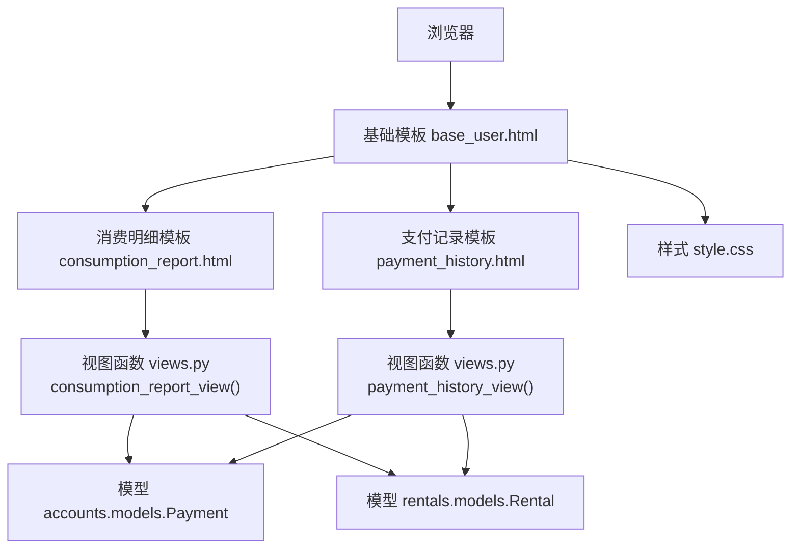
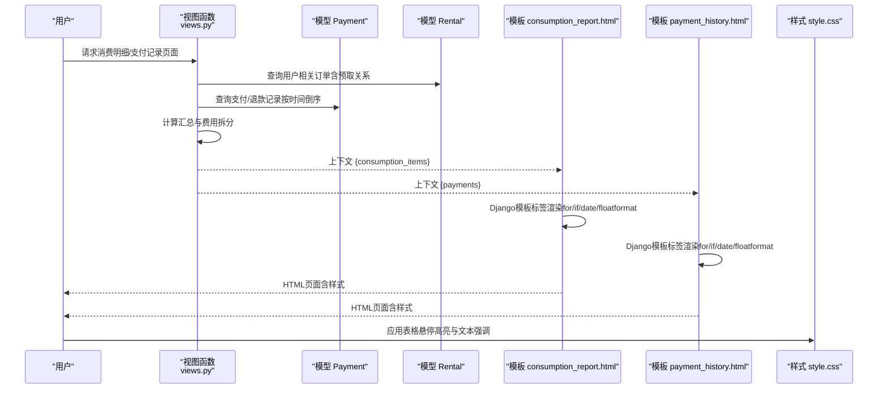
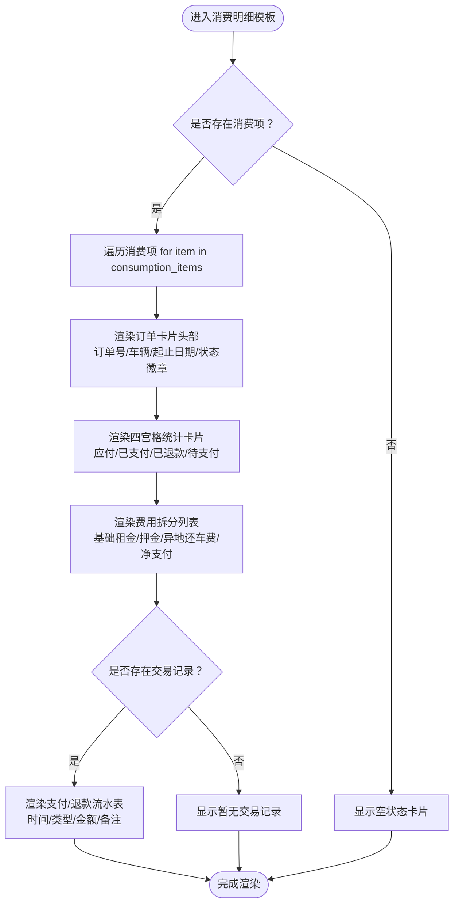
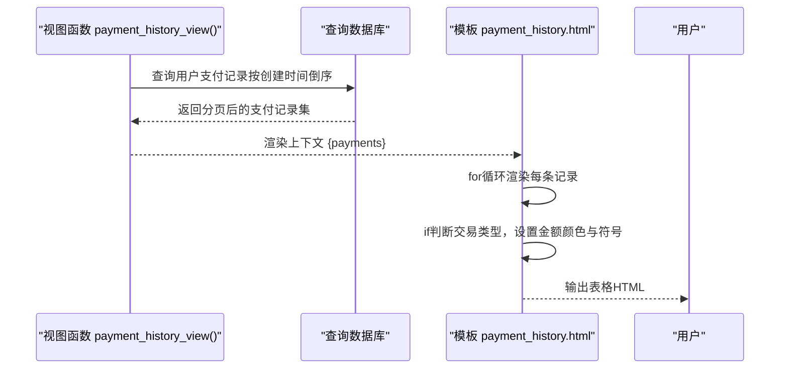
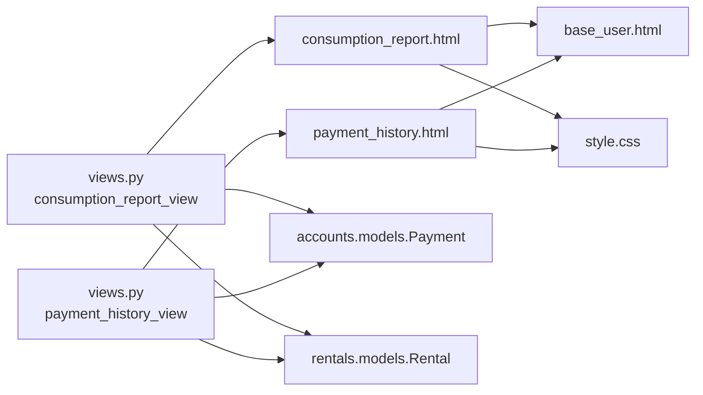

# 前端展示设计与模板实现

<cite>
**本文引用的文件列表**
- [consumption_report.html](file://code/car_rental_system/templates/accounts/consumption_report.html)
- [payment_history.html](file://code/car_rental_system/templates/accounts/payment_history.html)
- [base_user.html](file://code/car_rental_system/templates/base_user.html)
- [style.css](file://code/car_rental_system/static/css/style.css)
- [views.py](file://code/car_rental_system/accounts/views.py)
- [models.py](file://code/car_rental_system/accounts/models.py)
- [rentals/models.py](file://code/car_rental_system/rentals/models.py)
</cite>

## 目录
1. [引言](#引言)
2. [项目结构](#项目结构)
3. [核心组件](#核心组件)
4. [架构总览](#架构总览)
5. [详细组件分析](#详细组件分析)
6. [依赖分析](#依赖分析)
7. [性能考量](#性能考量)
8. [故障排查指南](#故障排查指南)
9. [结论](#结论)

## 引言
本文件聚焦于两个用户侧消费与支付展示模板：consumption_report.html（消费明细）与payment_history.html（支付记录）。我们将从页面结构、数据组织、Django模板标签用法、表格呈现策略、响应式布局适配以及UI高亮与可读性控制等方面进行系统性解析，帮助读者快速理解模板如何将“时间维度排序、消费类型分组、金额汇总”等信息以清晰直观的方式呈现给用户。

## 项目结构
这两个模板均继承自用户侧基础模板base_user.html，并通过Bootstrap 5与自定义样式style.css提供一致的视觉与交互体验。模板内部大量使用Django模板语言进行数据渲染与条件判断，配合过滤器对时间与金额进行格式化输出。

图表来源
- [base_user.html](file://code/car_rental_system/templates/base_user.html#L1-L235)
- [consumption_report.html](file://code/car_rental_system/templates/accounts/consumption_report.html#L1-L154)
- [payment_history.html](file://code/car_rental_system/templates/accounts/payment_history.html#L1-L56)
- [views.py](file://code/car_rental_system/accounts/views.py#L1352-L1423)
- [models.py](file://code/car_rental_system/accounts/models.py#L147-L200)
- [rentals/models.py](file://code/car_rental_system/rentals/models.py#L270-L303)
- [style.css](file://code/car_rental_system/static/css/style.css#L604-L624)

章节来源
- [base_user.html](file://code/car_rental_system/templates/base_user.html#L1-L235)
- [consumption_report.html](file://code/car_rental_system/templates/accounts/consumption_report.html#L1-L154)
- [payment_history.html](file://code/car_rental_system/templates/accounts/payment_history.html#L1-L56)
- [views.py](file://code/car_rental_system/accounts/views.py#L1352-L1423)
- [models.py](file://code/car_rental_system/accounts/models.py#L147-L200)
- [rentals/models.py](file://code/car_rental_system/rentals/models.py#L270-L303)
- [style.css](file://code/car_rental_system/static/css/style.css#L604-L624)

## 核心组件
- 消费明细模板（consumption_report.html）
  - 以“订单卡片”为单位展示每笔消费的摘要与流水，包含应付总额、已支付、已退款、待支付等统计卡片，以及费用拆分与支付/退款流水表。
  - 使用for循环遍历consumption_items，每个item包含rental、summary与transactions三部分数据。
  - 使用if条件判断控制退款状态徽章显示与跨地点费用的条件展示。
  - 使用date与floatformat过滤器格式化时间与金额，增强可读性。
- 支付记录模板（payment_history.html）
  - 以表格形式展示所有手动发起的支付/退款记录，列包括时间、订单号、车辆、类型、金额、状态。
  - 使用for循环渲染每条记录；通过if判断交易类型决定金额颜色与正负号，提升视觉区分度。
  - 使用date与floatformat过滤器格式化时间与金额。
- 基础模板（base_user.html）
  - 提供全局布局、导航、消息提示区、关键样式与脚本加载。
  - 通过profile-fullscreen类实现内容区域全屏铺展，便于在移动端与桌面端保持一致的阅读体验。
- 样式（style.css）
  - 定义表格hover高亮、文本强调色（success/warning/secondary）、卡片阴影与圆角等通用UI规范。
  - 提供响应式断点与网格布局辅助类，保证在小屏设备上仍具有良好可读性。

章节来源
- [consumption_report.html](file://code/car_rental_system/templates/accounts/consumption_report.html#L1-L154)
- [payment_history.html](file://code/car_rental_system/templates/accounts/payment_history.html#L1-L56)
- [base_user.html](file://code/car_rental_system/templates/base_user.html#L1-L235)
- [style.css](file://code/car_rental_system/static/css/style.css#L604-L624)

## 架构总览
下图展示了从视图到模板的数据流与渲染路径，以及模板如何利用Django模板标签与过滤器完成最终展示。

图表来源
- [views.py](file://code/car_rental_system/accounts/views.py#L1352-L1423)
- [models.py](file://code/car_rental_system/accounts/models.py#L147-L200)
- [rentals/models.py](file://code/car_rental_system/rentals/models.py#L270-L303)
- [consumption_report.html](file://code/car_rental_system/templates/accounts/consumption_report.html#L1-L154)
- [payment_history.html](file://code/car_rental_system/templates/accounts/payment_history.html#L1-L56)
- [style.css](file://code/car_rental_system/static/css/style.css#L604-L624)

## 详细组件分析

### 消费明细模板（consumption_report.html）
- 页面结构与布局
  - 继承基础模板，使用profile-fullscreen作为内容容器，确保在不同屏幕宽度下保持一致的内边距与最大宽度。
  - 顶部标题与描述提供上下文，右侧提供“我的订单”跳转按钮，便于用户快速切换。
- 卡片式组织与统计
  - 每个订单以卡片形式展示，卡片头部包含订单编号、车辆品牌与型号、起止日期与天数、订单状态与结算状态徽章，以及当存在退款时显示“已退还”徽章。
  - 卡片主体分为两列：
    - 左侧四宫格统计卡片：应付总额、已支付、已退款、待支付，使用不同强调色突出金额含义。
    - 右侧费用拆分与支付/退款流水：
      - 费用拆分列表包含基础租金、押金、异地还车费（条件展示）与净支付（已支付-已退款），并可选显示退款总额。
      - 支付/退款流水表包含时间、类型、金额、备注四列，按时间倒序排列，金额使用正负颜色区分。
- 模板标签与过滤器用法
  - 循环渲染：for item in consumption_items；for payment in item.transactions。
  - 条件判断：if item.rental.status in 'COMPLETED CANCELLED' and item.summary.refunded_amount > 0 控制退款徽章显示；if item.summary.cross_location_fee > 0 控制异地还车费行显示；if item.transactions 控制“暂无交易记录”的降级文案。
  - 过滤器：date用于格式化时间；floatformat用于金额保留两位小数；get_*_display用于显示choices字段的中文描述。
- 响应式与可读性
  - 使用Bootstrap网格类（col-md-*）在中等及以上屏幕下实现多列布局；在小屏设备上自动换行，保证内容可读。
  - 表格采用table-responsive包裹，避免横向滚动时的布局破坏。
  - 表格hover效果由style.css提供，鼠标悬停时背景高亮，便于在长列表中定位行。

图表来源
- [consumption_report.html](file://code/car_rental_system/templates/accounts/consumption_report.html#L1-L154)
- [style.css](file://code/car_rental_system/static/css/style.css#L604-L624)

章节来源
- [consumption_report.html](file://code/car_rental_system/templates/accounts/consumption_report.html#L1-L154)
- [style.css](file://code/car_rental_system/static/css/style.css#L604-L624)

### 支付记录模板（payment_history.html）
- 表格呈现策略
  - 采用table-hover类启用行悬停高亮，提升在长列表中的浏览体验。
  - 列头包含时间、订单号、车辆、类型、金额、状态，覆盖用户关注的关键信息。
  - 金额列通过if判断交易类型（REFUND/CHARGE）分别使用强调色与负号，直观表达正负金额。
- 模板标签与过滤器用法
  - 循环渲染：for payment in payments。
  - 条件判断：if payment.transaction_type == 'REFUND' 控制金额颜色与符号。
  - 过滤器：date格式化时间；floatformat保留两位小数；get_*_display显示中文状态与类型。
- 响应式与可读性
  - 表格外层table-responsive确保在窄屏设备上可横向滚动，避免列重叠。
  - 在style.css中，表格hover会改变背景色，提高行间对比度。

图表来源
- [views.py](file://code/car_rental_system/accounts/views.py#L1366-L1387)
- [payment_history.html](file://code/car_rental_system/templates/accounts/payment_history.html#L1-L56)
- [style.css](file://code/car_rental_system/static/css/style.css#L604-L624)

章节来源
- [payment_history.html](file://code/car_rental_system/templates/accounts/payment_history.html#L1-L56)
- [views.py](file://code/car_rental_system/accounts/views.py#L1366-L1387)
- [style.css](file://code/car_rental_system/static/css/style.css#L604-L624)

### 视图与数据来源
- 消费明细视图（consumption_report_view）
  - 通过Rental.objects.filter(customer=customer).select_related(...).prefetch_related(...).order_by('-start_date')按起始日期倒序获取订单。
  - 对每个订单调用refresh_financials确保财务数据最新，再计算支付汇总与费用拆分，形成consumption_items列表。
  - 将consumption_items传递给模板渲染。
- 支付记录视图（payment_history_view）
  - 通过Payment.objects.filter(user=request.user).select_related('rental','rental__vehicle').order_by('-created_at')获取支付记录。
  - 支持按状态筛选与分页，将分页对象传递给模板。

章节来源
- [views.py](file://code/car_rental_system/accounts/views.py#L1390-L1423)
- [views.py](file://code/car_rental_system/accounts/views.py#L1366-L1387)

### 模型与数据结构
- Payment模型
  - 包含交易类型（CHARGE/REFUND）、状态（PENDING/PAID/FAILED/REFUNDED）、支付方式等字段，支持通过get_*_display获取中文描述。
- Rental模型
  - 提供calculate_order_total与refresh_financials等方法，支撑费用拆分与余额计算。
  - 提供rental_days属性与is_cross_location_return等字段，影响费用拆分与表格展示。

章节来源
- [models.py](file://code/car_rental_system/accounts/models.py#L147-L200)
- [rentals/models.py](file://code/car_rental_system/rentals/models.py#L270-L303)

## 依赖分析
- 模板依赖
  - consumption_report.html与payment_history.html均依赖base_user.html提供的布局与导航。
  - 两者都依赖Bootstrap 5类名与自定义样式style.css中的表格hover、文本强调色等。
- 视图依赖
  - 两个视图依赖accounts.models.Payment与rentals.models.Rental，通过ORM查询与聚合计算生成上下文数据。
- 过滤器与标签
  - 模板广泛使用Django内置过滤器（date、floatformat）与choices显示（get_*_display），减少模板中的业务逻辑复杂度。
- 响应式策略
  - 使用Bootstrap网格类与table-responsive，结合style.css中的媒体查询与断点，确保在移动设备上仍具备良好可读性。

图表来源
- [consumption_report.html](file://code/car_rental_system/templates/accounts/consumption_report.html#L1-L154)
- [payment_history.html](file://code/car_rental_system/templates/accounts/payment_history.html#L1-L56)
- [base_user.html](file://code/car_rental_system/templates/base_user.html#L1-L235)
- [style.css](file://code/car_rental_system/static/css/style.css#L604-L624)
- [views.py](file://code/car_rental_system/accounts/views.py#L1352-L1423)
- [models.py](file://code/car_rental_system/accounts/models.py#L147-L200)
- [rentals/models.py](file://code/car_rental_system/rentals/models.py#L270-L303)

章节来源
- [consumption_report.html](file://code/car_rental_system/templates/accounts/consumption_report.html#L1-L154)
- [payment_history.html](file://code/car_rental_system/templates/accounts/payment_history.html#L1-L56)
- [base_user.html](file://code/car_rental_system/templates/base_user.html#L1-L235)
- [style.css](file://code/car_rental_system/static/css/style.css#L604-L624)
- [views.py](file://code/car_rental_system/accounts/views.py#L1352-L1423)
- [models.py](file://code/car_rental_system/accounts/models.py#L147-L200)
- [rentals/models.py](file://code/car_rental_system/rentals/models.py#L270-L303)

## 性能考量
- 数据查询优化
  - 在消费明细视图中使用select_related与prefetch_related减少N+1查询，提升渲染效率。
  - 在支付记录视图中使用order_by('-created_at')与Paginator分页，避免一次性加载过多记录。
- 模板渲染优化
  - 使用get_*_display减少模板中对choices字典的访问次数。
  - 通过floatformat与date过滤器在模板层完成格式化，避免在视图中重复构造字符串。
- 样式与交互
  - 表格hover高亮由CSS实现，避免JavaScript开销；在移动端可通过更少的DOM层级提升滚动流畅度。

[本节为通用指导，无需列出具体文件来源]

## 故障排查指南
- 无消费记录或支付记录
  - 检查视图是否正确过滤当前用户数据；确认数据库中是否存在相关记录。
  - 消费明细模板会在无数据时显示空状态卡片；支付记录模板会显示“暂无支付记录”提示。
- 金额显示异常
  - 确认floatformat过滤器是否正确应用；检查decimal字段精度与聚合结果。
- 时间显示异常
  - 确认date过滤器格式是否符合预期；检查数据库中的时间字段与时区设置。
- 表格在小屏设备上显示拥挤
  - 确认table-responsive是否包裹表格；检查Bootstrap网格类是否正确使用；必要时调整列宽或合并列。

章节来源
- [consumption_report.html](file://code/car_rental_system/templates/accounts/consumption_report.html#L1-L154)
- [payment_history.html](file://code/car_rental_system/templates/accounts/payment_history.html#L1-L56)
- [views.py](file://code/car_rental_system/accounts/views.py#L1352-L1423)

## 结论
consumption_report.html与payment_history.html通过卡片与表格两种主要布局，结合Django模板标签与过滤器，实现了“时间维度排序、消费类型分组、金额汇总显示”的清晰展示。模板在响应式布局与UI高亮方面遵循统一的样式规范，确保在不同设备上均具备良好的可读性与用户体验。通过视图层的数据预取与聚合计算，模板层专注于展示逻辑，整体架构简洁高效。