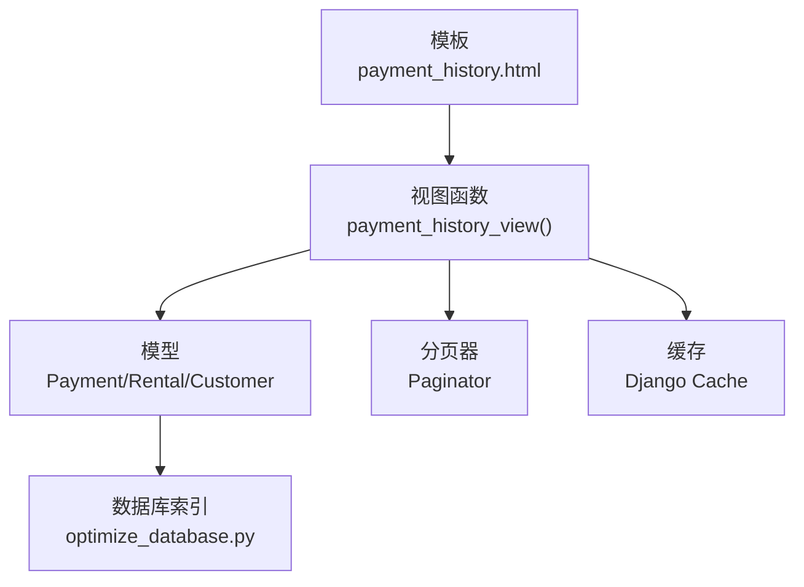
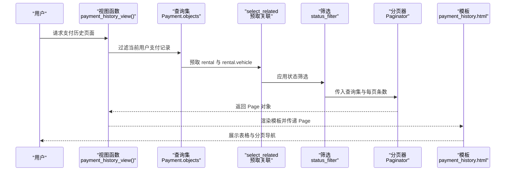
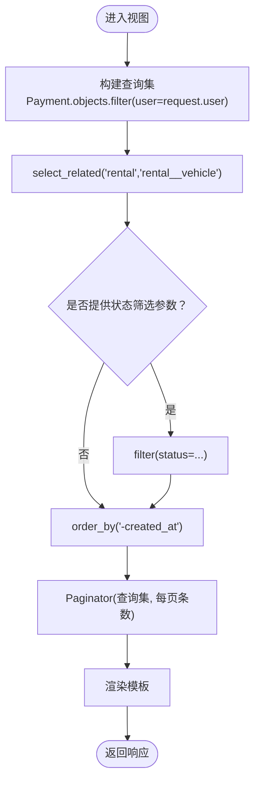
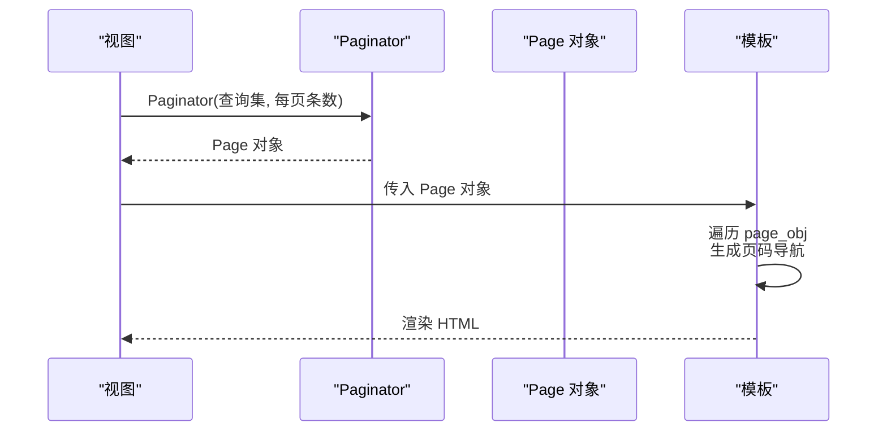
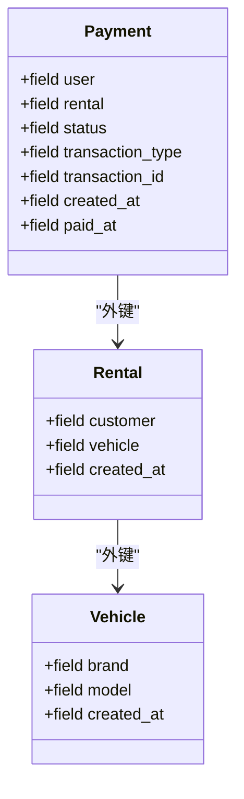
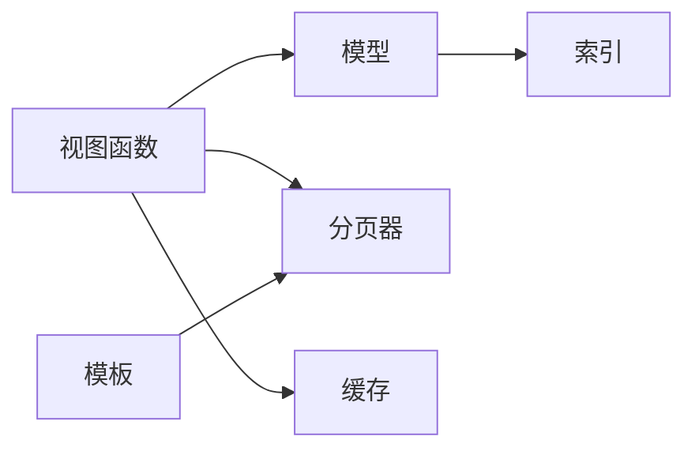

# 查询性能优化与分页实现

<cite>
**本文引用的文件**
- [payment_history.html](file://code/car_rental_system/templates/accounts/payment_history.html)
- [views.py](file://code/car_rental_system/accounts/views.py)
- [models.py](file://code/car_rental_system/accounts/models.py)
- [settings.py](file://code/car_rental_system/car_rental_system/settings.py)
- [optimize_database.py](file://code/car_rental_system/optimize_database.py)
- [rental_list.html](file://code/car_rental_system/templates/rentals/rental_list.html)
- [customer_list.html](file://code/car_rental_system/templates/customers/customer_list.html)
- [home.html](file://code/car_rental_system/templates/accounts/home.html)
- [vehicle_list.html](file://code/car_rental_system/templates/vehicles/vehicle_list.html)
</cite>

## 目录
1. [简介](#简介)
2. [项目结构](#项目结构)
3. [核心组件](#核心组件)
4. [架构总览](#架构总览)
5. [详细组件分析](#详细组件分析)
6. [依赖关系分析](#依赖关系分析)
7. [性能考量](#性能考量)
8. [故障排查指南](#故障排查指南)
9. [结论](#结论)

## 简介
本文围绕 payment_history.html 页面所依赖的视图函数，系统梳理支付/退款流水查询的性能优化策略，重点说明如何通过 select_related 和 prefetch_related 减少数据库查询次数、避免 N+1 问题；同时解析分页机制的实现方式（Paginator 类、每页记录数配置、页码导航生成逻辑），并结合索引使用、查询集惰性求值、以及可扩展的缓存建议，给出在大数据量场景下保障查询效率与高频访问响应速度的综合方案。

## 项目结构
- 视图层：accounts/views.py 提供支付历史视图与消费明细视图等，其中 payment_history_view 负责渲染 payment_history.html。
- 模型层：accounts/models.py 定义 Payment、Rental、Customer 等模型及其索引，支撑查询性能。
- 模板层：templates/accounts/payment_history.html 展示支付/退款流水列表。
- 配置与工具：settings.py 提供缓存配置；optimize_database.py 提供数据库索引创建脚本；多处模板展示分页导航生成逻辑。

图表来源
- [payment_history.html](file://code/car_rental_system/templates/accounts/payment_history.html#L1-L56)
- [views.py](file://code/car_rental_system/accounts/views.py#L1365-L1387)
- [models.py](file://code/car_rental_system/accounts/models.py#L147-L250)
- [settings.py](file://code/car_rental_system/car_rental_system/settings.py#L141-L151)
- [optimize_database.py](file://code/car_rental_system/optimize_database.py#L1-L55)

章节来源
- [payment_history.html](file://code/car_rental_system/templates/accounts/payment_history.html#L1-L56)
- [views.py](file://code/car_rental_system/accounts/views.py#L1365-L1387)
- [models.py](file://code/car_rental_system/accounts/models.py#L147-L250)
- [settings.py](file://code/car_rental_system/car_rental_system/settings.py#L141-L151)
- [optimize_database.py](file://code/car_rental_system/optimize_database.py#L1-L55)

## 核心组件
- 支付历史视图：负责按用户过滤支付记录，使用 select_related 预取关联对象，支持状态筛选与分页。
- 模型索引：Payment 模型定义了多字段索引，覆盖 user/status、rental、transaction_id、transaction_type 等，有利于高效筛选与排序。
- 分页器：Paginator 在视图中按固定每页条数进行分页，模板侧生成页码导航。
- 缓存：settings.py 中配置了内存缓存，可用于热点数据的短期缓存，降低数据库压力。

章节来源
- [views.py](file://code/car_rental_system/accounts/views.py#L1365-L1387)
- [models.py](file://code/car_rental_system/accounts/models.py#L237-L248)
- [settings.py](file://code/car_rental_system/car_rental_system/settings.py#L141-L151)

## 架构总览
支付历史页面的数据流自上而下如下：

图表来源
- [views.py](file://code/car_rental_system/accounts/views.py#L1365-L1387)
- [payment_history.html](file://code/car_rental_system/templates/accounts/payment_history.html#L1-L56)

## 详细组件分析

### 支付历史视图与 N+1 优化
- 关键点
  - 使用 select_related 预取 rental 与 rental.vehicle，避免在模板循环中触发额外数据库查询。
  - 支持按状态筛选，筛选条件通过 GET 参数传入并在查询阶段应用。
  - 使用 order_by('-created_at') 保证按时间倒序展示。
- 性能影响
  - 预取显著减少数据库往返次数，避免在模板中对每个 payment.rental.vehicle 进行二次查询，从而避免 N+1 问题。
  - 状态筛选在数据库层面完成，减少 Python 端过滤成本。

图表来源
- [views.py](file://code/car_rental_system/accounts/views.py#L1365-L1387)

章节来源
- [views.py](file://code/car_rental_system/accounts/views.py#L1365-L1387)

### 分页机制实现
- Paginator 使用
  - 视图中将查询集与每页条数传入 Paginator，然后通过 get_page(page) 获取 Page 对象。
  - 每页条数在不同页面可能不同，例如支付历史为 15，通知为 20，首页车辆列表为 12。
- 页码导航生成
  - 模板侧通过 page_obj.paginator.page_range 生成页码列表，结合 has_previous/has_next 控制前后页按钮。
  - 导航链接保留原有筛选参数，确保翻页时筛选条件不丢失。
- 模板示例
  - 支付历史模板：使用 payments 作为 Page 对象，遍历展示。
  - 其他页面模板：如 rental_list.html、customer_list.html、home.html、vehicle_list.html，均采用类似的分页导航生成逻辑。

图表来源
- [views.py](file://code/car_rental_system/accounts/views.py#L1365-L1387)
- [rental_list.html](file://code/car_rental_system/templates/rentals/rental_list.html#L201-L247)
- [customer_list.html](file://code/car_rental_system/templates/customers/customer_list.html#L145-L191)
- [home.html](file://code/car_rental_system/templates/accounts/home.html#L230-L248)
- [vehicle_list.html](file://code/car_rental_system/templates/vehicles/vehicle_list.html#L201-L233)

章节来源
- [views.py](file://code/car_rental_system/accounts/views.py#L1365-L1387)
- [rental_list.html](file://code/car_rental_system/templates/rentals/rental_list.html#L201-L247)
- [customer_list.html](file://code/car_rental_system/templates/customers/customer_list.html#L145-L191)
- [home.html](file://code/car_rental_system/templates/accounts/home.html#L230-L248)
- [vehicle_list.html](file://code/car_rental_system/templates/vehicles/vehicle_list.html#L201-L233)

### 查询集惰性求值与索引使用
- 惰性求值
  - 查询集在构建阶段不会立即执行 SQL，直到迭代、切片、调用 count()/exists() 或渲染模板时才执行，这有助于在应用层做条件组合与筛选后再一次性查询。
- 索引使用
  - Payment 模型定义了 user/status、rental、transaction_id、transaction_type 等索引，有利于按用户、状态、交易类型等维度快速筛选。
  - optimize_database.py 提供了车辆、客户、租赁表的索引创建脚本，便于在生产环境补充缺失索引。

图表来源
- [models.py](file://code/car_rental_system/accounts/models.py#L147-L250)

章节来源
- [models.py](file://code/car_rental_system/accounts/models.py#L237-L248)
- [optimize_database.py](file://code/car_rental_system/optimize_database.py#L1-L55)

### 模板渲染与数据访问
- 模板中对 payment.rental.vehicle 的访问通过预取避免了额外查询，渲染效率高。
- 模板侧通过循环遍历 Page 对象，无需在视图中提前加载全部数据，符合 Django 的惰性求值特性。

章节来源
- [payment_history.html](file://code/car_rental_system/templates/accounts/payment_history.html#L1-L56)
- [views.py](file://code/car_rental_system/accounts/views.py#L1365-L1387)

## 依赖关系分析
- 视图依赖模型索引与外键关系，确保查询高效。
- 模板依赖 Page 对象的属性（如 paginator、number、has_previous、has_next 等）生成导航。
- 缓存配置为系统提供短期缓存能力，可在热点数据场景中进一步降低数据库压力。

图表来源
- [views.py](file://code/car_rental_system/accounts/views.py#L1365-L1387)
- [models.py](file://code/car_rental_system/accounts/models.py#L237-L248)
- [settings.py](file://code/car_rental_system/car_rental_system/settings.py#L141-L151)

章节来源
- [views.py](file://code/car_rental_system/accounts/views.py#L1365-L1387)
- [models.py](file://code/car_rental_system/accounts/models.py#L237-L248)
- [settings.py](file://code/car_rental_system/car_rental_system/settings.py#L141-L151)

## 性能考量
- 避免 N+1 查询
  - 已通过 select_related('rental','rental__vehicle') 预取关联对象，模板中对 rental.vehicle 的访问不再触发额外查询。
  - 若未来需要展示更多关联信息，可评估使用 prefetch_related 与 Prefetch 对多对多或反向外键进行批量预取。
- 分页策略
  - 每页条数在不同页面设置为 15（支付历史）、20（通知）、12（首页车辆列表）等，平衡加载速度与交互体验。
  - 模板侧生成页码导航时保留筛选参数，避免重复筛选带来的额外开销。
- 索引优化
  - Payment 表已有 user/status、rental、transaction_id、transaction_type 等索引，建议结合业务查询模式补充复合索引（如 user+status+created_at）以进一步提升排序与筛选性能。
  - 可参考 optimize_database.py 脚本为车辆、客户、租赁表补充常用查询字段索引。
- 查询集惰性求值
  - 在视图中尽早应用筛选条件，避免在模板中进行二次过滤；利用 count()/exists() 等方法在惰性求值基础上减少不必要的数据传输。
- 缓存建议
  - 当前 settings.py 配置了内存缓存，适合短期热点数据；对于高频访问的列表页或统计类数据，可考虑引入更持久化的缓存（如 Redis）并设置合理的过期策略。
  - 对于支付历史这类用户私有且变化频繁的数据，缓存价值有限；但对于筛选后的结果集或统计摘要，可考虑缓存以降低数据库压力。

章节来源
- [views.py](file://code/car_rental_system/accounts/views.py#L1365-L1387)
- [models.py](file://code/car_rental_system/accounts/models.py#L237-L248)
- [settings.py](file://code/car_rental_system/car_rental_system/settings.py#L141-L151)
- [optimize_database.py](file://code/car_rental_system/optimize_database.py#L1-L55)

## 故障排查指南
- 页面空白或数据不显示
  - 检查视图中是否正确传入 Page 对象；确认模板中使用的变量名与上下文一致。
- 分页链接失效或筛选参数丢失
  - 检查模板中页码导航是否正确拼接筛选参数；确保 page_obj.paginator.page_range 与 has_previous/has_next 的判断逻辑正确。
- 查询缓慢
  - 确认 Payment 表相关索引是否存在；检查是否遗漏 select_related/prefetch_related；评估是否需要为常用查询字段增加复合索引。
- 缓存未生效
  - 检查 settings.py 中缓存配置是否启用；确认缓存键命名是否合理，避免缓存穿透或雪崩。

章节来源
- [views.py](file://code/car_rental_system/accounts/views.py#L1365-L1387)
- [payment_history.html](file://code/car_rental_system/templates/accounts/payment_history.html#L1-L56)
- [settings.py](file://code/car_rental_system/car_rental_system/settings.py#L141-L151)

## 结论
payment_history.html 所依赖的视图通过 select_related 预取关联对象、在数据库层面应用筛选与排序、配合 Paginator 实现高效分页，有效避免了 N+1 问题并提升了用户体验。结合模型索引与查询集惰性求值，系统在中等规模数据下具备良好的性能表现。针对更大规模数据与更高并发场景，建议进一步完善索引策略、评估复合索引与缓存方案，并持续监控查询计划与慢查询日志以指导优化。