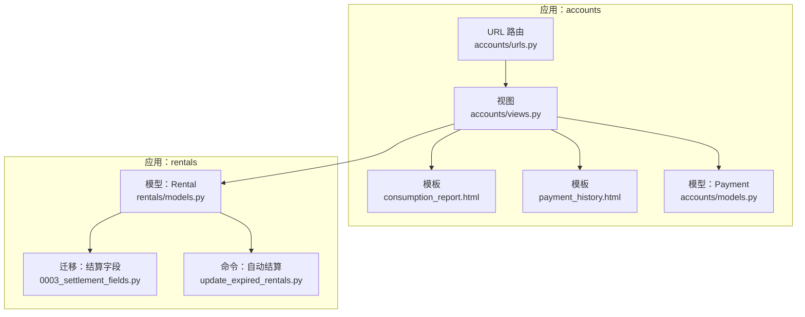
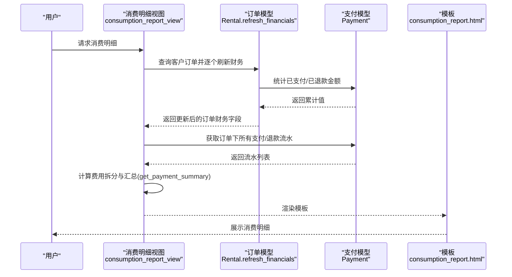
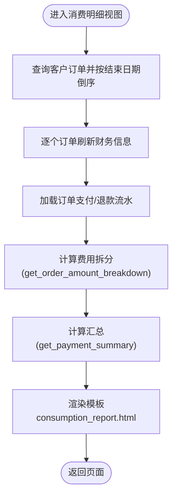
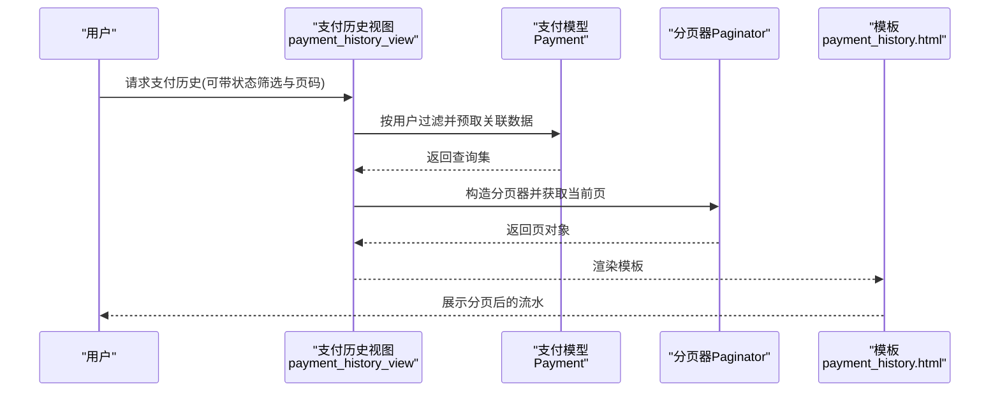
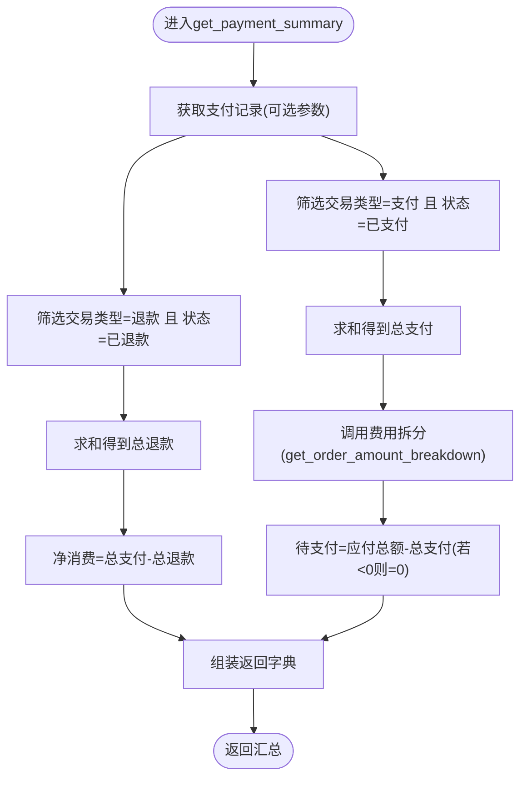
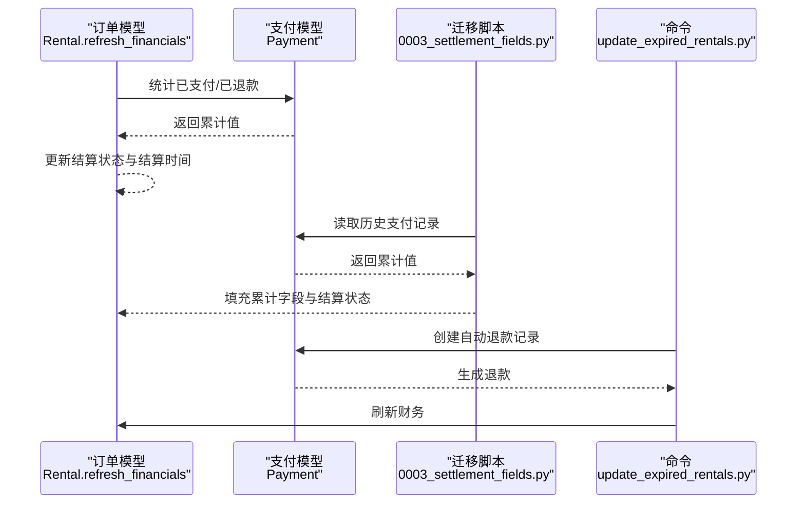
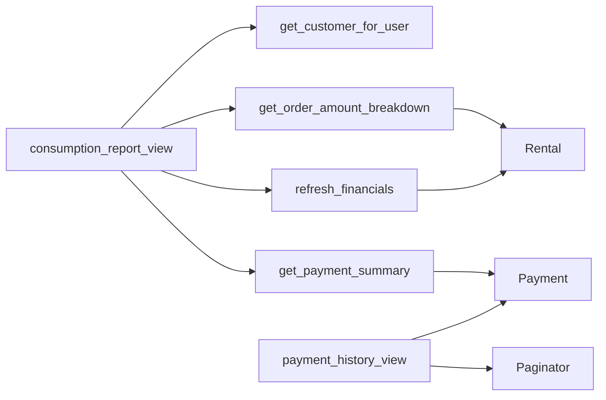

# 消费明细报表

<cite>
**本文引用的文件列表**
- [consumption_report.html](file://code/car_rental_system/templates/accounts/consumption_report.html)
- [payment_history.html](file://code/car_rental_system/templates/accounts/payment_history.html)
- [views.py](file://code/car_rental_system/accounts/views.py)
- [models.py](file://code/car_rental_system/accounts/models.py)
- [urls.py](file://code/car_rental_system/accounts/urls.py)
- [rentals/models.py](file://code/car_rental_system/rentals/models.py)
- [0003_settlement_fields.py](file://code/car_rental_system/rentals/migrations/0003_settlement_fields.py)
- [update_expired_rentals.py](file://code/car_rental_system/rentals/management/commands/update_expired_rentals.py)
</cite>

## 目录
1. [简介](#简介)
2. [项目结构](#项目结构)
3. [核心组件](#核心组件)
4. [架构总览](#架构总览)
5. [组件详解](#组件详解)
6. [依赖关系分析](#依赖关系分析)
7. [性能考量](#性能考量)
8. [故障排查指南](#故障排查指南)
9. [结论](#结论)

## 简介
本文件围绕“消费明细报表”的生成逻辑展开，系统性说明如下内容：
- 如何聚合用户的支付记录、退款记录与订单数据，形成完整的消费明细。
- 模板 consumption_report.html 的数据展示设计原则：按时间排序、分类统计与金额汇总。
- payment_history.html 中支付/退款流水的查询逻辑与分页实现。
- 通过 get_payment_summary 函数计算用户的总支付金额、总退款金额与净消费金额，确保数据的准确性与时效性。

## 项目结构
消费明细报表涉及的关键模块与文件：
- 视图层：accounts/views.py 提供消费明细视图与支付历史视图。
- 模型层：accounts/models.py 定义支付记录模型；rentals/models.py 定义订单模型及其财务刷新逻辑。
- 模板层：accounts/consumption_report.html 与 accounts/payment_history.html 负责前端展示。
- URL 路由：accounts/urls.py 将请求映射到对应视图。
- 迁移与命令：rentals/migrations/0003_settlement_fields.py 与 rentals/management/commands/update_expired_rentals.py 辅助维护订单财务字段与自动结算。

图表来源
- [views.py](file://code/car_rental_system/accounts/views.py#L1390-L1423)
- [consumption_report.html](file://code/car_rental_system/templates/accounts/consumption_report.html#L1-L154)
- [payment_history.html](file://code/car_rental_system/templates/accounts/payment_history.html#L1-L56)
- [urls.py](file://code/car_rental_system/accounts/urls.py#L1-L50)
- [models.py](file://code/car_rental_system/accounts/models.py#L147-L251)
- [rentals/models.py](file://code/car_rental_system/rentals/models.py#L12-L169)
- [0003_settlement_fields.py](file://code/car_rental_system/rentals/migrations/0003_settlement_fields.py#L1-L84)
- [update_expired_rentals.py](file://code/car_rental_system/rentals/management/commands/update_expired_rentals.py#L144-L173)

章节来源
- [urls.py](file://code/car_rental_system/accounts/urls.py#L1-L50)

## 核心组件
- 消费明细视图：从用户关联的客户出发，查询其全部订单，逐个刷新财务信息，聚合支付/退款流水与费用拆分，最终渲染模板。
- 支付历史视图：按用户过滤支付记录，支持状态筛选与分页。
- 支付汇总函数：基于支付记录计算总支付、总退款、净支付与剩余应付等关键指标。
- 订单财务刷新：根据支付记录动态更新累计支付、累计退款与结算状态，确保报表数据实时可靠。

章节来源
- [views.py](file://code/car_rental_system/accounts/views.py#L1390-L1423)
- [views.py](file://code/car_rental_system/accounts/views.py#L1366-L1387)
- [views.py](file://code/car_rental_system/accounts/views.py#L225-L268)
- [rentals/models.py](file://code/car_rental_system/rentals/models.py#L296-L333)

## 架构总览
消费明细报表的数据流从用户请求进入 accounts 应用，经由视图层聚合订单与支付数据，再交由模板层渲染。订单财务字段由 rentals 应用负责维护，迁移与命令保障历史数据与自动结算的一致性。

图表来源
- [views.py](file://code/car_rental_system/accounts/views.py#L1390-L1423)
- [views.py](file://code/car_rental_system/accounts/views.py#L225-L268)
- [rentals/models.py](file://code/car_rental_system/rentals/models.py#L296-L333)
- [models.py](file://code/car_rental_system/accounts/models.py#L147-L251)
- [consumption_report.html](file://code/car_rental_system/templates/accounts/consumption_report.html#L1-L154)

## 组件详解

### 1) 消费明细报表生成逻辑
- 订单筛选与排序
  - 从当前用户关联的客户出发，查询其全部订单，按结束日期倒序排列，确保最近订单优先展示。
- 财务刷新
  - 对每个订单调用 refresh_financials，基于支付记录重新计算累计支付与累计退款，并据此更新结算状态与结算时间。
- 支付/退款流水
  - 获取订单下的所有支付/退款记录，按创建时间倒序排列，作为“支付/退款流水”展示。
- 费用拆分与汇总
  - 通过 get_order_amount_breakdown 计算基础租金、押金、异地还车费与应付总额。
  - 通过 get_payment_summary 计算已支付、已退款、净支付与待支付金额。
- 模板渲染
  - 按订单维度输出卡片式布局，包含订单摘要、费用拆分与流水表格。

图表来源
- [views.py](file://code/car_rental_system/accounts/views.py#L1390-L1423)
- [views.py](file://code/car_rental_system/accounts/views.py#L225-L268)
- [rentals/models.py](file://code/car_rental_system/rentals/models.py#L296-L333)
- [consumption_report.html](file://code/car_rental_system/templates/accounts/consumption_report.html#L1-L154)

章节来源
- [views.py](file://code/car_rental_system/accounts/views.py#L1390-L1423)
- [views.py](file://code/car_rental_system/accounts/views.py#L225-L268)
- [rentals/models.py](file://code/car_rental_system/rentals/models.py#L296-L333)
- [consumption_report.html](file://code/car_rental_system/templates/accounts/consumption_report.html#L1-L154)

### 2) 模板设计原则：按时间排序、分类统计与金额汇总
- 时间排序
  - 订单按结束日期倒序，支付/退款流水按创建时间倒序，保证最新记录在前。
- 分类统计
  - 订单卡片顶部显示订单状态与结算状态徽章，便于快速识别。
  - 费用拆分表清晰列出基础租金、押金、异地还车费与应付总额。
- 金额汇总
  - 卡片顶部展示应付总额、已支付、已退款、待支付四类金额，直观反映账单状态。
  - 净支付=已支付-已退款，体现实际消费净值。

章节来源
- [consumption_report.html](file://code/car_rental_system/templates/accounts/consumption_report.html#L1-L154)

### 3) 支付/退款流水查询与分页实现
- 查询逻辑
  - 支付历史视图按当前用户过滤支付记录，使用 select_related 预取订单与车辆信息，减少数据库访问。
  - 支持通过 GET 参数对状态进行筛选，便于用户快速定位特定类型的记录。
- 分页实现
  - 使用 Django Paginator，每页固定条目数，支持通过 page 参数切换页码。
  - 上下文传递当前页对象与筛选条件，模板侧可直接遍历分页结果。

图表来源
- [views.py](file://code/car_rental_system/accounts/views.py#L1366-L1387)
- [payment_history.html](file://code/car_rental_system/templates/accounts/payment_history.html#L1-L56)
- [models.py](file://code/car_rental_system/accounts/models.py#L147-L251)

章节来源
- [views.py](file://code/car_rental_system/accounts/views.py#L1366-L1387)
- [payment_history.html](file://code/car_rental_system/templates/accounts/payment_history.html#L1-L56)

### 4) get_payment_summary 函数：总支付、总退款与净消费
- 输入
  - 接收订单对象与可选的支付集合；若未提供则默认取订单下全部支付记录。
- 计算逻辑
  - 总支付：仅统计交易类型为“支付”且状态为“已支付”的金额之和。
  - 总退款：仅统计交易类型为“退款”且状态为“已退款”的金额之和。
  - 净消费：总支付减去总退款。
  - 待支付：应付总额减去总支付，若结果小于零则置零。
- 输出
  - 返回包含总支付、总退款、净消费、待支付以及费用拆分字段的字典，供模板渲染使用。

图表来源
- [views.py](file://code/car_rental_system/accounts/views.py#L243-L268)
- [views.py](file://code/car_rental_system/accounts/views.py#L225-L242)

章节来源
- [views.py](file://code/car_rental_system/accounts/views.py#L243-L268)
- [views.py](file://code/car_rental_system/accounts/views.py#L225-L242)

### 5) 数据准确性与时效性保障
- 订单财务刷新
  - 在消费明细视图中，对每个订单调用 refresh_financials，确保 amount_paid、amount_refunded、settlement_status 与 settled_at 字段与支付记录保持一致。
- 历史数据迁移
  - 迁移脚本根据历史支付记录填充订单的累计支付与累计退款字段，并依据应付总额与支付情况推导结算状态。
- 自动结算与退款
  - 订单完成后，系统可通过命令自动退还押金并创建退款记录，随后再次刷新财务，保证最终状态正确。

图表来源
- [rentals/models.py](file://code/car_rental_system/rentals/models.py#L296-L333)
- [0003_settlement_fields.py](file://code/car_rental_system/rentals/migrations/0003_settlement_fields.py#L1-L84)
- [update_expired_rentals.py](file://code/car_rental_system/rentals/management/commands/update_expired_rentals.py#L144-L173)

章节来源
- [rentals/models.py](file://code/car_rental_system/rentals/models.py#L296-L333)
- [0003_settlement_fields.py](file://code/car_rental_system/rentals/migrations/0003_settlement_fields.py#L1-L84)
- [update_expired_rentals.py](file://code/car_rental_system/rentals/management/commands/update_expired_rentals.py#L144-L173)

## 依赖关系分析
- 视图依赖
  - consumption_report_view 依赖 get_customer_for_user、Rental.refresh_financials、get_payment_summary 与 get_order_amount_breakdown。
  - payment_history_view 依赖 Payment 模型与分页器。
- 模型依赖
  - Payment 模型与 Rental 模型存在外键关联，财务字段由 Rental 维护并在刷新时回写。
- URL 映射
  - accounts/urls.py 将消费明细与支付历史路由到对应视图。

图表来源
- [views.py](file://code/car_rental_system/accounts/views.py#L1390-L1423)
- [views.py](file://code/car_rental_system/accounts/views.py#L1366-L1387)
- [models.py](file://code/car_rental_system/accounts/models.py#L147-L251)
- [rentals/models.py](file://code/car_rental_system/rentals/models.py#L296-L333)

章节来源
- [urls.py](file://code/car_rental_system/accounts/urls.py#L1-L50)

## 性能考量
- 预取与索引
  - 消费明细视图使用 select_related 预取车辆信息，减少 N+1 查询风险。
  - Payment 模型与 Rental 模型均建立索引，加速筛选与排序。
- 分页策略
  - 支付历史视图采用固定每页条目数的分页，降低单页渲染压力。
- 财务刷新成本
  - refresh_financials 对每个订单执行两次聚合查询，建议在批量刷新时合并查询或使用缓存策略降低数据库压力。

[本节为通用指导，无需具体文件分析]

## 故障排查指南
- 消费明细为空
  - 确认当前用户已完善客户信息，否则视图会提示并重定向。
  - 检查是否存在订单；若无订单，模板会提示暂无消费记录。
- 金额不一致
  - 确认订单是否已完成或已结算，结算状态会影响应付总额与待支付金额。
  - 检查是否存在历史未迁移的支付记录，必要时运行迁移脚本。
- 支付历史缺失
  - 确认筛选条件是否限制了状态；清除筛选或调整状态参数。
  - 检查分页参数 page 是否超出范围；尝试切换页码。

章节来源
- [views.py](file://code/car_rental_system/accounts/views.py#L1390-L1423)
- [views.py](file://code/car_rental_system/accounts/views.py#L1366-L1387)
- [0003_settlement_fields.py](file://code/car_rental_system/rentals/migrations/0003_settlement_fields.py#L1-L84)

## 结论
消费明细报表通过“订单财务刷新 + 支付/退款流水聚合 + 费用拆分与汇总”的组合，实现了对用户消费全貌的清晰呈现。模板层面遵循时间倒序、分类统计与金额汇总的设计原则，既满足运营核对需求，也兼顾用户体验。配合迁移与命令机制，系统在历史数据与自动结算方面提供了稳健的准确性保障。