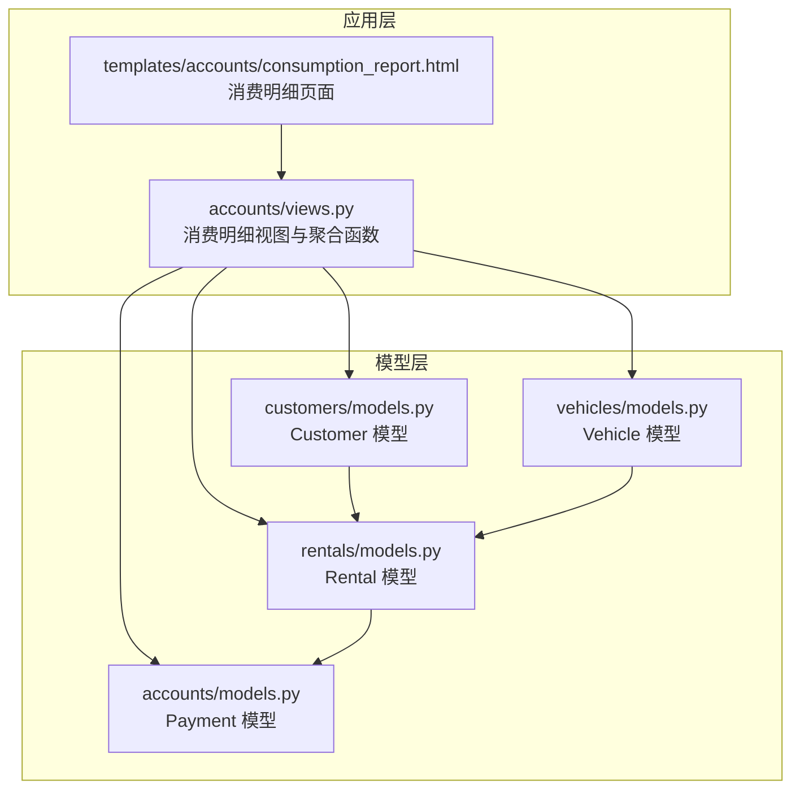
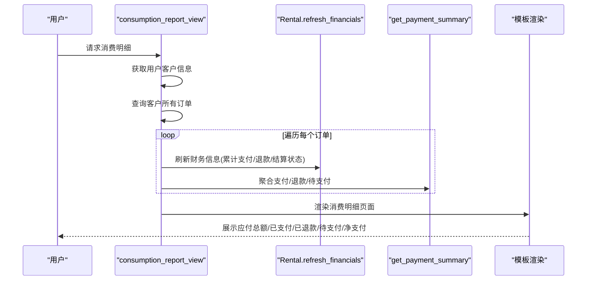
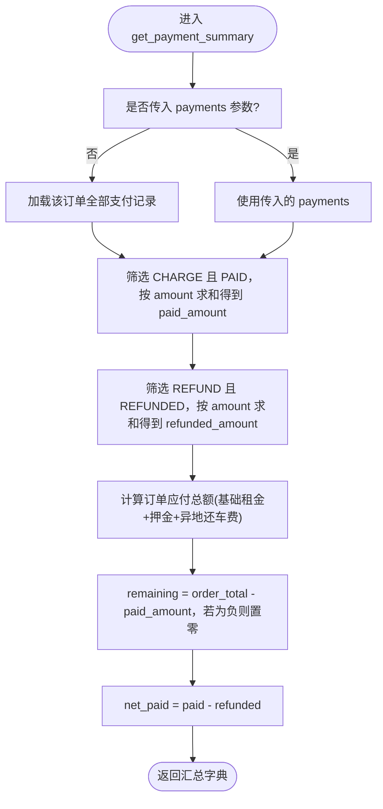
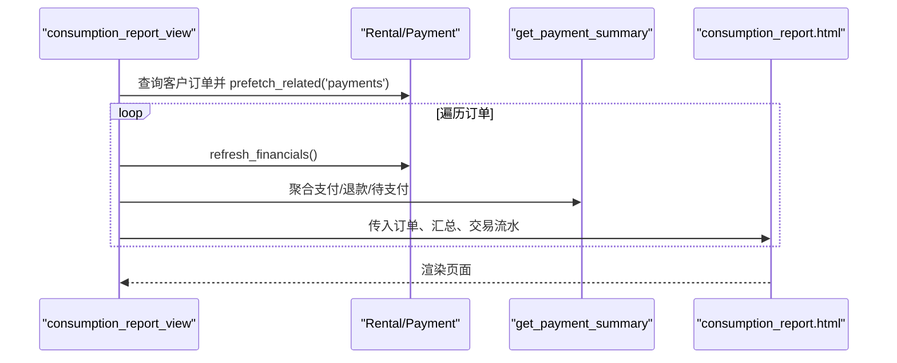
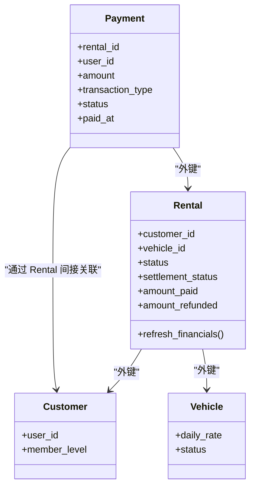

# 消费明细数据聚合逻辑

<cite>
**本文引用的文件**
- [accounts/models.py](file://code/car_rental_system/accounts/models.py)
- [rentals/models.py](file://code/car_rental_system/rentals/models.py)
- [accounts/views.py](file://code/car_rental_system/accounts/views.py)
- [templates/accounts/consumption_report.html](file://code/car_rental_system/templates/accounts/consumption_report.html)
- [customers/models.py](file://code/car_rental_system/customers/models.py)
- [vehicles/models.py](file://code/car_rental_system/vehicles/models.py)
</cite>

## 目录
1. [简介](#简介)
2. [项目结构](#项目结构)
3. [核心组件](#核心组件)
4. [架构总览](#架构总览)
5. [详细组件分析](#详细组件分析)
6. [依赖关系分析](#依赖关系分析)
7. [性能考量](#性能考量)
8. [故障排查指南](#故障排查指南)
9. [结论](#结论)

## 简介
本文件聚焦“消费明细报表”的数据聚合实现机制，围绕 Rental、Payment 和 Refund（通过 Payment 的交易类型与状态体现）三类模型，系统性说明如何在 Django 视图层通过 ORM 关联查询与聚合计算，生成“总支付金额”“总退款金额”“净消费金额”等关键指标，并解释 get_payment_summary 函数如何确保数据一致性与实时性，以及订单状态对统计口径的影响。

## 项目结构
- 消费明细报表由 accounts 应用提供，核心涉及以下模块：
  - accounts.models：定义 Payment 模型（含交易类型、状态、金额等字段）
  - rentals.models：定义 Rental 模型（含订单状态、结算状态、累计支付/退款字段等）
  - accounts.views：提供消费明细视图与 get_payment_summary 聚合函数
  - templates/accounts/consumption_report.html：渲染消费明细页面
  - customers.models、vehicles.models：辅助关联与展示

图表来源
- [accounts/views.py](file://code/car_rental_system/accounts/views.py#L1390-L1423)
- [templates/accounts/consumption_report.html](file://code/car_rental_system/templates/accounts/consumption_report.html#L1-L154)
- [accounts/models.py](file://code/car_rental_system/accounts/models.py#L147-L251)
- [rentals/models.py](file://code/car_rental_system/rentals/models.py#L12-L169)

章节来源
- [accounts/views.py](file://code/car_rental_system/accounts/views.py#L1390-L1423)
- [templates/accounts/consumption_report.html](file://code/car_rental_system/templates/accounts/consumption_report.html#L1-L154)
- [accounts/models.py](file://code/car_rental_system/accounts/models.py#L147-L251)
- [rentals/models.py](file://code/car_rental_system/rentals/models.py#L12-L169)

## 核心组件
- Payment 模型
  - 通过 transaction_type 区分“支付”与“退款”，通过 status 区分“已支付/已退款/失败”等状态
  - 与 Rental、User 建立外键关联，支持按订单维度聚合
- Rental 模型
  - 提供订单状态与结算状态，维护 amount_paid、amount_refunded 累计字段
  - 提供 refresh_financials 方法，基于支付记录重新计算累计支付/退款与结算状态
- get_payment_summary 函数
  - 在 accounts/views.py 中实现，对单个订单的支付/退款进行聚合统计
  - 输出 paid_amount、refunded_amount、net_paid、remaining_amount、order_total_amount 等指标
- 消费明细视图
  - accounts/views.py 的 consumption_report_view 逐订单调用 get_payment_summary，并将结果传入模板渲染

章节来源
- [accounts/models.py](file://code/car_rental_system/accounts/models.py#L147-L251)
- [rentals/models.py](file://code/car_rental_system/rentals/models.py#L296-L333)
- [accounts/views.py](file://code/car_rental_system/accounts/views.py#L243-L268)
- [accounts/views.py](file://code/car_rental_system/accounts/views.py#L1390-L1423)

## 架构总览
消费明细报表的数据流从用户请求进入 accounts/views.py 的 consumption_report_view，随后：
- 依据当前用户获取其 Customer
- 查询该客户的所有 Rental 订单
- 对每个订单调用 Rental.refresh_financials 保证累计支付/退款与结算状态最新
- 通过 get_payment_summary 对每个订单进行支付/退款聚合
- 将订单、汇总与交易流水一并传入模板渲染

图表来源
- [accounts/views.py](file://code/car_rental_system/accounts/views.py#L1390-L1423)
- [accounts/views.py](file://code/car_rental_system/accounts/views.py#L243-L268)
- [rentals/models.py](file://code/car_rental_system/rentals/models.py#L296-L333)

## 详细组件分析

### get_payment_summary 聚合函数实现分析
- 输入
  - rental：目标订单
  - payments：可选，若未传入则默认取该订单的所有支付记录
- 聚合逻辑
  - 总支付金额 paid_amount：筛选 transaction_type='CHARGE' 且 status='PAID' 的记录，按 amount 字段求和
  - 总退款金额 refunded_amount：筛选 transaction_type='REFUND' 且 status='REFUNDED' 的记录，按 amount 字段求和
  - 订单应付总额 order_total_amount：来自 get_order_amount_breakdown 的拆分结果（基础租金+押金+异地还车费）
  - 待支付 remaining_amount：应付总额 - 已支付，负值按 0 处理
  - 净支付 net_paid：已支付 - 已退款
- 输出
  - 返回包含上述指标与费用拆分的字典，供模板渲染与后续展示

图表来源
- [accounts/views.py](file://code/car_rental_system/accounts/views.py#L243-L268)

章节来源
- [accounts/views.py](file://code/car_rental_system/accounts/views.py#L243-L268)

### 消费明细视图与模板渲染
- 视图层
  - consumption_report_view：按客户查询订单，逐订单调用 refresh_financials 与 get_payment_summary，组装 consumption_items 并渲染模板
- 模板层
  - consumption_report.html：展示订单号、车辆信息、订单状态/结算状态、应付总额、已支付、已退款、待支付、净支付、费用拆分与交易流水

图表来源
- [accounts/views.py](file://code/car_rental_system/accounts/views.py#L1390-L1423)
- [templates/accounts/consumption_report.html](file://code/car_rental_system/templates/accounts/consumption_report.html#L1-L154)

章节来源
- [accounts/views.py](file://code/car_rental_system/accounts/views.py#L1390-L1423)
- [templates/accounts/consumption_report.html](file://code/car_rental_system/templates/accounts/consumption_report.html#L1-L154)

### 订单状态与结算状态对统计的影响
- 订单状态（status）
  - 影响用户侧可见性与操作能力（例如“待确认/进行中”才可支付，“已完成/已取消”才可退款）
  - 在消费明细中作为展示标签出现，便于用户理解订单阶段
- 结算状态（settlement_status）
  - 由 Rental.refresh_financials 基于 amount_paid 与订单应付总额动态计算：
    - 若订单已完成且应付总额已完全支付，则结算状态为“已结算”
    - 若已支付大于 0 且未完全支付，则为“部分结算”
    - 否则为“未结算”
- 业务规则要点
  - 已结算订单：通常不再产生新的支付，退款流程需遵循退款规则
  - 已取消订单：可能触发退款流程，退款金额以“净支付”为准（已支付-已退款）

章节来源
- [rentals/models.py](file://code/car_rental_system/rentals/models.py#L296-L333)

### 数据一致性与实时性保障
- 事务与原子性
  - 在支付、取消、还车等关键流程中使用 transaction.atomic，确保多步写入的一致性
- 财务刷新
  - 消费明细视图与订单详情视图均在展示前调用 Rental.refresh_financials，确保 amount_paid、amount_refunded、settlement_status 与 settled_at 的最新值
- 即时聚合
  - get_payment_summary 基于 ORM 聚合函数 Sum，避免 Python 层循环累加，减少数据传输与计算开销
- 并发更新场景
  - 通过数据库事务包裹关键写入路径，降低并发冲突概率
  - 对于高频读取的统计，可在业务允许范围内引入缓存（如热门车辆、推荐策略等），但消费明细强调“实时性”，因此采用即时刷新策略

章节来源
- [accounts/views.py](file://code/car_rental_system/accounts/views.py#L1045-L1091)
- [accounts/views.py](file://code/car_rental_system/accounts/views.py#L1289-L1363)
- [accounts/views.py](file://code/car_rental_system/accounts/views.py#L1390-L1423)
- [rentals/models.py](file://code/car_rental_system/rentals/models.py#L296-L333)

### 关键指标定义与计算口径
- 总支付金额（paid_amount）
  - 仅统计 transaction_type='CHARGE' 且 status='PAID' 的支付记录
- 总退款金额（refunded_amount）
  - 仅统计 transaction_type='REFUND' 且 status='REFUNDED' 的退款记录
- 净消费金额（net_paid）
  - 已支付 - 已退款，体现用户实际承担的金额
- 待支付金额（remaining_amount）
  - 订单应付总额 - 已支付，负值按 0 处理
- 订单应付总额（order_total_amount）
  - 基础租金 + 押金 + 异地还车费（若发生）

章节来源
- [accounts/views.py](file://code/car_rental_system/accounts/views.py#L243-L268)
- [rentals/models.py](file://code/car_rental_system/rentals/models.py#L286-L295)

## 依赖关系分析
- 模型依赖
  - Payment.rental → Rental
  - Payment.user → User
  - Rental.customer → Customer
  - Rental.vehicle → Vehicle
- 视图依赖
  - consumption_report_view 依赖 get_payment_summary、Rental.refresh_financials
  - 模板依赖视图上下文中的 summary 与 transactions 字段
- 模板依赖
  - 消费明细页面展示订单状态、结算状态、应付总额、已支付、已退款、待支付、净支付、费用拆分与交易流水

图表来源
- [accounts/models.py](file://code/car_rental_system/accounts/models.py#L147-L251)
- [rentals/models.py](file://code/car_rental_system/rentals/models.py#L12-L169)
- [customers/models.py](file://code/car_rental_system/customers/models.py#L7-L100)
- [vehicles/models.py](file://code/car_rental_system/vehicles/models.py#L6-L85)

章节来源
- [accounts/models.py](file://code/car_rental_system/accounts/models.py#L147-L251)
- [rentals/models.py](file://code/car_rental_system/rentals/models.py#L12-L169)
- [customers/models.py](file://code/car_rental_system/customers/models.py#L7-L100)
- [vehicles/models.py](file://code/car_rental_system/vehicles/models.py#L6-L85)

## 性能考量
- 查询优化
  - 消费明细视图使用 select_related('vehicle') 与 prefetch_related('payments')，减少 N+1 查询
  - 模板侧对交易流水按创建时间倒序展示，避免额外排序开销
- 聚合计算
  - 使用 ORM 的 aggregate(Sum(...)) 直接在数据库层完成求和，避免 Python 层遍历
- 缓存策略
  - 系统在其他场景使用缓存（如热门车辆、筛选选项等），但消费明细强调“实时性”，未对聚合结果做缓存
- 建议
  - 若用户量大且明细页访问频繁，可在业务允许范围内对“最近 N 笔订单”的汇总结果做短期缓存，同时提供“刷新”按钮强制重新计算

章节来源
- [accounts/views.py](file://code/car_rental_system/accounts/views.py#L1390-L1423)
- [templates/accounts/consumption_report.html](file://code/car_rental_system/templates/accounts/consumption_report.html#L1-L154)

## 故障排查指南
- 消费明细为空
  - 检查用户是否已完善客户信息，未完善将被引导至客户信息页
  - 确认该用户是否存在 Rental 记录
- 指标异常
  - 确认 Rental.refresh_financials 是否被调用（消费明细视图与订单详情视图均会调用）
  - 检查 Payment 的 transaction_type 与 status 是否正确（仅 CHARGE/PAID 与 REFUND/REFUNDED 才计入）
- 并发问题
  - 在支付/退款/取消等关键流程中使用事务包裹，若出现数据不一致，检查事务是否完整提交
- 模板显示异常
  - 确认模板上下文是否包含 summary 与 transactions 字段，以及字段名称与视图保持一致

章节来源
- [accounts/views.py](file://code/car_rental_system/accounts/views.py#L1390-L1423)
- [templates/accounts/consumption_report.html](file://code/car_rental_system/templates/accounts/consumption_report.html#L1-L154)

## 结论
本系统通过 Payment 与 Rental 的强关联，配合 accounts/views.py 的 get_payment_summary 与 Rental.refresh_financials，实现了对用户消费明细的高效、准确与实时统计。通过明确的交易类型与状态过滤、严格的事务控制与查询优化，既满足了业务对“已结算/已退款”等状态的纳入条件，又兼顾了用户体验的“实时性”。建议在高并发场景下，结合业务需求对热点数据进行适度缓存，同时保留“刷新”能力以保证准确性。