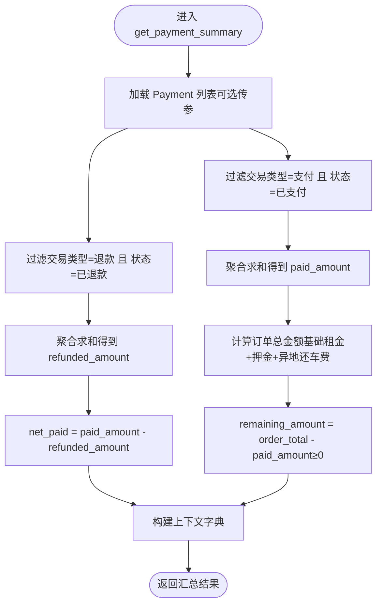

# 结算数据同步

<cite>
**本文引用的文件**
- [accounts/models.py](file://code/car_rental_system/accounts/models.py)
- [rentals/models.py](file://code/car_rental_system/rentals/models.py)
- [accounts/views.py](file://code/car_rental_system/accounts/views.py)
- [rentals/views.py](file://code/car_rental_system/rentals/views.py)
- [templates/accounts/order_detail.html](file://code/car_rental_system/templates/accounts/order_detail.html)
- [templates/rentals/rental_detail.html](file://code/car_rental_system/templates/rentals/rental_detail.html)
- [accounts/forms.py](file://code/car_rental_system/accounts/forms.py)
- [settings.py](file://code/car_rental_system/car_rental_system/settings.py)
- [0003_settlement_fields.py](file://code/car_rental_system/rentals/migrations/0003_settlement_fields.py)
- [update_historical_orders.py](file://code/car_rental_system/rentals/management/commands/update_historical_orders.py)
- [update_expired_rentals.py](file://code/car_rental_system/rentals/management/commands/update_expired_rentals.py)
</cite>

## 目录
1. [引言](#引言)
2. [项目结构](#项目结构)
3. [核心组件](#核心组件)
4. [架构总览](#架构总览)
5. [详细组件分析](#详细组件分析)
6. [依赖关系分析](#依赖关系分析)
7. [性能考量](#性能考量)
8. [故障排查指南](#故障排查指南)
9. [结论](#结论)
10. [附录](#附录)

## 引言
本文件聚焦“结算状态变更时的数据同步机制”，围绕 Payment 模型与 Rental 订单模型之间的数据一致性维护展开，系统性阐述以下要点：
- get_payment_summary 如何实时计算净支付金额、剩余金额等关键财务指标
- 在订单详情页与订单列表页如何准确展示这些指标
- 前端模板如何通过上下文变量（如 amount_paid、remaining_amount）与后端数据保持同步
- 异步支付结果的更新策略与落地
- 数据缓存策略与数据库查询优化技术在保证实时性与性能方面的作用

## 项目结构
系统采用 Django 分层架构，核心围绕“账户与支付”和“租赁与订单”两大模块协作：
- accounts 模块：用户、支付记录、通知、评价等
- rentals 模块：订单、车辆、客户等
- templates：前后端模板渲染
- migrations：数据库迁移脚本，包含结算字段初始化与历史数据回补

图表来源
- [accounts/models.py](file://code/car_rental_system/accounts/models.py#L147-L251)
- [rentals/models.py](file://code/car_rental_system/rentals/models.py#L12-L170)
- [accounts/views.py](file://code/car_rental_system/accounts/views.py#L243-L268)
- [rentals/views.py](file://code/car_rental_system/rentals/views.py#L129-L151)
- [settings.py](file://code/car_rental_system/car_rental_system/settings.py#L139-L178)

章节来源
- [accounts/models.py](file://code/car_rental_system/accounts/models.py#L147-L251)
- [rentals/models.py](file://code/car_rental_system/rentals/models.py#L12-L170)
- [settings.py](file://code/car_rental_system/car_rental_system/settings.py#L139-L178)

## 核心组件
- Payment 模型：记录支付/退款流水，包含金额、交易类型、状态、第三方交易号、支付时间等字段；通过 rental 外键与订单关联。
- Rental 模型：订单主表，包含总金额、押金、异地还车费用、超时费用、结算状态、累计支付/退款金额等字段；提供 refresh_financials 与 refund_deposit 等关键方法。
- get_payment_summary：在 accounts/views 中实现，用于计算已支付、已退款、净支付、应付总额、剩余金额等。
- 前端模板：订单详情页与列表页通过上下文变量展示财务指标，确保前后端一致。

章节来源
- [accounts/models.py](file://code/car_rental_system/accounts/models.py#L147-L251)
- [rentals/models.py](file://code/car_rental_system/rentals/models.py#L12-L170)
- [accounts/views.py](file://code/car_rental_system/accounts/views.py#L243-L268)
- [templates/accounts/order_detail.html](file://code/car_rental_system/templates/accounts/order_detail.html#L300-L330)

## 架构总览
结算数据同步的关键路径如下：
- 订单状态变更（如完成、取消）触发财务刷新与结算状态更新
- 支付行为发生后，调用 refresh_financials 更新累计支付/退款与结算状态
- 前端通过上下文变量渲染财务指标，确保展示与后端一致
- 缓存与数据库优化保障高并发下的实时性与性能

图表来源
- [accounts/views.py](file://code/car_rental_system/accounts/views.py#L1291-L1353)
- [rentals/models.py](file://code/car_rental_system/rentals/models.py#L296-L333)
- [accounts/models.py](file://code/car_rental_system/accounts/models.py#L147-L251)
- [templates/accounts/order_detail.html](file://code/car_rental_system/templates/accounts/order_detail.html#L300-L330)

## 详细组件分析

### Payment 模型与 Rental 模型的关系
- Payment.rental 外键关联 Rental，形成一对多关系，支持按订单聚合支付/退款数据
- Rental 提供 refresh_financials 方法，基于 Payment 聚合计算 amount_paid、amount_refunded，并据此更新 settlement_status
- 两者均具备索引与字段设计，便于高频查询与排序

图表来源
- [accounts/models.py](file://code/car_rental_system/accounts/models.py#L147-L251)
- [rentals/models.py](file://code/car_rental_system/rentals/models.py#L12-L170)
- [rentals/models.py](file://code/car_rental_system/rentals/models.py#L296-L401)

章节来源
- [accounts/models.py](file://code/car_rental_system/accounts/models.py#L147-L251)
- [rentals/models.py](file://code/car_rental_system/rentals/models.py#L12-L170)
- [rentals/models.py](file://code/car_rental_system/rentals/models.py#L296-L401)

### get_payment_summary 的计算逻辑与实时性
- 输入：Rental 对象（可选传入 Payment 查询集）
- 输出：包含 paid_amount、refunded_amount、net_paid、order_total_amount、remaining_amount 等字段的汇总字典
- 实时性保障：每次渲染前调用 get_payment_summary，确保前端展示与数据库聚合结果一致

图表来源
- [accounts/views.py](file://code/car_rental_system/accounts/views.py#L243-L268)

章节来源
- [accounts/views.py](file://code/car_rental_system/accounts/views.py#L243-L268)

### 订单详情页与列表页的展示一致性
- 订单详情页（用户侧）：通过 accounts/views 中的订单详情视图，将 get_payment_summary 的结果注入模板上下文，前端模板直接使用 amount_paid、refunded_amount、net_paid、remaining_amount、order_total_amount 等变量渲染
- 订单列表页（后台侧）：rentals/views 中的列表视图同样调用自动状态更新与缓存优化，确保列表页展示的订单状态与财务信息与数据库一致

图表来源
- [accounts/views.py](file://code/car_rental_system/accounts/views.py#L891-L902)
- [templates/accounts/order_detail.html](file://code/car_rental_system/templates/accounts/order_detail.html#L300-L330)

章节来源
- [accounts/views.py](file://code/car_rental_system/accounts/views.py#L891-L902)
- [templates/accounts/order_detail.html](file://code/car_rental_system/templates/accounts/order_detail.html#L300-L330)

### 结算状态变更与数据一致性维护
- 归还流程：rentals/views 的归还处理会计算超时费用、异地还车费用，更新订单状态为已完成，并调用 rental.refresh_financials 刷新累计支付/退款与结算状态
- 取消流程：rentals/views 的取消处理会根据已支付金额（净支付）创建退款记录，并调用 refresh_financials 更新财务信息
- 历史数据回补：迁移脚本与管理命令负责批量更新历史订单的结算字段与财务信息，确保历史一致性

图表来源
- [rentals/views.py](file://code/car_rental_system/rentals/views.py#L279-L392)
- [rentals/views.py](file://code/car_rental_system/rentals/views.py#L395-L466)
- [rentals/models.py](file://code/car_rental_system/rentals/models.py#L296-L333)
- [accounts/views.py](file://code/car_rental_system/accounts/views.py#L1291-L1353)

章节来源
- [rentals/views.py](file://code/car_rental_system/rentals/views.py#L279-L392)
- [rentals/views.py](file://code/car_rental_system/rentals/views.py#L395-L466)
- [rentals/models.py](file://code/car_rental_system/rentals/models.py#L296-L333)
- [accounts/views.py](file://code/car_rental_system/accounts/views.py#L1291-L1353)

### 异步支付结果的更新策略
- 当前实现：accounts/views 的支付视图在事务中创建 Payment 记录并立即调用 rental.refresh_financials，确保前端展示即时更新
- 异步场景建议：若接入第三方支付回调，可在回调入口处校验交易号与状态，创建 Payment 并调用 refresh_financials，再通过通知系统推送消息，最后返回成功响应

章节来源
- [accounts/views.py](file://code/car_rental_system/accounts/views.py#L1291-L1353)
- [accounts/models.py](file://code/car_rental_system/accounts/models.py#L147-L251)

### 前端模板与上下文变量的同步
- 订单详情页模板直接使用上下文变量渲染应付总额、已支付、已退款、待支付等，确保与后端 get_payment_summary 的结果一致
- 列表页模板通过后端聚合与缓存优化，减少数据库压力，同时保证展示准确性

章节来源
- [templates/accounts/order_detail.html](file://code/car_rental_system/templates/accounts/order_detail.html#L300-L330)
- [templates/rentals/rental_detail.html](file://code/car_rental_system/templates/rentals/rental_detail.html#L266-L327)

## 依赖关系分析
- accounts.models.Payment 与 rentals.models.Rental 通过外键建立强关联，支撑支付流水与订单财务信息的一致性
- accounts.views.get_payment_summary 依赖 Payment 聚合查询，依赖 rentals.models.get_order_amount_breakdown 计算订单总金额
- rentals.models.Rental.refresh_financials 依赖 Payment 聚合查询，决定结算状态与结算时间
- settings.py 中的缓存配置为自动状态更新与热门数据缓存提供基础

图表来源
- [accounts/models.py](file://code/car_rental_system/accounts/models.py#L147-L251)
- [rentals/models.py](file://code/car_rental_system/rentals/models.py#L296-L333)
- [accounts/views.py](file://code/car_rental_system/accounts/views.py#L243-L268)
- [settings.py](file://code/car_rental_system/car_rental_system/settings.py#L139-L178)

章节来源
- [accounts/models.py](file://code/car_rental_system/accounts/models.py#L147-L251)
- [rentals/models.py](file://code/car_rental_system/rentals/models.py#L296-L333)
- [accounts/views.py](file://code/car_rental_system/accounts/views.py#L243-L268)
- [settings.py](file://code/car_rental_system/car_rental_system/settings.py#L139-L178)

## 性能考量
- 缓存策略
  - 自动状态更新：Rental.auto_update_status 使用缓存避免频繁更新（每5分钟最多更新一次）
  - 热门数据缓存：推荐车辆、热门车型等使用缓存，降低查询开销
- 数据库优化
  - Payment/Rental 建立复合索引，加速按状态、交易类型、订单等维度的查询
  - select_related 与 only 优化查询字段与关联查询，减少 N+1 问题
  - 聚合查询一次性计算统计信息，避免多次往返数据库
- 连接池与日志
  - settings 中配置缓存与 SQLite 超时，有助于提升并发稳定性
  - 日志配置便于定位慢查询与性能瓶颈

章节来源
- [rentals/models.py](file://code/car_rental_system/rentals/models.py#L171-L229)
- [accounts/views.py](file://code/car_rental_system/accounts/views.py#L271-L388)
- [settings.py](file://code/car_rental_system/car_rental_system/settings.py#L139-L178)

## 故障排查指南
- 支付后展示不更新
  - 检查是否调用了 rental.refresh_financials
  - 确认 Payment 交易类型与状态是否正确（CHARGE/PAID 或 REFUND/REFUNDED）
- 结算状态异常
  - 核对订单总金额计算与已支付金额比较，确保 settlement_status 更新逻辑正确
  - 使用管理命令批量刷新历史订单财务信息
- 性能问题
  - 关注缓存命中率与聚合查询耗时
  - 检查索引是否覆盖常用查询条件

章节来源
- [accounts/views.py](file://code/car_rental_system/accounts/views.py#L1291-L1353)
- [rentals/models.py](file://code/car_rental_system/rentals/models.py#L296-L333)
- [update_historical_orders.py](file://code/car_rental_system/rentals/management/commands/update_historical_orders.py#L35-L90)

## 结论
本系统通过 Payment 与 Rental 的紧密耦合、get_payment_summary 的实时聚合、模板上下文的直接绑定，以及缓存与数据库优化策略，实现了结算状态变更时的数据一致性与高实时性。归还、取消、支付等关键流程均在事务中完成，并通过 refresh_financials 保证累计支付/退款与结算状态的准确更新。前端模板与后端上下文保持高度一致，确保用户在订单详情页与列表页看到的财务指标始终反映最新状态。

## 附录
- 历史数据回补
  - 迁移脚本在初始化结算字段时，基于 Payment 聚合计算 amount_paid/amount_refunded/settlement_status
  - 管理命令支持批量更新历史订单状态、退还押金与刷新财务信息
- 支付表单
  - accounts/forms.py 提供支付方式选择，配合 accounts/views 的支付视图完成支付流程

章节来源
- [0003_settlement_fields.py](file://code/car_rental_system/rentals/migrations/0003_settlement_fields.py#L1-L93)
- [update_historical_orders.py](file://code/car_rental_system/rentals/management/commands/update_historical_orders.py#L35-L90)
- [accounts/forms.py](file://code/car_rental_system/accounts/forms.py#L300-L314)