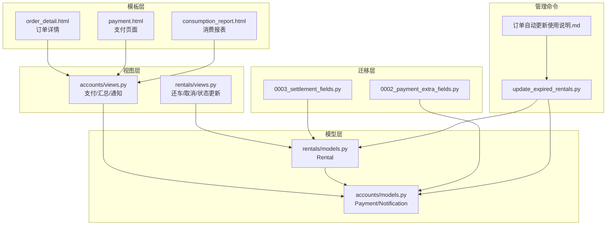
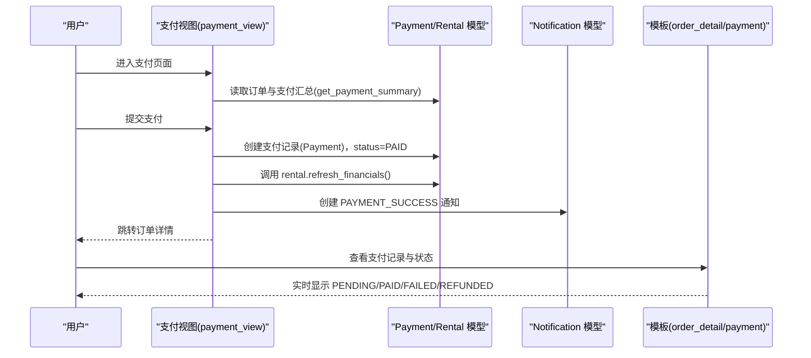
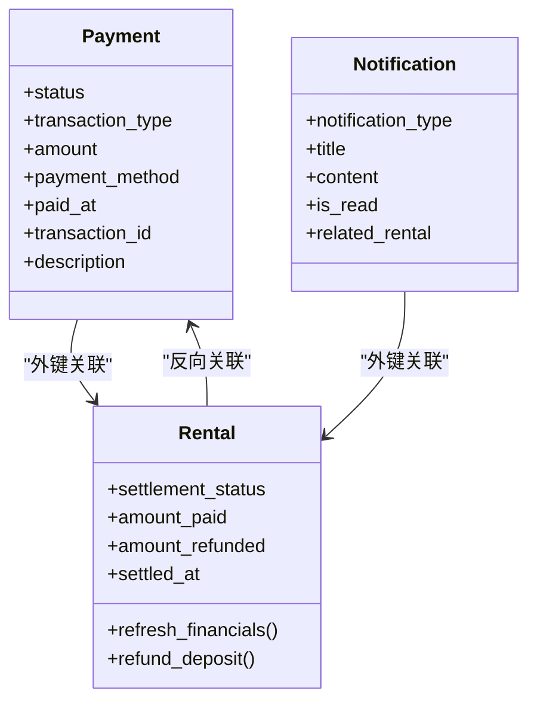
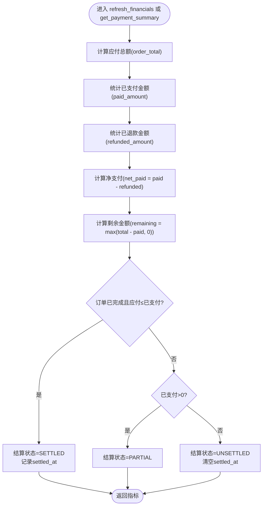
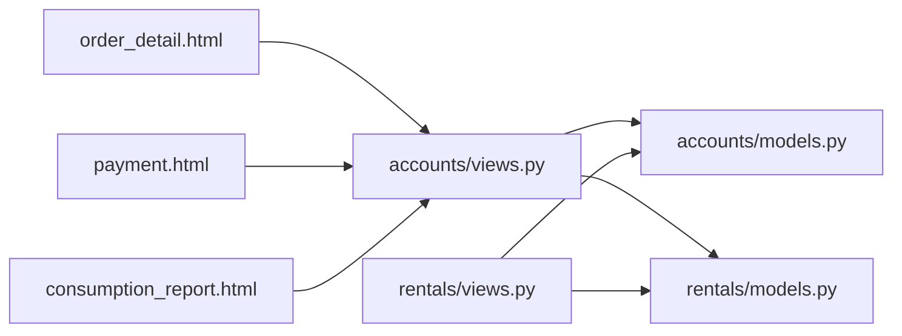

# 结算状态管理

<cite>
**本文引用的文件**
- [accounts/models.py](file://code/car_rental_system/accounts/models.py)
- [rentals/models.py](file://code/car_rental_system/rentals/models.py)
- [accounts/views.py](file://code/car_rental_system/accounts/views.py)
- [rentals/views.py](file://code/car_rental_system/rentals/views.py)
- [accounts/migrations/0002_payment_extra_fields.py](file://code/car_rental_system/accounts/migrations/0002_payment_extra_fields.py)
- [rentals/migrations/0003_settlement_fields.py](file://code/car_rental_system/rentals/migrations/0003_settlement_fields.py)
- [templates/accounts/order_detail.html](file://code/car_rental_system/templates/accounts/order_detail.html)
- [templates/accounts/payment.html](file://code/car_rental_system/templates/accounts/payment.html)
- [templates/accounts/consumption_report.html](file://code/car_rental_system/templates/accounts/consumption_report.html)
- [rentals/management/commands/update_expired_rentals.py](file://code/car_rental_system/rentals/management/commands/update_expired_rentals.py)
- [订单自动更新使用说明.md](file://code/car_rental_system/订单自动更新使用说明.md)
</cite>

## 目录
1. [引言](#引言)
2. [项目结构](#项目结构)
3. [核心组件](#核心组件)
4. [架构总览](#架构总览)
5. [详细组件分析](#详细组件分析)
6. [依赖关系分析](#依赖关系分析)
7. [性能考量](#性能考量)
8. [故障排查指南](#故障排查指南)
9. [结论](#结论)
10. [附录](#附录)

## 引言
本文件系统化阐述“结算状态”的全生命周期管理，围绕 Payment 模型 status 字段（PENDING、PAID、FAILED、REFUNDED）展开，覆盖状态转换条件、触发事件、订单详情页面的实时展示、get_payment_summary 函数的财务指标计算、通知机制与数据一致性保障。目标是帮助开发者与运营人员准确理解并维护结算状态流转，确保财务数据准确与用户体验一致。

## 项目结构
围绕结算状态的关键模块与文件如下：
- 模型层
  - accounts/models.py：定义 Payment 与 Notification 模型，包含支付状态、交易类型、支付方式等字段
  - rentals/models.py：定义 Rental 模型，包含结算状态 settlement_status、累计支付/退款金额、结算时间等字段，并提供 refresh_financials、refund_deposit 等结算相关方法
- 视图层
  - accounts/views.py：实现支付页面、支付汇总、通知视图等；其中 get_payment_summary 负责计算净支付、剩余金额等关键指标
  - rentals/views.py：实现还车、取消、状态更新等业务流程，涉及结算状态与财务数据的联动
- 模板层
  - templates/accounts/order_detail.html：订单详情页，实时展示支付记录与状态
  - templates/accounts/payment.html：支付页面，展示支付状态徽章
  - templates/accounts/consumption_report.html：消费报表，展示订单结算状态与退款信息
- 迁移层
  - accounts/migrations/0002_payment_extra_fields.py：新增交易类型与备注索引
  - rentals/migrations/0003_settlement_fields.py：新增结算相关字段并回填历史数据
- 管理命令
  - rentals/management/commands/update_expired_rentals.py：自动更新订单状态与结算相关处理
  - 订单自动更新使用说明.md：命令使用与注意事项

图表来源
- [accounts/models.py](file://code/car_rental_system/accounts/models.py#L147-L251)
- [rentals/models.py](file://code/car_rental_system/rentals/models.py#L12-160)
- [accounts/views.py](file://code/car_rental_system/accounts/views.py#L243-L268)
- [rentals/views.py](file://code/car_rental_system/rentals/views.py#L279-L392)
- [templates/accounts/order_detail.html](file://code/car_rental_system/templates/accounts/order_detail.html#L380-L418)
- [templates/accounts/payment.html](file://code/car_rental_system/templates/accounts/payment.html#L205-L223)
- [templates/accounts/consumption_report.html](file://code/car_rental_system/templates/accounts/consumption_report.html#L31-L54)
- [accounts/migrations/0002_payment_extra_fields.py](file://code/car_rental_system/accounts/migrations/0002_payment_extra_fields.py#L1-L42)
- [rentals/migrations/0003_settlement_fields.py](file://code/car_rental_system/rentals/migrations/0003_settlement_fields.py#L1-L95)
- [rentals/management/commands/update_expired_rentals.py](file://code/car_rental_system/rentals/management/commands/update_expired_rentals.py#L1-L191)
- [订单自动更新使用说明.md](file://code/car_rental_system/订单自动更新使用说明.md#L71-L129)

章节来源
- [accounts/models.py](file://code/car_rental_system/accounts/models.py#L147-L251)
- [rentals/models.py](file://code/car_rental_system/rentals/models.py#L12-160)
- [accounts/views.py](file://code/car_rental_system/accounts/views.py#L243-L268)
- [rentals/views.py](file://code/car_rental_system/rentals/views.py#L279-L392)
- [templates/accounts/order_detail.html](file://code/car_rental_system/templates/accounts/order_detail.html#L380-L418)
- [templates/accounts/payment.html](file://code/car_rental_system/templates/accounts/payment.html#L205-L223)
- [templates/accounts/consumption_report.html](file://code/car_rental_system/templates/accounts/consumption_report.html#L31-L54)
- [accounts/migrations/0002_payment_extra_fields.py](file://code/car_rental_system/accounts/migrations/0002_payment_extra_fields.py#L1-L42)
- [rentals/migrations/0003_settlement_fields.py](file://code/car_rental_system/rentals/migrations/0003_settlement_fields.py#L1-L95)
- [rentals/management/commands/update_expired_rentals.py](file://code/car_rental_system/rentals/management/commands/update_expired_rentals.py#L1-L191)
- [订单自动更新使用说明.md](file://code/car_rental_system/订单自动更新使用说明.md#L71-L129)

## 核心组件
- Payment 模型（accounts/models.py）
  - 关键字段：status（PENDING/PAID/FAILED/REFUNDED）、transaction_type（CHARGE/REFUND）、payment_method、amount、paid_at、transaction_id、description
  - 作用：记录每次支付或退款的明细，支撑结算状态与财务汇总
- Rental 模型（rentals/models.py）
  - 关键字段：settlement_status（UNSETTLED/PARTIAL/SETTLED）、amount_paid、amount_refunded、settled_at
  - 关键方法：refresh_financials（根据支付记录刷新累计支付/退款与结算状态）、refund_deposit（退还押金）
- 支付汇总函数（accounts/views.py）
  - get_payment_summary：计算 paid_amount、refunded_amount、net_paid、remaining_amount、order_total_amount 等
- 通知模型（accounts/models.py）
  - Notification：支持 PAYMENT_SUCCESS、PAYMENT_FAILED、ORDER_COMPLETED 等类型，用于推送结算相关通知

章节来源
- [accounts/models.py](file://code/car_rental_system/accounts/models.py#L147-L251)
- [rentals/models.py](file://code/car_rental_system/rentals/models.py#L12-160)
- [accounts/views.py](file://code/car_rental_system/accounts/views.py#L243-L268)

## 架构总览
结算状态管理贯穿“模型-视图-模板-迁移-命令”多层协作：
- 模型层定义状态枚举与字段约束
- 视图层在支付、还车、取消等流程中驱动状态变更与财务刷新
- 模板层实时展示支付状态与结算状态
- 迁移层保证历史数据的正确性与索引优化
- 管理命令提供自动化与幂等性保障

图表来源
- [accounts/views.py](file://code/car_rental_system/accounts/views.py#L1290-L1362)
- [accounts/views.py](file://code/car_rental_system/accounts/views.py#L243-L268)
- [rentals/models.py](file://code/car_rental_system/rentals/models.py#L296-L333)
- [templates/accounts/order_detail.html](file://code/car_rental_system/templates/accounts/order_detail.html#L380-L418)
- [templates/accounts/payment.html](file://code/car_rental_system/templates/accounts/payment.html#L205-L223)

## 详细组件分析

### Payment 模型与状态全生命周期
- 状态枚举与含义
  - PENDING：待支付
  - PAID：已支付
  - FAILED：支付失败
  - REFUNDED：已退款
- 交易类型
  - CHARGE：支付
  - REFUND：退款
- 关键字段
  - amount、payment_method、paid_at、transaction_id、description
- 索引与迁移
  - 交易类型索引提升查询效率
  - 历史数据迁移回填结算相关字段

图表来源
- [accounts/models.py](file://code/car_rental_system/accounts/models.py#L147-L251)
- [rentals/models.py](file://code/car_rental_system/rentals/models.py#L12-160)

章节来源
- [accounts/models.py](file://code/car_rental_system/accounts/models.py#L147-L251)
- [accounts/migrations/0002_payment_extra_fields.py](file://code/car_rental_system/accounts/migrations/0002_payment_extra_fields.py#L1-L42)

### 结算状态（Rental.settlement_status）与财务指标
- 结算状态计算逻辑
  - 若订单已完成且应付总额 ≤ 已支付金额，则 settlement_status=SETTLED，并记录 settled_at
  - 若已支付金额 > 0，则 settlement_status=PARTIAL
  - 否则 settlement_status=UNSETTLED，并清空 settled_at
- 财务指标计算
  - paid_amount：按 CHARGE 且 status=PAID 的金额求和
  - refunded_amount：按 REFUND 且 status=REFUNDED 的金额求和
  - net_paid = paid_amount − refunded_amount
  - remaining_amount = max(应付总额 − paid_amount, 0)
  - 应付总额由 calculate_order_total 决定（基础租金+押金+异地还车费用+超时费用）

图表来源
- [rentals/models.py](file://code/car_rental_system/rentals/models.py#L296-L333)
- [accounts/views.py](file://code/car_rental_system/accounts/views.py#L243-L268)

章节来源
- [rentals/models.py](file://code/car_rental_system/rentals/models.py#L296-L333)
- [accounts/views.py](file://code/car_rental_system/accounts/views.py#L243-L268)

### 状态转换条件与触发事件
- PENDING → PAID
  - 触发：用户在支付页面提交支付，系统创建 Payment（status=PAID），随后调用 rental.refresh_financials()
  - 通知：创建 PAYMENT_SUCCESS 通知
- PENDING → FAILED
  - 触发：支付失败场景（如模拟或外部回调），创建 Payment（status=FAILED）
  - 通知：创建 PAYMENT_FAILED 通知（可在支付失败处补充）
- PENDING → REFUNDED
  - 触发：订单取消或系统自动退款（如还车后押金退还），创建 Payment（transaction_type=REFUND，status=REFUNDED）
  - 通知：创建 ORDER_COMPLETED 或退款相关通知
- PAID → REFUNDED
  - 触发：发生退款（如部分退款或全部退款），创建 REFUND 类型的 Payment（status=REFUNDED）
- 其他联动
  - 还车流程：完成订单后自动退还押金（若满足条件），并刷新财务数据
  - 取消订单：若存在已支付金额，创建 REFUND 记录并刷新财务数据

章节来源
- [accounts/views.py](file://code/car_rental_system/accounts/views.py#L1290-L1362)
- [rentals/views.py](file://code/car_rental_system/rentals/views.py#L395-L466)
- [rentals/management/commands/update_expired_rentals.py](file://code/car_rental_system/rentals/management/commands/update_expired_rentals.py#L144-L191)

### 订单详情页面实时显示结算状态
- 订单详情页模板
  - 展示支付记录表格，按 status 显示不同徽章（待支付/已支付/支付失败/已退款）
  - 展示结算状态与应付总额、已支付、剩余金额等汇总信息
- 实时性保障
  - 视图在渲染前调用 get_payment_summary 与 rental.refresh_financials，确保数据最新
  - 模板直接读取模型字段与汇总结果，无需额外请求

章节来源
- [templates/accounts/order_detail.html](file://code/car_rental_system/templates/accounts/order_detail.html#L380-L418)
- [templates/accounts/payment.html](file://code/car_rental_system/templates/accounts/payment.html#L205-L223)
- [templates/accounts/consumption_report.html](file://code/car_rental_system/templates/accounts/consumption_report.html#L31-L54)
- [accounts/views.py](file://code/car_rental_system/accounts/views.py#L1290-L1362)

### get_payment_summary 函数详解
- 输入：rental 与可选 payments
- 输出：paid_amount、refunded_amount、net_paid、remaining_amount、order_total_amount 等
- 用途：消费报表、订单详情页财务概览、前端展示

章节来源
- [accounts/views.py](file://code/car_rental_system/accounts/views.py#L243-L268)

### 通知机制与数据一致性保障
- 通知类型
  - PAYMENT_SUCCESS：支付成功
  - PAYMENT_FAILED：支付失败
  - ORDER_COMPLETED：订单完成（含还车、退款、VIP 升级等）
- 一致性保障
  - 所有关键写操作均包裹在事务中（transaction.atomic），确保原子性
  - 自动更新命令幂等执行，避免重复更新已完成订单
  - 历史数据迁移回填结算字段，保证历史订单的结算状态正确

章节来源
- [accounts/models.py](file://code/car_rental_system/accounts/models.py#L253-L318)
- [rentals/views.py](file://code/car_rental_system/rentals/views.py#L279-L392)
- [rentals/management/commands/update_expired_rentals.py](file://code/car_rental_system/rentals/management/commands/update_expired_rentals.py#L1-L191)
- [订单自动更新使用说明.md](file://code/car_rental_system/订单自动更新使用说明.md#L71-L129)

## 依赖关系分析
- 模块耦合
  - accounts/views 依赖 rentals/models 的 refresh_financials 与 calculate_order_total
  - rentals/views 依赖 accounts/models 的 Payment 与 Notification
  - 模板依赖 accounts/views 的汇总数据与模型字段
- 外部依赖
  - Django ORM 事务、聚合查询、缓存
  - 管理命令 cron 定时任务

图表来源
- [accounts/views.py](file://code/car_rental_system/accounts/views.py#L243-L268)
- [rentals/views.py](file://code/car_rental_system/rentals/views.py#L279-L392)
- [templates/accounts/order_detail.html](file://code/car_rental_system/templates/accounts/order_detail.html#L380-L418)
- [templates/accounts/payment.html](file://code/car_rental_system/templates/accounts/payment.html#L205-L223)
- [templates/accounts/consumption_report.html](file://code/car_rental_system/templates/accounts/consumption_report.html#L31-L54)

## 性能考量
- 索引优化
  - Payment 增加 transaction_type 索引，加速按交易类型与状态的查询
  - Rental 增加结算相关字段索引，提升刷新财务数据的聚合查询性能
- 聚合查询
  - 使用聚合 Sum 聚合计算累计支付/退款，减少循环与多次查询
- 缓存与幂等
  - 自动更新命令使用缓存避免频繁执行
  - 幂等设计确保重复执行不产生副作用

章节来源
- [accounts/migrations/0002_payment_extra_fields.py](file://code/car_rental_system/accounts/migrations/0002_payment_extra_fields.py#L1-L42)
- [rentals/migrations/0003_settlement_fields.py](file://code/car_rental_system/rentals/migrations/0003_settlement_fields.py#L1-L95)
- [rentals/management/commands/update_expired_rentals.py](file://code/car_rental_system/rentals/management/commands/update_expired_rentals.py#L1-L191)

## 故障排查指南
- 支付状态未更新
  - 检查支付视图是否正确创建 Payment（status=PAID）并调用 rental.refresh_financials
  - 确认模板是否读取最新数据（视图已调用汇总与刷新）
- 结算状态异常
  - 检查应付总额与已支付金额计算是否正确（calculate_order_total 与 get_payment_summary）
  - 确认历史订单迁移是否完成（结算字段回填）
- 通知未送达
  - 检查 Notification 是否创建成功（类型、用户、关联订单）
  - 确认 cron 定时任务是否按说明配置并执行
- 数据不一致
  - 确认关键写操作是否包裹在事务中
  - 使用管理命令幂等执行，避免重复更新

章节来源
- [accounts/views.py](file://code/car_rental_system/accounts/views.py#L1290-L1362)
- [rentals/models.py](file://code/car_rental_system/rentals/models.py#L296-L333)
- [rentals/management/commands/update_expired_rentals.py](file://code/car_rental_system/rentals/management/commands/update_expired_rentals.py#L1-L191)
- [订单自动更新使用说明.md](file://code/car_rental_system/订单自动更新使用说明.md#L71-L129)

## 结论
结算状态管理通过 Payment 与 Rental 的协同，结合 get_payment_summary 的财务指标计算、模板层的实时展示与管理命令的自动化处理，实现了从支付到结算的闭环。事务与幂等设计保障了数据一致性，索引与聚合查询提升了性能。建议在生产环境中配合定时任务与监控，持续验证结算状态的准确性与一致性。

## 附录
- 历史数据迁移
  - 新增结算字段并回填历史数据，确保历史订单的结算状态正确
- 自动更新命令
  - 提供“预订中→进行中”与“进行中→已超时未归还”的自动更新，支持幂等执行与日志输出

章节来源
- [rentals/migrations/0003_settlement_fields.py](file://code/car_rental_system/rentals/migrations/0003_settlement_fields.py#L1-L95)
- [rentals/management/commands/update_expired_rentals.py](file://code/car_rental_system/rentals/management/commands/update_expired_rentals.py#L1-L191)
- [订单自动更新使用说明.md](file://code/car_rental_system/订单自动更新使用说明.md#L71-L129)