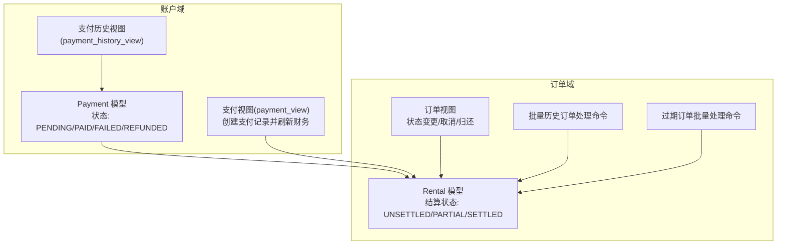
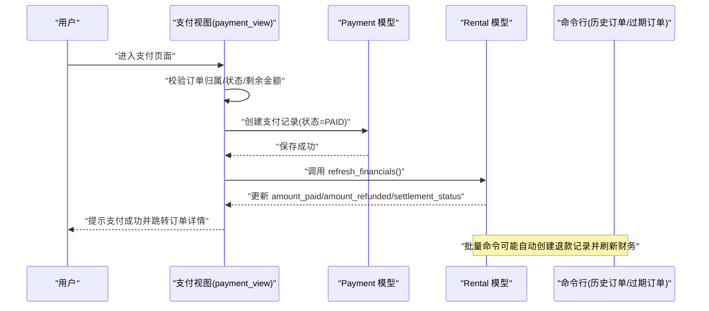
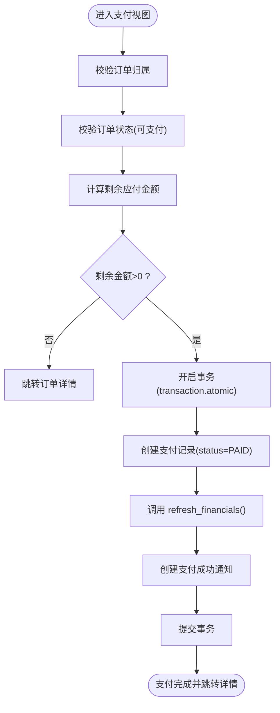
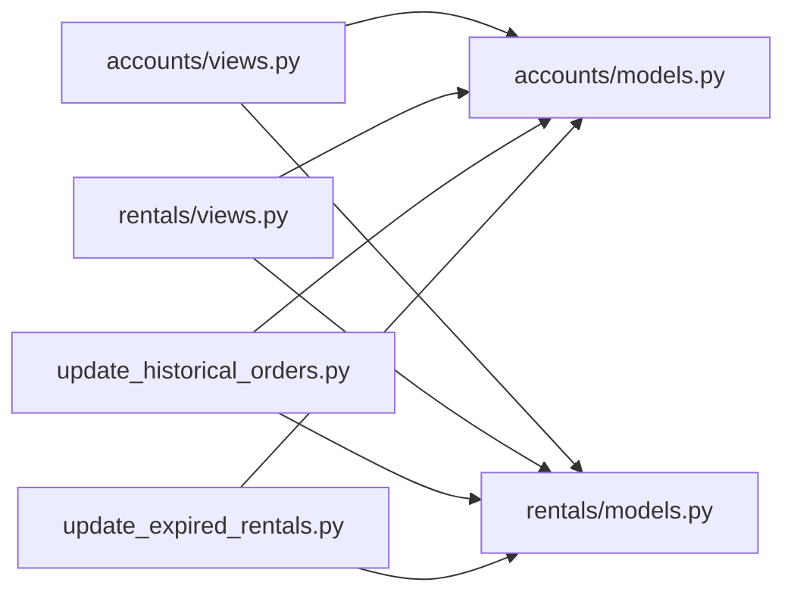

# 结算状态转换

<cite>
**本文引用的文件**
- [accounts/models.py](file://code/car_rental_system/accounts/models.py)
- [accounts/views.py](file://code/car_rental_system/accounts/views.py)
- [rentals/models.py](file://code/car_rental_system/rentals/models.py)
- [rentals/views.py](file://code/car_rental_system/rentals/views.py)
- [accounts/urls.py](file://code/car_rental_system/accounts/urls.py)
- [templates/accounts/payment.html](file://code/car_rental_system/templates/accounts/payment.html)
- [rentals/management/commands/update_historical_orders.py](file://code/car_rental_system/rentals/management/commands/update_historical_orders.py)
- [rentals/management/commands/update_expired_rentals.py](file://code/car_rental_system/rentals/management/commands/update_expired_rentals.py)
</cite>

## 目录
1. [引言](#引言)
2. [项目结构](#项目结构)
3. [核心组件](#核心组件)
4. [架构总览](#架构总览)
5. [详细组件分析](#详细组件分析)
6. [依赖关系分析](#依赖关系分析)
7. [性能考量](#性能考量)
8. [故障排查指南](#故障排查指南)
9. [结论](#结论)

## 引言
本文围绕 Payment 模型的 status 字段状态机展开，系统性阐述 PENDING、PAID、FAILED、REFUNDED 四种状态之间的转换规则与业务约束；解释状态转换过程中的数据一致性保障机制（Django 事务、索引与聚合查询）；并结合视图层的安全实现与并发冲突处理建议，帮助读者在实际开发中正确、安全地执行状态转换。

## 项目结构
围绕支付与订单结算的关键模块如下：
- accounts.models：定义 Payment 模型及其状态、交易类型、支付方式等字段与索引
- accounts.views：提供支付入口视图、支付历史视图、支付汇总工具函数
- rentals.models：提供订单财务刷新、押金退还、结算状态计算等能力
- rentals.views：提供订单状态变更、取消、归还等流程，涉及退款与状态联动
- 命令行脚本：批量历史订单处理，涵盖状态更新、退款与财务刷新
- URL 映射：支付入口与历史记录页面路由

图表来源
- [accounts/models.py](file://code/car_rental_system/accounts/models.py#L147-L251)
- [accounts/views.py](file://code/car_rental_system/accounts/views.py#L1289-L1387)
- [rentals/models.py](file://code/car_rental_system/rentals/models.py#L296-L333)
- [rentals/views.py](file://code/car_rental_system/rentals/views.py#L395-L466)
- [rentals/management/commands/update_historical_orders.py](file://code/car_rental_system/rentals/management/commands/update_historical_orders.py#L65-L90)
- [rentals/management/commands/update_expired_rentals.py](file://code/car_rental_system/rentals/management/commands/update_expired_rentals.py#L144-L173)

章节来源
- [accounts/models.py](file://code/car_rental_system/accounts/models.py#L147-L251)
- [accounts/views.py](file://code/car_rental_system/accounts/views.py#L1289-L1387)
- [rentals/models.py](file://code/car_rental_system/rentals/models.py#L296-L333)
- [rentals/views.py](file://code/car_rental_system/rentals/views.py#L395-L466)
- [accounts/urls.py](file://code/car_rental_system/accounts/urls.py#L36-L40)

## 核心组件
- Payment 模型
  - 状态字段 status：枚举值 PENDING/PAID/FAILED/REFUNDED
  - 交易类型 transaction_type：CHARGE/REFUND
  - 关键索引：user+status、rental、transaction_id、transaction_type
  - 作用：记录每次支付或退款的原子事件，支撑订单结算状态与财务刷新
- Rental 模型
  - 财务字段：amount_paid、amount_refunded、settlement_status、settled_at
  - 方法：refresh_financials()、refund_deposit()、calculate_order_total()
  - 作用：根据支付记录动态刷新结算状态与财务汇总

章节来源
- [accounts/models.py](file://code/car_rental_system/accounts/models.py#L147-L251)
- [rentals/models.py](file://code/car_rental_system/rentals/models.py#L296-L333)

## 架构总览
支付状态机与订单结算状态联动的整体流程如下：

图表来源
- [accounts/views.py](file://code/car_rental_system/accounts/views.py#L1289-L1343)
- [rentals/models.py](file://code/car_rental_system/rentals/models.py#L296-L333)
- [rentals/management/commands/update_historical_orders.py](file://code/car_rental_system/rentals/management/commands/update_historical_orders.py#L65-L90)
- [rentals/management/commands/update_expired_rentals.py](file://code/car_rental_system/rentals/management/commands/update_expired_rentals.py#L144-L173)

## 详细组件分析

### Payment 模型状态机设计
- 状态集合
  - PENDING：待支付（通常由业务逻辑或第三方回调驱动进入）
  - PAID：已支付（支付成功后进入）
  - FAILED：支付失败（支付失败后进入）
  - REFUNDED：已退款（退款成功后进入）

- 状态转换规则与触发条件
  - PENDING → PAID：用户完成支付或第三方回调确认支付成功
  - PENDING → FAILED：支付失败或回调失败
  - PAID → REFUNDED：订单取消或归还后自动退还押金/已支付金额
  - FAILED → REFUNDED：在某些业务场景下，失败后可发起退款流程（需业务确认）

- 业务约束
  - 同一订单的退款金额不得超过其已支付金额（含押金）
  - 订单完成或取消时，系统自动创建退款记录并刷新财务
  - 支付记录必须绑定用户与订单，确保审计与对账

章节来源
- [accounts/models.py](file://code/car_rental_system/accounts/models.py#L147-L251)
- [rentals/models.py](file://code/car_rental_system/rentals/models.py#L334-L394)

### 视图层状态转换与一致性保障
- 支付入口视图（payment_view）
  - 权限与状态校验：仅允许订单属于当前用户、且处于可支付状态
  - 金额校验：根据支付汇总计算剩余应付金额，避免超额支付
  - 事务保护：使用 Django 事务包裹支付记录创建与财务刷新
  - 通知生成：支付成功后创建通知记录
  - 路由入口：accounts/urls.py 中映射到 accounts:payment

- 支付历史视图（payment_history_view）
  - 基于用户过滤支付记录，支持按状态筛选与分页
  - 展示最近支付记录，便于核对

- 订单取消与归还视图
  - 取消订单：若存在已支付金额，自动创建 REFUND 类型的退款记录并刷新财务
  - 归还订单：计算超时费用与异地还车费用，完成后自动退还押金并刷新财务

图表来源
- [accounts/views.py](file://code/car_rental_system/accounts/views.py#L1289-L1343)
- [rentals/models.py](file://code/car_rental_system/rentals/models.py#L296-L333)

章节来源
- [accounts/views.py](file://code/car_rental_system/accounts/views.py#L1289-L1387)
- [accounts/urls.py](file://code/car_rental_system/accounts/urls.py#L36-L40)
- [templates/accounts/payment.html](file://code/car_rental_system/templates/accounts/payment.html#L105-L146)

### 并发场景下的状态冲突处理
- 事务隔离
  - 支付与财务刷新在单事务中执行，避免中间态被其他请求读取
  - 订单状态变更与车辆状态联动同样在事务中执行，保证一致性

- 聚合与索引
  - 财务刷新使用聚合查询一次性统计已支付/已退款金额，减少锁竞争
  - Payment 模型建立多处索引（user+status、rental、transaction_type等），提升查询效率与并发稳定性

- 命令行批处理
  - 批量历史订单处理与过期订单处理均采用事务包裹与“预览模式”，降低并发风险与误操作影响

章节来源
- [accounts/views.py](file://code/car_rental_system/accounts/views.py#L1289-L1343)
- [rentals/views.py](file://code/car_rental_system/rentals/views.py#L234-L263)
- [rentals/models.py](file://code/car_rental_system/rentals/models.py#L296-L333)
- [accounts/models.py](file://code/car_rental_system/accounts/models.py#L237-L247)
- [rentals/management/commands/update_historical_orders.py](file://code/car_rental_system/rentals/management/commands/update_historical_orders.py#L65-L90)
- [rentals/management/commands/update_expired_rentals.py](file://code/car_rental_system/rentals/management/commands/update_expired_rentals.py#L144-L173)

### 订单结算状态联动
- Rental.refresh_financials()
  - 基于 Payment 聚合统计 amount_paid/amount_refunded
  - 根据订单总费用与已支付金额更新 settlement_status（UNSETTLED/PARTIAL/SETTLED）
  - 若结算完成且时间为空，则写入 settled_at

- 押金退还
  - 归还订单后自动退还押金，若存在可退金额则创建 REFUND 记录并刷新财务
  - 取消订单时，若存在已支付金额则创建 REFUND 记录并刷新财务

章节来源
- [rentals/models.py](file://code/car_rental_system/rentals/models.py#L296-L333)
- [rentals/views.py](file://code/car_rental_system/rentals/views.py#L395-L466)

## 依赖关系分析
- 模块耦合
  - accounts.views 依赖 rentals.models 的 refresh_financials 与 refund_deposit
  - rentals.views 依赖 accounts.models 的 Payment 以创建退款记录
  - 命令行脚本依赖 Payment 与 Rental 模型进行批量处理

- 外部依赖
  - Django 事务、聚合查询、索引
  - 前端模板展示支付状态与金额明细

图表来源
- [accounts/views.py](file://code/car_rental_system/accounts/views.py#L1289-L1343)
- [rentals/views.py](file://code/car_rental_system/rentals/views.py#L395-L466)
- [accounts/models.py](file://code/car_rental_system/accounts/models.py#L147-L251)
- [rentals/models.py](file://code/car_rental_system/rentals/models.py#L296-L333)
- [rentals/management/commands/update_historical_orders.py](file://code/car_rental_system/rentals/management/commands/update_historical_orders.py#L65-L90)
- [rentals/management/commands/update_expired_rentals.py](file://code/car_rental_system/rentals/management/commands/update_expired_rentals.py#L144-L173)

## 性能考量
- 查询与索引
  - Payment 模型针对 user+status、rental、transaction_type、transaction_id 建立索引，显著提升支付查询与财务统计性能
- 聚合统计
  - 使用聚合查询一次性统计已支付/已退款金额，减少多次往返与锁竞争
- 缓存与批处理
  - 命令行批处理支持“预览模式”与分步执行，降低对生产环境的影响

章节来源
- [accounts/models.py](file://code/car_rental_system/accounts/models.py#L237-L247)
- [rentals/models.py](file://code/car_rental_system/rentals/models.py#L296-L333)
- [rentals/management/commands/update_historical_orders.py](file://code/car_rental_system/rentals/management/commands/update_historical_orders.py#L65-L90)

## 故障排查指南
- 支付后订单未更新结算状态
  - 检查是否调用了 refresh_financials()
  - 确认 amount_paid/amount_refunded 是否正确
  - 查看 settlement_status 计算逻辑与订单总费用

- 退款未生效
  - 确认退款记录 transaction_type=REFUND 且 status=REFUNDED
  - 检查是否存在超额退款（退款金额不得大于已支付金额）

- 并发导致状态冲突
  - 确保所有状态转换与财务刷新均在事务中执行
  - 使用聚合查询与索引减少锁竞争

- 历史数据不一致
  - 使用命令行批量处理工具进行修复与刷新
  - 先执行预览模式，确认后再正式执行

章节来源
- [accounts/views.py](file://code/car_rental_system/accounts/views.py#L1289-L1343)
- [rentals/models.py](file://code/car_rental_system/rentals/models.py#L296-L333)
- [rentals/views.py](file://code/car_rental_system/rentals/views.py#L395-L466)
- [rentals/management/commands/update_historical_orders.py](file://code/car_rental_system/rentals/management/commands/update_historical_orders.py#L65-L90)

## 结论
Payment 模型的状态机围绕 PENDING/PAID/FAILED/REFUNDED 四态构建，配合 Rental 的结算状态与财务刷新机制，形成闭环的支付与退款流程。通过 Django 事务、聚合查询与索引优化，系统在保证数据一致性的同时兼顾性能与可维护性。在并发场景下，建议严格遵循“事务包裹 + 聚合统计 + 索引优化”的实践，并借助命令行批处理工具进行历史数据治理与修复。