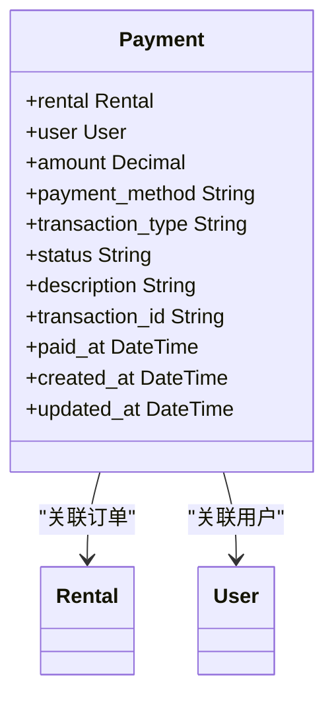

# 手动退款处理

<cite>
**本文档引用文件**   
- [models.py](file://code/car_rental_system/accounts/models.py#L147-L250)
- [views.py](file://code/car_rental_system/accounts/views.py#L1027-L1091)
- [rental_cancel.py](file://code/car_rental_system/rentals/views.py#L395-L466)
- [rental_detail.html](file://code/car_rental_system/templates/rentals/rental_detail.html#L1-L200)
- [order_detail.html](file://code/car_rental_system/templates/accounts/order_detail.html#L1-L200)
</cite>

## 目录
1. [手动退款操作流程](#手动退款操作流程)
2. [Payment模型字段设置逻辑](#payment模型字段设置逻辑)
3. [退款记录生成规则](#退款记录生成规则)
4. [用户权限验证机制](#用户权限验证机制)
5. [操作日志记录实现](#操作日志记录实现)

## 手动退款操作流程

管理员在订单管理界面触发退款的操作流程如下：当管理员在订单详情页面选择取消订单时，系统会通过`rental_cancel`视图函数处理该请求。该函数首先验证订单状态是否允许取消，然后检查是否有已支付金额。如果有已支付金额，系统会创建退款记录并更新订单财务信息。整个流程在数据库事务中执行，确保数据一致性。

**Section sources**
- [views.py](file://code/car_rental_system/rentals/views.py#L395-L466)

## Payment模型字段设置逻辑

在Payment模型中，`status='REFUNDED'`和`transaction_type='REFUND'`字段的设置逻辑如下：当发生退款时，系统会创建一个新的Payment记录，将`transaction_type`字段设置为'REFUND'以区分支付或退款，同时将`status`字段设置为'REFUNDED'表示支付状态。这些字段值在创建退款记录时被硬编码设置，确保了状态的一致性。

**Diagram sources **
- [models.py](file://code/car_rental_system/accounts/models.py#L147-L250)

## 退款记录生成规则

退款记录的描述信息生成规则、交易号格式和支付方式默认值如下：描述信息格式为"订单取消，退还已支付金额 ¥{金额}"，其中金额为实际退款数额。交易号格式遵循"REF+时间戳"的规则，通过`f'REF{int(timezone.now().timestamp())}'`生成。支付方式默认值为'BANK'，表示退款方式为银行卡退款。

**Section sources**
- [views.py](file://code/car_rental_system/rentals/views.py#L435-L440)

## 用户权限验证机制

用户权限验证机制通过Django的装饰器和手动检查实现：在视图函数中使用`@login_required`装饰器确保用户已登录，同时通过检查`request.user.is_staff`来验证用户是否具有管理员权限。在处理敏感操作时，还会验证当前用户是否有权操作特定订单，防止越权访问。

**Section sources**
- [views.py](file://code/car_rental_system/rentals/views.py#L399-L408)

## 操作日志记录实现

操作日志记录通过Django的messages框架和自定义通知系统实现：系统使用`messages.success()`、`messages.error()`等函数向用户显示操作结果。同时，通过创建Notification对象记录重要事件，如订单取消、退款等。这些日志信息存储在数据库中，便于后续审计和查询。

**Section sources**
- [views.py](file://code/car_rental_system/rentals/views.py#L446-L448)