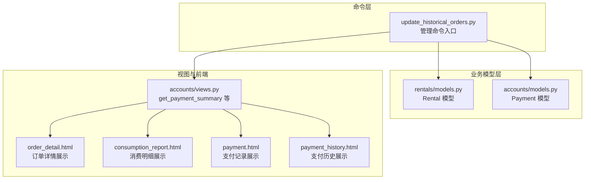
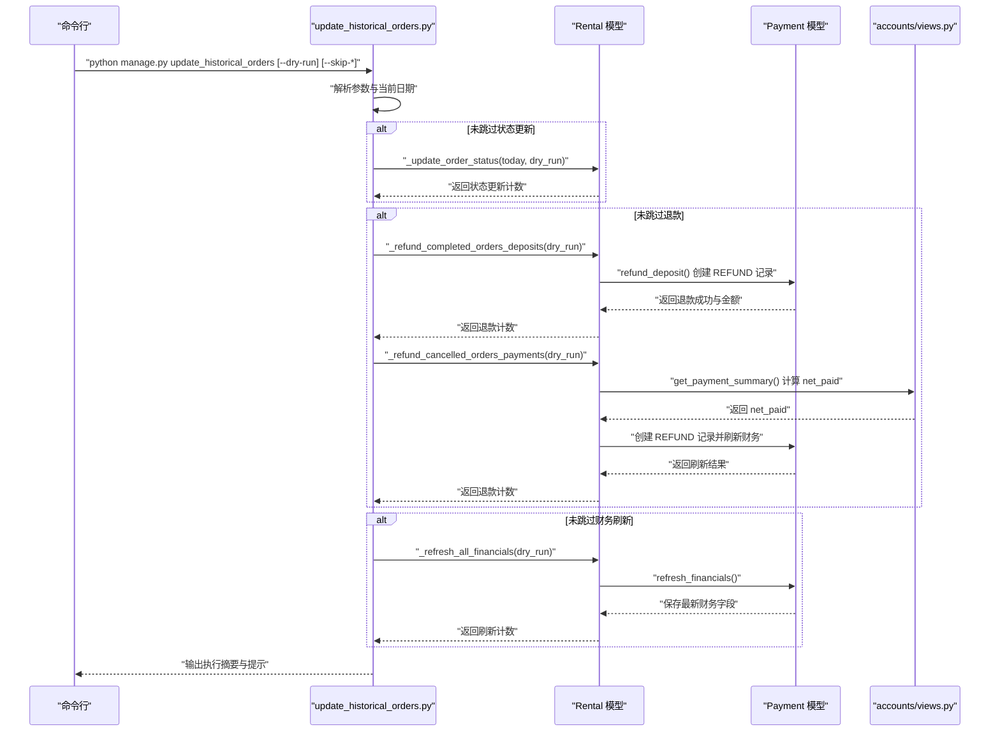
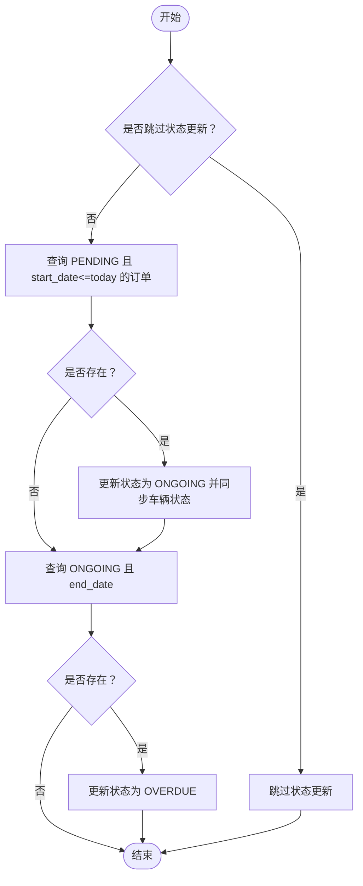
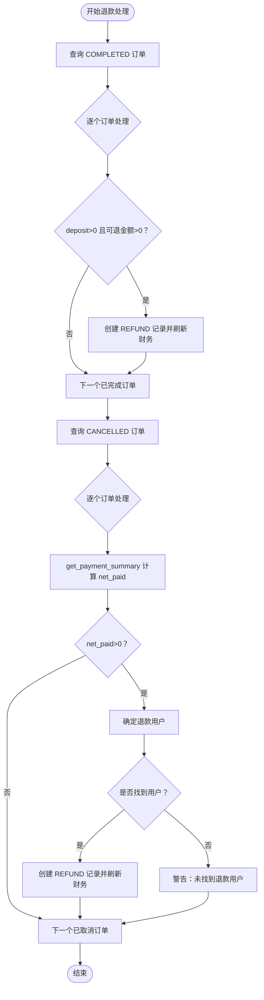
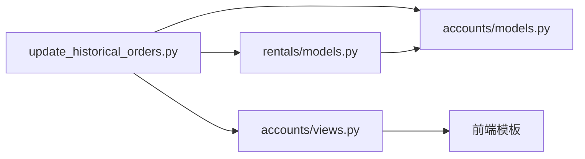

# 批量退款处理

<cite>
**本文引用的文件**
- [update_historical_orders.py](file://code/car_rental_system/rentals/management/commands/update_historical_orders.py)
- [退款信息显示说明.md](file://code/car_rental_system/退款信息显示说明.md)
- [批量更新历史订单说明.md](file://code/car_rental_system/批量更新历史订单说明.md)
- [models.py（订单）](file://code/car_rental_system/rentals/models.py)
- [views.py（账户）](file://code/car_rental_system/accounts/views.py)
- [consumption_report.html（模板）](file://code/car_rental_system/templates/accounts/consumption_report.html)
- [order_detail.html（模板）](file://code/car_rental_system/templates/accounts/order_detail.html)
- [payment.html（模板）](file://code/car_rental_system/templates/accounts/payment.html)
- [payment_history.html（模板）](file://code/car_rental_system/templates/accounts/payment_history.html)
- [0002_payment_extra_fields.py（迁移）](file://code/car_rental_system/accounts/migrations/0002_payment_extra_fields.py)
</cite>

## 目录
1. [简介](#简介)
2. [项目结构](#项目结构)
3. [核心组件](#核心组件)
4. [架构总览](#架构总览)
5. [详细组件分析](#详细组件分析)
6. [依赖关系分析](#依赖关系分析)
7. [性能考量](#性能考量)
8. [故障排查指南](#故障排查指南)
9. [结论](#结论)
10. [附录](#附录)

## 简介
本文件围绕 update_historical_orders 管理命令的批量退款实现进行深入分析，重点说明：
- --dry-run 预览模式与正式执行的区别
- 命令如何遍历历史订单并调用 refund_deposit() 方法
- --skip-status 与 --skip-deposit 对批量处理行为的影响
- 结合“退款信息显示说明”文档，阐述该命令如何解决历史订单财务信息不同步的问题
- 提供实际使用场景与执行建议

## 项目结构
该命令位于 rentals 子应用的 management/commands 下，负责批量更新历史订单的状态、退款与财务信息刷新；同时配合 accounts 子应用的支付模型与视图，确保退款记录与财务数据一致。

图表来源
- [update_historical_orders.py](file://code/car_rental_system/rentals/management/commands/update_historical_orders.py#L1-L311)
- [models.py（订单）](file://code/car_rental_system/rentals/models.py#L290-L401)
- [views.py（账户）](file://code/car_rental_system/accounts/views.py#L243-L268)

章节来源
- [update_historical_orders.py](file://code/car_rental_system/rentals/management/commands/update_historical_orders.py#L1-L311)
- [批量更新历史订单说明.md](file://code/car_rental_system/批量更新历史订单说明.md#L1-L195)

## 核心组件
- 管理命令 update_historical_orders：提供 --dry-run、--skip-status、--skip-deposit、--skip-financials 四个参数，按阶段执行订单状态更新、退款处理与财务信息刷新。
- Rental 模型：
  - refund_deposit(user=None)：为已完成订单退还押金，创建 REFUND 类型的 Payment 记录并刷新财务信息。
  - refresh_financials(save=True)：基于 CHARGE/REFUND 支付记录重算 amount_paid、amount_refunded、settlement_status、settled_at。
- accounts.views 中的 get_payment_summary：计算 paid_amount、refunded_amount、net_paid 等关键财务指标。
- 前端模板：展示 REFUND 类型的支付记录与退款金额，确保用户侧可见退款结果。

章节来源
- [update_historical_orders.py](file://code/car_rental_system/rentals/management/commands/update_historical_orders.py#L1-L311)
- [models.py（订单）](file://code/car_rental_system/rentals/models.py#L290-L401)
- [views.py（账户）](file://code/car_rental_system/accounts/views.py#L243-L268)
- [退款信息显示说明.md](file://code/car_rental_system/退款信息显示说明.md#L1-L124)

## 架构总览
命令执行流程分为三个阶段，每个阶段均可通过参数选择性跳过。命令在预览模式下不写入数据库，仅输出将要执行的操作；正式执行时使用事务保证数据一致性。

图表来源
- [update_historical_orders.py](file://code/car_rental_system/rentals/management/commands/update_historical_orders.py#L35-L310)
- [models.py（订单）](file://code/car_rental_system/rentals/models.py#L290-L401)
- [views.py（账户）](file://code/car_rental_system/accounts/views.py#L243-L268)

## 详细组件分析

### 命令参数与控制流
- --dry-run：预览模式，不实际修改数据，仅输出将要执行的操作与影响范围。
- --skip-status：跳过订单状态更新（PENDING→ONGOING、ONGOING→OVERDUE）。
- --skip-deposit：跳过退款处理（已完成订单押金与已取消订单已支付金额）。
- --skip-financials：跳过财务信息刷新（amount_paid、amount_refunded、settlement_status、settled_at）。

章节来源
- [update_historical_orders.py](file://code/car_rental_system/rentals/management/commands/update_historical_orders.py#L13-L34)
- [批量更新历史订单说明.md](file://code/car_rental_system/批量更新历史订单说明.md#L59-L67)

### 预览模式与正式执行的区别
- 预览模式：
  - 不进入数据库写入分支，直接统计将要处理的数量并输出预览信息。
  - 对已完成订单的押金退款，通过查询 REFUND 已退款金额计算可退余额。
  - 对已取消订单的已支付金额，通过 get_payment_summary 计算 net_paid 并输出预览。
- 正式执行：
  - 使用事务包裹状态更新与退款操作，确保原子性。
  - 调用 Rental.refund_deposit() 创建 REFUND 记录并刷新财务。
  - 对已取消订单，创建 REFUND 记录并调用 refresh_financials。

章节来源
- [update_historical_orders.py](file://code/car_rental_system/rentals/management/commands/update_historical_orders.py#L47-L95)
- [update_historical_orders.py](file://code/car_rental_system/rentals/management/commands/update_historical_orders.py#L167-L211)
- [update_historical_orders.py](file://code/car_rental_system/rentals/management/commands/update_historical_orders.py#L213-L284)
- [update_historical_orders.py](file://code/car_rental_system/rentals/management/commands/update_historical_orders.py#L286-L310)

### 遍历历史订单与状态更新
- PENDING→ONGOING：筛选 start_date≤today 的订单，批量更新状态并同步车辆状态为 RENTED。
- ONGOING→OVERDUE：筛选 end_date<today 的订单，批量更新状态为 OVERDUE。
- 两种状态更新均支持 --skip-status 跳过。

图表来源
- [update_historical_orders.py](file://code/car_rental_system/rentals/management/commands/update_historical_orders.py#L96-L165)

章节来源
- [update_historical_orders.py](file://code/car_rental_system/rentals/management/commands/update_historical_orders.py#L96-L165)

### 退款处理：已完成订单押金与已取消订单已支付金额
- 已完成订单押金退款：
  - 条件：订单状态为 COMPLETED 且 deposit>0。
  - 逻辑：计算可退金额=deposit−∑(REFUND, status=REFUNDED)，若>0则创建 REFUND 记录并刷新财务。
  - 预览：统计可退金额并输出预览条目。
- 已取消订单已支付金额退款：
  - 条件：订单状态为 CANCELLED。
  - 逻辑：通过 get_payment_summary 计算 net_paid=paid−refunded，若>0则创建 REFUND 记录并刷新财务。
  - 预览：输出将要退还的 net_paid。
- 退款用户来源：优先取 CHARGE 且 status=PAID 的第一条支付记录的用户，否则回退到客户关联用户；若仍无用户则跳过退款。

图表来源
- [update_historical_orders.py](file://code/car_rental_system/rentals/management/commands/update_historical_orders.py#L167-L284)
- [models.py（订单）](file://code/car_rental_system/rentals/models.py#L333-L393)
- [views.py（账户）](file://code/car_rental_system/accounts/views.py#L243-L268)

章节来源
- [update_historical_orders.py](file://code/car_rental_system/rentals/management/commands/update_historical_orders.py#L167-L284)
- [models.py（订单）](file://code/car_rental_system/rentals/models.py#L333-L393)
- [views.py（账户）](file://code/car_rental_system/accounts/views.py#L243-L268)

### 财务信息刷新
- 刷新范围：对所有订单执行 refresh_financials。
- 刷新内容：重算 amount_paid、amount_refunded；根据订单总金额与已支付金额更新 settlement_status 与 settled_at。
- 预览：输出将要刷新的订单数量并标记为预览。

章节来源
- [update_historical_orders.py](file://code/car_rental_system/rentals/management/commands/update_historical_orders.py#L286-L310)
- [models.py（订单）](file://code/car_rental_system/rentals/models.py#L296-L331)

### 退款信息显示与验证
- 退款记录类型为 REFUND，状态为 REFUNDED，金额为负值显示。
- 订单详情与消费明细页面会展示 REFUND 记录与已退款金额。
- 若历史订单财务信息未刷新，可通过批量更新命令或页面自动刷新解决。

章节来源
- [退款信息显示说明.md](file://code/car_rental_system/退款信息显示说明.md#L1-L124)
- [order_detail.html（模板）](file://code/car_rental_system/templates/accounts/order_detail.html#L364-L391)
- [consumption_report.html（模板）](file://code/car_rental_system/templates/accounts/consumption_report.html#L118-L142)
- [payment.html（模板）](file://code/car_rental_system/templates/accounts/payment.html#L185-L223)
- [payment_history.html（模板）](file://code/car_rental_system/templates/accounts/payment_history.html#L34-L54)
- [0002_payment_extra_fields.py（迁移）](file://code/car_rental_system/accounts/migrations/0002_payment_extra_fields.py#L1-L40)

## 依赖关系分析
- 命令依赖 Rental 模型的 refund_deposit() 与 refresh_financials()。
- 命令依赖 accounts.views.get_payment_summary() 计算已支付与已退款差额。
- 命令依赖 accounts.models.Payment 模型创建 REFUND 记录。
- 前端模板依赖支付记录的 transaction_type 与 status 字段渲染退款信息。

图表来源
- [update_historical_orders.py](file://code/car_rental_system/rentals/management/commands/update_historical_orders.py#L1-L311)
- [models.py（订单）](file://code/car_rental_system/rentals/models.py#L290-L401)
- [views.py（账户）](file://code/car_rental_system/accounts/views.py#L243-L268)

章节来源
- [update_historical_orders.py](file://code/car_rental_system/rentals/management/commands/update_historical_orders.py#L1-L311)
- [models.py（订单）](file://code/car_rental_system/rentals/models.py#L290-L401)
- [views.py（账户）](file://code/car_rental_system/accounts/views.py#L243-L268)

## 性能考量
- 大订单量下的遍历与聚合：
  - 状态更新与财务刷新采用全表扫描，建议在低峰时段执行。
  - 退款处理涉及多次聚合查询（REFUND 已退款金额、CHARGE 已支付金额），建议在生产环境开启数据库索引与缓存策略。
- 事务与并发：
  - 状态更新与退款处理使用事务包裹，避免中间态数据不一致。
  - 建议在执行前备份数据库，防止大规模退款导致的潜在风险。
- 预览模式：
  - --dry-run 不写入数据库，适合在正式执行前评估影响范围与数量。

章节来源
- [批量更新历史订单说明.md](file://code/car_rental_system/批量更新历史订单说明.md#L148-L164)

## 故障排查指南
- 未显示退款记录：
  - 检查是否执行过批量更新命令或页面自动刷新。
  - 确认订单状态为 COMPLETED 或 CANCELLED，且存在可退金额。
- 退款用户缺失：
  - refund_deposit() 会优先从 CHARGE 记录中获取用户，其次使用客户关联用户；若均无用户则跳过退款。
- 财务信息未刷新：
  - 执行 refresh_financials 后，订单详情与消费明细应显示最新金额。
- 预览与实际差异：
  - --dry-run 仅输出预览，不创建退款记录；正式执行才会写入数据库。

章节来源
- [退款信息显示说明.md](file://code/car_rental_system/退款信息显示说明.md#L60-L124)
- [models.py（订单）](file://code/car_rental_system/rentals/models.py#L333-L393)

## 结论
update_historical_orders 管理命令通过“预览—执行”的双阶段机制，安全地批量修复历史订单的财务信息不同步问题。其核心在于：
- 使用 --dry-run 降低风险，提前评估影响范围；
- 通过 refund_deposit() 与 get_payment_summary() 精准计算可退金额并创建 REFUND 记录；
- 通过 refresh_financials() 统一刷新财务字段，确保前端展示准确；
- 通过 --skip-* 参数灵活拆分任务，满足不同维护场景。

## 附录

### 实际使用场景与执行建议
- 首次执行（大量历史订单）：
  - 先执行预览：确认将要处理的订单数量与退款金额。
  - 正式执行：在低峰时段执行完整更新。
- 分步执行（大体量系统）：
  - 第一步：仅更新状态（--skip-deposit --skip-financials）。
  - 第二步：仅退还押金（--skip-status --skip-financials）。
  - 第三步：仅刷新财务信息（--skip-status --skip-deposit）。
- 定期维护（可选）：
  - 仅刷新财务信息，避免重复退款与状态变更。

章节来源
- [批量更新历史订单说明.md](file://code/car_rental_system/批量更新历史订单说明.md#L171-L195)