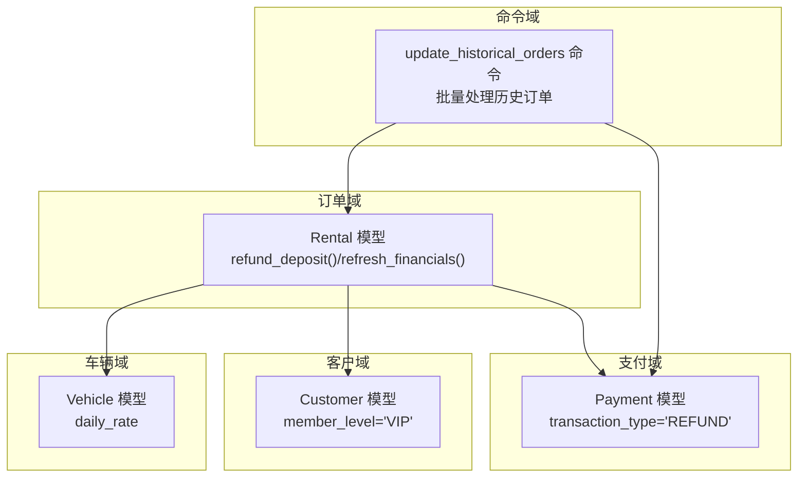
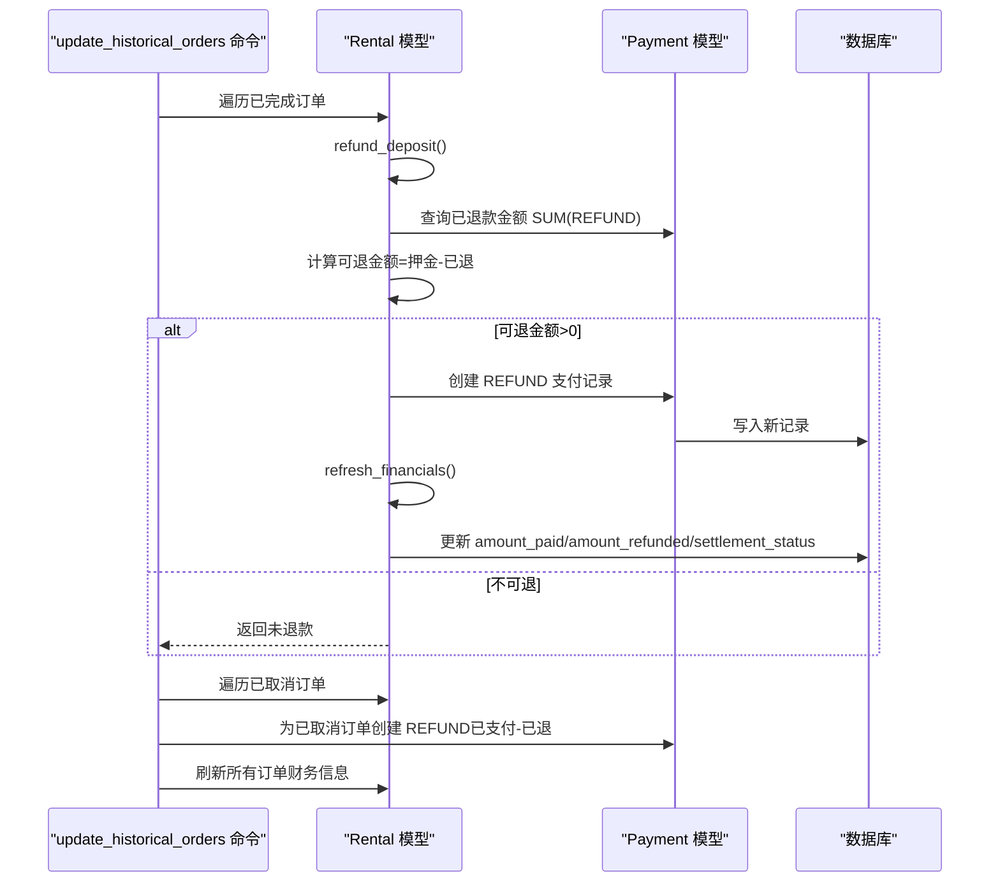
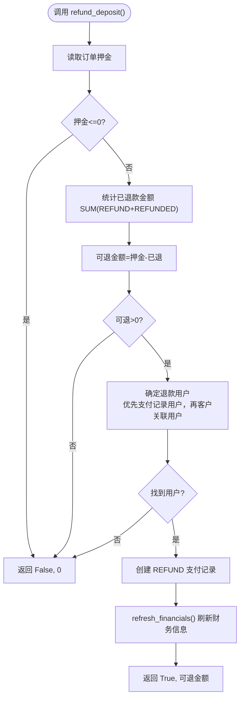
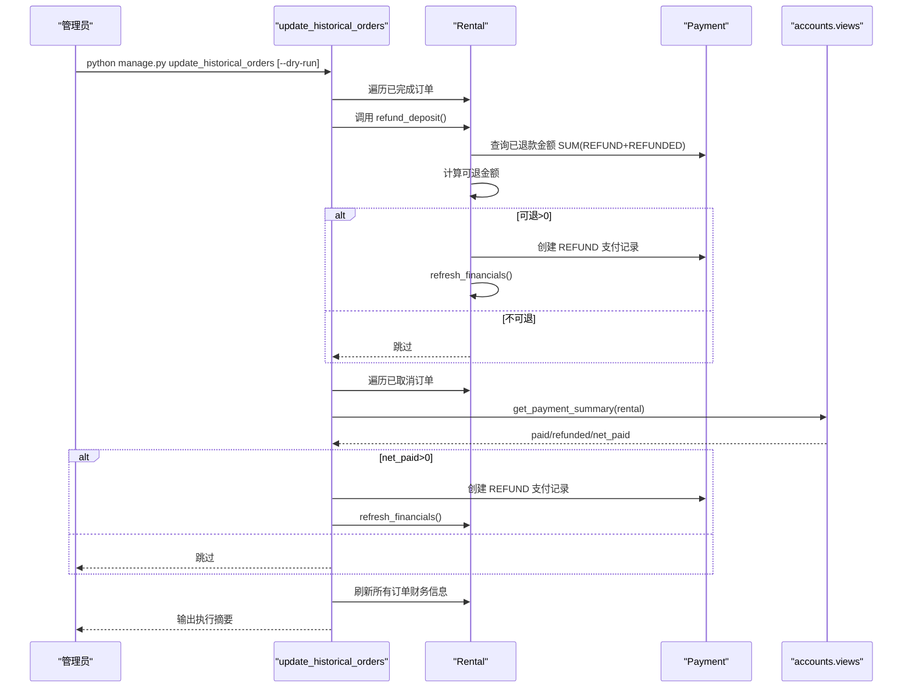
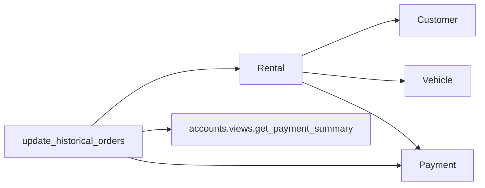

# 自动退款流程

<cite>
**本文引用的文件**
- [rentals/models.py](file://code/car_rental_system/rentals/models.py)
- [accounts/models.py](file://code/car_rental_system/accounts/models.py)
- [rentals/management/commands/update_historical_orders.py](file://code/car_rental_system/rentals/management/commands/update_historical_orders.py)
- [customers/models.py](file://code/car_rental_system/customers/models.py)
- [vehicles/models.py](file://code/car_rental_system/vehicles/models.py)
- [accounts/views.py](file://code/car_rental_system/accounts/views.py)
- [退款信息显示说明.md](file://code/car_rental_system/退款信息显示说明.md)
</cite>

## 目录
1. [简介](#简介)
2. [项目结构](#项目结构)
3. [核心组件](#核心组件)
4. [架构总览](#架构总览)
5. [详细组件分析](#详细组件分析)
6. [依赖关系分析](#依赖关系分析)
7. [性能考量](#性能考量)
8. [故障排查指南](#故障排查指南)
9. [结论](#结论)
10. [附录](#附录)

## 简介
本文件围绕系统如何通过 Rental 模型的 refund_deposit() 方法实现“自动退款”展开，重点解释：
- 如何检查订单押金与已退款金额，并创建新的退款支付记录；
- 结合 update_historical_orders 管理命令，描述批量处理历史订单时自动触发退款的完整流程；
- VIP 会员免押金政策对退款逻辑的影响；
- 退款金额计算规则：可退金额 = 押金 - 已退金额；
- 提供代码示例路径，展示 transaction_type='REFUND' 的 Payment 对象创建过程。

## 项目结构
围绕退款流程的关键模块与文件如下：
- 订单模型与退款逻辑：rentals/models.py 中的 Rental 模型及其 refund_deposit()/refresh_financials() 方法
- 支付记录模型：accounts/models.py 中的 Payment 模型（交易类型、状态、金额等字段）
- 历史订单批量处理命令：rentals/management/commands/update_historical_orders.py
- 客户与会员等级：customers/models.py 中的 Customer 模型（含会员等级）
- 车辆与日租金：vehicles/models.py（影响押金计算）
- 退款信息显示说明：退款信息显示说明.md（常见问题与验证指引）

图表来源
- [rentals/models.py](file://code/car_rental_system/rentals/models.py#L246-L401)
- [accounts/models.py](file://code/car_rental_system/accounts/models.py#L147-L248)
- [rentals/management/commands/update_historical_orders.py](file://code/car_rental_system/rentals/management/commands/update_historical_orders.py#L1-L311)
- [customers/models.py](file://code/car_rental_system/customers/models.py#L1-L160)
- [vehicles/models.py](file://code/car_rental_system/vehicles/models.py#L1-L85)

章节来源
- [rentals/models.py](file://code/car_rental_system/rentals/models.py#L246-L401)
- [accounts/models.py](file://code/car_rental_system/accounts/models.py#L147-L248)
- [rentals/management/commands/update_historical_orders.py](file://code/car_rental_system/rentals/management/commands/update_historical_orders.py#L1-L311)
- [customers/models.py](file://code/car_rental_system/customers/models.py#L1-L160)
- [vehicles/models.py](file://code/car_rental_system/vehicles/models.py#L1-L85)

## 核心组件
- Rental 模型
  - 保存时根据客户会员等级与日租金动态设置押金；提供 refund_deposit() 与 refresh_financials() 两个关键方法
- Payment 模型
  - 维护交易类型（CHARGE/REFUND）、状态（PENDING/PAID/FAILED/REFUNDED）、金额与用户等字段
- update_historical_orders 管理命令
  - 批量更新历史订单状态、退还已完成订单押金、退还已取消订单已支付金额、刷新所有订单财务信息
- Customer/Vehicle 模型
  - 影响押金策略与订单金额构成

章节来源
- [rentals/models.py](file://code/car_rental_system/rentals/models.py#L246-L401)
- [accounts/models.py](file://code/car_rental_system/accounts/models.py#L147-L248)
- [rentals/management/commands/update_historical_orders.py](file://code/car_rental_system/rentals/management/commands/update_historical_orders.py#L1-L311)
- [customers/models.py](file://code/car_rental_system/customers/models.py#L1-L160)
- [vehicles/models.py](file://code/car_rental_system/vehicles/models.py#L1-L85)

## 架构总览
自动退款的整体流程由“订单状态驱动 + 命令批量处理 + 单笔退款创建 + 财务刷新”组成。VIP 会员免押金直接影响押金值与退款触发条件。

图表来源
- [rentals/management/commands/update_historical_orders.py](file://code/car_rental_system/rentals/management/commands/update_historical_orders.py#L167-L211)
- [rentals/management/commands/update_historical_orders.py](file://code/car_rental_system/rentals/management/commands/update_historical_orders.py#L213-L284)
- [rentals/management/commands/update_historical_orders.py](file://code/car_rental_system/rentals/management/commands/update_historical_orders.py#L286-L310)
- [rentals/models.py](file://code/car_rental_system/rentals/models.py#L334-L394)
- [accounts/models.py](file://code/car_rental_system/accounts/models.py#L147-L248)

## 详细组件分析

### Rental 模型：押金与退款逻辑
- 押金策略
  - VIP 客户免押金：当客户会员等级为 VIP 时，订单押金直接设为 0
  - 普通客户默认押金：若未设置押金，则按日租金的固定倍数计算
- 退款入口：refund_deposit()
  - 输入：可选退款用户
  - 步骤：
    1) 读取订单押金
    2) 查询已退款金额（按 REFUND+REFUNDED 统计）
    3) 计算可退金额=押金-已退
    4) 若可退>0，确定退款用户（优先支付记录中的用户，其次客户关联用户）
    5) 创建一条 transaction_type='REFUND'、status='REFUNDED' 的 Payment 记录
    6) 调用 refresh_financials() 刷新累计支付/退款与结算状态
- 财务刷新：refresh_financials()
  - 统计 CHARGE+PAID 的累计支付与 REFUND+REFUNDED 的累计退款
  - 根据应付总额与已支付情况更新结算状态与结算时间

图表来源
- [rentals/models.py](file://code/car_rental_system/rentals/models.py#L334-L394)
- [rentals/models.py](file://code/car_rental_system/rentals/models.py#L296-L333)

章节来源
- [rentals/models.py](file://code/car_rental_system/rentals/models.py#L246-L272)
- [rentals/models.py](file://code/car_rental_system/rentals/models.py#L286-L295)
- [rentals/models.py](file://code/car_rental_system/rentals/models.py#L296-L333)
- [rentals/models.py](file://code/car_rental_system/rentals/models.py#L334-L394)

### Payment 模型：退款记录的数据结构
- 关键字段
  - transaction_type：区分 CHARGE/REFUND
  - status：PENDING/PAID/FAILED/REFUNDED
  - amount：退款金额
  - user/rental：关联用户与订单
  - description/paid_at/transaction_id：退款说明、发生时间与交易号
- 退款记录创建
  - transaction_type='REFUND'
  - status='REFUNDED'
  - amount=可退金额
  - user=退款用户
  - paid_at=当前时间
  - transaction_id=以 REF+时间戳生成

章节来源
- [accounts/models.py](file://code/car_rental_system/accounts/models.py#L147-L248)

### 历史订单批量处理命令：自动触发退款
- 功能概览
  - 更新订单状态：PENDING→ONGOING、ONGOING→OVERDUE
  - 退还已完成订单押金：调用 rental.refund_deposit()
  - 退还已取消订单已支付金额：基于支付汇总 net_paid=paid-refunded
  - 刷新所有订单财务信息：调用 rental.refresh_financials()
- 关键点
  - 预览模式：--dry-run 不写入数据库，仅输出将要执行的操作
  - 分步开关：--skip-status/--skip-deposit/--skip-financials 控制执行范围
  - 已取消订单退款：通过 accounts.views.get_payment_summary() 计算 paid/refunded/net_paid 后创建 REFUND

图表来源
- [rentals/management/commands/update_historical_orders.py](file://code/car_rental_system/rentals/management/commands/update_historical_orders.py#L1-L311)
- [accounts/views.py](file://code/car_rental_system/accounts/views.py#L243-L268)

章节来源
- [rentals/management/commands/update_historical_orders.py](file://code/car_rental_system/rentals/management/commands/update_historical_orders.py#L1-L311)
- [accounts/views.py](file://code/car_rental_system/accounts/views.py#L243-L268)

### VIP 会员免押金政策对退款逻辑的影响
- 押金策略
  - 当客户会员等级为 VIP 时，订单押金直接为 0，因此不会产生押金退款
- 业务影响
  - refund_deposit() 在押金为 0 时直接返回未退款
  - 历史订单批量处理命令对 VIP 订单不会创建押金退款记录
- 例外场景
  - 若历史订单曾因其他原因产生过押金并已退款，后续仍按“可退金额=押金-已退”规则处理

章节来源
- [rentals/models.py](file://code/car_rental_system/rentals/models.py#L253-L259)
- [customers/models.py](file://code/car_rental_system/customers/models.py#L1-L160)

### 退款金额计算规则与示例路径
- 计算规则
  - 可退金额 = 订单押金 - 已退还金额（REFUND+REFUNDED）
- 示例路径（展示 transaction_type='REFUND' 的 Payment 对象创建过程）
  - 单笔退款入口：[refund_deposit()](file://code/car_rental_system/rentals/models.py#L334-L394)
  - 批量退款入口（已完成订单）：[_refund_completed_orders_deposits()](file://code/car_rental_system/rentals/management/commands/update_historical_orders.py#L167-L211)
  - 批量退款入口（已取消订单）：[_refund_cancelled_orders_payments()](file://code/car_rental_system/rentals/management/commands/update_historical_orders.py#L213-L284)
  - 支付汇总（已取消订单退款依据）：[get_payment_summary()](file://code/car_rental_system/accounts/views.py#L243-L268)

章节来源
- [rentals/models.py](file://code/car_rental_system/rentals/models.py#L334-L394)
- [rentals/management/commands/update_historical_orders.py](file://code/car_rental_system/rentals/management/commands/update_historical_orders.py#L167-L211)
- [rentals/management/commands/update_historical_orders.py](file://code/car_rental_system/rentals/management/commands/update_historical_orders.py#L213-L284)
- [accounts/views.py](file://code/car_rental_system/accounts/views.py#L243-L268)

## 依赖关系分析
- Rental 依赖
  - Customer：决定是否免押金
  - Vehicle：决定日租金与默认押金
  - Payment：创建退款记录与统计已退款金额
- 命令依赖
  - Rental：批量调用 refund_deposit()/refresh_financials()
  - Payment：批量创建 REFUND 记录
  - accounts.views：为已取消订单计算 net_paid

图表来源
- [rentals/models.py](file://code/car_rental_system/rentals/models.py#L246-L401)
- [accounts/models.py](file://code/car_rental_system/accounts/models.py#L147-L248)
- [rentals/management/commands/update_historical_orders.py](file://code/car_rental_system/rentals/management/commands/update_historical_orders.py#L1-L311)
- [accounts/views.py](file://code/car_rental_system/accounts/views.py#L243-L268)

章节来源
- [rentals/models.py](file://code/car_rental_system/rentals/models.py#L246-L401)
- [accounts/models.py](file://code/car_rental_system/accounts/models.py#L147-L248)
- [rentals/management/commands/update_historical_orders.py](file://code/car_rental_system/rentals/management/commands/update_historical_orders.py#L1-L311)
- [accounts/views.py](file://code/car_rental_system/accounts/views.py#L243-L268)

## 性能考量
- 批量事务与原子性
  - 命令内部使用事务包裹，减少锁竞争与回滚风险
- 缓存与频率控制
  - 自动更新订单状态时使用缓存，避免频繁更新
- 查询优化
  - 财务刷新与退款统计使用聚合查询，避免逐条遍历
- 建议
  - 大批量历史订单处理建议先使用 --dry-run 预览
  - 对于超大订单集，分批执行或在低峰时段运行

章节来源
- [rentals/models.py](file://code/car_rental_system/rentals/models.py#L171-L229)
- [rentals/management/commands/update_historical_orders.py](file://code/car_rental_system/rentals/management/commands/update_historical_orders.py#L96-L165)

## 故障排查指南
- 常见问题与解决
  - 历史订单没有退款记录：执行批量更新命令，或手动刷新财务信息
  - 退款金额不正确：检查押金与已退金额是否正确统计
  - 批量更新后仍无显示：确认订单状态为已完成且有用户账号关联
- 验证要点
  - 订单详情页：查看“已退款金额”与支付记录中的“退款”类型
  - 消费明细页：查看“已退款”金额与退款流水
- 参考说明文档
  - [退款信息显示说明.md](file://code/car_rental_system/退款信息显示说明.md#L1-L124)

章节来源
- [退款信息显示说明.md](file://code/car_rental_system/退款信息显示说明.md#L1-L124)

## 结论
系统通过 Rental 的 refund_deposit() 与 Payment 的 REFUND 记录，实现了“可退金额=押金-已退”的精准退款；配合 update_historical_orders 管理命令，可在历史订单上批量触发退款并刷新财务信息。VIP 会员免押金政策使 VIP 订单不产生押金退款，但仍遵循“可退金额=押金-已退”的统一计算规则。对于已取消订单，系统通过支付汇总 net_paid=paid-refunded 自动创建退款记录，确保账目一致。

## 附录
- 退款金额计算公式
  - 可退金额 = 订单押金 - 已退还金额（REFUND+REFUNDED）
- 退款记录字段要点
  - transaction_type='REFUND'
  - status='REFUNDED'
  - amount=可退金额
  - user=退款用户
  - paid_at=当前时间
  - transaction_id=以 REF+时间戳生成