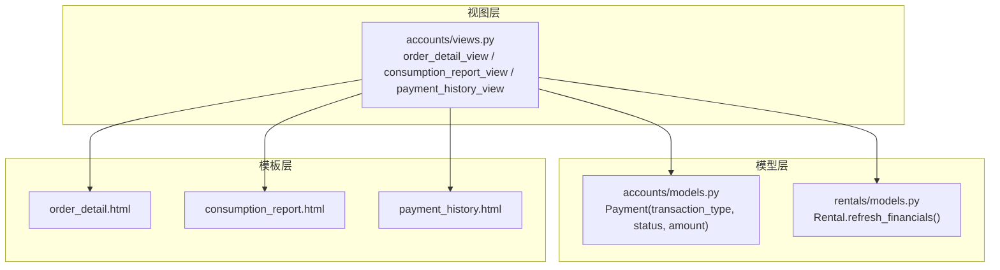
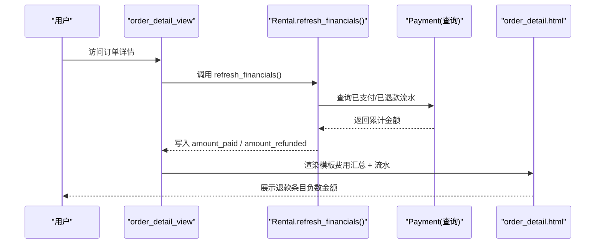
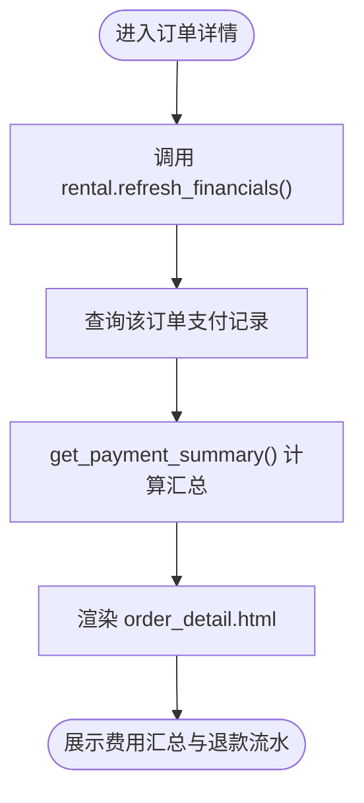
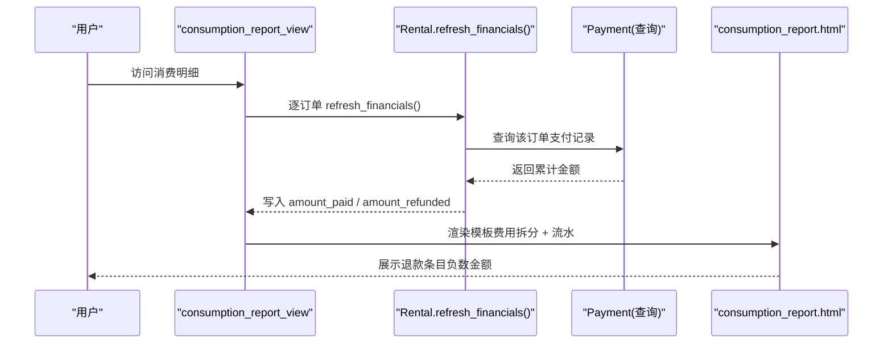
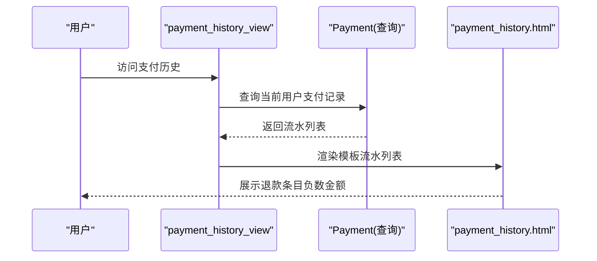
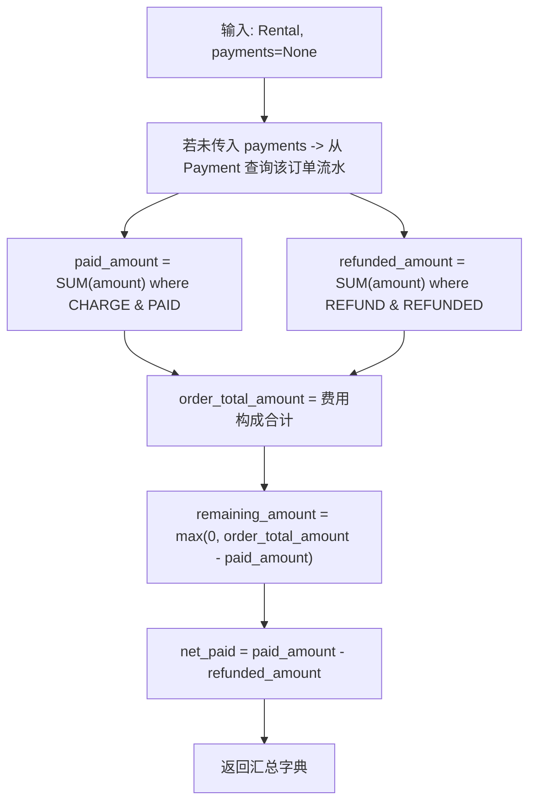
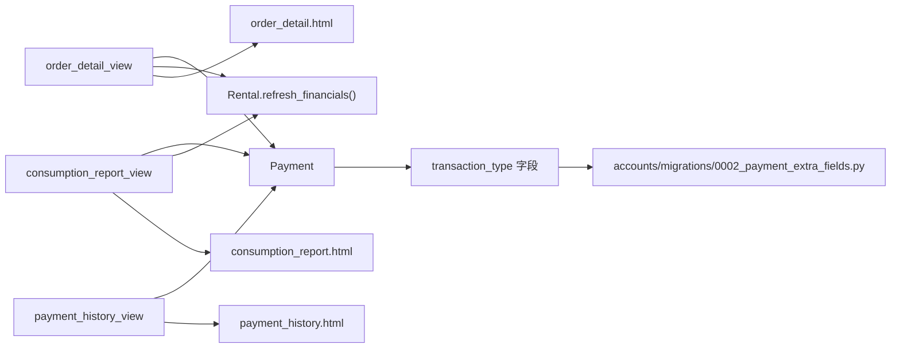

# 退款信息展示机制

<cite>
**本文引用的文件**
- [accounts/models.py](file://code/car_rental_system/accounts/models.py)
- [accounts/views.py](file://code/car_rental_system/accounts/views.py)
- [accounts/urls.py](file://code/car_rental_system/accounts/urls.py)
- [accounts/templates/order_detail.html](file://code/car_rental_system/templates/accounts/order_detail.html)
- [accounts/templates/payment_history.html](file://code/car_rental_system/templates/accounts/payment_history.html)
- [accounts/templates/consumption_report.html](file://code/car_rental_system/templates/accounts/consumption_report.html)
- [rentals/models.py](file://code/car_rental_system/rentals/models.py)
- [accounts/migrations/0002_payment_extra_fields.py](file://code/car_rental_system/accounts/migrations/0002_payment_extra_fields.py)
</cite>

## 目录
1. [引言](#引言)
2. [项目结构](#项目结构)
3. [核心组件](#核心组件)
4. [架构概览](#架构概览)
5. [详细组件分析](#详细组件分析)
6. [依赖关系分析](#依赖关系分析)
7. [性能考量](#性能考量)
8. [故障排查指南](#故障排查指南)
9. [结论](#结论)

## 引言
本文件聚焦“退款信息在前端的展示逻辑”，涵盖以下要点：
- 订单详情页与消费明细页的数据展示方式
- 每次访问订单详情时系统如何自动调用 refresh_financials() 同步财务数据
- 支付记录列表中退款条目的呈现形式（负数金额、'退款'类型标识）
- 已退款金额的汇总计算逻辑
- 如何通过 Payment 模型的 transaction_type 字段过滤显示退款流水

## 项目结构
围绕退款信息展示的相关模块与模板如下：
- 视图层：订单详情、消费明细、支付历史等视图负责组装上下文并渲染模板
- 模型层：Payment 模型提供交易类型、状态、金额等字段；Rental 模型提供 refresh_financials() 用于刷新累计支付/退款
- 模板层：订单详情页、消费明细页、支付历史页分别展示费用汇总、流水明细与退款标识

图表来源
- [accounts/views.py](file://code/car_rental_system/accounts/views.py#L854-L903)
- [accounts/views.py](file://code/car_rental_system/accounts/views.py#L1390-L1422)
- [accounts/views.py](file://code/car_rental_system/accounts/views.py#L1366-L1387)
- [accounts/models.py](file://code/car_rental_system/accounts/models.py#L147-L248)
- [rentals/models.py](file://code/car_rental_system/rentals/models.py#L296-L333)
- [accounts/templates/order_detail.html](file://code/car_rental_system/templates/accounts/order_detail.html#L332-L425)
- [accounts/templates/consumption_report.html](file://code/car_rental_system/templates/accounts/consumption_report.html#L1-L154)
- [accounts/templates/payment_history.html](file://code/car_rental_system/templates/accounts/payment_history.html#L1-L56)

章节来源
- [accounts/views.py](file://code/car_rental_system/accounts/views.py#L854-L903)
- [accounts/views.py](file://code/car_rental_system/accounts/views.py#L1390-L1422)
- [accounts/views.py](file://code/car_rental_system/accounts/views.py#L1366-L1387)
- [accounts/models.py](file://code/car_rental_system/accounts/models.py#L147-L248)
- [rentals/models.py](file://code/car_rental_system/rentals/models.py#L296-L333)
- [accounts/templates/order_detail.html](file://code/car_rental_system/templates/accounts/order_detail.html#L332-L425)
- [accounts/templates/consumption_report.html](file://code/car_rental_system/templates/accounts/consumption_report.html#L1-L154)
- [accounts/templates/payment_history.html](file://code/car_rental_system/templates/accounts/payment_history.html#L1-L56)

## 核心组件
- Payment 模型
  - 交易类型：transaction_type 取值为 'CHARGE' 或 'REFUND'
  - 状态：status 取值包含 'PAID'、'REFUNDED' 等
  - 金额：amount 为正数，退款时在前端以负数形式展示
- Rental 模型
  - refresh_financials()：基于支付记录刷新 amount_paid 与 amount_refunded，并据此更新结算状态
- 视图
  - 订单详情：order_detail_view 在渲染前调用 rental.refresh_financials()，并使用 get_payment_summary() 计算汇总
  - 消费明细：consumption_report_view 逐订单刷新财务并聚合流水
  - 支付历史：payment_history_view 展示当前用户的所有支付/退款记录
- 模板
  - 订单详情页：费用汇总区与支付记录表格均展示退款条目
  - 消费明细页：按订单分组展示费用拆分与流水，退款以负数金额呈现
  - 支付历史页：按用户维度展示支付/退款流水，退款以负数金额呈现

章节来源
- [accounts/models.py](file://code/car_rental_system/accounts/models.py#L147-L248)
- [rentals/models.py](file://code/car_rental_system/rentals/models.py#L296-L333)
- [accounts/views.py](file://code/car_rental_system/accounts/views.py#L854-L903)
- [accounts/views.py](file://code/car_rental_system/accounts/views.py#L1390-L1422)
- [accounts/views.py](file://code/car_rental_system/accounts/views.py#L1366-L1387)
- [accounts/templates/order_detail.html](file://code/car_rental_system/templates/accounts/order_detail.html#L332-L425)
- [accounts/templates/consumption_report.html](file://code/car_rental_system/templates/accounts/consumption_report.html#L1-L154)
- [accounts/templates/payment_history.html](file://code/car_rental_system/templates/accounts/payment_history.html#L1-L56)

## 架构概览
退款信息从前端到后端的关键流转如下：
- 订单详情访问路径：URL -> order_detail_view -> 调用 rental.refresh_financials() -> 计算汇总 -> 渲染 order_detail.html
- 消费明细访问路径：URL -> consumption_report_view -> 逐订单 refresh_financials() -> 聚合流水 -> 渲染 consumption_report.html
- 支付历史访问路径：URL -> payment_history_view -> 查询当前用户支付记录 -> 渲染 payment_history.html

图表来源
- [accounts/urls.py](file://code/car_rental_system/accounts/urls.py#L29-L35)
- [accounts/views.py](file://code/car_rental_system/accounts/views.py#L854-L903)
- [rentals/models.py](file://code/car_rental_system/rentals/models.py#L296-L333)
- [accounts/models.py](file://code/car_rental_system/accounts/models.py#L147-L248)
- [accounts/templates/order_detail.html](file://code/car_rental_system/templates/accounts/order_detail.html#L332-L425)

## 详细组件分析

### 订单详情页退款展示
- 费用汇总区
  - 展示应付总额、已支付、已退款、待支付、净支付（已支付 - 已退款）
- 支付记录表格
  - 类型列：使用 get_transaction_type_display() 显示 '支付'/'退款'
  - 金额列：当 transaction_type 为 'REFUND' 时以负数形式展示
  - 状态列：'REFUNDED' 状态以 '已退款' 展示
- 订单详情访问时的财务同步
  - order_detail_view 在渲染前调用 rental.refresh_financials()，确保展示的金额为最新

图表来源
- [accounts/views.py](file://code/car_rental_system/accounts/views.py#L854-L903)
- [accounts/views.py](file://code/car_rental_system/accounts/views.py#L243-L268)
- [accounts/templates/order_detail.html](file://code/car_rental_system/templates/accounts/order_detail.html#L332-L425)

章节来源
- [accounts/views.py](file://code/car_rental_system/accounts/views.py#L854-L903)
- [accounts/views.py](file://code/car_rental_system/accounts/views.py#L243-L268)
- [accounts/templates/order_detail.html](file://code/car_rental_system/templates/accounts/order_detail.html#L332-L425)

### 消费明细页退款展示
- 按订单分组展示费用拆分与流水
- 退款以负数金额呈现，便于直观对比
- 当订单状态为已完成/已取消且存在已退款金额时，会在卡片头部显示“已退还”徽章

图表来源
- [accounts/urls.py](file://code/car_rental_system/accounts/urls.py#L39-L40)
- [accounts/views.py](file://code/car_rental_system/accounts/views.py#L1390-L1422)
- [rentals/models.py](file://code/car_rental_system/rentals/models.py#L296-L333)
- [accounts/models.py](file://code/car_rental_system/accounts/models.py#L147-L248)
- [accounts/templates/consumption_report.html](file://code/car_rental_system/templates/accounts/consumption_report.html#L1-L154)

章节来源
- [accounts/views.py](file://code/car_rental_system/accounts/views.py#L1390-L1422)
- [accounts/templates/consumption_report.html](file://code/car_rental_system/templates/accounts/consumption_report.html#L1-L154)

### 支付历史页退款展示
- 按用户维度展示支付/退款记录
- 退款条目同样以负数金额呈现，类型显示为 '退款'

图表来源
- [accounts/urls.py](file://code/car_rental_system/accounts/urls.py#L37-L39)
- [accounts/views.py](file://code/car_rental_system/accounts/views.py#L1366-L1387)
- [accounts/templates/payment_history.html](file://code/car_rental_system/templates/accounts/payment_history.html#L1-L56)

章节来源
- [accounts/views.py](file://code/car_rental_system/accounts/views.py#L1366-L1387)
- [accounts/templates/payment_history.html](file://code/car_rental_system/templates/accounts/payment_history.html#L1-L56)

### 已退款金额的汇总计算逻辑
- get_payment_summary() 通过聚合查询分别统计：
  - paid_amount：transaction_type='CHARGE' 且 status='PAID' 的金额总和
  - refunded_amount：transaction_type='REFUND' 且 status='REFUNDED' 的金额总和
- net_paid = paid_amount - refunded_amount
- remaining_amount = order_total_amount - paid_amount（若小于0则取0）

图表来源
- [accounts/views.py](file://code/car_rental_system/accounts/views.py#L243-L268)

章节来源
- [accounts/views.py](file://code/car_rental_system/accounts/views.py#L243-L268)

### 通过 transaction_type 过滤显示退款流水
- 订单详情页与消费明细页的支付记录表格均使用 transaction_type 判断：
  - 当 transaction_type 为 'REFUND' 时，金额列以负数形式展示
  - 类型列使用 get_transaction_type_display() 显示 '退款'
- 支付历史页同样依据 transaction_type 展示退款条目

章节来源
- [accounts/templates/order_detail.html](file://code/car_rental_system/templates/accounts/order_detail.html#L389-L414)
- [accounts/templates/consumption_report.html](file://code/car_rental_system/templates/accounts/consumption_report.html#L116-L129)
- [accounts/templates/payment_history.html](file://code/car_rental_system/templates/accounts/payment_history.html#L29-L43)

### 订单详情访问时的财务同步
- 每次访问订单详情时，order_detail_view 会调用 rental.refresh_financials()，确保 amount_paid 与 amount_refunded 与数据库一致
- 该方法内部基于 Payment 聚合查询，计算累计支付与累计退款，并据此更新结算状态

章节来源
- [accounts/views.py](file://code/car_rental_system/accounts/views.py#L854-L903)
- [rentals/models.py](file://code/car_rental_system/rentals/models.py#L296-L333)

## 依赖关系分析
- 订单详情页依赖
  - 视图：order_detail_view
  - 模型：Payment、Rental.refresh_financials()
  - 模板：order_detail.html
- 消费明细页依赖
  - 视图：consumption_report_view
  - 模型：Payment、Rental.refresh_financials()
  - 模板：consumption_report.html
- 支付历史页依赖
  - 视图：payment_history_view
  - 模型：Payment
  - 模板：payment_history.html
- 交易类型字段来源
  - Payment 模型定义 transaction_type 与状态字段
  - 迁移 accounts/migrations/0002_payment_extra_fields.py 添加 transaction_type 字段并建立索引

图表来源
- [accounts/views.py](file://code/car_rental_system/accounts/views.py#L854-L903)
- [accounts/views.py](file://code/car_rental_system/accounts/views.py#L1390-L1422)
- [accounts/views.py](file://code/car_rental_system/accounts/views.py#L1366-L1387)
- [accounts/models.py](file://code/car_rental_system/accounts/models.py#L147-L248)
- [accounts/migrations/0002_payment_extra_fields.py](file://code/car_rental_system/accounts/migrations/0002_payment_extra_fields.py#L1-L42)
- [accounts/templates/order_detail.html](file://code/car_rental_system/templates/accounts/order_detail.html#L332-L425)
- [accounts/templates/consumption_report.html](file://code/car_rental_system/templates/accounts/consumption_report.html#L1-L154)
- [accounts/templates/payment_history.html](file://code/car_rental_system/templates/accounts/payment_history.html#L1-L56)

章节来源
- [accounts/views.py](file://code/car_rental_system/accounts/views.py#L854-L903)
- [accounts/views.py](file://code/car_rental_system/accounts/views.py#L1390-L1422)
- [accounts/views.py](file://code/car_rental_system/accounts/views.py#L1366-L1387)
- [accounts/models.py](file://code/car_rental_system/accounts/models.py#L147-L248)
- [accounts/migrations/0002_payment_extra_fields.py](file://code/car_rental_system/accounts/migrations/0002_payment_extra_fields.py#L1-L42)
- [accounts/templates/order_detail.html](file://code/car_rental_system/templates/accounts/order_detail.html#L332-L425)
- [accounts/templates/consumption_report.html](file://code/car_rental_system/templates/accounts/consumption_report.html#L1-L154)
- [accounts/templates/payment_history.html](file://code/car_rental_system/templates/accounts/payment_history.html#L1-L56)

## 性能考量
- 聚合查询
  - get_payment_summary() 使用聚合查询一次性统计 paid_amount 与 refunded_amount，避免多次数据库往返
- 索引
  - Payment 模型对 transaction_type 建立索引，有利于退款流水的快速过滤与展示
- 财务刷新
  - refresh_financials() 在订单详情与消费明细页调用，确保前端展示的金额为最新，避免陈旧数据导致的误解

章节来源
- [accounts/views.py](file://code/car_rental_system/accounts/views.py#L243-L268)
- [accounts/migrations/0002_payment_extra_fields.py](file://code/car_rental_system/accounts/migrations/0002_payment_extra_fields.py#L36-L40)
- [rentals/models.py](file://code/car_rental_system/rentals/models.py#L296-L333)

## 故障排查指南
- 退款未显示
  - 检查 Payment 是否正确设置 transaction_type='REFUND' 且 status='REFUNDED'
  - 确认模板中对 REFUND 类型的金额列是否以负数展示
- 金额不一致
  - 确认 order_detail_view 与 consumption_report_view 是否在渲染前调用了 rental.refresh_financials()
  - 检查 get_payment_summary() 的聚合逻辑是否覆盖了正确的状态与类型
- 支付历史缺失退款
  - 确认 payment_history_view 是否按用户维度查询 Payment，并未做额外过滤

章节来源
- [accounts/views.py](file://code/car_rental_system/accounts/views.py#L854-L903)
- [accounts/views.py](file://code/car_rental_system/accounts/views.py#L1390-L1422)
- [accounts/views.py](file://code/car_rental_system/accounts/views.py#L1366-L1387)
- [accounts/models.py](file://code/car_rental_system/accounts/models.py#L147-L248)
- [accounts/templates/order_detail.html](file://code/car_rental_system/templates/accounts/order_detail.html#L389-L414)
- [accounts/templates/consumption_report.html](file://code/car_rental_system/templates/accounts/consumption_report.html#L116-L129)
- [accounts/templates/payment_history.html](file://code/car_rental_system/templates/accounts/payment_history.html#L29-L43)

## 结论
- 退款信息在前端以“负数金额 + 类型标识”的方式清晰呈现，便于用户理解已发生退款
- 每次访问订单详情时，系统都会调用 refresh_financials() 保证展示金额的准确性
- 已退款金额的汇总由 get_payment_summary() 基于 Payment 的 transaction_type 与 status 聚合计算
- 消费明细页与支付历史页均遵循相同的退款展示规范，保持用户体验一致性