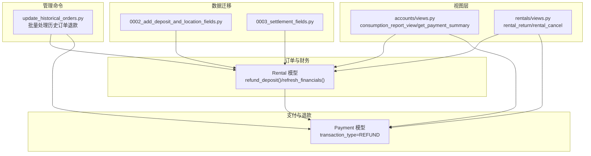
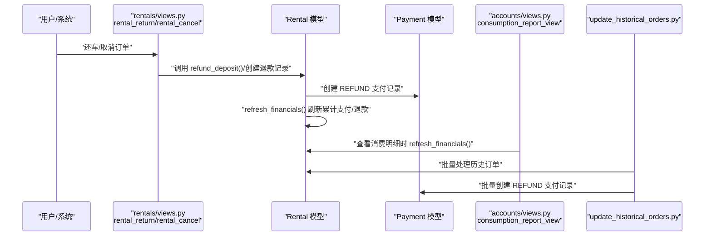
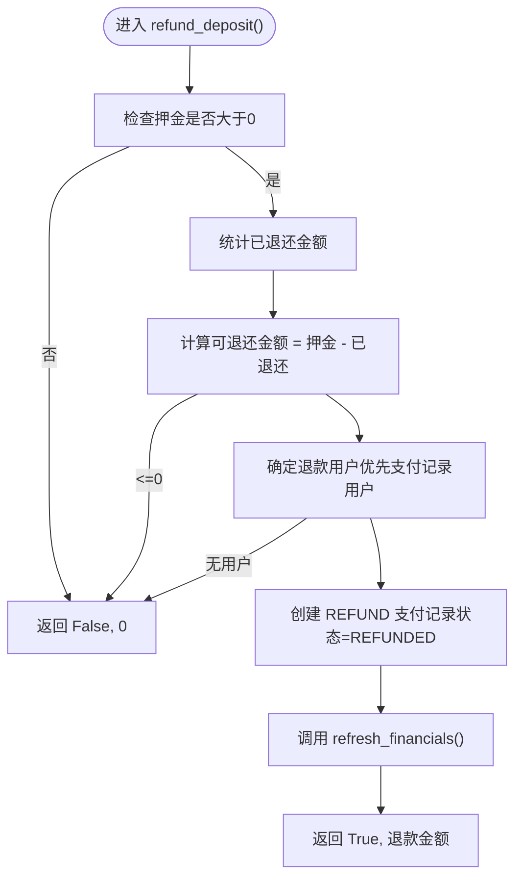
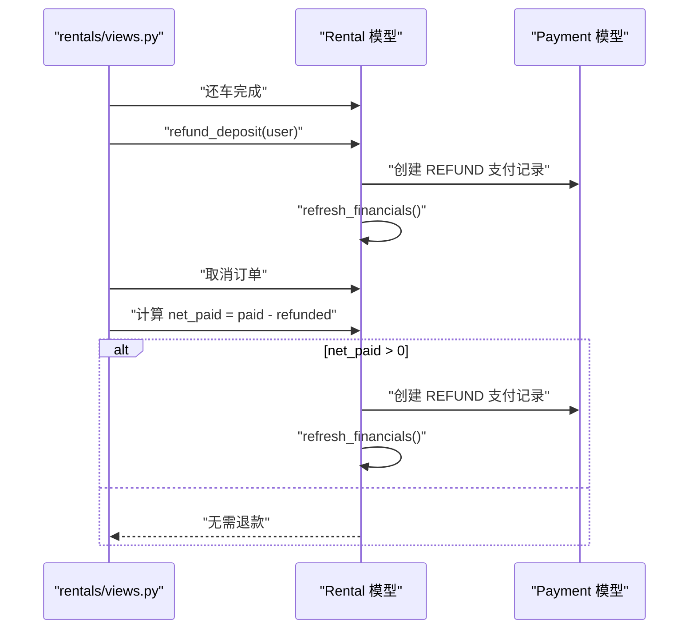
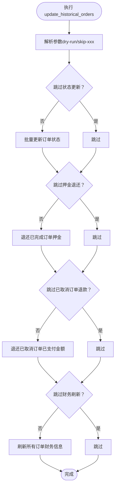
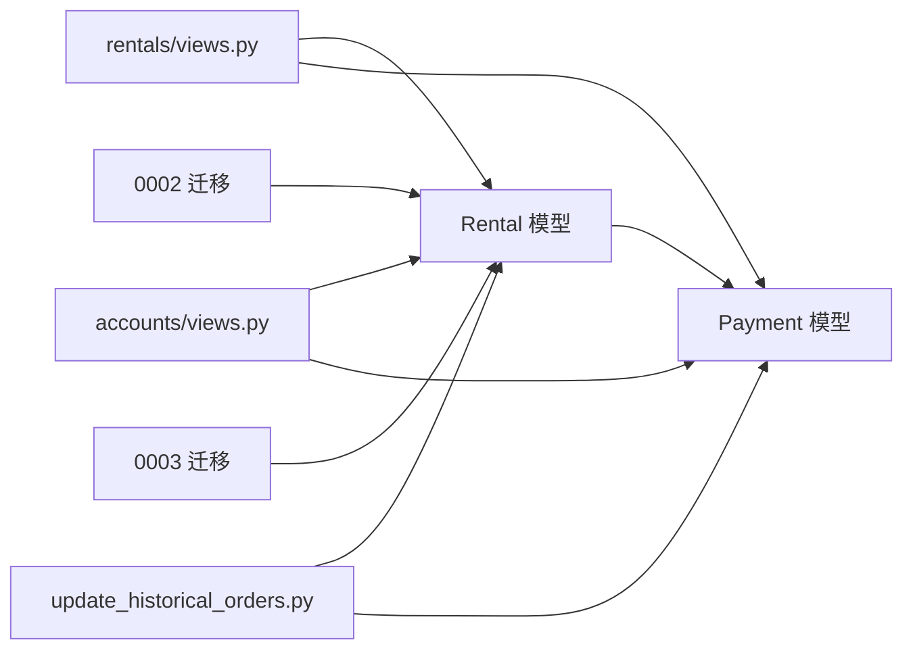

# 退款机制

<cite>
**本文引用的文件**
- [rentals/models.py](file://code/car_rental_system/rentals/models.py)
- [accounts/models.py](file://code/car_rental_system/accounts/models.py)
- [rentals/management/commands/update_historical_orders.py](file://code/car_rental_system/rentals/management/commands/update_historical_orders.py)
- [rentals/migrations/0002_add_deposit_and_location_fields.py](file://code/car_rental_system/rentals/migrations/0002_add_deposit_and_location_fields.py)
- [rentals/migrations/0003_settlement_fields.py](file://code/car_rental_system/rentals/migrations/0003_settlement_fields.py)
- [accounts/views.py](file://code/car_rental_system/accounts/views.py)
- [rentals/views.py](file://code/car_rental_system/rentals/views.py)
- [退款信息显示说明.md](file://code/car_rental_system/退款信息显示说明.md)
</cite>

## 目录
1. [简介](#简介)
2. [项目结构](#项目结构)
3. [核心组件](#核心组件)
4. [架构概览](#架构概览)
5. [详细组件分析](#详细组件分析)
6. [依赖关系分析](#依赖关系分析)
7. [性能考量](#性能考量)
8. [故障排查指南](#故障排查指南)
9. [结论](#结论)

## 简介
本文件深入解析系统的退款机制，覆盖自动退款与手动退款两大场景，并围绕 Payment 模型中 transaction_type 为 REFUND 的处理逻辑展开。重点说明：
- Rental 模型的 refund_deposit() 如何在订单完成或取消时触发退款；
- 通过 update_historical_orders 管理命令批量处理历史订单退款；
- 退款记录的创建条件、金额计算规则（特别是 VIP 会员免押金政策的影响）与状态同步机制；
- 退款信息在订单详情与消费明细页面的展示逻辑。

## 项目结构
退款机制涉及的核心模块与文件如下：
- 订单与财务：rentals/models.py（Rental 模型、押金与财务刷新、退款触发）
- 支付与退款：accounts/models.py（Payment 模型，交易类型与状态）
- 历史订单批量处理：rentals/management/commands/update_historical_orders.py
- 数据迁移：rentals/migrations/0002_add_deposit_and_location_fields.py、0003_settlement_fields.py
- 视图层：accounts/views.py（消费明细、支付汇总）、rentals/views.py（还车、取消）

图表来源
- [rentals/models.py](file://code/car_rental_system/rentals/models.py#L1-L401)
- [accounts/models.py](file://code/car_rental_system/accounts/models.py#L147-L251)
- [rentals/management/commands/update_historical_orders.py](file://code/car_rental_system/rentals/management/commands/update_historical_orders.py#L1-L311)
- [accounts/views.py](file://code/car_rental_system/accounts/views.py#L224-L267)
- [rentals/views.py](file://code/car_rental_system/rentals/views.py#L340-L466)
- [rentals/migrations/0002_add_deposit_and_location_fields.py](file://code/car_rental_system/rentals/migrations/0002_add_deposit_and_location_fields.py#L1-L76)
- [rentals/migrations/0003_settlement_fields.py](file://code/car_rental_system/rentals/migrations/0003_settlement_fields.py#L1-L95)

章节来源
- [rentals/models.py](file://code/car_rental_system/rentals/models.py#L1-L401)
- [accounts/models.py](file://code/car_rental_system/accounts/models.py#L147-L251)
- [rentals/management/commands/update_historical_orders.py](file://code/car_rental_system/rentals/management/commands/update_historical_orders.py#L1-L311)
- [accounts/views.py](file://code/car_rental_system/accounts/views.py#L224-L267)
- [rentals/views.py](file://code/car_rental_system/rentals/views.py#L340-L466)
- [rentals/migrations/0002_add_deposit_and_location_fields.py](file://code/car_rental_system/rentals/migrations/0002_add_deposit_and_location_fields.py#L1-L76)
- [rentals/migrations/0003_settlement_fields.py](file://code/car_rental_system/rentals/migrations/0003_settlement_fields.py#L1-L95)

## 核心组件
- Rental 模型
  - 提供 refund_deposit()：在订单完成或取消时，按“押金-已退”原则创建 REFUND 类型的 Payment 记录，并刷新财务信息。
  - 提供 refresh_financials()：基于 CHARGE/REFUND 支付记录汇总 amount_paid、amount_refunded，并据此更新 settlement_status 与 settled_at。
- Payment 模型
  - 交易类型 transaction_type 区分 CHARGE 与 REFUND；
  - 状态 status 区分 PENDING、PAID、FAILED、REFUNDED；
  - 退款记录通过 REFUND 类型与 REFUNDED 状态体现。
- 管理命令 update_historical_orders
  - 批量更新历史订单状态、退还已完成订单押金、退还已取消订单已支付金额、刷新所有订单财务信息。
- 视图层
  - orders/rentals 视图在还车与取消时触发退款；
  - accounts 视图在消费明细中刷新财务信息并汇总支付/退款。

章节来源
- [rentals/models.py](file://code/car_rental_system/rentals/models.py#L296-L401)
- [accounts/models.py](file://code/car_rental_system/accounts/models.py#L147-L251)
- [rentals/management/commands/update_historical_orders.py](file://code/car_rental_system/rentals/management/commands/update_historical_orders.py#L1-L311)
- [accounts/views.py](file://code/car_rental_system/accounts/views.py#L224-L267)
- [rentals/views.py](file://code/car_rental_system/rentals/views.py#L340-L466)

## 架构概览
退款机制的总体流程分为两条主线：
- 自动退款（系统自动触发）
  - 还车完成后，系统自动调用 Rental.refund_deposit()，创建 REFUND 支付记录并刷新财务信息。
  - 已取消订单的已支付金额也会在取消时自动退款。
- 手动退款（批量处理历史订单）
  - 通过管理命令 update_historical_orders，对历史订单批量执行状态更新、押金退还、已支付金额退还与财务信息刷新。

图表来源
- [rentals/views.py](file://code/car_rental_system/rentals/views.py#L340-L466)
- [rentals/models.py](file://code/car_rental_system/rentals/models.py#L334-L401)
- [accounts/views.py](file://code/car_rental_system/accounts/views.py#L1390-L1422)
- [rentals/management/commands/update_historical_orders.py](file://code/car_rental_system/rentals/management/commands/update_historical_orders.py#L167-L211)

## 详细组件分析

### Payment 模型与 REFUND 交易类型
- 交易类型与状态
  - transaction_type：CHARGE（支付）、REFUND（退款）
  - status：PENDING、PAID、FAILED、REFUNDED
- 退款记录特征
  - 类型为 REFUND，状态为 REFUNDED；
  - 金额为正数（退款金额），描述中包含“订单完成，押金自动退还”等说明；
  - 退款记录与订单、用户关联，便于追溯。

章节来源
- [accounts/models.py](file://code/car_rental_system/accounts/models.py#L147-L251)

### Rental 模型：refund_deposit() 与 refresh_financials()
- refund_deposit() 逻辑要点
  - 仅当订单存在押金且尚未完全退还时才创建退款记录；
  - 退款金额 = 押金 - 已退还金额；
  - 优先从支付记录中获取退款用户，否则回退到客户关联用户；
  - 创建 REFUND 类型、REFUNDED 状态的 Payment 记录；
  - 创建后立即调用 refresh_financials() 刷新累计支付/退款与结算状态。
- refresh_financials() 逻辑要点
  - 基于 CHARGE/REFUND 支付记录汇总 amount_paid、amount_refunded；
  - 根据订单总额与已支付/已退款情况更新 settlement_status 与 settled_at；
  - 保存更新后的字段。

图表来源
- [rentals/models.py](file://code/car_rental_system/rentals/models.py#L334-L401)

章节来源
- [rentals/models.py](file://code/car_rental_system/rentals/models.py#L296-L401)

### 自动退款：还车与取消场景
- 还车场景（自动退款）
  - 在还车成功后，系统调用 Rental.refund_deposit()，为已完成订单退还押金；
  - 同时刷新财务信息，确保页面显示最新数据。
- 取消场景（自动退款）
  - 在取消订单时，系统计算“已支付-已退款”的净额，若大于零则创建 REFUND 支付记录；
  - 同样刷新财务信息。

图表来源
- [rentals/views.py](file://code/car_rental_system/rentals/views.py#L340-L466)
- [rentals/models.py](file://code/car_rental_system/rentals/models.py#L334-L401)

章节来源
- [rentals/views.py](file://code/car_rental_system/rentals/views.py#L340-L466)
- [rentals/models.py](file://code/car_rental_system/rentals/models.py#L334-L401)

### 手动退款：update_historical_orders 管理命令
- 功能概述
  - 批量更新历史订单状态（PENDING→ONGOING、ONGOING→OVERDUE）；
  - 为已完成订单退还押金；
  - 为已取消订单退还已支付金额；
  - 刷新所有订单的财务信息。
- 关键参数
  - --dry-run：预览操作但不实际修改；
  - --skip-status/--skip-deposit/--skip-financials：跳过对应步骤。
- 执行流程
  - 状态更新阶段：原子事务内更新订单状态与车辆状态；
  - 退款阶段：遍历已完成/已取消订单，按“押金-已退”或“已支付-已退”计算退款金额；
  - 财务刷新阶段：对所有订单调用 refresh_financials()。

图表来源
- [rentals/management/commands/update_historical_orders.py](file://code/car_rental_system/rentals/management/commands/update_historical_orders.py#L1-L311)

章节来源
- [rentals/management/commands/update_historical_orders.py](file://code/car_rental_system/rentals/management/commands/update_historical_orders.py#L1-L311)

### 退款记录创建条件、金额计算与状态同步
- 创建条件
  - 已完成订单：存在押金且未完全退还；
  - 已取消订单：存在已支付金额且未完全退还；
  - 历史订单：通过管理命令批量处理。
- 金额计算规则
  - 退款金额 = 押金 - 已退还金额；
  - 若订单为 VIP 会员，押金为 0，因此不会产生押金退款；
  - 已取消订单的退款金额 = 已支付金额 - 已退还金额。
- 状态同步
  - Payment 记录状态为 REFUNDED；
  - Rental.refresh_financials() 将 amount_paid、amount_refunded、settlement_status、settled_at 同步到最新值。

章节来源
- [rentals/models.py](file://code/car_rental_system/rentals/models.py#L296-L401)
- [accounts/models.py](file://code/car_rental_system/accounts/models.py#L147-L251)
- [rentals/migrations/0003_settlement_fields.py](file://code/car_rental_system/rentals/migrations/0003_settlement_fields.py#L1-L95)

### 退款信息显示与验证
- 页面显示
  - 订单详情：显示已退款金额、支付记录（包含 REFUND 类型）；
  - 消费明细：显示“已退款”金额与退款流水；
  - 退款记录在支付记录中以“类型=退款、状态=已退款、金额为负数”的形式呈现。
- 自动刷新
  - 查看订单详情或消费明细时，系统会自动刷新该订单的财务信息；
  - 历史订单可通过管理命令批量刷新。
- 常见问题
  - 历史订单财务信息未刷新；
  - 退款记录未创建（已完成订单押金尚未创建退款记录）；
  - VIP 会员免押金导致无押金退款。

章节来源
- [退款信息显示说明.md](file://code/car_rental_system/退款信息显示说明.md#L1-L124)
- [accounts/views.py](file://code/car_rental_system/accounts/views.py#L1390-L1422)

## 依赖关系分析
- Rental 与 Payment
  - Rental.refund_deposit() 直接创建 Payment（REFUND/REFUNDED）；
  - Rental.refresh_financials() 通过 Payment 聚合统计 amount_paid/amount_refunded；
  - 管理命令 update_historical_orders 同时操作 Rental 与 Payment。
- 视图层依赖
  - accounts/views 中的 get_payment_summary 与 get_order_amount_breakdown 为消费明细提供汇总；
  - rentals/views 在还车/取消时触发退款与财务刷新。
- 数据迁移
  - 0002 迁移引入 deposit、location、cross_location_fee 字段；
  - 0003 迁移引入 amount_paid、amount_refunded、settlement_status、settled_at 并填充历史数据。

图表来源
- [rentals/models.py](file://code/car_rental_system/rentals/models.py#L1-L401)
- [accounts/models.py](file://code/car_rental_system/accounts/models.py#L147-L251)
- [rentals/views.py](file://code/car_rental_system/rentals/views.py#L340-L466)
- [accounts/views.py](file://code/car_rental_system/accounts/views.py#L224-L267)
- [rentals/management/commands/update_historical_orders.py](file://code/car_rental_system/rentals/management/commands/update_historical_orders.py#L1-L311)
- [rentals/migrations/0002_add_deposit_and_location_fields.py](file://code/car_rental_system/rentals/migrations/0002_add_deposit_and_location_fields.py#L1-L76)
- [rentals/migrations/0003_settlement_fields.py](file://code/car_rental_system/rentals/migrations/0003_settlement_fields.py#L1-L95)

章节来源
- [rentals/models.py](file://code/car_rental_system/rentals/models.py#L1-L401)
- [accounts/models.py](file://code/car_rental_system/accounts/models.py#L147-L251)
- [rentals/views.py](file://code/car_rental_system/rentals/views.py#L340-L466)
- [accounts/views.py](file://code/car_rental_system/accounts/views.py#L224-L267)
- [rentals/management/commands/update_historical_orders.py](file://code/car_rental_system/rentals/management/commands/update_historical_orders.py#L1-L311)
- [rentals/migrations/0002_add_deposit_and_location_fields.py](file://code/car_rental_system/rentals/migrations/0002_add_deposit_and_location_fields.py#L1-L76)
- [rentals/migrations/0003_settlement_fields.py](file://code/car_rental_system/rentals/migrations/0003_settlement_fields.py#L1-L95)

## 性能考量
- 历史订单批量处理
  - 管理命令采用分阶段执行与事务块，减少锁竞争与数据库压力；
  - 支持 --dry-run 与跳过选项，便于在生产环境安全执行。
- 财务刷新
  - refresh_financials() 通过聚合查询一次性统计，避免多次往返；
  - 消费明细页面在加载时刷新单个订单财务信息，避免全量扫描。
- 状态更新
  - 自动状态更新使用缓存（如 5 分钟内不重复执行），降低频繁更新带来的开销。

章节来源
- [rentals/management/commands/update_historical_orders.py](file://code/car_rental_system/rentals/management/commands/update_historical_orders.py#L1-L311)
- [rentals/models.py](file://code/car_rental_system/rentals/models.py#L171-L229)
- [accounts/views.py](file://code/car_rental_system/accounts/views.py#L1390-L1422)

## 故障排查指南
- 问题：历史订单没有退款记录
  - 可能原因：未执行批量更新命令；订单无押金或已全部退还；未找到退款用户。
  - 处理建议：执行管理命令预览并执行；检查订单状态与押金；确认客户/支付记录用户存在。
- 问题：退款金额显示不正确
  - 可能原因：历史订单财务信息未刷新；VIP 会员免押金导致无押金退款。
  - 处理建议：执行管理命令刷新财务信息；确认 VIP 策略与押金计算。
- 问题：页面未显示退款
  - 可能原因：页面未刷新财务信息；退款记录未创建。
  - 处理建议：查看订单详情或消费明细时系统会自动刷新；确认退款流程是否执行。

章节来源
- [退款信息显示说明.md](file://code/car_rental_system/退款信息显示说明.md#L1-L124)
- [rentals/management/commands/update_historical_orders.py](file://code/car_rental_system/rentals/management/commands/update_historical_orders.py#L1-L311)
- [rentals/models.py](file://code/car_rental_system/rentals/models.py#L334-L401)

## 结论
系统通过 Rental.refund_deposit() 与 Payment REFUND 记录实现了自动退款闭环，并通过 update_historical_orders 管理命令保障历史订单的退款一致性与准确性。VIP 会员免押金策略直接影响退款范围与金额计算，系统在还车与取消两个关键节点均自动处理退款与财务刷新，配合消费明细与订单详情的自动刷新，确保退款信息的及时、准确展示。