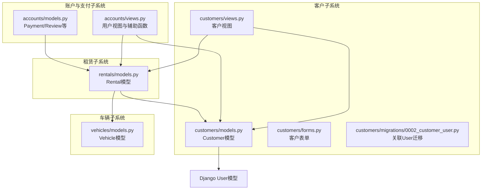
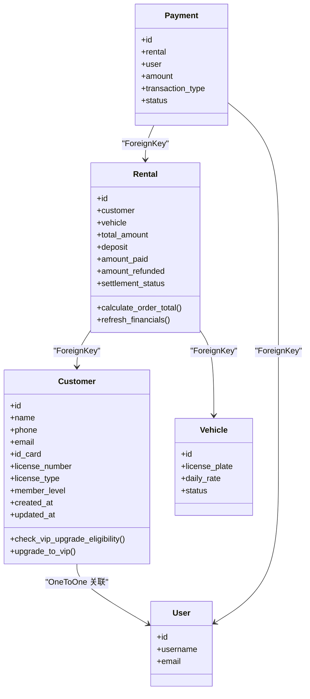
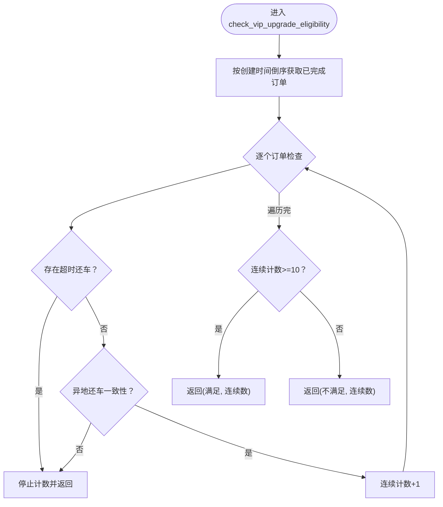
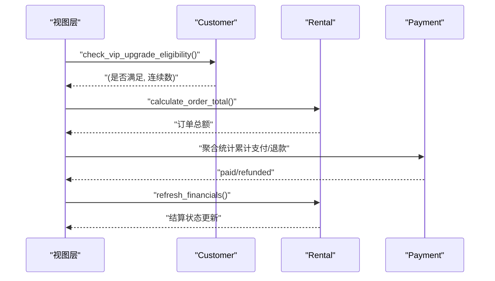
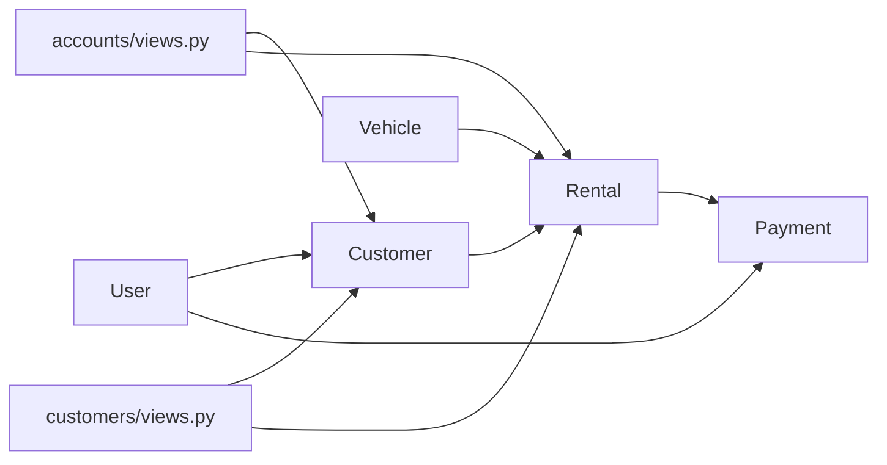

# 客户模型设计

<cite>
**本文引用的文件**
- [customers/models.py](file://code/car_rental_system/customers/models.py)
- [customers/migrations/0002_customer_user.py](file://code/car_rental_system/customers/migrations/0002_customer_user.py)
- [customers/views.py](file://code/car_rental_system/customers/views.py)
- [customers/forms.py](file://code/car_rental_system/customers/forms.py)
- [accounts/models.py](file://code/car_rental_system/accounts/models.py)
- [accounts/views.py](file://code/car_rental_system/accounts/views.py)
- [rentals/models.py](file://code/car_rental_system/rentals/models.py)
- [vehicles/models.py](file://code/car_rental_system/vehicles/models.py)
- [数据库设计总结.md](file://code/car_rental_system/数据库设计总结.md)
</cite>

## 目录
1. [简介](#简介)
2. [项目结构](#项目结构)
3. [核心组件](#核心组件)
4. [架构总览](#架构总览)
5. [详细组件分析](#详细组件分析)
6. [依赖关系分析](#依赖关系分析)
7. [性能考量](#性能考量)
8. [故障排查指南](#故障排查指南)
9. [结论](#结论)
10. [附录](#附录)

## 简介
本文件围绕客户模型（Customer）的结构设计进行深入解析，覆盖字段的业务含义与数据约束、会员等级自动升级逻辑在模型层的实现方式、与Django内置User模型的关联关系（OneToOneField）、客户消费累计机制与支付/租赁模块的联动，以及数据库设计的范式合理性。同时提供典型查询示例与select_related优化策略的应用建议。

## 项目结构
- 客户模型位于 customers 子系统，核心文件包括模型定义、视图、表单与迁移。
- 支付与订单模型位于 accounts 与 rentals 子系统，分别负责支付记录与租赁订单。
- 车辆模型位于 vehicles 子系统，支撑租赁业务。
- 数据库设计文档提供了整体范式与索引设计依据。

图表来源
- [customers/models.py](file://code/car_rental_system/customers/models.py#L1-L160)
- [customers/migrations/0002_customer_user.py](file://code/car_rental_system/customers/migrations/0002_customer_user.py#L1-L22)
- [customers/views.py](file://code/car_rental_system/customers/views.py#L1-L262)
- [accounts/models.py](file://code/car_rental_system/accounts/models.py#L1-L318)
- [accounts/views.py](file://code/car_rental_system/accounts/views.py#L1-L800)
- [rentals/models.py](file://code/car_rental_system/rentals/models.py#L1-L401)
- [vehicles/models.py](file://code/car_rental_system/vehicles/models.py#L1-L85)

章节来源
- [customers/models.py](file://code/car_rental_system/customers/models.py#L1-L160)
- [customers/migrations/0002_customer_user.py](file://code/car_rental_system/customers/migrations/0002_customer_user.py#L1-L22)
- [customers/views.py](file://code/car_rental_system/customers/views.py#L1-L262)
- [accounts/models.py](file://code/car_rental_system/accounts/models.py#L1-L318)
- [accounts/views.py](file://code/car_rental_system/accounts/views.py#L1-L800)
- [rentals/models.py](file://code/car_rental_system/rentals/models.py#L1-L401)
- [vehicles/models.py](file://code/car_rental_system/vehicles/models.py#L1-L85)
- [数据库设计总结.md](file://code/car_rental_system/数据库设计总结.md#L1-L187)

## 核心组件
- Customer 模型：承载客户基本信息、联系方式、会员等级、驾照信息、创建/更新时间；提供VIP升级检查与手动升级能力；与Django User模型建立一对一关联。
- Rental 模型：承载订单信息、金额与结算状态；与Customer/ Vehicle建立外键关联；提供自动计算总金额、押金、异地还车费用与结算状态刷新的能力。
- Payment 模型：承载支付/退款记录，与Rental/User关联，支持累计支付/退款金额的聚合统计。
- Vehicle 模型：承载车辆信息，支撑租赁订单的金额计算与状态管理。
- 表单与视图：提供客户信息录入、搜索筛选、统计展示、会员等级变更接口与前端交互。

章节来源
- [customers/models.py](file://code/car_rental_system/customers/models.py#L1-L160)
- [rentals/models.py](file://code/car_rental_system/rentals/models.py#L1-L401)
- [accounts/models.py](file://code/car_rental_system/accounts/models.py#L147-L251)
- [vehicles/models.py](file://code/car_rental_system/vehicles/models.py#L1-L85)
- [customers/forms.py](file://code/car_rental_system/customers/forms.py#L1-L158)
- [customers/views.py](file://code/car_rental_system/customers/views.py#L1-L262)

## 架构总览
Customer 与 User 的关联采用 OneToOneField，既保留了Django认证体系，又允许在Customer上扩展业务属性。VIP升级逻辑在Customer模型层实现，通过遍历已完成订单并校验“无超时还车”和“异地还车一致性”，达到连续10个订单即满足升级条件的目标。支付与租赁模块通过Rental与Payment的聚合统计联动，为VIP折扣与升级条件提供数据基础。

图表来源
- [customers/models.py](file://code/car_rental_system/customers/models.py#L1-L160)
- [rentals/models.py](file://code/car_rental_system/rentals/models.py#L1-L401)
- [accounts/models.py](file://code/car_rental_system/accounts/models.py#L147-L251)
- [vehicles/models.py](file://code/car_rental_system/vehicles/models.py#L1-L85)

## 详细组件分析

### 字段与业务约束
- 姓名、电话、邮箱、身份证号、驾照号、驾照类型：均为业务关键字段，具备唯一性约束（电话、身份证号、驾照号）与格式校验（手机号、身份证号正则）。
- 会员等级：枚举值包含普通会员与VIP会员，默认普通会员。
- 时间戳：创建/更新时间自动维护，便于审计与排序。
- 索引：针对身份证号、驾照号、电话、会员等级建立索引，提升查询效率。

章节来源
- [customers/models.py](file://code/car_rental_system/customers/models.py#L1-L160)
- [customers/forms.py](file://code/car_rental_system/customers/forms.py#L1-L158)
- [数据库设计总结.md](file://code/car_rental_system/数据库设计总结.md#L34-L64)

### 与Django内置User模型的关联
- Customer.user 为 OneToOneField，允许一对一绑定现有用户；迁移文件展示了该字段的添加过程。
- accounts.views 中提供统一获取用户对应客户信息的方法，若未关联则尝试通过邮箱/用户名匹配，必要时自动关联，保障用户态与客户态的一致性。

章节来源
- [customers/migrations/0002_customer_user.py](file://code/car_rental_system/customers/migrations/0002_customer_user.py#L1-L22)
- [customers/models.py](file://code/car_rental_system/customers/models.py#L1-L40)
- [accounts/views.py](file://code/car_rental_system/accounts/views.py#L198-L223)

### 会员等级自动升级逻辑（模型层）
- 升级条件：连续10个已完成订单，满足“无超时还车”和“异地还车一致性”。
- 实现位置：Customer.check_vip_upgrade_eligibility，按创建时间倒序遍历已完成订单，遇不合规即停止计数，最终判断是否≥10。
- 手动升级：Customer.upgrade_to_vip，仅在非VIP状态下更新等级并保存。

图表来源
- [customers/models.py](file://code/car_rental_system/customers/models.py#L101-L146)

章节来源
- [customers/models.py](file://code/car_rental_system/customers/models.py#L101-L154)

### 与支付与租赁模块的联动
- VIP折扣：在视图层对VIP客户累计消费额进行9折估算，体现会员等级带来的收益。
- 订单金额与结算：Rental.save 中根据日租金与天数计算总金额；refresh_financials 通过Payment聚合统计累计支付/退款，驱动结算状态变化。
- 异地还车与押金：Rental.save 中根据是否异地还车与是否VIP决定异地还车费用与押金，影响最终应付金额。

图表来源
- [customers/views.py](file://code/car_rental_system/customers/views.py#L79-L121)
- [rentals/models.py](file://code/car_rental_system/rentals/models.py#L286-L333)
- [accounts/models.py](file://code/car_rental_system/accounts/models.py#L147-L251)

章节来源
- [customers/views.py](file://code/car_rental_system/customers/views.py#L79-L121)
- [rentals/models.py](file://code/car_rental_system/rentals/models.py#L246-L333)
- [accounts/models.py](file://code/car_rental_system/accounts/models.py#L147-L251)

### 典型查询示例与select_related优化
- 按会员等级筛选客户：使用 Customer.objects.filter(member_level='VIP')，结合分页与annotate聚合统计，避免N+1查询。
- 查找高价值客户：通过 annotate(total_amount=Sum('rentals__total_amount')) 获取累计消费，再按值排序。
- select_related优化：在视图中对 related_name='rentals' 的反向查询使用 select_related('vehicle')，减少额外查询。

章节来源
- [customers/views.py](file://code/car_rental_system/customers/views.py#L34-L76)
- [customers/views.py](file://code/car_rental_system/customers/views.py#L79-L121)

## 依赖关系分析
- Customer 依赖 Django User（OneToOne）与 Rental（反向外键 customer.rentals）。
- Rental 依赖 Customer/Vehicle（外键），并依赖 Payment 进行财务刷新。
- Payment 依赖 Rental/User，用于统计与退款。
- accounts.views 提供统一的用户-客户映射与统计辅助函数，贯穿前后端交互。

图表来源
- [customers/models.py](file://code/car_rental_system/customers/models.py#L1-L160)
- [rentals/models.py](file://code/car_rental_system/rentals/models.py#L1-L401)
- [accounts/models.py](file://code/car_rental_system/accounts/models.py#L147-L251)
- [accounts/views.py](file://code/car_rental_system/accounts/views.py#L198-L223)
- [customers/views.py](file://code/car_rental_system/customers/views.py#L1-L262)

章节来源
- [customers/models.py](file://code/car_rental_system/customers/models.py#L1-L160)
- [rentals/models.py](file://code/car_rental_system/rentals/models.py#L1-L401)
- [accounts/models.py](file://code/car_rental_system/accounts/models.py#L147-L251)
- [accounts/views.py](file://code/car_rental_system/accounts/views.py#L198-L223)
- [customers/views.py](file://code/car_rental_system/customers/views.py#L1-L262)

## 性能考量
- 索引设计：Customer/rentals/vehicles等均建立了关键字段索引，提升查询效率。
- 预加载与聚合：视图中使用 prefetch_related/annotate/aggregate 减少数据库往返，避免N+1问题。
- 金额精度：使用 DecimalField 存储金额，避免浮点误差。
- 缓存：Rental.auto_update_status 使用缓存控制更新频率，降低频繁写入压力。

章节来源
- [customers/models.py](file://code/car_rental_system/customers/models.py#L89-L100)
- [rentals/models.py](file://code/car_rental_system/rentals/models.py#L158-L169)
- [vehicles/models.py](file://code/car_rental_system/vehicles/models.py#L68-L79)
- [customers/views.py](file://code/car_rental_system/customers/views.py#L34-L76)
- [rentals/models.py](file://code/car_rental_system/rentals/models.py#L171-L229)

## 故障排查指南
- 会员等级变更接口：customer_membership_update 支持Ajax更新会员等级，包含参数校验与异常捕获，便于定位问题。
- 客户删除限制：删除前检查是否存在未完成订单，避免破坏业务完整性。
- 用户-客户映射：accounts.views 中的 get_customer_for_user 提供自动关联逻辑，若出现关联异常可检查该函数的返回路径与调试信息。

章节来源
- [customers/views.py](file://code/car_rental_system/customers/views.py#L194-L231)
- [customers/views.py](file://code/car_rental_system/customers/views.py#L165-L191)
- [accounts/views.py](file://code/car_rental_system/accounts/views.py#L198-L223)

## 结论
Customer 模型在业务层面清晰地承载了客户身份、联系方式与会员等级等关键信息，并通过OneToOneField与Django User模型解耦整合。VIP升级逻辑在模型层实现，条件明确、易于审计；与Rental/Payment的联动使消费累计与结算状态自动化，提升了系统的可维护性与用户体验。数据库设计遵循范式，索引与字段约束合理，配合视图层的优化策略，整体性能与可扩展性良好。

## 附录
- 数据库设计总结：包含Customer/Vehicle/Rental的字段定义、索引与外键关系，为模型设计提供依据。
- 视图与表单：提供搜索、筛选、统计与会员等级变更的完整前端交互链路。

章节来源
- [数据库设计总结.md](file://code/car_rental_system/数据库设计总结.md#L1-L187)
- [customers/forms.py](file://code/car_rental_system/customers/forms.py#L1-L158)
- [customers/views.py](file://code/car_rental_system/customers/views.py#L1-L262)
- [accounts/views.py](file://code/car_rental_system/accounts/views.py#L1-L800)