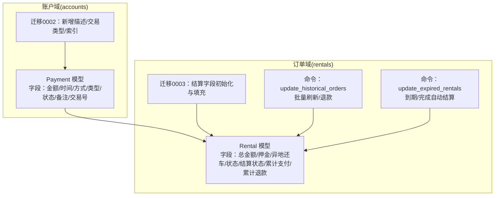
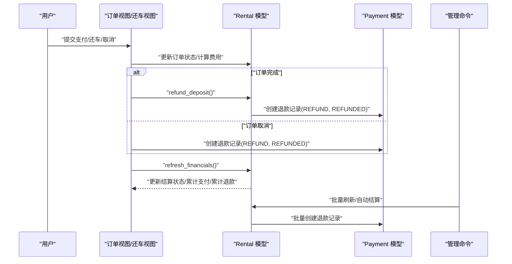
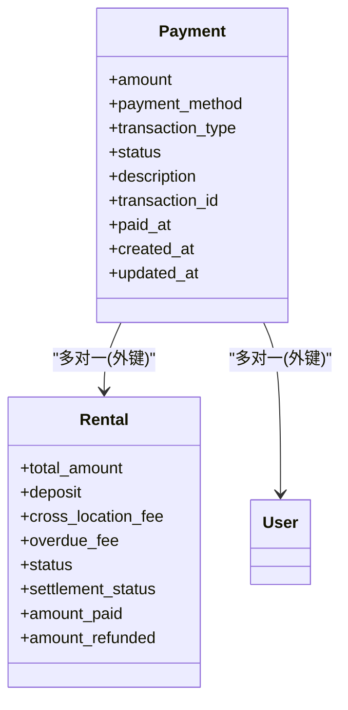
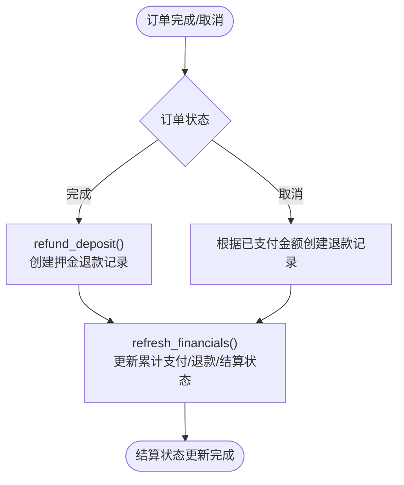
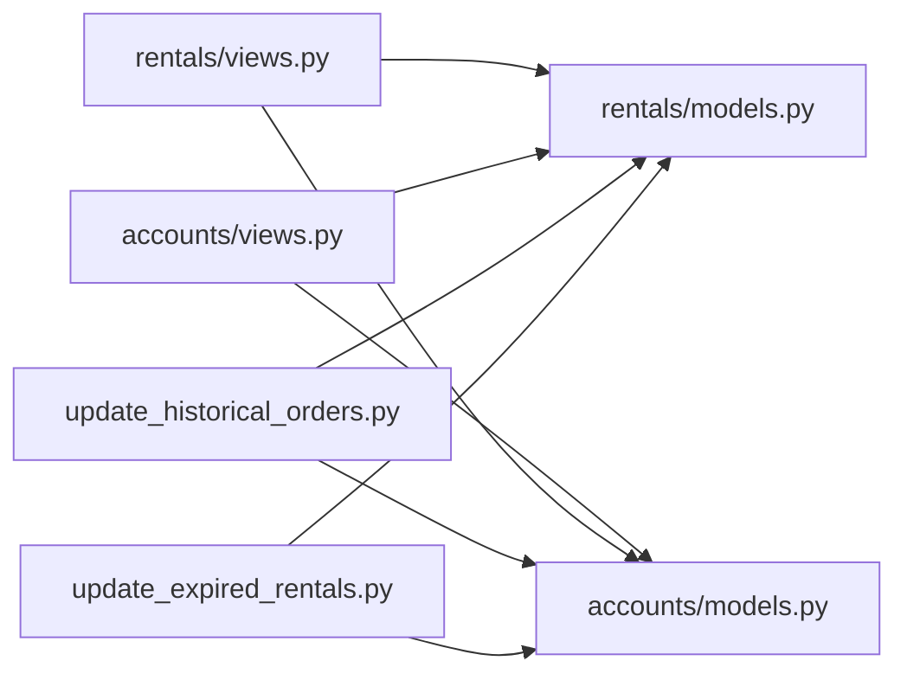

# 支付与结算模型设计

<cite>
**本文引用的文件**
- [accounts/models.py](file://code/car_rental_system/accounts/models.py)
- [accounts/migrations/0002_payment_extra_fields.py](file://code/car_rental_system/accounts/migrations/0002_payment_extra_fields.py)
- [rentals/models.py](file://code/car_rental_system/rentals/models.py)
- [rentals/migrations/0003_settlement_fields.py](file://code/car_rental_system/rentals/migrations/0003_settlement_fields.py)
- [rentals/management/commands/update_historical_orders.py](file://code/car_rental_system/rentals/management/commands/update_historical_orders.py)
- [rentals/management/commands/update_expired_rentals.py](file://code/car_rental_system/rentals/management/commands/update_expired_rentals.py)
- [accounts/views.py](file://code/car_rental_system/accounts/views.py)
- [rentals/views.py](file://code/car_rental_system/rentals/views.py)
- [退款信息显示说明.md](file://code/car_rental_system/退款信息显示说明.md)
</cite>

## 目录
1. [引言](#引言)
2. [项目结构](#项目结构)
3. [核心组件](#核心组件)
4. [架构总览](#架构总览)
5. [详细组件分析](#详细组件分析)
6. [依赖分析](#依赖分析)
7. [性能考虑](#性能考虑)
8. [故障排查指南](#故障排查指南)
9. [结论](#结论)
10. [附录](#附录)

## 引言
本文件围绕“支付与结算模型设计”展开，系统性阐述 Payment 模型的字段结构、状态语义、与 Rental 的关联关系、财务对账机制、扩展字段的设计考量，以及支付记录查询、退款处理等关键流程。文档同时结合迁移脚本与管理命令，说明历史数据补全与自动化结算的实现路径，并给出数据安全与隐私保护建议。

## 项目结构
本系统采用按功能域划分的模块化组织方式，支付与结算相关的关键文件集中在 accounts 与 rentals 子系统中：
- accounts：用户、支付、通知等
- rentals：订单、结算状态、财务汇总、退款自动化等
- management/commands：批量处理历史订单、自动结算等运维工具

图表来源
- [accounts/models.py](file://code/car_rental_system/accounts/models.py#L147-L251)
- [accounts/migrations/0002_payment_extra_fields.py](file://code/car_rental_system/accounts/migrations/0002_payment_extra_fields.py#L1-L42)
- [rentals/models.py](file://code/car_rental_system/rentals/models.py#L12-L160)
- [rentals/migrations/0003_settlement_fields.py](file://code/car_rental_system/rentals/migrations/0003_settlement_fields.py#L1-L93)
- [rentals/management/commands/update_historical_orders.py](file://code/car_rental_system/rentals/management/commands/update_historical_orders.py#L167-L211)
- [rentals/management/commands/update_expired_rentals.py](file://code/car_rental_system/rentals/management/commands/update_expired_rentals.py#L144-L173)

章节来源
- [accounts/models.py](file://code/car_rental_system/accounts/models.py#L147-L251)
- [rentals/models.py](file://code/car_rental_system/rentals/models.py#L12-L160)

## 核心组件
- Payment 支付模型：承载单笔支付或退款的记录，包含金额、支付方式、交易类型、状态、时间戳、备注、第三方交易号等；与 Rental 为多对一关系，一个订单可有多条支付记录。
- Rental 订单模型：承载订单生命周期与财务汇总，包含总金额、押金、异地还车费用、超时费用、订单状态、结算状态、累计支付/退款等；提供自动刷新财务、自动退还押金、自动结算等功能。

章节来源
- [accounts/models.py](file://code/car_rental_system/accounts/models.py#L147-L251)
- [rentals/models.py](file://code/car_rental_system/rentals/models.py#L12-L160)
- [rentals/models.py](file://code/car_rental_system/rentals/models.py#L296-L333)

## 架构总览
支付与结算的总体流程如下：
- 订单创建后，用户发起支付，系统生成 Payment 记录（交易类型为支付，状态为已支付）。
- 订单完成或取消时，系统根据订单状态与累计支付/退款情况，自动创建退款记录（交易类型为退款，状态为已退款）。
- Rental 提供 refresh_financials 与 refund_deposit 等方法，负责刷新累计支付/退款与押金退还。
- 管理命令 update_historical_orders 与 update_expired_rentals 负责批量处理历史订单与到期订单，确保财务数据一致性。

图表来源
- [rentals/views.py](file://code/car_rental_system/rentals/views.py#L279-L392)
- [rentals/views.py](file://code/car_rental_system/rentals/views.py#L395-L466)
- [rentals/models.py](file://code/car_rental_system/rentals/models.py#L296-L333)
- [rentals/management/commands/update_historical_orders.py](file://code/car_rental_system/rentals/management/commands/update_historical_orders.py#L167-L211)
- [rentals/management/commands/update_expired_rentals.py](file://code/car_rental_system/rentals/management/commands/update_expired_rentals.py#L144-L173)

## 详细组件分析

### Payment 模型字段与关系
- 关联关系
  - 外键 rental：与 Rental 为多对一，一个订单可有多条支付记录。
  - 外键 user：与 User 为多对一，便于追溯支付人。
- 核心字段
  - amount：支付金额，十进制精度控制，最小值校验。
  - payment_method：支付方式枚举（如支付宝、微信、银行卡、现金）。
  - transaction_type：交易类型枚举（支付/退款），用于区分正向收费与逆向退款。
  - status：支付状态枚举（待支付、已支付、支付失败、已退款）。
  - description：备注，用于说明支付或退款用途。
  - transaction_id：第三方交易号，便于对账。
  - paid_at：实际支付时间，便于财务对账与报表。
  - created_at/updated_at：记录创建与更新时间，支持审计。
- 索引与排序
  - 索引覆盖 user/status、rental、transaction_id、transaction_type，提升查询效率。
  - 默认按创建时间倒序，便于展示最新记录。

图表来源
- [accounts/models.py](file://code/car_rental_system/accounts/models.py#L147-L251)
- [rentals/models.py](file://code/car_rental_system/rentals/models.py#L12-L160)

章节来源
- [accounts/models.py](file://code/car_rental_system/accounts/models.py#L147-L251)

### 支付状态与财务对账
- 支付状态定义
  - 待支付：尚未完成支付。
  - 已支付：支付成功。
  - 支付失败：支付失败。
  - 已退款：退款成功。
- 财务对账要点
  - 交易类型区分支付与退款，便于正负抵消。
  - paid_at 记录实际支付时间，便于与第三方对账。
  - transaction_id 记录第三方交易号，便于跨系统对账。
  - Rental 层面提供 amount_paid 与 amount_refunded，用于快速核对订单整体收支。

章节来源
- [accounts/models.py](file://code/car_rental_system/accounts/models.py#L147-L251)
- [rentals/models.py](file://code/car_rental_system/rentals/models.py#L12-L160)
- [rentals/models.py](file://code/car_rental_system/rentals/models.py#L296-L333)

### 与 Rental 的关系与结算流程
- 关系性质
  - Payment.rental 与 Rental 为多对一，一个订单可有多条支付记录（如多次支付、分期支付、部分退款等）。
- 结算流程
  - 订单完成：调用 refund_deposit 自动退还押金，创建退款记录，刷新累计支付/退款与结算状态。
  - 订单取消：根据已支付金额（扣减已退款）创建退款记录，刷新累计支付/退款与结算状态。
  - 自动刷新：refresh_financials 依据支付记录聚合计算累计支付/退款，并据此更新结算状态。

图表来源
- [rentals/views.py](file://code/car_rental_system/rentals/views.py#L279-L392)
- [rentals/views.py](file://code/car_rental_system/rentals/views.py#L395-L466)
- [rentals/models.py](file://code/car_rental_system/rentals/models.py#L296-L333)

章节来源
- [rentals/views.py](file://code/car_rental_system/rentals/views.py#L279-L392)
- [rentals/views.py](file://code/car_rental_system/rentals/views.py#L395-L466)
- [rentals/models.py](file://code/car_rental_system/rentals/models.py#L296-L333)

### 支付信息扩展字段的设计考量
- 迁移 0002 新增字段
  - description：用于记录支付或退款的说明，便于财务与客服对账。
  - transaction_type：明确区分支付与退款，避免业务侧误判。
  - 为 transaction_type 增加索引，提升按类型查询与统计的性能。
- 设计权衡
  - 通过枚举约束支付方式与状态，保证数据一致性。
  - 通过 decimal 字段与 validator 控制金额精度与最小值，降低浮点误差风险。
  - 通过 paid_at/paid_at 等时间字段，满足财务对账与审计需求。

章节来源
- [accounts/migrations/0002_payment_extra_fields.py](file://code/car_rental_system/accounts/migrations/0002_payment_extra_fields.py#L1-L42)
- [accounts/models.py](file://code/car_rental_system/accounts/models.py#L147-L251)

### 支付记录查询与退款处理示例
- 支付记录查询
  - 按订单查询：通过 Rental.payments 查询该订单的所有支付记录。
  - 按用户查询：通过 User.payments 查询该用户的所有支付记录。
  - 按交易类型与状态过滤：使用 transaction_type 与 status 字段组合过滤。
  - 聚合统计：使用聚合函数 Sum 计算累计支付/退款金额。
- 退款处理
  - 订单完成：调用 Rental.refund_deposit，自动创建押金退款记录并刷新财务。
  - 订单取消：根据已支付金额（扣减已退款）创建退款记录并刷新财务。
  - 历史订单批量处理：使用管理命令 update_historical_orders 批量刷新财务与创建退款记录。

章节来源
- [accounts/views.py](file://code/car_rental_system/accounts/views.py#L243-L268)
- [rentals/views.py](file://code/car_rental_system/rentals/views.py#L279-L392)
- [rentals/views.py](file://code/car_rental_system/rentals/views.py#L395-L466)
- [rentals/management/commands/update_historical_orders.py](file://code/car_rental_system/rentals/management/commands/update_historical_orders.py#L167-L211)

### 数据安全与隐私保护
- 敏感信息处理
  - 交易号 transaction_id 作为第三方交易号，建议在数据库层面不存储明文敏感卡号等信息；若涉及卡号，应遵循 PCI DSS 或等保要求进行加密与脱敏。
  - 对于支付回调与日志，避免输出完整交易号与敏感字段。
- 访问控制
  - 仅授权人员可执行管理命令与查看财务报表。
- 审计与日志
  - 使用 created_at/updated_at 记录变更时间，配合 paid_at/paid_at 辅助对账。
  - 对退款操作进行审计日志记录，便于追踪。

[本节为通用指导，不直接分析具体文件]

## 依赖分析
- 模块耦合
  - Rental 与 Payment：通过外键关联，Rental 提供 refresh_financials 与 refund_deposit，Payment 作为独立记录单元。
  - 视图层：rentals/views 与 accounts/views 协作，前者负责订单生命周期与退款，后者提供支付汇总与页面渲染。
  - 管理命令：update_historical_orders 与 update_expired_rentals 依赖 Rental/Payment 模型，批量刷新与自动结算。
- 外部依赖
  - 第三方支付平台：通过 transaction_id 与 paid_at 与外部系统对账。
  - Django ORM 与迁移框架：确保字段演进与历史数据一致性。

图表来源
- [rentals/views.py](file://code/car_rental_system/rentals/views.py#L279-L392)
- [rentals/views.py](file://code/car_rental_system/rentals/views.py#L395-L466)
- [accounts/views.py](file://code/car_rental_system/accounts/views.py#L243-L268)
- [rentals/models.py](file://code/car_rental_system/rentals/models.py#L296-L333)
- [accounts/models.py](file://code/car_rental_system/accounts/models.py#L147-L251)
- [rentals/management/commands/update_historical_orders.py](file://code/car_rental_system/rentals/management/commands/update_historical_orders.py#L167-L211)
- [rentals/management/commands/update_expired_rentals.py](file://code/car_rental_system/rentals/management/commands/update_expired_rentals.py#L144-L173)

章节来源
- [rentals/views.py](file://code/car_rental_system/rentals/views.py#L279-L392)
- [accounts/views.py](file://code/car_rental_system/accounts/views.py#L243-L268)
- [rentals/management/commands/update_historical_orders.py](file://code/car_rental_system/rentals/management/commands/update_historical_orders.py#L167-L211)

## 性能考虑
- 索引优化
  - Payment 模型对 user/status、rental、transaction_id、transaction_type 建立索引，显著提升按订单、用户、类型与交易号的查询性能。
- 聚合与缓存
  - refresh_financials 使用聚合 Sum 计算累计支付/退款，减少循环遍历成本。
  - 管理命令批量处理，避免单次操作过多事务开销。
- 时间字段
  - paid_at 与 created_at/updated_at 的合理使用，有助于快速定位异常交易与审计。

章节来源
- [accounts/models.py](file://code/car_rental_system/accounts/models.py#L237-L248)
- [rentals/models.py](file://code/car_rental_system/rentals/models.py#L296-L333)

## 故障排查指南
- 退款未显示
  - 历史订单财务信息未刷新：执行批量更新命令刷新财务信息。
  - 退款记录未创建：检查订单状态、押金金额、用户账号是否存在。
- 常见问题与处理
  - 已完成订单无退款记录：确认订单是否具备押金、是否已退还过、是否执行过批量更新。
  - 已取消订单无退款记录：确认是否存在已支付金额、是否已退还过、是否执行过批量更新。
  - 退款金额计算异常：核对押金与已退款金额差额。

章节来源
- [退款信息显示说明.md](file://code/car_rental_system/退款信息显示说明.md#L1-L124)
- [rentals/management/commands/update_historical_orders.py](file://code/car_rental_system/rentals/management/commands/update_historical_orders.py#L167-L211)

## 结论
Payment 与 Rental 模型通过清晰的字段定义、交易类型与状态枚举、完善的索引与聚合统计，构建了可靠的支付与结算基础。迁移脚本与管理命令进一步保障了历史数据的一致性与自动化结算能力。结合合理的安全与隐私保护措施，系统能够稳定支撑财务对账与业务运营。

## 附录
- 相关迁移与命令
  - 支付扩展字段迁移：新增 description、transaction_type 与索引。
  - 订单结算字段迁移：初始化 amount_paid/amount_refunded/settlement_status 并填充历史数据。
  - 批量处理命令：update_historical_orders 与 update_expired_rentals。

章节来源
- [accounts/migrations/0002_payment_extra_fields.py](file://code/car_rental_system/accounts/migrations/0002_payment_extra_fields.py#L1-L42)
- [rentals/migrations/0003_settlement_fields.py](file://code/car_rental_system/rentals/migrations/0003_settlement_fields.py#L1-L93)
- [rentals/management/commands/update_historical_orders.py](file://code/car_rental_system/rentals/management/commands/update_historical_orders.py#L167-L211)
- [rentals/management/commands/update_expired_rentals.py](file://code/car_rental_system/rentals/management/commands/update_expired_rentals.py#L144-L173)