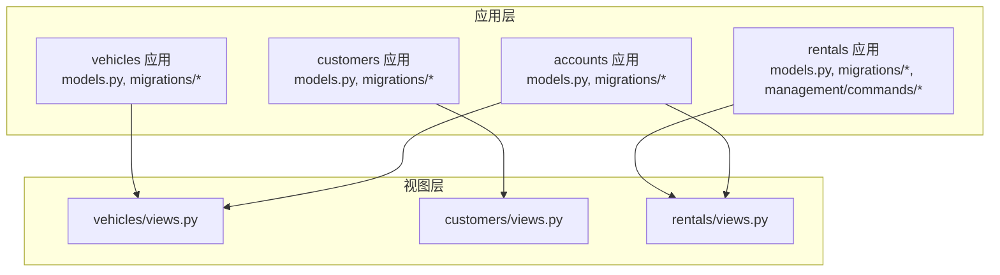
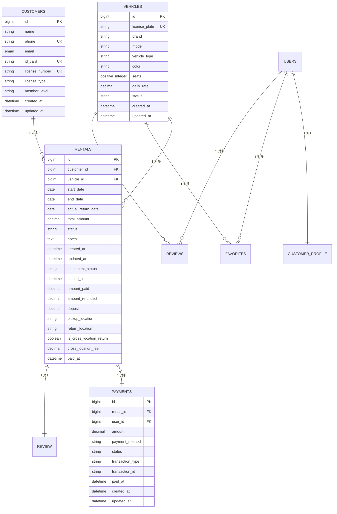
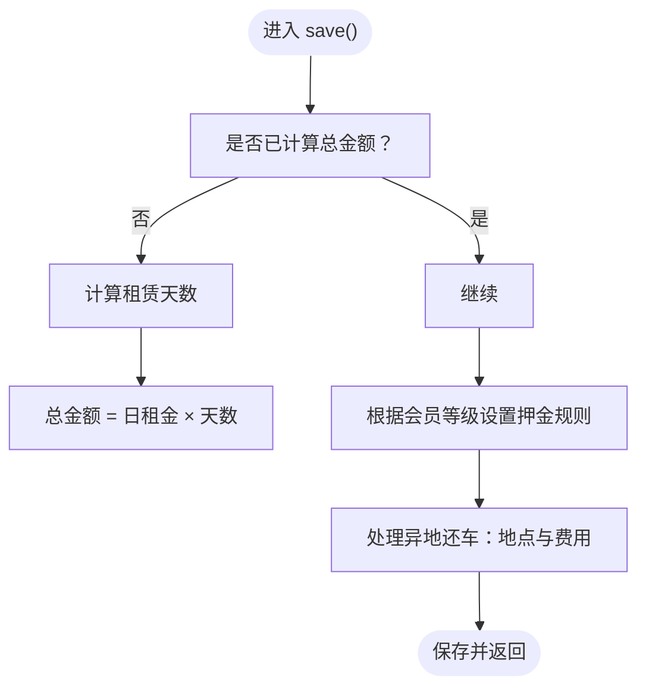
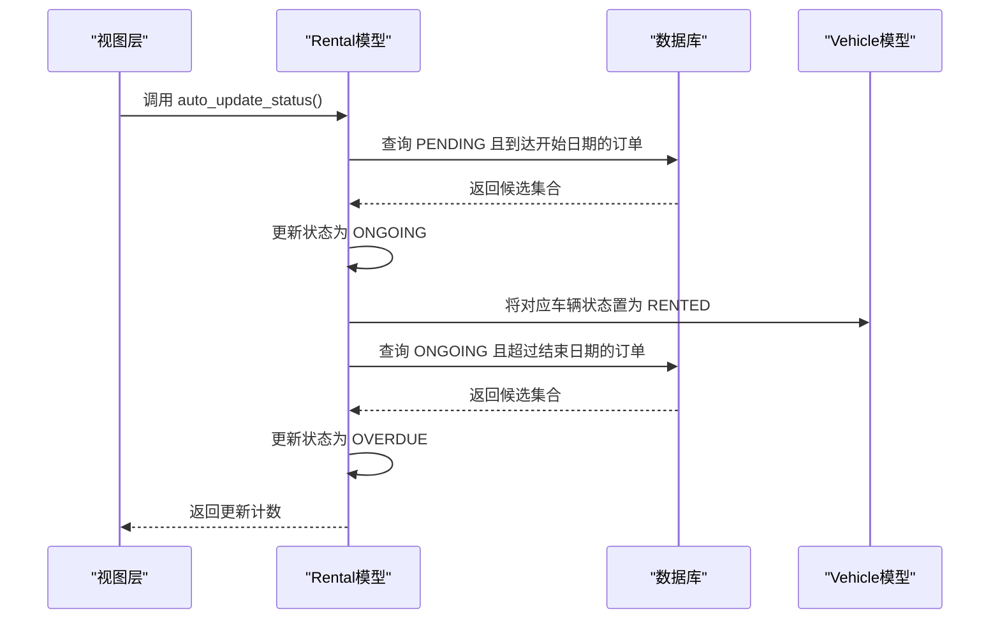

# 数据库设计

<cite>
**本文引用的文件**
- [vehicles/models.py](file://code/car_rental_system/vehicles/models.py)
- [customers/models.py](file://code/car_rental_system/customers/models.py)
- [rentals/models.py](file://code/car_rental_system/rentals/models.py)
- [accounts/models.py](file://code/car_rental_system/accounts/models.py)
- [vehicles/migrations/0001_initial.py](file://code/car_rental_system/vehicles/migrations/0001_initial.py)
- [customers/migrations/0001_initial.py](file://code/car_rental_system/customers/migrations/0001_initial.py)
- [rentals/migrations/0001_initial.py](file://code/car_rental_system/rentals/migrations/0001_initial.py)
- [accounts/migrations/0001_initial.py](file://code/car_rental_system/accounts/migrations/0001_initial.py)
- [数据库设计总结.md](file://code/car_rental_system/数据库设计总结.md)
- [rentals/views.py](file://code/car_rental_system/rentals/views.py)
- [vehicles/views.py](file://code/car_rental_system/vehicles/views.py)
- [customers/views.py](file://code/car_rental_system/customers/views.py)
- [rentals/management/commands/update_expired_rentals.py](file://code/car_rental_system/rentals/management/commands/update_expired_rentals.py)
- [rentals/management/commands/update_historical_orders.py](file://code/car_rental_system/rentals/management/commands/update_historical_orders.py)
- [订单自动更新使用说明.md](file://code/car_rental_system/订单自动更新使用说明.md)
</cite>

## 目录
1. [简介](#简介)
2. [项目结构](#项目结构)
3. [核心组件](#核心组件)
4. [架构总览](#架构总览)
5. [详细组件分析](#详细组件分析)
6. [依赖分析](#依赖分析)
7. [性能考量](#性能考量)
8. [故障排查指南](#故障排查指南)
9. [结论](#结论)
10. [附录](#附录)

## 简介
本文件围绕租车管理系统的四大核心数据模型：Vehicle（车辆）、Customer（客户）、Rental（租赁订单）与 Payment（支付记录），系统化梳理字段定义、关系设计、业务约束、索引策略与数据完整性保障，并结合数据库设计总结.md的设计思路，解释职责划分与范式考量。同时提供ER图、典型查询场景的性能优化方案（如select_related的使用），并说明迁移文件的作用与管理流程。

## 项目结构
系统采用Django应用分层组织，四大核心模型分别位于独立应用下，配合迁移文件与视图层实现业务逻辑与查询优化。

图表来源
- [vehicles/models.py](file://code/car_rental_system/vehicles/models.py#L1-L85)
- [customers/models.py](file://code/car_rental_system/customers/models.py#L1-L160)
- [rentals/models.py](file://code/car_rental_system/rentals/models.py#L1-L401)
- [accounts/models.py](file://code/car_rental_system/accounts/models.py#L1-L318)
- [vehicles/views.py](file://code/car_rental_system/vehicles/views.py#L1-L200)
- [customers/views.py](file://code/car_rental_system/customers/views.py#L34-L76)
- [rentals/views.py](file://code/car_rental_system/rentals/views.py#L1-L200)

章节来源
- [vehicles/models.py](file://code/car_rental_system/vehicles/models.py#L1-L85)
- [customers/models.py](file://code/car_rental_system/customers/models.py#L1-L160)
- [rentals/models.py](file://code/car_rental_system/rentals/models.py#L1-L401)
- [accounts/models.py](file://code/car_rental_system/accounts/models.py#L1-L318)

## 核心组件
本节对四大核心模型进行字段、关系与约束的系统性解析，并结合迁移文件与设计总结文档进行交叉验证。

- Vehicle（车辆）
  - 关键字段：车牌号（唯一）、品牌、型号、车辆类型、颜色、座位数、日租金、状态、创建/更新时间
  - 约束与校验：日租金最小值校验；状态枚举；索引覆盖车牌号、状态、品牌+型号、座位数
  - 典型用途：作为Rental的外键，承载定价与状态流转

- Customer（客户）
  - 关键字段：姓名、手机号（唯一）、邮箱、身份证号（唯一）、驾照号（唯一）、驾照类型、会员等级、创建/更新时间
  - 约束与校验：手机号、身份证号正则校验；会员等级与驾照类型枚举；索引覆盖身份证号、驾照号、手机号、会员等级
  - 典型用途：作为Rental的外键；提供VIP升级能力与会员等级影响押金策略

- Rental（租赁订单）
  - 关键字段：客户、车辆、起止日期、实际还车日期、总金额、状态、备注、创建/更新时间、结算状态、结算时间、累计支付/退款、押金、跨地点还车相关字段
  - 关系与约束：外键级联删除；状态枚举；日期逻辑校验；保存时自动计算总金额、押金与跨地点费用；支持自动状态更新与财务刷新
  - 典型用途：连接Customer与Vehicle，承载业务状态机与财务结算

- Payment（支付记录）
  - 关键字段：订单、用户、金额、支付方式、交易类型、状态、备注、交易号、支付时间、创建/更新时间
  - 关系与约束：外键级联删除；状态与交易类型枚举；索引覆盖用户+状态、订单、交易号、交易类型
  - 典型用途：支撑Rental的结算状态与退款流程

章节来源
- [vehicles/models.py](file://code/car_rental_system/vehicles/models.py#L1-L85)
- [customers/models.py](file://code/car_rental_system/customers/models.py#L1-L160)
- [rentals/models.py](file://code/car_rental_system/rentals/models.py#L1-L401)
- [accounts/models.py](file://code/car_rental_system/accounts/models.py#L147-L251)
- [数据库设计总结.md](file://code/car_rental_system/数据库设计总结.md#L1-L187)

## 架构总览
四大模型之间的关系如下所示，体现了清晰的一对多与一对一约束，以及查询优化的索引策略。

图表来源
- [customers/models.py](file://code/car_rental_system/customers/models.py#L1-L160)
- [vehicles/models.py](file://code/car_rental_system/vehicles/models.py#L1-L85)
- [rentals/models.py](file://code/car_rental_system/rentals/models.py#L1-L401)
- [accounts/models.py](file://code/car_rental_system/accounts/models.py#L147-L251)

## 详细组件分析

### Vehicle（车辆）模型
- 字段与约束
  - 唯一性：license_plate
  - 数值校验：daily_rate最小值；seats最小值
  - 枚举：status（可用、已租、维修中）
  - 索引：license_plate、status、brand+model、seats
- 业务要点
  - 作为Rental.vehicle的外键，驱动状态机（PENDING/ONGOING时置为RENTED，COMPLETED时可能恢复为AVAILABLE）
  - 与Rental共同决定总金额与押金策略
- 设计依据
  - 与数据库设计总结一致，强调唯一索引与常用查询字段索引

章节来源
- [vehicles/models.py](file://code/car_rental_system/vehicles/models.py#L1-L85)
- [数据库设计总结.md](file://code/car_rental_system/数据库设计总结.md#L1-L187)

### Customer（客户）模型
- 字段与约束
  - 唯一性：id_card、license_number、phone
  - 正则校验：手机号、身份证号
  - 枚举：license_type、member_level
  - 索引：id_card、license_number、phone、member_level
- 业务要点
  - 会员等级影响押金策略（VIP免押金）
  - 提供VIP升级能力与诚信计数逻辑（用于升级判定）
- 设计依据
  - 与数据库设计总结一致，强调唯一性与高频查询字段索引

章节来源
- [customers/models.py](file://code/car_rental_system/customers/models.py#L1-L160)
- [数据库设计总结.md](file://code/car_rental_system/数据库设计总结.md#L1-L187)

### Rental（租赁订单）模型
- 字段与约束
  - 外键：customer、vehicle（CASCADE）
  - 枚举：status（PENDING/ONGOING/OVERDUE/COMPLETED/CANCELLED）、settlement_status（UNSETTLED/PARTIAL/SETTLED）
  - 校验：日期逻辑（开始日期≤结束日期；实际还车日期约束）
  - 索引：start_date、end_date、status、customer+status、vehicle+status
- 业务要点
  - 自动状态更新：PENDING→ONGOING（到达开始日期）；ONGOING→OVERDUE（超过结束日期）
  - 保存时自动计算总金额、押金、跨地点费用
  - 财务刷新：根据支付记录汇总amount_paid/amount_refunded，更新结算状态
  - 退款：支持押金自动退款
- 设计依据
  - 与数据库设计总结一致，强调外键、状态枚举与索引策略

图表来源
- [rentals/models.py](file://code/car_rental_system/rentals/models.py#L246-L271)

章节来源
- [rentals/models.py](file://code/car_rental_system/rentals/models.py#L1-L401)
- [数据库设计总结.md](file://code/car_rental_system/数据库设计总结.md#L1-L187)

### Payment（支付记录）模型
- 字段与约束
  - 外键：rental、user（CASCADE）
  - 枚举：status（PENDING/PAID/FAILED/REFUNDED）、transaction_type（CHARGE/REFUND）、payment_method（ALIPAY/WECHAT/BANK/CASH）
  - 索引：user+status、rental、transaction_id、transaction_type
- 业务要点
  - 与Rental的结算状态联动，支持退款流程
  - 交易号与支付时间便于对账与审计

章节来源
- [accounts/models.py](file://code/car_rental_system/accounts/models.py#L147-L251)
- [数据库设计总结.md](file://code/car_rental_system/数据库设计总结.md#L1-L187)

## 依赖分析
- 外键关系
  - Rental.customer → Customer（CASCADE）
  - Rental.vehicle → Vehicle（CASCADE）
  - Payment.rental → Rental（CASCADE）
  - Payment.user → User（CASCADE）
  - Customer.user → User（SET_NULL）
- 反向查询
  - customer.rentals、vehicle.rentals、rental.payments、user.payments、user.notifications、user.reviews、vehicle.reviews、user.profile、vehicle.favorited_by、rental.review
- 状态机与自动更新
  - 视图层调用Rental.auto_update_status()以触发状态更新
  - 管理命令提供定时任务入口，确保幂等与批量更新

图表来源
- [rentals/views.py](file://code/car_rental_system/rentals/views.py#L17-L58)
- [rentals/models.py](file://code/car_rental_system/rentals/models.py#L171-L229)

章节来源
- [rentals/views.py](file://code/car_rental_system/rentals/views.py#L1-L200)
- [rentals/models.py](file://code/car_rental_system/rentals/models.py#L171-L229)
- [rentals/management/commands/update_expired_rentals.py](file://code/car_rental_system/rentals/management/commands/update_expired_rentals.py#L1-L200)
- [rentals/management/commands/update_historical_orders.py](file://code/car_rental_system/rentals/management/commands/update_historical_orders.py#L91-L119)

## 性能考量
- 索引策略
  - Vehicle：license_plate（UNIQUE）、status、brand+model、seats
  - Customer：id_card（UNIQUE）、license_number（UNIQUE）、phone（UNIQUE）、member_level
  - Rental：start_date、end_date、status、customer+status、vehicle+status
  - Payment：user+status、rental、transaction_id、transaction_type
- 查询优化
  - 视图层广泛使用select_related与only，减少N+1查询与多余字段加载
  - 列表页使用prefetch_related与annotate聚合，降低数据库往返次数
  - 缓存热门筛选选项与统计信息，降低重复查询成本
- 自动化与批处理
  - 管理命令提供批量状态更新与财务刷新，避免频繁在线请求触发
  - 定时任务配置建议参考“订单自动更新使用说明.md”

章节来源
- [vehicles/views.py](file://code/car_rental_system/vehicles/views.py#L42-L135)
- [customers/views.py](file://code/car_rental_system/customers/views.py#L34-L76)
- [rentals/views.py](file://code/car_rental_system/rentals/views.py#L61-L126)
- [订单自动更新使用说明.md](file://code/car_rental_system/订单自动更新使用说明.md#L71-L119)

## 故障排查指南
- 状态更新失败
  - 现象：自动状态更新未生效或报错
  - 排查：检查缓存键与事务边界；确认命令行执行权限与日志输出
  - 参考：管理命令与使用说明文档
- 订单状态异常
  - 现象：订单状态与实际不符
  - 排查：核对日期逻辑与状态转换规则；检查是否有并发更新导致的竞态
  - 参考：Rental.clean()与状态表单验证
- 支付与退款问题
  - 现象：结算状态不正确或退款未到账
  - 排查：确认支付记录状态与交易类型；核对退款金额与已退金额
  - 参考：Rental.refresh_financials()与refund_deposit()

章节来源
- [rentals/models.py](file://code/car_rental_system/rentals/models.py#L230-L271)
- [rentals/forms.py](file://code/car_rental_system/rentals/forms.py#L277-L309)
- [accounts/models.py](file://code/car_rental_system/accounts/models.py#L147-L251)
- [rentals/management/commands/update_expired_rentals.py](file://code/car_rental_system/rentals/management/commands/update_expired_rentals.py#L1-L200)
- [订单自动更新使用说明.md](file://code/car_rental_system/订单自动更新使用说明.md#L71-L119)

## 结论
本系统通过清晰的模型职责划分与严格的约束设计，实现了车辆、客户、订单与支付之间的强关联与高一致性。索引策略与查询优化贯穿视图层，有效降低了N+1与冗余字段加载带来的性能损耗。迁移文件完整记录了模型演进路径，配合管理命令与定时任务，确保业务自动化与数据完整性。

## 附录

### 迁移文件的作用与管理流程
- 作用
  - 记录模型变更历史，确保数据库结构与代码一致
  - 通过迁移操作创建/修改表结构、索引与约束
- 管理流程
  - 新增字段或索引后生成迁移文件
  - 在目标环境执行迁移以应用变更
  - 生产环境建议先在测试环境验证，再逐步上线
- 示例
  - 车辆模型初始迁移包含主键、字段定义与索引
  - 客户模型初始迁移包含唯一性约束与索引
  - 租赁模型初始迁移包含外键与复合索引
  - 支付模型初始迁移包含交易相关字段与索引

章节来源
- [vehicles/migrations/0001_initial.py](file://code/car_rental_system/vehicles/migrations/0001_initial.py#L1-L39)
- [customers/migrations/0001_initial.py](file://code/car_rental_system/customers/migrations/0001_initial.py#L1-L38)
- [rentals/migrations/0001_initial.py](file://code/car_rental_system/rentals/migrations/0001_initial.py#L1-L43)
- [accounts/migrations/0001_initial.py](file://code/car_rental_system/accounts/migrations/0001_initial.py#L1-L117)