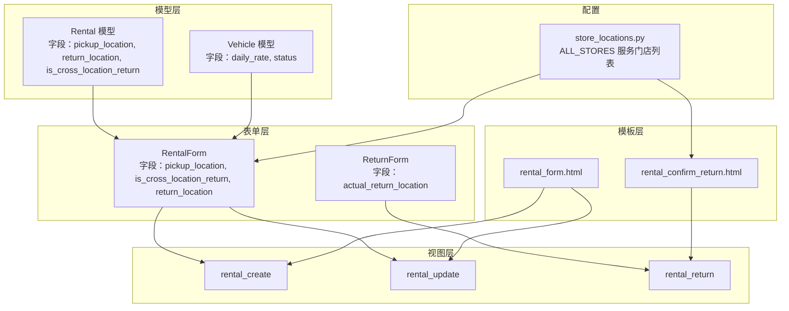
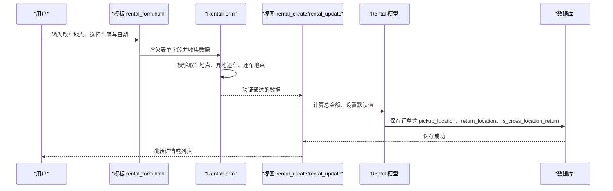
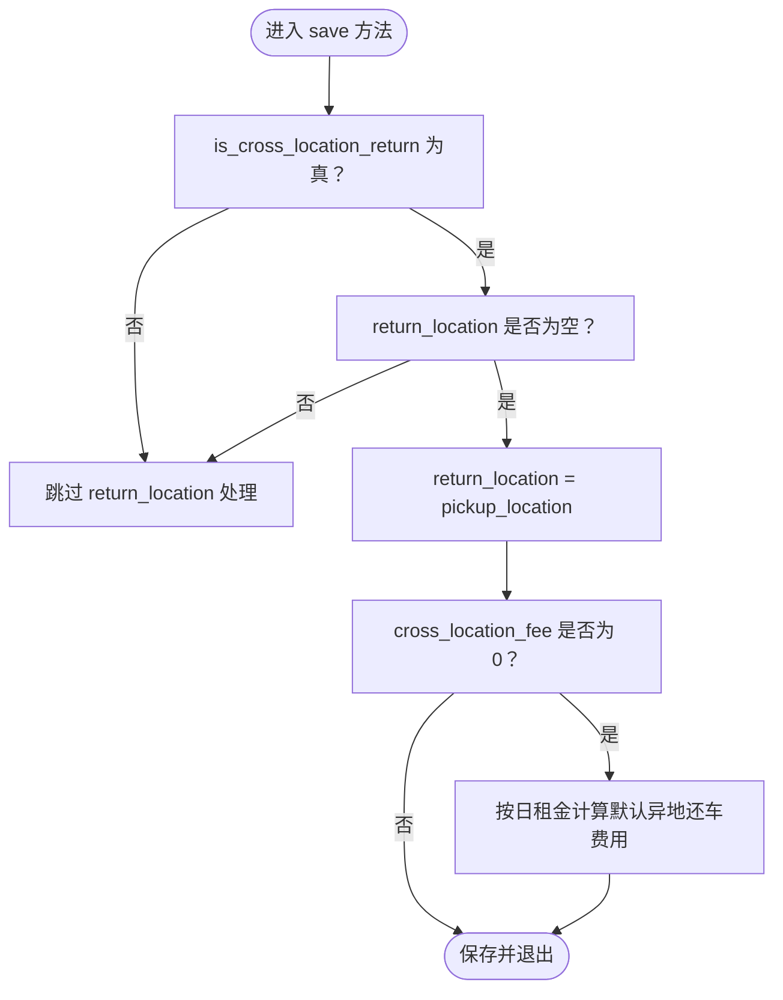
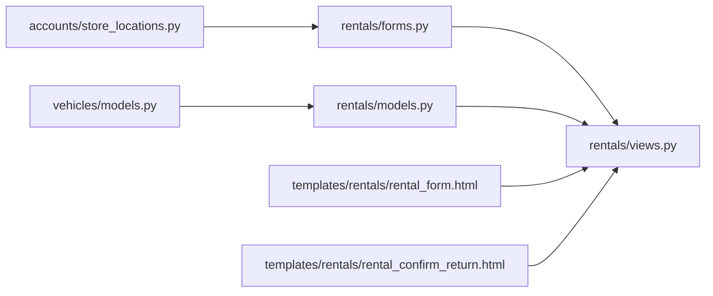

# 取车管理

<cite>
**本文引用的文件**
- [models.py](file://code/car_rental_system/rentals/models.py)
- [forms.py](file://code/car_rental_system/rentals/forms.py)
- [views.py](file://code/car_rental_system/rentals/views.py)
- [rental_form.html](file://code/car_rental_system/templates/rentals/rental_form.html)
- [rental_confirm_return.html](file://code/car_rental_system/templates/rentals/rental_confirm_return.html)
- [store_locations.py](file://code/car_rental_system/accounts/store_locations.py)
- [0002_add_deposit_and_location_fields.py](file://code/car_rental_system/rentals/migrations/0002_add_deposit_and_location_fields.py)
- [0004_add_return_location_fields.py](file://code/car_rental_system/rentals/migrations/0004_add_return_location_fields.py)
- [vehicles/models.py](file://code/car_rental_system/vehicles/models.py)
</cite>

## 目录
1. [简介](#简介)
2. [项目结构](#项目结构)
3. [核心组件](#核心组件)
4. [架构总览](#架构总览)
5. [详细组件分析](#详细组件分析)
6. [依赖关系分析](#依赖关系分析)
7. [性能考量](#性能考量)
8. [故障排查指南](#故障排查指南)
9. [结论](#结论)

## 简介
本文件系统化文档化取车管理功能，重点围绕 pickup_location 字段的设计与实现展开，涵盖：
- pickup_location 的默认值“门店”的业务含义与使用场景
- 订单创建流程中取车地点的设置与校验
- Rental 模型 save 方法在 is_cross_location_return=True 时对 return_location 的处理
- 视图层与表单层对取车地点的处理逻辑
- 前端模板中取车地点输入字段的实现与业务规范约束
- 取车地点与其他业务规则的关联，如车辆可用性检查与订单状态流转

## 项目结构
取车管理涉及以下关键模块与文件：
- 模型层：Rental 模型定义 pickup_location、return_location、is_cross_location_return 等字段
- 表单层：RentalForm 对取车地点、异地还车等字段进行前端渲染与校验
- 视图层：rental_create/rental_update/rental_return 等视图负责业务流程控制
- 前端模板：rental_form.html 与 rental_confirm_return.html 展示取车地点输入与还车处理
- 门店配置：store_locations.py 提供服务门店列表，支撑还车地点选择
- 车辆模型：vehicles/models.py 提供车辆状态与日租金，影响费用计算

图表来源
- [models.py](file://code/car_rental_system/rentals/models.py#L83-L108)
- [forms.py](file://code/car_rental_system/rentals/forms.py#L11-L21)
- [views.py](file://code/car_rental_system/rentals/views.py#L154-L231)
- [rental_form.html](file://code/car_rental_system/templates/rentals/rental_form.html#L1-L188)
- [rental_confirm_return.html](file://code/car_rental_system/templates/rentals/rental_confirm_return.html#L1-L231)
- [store_locations.py](file://code/car_rental_system/accounts/store_locations.py#L61-L66)
- [vehicles/models.py](file://code/car_rental_system/vehicles/models.py#L45-L58)

章节来源
- [models.py](file://code/car_rental_system/rentals/models.py#L83-L108)
- [forms.py](file://code/car_rental_system/rentals/forms.py#L11-L21)
- [views.py](file://code/car_rental_system/rentals/views.py#L154-L231)
- [rental_form.html](file://code/car_rental_system/templates/rentals/rental_form.html#L1-L188)
- [rental_confirm_return.html](file://code/car_rental_system/templates/rentals/rental_confirm_return.html#L1-L231)
- [store_locations.py](file://code/car_rental_system/accounts/store_locations.py#L61-L66)
- [vehicles/models.py](file://code/car_rental_system/vehicles/models.py#L45-L58)

## 核心组件
- Rental 模型
  - pickup_location：取车地点，默认值为“门店”，用于标识取车门店名称或具体地址
  - return_location：还车地点，仅在异地还车时使用
  - is_cross_location_return：是否异地还车的布尔开关
  - save 方法：当 is_cross_location_return 为真且 return_location 为空时，自动将 return_location 设为 pickup_location；同时处理异地还车费用与押金逻辑
- RentalForm 表单
  - 字段：customer、vehicle、start_date、end_date、deposit、pickup_location、is_cross_location_return、return_location、cross_location_fee、status、notes
  - 初始化：默认取车地点为“门店”，还车地点下拉框来源于 ALL_STORES
  - 校验：异地还车时要求还车地点必填且与取车地点不同；还车地点需在服务门店列表中或按规则加收异地还车费用
- 视图层
  - rental_create/rental_update：接收表单数据，计算总金额，保存订单并更新车辆状态
  - rental_return：处理实际还车日期与还车门店，自动判断是否实际异地还车并计算超时费用与异地还车费用
- 前端模板
  - rental_form.html：展示取车地点输入与费用预览
  - rental_confirm_return.html：展示取车信息、还车处理与费用预览

章节来源
- [models.py](file://code/car_rental_system/rentals/models.py#L83-L108)
- [models.py](file://code/car_rental_system/rentals/models.py#L246-L271)
- [forms.py](file://code/car_rental_system/rentals/forms.py#L88-L121)
- [forms.py](file://code/car_rental_system/rentals/forms.py#L11-L21)
- [views.py](file://code/car_rental_system/rentals/views.py#L154-L231)
- [views.py](file://code/car_rental_system/rentals/views.py#L279-L392)
- [rental_form.html](file://code/car_rental_system/templates/rentals/rental_form.html#L1-L188)
- [rental_confirm_return.html](file://code/car_rental_system/templates/rentals/rental_confirm_return.html#L1-L231)

## 架构总览
取车管理贯穿“表单 -> 视图 -> 模型 -> 模板”的完整链路，其中：
- 表单层负责用户输入与字段级校验
- 视图层负责业务流程控制与数据持久化
- 模型层负责数据结构、默认值与保存时的派生逻辑
- 模板层负责用户交互与业务提示

图表来源
- [rental_form.html](file://code/car_rental_system/templates/rentals/rental_form.html#L1-L188)
- [forms.py](file://code/car_rental_system/rentals/forms.py#L11-L21)
- [views.py](file://code/car_rental_system/rentals/views.py#L154-L231)
- [models.py](file://code/car_rental_system/rentals/models.py#L246-L271)

## 详细组件分析

### Pickup_location 字段设计与默认值
- 字段定义
  - 名称：pickup_location
  - 类型：CharField
  - 默认值：'门店'
  - 用途：记录取车地点，支持门店名称或具体地址
- 业务含义
  - 默认值“门店”表示系统默认取车地点为公司服务门店，便于统一管理与结算
  - 当用户选择异地还车且未填写还车地点时，系统会在保存时将 return_location 设为 pickup_location，确保还车地点明确
- 数据迁移
  - 迁移文件中明确新增 pickup_location 字段并设置默认值为“门店”

章节来源
- [models.py](file://code/car_rental_system/rentals/models.py#L83-L88)
- [0002_add_deposit_and_location_fields.py](file://code/car_rental_system/rentals/migrations/0002_add_deposit_and_location_fields.py#L29-L37)

### 订单创建流程中的取车地点设置
- 表单初始化
  - 新建订单时，pickup_location 默认值为“门店”
  - 还车地点下拉框来源于 ALL_STORES，支持“其他（手动填写）”选项
- 表单校验
  - 异地还车时，还车地点必填且不得与取车地点相同
  - 还车地点需在服务门店列表中，否则按规则加收异地还车费用
- 视图处理
  - rental_create/rental_update 接收表单数据，调用 calculate_rental_amount 计算总金额并保存
  - 保存前由模型 save 方法处理 is_cross_location_return 与 return_location 的派生逻辑

章节来源
- [forms.py](file://code/car_rental_system/rentals/forms.py#L88-L121)
- [forms.py](file://code/car_rental_system/rentals/forms.py#L212-L274)
- [views.py](file://code/car_rental_system/rentals/views.py#L154-L231)
- [models.py](file://code/car_rental_system/rentals/models.py#L246-L271)

### Rental 模型 save 方法与 return_location 的继承逻辑
- 逻辑要点
  - 若 is_cross_location_return 为真且 return_location 为空，则将 return_location 设为 pickup_location
  - 若 is_cross_location_return 为真且 cross_location_fee 为 0，则按日租金的固定比例计算默认异地还车费用
- 业务意义
  - 保证异地还车场景下的还车地点明确，避免遗漏
  - 为后续还车处理与费用结算提供依据

图表来源
- [models.py](file://code/car_rental_system/rentals/models.py#L246-L271)

章节来源
- [models.py](file://code/car_rental_system/rentals/models.py#L246-L271)

### 视图层处理取车地点的代码示例路径
- 创建订单
  - 视图入口：[rental_create](file://code/car_rental_system/rentals/views.py#L154-L187)
  - 表单处理与保存：[rental_create](file://code/car_rental_system/rentals/views.py#L156-L178)
  - 总金额计算：[calculate_rental_amount](file://code/car_rental_system/rentals/views.py#L469-L484)
- 修改订单
  - 视图入口：[rental_update](file://code/car_rental_system/rentals/views.py#L190-L231)
  - 重新计算总金额并保存：[rental_update](file://code/car_rental_system/rentals/views.py#L194-L209)
- 还车处理
  - 视图入口：[rental_return](file://code/car_rental_system/rentals/views.py#L279-L392)
  - 实际还车门店回退策略：[rental_return](file://code/car_rental_system/rentals/views.py#L291-L305)
  - 实际异地还车判定与费用计算：[rental_return](file://code/car_rental_system/rentals/views.py#L306-L347)

章节来源
- [views.py](file://code/car_rental_system/rentals/views.py#L154-L231)
- [views.py](file://code/car_rental_system/rentals/views.py#L279-L392)

### 前端模板中取车地点输入字段的实现
- rental_form.html
  - 取车地点输入字段：通过表单控件渲染，占位符提示“请输入取车地点，如：北京门店”
  - 费用预览：根据客户、车辆、日期联动计算基础费用与 VIP 折扣
- rental_confirm_return.html
  - 取车信息展示：显示 pickup_location 与是否已预约异地还车
  - 实际还车门店输入：若不填写，默认使用取车门店
  - 费用预览：根据实际还车日期与还车门店计算超时费用与异地还车费用

章节来源
- [rental_form.html](file://code/car_rental_system/templates/rentals/rental_form.html#L1-L188)
- [rental_confirm_return.html](file://code/car_rental_system/templates/rentals/rental_confirm_return.html#L1-L231)

### 取车地点与其他业务规则的关联
- 车辆可用性检查
  - 表单层：RentalForm.clean_vehicle 校验车辆状态为 AVAILABLE
  - 视图层：get_vehicle_available_dates 提供前端可用日期提示
- 订单状态流转
  - rental_create/rental_update：当状态为 PENDING 时更新车辆状态为 RENTED
  - rental_return：将订单状态置为 COMPLETED，车辆状态置为 AVAILABLE
- 异地还车费用与超时费用
  - 表单层：异地上车还车时按规则计算或加收异地还车费用
  - 视图层：实际还车时根据实际还车日期计算超时费用

章节来源
- [forms.py](file://code/car_rental_system/rentals/forms.py#L129-L147)
- [views.py](file://code/car_rental_system/rentals/views.py#L536-L563)
- [views.py](file://code/car_rental_system/rentals/views.py#L173-L176)
- [views.py](file://code/car_rental_system/rentals/views.py#L244-L266)
- [views.py](file://code/car_rental_system/rentals/views.py#L323-L347)

## 依赖关系分析
- 模型依赖
  - Rental 依赖 Customer 与 Vehicle，用于订单与车辆关联
  - 模型 save 方法依赖 Vehicle.daily_rate 计算费用
- 表单依赖
  - RentalForm 依赖 ALL_STORES 提供还车地点下拉选项
  - ReturnForm 用于还车处理，读取实际还车门店
- 视图依赖
  - 视图依赖 models 中的 auto_update_status、calculate_order_total 等方法
  - 视图依赖 vehicles/models.py 中的 Vehicle 模型字段
- 模板依赖
  - 模板依赖表单字段与视图上下文变量

图表来源
- [vehicles/models.py](file://code/car_rental_system/vehicles/models.py#L45-L58)
- [models.py](file://code/car_rental_system/rentals/models.py#L246-L271)
- [store_locations.py](file://code/car_rental_system/accounts/store_locations.py#L61-L66)
- [forms.py](file://code/car_rental_system/rentals/forms.py#L11-L21)
- [views.py](file://code/car_rental_system/rentals/views.py#L154-L231)
- [rental_form.html](file://code/car_rental_system/templates/rentals/rental_form.html#L1-L188)
- [rental_confirm_return.html](file://code/car_rental_system/templates/rentals/rental_confirm_return.html#L1-L231)

章节来源
- [vehicles/models.py](file://code/car_rental_system/vehicles/models.py#L45-L58)
- [models.py](file://code/car_rental_system/rentals/models.py#L246-L271)
- [store_locations.py](file://code/car_rental_system/accounts/store_locations.py#L61-L66)
- [forms.py](file://code/car_rental_system/rentals/forms.py#L11-L21)
- [views.py](file://code/car_rental_system/rentals/views.py#L154-L231)
- [rental_form.html](file://code/car_rental_system/templates/rentals/rental_form.html#L1-L188)
- [rental_confirm_return.html](file://code/car_rental_system/templates/rentals/rental_confirm_return.html#L1-L231)

## 性能考量
- 查询优化
  - 视图层使用 select_related 减少 N+1 查询
  - 列表页使用分页与缓存提升加载性能
- 事务与并发
  - 关键操作使用事务包裹，确保数据一致性
- 前端联动
  - 费用预览通过前端脚本实时计算，减少不必要的请求

[本节为通用建议，无需列出具体文件来源]

## 故障排查指南
- 取车地点为空或格式不符
  - 表单层：RentalForm.clean_vehicle 会拒绝不可用车辆；取车地点必填
  - 模板层：rental_confirm_return.html 提示默认使用取车门店
- 异地还车校验失败
  - 表单层：还车地点必填且不得与取车地点相同；需在服务门店列表中
  - 视图层：实际还车时若未预约异地还车但实际异地还车，系统会自动加收异地还车费用
- 车辆状态异常
  - 视图层：创建/更新订单时若状态为 PENDING，车辆状态置为 RENTED；还车后置为 AVAILABLE
- 费用异常
  - 视图层：calculate_rental_amount/calculate_rental_cost 用于费用计算；rental_return 会根据实际还车日期计算超时费用

章节来源
- [forms.py](file://code/car_rental_system/rentals/forms.py#L129-L147)
- [forms.py](file://code/car_rental_system/rentals/forms.py#L212-L274)
- [views.py](file://code/car_rental_system/rentals/views.py#L173-L176)
- [views.py](file://code/car_rental_system/rentals/views.py#L323-L347)
- [views.py](file://code/car_rental_system/rentals/views.py#L469-L484)
- [views.py](file://code/car_rental_system/rentals/views.py#L487-L534)

## 结论
- pickup_location 的默认值“门店”体现了系统对取车地点的标准化管理
- 表单与视图层严格校验取车地点与异地还车规则，保障业务一致性
- 模型 save 方法在 is_cross_location_return=True 时自动继承 return_location，简化了还车地点管理
- 前端模板提供了清晰的取车地点输入与费用预览，提升了用户体验
- 与车辆可用性检查、订单状态流转、费用计算等规则协同工作，形成完整的取车管理闭环