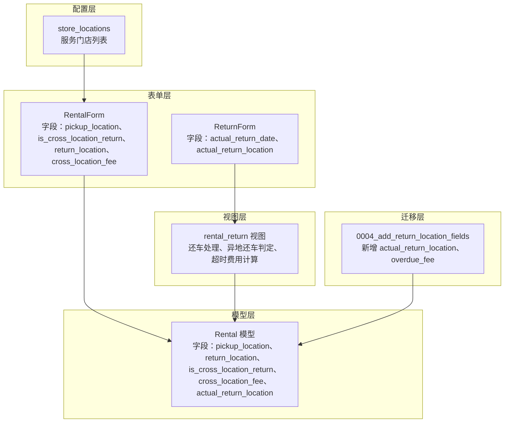
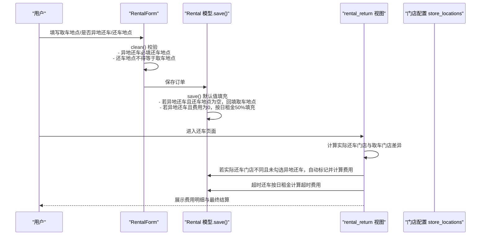
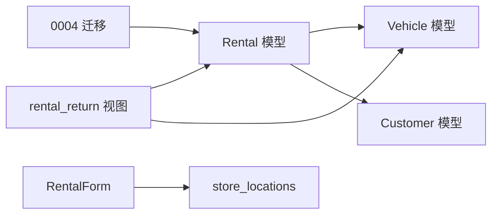

# 取还车地点设计

<cite>
**本文引用的文件**
- [models.py](file://code/car_rental_system/rentals/models.py)
- [forms.py](file://code/car_rental_system/rentals/forms.py)
- [views.py](file://code/car_rental_system/rentals/views.py)
- [store_locations.py](file://code/car_rental_system/accounts/store_locations.py)
- [0004_add_return_location_fields.py](file://code/car_rental_system/rentals/migrations/0004_add_return_location_fields.py)
- [order_create.html](file://code/car_rental_system/templates/accounts/order_create.html)
- [还车逻辑修改说明.md](file://code/car_rental_system/还车逻辑修改说明.md)
</cite>

## 目录
1. [引言](#引言)
2. [项目结构](#项目结构)
3. [核心组件](#核心组件)
4. [架构概览](#架构概览)
5. [详细组件分析](#详细组件分析)
6. [依赖分析](#依赖分析)
7. [性能考量](#性能考量)
8. [故障排查指南](#故障排查指南)
9. [结论](#结论)
10. [附录](#附录)

## 引言
本文件系统化梳理 Rental 模型中与取还车地点相关的字段设计，包括取车地点、还车地点、是否异地还车、异地还车费用、实际还车门店等，并结合表单与视图逻辑，阐明字段间的业务规则与默认值填充策略。重点覆盖以下要点：
- 当 is_cross_location_return 为真时，return_location 必须有效且与 pickup_location 不同。
- 异地还车费用默认为日租金的 50%，若实际还车门店不在服务门店范围内，费用将按规则上浮。
- 实际还车门店与取车门店不一致时，系统会自动识别并计算异地还车费用。
- save 方法中的默认值填充规则与表单 clean 的校验规则协同工作，保证数据一致性。
- 提供 ORM 查询示例与业务场景应用说明。

## 项目结构
围绕取还车地点设计的关键文件分布如下：
- 模型层：Rental 字段定义与默认值填充逻辑
- 表单层：字段展示、默认值与跨字段校验
- 视图层：还车流程中的实际还车地点判定与费用计算
- 门店配置：服务门店列表与前端交互
- 迁移文件：新增实际还车门店与超时费用字段

图表来源
- [models.py](file://code/car_rental_system/rentals/models.py#L83-L108)
- [forms.py](file://code/car_rental_system/rentals/forms.py#L11-L21)
- [views.py](file://code/car_rental_system/rentals/views.py#L279-L392)
- [store_locations.py](file://code/car_rental_system/accounts/store_locations.py#L61-L79)
- [0004_add_return_location_fields.py](file://code/car_rental_system/rentals/migrations/0004_add_return_location_fields.py#L15-L41)

章节来源
- [models.py](file://code/car_rental_system/rentals/models.py#L83-L108)
- [forms.py](file://code/car_rental_system/rentals/forms.py#L11-L21)
- [views.py](file://code/car_rental_system/rentals/views.py#L279-L392)
- [store_locations.py](file://code/car_rental_system/accounts/store_locations.py#L61-L79)
- [0004_add_return_location_fields.py](file://code/car_rental_system/rentals/migrations/0004_add_return_location_fields.py#L15-L41)

## 核心组件
- 取车地点 pickup_location：字符串，取车地址或门店名称，默认值为“门店”。
- 还车地点 return_location：字符串，还车地址或门店名称，允许为空，仅在异地还车时生效。
- 是否异地还车 is_cross_location_return：布尔值，默认 False；勾选后要求 return_location 有效且与 pickup_location 不同。
- 异地还车费用 cross_location_fee：金额字段，默认 0，当 is_cross_location_return 为真且费用为 0 时，按日租金的 50% 自动填充。
- 实际还车门店 actual_return_location：字符串，记录实际还车门店，还车流程中可为空，默认使用取车门店。

章节来源
- [models.py](file://code/car_rental_system/rentals/models.py#L83-L108)
- [forms.py](file://code/car_rental_system/rentals/forms.py#L11-L21)
- [views.py](file://code/car_rental_system/rentals/views.py#L279-L392)

## 架构概览
取还车地点相关流程涉及从前端表单到模型保存再到还车视图处理的完整链路。

图表来源
- [forms.py](file://code/car_rental_system/rentals/forms.py#L212-L274)
- [models.py](file://code/car_rental_system/rentals/models.py#L246-L271)
- [views.py](file://code/car_rental_system/rentals/views.py#L279-L392)
- [store_locations.py](file://code/car_rental_system/accounts/store_locations.py#L61-L79)

## 详细组件分析

### 字段定义与默认值填充
- 字段定义
  - 取车地点：字符串，最大长度 200，默认“门店”。
  - 还车地点：字符串，最大长度 200，允许为空。
  - 是否异地还车：布尔，默认 False。
  - 异地还车费用：金额，默认 0。
  - 实际还车门店：字符串，最大长度 200，允许为空。
- 默认值填充规则（模型 save）
  - 若 is_cross_location_return 为真且 return_location 为空，则回填为 pickup_location。
  - 若 is_cross_location_return 为真且 cross_location_fee 为 0，则按 vehicle.daily_rate × 0.5 自动填充。
- 迁移补充
  - 新增 actual_return_location 与 overdue_fee 字段，支持还车记录与超时费用统计。

章节来源
- [models.py](file://code/car_rental_system/rentals/models.py#L83-L108)
- [models.py](file://code/car_rental_system/rentals/models.py#L246-L271)
- [0004_add_return_location_fields.py](file://code/car_rental_system/rentals/migrations/0004_add_return_location_fields.py#L15-L41)

### 表单层校验与交互
- 字段展示与默认值
  - 创建新订单时，pickup_location 默认“门店”，is_cross_location_return 默认 False，cross_location_fee 默认 0。
  - 还车地点下拉框包含服务门店列表与“其他”选项，隐藏输入框用于非服务门店。
- 跨字段校验
  - 若勾选异地还车，还车地点必填且不得与取车地点相同。
  - 若还车地点不在服务门店范围内，cross_location_fee 将按日租金 50% 的 1.5 倍自动提升。
  - 若未勾选异地还车，还车地点与费用会被清空。
- 前端交互
  - 勾选“是否异地还车”后显示还车地点选择器；选择“其他”时弹出手动输入框并提示费用上浮规则。

章节来源
- [forms.py](file://code/car_rental_system/rentals/forms.py#L88-L121)
- [forms.py](file://code/car_rental_system/rentals/forms.py#L110-L121)
- [forms.py](file://code/car_rental_system/rentals/forms.py#L212-L274)
- [order_create.html](file://code/car_rental_system/templates/accounts/order_create.html#L98-L157)
- [order_create.html](file://code/car_rental_system/templates/accounts/order_create.html#L407-L461)
- [store_locations.py](file://code/car_rental_system/accounts/store_locations.py#L61-L79)

### 还车流程与实际还车判定
- 实际还车门店与取车门店不一致即视为实际异地还车。
- 若租车时未勾选异地还车但实际异地还车，系统自动：
  - 标记 is_cross_location_return 为真
  - 设置 return_location 为实际还车门店
  - 按日租金 50% 计算 cross_location_fee
- 超时还车：若 actual_return_date > end_date，按超时天数 × 日租金计算 overdue_fee。
- 完成还车后，订单状态置为已完成，车辆状态更新为可用（若无其他进行中订单），并尝试退还押金。

章节来源
- [views.py](file://code/car_rental_system/rentals/views.py#L279-L392)
- [还车逻辑修改说明.md](file://code/car_rental_system/还车逻辑修改说明.md#L106-L142)

### 业务规则与字段间关系
- 异地还车前提条件
  - is_cross_location_return 为真时，return_location 必须有效且与 pickup_location 不同。
  - 若 return_location 为空，save 会回填为 pickup_location，但表单 clean 会进一步强制要求还车地点有效且与取车地点不同。
- 费用规则
  - 默认异地还车费用 = 日租金 × 50%。
  - 若实际还车门店不在服务门店范围内，费用按 1.5 倍上浮。
- 实际还车判定
  - 以 actual_return_location 与 pickup_location 的差异为准，若不同则自动计算费用并标记为异地还车。

章节来源
- [models.py](file://code/car_rental_system/rentals/models.py#L246-L271)
- [forms.py](file://code/car_rental_system/rentals/forms.py#L212-L274)
- [views.py](file://code/car_rental_system/rentals/views.py#L279-L392)
- [store_locations.py](file://code/car_rental_system/accounts/store_locations.py#L61-L79)

### ORM 查询示例与业务应用
- 查询所有异地还车订单
  - 示例路径：[ORM 查询示例](file://code/car_rental_system/rentals/models.py#L246-L271)
  - 说明：通过过滤 is_cross_location_return=True 即可筛选异地还车订单，便于运营统计与报表分析。
- 结合还车流程的实际应用
  - 在还车页面，系统会根据实际还车门店与取车门店差异自动识别是否异地还车并计算费用，无需人工干预。
  - 对于非服务门店还车，前端明确提示费用上浮规则，提升透明度与用户体验。

章节来源
- [models.py](file://code/car_rental_system/rentals/models.py#L246-L271)
- [views.py](file://code/car_rental_system/rentals/views.py#L279-L392)
- [order_create.html](file://code/car_rental_system/templates/accounts/order_create.html#L134-L157)

## 依赖分析
- 模型依赖
  - Rental 依赖 Vehicle（日租金）与 Customer（会员等级影响押金与折扣）。
- 表单依赖
  - RentalForm 依赖 store_locations.ALL_STORES 生成还车地点下拉选项。
- 视图依赖
  - rental_return 依赖 Vehicle.daily_rate 与 Rental.calculate_order_total 等模型方法。
- 迁移依赖
  - 0004 迁移新增 actual_return_location 与 overdue_fee，支撑还车与超时费用记录。

图表来源
- [models.py](file://code/car_rental_system/rentals/models.py#L1-L401)
- [forms.py](file://code/car_rental_system/rentals/forms.py#L11-L21)
- [views.py](file://code/car_rental_system/rentals/views.py#L279-L392)
- [store_locations.py](file://code/car_rental_system/accounts/store_locations.py#L61-L79)
- [0004_add_return_location_fields.py](file://code/car_rental_system/rentals/migrations/0004_add_return_location_fields.py#L15-L41)

## 性能考量
- 字段索引
  - 模型已为 start_date、end_date、status、customer+status、vehicle+status 等建立索引，有助于订单列表与筛选查询的性能。
- 查询优化
  - 列表页使用 select_related 减少 N+1 查询。
  - 筛选参数与分页配合，降低前端渲染压力。
- 计算开销
  - save 中的默认值填充与 clean 中的跨字段校验均为轻量级计算，对性能影响较小。
- 建议
  - 对高频查询（如按 is_cross_location_return 过滤）可考虑添加复合索引以进一步提升查询效率。

章节来源
- [models.py](file://code/car_rental_system/rentals/models.py#L158-L169)
- [views.py](file://code/car_rental_system/rentals/views.py#L60-L126)

## 故障排查指南
- 表单校验错误
  - “选择异地还车时，必须填写还车地点”：确认勾选了“是否异地还车”，并正确选择服务门店或填写“其他”还车地点。
  - “异地还车时，还车地点不能与取车地点相同”：修正还车地点，确保与取车地点不同。
- 还车异常
  - 实际还车门店与取车地点相同：系统不会产生异地还车费用，若期望费用，请确保实际还车门店不同。
  - 非服务门店还车费用未上浮：确认前端选择了“其他”还车地点，系统会按 1.5 倍上浮。
- 数据一致性
  - 若 save 后发现费用未按预期填充，检查 vehicle.daily_rate 是否存在以及 is_cross_location_return 的勾选状态。

章节来源
- [forms.py](file://code/car_rental_system/rentals/forms.py#L212-L274)
- [models.py](file://code/car_rental_system/rentals/models.py#L246-L271)
- [views.py](file://code/car_rental_system/rentals/views.py#L279-L392)

## 结论
取还车地点设计通过字段定义、表单校验与视图逻辑的协同，实现了清晰的业务规则与良好的用户体验：
- 明确的异地还车前提条件与默认值填充策略，减少人工干预。
- 前端交互与后端校验共同保障数据质量。
- 还车流程自动识别实际异地还车并计算费用，提升运营效率。
- ORM 查询简单直观，便于业务统计与报表分析。

## 附录
- 业务场景建议
  - 运营侧：定期导出 is_cross_location_return=True 的订单，分析异地还车占比与收入贡献。
  - 客服侧：针对非服务门店还车的订单，提前向客户说明费用上浮规则，避免争议。
  - 技术侧：持续监控相关字段的索引与查询性能，必要时引入复合索引优化。