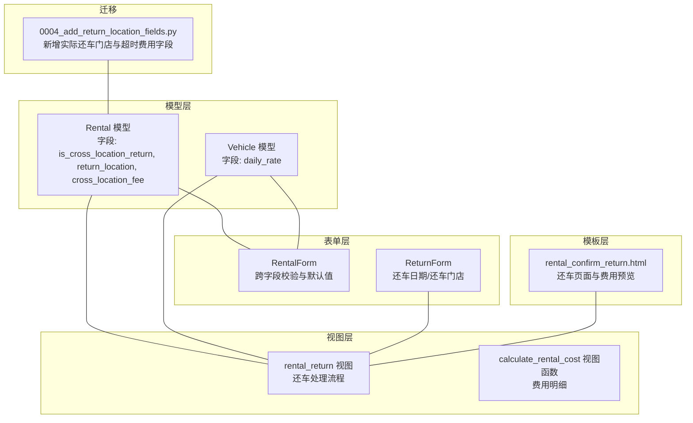
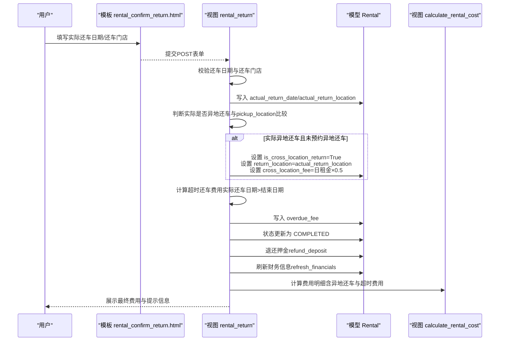
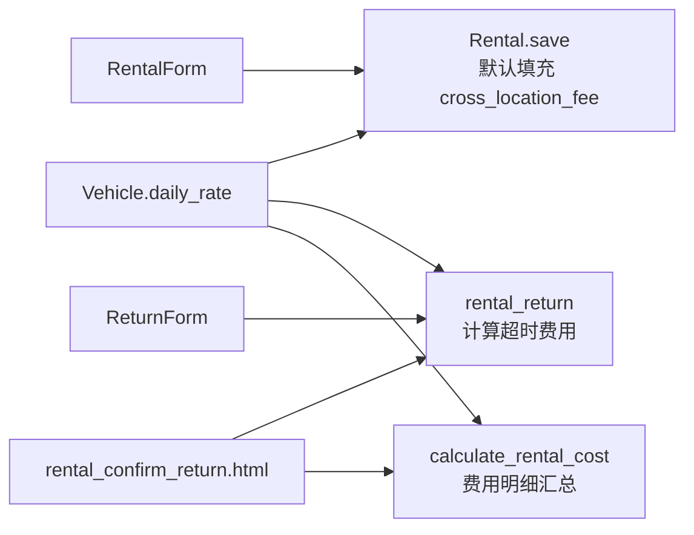

# 异地还车处理

<cite>
**本文引用的文件**
- [models.py](file://code/car_rental_system/rentals/models.py)
- [views.py](file://code/car_rental_system/rentals/views.py)
- [forms.py](file://code/car_rental_system/rentals/forms.py)
- [0004_add_return_location_fields.py](file://code/car_rental_system/rentals/migrations/0004_add_return_location_fields.py)
- [vehicles/models.py](file://code/car_rental_system/vehicles/models.py)
- [rental_confirm_return.html](file://code/car_rental_system/templates/rentals/rental_confirm_return.html)
</cite>

## 目录
1. [简介](#简介)
2. [项目结构](#项目结构)
3. [核心组件](#核心组件)
4. [架构总览](#架构总览)
5. [详细组件分析](#详细组件分析)
6. [依赖关系分析](#依赖关系分析)
7. [性能考量](#性能考量)
8. [故障排查指南](#故障排查指南)
9. [结论](#结论)
10. [附录](#附录)

## 简介
本文件系统化梳理“异地还车”处理机制，围绕以下关键字段展开：
- is_cross_location_return：是否异地还车的布尔开关
- return_location：预约的还车地点（异地还车时填写）
- cross_location_fee：异地还车费用

重点说明三者协同工作原理、业务规则、前后端联动、费用叠加与财务结算体现，并给出rental_return视图中的处理流程与示例路径。

## 项目结构
围绕异地还车的关键代码分布在以下模块：
- 模型层：Rental模型新增字段与默认值填充逻辑
- 表单层：创建/更新表单对异地还车字段的校验与默认值处理
- 视图层：还车处理流程（判断异地还车、计算费用、状态更新）
- 模板层：还车页面对字段的展示与前端费用预览
- 车辆模型：提供日租金daily_rate用于费用计算

图表来源
- [models.py](file://code/car_rental_system/rentals/models.py#L1-L120)
- [forms.py](file://code/car_rental_system/rentals/forms.py#L1-L120)
- [views.py](file://code/car_rental_system/rentals/views.py#L279-L392)
- [rental_confirm_return.html](file://code/car_rental_system/templates/rentals/rental_confirm_return.html#L150-L210)
- [0004_add_return_location_fields.py](file://code/car_rental_system/rentals/migrations/0004_add_return_location_fields.py#L1-L42)

章节来源
- [models.py](file://code/car_rental_system/rentals/models.py#L1-L120)
- [forms.py](file://code/car_rental_system/rentals/forms.py#L1-L120)
- [views.py](file://code/car_rental_system/rentals/views.py#L279-L392)
- [rental_confirm_return.html](file://code/car_rental_system/templates/rentals/rental_confirm_return.html#L150-L210)
- [0004_add_return_location_fields.py](file://code/car_rental_system/rentals/migrations/0004_add_return_location_fields.py#L1-L42)

## 核心组件
- Rental模型字段
  - is_cross_location_return：是否异地还车（默认False）
  - return_location：预约还车地点（异地还车时填写）
  - cross_location_fee：异地还车费用（默认0）
  - actual_return_location：实际还车门店（由还车视图写入）
  - overdue_fee：超时还车费用（由还车视图写入）
- 表单校验
  - 创建/更新表单：当is_cross_location_return为True时，要求return_location非空且与pickup_location不同
  - 还车表单：校验实际还车日期不晚于今天
- 视图处理
  - rental_return：判断实际还车是否异地，计算并叠加费用，更新状态为已完成
  - calculate_rental_cost：费用明细汇总（含异地还车与超时费用）

章节来源
- [models.py](file://code/car_rental_system/rentals/models.py#L83-L110)
- [forms.py](file://code/car_rental_system/rentals/forms.py#L212-L275)
- [views.py](file://code/car_rental_system/rentals/views.py#L279-L392)
- [views.py](file://code/car_rental_system/rentals/views.py#L487-L534)

## 架构总览
异地还车处理涉及从前端到后端再到财务结算的完整链路。

图表来源
- [views.py](file://code/car_rental_system/rentals/views.py#L279-L392)
- [views.py](file://code/car_rental_system/rentals/views.py#L487-L534)
- [models.py](file://code/car_rental_system/rentals/models.py#L246-L271)
- [rental_confirm_return.html](file://code/car_rental_system/templates/rentals/rental_confirm_return.html#L150-L210)

## 详细组件分析

### 字段协同与业务规则
- 字段定义与默认值
  - is_cross_location_return：默认False
  - return_location：默认空，仅在异地还车时填写
  - cross_location_fee：默认0，当满足异地还车条件时自动填充
- 业务规则
  - 当is_cross_location_return为True时，return_location不能为空
  - 系统通过比较actual_return_location与pickup_location判断是否为“实际异地还车”
  - 当租车时未预约但实际异地还车时，系统自动计算异地还车费用（默认为日租金的50%），并设置is_cross_location_return为True、return_location为实际还车地点
- 模型save方法中的默认值填充逻辑
  - 若is_cross_location_return为True且return_location为空，则使用pickup_location作为return_location
  - 若is_cross_location_return为True且cross_location_fee为0，则设置为vehicle.daily_rate × 0.5

章节来源
- [models.py](file://code/car_rental_system/rentals/models.py#L83-L110)
- [models.py](file://code/car_rental_system/rentals/models.py#L246-L271)
- [forms.py](file://code/car_rental_system/rentals/forms.py#L212-L275)

### 表单层校验与默认值
- 创建/更新表单（RentalForm）
  - 当is_cross_location_return为True：return_location必填，且不得等于pickup_location
  - 当is_cross_location_return为False：清理return_location与cross_location_fee
  - cross_location_fee默认隐藏输入，允许手动覆盖
- 还车表单（ReturnForm）
  - actual_return_date必填，且不能晚于今天
  - actual_return_location可选，为空时使用pickup_location

章节来源
- [forms.py](file://code/car_rental_system/rentals/forms.py#L1-L120)
- [forms.py](file://code/car_rental_system/rentals/forms.py#L212-L275)
- [forms.py](file://code/car_rental_system/rentals/forms.py#L312-L351)

### 视图层还车处理流程
- rental_return视图
  - 仅对状态为“进行中”或“已超时未归还”的订单允许还车
  - 接收actual_return_date与actual_return_location
  - 若未填写actual_return_location，默认使用pickup_location
  - 判断实际是否异地还车（与pickup_location比较）
  - 若租车时未预约异地还车但实际异地还车：
    - 设置is_cross_location_return=True
    - return_location=actual_return_location
    - cross_location_fee=vehicle.daily_rate × 0.5
  - 若实际还车日期超过结束日期，计算超时还车费用（按日租金计算）
  - 状态更新为“已完成”，车辆状态更新为“可用”
  - 退还押金并刷新财务信息
  - 计算费用明细并返回结果
- calculate_rental_cost视图函数
  - 汇总基础费用、VIP折扣、超时费用、异地还车费用与押金
  - 若订单未标记为异地还车，则不计入cross_location_fee

章节来源
- [views.py](file://code/car_rental_system/rentals/views.py#L279-L392)
- [views.py](file://code/car_rental_system/rentals/views.py#L487-L534)

### 前端展示与交互
- 还车页面模板
  - 展示取车信息与还车说明
  - 提供实际还车日期与还车门店输入
  - 前端脚本根据还车日期与还车门店动态计算基础费用、超时费用与异地还车费用
  - 当实际还车门店与取车门店不同时，提示将自动增加异地还车费用

章节来源
- [rental_confirm_return.html](file://code/car_rental_system/templates/rentals/rental_confirm_return.html#L150-L210)
- [rental_confirm_return.html](file://code/car_rental_system/templates/rentals/rental_confirm_return.html#L233-L312)

### 费用叠加与财务结算
- 费用叠加规则
  - 异地还车费用与超时还车费用可同时存在
  - 异地还车费用默认为日租金的50%，若实际还车地点不在服务门店范围内，系统在创建/更新表单阶段会按日租金×0.5×1.5进行调整（此规则在创建/更新阶段生效，还车阶段主要依据实际还车地点与是否预约异地还车）
- 结算体现
  - calculate_order_total：返回基础租金+押金+异地还车费用+超时费用
  - refresh_financials：根据支付记录刷新amount_paid/amount_refunded/settlement_status
  - 当订单状态为“已完成”且应付总额≤已支付金额时，结算状态为“已结算”

章节来源
- [models.py](file://code/car_rental_system/rentals/models.py#L286-L333)
- [models.py](file://code/car_rental_system/rentals/models.py#L334-L401)
- [views.py](file://code/car_rental_system/rentals/views.py#L487-L534)

## 依赖关系分析
- 模型依赖
  - Rental依赖Vehicle（daily_rate）用于费用计算
- 视图依赖
  - rental_return依赖ReturnForm、Rental.auto_update_status、Rental.refund_deposit、Rental.refresh_financials
  - calculate_rental_cost依赖Rental.calculate_order_total与Payment聚合统计
- 模板依赖
  - rental_confirm_return.html依赖ReturnForm字段与前端脚本进行费用预览

图表来源
- [models.py](file://code/car_rental_system/rentals/models.py#L246-L271)
- [views.py](file://code/car_rental_system/rentals/views.py#L279-L392)
- [views.py](file://code/car_rental_system/rentals/views.py#L487-L534)
- [forms.py](file://code/car_rental_system/rentals/forms.py#L312-L351)
- [vehicles/models.py](file://code/car_rental_system/vehicles/models.py#L45-L51)

章节来源
- [models.py](file://code/car_rental_system/rentals/models.py#L246-L271)
- [views.py](file://code/car_rental_system/rentals/views.py#L279-L392)
- [views.py](file://code/car_rental_system/rentals/views.py#L487-L534)
- [forms.py](file://code/car_rental_system/rentals/forms.py#L312-L351)
- [vehicles/models.py](file://code/car_rental_system/vehicles/models.py#L45-L51)

## 性能考量
- 状态自动更新采用缓存策略，避免频繁更新（每5分钟最多更新一次）
- 还车页面前端脚本在用户输入时即时计算费用，减少后端压力
- 财务刷新使用聚合查询，降低数据库访问次数

章节来源
- [models.py](file://code/car_rental_system/rentals/models.py#L171-L229)
- [views.py](file://code/car_rental_system/rentals/views.py#L1-L59)
- [views.py](file://code/car_rental_system/rentals/views.py#L487-L534)

## 故障排查指南
- 异地还车未预约但实际异地还车
  - 现象：还车后未产生异地还车费用
  - 处理：确认actual_return_location与pickup_location是否不同；若不同且is_cross_location_return为False，系统会在还车时自动设置is_cross_location_return=True并填充cross_location_fee=日租金×0.5
  - 参考路径：[views.py](file://code/car_rental_system/rentals/views.py#L306-L322)
- 预约异地还车但未填写还车地点
  - 现象：创建/更新表单校验失败
  - 处理：当is_cross_location_return为True时，return_location必须填写且与pickup_location不同
  - 参考路径：[forms.py](file://code/car_rental_system/rentals/forms.py#L228-L235)
- 还车日期晚于今天
  - 现象：还车表单校验失败
  - 处理：actual_return_date不得晚于今天
  - 参考路径：[forms.py](file://code/car_rental_system/rentals/forms.py#L334-L343)
- 超时还车费用未计算
  - 现象：实际还车日期超过结束日期但未产生超时费用
  - 处理：确认actual_return_date是否大于end_date；系统会按日租金计算超时费用
  - 参考路径：[views.py](file://code/car_rental_system/rentals/views.py#L324-L331)
- 结算状态异常
  - 现象：订单已完成但结算状态仍为未结算
  - 处理：确认amount_paid是否达到calculate_order_total；refresh_financials会根据支付记录更新结算状态
  - 参考路径：[models.py](file://code/car_rental_system/rentals/models.py#L286-L333)

章节来源
- [views.py](file://code/car_rental_system/rentals/views.py#L279-L392)
- [forms.py](file://code/car_rental_system/rentals/forms.py#L212-L275)
- [models.py](file://code/car_rental_system/rentals/models.py#L286-L333)

## 结论
异地还车处理通过is_cross_location_return、return_location与cross_location_fee三个字段协同实现：
- 预约阶段：RentalForm严格校验异地还车条件，确保return_location有效
- 还车阶段：views根据实际还车地点与预约状态自动填充费用与字段，并叠加超时还车费用
- 财务结算：calculate_order_total与refresh_financials保证费用与结算状态一致

该机制既支持“预约异地还车”的标准流程，也兼容“未预约但实际异地还车”的场景，确保业务规则清晰、可追溯、可结算。

## 附录
- 关键字段定义与默认值
  - is_cross_location_return：默认False
  - return_location：默认空
  - cross_location_fee：默认0，系统在满足条件时自动填充为日租金×0.5
- 还车视图处理示例路径
  - 还车处理主流程：[views.py](file://code/car_rental_system/rentals/views.py#L279-L392)
  - 费用明细汇总：[views.py](file://code/car_rental_system/rentals/views.py#L487-L534)
- 前端费用预览
  - 还车页面模板与脚本：[rental_confirm_return.html](file://code/car_rental_system/templates/rentals/rental_confirm_return.html#L150-L210)