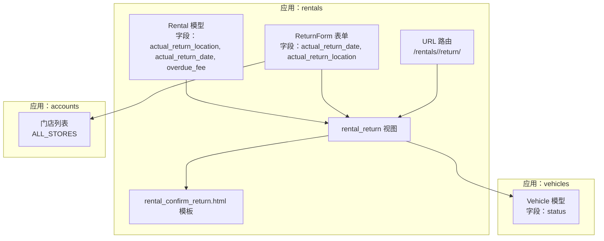
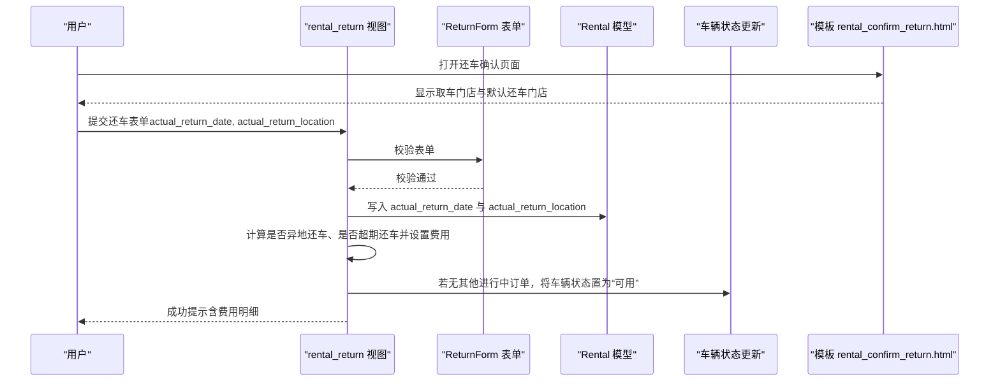
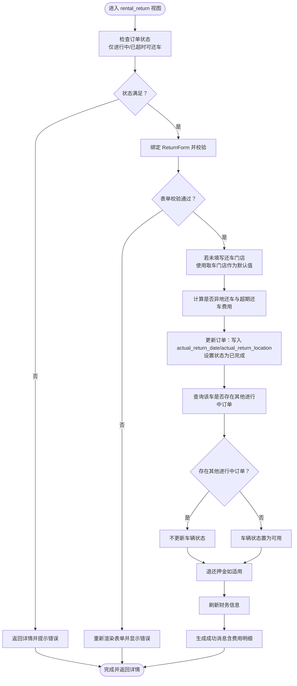
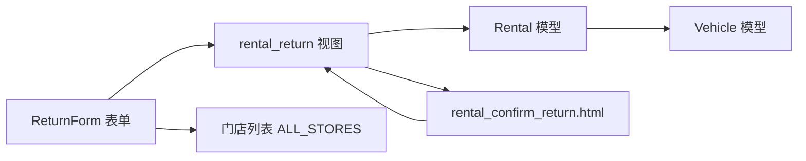

# 还车管理

<cite>
**本文引用的文件**
- [models.py](file://code/car_rental_system/rentals/models.py)
- [views.py](file://code/car_rental_system/rentals/views.py)
- [forms.py](file://code/car_rental_system/rentals/forms.py)
- [rental_confirm_return.html](file://code/car_rental_system/templates/rentals/rental_confirm_return.html)
- [0004_add_return_location_fields.py](file://code/car_rental_system/rentals/migrations/0004_add_return_location_fields.py)
- [store_locations.py](file://code/car_rental_system/accounts/store_locations.py)
- [urls.py](file://code/car_rental_system/rentals/urls.py)
- [vehicles/models.py](file://code/car_rental_system/vehicles/models.py)
</cite>

## 目录
1. [简介](#简介)
2. [项目结构](#项目结构)
3. [核心组件](#核心组件)
4. [架构总览](#架构总览)
5. [详细组件分析](#详细组件分析)
6. [依赖关系分析](#依赖关系分析)
7. [性能考量](#性能考量)
8. [故障排查指南](#故障排查指南)
9. [结论](#结论)

## 简介
本章节系统化梳理“还车管理”功能，重点围绕字段 actual_return_location 的设计与实现展开，覆盖以下要点：
- 当用户未填写实际还车门店时，默认使用取车门店的业务规则；
- rental_return 视图的状态检查（仅“进行中”状态可还车）与实际还车日期验证（不能早于开始日期且不能晚于今天）；
- ReturnForm 表单对实际还车门店字段的处理；
- 前端模板 rental_confirm_return.html 中还车门店输入框的实现；
- 还车操作对车辆状态的影响：当车辆没有其他进行中订单时，自动将车辆状态更新为“可用”。

## 项目结构
还车管理涉及的模块与文件如下：
- 模型层：Rental 模型（含 actual_return_location、actual_return_date、overdue_fee 等字段）
- 表单层：ReturnForm（含 actual_return_date、actual_return_location 字段及校验）
- 视图层：rental_return 视图（还车处理主流程）
- 模板层：rental_confirm_return.html（还车确认页面）
- 车辆模型：Vehicle（用于还车后车辆状态更新）
- URL：rentals 应用路由映射到 rental_return 视图
- 迁移：0004_add_return_location_fields.py（新增 actual_return_location 与 overdue_fee）

图表来源
- [models.py](file://code/car_rental_system/rentals/models.py#L1-L120)
- [forms.py](file://code/car_rental_system/rentals/forms.py#L312-L364)
- [views.py](file://code/car_rental_system/rentals/views.py#L279-L392)
- [rental_confirm_return.html](file://code/car_rental_system/templates/rentals/rental_confirm_return.html#L150-L216)
- [urls.py](file://code/car_rental_system/rentals/urls.py#L9-L22)
- [vehicles/models.py](file://code/car_rental_system/vehicles/models.py#L1-L85)
- [store_locations.py](file://code/car_rental_system/accounts/store_locations.py#L1-L79)

章节来源
- [models.py](file://code/car_rental_system/rentals/models.py#L1-L120)
- [views.py](file://code/car_rental_system/rentals/views.py#L279-L392)
- [forms.py](file://code/car_rental_system/rentals/forms.py#L312-L364)
- [rental_confirm_return.html](file://code/car_rental_system/templates/rentals/rental_confirm_return.html#L150-L216)
- [urls.py](file://code/car_rental_system/rentals/urls.py#L9-L22)
- [vehicles/models.py](file://code/car_rental_system/vehicles/models.py#L1-L85)
- [store_locations.py](file://code/car_rental_system/accounts/store_locations.py#L1-L79)

## 核心组件
- Rental 模型
  - 字段：actual_return_location（实际还车门店）、actual_return_date（实际还车日期）、overdue_fee（超时还车费用）
  - clean 方法：对实际还车日期进行约束（不能早于开始日期、不能晚于今天）
- ReturnForm 表单
  - 字段：actual_return_date、actual_return_location
  - 校验：还车日期不能晚于今天；还车门店可为空，为空时由后端默认取取车门店
- rental_return 视图
  - 状态检查：仅“进行中”或“已超时未归还”的订单允许还车
  - 日期与门店处理：未填门店则默认取取车门店；超期还车按日租金计算超时费用；如实际异地还车且未预约异地还车，追加异地还车费用
  - 车辆状态更新：若该车无其他进行中订单，车辆状态置为“可用”
- 前端模板 rental_confirm_return.html
  - 提供实际还车日期与实际还车门店输入框
  - 若未填写还车门店，默认使用取车门店
  - 展示还车说明与费用预览（前端 JS 计算）

章节来源
- [models.py](file://code/car_rental_system/rentals/models.py#L47-L60)
- [models.py](file://code/car_rental_system/rentals/models.py#L230-L245)
- [forms.py](file://code/car_rental_system/rentals/forms.py#L312-L364)
- [views.py](file://code/car_rental_system/rentals/views.py#L279-L392)
- [rental_confirm_return.html](file://code/car_rental_system/templates/rentals/rental_confirm_return.html#L150-L216)

## 架构总览
还车流程的关键交互如下：

图表来源
- [views.py](file://code/car_rental_system/rentals/views.py#L279-L392)
- [forms.py](file://code/car_rental_system/rentals/forms.py#L312-L364)
- [models.py](file://code/car_rental_system/rentals/models.py#L47-L60)
- [vehicles/models.py](file://code/car_rental_system/vehicles/models.py#L1-L85)
- [rental_confirm_return.html](file://code/car_rental_system/templates/rentals/rental_confirm_return.html#L150-L216)

## 详细组件分析

### 字段设计：actual_return_location
- 数据模型层面
  - 字段类型：CharField，最大长度 200，支持空值
  - 用途：记录用户实际还车的门店名称
- 迁移层面
  - 通过迁移文件新增字段，便于历史数据兼容与版本演进
- 业务规则
  - 用户未填写时，默认使用取车门店（pickup_location），保证还车流程的可用性与一致性

章节来源
- [models.py](file://code/car_rental_system/rentals/models.py#L47-L60)
- [0004_add_return_location_fields.py](file://code/car_rental_system/rentals/migrations/0004_add_return_location_fields.py#L1-L42)

### 表单处理：ReturnForm
- 字段与标签
  - actual_return_date：必填，日期输入框
  - actual_return_location：可选，文本输入框
- 校验逻辑
  - actual_return_date：不能晚于今天
  - actual_return_location：可为空，为空时由视图层默认取取车门店
- 与门店列表的关系
  - 表单本身不直接绑定门店下拉，但前端模板提供门店选择辅助（见后续模板分析）

章节来源
- [forms.py](file://code/car_rental_system/rentals/forms.py#L312-L364)

### 视图流程：rental_return
- 状态检查
  - 仅当订单状态为“进行中”或“已超时未归还”时允许还车
- 日期与门店处理
  - 未填写 actual_return_location 时，使用 rental.pickup_location 作为默认值
  - 计算是否实际异地还车（与取车门店不同）
  - 若租车时未预约异地还车但实际异地还车，追加异地还车费用
  - 若实际还车日期晚于结束日期，按日租金计算超时费用
- 订单与车辆状态更新
  - 订单状态置为“已完成”
  - 检查该车辆是否还有其他进行中订单，若无则车辆状态置为“可用”
- 财务与通知
  - 退还押金（如适用）
  - 刷新财务信息
  - 生成包含费用明细的成功消息

图表来源
- [views.py](file://code/car_rental_system/rentals/views.py#L279-L392)

章节来源
- [views.py](file://code/car_rental_system/rentals/views.py#L279-L392)

### 前端模板：rental_confirm_return.html
- 输入控件
  - 实际还车日期：日期输入框，必填
  - 实际还车门店：文本输入框，可选；若为空，默认使用取车门店
- 取车信息展示
  - 显示取车门店与是否预约异地还车的信息
- 费用预览
  - 前端 JS 根据实际还车日期与还车门店计算基础费用、VIP 折扣、超期还车费用、异地还车费用，并实时展示
- 行为说明
  - 提交按钮触发确认对话框
  - 页面提供还车说明与注意事项

章节来源
- [rental_confirm_return.html](file://code/car_rental_system/templates/rentals/rental_confirm_return.html#L150-L216)
- [rental_confirm_return.html](file://code/car_rental_system/templates/rentals/rental_confirm_return.html#L233-L312)

### 车辆状态影响
- 还车完成后，系统检查该车辆是否仍有其他“进行中”订单
- 若无其他进行中订单，车辆状态从“已租”更新为“可用”
- 该逻辑确保车辆资源的正确释放与后续调度

章节来源
- [views.py](file://code/car_rental_system/rentals/views.py#L336-L346)
- [vehicles/models.py](file://code/car_rental_system/vehicles/models.py#L1-L85)

## 依赖关系分析
- 模型依赖
  - Rental 模型依赖 Vehicle（外键）以更新车辆状态
  - Rental.clean 对实际还车日期进行约束
- 视图依赖
  - rental_return 视图依赖 ReturnForm 表单进行输入校验
  - 视图依赖 Vehicle 模型更新车辆状态
- 模板依赖
  - rental_confirm_return.html 依赖视图上下文中的 rental 与 form
  - 模板前端 JS 依赖模板中传入的取车日期、结束日期、日租金、取车门店等数据
- 门店列表
  - 表单层与门店列表模块（ALL_STORES）配合，用于表单与前端展示的门店选择

图表来源
- [forms.py](file://code/car_rental_system/rentals/forms.py#L312-L364)
- [views.py](file://code/car_rental_system/rentals/views.py#L279-L392)
- [models.py](file://code/car_rental_system/rentals/models.py#L1-L120)
- [vehicles/models.py](file://code/car_rental_system/vehicles/models.py#L1-L85)
- [store_locations.py](file://code/car_rental_system/accounts/store_locations.py#L1-L79)
- [rental_confirm_return.html](file://code/car_rental_system/templates/rentals/rental_confirm_return.html#L150-L216)

章节来源
- [forms.py](file://code/car_rental_system/rentals/forms.py#L312-L364)
- [views.py](file://code/car_rental_system/rentals/views.py#L279-L392)
- [models.py](file://code/car_rental_system/rentals/models.py#L1-L120)
- [vehicles/models.py](file://code/car_rental_system/vehicles/models.py#L1-L85)
- [store_locations.py](file://code/car_rental_system/accounts/store_locations.py#L1-L79)
- [rental_confirm_return.html](file://code/car_rental_system/templates/rentals/rental_confirm_return.html#L150-L216)

## 性能考量
- 自动状态更新
  - 模型层提供自动更新逻辑，避免频繁扫描导致的性能问题
- 查询优化
  - 视图中对车辆可用日期的查询采用聚合与过滤，减少不必要的数据库往返
- 前端计算
  - 费用预览在前端进行，减轻服务器压力，提升交互体验

章节来源
- [models.py](file://code/car_rental_system/rentals/models.py#L171-L229)
- [views.py](file://code/car_rental_system/rentals/views.py#L536-L563)
- [rental_confirm_return.html](file://code/car_rental_system/templates/rentals/rental_confirm_return.html#L233-L312)

## 故障排查指南
- 无法还车
  - 检查订单状态是否为“进行中”或“已超时未归还”，否则会被拒绝
  - 参考路径：[状态检查逻辑](file://code/car_rental_system/rentals/views.py#L286-L289)
- 还车日期无效
  - 实际还车日期不能晚于今天
  - 参考路径：[表单校验](file://code/car_rental_system/rentals/forms.py#L334-L343)
- 实际还车门店未填写
  - 若未填写，系统会默认使用取车门店
  - 参考路径：[默认取车门店逻辑](file://code/car_rental_system/rentals/views.py#L297-L300)
- 车辆状态未更新为“可用”
  - 确认该车是否还有其他“进行中”订单
  - 参考路径：[车辆状态更新逻辑](file://code/car_rental_system/rentals/views.py#L336-L346)
- 费用异常
  - 检查是否产生超期还车费用或异地还车费用
  - 参考路径：[费用计算逻辑](file://code/car_rental_system/rentals/views.py#L312-L331)

章节来源
- [views.py](file://code/car_rental_system/rentals/views.py#L279-L392)
- [forms.py](file://code/car_rental_system/rentals/forms.py#L334-L343)

## 结论
本系统通过引入 actual_return_location 字段与配套的表单、视图与模板，实现了灵活而严谨的还车管理流程：
- 用户未填写实际还车门店时，默认使用取车门店，保障流程可用性；
- 视图对订单状态与还车日期进行严格校验，确保业务合规；
- 还车完成后自动计算并记录超期与异地还车费用，并在满足条件时释放车辆资源；
- 前端模板提供费用预览与直观交互，提升用户体验。