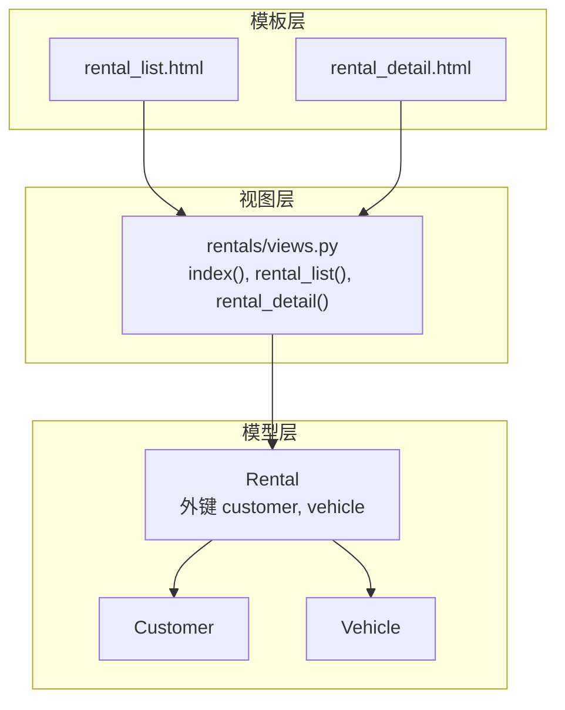
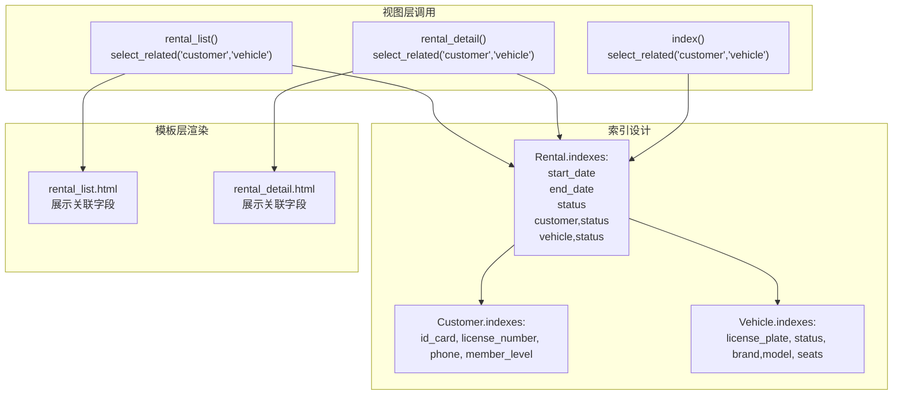
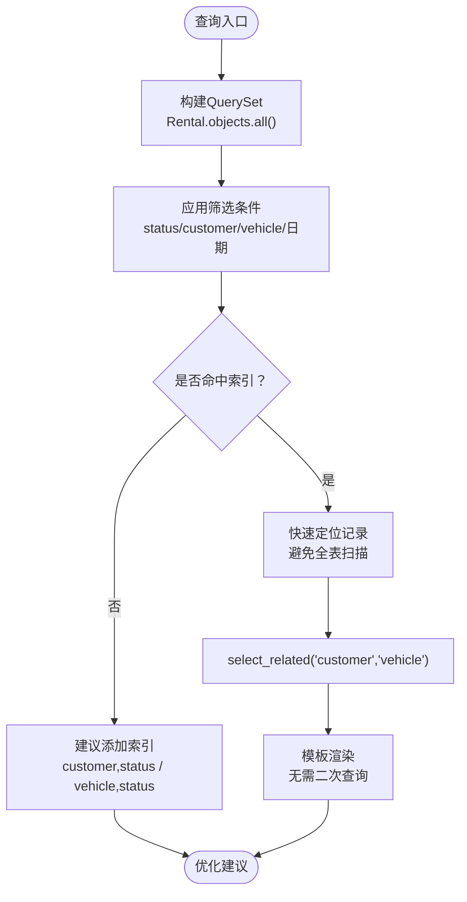
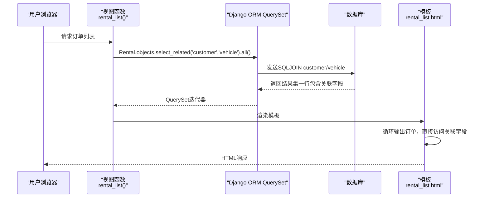
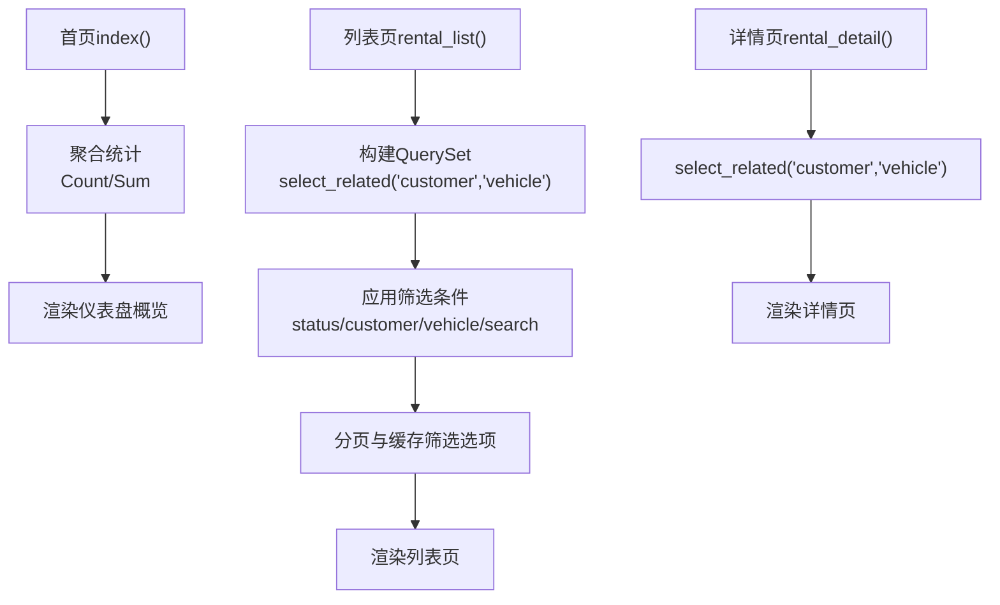
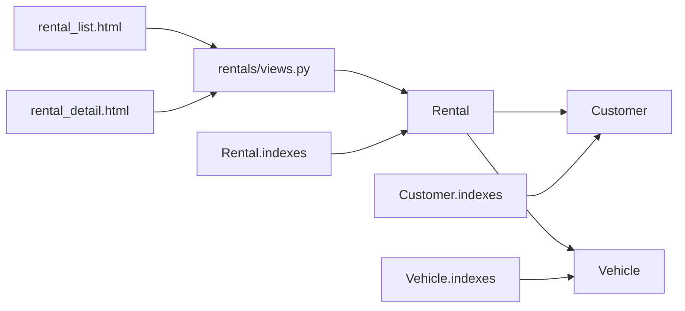

# 关联查询优化

<cite>
**本文引用的文件**
- [rentals/models.py](file://code/car_rental_system/rentals/models.py)
- [rentals/migrations/0001_initial.py](file://code/car_rental_system/rentals/migrations/0001_initial.py)
- [rentals/views.py](file://code/car_rental_system/rentals/views.py)
- [customers/models.py](file://code/car_rental_system/customers/models.py)
- [vehicles/models.py](file://code/car_rental_system/vehicles/models.py)
- [templates/rentals/rental_list.html](file://code/car_rental_system/templates/rentals/rental_list.html)
- [templates/rentals/rental_detail.html](file://code/car_rental_system/templates/rentals/rental_detail.html)
- [数据库设计总结.md](file://code/car_rental_system/数据库设计总结.md)
</cite>

## 目录
1. [简介](#简介)
2. [项目结构](#项目结构)
3. [核心组件](#核心组件)
4. [架构总览](#架构总览)
5. [详细组件分析](#详细组件分析)
6. [依赖分析](#依赖分析)
7. [性能考量](#性能考量)
8. [故障排查指南](#故障排查指南)
9. [结论](#结论)

## 简介
本文件聚焦于Rental模型的关联查询性能优化策略，围绕以下关键点展开：
- Meta类中定义的数据库索引（indexes）如何提升查询效率，尤其是针对customer、vehicle、status等字段的单列与复合索引。
- 使用Django ORM的select_related()方法减少跨表查询次数，避免N+1查询问题。
- 在订单列表与详情页面中，通过select_related('customer', 'vehicle')一次性获取关联实体，支撑高并发场景下的订单列表查询与统计报表生成。
- 结合数据库设计文档中的索引规划，说明这些优化如何协同工作以提升整体性能。

## 项目结构
本项目的模型与视图位于rentals子应用中，涉及跨表查询的关键路径如下：
- 模型层：Rental（外键关联Customer与Vehicle），Customers/Vehicles各自具备索引。
- 视图层：rentals/views.py中对列表页与详情页均采用select_related()进行关联查询。
- 模板层：rental_list.html与rental_detail.html直接渲染关联字段，体现ORM优化带来的查询效率提升。

图表来源
- [rentals/models.py](file://code/car_rental_system/rentals/models.py#L12-L169)
- [customers/models.py](file://code/car_rental_system/customers/models.py#L7-L100)
- [vehicles/models.py](file://code/car_rental_system/vehicles/models.py#L6-L85)
- [rentals/views.py](file://code/car_rental_system/rentals/views.py#L17-L151)
- [templates/rentals/rental_list.html](file://code/car_rental_system/templates/rentals/rental_list.html#L69-L199)
- [templates/rentals/rental_detail.html](file://code/car_rental_system/templates/rentals/rental_detail.html#L65-L140)

章节来源
- [rentals/models.py](file://code/car_rental_system/rentals/models.py#L12-L169)
- [rentals/views.py](file://code/car_rental_system/rentals/views.py#L17-L151)
- [templates/rentals/rental_list.html](file://code/car_rental_system/templates/rentals/rental_list.html#L69-L199)
- [templates/rentals/rental_detail.html](file://code/car_rental_system/templates/rentals/rental_detail.html#L65-L140)

## 核心组件
- Rental模型：定义了与Customer、Vehicle的外键关系，并在Meta中配置了多组索引，覆盖单列与复合索引，显著提升按状态、日期、客户与车辆维度的查询效率。
- 视图层：在首页、列表页、详情页均使用select_related('customer', 'vehicle')，避免N+1查询，提升渲染性能。
- 模板层：在列表与详情页直接访问关联字段，无需二次查询，进一步降低数据库压力。

章节来源
- [rentals/models.py](file://code/car_rental_system/rentals/models.py#L12-L169)
- [rentals/views.py](file://code/car_rental_system/rentals/views.py#L17-L151)
- [templates/rentals/rental_list.html](file://code/car_rental_system/templates/rentals/rental_list.html#L69-L199)
- [templates/rentals/rental_detail.html](file://code/car_rental_system/templates/rentals/rental_detail.html#L65-L140)

## 架构总览
下图展示了Rental模型的索引设计与其在视图层的查询调用之间的关系，体现“索引+ORM优化”的协同效果。

图表来源
- [rentals/models.py](file://code/car_rental_system/rentals/models.py#L158-L169)
- [customers/models.py](file://code/car_rental_system/customers/models.py#L89-L100)
- [vehicles/models.py](file://code/car_rental_system/vehicles/models.py#L68-L85)
- [rentals/views.py](file://code/car_rental_system/rentals/views.py#L61-L151)
- [templates/rentals/rental_list.html](file://code/car_rental_system/templates/rentals/rental_list.html#L69-L199)
- [templates/rentals/rental_detail.html](file://code/car_rental_system/templates/rentals/rental_detail.html#L65-L140)

## 详细组件分析

### 1) 索引设计与查询效率
- 单列索引
  - start_date、end_date：支持按起止日期范围的高效过滤与排序。
  - status：支持按订单状态的快速筛选与聚合。
- 复合索引
  - customer,status：在按客户与状态联合筛选时，避免回表与全表扫描，显著提升列表页筛选效率。
  - vehicle,status：在按车辆与状态联合筛选时，同样避免回表，提升查询性能。
- 迁移文件中的索引名称与字段映射
  - 迁移文件中明确声明了各索引字段，便于数据库层面的索引一致性与可维护性。

图表来源
- [rentals/migrations/0001_initial.py](file://code/car_rental_system/rentals/migrations/0001_initial.py#L33-L41)
- [rentals/models.py](file://code/car_rental_system/rentals/models.py#L158-L169)
- [rentals/views.py](file://code/car_rental_system/rentals/views.py#L61-L151)

章节来源
- [rentals/models.py](file://code/car_rental_system/rentals/models.py#L158-L169)
- [rentals/migrations/0001_initial.py](file://code/car_rental_system/rentals/migrations/0001_initial.py#L33-L41)
- [数据库设计总结.md](file://code/car_rental_system/数据库设计总结.md#L92-L100)

### 2) select_related()与N+1问题规避
- 在列表页与详情页，统一使用select_related('customer', 'vehicle')，将关联的Customer与Vehicle数据在一次JOIN中拉取，避免在模板循环中逐条触发数据库查询。
- 该模式在高并发场景下尤为有效，能显著降低数据库连接与往返开销，提升页面响应速度。

图表来源
- [rentals/views.py](file://code/car_rental_system/rentals/views.py#L61-L126)
- [templates/rentals/rental_list.html](file://code/car_rental_system/templates/rentals/rental_list.html#L69-L199)

章节来源
- [rentals/views.py](file://code/car_rental_system/rentals/views.py#L61-L126)
- [templates/rentals/rental_list.html](file://code/car_rental_system/templates/rentals/rental_list.html#L69-L199)

### 3) 高并发场景下的统计与报表支撑
- 首页index()中使用聚合查询一次性统计各类状态数量与当月收入，避免多次往返数据库。
- 列表页rental_list()中对筛选参数（状态、客户、车辆、搜索）进行组合查询，并通过select_related()与缓存（筛选选项）进一步优化性能。
- 详情页rental_detail()同样使用select_related()，确保在展示客户与车辆信息时不产生额外查询。

图表来源
- [rentals/views.py](file://code/car_rental_system/rentals/views.py#L17-L151)
- [templates/rentals/rental_list.html](file://code/car_rental_system/templates/rentals/rental_list.html#L69-L199)
- [templates/rentals/rental_detail.html](file://code/car_rental_system/templates/rentals/rental_detail.html#L65-L140)

章节来源
- [rentals/views.py](file://code/car_rental_system/rentals/views.py#L17-L151)
- [templates/rentals/rental_list.html](file://code/car_rental_system/templates/rentals/rental_list.html#L69-L199)
- [templates/rentals/rental_detail.html](file://code/car_rental_system/templates/rentals/rental_detail.html#L65-L140)

### 4) 数据库设计文档中的索引规划
- 数据库设计文档明确了Rental、Customer、Vehicle的索引规划，包括：
  - Rental：start_date、end_date、status、customer_id、vehicle_id、customer_id,status、vehicle_id,status。
  - Customer：id_card、license_number、phone、member_level。
  - Vehicle：license_plate、status、brand,model、seats。
- 这些索引与Django模型中的Meta.indexes保持一致，确保ORM查询能够充分利用数据库索引，提升查询效率。

章节来源
- [数据库设计总结.md](file://code/car_rental_system/数据库设计总结.md#L92-L100)
- [customers/models.py](file://code/car_rental_system/customers/models.py#L89-L100)
- [vehicles/models.py](file://code/car_rental_system/vehicles/models.py#L68-L85)

## 依赖分析
- Rental模型依赖Customer与Vehicle，分别通过customer与vehicle外键建立一对多关系。
- 视图层依赖Rental模型的QuerySet与select_related()，模板层依赖视图提供的上下文数据。
- 索引设计与ORM查询相互配合，形成“索引命中 + JOIN拉取”的高效查询链路。

图表来源
- [rentals/models.py](file://code/car_rental_system/rentals/models.py#L12-L169)
- [customers/models.py](file://code/car_rental_system/customers/models.py#L7-L100)
- [vehicles/models.py](file://code/car_rental_system/vehicles/models.py#L6-L85)
- [rentals/views.py](file://code/car_rental_system/rentals/views.py#L61-L151)
- [templates/rentals/rental_list.html](file://code/car_rental_system/templates/rentals/rental_list.html#L69-L199)
- [templates/rentals/rental_detail.html](file://code/car_rental_system/templates/rentals/rental_detail.html#L65-L140)

章节来源
- [rentals/models.py](file://code/car_rental_system/rentals/models.py#L12-L169)
- [customers/models.py](file://code/car_rental_system/customers/models.py#L7-L100)
- [vehicles/models.py](file://code/car_rental_system/vehicles/models.py#L6-L85)
- [rentals/views.py](file://code/car_rental_system/rentals/views.py#L61-L151)
- [templates/rentals/rental_list.html](file://code/car_rental_system/templates/rentals/rental_list.html#L69-L199)
- [templates/rentals/rental_detail.html](file://code/car_rental_system/templates/rentals/rental_detail.html#L65-L140)

## 性能考量
- 索引命中优先：在列表页筛选时，尽量使用customer,status或vehicle,status复合索引，避免全表扫描。
- JOIN拉取：通过select_related()一次性拉取关联实体，避免模板循环中的N+1查询。
- 缓存策略：列表页对筛选选项（客户、车辆）使用缓存，降低重复查询成本。
- 聚合查询：首页使用聚合查询一次性统计状态与收入，减少多次往返数据库的开销。
- 数据类型与字段：使用DecimalField存储金额，避免浮点误差；使用Date/DateTimeField保证日期处理准确性。

[本节为通用性能指导，不直接分析具体文件]

## 故障排查指南
- 若发现列表页渲染缓慢，检查是否遗漏select_related('customer','vehicle')，或筛选条件未命中索引。
- 若筛选结果异常，确认筛选参数（status/customer/vehicle/search）与QuerySet构建顺序是否正确。
- 若出现内存占用过高，检查是否在模板中对大量对象进行重复查询，应改为在视图层预加载并传入上下文。
- 若数据库慢查询增多，核对索引是否生效，必要时在数据库层面补充缺失的索引。

章节来源
- [rentals/views.py](file://code/car_rental_system/rentals/views.py#L61-L151)
- [templates/rentals/rental_list.html](file://code/car_rental_system/templates/rentals/rental_list.html#L69-L199)
- [templates/rentals/rental_detail.html](file://code/car_rental_system/templates/rentals/rental_detail.html#L65-L140)

## 结论
通过对Rental模型的索引设计与Django ORM的select_related()优化，系统在订单列表与详情展示中实现了高效的跨表查询，有效避免了N+1问题。结合数据库设计文档中的索引规划与缓存策略，能够在高并发场景下稳定支撑订单列表查询与统计报表生成，为业务扩展提供了良好的性能基础。