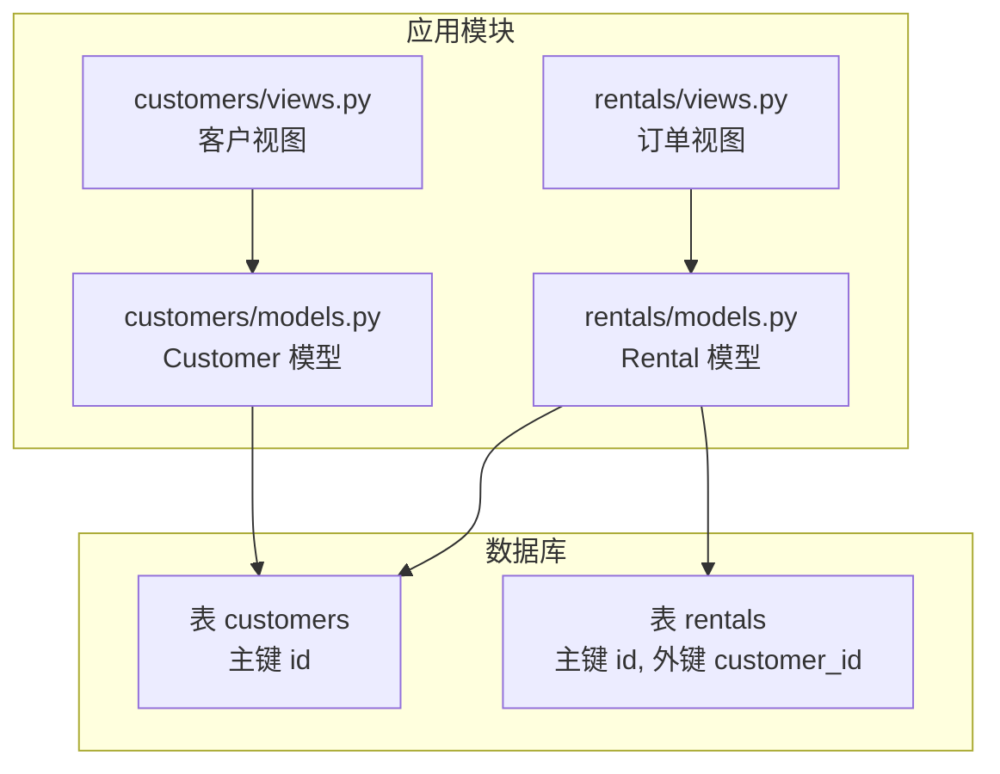
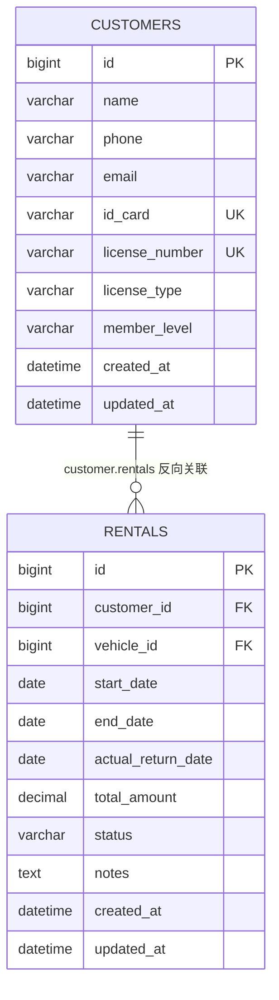

# 客户关联

<cite>
**本文引用的文件**
- [customers/models.py](file://code/car_rental_system/customers/models.py)
- [rentals/models.py](file://code/car_rental_system/rentals/models.py)
- [rentals/migrations/0001_initial.py](file://code/car_rental_system/rentals/migrations/0001_initial.py)
- [customers/migrations/0001_initial.py](file://code/car_rental_system/customers/migrations/0001_initial.py)
- [数据库设计总结.md](file://code/car_rental_system/数据库设计总结.md)
- [test_models.py](file://code/car_rental_system/test_models.py)
- [customers/views.py](file://code/car_rental_system/customers/views.py)
- [rentals/views.py](file://code/car_rental_system/rentals/views.py)
- [test_customer_management.py](file://code/car_rental_system/test_customer_management.py)
</cite>

## 目录
1. [简介](#简介)
2. [项目结构](#项目结构)
3. [核心组件](#核心组件)
4. [架构总览](#架构总览)
5. [详细组件分析](#详细组件分析)
6. [依赖分析](#依赖分析)
7. [性能考量](#性能考量)
8. [故障排查指南](#故障排查指南)
9. [结论](#结论)
10. [附录](#附录)

## 简介
本文件聚焦于 Rental 模型与 Customer 模型之间的外键关联关系，系统性说明：
- Rental 中 customer 字段的定义与作用（models.ForeignKey(..., on_delete=models.CASCADE, related_name='rentals')）
- 级联删除 on_delete=models.CASCADE 在业务场景中的含义与影响
- related_name='rentals' 如何实现反向查询，使 Customer 实例可通过 customer.rentals.all() 访问其所有租赁记录
- 数据库层面 customer_id 字段的外键约束与索引优化（models.Index(fields=['customer', 'status'])）
- 实际查询示例与 select_related('customer') 的性能优化最佳实践

## 项目结构
围绕“客户关联”的主题，涉及的关键文件与职责如下：
- customers/models.py：定义 Customer 模型及其字段、索引与业务方法
- rentals/models.py：定义 Rental 模型，其中包含 customer 外键字段
- rentals/migrations/0001_initial.py：迁移文件中对 Rental 表的创建与索引定义
- customers/migrations/0001_initial.py：Customer 表的初始迁移
- 数据库设计总结.md：数据库设计文档，包含外键与索引说明
- test_models.py、test_customer_management.py：演示反向查询与关联统计的实际用法
- customers/views.py、rentals/views.py：展示在视图层如何使用 select_related 优化查询



图表来源
- [customers/models.py](file://code/car_rental_system/customers/models.py#L1-L160)
- [rentals/models.py](file://code/car_rental_system/rentals/models.py#L1-L170)
- [rentals/migrations/0001_initial.py](file://code/car_rental_system/rentals/migrations/0001_initial.py#L1-L43)
- [customers/migrations/0001_initial.py](file://code/car_rental_system/customers/migrations/0001_initial.py#L1-L38)

章节来源
- [customers/models.py](file://code/car_rental_system/customers/models.py#L1-L160)
- [rentals/models.py](file://code/car_rental_system/rentals/models.py#L1-L170)
- [rentals/migrations/0001_initial.py](file://code/car_rental_system/rentals/migrations/0001_initial.py#L1-L43)
- [customers/migrations/0001_initial.py](file://code/car_rental_system/customers/migrations/0001_initial.py#L1-L38)

## 核心组件
- Customer 模型：包含客户基本信息、会员等级、索引等；提供与 Rental 的反向关联（related_name='rentals'）
- Rental 模型：包含订单状态、金额、日期、客户与车辆外键；customer 外键使用级联删除与反向名称

章节来源
- [customers/models.py](file://code/car_rental_system/customers/models.py#L1-L160)
- [rentals/models.py](file://code/car_rental_system/rentals/models.py#L1-L170)

## 架构总览
Rental 与 Customer 的关系是一对多：一个 Customer 可以拥有多个 Rental 记录。该关系通过外键 customer_id 实现，并在数据库层面建立约束与索引，同时在 ORM 层通过 related_name='rentals' 提供反向查询能力。



图表来源
- [数据库设计总结.md](file://code/car_rental_system/数据库设计总结.md#L65-L100)
- [rentals/migrations/0001_initial.py](file://code/car_rental_system/rentals/migrations/0001_initial.py#L29-L42)
- [customers/migrations/0001_initial.py](file://code/car_rental_system/customers/migrations/0001_initial.py#L15-L38)

## 详细组件分析

### Rental 模型中的 customer 外键定义
- 字段位置与签名：Rental 模型中 customer 字段使用 models.ForeignKey(...)，指向 Customer
- 关键参数
  - on_delete=models.CASCADE：当 Customer 被删除时，其关联的所有 Rental 记录也会被级联删除
  - related_name='rentals'：启用反向查询，允许通过 Customer 实例访问其所有 Rental 记录
- 数据库层面
  - 外键 customer_id 指向 customers.id
  - 索引 customer_id 与 (customer_id, status) 以支持高效查询

章节来源
- [rentals/models.py](file://code/car_rental_system/rentals/models.py#L27-L32)
- [rentals/migrations/0001_initial.py](file://code/car_rental_system/rentals/migrations/0001_initial.py#L29-L42)
- [数据库设计总结.md](file://code/car_rental_system/数据库设计总结.md#L88-L100)

### 级联删除行为 on_delete=CASCADE 的业务意义
- 当删除 Customer 时，与其关联的所有 Rental 记录将被自动删除，确保数据一致性
- 业务场景举例
  - 客户信息错误或违规注销后，系统自动清理其历史订单，避免悬挂数据
  - 合规审计要求：删除客户即删除其全部交易痕迹

章节来源
- [rentals/models.py](file://code/car_rental_system/rentals/models.py#L27-L32)
- [数据库设计总结.md](file://code/car_rental_system/数据库设计总结.md#L88-L90)

### related_name='rentals' 的反向查询
- 反向查询语法：Customer 实例可通过 customer.rentals.all() 获取其所有 Rental 记录
- 实际使用示例（来自测试脚本）
  - 遍历客户并打印其所有订单：customer.rentals.all()
  - 基于客户属性过滤订单：Rental.objects.filter(customer__member_level='VIP')
- 视图层优化：在列表页使用 select_related('customer') 避免 N+1 查询

章节来源
- [test_models.py](file://code/car_rental_system/test_models.py#L30-L50)
- [customers/views.py](file://code/car_rental_system/customers/views.py#L34-L76)
- [rentals/views.py](file://code/car_rental_system/rentals/views.py#L61-L126)

### 数据库设计：customer_id 外键约束与索引优化
- 外键约束
  - customer_id -> customers.id，删除策略为 CASCADE
  - vehicle_id -> vehicles.id，删除策略为 CASCADE
- 索引设计
  - customer_id、vehicle_id、status、start_date、end_date 等字段建立索引
  - customer_id 与 status 的复合索引，用于高频过滤场景

章节来源
- [数据库设计总结.md](file://code/car_rental_system/数据库设计总结.md#L65-L100)
- [rentals/migrations/0001_initial.py](file://code/car_rental_system/rentals/migrations/0001_initial.py#L34-L42)

### 实际查询示例与最佳实践
- 查询特定客户的所有订单
  - 使用反向查询：customer.rentals.all()
  - 或基于外键过滤：Rental.objects.filter(customer_id=customer_id)
- 按客户状态筛选订单
  - 基于客户属性过滤：Rental.objects.filter(customer__member_level='VIP')
- 性能优化最佳实践
  - 使用 select_related('customer') 避免 N+1 查询
  - 在视图中统一使用 select_related('customer', 'vehicle') 获取关联对象
  - 对高频查询字段（如 status、customer_id、vehicle_id）利用现有索引

章节来源
- [test_models.py](file://code/car_rental_system/test_models.py#L30-L50)
- [test_customer_management.py](file://code/car_rental_system/test_customer_management.py#L181-L214)
- [rentals/views.py](file://code/car_rental_system/rentals/views.py#L61-L126)

### 业务流程与数据一致性保障
- 自动状态更新：Rental.auto_update_status() 会根据日期自动更新订单状态，减少人工干预
- 金额与押金：Rental.save() 中根据客户会员等级与车辆日租金计算总金额与押金，确保财务一致性
- 反向统计：Customer.check_vip_upgrade_eligibility() 通过 customer.rentals 进行连续诚信订单统计

章节来源
- [rentals/models.py](file://code/car_rental_system/rentals/models.py#L171-L229)
- [rentals/models.py](file://code/car_rental_system/rentals/models.py#L246-L272)
- [customers/models.py](file://code/car_rental_system/customers/models.py#L101-L146)

## 依赖分析
- 外键依赖
  - Rental.customer -> Customer
  - Rental.vehicle -> Vehicle
- 反向依赖
  - Customer.rentals -> Rental（由 related_name='rentals' 提供）
- 索引依赖
  - (customer_id, status) 复合索引用于高效过滤
  - 单列索引 customer_id、vehicle_id、status、start_date、end_date 支持常见查询

```mermaid
graph LR
CUSTOMER["Customer 模型"] --> |"ForeignKey"| RENTAL["Rental 模型"]
VEHICLE["Vehicle 模型"] --> |"ForeignKey"| RENTAL
CUSTOMER --|"related_name='rentals'" --> RENTAL
```

图表来源
- [rentals/models.py](file://code/car_rental_system/rentals/models.py#L27-L38)
- [customers/models.py](file://code/car_rental_system/customers/models.py#L1-L160)

章节来源
- [rentals/models.py](file://code/car_rental_system/rentals/models.py#L27-L38)
- [customers/models.py](file://code/car_rental_system/customers/models.py#L1-L160)

## 性能考量
- 避免 N+1 查询
  - 在渲染客户列表时，使用 select_related('customer') 获取关联客户信息
  - 在渲染订单列表时，使用 select_related('customer', 'vehicle') 获取关联对象
- 索引利用
  - 使用 (customer_id, status) 复合索引进行高效过滤
  - 对 status、start_date、end_date 建立索引，提升筛选与排序性能
- 缓存与聚合
  - 视图中对筛选选项使用缓存，降低数据库压力
  - 使用聚合查询一次性统计客户订单数量与总金额，避免多次往返

章节来源
- [customers/views.py](file://code/car_rental_system/customers/views.py#L34-L76)
- [rentals/views.py](file://code/car_rental_system/rentals/views.py#L61-L126)
- [rentals/migrations/0001_initial.py](file://code/car_rental_system/rentals/migrations/0001_initial.py#L34-L42)

## 故障排查指南
- 删除客户后订单未删除
  - 检查迁移是否应用到最新版本，确认外键约束与级联删除配置正确
- 查询性能差
  - 确认是否使用 select_related('customer', 'vehicle')，避免 N+1
  - 检查是否对 (customer_id, status) 等字段使用了合适的过滤条件
- 反向查询异常
  - 确认 related_name='rentals' 是否存在，Customer 实例是否能通过 customer.rentals.all() 访问
- 数据完整性问题
  - 使用聚合查询检查是否存在孤儿订单（customer 为 null）

章节来源
- [rentals/migrations/0001_initial.py](file://code/car_rental_system/rentals/migrations/0001_initial.py#L29-L42)
- [customers/views.py](file://code/car_rental_system/customers/views.py#L34-L76)
- [test_models.py](file://code/car_rental_system/test_models.py#L30-L50)
- [comprehensive_system_test.py](file://code/car_rental_system/comprehensive_system_test.py#L370-L394)

## 结论
- Rental 与 Customer 的外键关联通过 customer_id 字段实现，on_delete=CASCADE 确保删除客户时同步删除其所有订单
- related_name='rentals' 提供强大的反向查询能力，Customer 实例可直接通过 customer.rentals.all() 访问其订单
- 数据库层面的索引设计（尤其是 (customer_id, status) 复合索引）显著提升了查询效率
- 在视图层使用 select_related('customer', 'vehicle') 是避免 N+1 查询、提升性能的最佳实践

## 附录
- 外键与索引参考
  - 外键：customer_id -> customers.id（CASCADE）
  - 外键：vehicle_id -> vehicles.id（CASCADE）
  - 索引：customer_id、vehicle_id、status、start_date、end_date、(customer_id, status)、(vehicle_id, status)
- 反向查询示例路径
  - customer.rentals.all()：见 [test_models.py](file://code/car_rental_system/test_models.py#L30-L50)
  - 基于客户属性过滤：见 [test_models.py](file://code/car_rental_system/test_models.py#L48-L50)
- 性能优化示例路径
  - select_related('customer')：见 [customers/views.py](file://code/car_rental_system/customers/views.py#L34-L76)
  - select_related('customer', 'vehicle')：见 [rentals/views.py](file://code/car_rental_system/rentals/views.py#L61-L126)