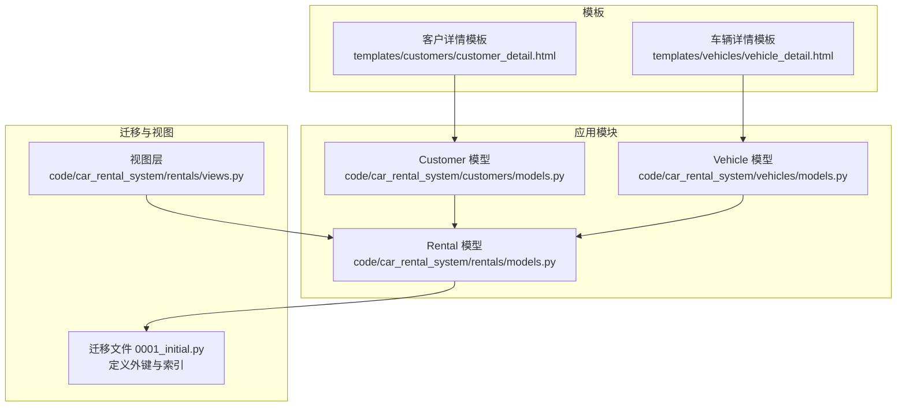
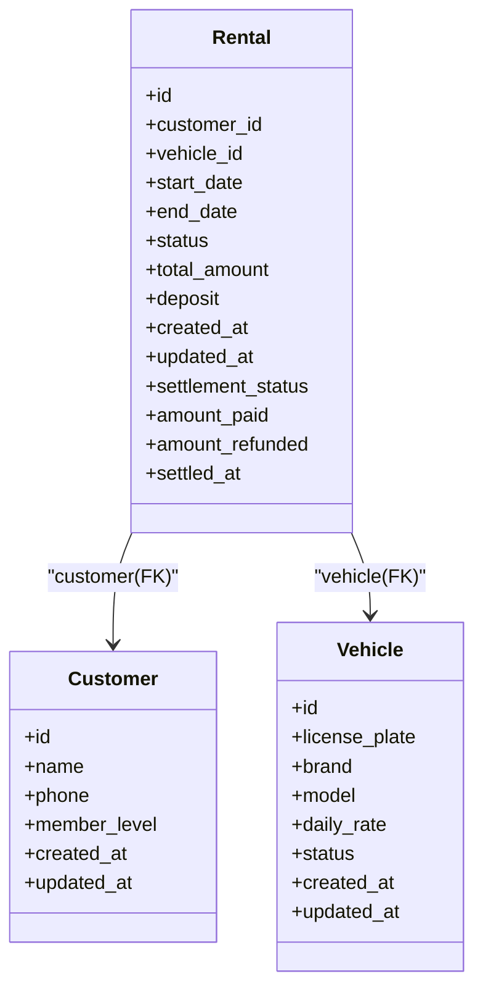
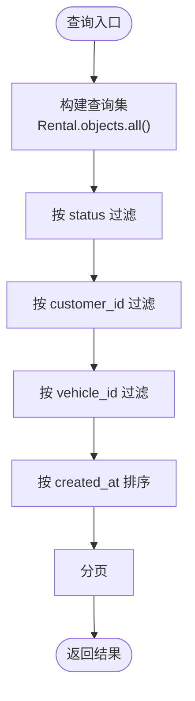
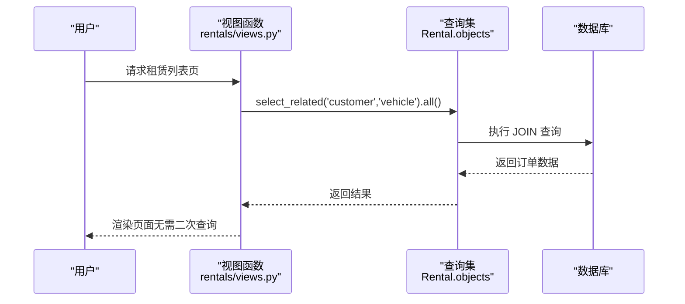
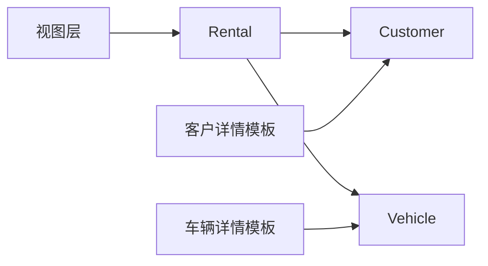

# 模型关联关系

<cite>
**本文引用的文件**
- [rentals/models.py](file://code/car_rental_system/rentals/models.py)
- [customers/models.py](file://code/car_rental_system/customers/models.py)
- [vehicles/models.py](file://code/car_rental_system/vehicles/models.py)
- [rentals/migrations/0001_initial.py](file://code/car_rental_system/rentals/migrations/0001_initial.py)
- [rentals/views.py](file://code/car_rental_system/rentals/views.py)
- [templates/customers/customer_detail.html](file://code/car_rental_system/templates/customers/customer_detail.html)
- [templates/vehicles/vehicle_detail.html](file://code/car_rental_system/templates/vehicles/vehicle_detail.html)
- [comprehensive_system_test.py](file://code/car_rental_system/comprehensive_system_test.py)
</cite>

## 目录
1. [简介](#简介)
2. [项目结构](#项目结构)
3. [核心组件](#核心组件)
4. [架构总览](#架构总览)
5. [详细组件分析](#详细组件分析)
6. [依赖分析](#依赖分析)
7. [性能考量](#性能考量)
8. [故障排查指南](#故障排查指南)
9. [结论](#结论)

## 简介
本文件聚焦于 Rental 模型与 Customer、Vehicle 两大核心模型之间的外键关联关系，系统性说明：
- 外键字段 customer 与 vehicle 的定义、related_name='rentals' 的反向查询能力
- 级联删除 on_delete=models.CASCADE 的行为与业务影响
- Meta 类中数据库索引对 customer_id、vehicle_id 的优化策略
- 关联查询的 ORM 示例与 select_related 性能优化最佳实践
- 前端模板中通过 customer.rentals.all() 与 Vehicle.objects.filter(rentals__status='ONGOING') 的使用场景

## 项目结构
围绕 Rental 与其关联模型的关系，代码主要分布在以下模块：
- rentals/models.py：定义 Rental 模型及状态自动更新逻辑
- customers/models.py：定义 Customer 模型，并通过 related_name='rentals' 支持反向查询
- vehicles/models.py：定义 Vehicle 模型，并通过 related_name='rentals' 支持反向查询
- rentals/migrations/0001_initial.py：迁移文件中明确外键与索引定义
- rentals/views.py：在视图层广泛使用 select_related 优化查询
- templates/*：前端模板展示 customer.rentals.all() 与 rentals__status 查询的实际用法

图表来源
- [rentals/models.py](file://code/car_rental_system/rentals/models.py#L12-L40)
- [customers/models.py](file://code/car_rental_system/customers/models.py#L7-L21)
- [vehicles/models.py](file://code/car_rental_system/vehicles/models.py#L6-L20)
- [rentals/migrations/0001_initial.py](file://code/car_rental_system/rentals/migrations/0001_initial.py#L19-L42)
- [rentals/views.py](file://code/car_rental_system/rentals/views.py#L60-L120)
- [templates/customers/customer_detail.html](file://code/car_rental_system/templates/customers/customer_detail.html#L310-L330)
- [templates/vehicles/vehicle_detail.html](file://code/car_rental_system/templates/vehicles/vehicle_detail.html#L218-L279)

章节来源
- [rentals/models.py](file://code/car_rental_system/rentals/models.py#L12-L40)
- [customers/models.py](file://code/car_rental_system/customers/models.py#L7-L21)
- [vehicles/models.py](file://code/car_rental_system/vehicles/models.py#L6-L20)
- [rentals/migrations/0001_initial.py](file://code/car_rental_system/rentals/migrations/0001_initial.py#L19-L42)
- [rentals/views.py](file://code/car_rental_system/rentals/views.py#L60-L120)
- [templates/customers/customer_detail.html](file://code/car_rental_system/templates/customers/customer_detail.html#L310-L330)
- [templates/vehicles/vehicle_detail.html](file://code/car_rental_system/templates/vehicles/vehicle_detail.html#L218-L279)

## 核心组件
- Rental 模型
  - 外键 customer：指向 Customer，related_name='rentals'，支持 customer.rentals.all() 反向查询
  - 外键 vehicle：指向 Vehicle，related_name='rentals'，支持 vehicle.rentals.all() 反向查询
  - 级联删除 on_delete=models.CASCADE，删除客户或车辆会级联删除其相关订单
  - Meta.indexes 包含 customer_id、vehicle_id 与 status 的复合索引，提升过滤与排序性能
- Customer 模型
  - 提供 related_name='rentals' 的反向关联，配合 Rental 的 customer 字段形成双向访问
- Vehicle 模型
  - 提供 related_name='rentals' 的反向关联，配合 Rental 的 vehicle 字段形成双向访问

章节来源
- [rentals/models.py](file://code/car_rental_system/rentals/models.py#L12-L40)
- [customers/models.py](file://code/car_rental_system/customers/models.py#L7-L21)
- [vehicles/models.py](file://code/car_rental_system/vehicles/models.py#L6-L20)
- [rentals/migrations/0001_initial.py](file://code/car_rental_system/rentals/migrations/0001_initial.py#L19-L42)

## 架构总览
Rental 作为订单核心实体，通过外键与 Customer、Vehicle 建立稳定的一对多关系。Rental 的 Meta.indexes 对 customer_id、vehicle_id 与 status 的组合建立索引，显著优化了按客户/车辆/状态的查询性能。视图层普遍采用 select_related('customer', 'vehicle')，减少 N+1 查询问题，提升页面渲染效率。

图表来源
- [rentals/models.py](file://code/car_rental_system/rentals/models.py#L12-L40)
- [customers/models.py](file://code/car_rental_system/customers/models.py#L7-L21)
- [vehicles/models.py](file://code/car_rental_system/vehicles/models.py#L6-L20)

## 详细组件分析

### 外键关联与反向查询
- 外键 customer
  - 定义位置：Rental.customer 字段
  - related_name='rentals'：允许通过 customer.rentals.all() 获取某客户的全部订单
  - 级联删除：on_delete=models.CASCADE，删除客户会删除其所有订单
- 外键 vehicle
  - 定义位置：Rental.vehicle 字段
  - related_name='rentals'：允许通过 vehicle.rentals.all() 获取某车辆的全部订单
  - 级联删除：on_delete=models.CASCADE，删除车辆会删除其所有订单

章节来源
- [rentals/models.py](file://code/car_rental_system/rentals/models.py#L12-L40)
- [customers/models.py](file://code/car_rental_system/customers/models.py#L7-L21)
- [vehicles/models.py](file://code/car_rental_system/vehicles/models.py#L6-L20)
- [rentals/migrations/0001_initial.py](file://code/car_rental_system/rentals/migrations/0001_initial.py#L19-L42)

### 级联删除行为与业务意义
- 行为说明
  - 删除 Customer：其关联的所有 Rental 记录将被级联删除
  - 删除 Vehicle：其关联的所有 Rental 记录将被级联删除
- 业务影响
  - 数据一致性：确保删除主实体后，不会产生孤儿订单
  - 风险控制：在删除客户或车辆前，应确认是否存在正在进行中的订单，避免误删造成业务损失
  - 审计追踪：建议在删除前记录审计日志，便于回溯

章节来源
- [rentals/models.py](file://code/car_rental_system/rentals/models.py#L12-L40)
- [rentals/migrations/0001_initial.py](file://code/car_rental_system/rentals/migrations/0001_initial.py#L19-L42)

### 数据库索引优化策略（Meta.indexes）
Rental 的 Meta.indexes 明确包含以下索引：
- 独立索引：start_date、end_date、status
- 复合索引：customer_id + status、vehicle_id + status

这些索引针对常见查询模式进行了优化：
- 按客户状态过滤：customer.rentals.filter(status='ONGOING')
- 按车辆状态过滤：vehicle.rentals.filter(status='ONGOING')
- 按日期范围与状态组合查询
- 列表页按创建时间排序与分页

图表来源
- [rentals/migrations/0001_initial.py](file://code/car_rental_system/rentals/migrations/0001_initial.py#L34-L42)
- [rentals/views.py](file://code/car_rental_system/rentals/views.py#L60-L120)

章节来源
- [rentals/migrations/0001_initial.py](file://code/car_rental_system/rentals/migrations/0001_initial.py#L34-L42)
- [rentals/views.py](file://code/car_rental_system/rentals/views.py#L60-L120)

### 关联查询 ORM 示例与最佳实践
- 通过客户查询订单
  - ORM 示例路径：[templates/customers/customer_detail.html](file://code/car_rental_system/templates/customers/customer_detail.html#L310-L330)
  - 说明：模板中直接使用 customer.rentals.all() 展示客户的历史订单
- 通过车辆查询当前租赁状态
  - ORM 示例路径：[templates/vehicles/vehicle_detail.html](file://code/car_rental_system/templates/vehicles/vehicle_detail.html#L218-L279)
  - 说明：模板中使用 vehicle.rentals.filter(status='ONGOING') 展示当前进行中的订单
- select_related 优化
  - 视图层示例路径：[rentals/views.py](file://code/car_rental_system/rentals/views.py#L60-L120)
  - 说明：在列表页与详情页普遍使用 select_related('customer', 'vehicle')，避免 N+1 查询，提升渲染性能

图表来源
- [rentals/views.py](file://code/car_rental_system/rentals/views.py#L60-L120)

章节来源
- [templates/customers/customer_detail.html](file://code/car_rental_system/templates/customers/customer_detail.html#L310-L330)
- [templates/vehicles/vehicle_detail.html](file://code/car_rental_system/templates/vehicles/vehicle_detail.html#L218-L279)
- [rentals/views.py](file://code/car_rental_system/rentals/views.py#L60-L120)

### 状态自动更新与级联联动
- 自动更新逻辑
  - 在视图层调用 Rental.auto_update_status()，将“预订中”激活为“进行中”，将“进行中”超期更新为“已超时未归还”
  - 该过程会更新车辆状态（从 AVAILABLE 变为 RENTED 或从 RENTED 变为 AVAILABLE）
- 级联影响
  - 删除客户或车辆会级联删除订单，从而避免遗留状态不一致

章节来源
- [rentals/views.py](file://code/car_rental_system/rentals/views.py#L60-L120)
- [rentals/models.py](file://code/car_rental_system/rentals/models.py#L171-L229)

## 依赖分析
- 模块耦合
  - Rental 依赖 Customer 与 Vehicle 的存在，形成稳定的订单-客户-车辆三元关系
  - 视图层依赖 Rental 的自动更新与索引设计，保证查询性能
- 外部依赖
  - Django ORM 的 ForeignKey、related_name、select_related、Index 等特性
  - 前端模板通过 ORM 反向查询直接渲染数据

图表来源
- [rentals/models.py](file://code/car_rental_system/rentals/models.py#L12-L40)
- [customers/models.py](file://code/car_rental_system/customers/models.py#L7-L21)
- [vehicles/models.py](file://code/car_rental_system/vehicles/models.py#L6-L20)
- [rentals/views.py](file://code/car_rental_system/rentals/views.py#L60-L120)
- [templates/customers/customer_detail.html](file://code/car_rental_system/templates/customers/customer_detail.html#L310-L330)
- [templates/vehicles/vehicle_detail.html](file://code/car_rental_system/templates/vehicles/vehicle_detail.html#L218-L279)

章节来源
- [rentals/models.py](file://code/car_rental_system/rentals/models.py#L12-L40)
- [customers/models.py](file://code/car_rental_system/customers/models.py#L7-L21)
- [vehicles/models.py](file://code/car_rental_system/vehicles/models.py#L6-L20)
- [rentals/views.py](file://code/car_rental_system/rentals/views.py#L60-L120)
- [templates/customers/customer_detail.html](file://code/car_rental_system/templates/customers/customer_detail.html#L310-L330)
- [templates/vehicles/vehicle_detail.html](file://code/car_rental_system/templates/vehicles/vehicle_detail.html#L218-L279)

## 性能考量
- 索引策略
  - customer_id + status、vehicle_id + status 复合索引，覆盖常见过滤场景
  - 单列索引 start_date、end_date、status 支持日期范围与状态筛选
- 查询优化
  - 使用 select_related('customer', 'vehicle') 减少 JOIN 与 N+1 查询
  - 在列表页与详情页统一采用预加载策略
- 缓存与批量处理
  - 自动状态更新使用缓存（5 分钟）避免频繁更新
  - 列表页筛选选项使用缓存（5 分钟）降低查询压力

章节来源
- [rentals/migrations/0001_initial.py](file://code/car_rental_system/rentals/migrations/0001_initial.py#L34-L42)
- [rentals/views.py](file://code/car_rental_system/rentals/views.py#L60-L120)
- [rentals/models.py](file://code/car_rental_system/rentals/models.py#L171-L229)

## 故障排查指南
- 删除客户/车辆导致订单丢失
  - 现象：删除主实体后订单消失
  - 原因：级联删除 on_delete=CASCADE
  - 建议：删除前确认是否存在进行中订单，必要时先变更状态或迁移订单
- 查询性能差
  - 现象：列表页渲染慢
  - 原因：未使用 select_related 导致 N+1 查询
  - 建议：在视图中统一使用 select_related('customer', 'vehicle')
- 状态不一致
  - 现象：订单状态与车辆状态不符
  - 原因：状态自动更新未触发或异常
  - 建议：检查自动更新逻辑与缓存配置，必要时手动触发更新

章节来源
- [rentals/models.py](file://code/car_rental_system/rentals/models.py#L171-L229)
- [rentals/views.py](file://code/car_rental_system/rentals/views.py#L60-L120)

## 结论
Rental 模型通过 customer 与 vehicle 的外键关联，结合 related_name='rentals' 实现了清晰的反向查询能力。on_delete=CASCADE 的设计保障了数据一致性，而 Meta.indexes 中对 customer_id、vehicle_id 与 status 的索引优化，配合视图层的 select_related 使用，共同构成了高性能、易维护的订单查询体系。前端模板直接利用 ORM 反向查询，简化了业务逻辑与渲染复杂度。