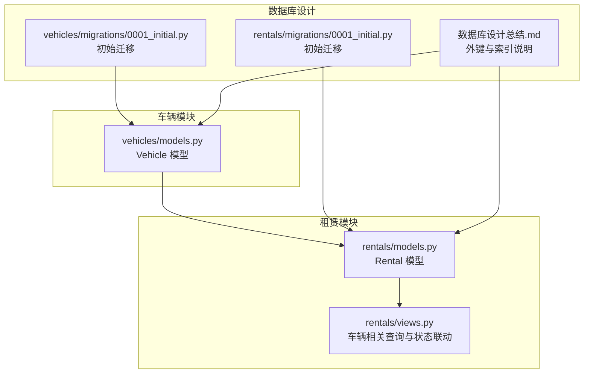
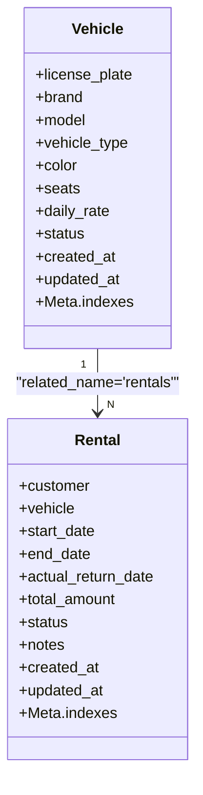
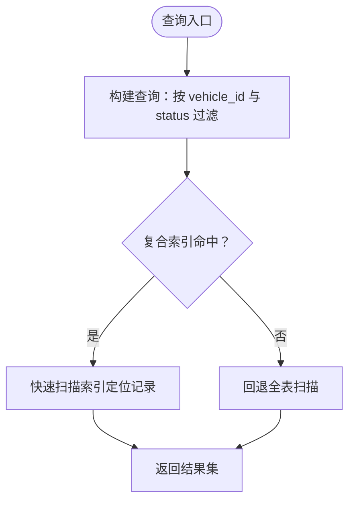
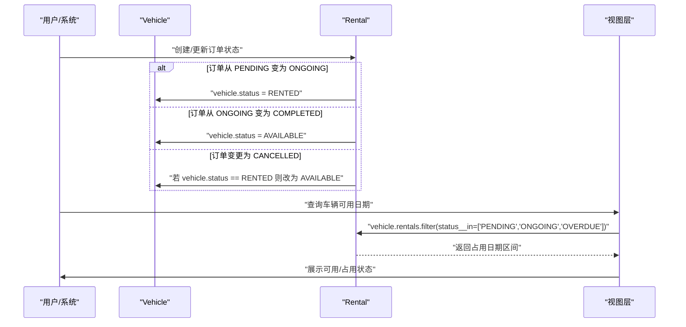
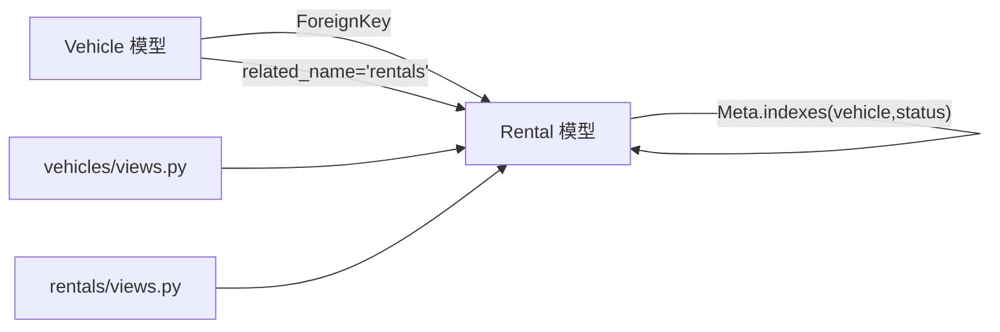

# 车辆关联

<cite>
**本文引用的文件**
- [vehicles/models.py](file://code/car_rental_system/vehicles/models.py)
- [rentals/models.py](file://code/car_rental_system/rentals/models.py)
- [rentals/migrations/0001_initial.py](file://code/car_rental_system/rentals/migrations/0001_initial.py)
- [vehicles/migrations/0001_initial.py](file://code/car_rental_system/vehicles/migrations/0001_initial.py)
- [vehicles/views.py](file://code/car_rental_system/vehicles/views.py)
- [rentals/views.py](file://code/car_rental_system/rentals/views.py)
- [数据库设计总结.md](file://code/car_rental_system/数据库设计总结.md)
- [最终报告.md](file://code/car_rental_system/最终报告.md)
</cite>

## 目录
1. [简介](#简介)
2. [项目结构](#项目结构)
3. [核心组件](#核心组件)
4. [架构总览](#架构总览)
5. [详细组件分析](#详细组件分析)
6. [依赖分析](#依赖分析)
7. [性能考量](#性能考量)
8. [故障排查指南](#故障排查指南)
9. [结论](#结论)

## 简介
本文件聚焦于 Rental 模型与 Vehicle 模型之间的外键关联关系，系统性说明：
- Rental 的 vehicle 字段定义与 on_delete 行为
- related_name='rentals' 如何实现 Vehicle 到 Rental 的反向查询
- 数据库层面的外键约束与复合索引优化
- 实际查询示例与 select_related 性能优化
- 车辆状态与租赁状态的联动更新逻辑

## 项目结构
围绕车辆与租赁两个核心模块，外键关系由 Rental 模型指向 Vehicle 模型，配合数据库索引与视图层的查询优化，形成稳定的业务数据流。

**图表来源**
- [vehicles/models.py](file://code/car_rental_system/vehicles/models.py#L1-L85)
- [rentals/models.py](file://code/car_rental_system/rentals/models.py#L1-L170)
- [vehicles/migrations/0001_initial.py](file://code/car_rental_system/vehicles/migrations/0001_initial.py#L1-L39)
- [rentals/migrations/0001_initial.py](file://code/car_rental_system/rentals/migrations/0001_initial.py#L1-L42)
- [数据库设计总结.md](file://code/car_rental_system/数据库设计总结.md#L65-L100)

**章节来源**
- [vehicles/models.py](file://code/car_rental_system/vehicles/models.py#L1-L85)
- [rentals/models.py](file://code/car_rental_system/rentals/models.py#L1-L170)
- [vehicles/migrations/0001_initial.py](file://code/car_rental_system/vehicles/migrations/0001_initial.py#L1-L39)
- [rentals/migrations/0001_initial.py](file://code/car_rental_system/rentals/migrations/0001_initial.py#L1-L42)
- [数据库设计总结.md](file://code/car_rental_system/数据库设计总结.md#L65-L100)

## 核心组件
- Vehicle 模型：定义车辆基本信息、状态枚举及索引。
- Rental 模型：定义租赁订单字段、状态枚举、外键 vehicle 指向 Vehicle，并在 Meta 中声明复合索引。
- 视图层：在车辆详情页、可用日期查询等场景中，通过 vehicle.rentals 反向查询与 select_related 优化。

**章节来源**
- [vehicles/models.py](file://code/car_rental_system/vehicles/models.py#L1-L85)
- [rentals/models.py](file://code/car_rental_system/rentals/models.py#L1-L170)
- [vehicles/views.py](file://code/car_rental_system/vehicles/views.py#L138-L171)
- [rentals/views.py](file://code/car_rental_system/rentals/views.py#L536-L563)

## 架构总览
Rental 与 Vehicle 的关联采用一对多关系：一个 Vehicle 可对应多个 Rental；删除 Vehicle 时，其所有 Rental 记录将级联删除。反向查询通过 related_name='rentals' 实现，Vehicle 实例可通过 vehicle.rentals.all() 获取其历史订单。

**图表来源**
- [vehicles/models.py](file://code/car_rental_system/vehicles/models.py#L1-L85)
- [rentals/models.py](file://code/car_rental_system/rentals/models.py#L1-L170)

## 详细组件分析

### 外键定义与级联删除行为
- Rental.vehicle 字段定义为 models.ForeignKey(Vehicle, on_delete=models.CASCADE, related_name='rentals')，表示：
  - 外键指向 Vehicle
  - on_delete=models.CASCADE：当 Vehicle 被删除时，所有关联的 Rental 记录也会被删除
  - related_name='rentals'：允许 Vehicle 实例通过 vehicle.rentals 反向查询其所有租赁记录

- 数据库层面，初始迁移中对 customer_id 与 vehicle_id 均声明了外键约束与级联删除，确保数据一致性。

- 业务意义：
  - 防止悬挂数据：删除车辆后，其历史订单随之清理，避免后续查询出现无效关联
  - 便于审计与归档：删除车辆即删除其完整生命周期内的订单轨迹

**章节来源**
- [rentals/models.py](file://code/car_rental_system/rentals/models.py#L27-L38)
- [rentals/migrations/0001_initial.py](file://code/car_rental_system/rentals/migrations/0001_initial.py#L31-L33)
- [数据库设计总结.md](file://code/car_rental_system/数据库设计总结.md#L88-L91)

### 反向查询：related_name='rentals'
- Vehicle 实例可通过 vehicle.rentals.all() 获取其所有租赁历史
- 在车辆详情页中，视图层直接使用 vehicle.rentals 进行过滤与统计，体现了反向查询的实际应用

**章节来源**
- [rentals/models.py](file://code/car_rental_system/rentals/models.py#L27-L38)
- [vehicles/views.py](file://code/car_rental_system/vehicles/views.py#L147-L154)

### 数据库索引优化：vehicle_id 与复合索引
- Rental.Meta.indexes 中包含 vehicle_id,status 的复合索引，显著提升按车辆与状态组合查询的性能
- Vehicle.Meta.indexes 中包含 license_plate,status 等索引，优化车辆检索与状态统计
- 初始迁移中也声明了 vehicle_id,status 的索引，确保查询效率

**图表来源**
- [rentals/models.py](file://code/car_rental_system/rentals/models.py#L163-L169)
- [rentals/migrations/0001_initial.py](file://code/car_rental_system/rentals/migrations/0001_initial.py#L39-L40)
- [vehicles/migrations/0001_initial.py](file://code/car_rental_system/vehicles/migrations/0001_initial.py#L30-L36)

**章节来源**
- [rentals/models.py](file://code/car_rental_system/rentals/models.py#L163-L169)
- [rentals/migrations/0001_initial.py](file://code/car_rental_system/rentals/migrations/0001_initial.py#L39-L40)
- [vehicles/migrations/0001_initial.py](file://code/car_rental_system/vehicles/migrations/0001_initial.py#L30-L36)

### 实际查询示例与最佳实践
- 查询特定车辆的当前租赁状态（进行中）：
  - 使用 vehicle.rentals.filter(status='ONGOING')
  - 在车辆详情页中，视图层直接基于 vehicle.rentals 进行过滤与统计
- 查询历史订单：
  - 使用 vehicle.rentals.filter(status__in=['COMPLETED','CANCELLED']).order_by('-created_at')
- 性能优化最佳实践：
  - 使用 select_related('vehicle') 或 select_related('customer') 减少 N+1 查询
  - 在列表页与详情页中广泛采用 select_related 与 only，降低数据库往返与内存占用

**章节来源**
- [vehicles/views.py](file://code/car_rental_system/vehicles/views.py#L147-L154)
- [rentals/views.py](file://code/car_rental_system/rentals/views.py#L61-L99)
- [最终报告.md](file://code/car_rental_system/最终报告.md#L62-L72)

### 车辆状态与租赁状态的联动更新逻辑
- 自动更新逻辑：
  - 当到达开始日期且订单为 PENDING 时，自动更新为 ONGOING，并将车辆状态更新为 RENTED（前提是车辆当前为 AVAILABLE）
  - 当超过结束日期且订单为 ONGOING 时，自动更新为 OVERDUE
- 手动状态更新：
  - 预订中 → 进行中：车辆状态更新为 RENTED
  - 预订中/进行中 → 已完成：车辆状态更新为 AVAILABLE
  - 任何状态 → 已取消：若车辆处于 RENTED，恢复为 AVAILABLE
- 归还处理：
  - 完成归还后，检查该车辆是否还有其他进行中的订单；若无，则将车辆状态更新为 AVAILABLE
- 可用日期查询：
  - 前端通过 vehicle.rentals.filter(status__in=['PENDING','ONGOING','OVERDUE']).order_by('start_date') 获取占用日期区间，结合 vehicle.status 判断是否可用

**图表来源**
- [rentals/models.py](file://code/car_rental_system/rentals/models.py#L171-L229)
- [rentals/views.py](file://code/car_rental_system/rentals/views.py#L234-L263)
- [rentals/views.py](file://code/car_rental_system/rentals/views.py#L279-L392)
- [rentals/views.py](file://code/car_rental_system/rentals/views.py#L536-L563)

**章节来源**
- [rentals/models.py](file://code/car_rental_system/rentals/models.py#L171-L229)
- [rentals/views.py](file://code/car_rental_system/rentals/views.py#L234-L263)
- [rentals/views.py](file://code/car_rental_system/rentals/views.py#L279-L392)
- [rentals/views.py](file://code/car_rental_system/rentals/views.py#L536-L563)

## 依赖分析
- 外键依赖：Rental.vehicle 指向 Vehicle，Rental.customer 指向 Customer（在迁移中体现）
- 反向依赖：Vehicle 通过 related_name='rentals' 提供反向查询能力
- 索引依赖：Rental.Meta.indexes 对 vehicle_id,status 的复合索引支撑高频查询
- 视图依赖：车辆详情页与可用日期查询依赖 vehicle.rentals 反向查询与 select_related 优化

**图表来源**
- [rentals/models.py](file://code/car_rental_system/rentals/models.py#L27-L38)
- [rentals/models.py](file://code/car_rental_system/rentals/models.py#L163-L169)
- [vehicles/views.py](file://code/car_rental_system/vehicles/views.py#L147-L154)
- [rentals/views.py](file://code/car_rental_system/rentals/views.py#L536-L563)

**章节来源**
- [rentals/models.py](file://code/car_rental_system/rentals/models.py#L27-L38)
- [rentals/models.py](file://code/car_rental_system/rentals/models.py#L163-L169)
- [vehicles/views.py](file://code/car_rental_system/vehicles/views.py#L147-L154)
- [rentals/views.py](file://code/car_rental_system/rentals/views.py#L536-L563)

## 性能考量
- 复合索引：Rental.Meta.indexes 中的 vehicle_id,status 索引显著降低按车辆与状态过滤的成本
- 查询优化：广泛使用 select_related('vehicle') 与 only(...) 减少数据库往返与对象构造开销
- 聚合与分页：列表页采用分页与聚合统计，避免一次性加载大量数据
- 自动更新缓存：Rental.auto_update_status 使用缓存限制更新频率，降低数据库压力

**章节来源**
- [rentals/models.py](file://code/car_rental_system/rentals/models.py#L163-L169)
- [rentals/views.py](file://code/car_rental_system/rentals/views.py#L61-L99)
- [最终报告.md](file://code/car_rental_system/最终报告.md#L62-L72)

## 故障排查指南
- 删除车辆失败：
  - 若存在活跃的租赁订单（status in ['PENDING','ONGOING']），系统会阻止删除并提示仍有活跃订单
  - 排查思路：确认 vehicle.rentals.filter(status__in=['PENDING','ONGOING']).exists()
- 查询性能异常：
  - 检查是否遗漏 select_related('vehicle') 或 only(...)
  - 确认 vehicle_id,status 复合索引是否生效
- 状态不一致：
  - 检查自动更新逻辑是否触发（Rental.auto_update_status）
  - 手动状态更新后是否同步更新 vehicle.status
- 反向查询为空：
  - 确认 related_name='rentals' 是否正确使用 vehicle.rentals.all()

**章节来源**
- [vehicles/views.py](file://code/car_rental_system/vehicles/views.py#L255-L286)
- [rentals/models.py](file://code/car_rental_system/rentals/models.py#L171-L229)
- [rentals/views.py](file://code/car_rental_system/rentals/views.py#L234-L263)

## 结论
Rental 与 Vehicle 的外键关联通过 CASCADE 级联删除与 related_name='rentals' 反向查询实现了清晰、一致且可审计的数据关系。数据库层面的复合索引与视图层的查询优化共同保障了系统的高性能与可维护性。车辆状态与租赁状态的联动更新逻辑进一步提升了业务一致性与用户体验。