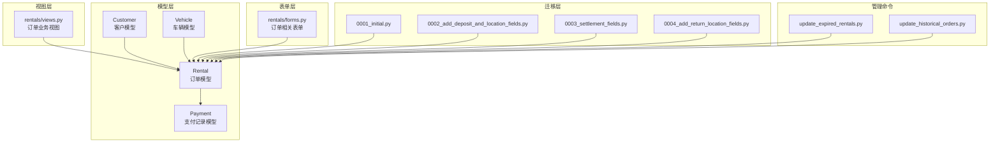
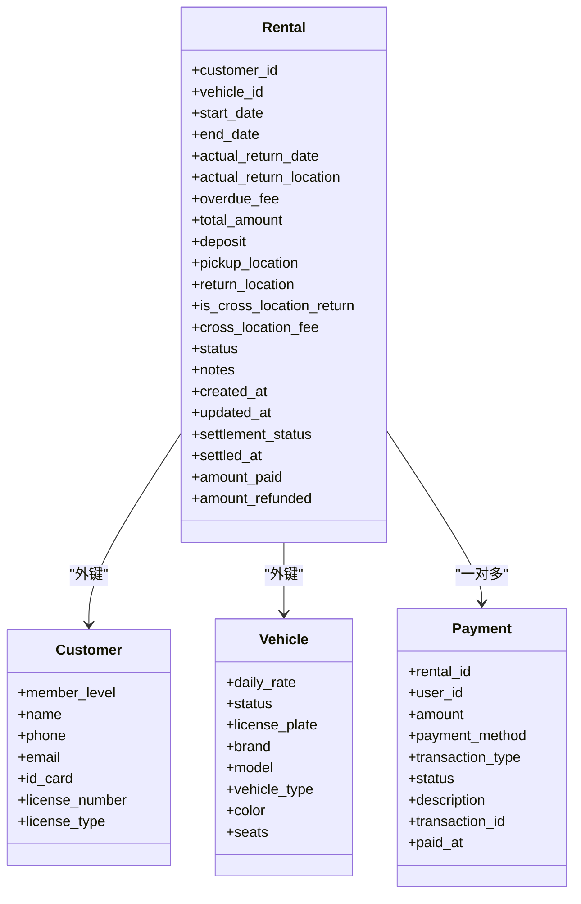
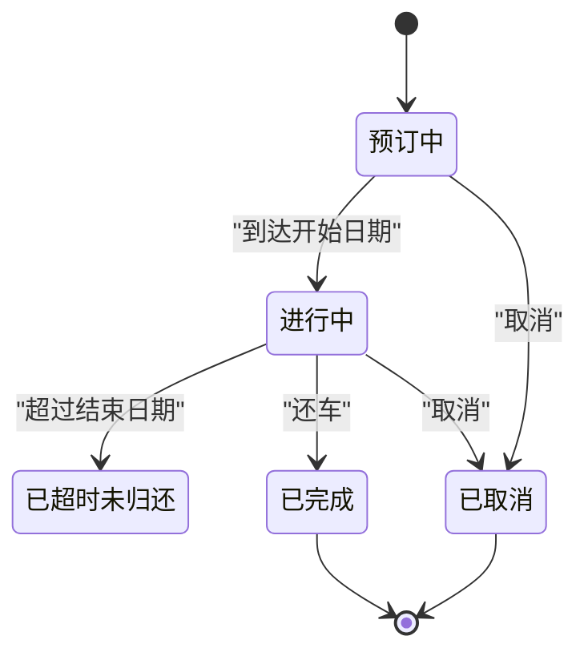
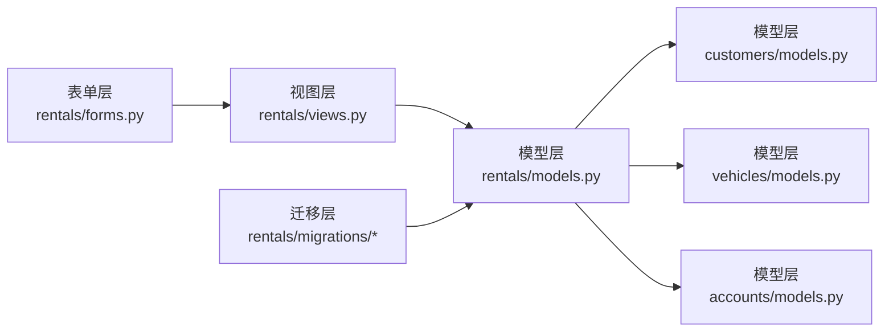
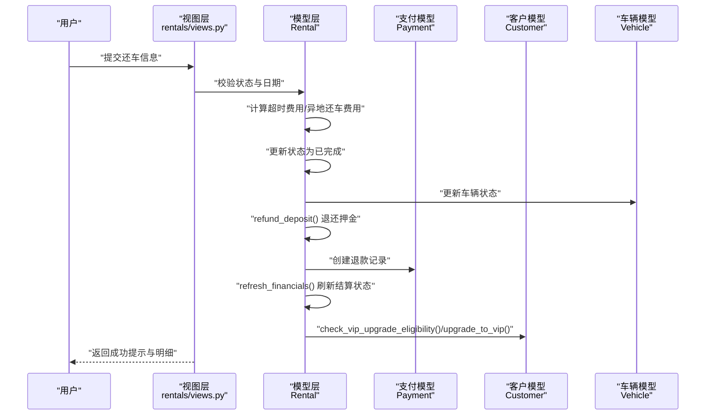

# 租赁订单模型设计

<cite>
**本文引用的文件**
- [rentals/models.py](file://code/car_rental_system/rentals/models.py)
- [customers/models.py](file://code/car_rental_system/customers/models.py)
- [vehicles/models.py](file://code/car_rental_system/vehicles/models.py)
- [accounts/models.py](file://code/car_rental_system/accounts/models.py)
- [rentals/migrations/0001_initial.py](file://code/car_rental_system/rentals/migrations/0001_initial.py)
- [rentals/migrations/0002_add_deposit_and_location_fields.py](file://code/car_rental_system/rentals/migrations/0002_add_deposit_and_location_fields.py)
- [rentals/migrations/0003_settlement_fields.py](file://code/car_rental_system/rentals/migrations/0003_settlement_fields.py)
- [rentals/migrations/0004_add_return_location_fields.py](file://code/car_rental_system/rentals/migrations/0004_add_return_location_fields.py)
- [rentals/views.py](file://code/car_rental_system/rentals/views.py)
- [rentals/forms.py](file://code/car_rental_system/rentals/forms.py)
- [rentals/management/commands/update_expired_rentals.py](file://code/car_rental_system/rentals/management/commands/update_expired_rentals.py)
- [rentals/management/commands/update_historical_orders.py](file://code/car_rental_system/rentals/management/commands/update_historical_orders.py)
</cite>

## 目录
1. [简介](#简介)
2. [项目结构](#项目结构)
3. [核心组件](#核心组件)
4. [架构总览](#架构总览)
5. [详细组件分析](#详细组件分析)
6. [依赖关系分析](#依赖关系分析)
7. [性能考量](#性能考量)
8. [故障排查指南](#故障排查指南)
9. [结论](#结论)
10. [附录](#附录)

## 简介
本文件系统性文档化“租赁订单”模型的设计细节，覆盖以下关键主题：
- 租赁时间、押金、取车/还车地点、订单状态（待支付、租赁中、已完成、已取消、已超时未归还）、费用计算字段等
- 通过外键关联 Vehicle 和 Customer 形成的核心业务链路
- 状态流转机制及对应的数据库字段设计（含异地还车支持字段扩展）
- 结合多个迁移文件梳理模型演进过程（押金字段、结算字段、超时费用字段、实际还车门店字段）
- 常见查询（订单状态查询、超时订单筛选）的 ORM 实现思路与最佳实践
- 数据一致性保障措施（事务、原子操作、缓存控制、清理校验）

## 项目结构
围绕“租赁订单”模型，系统采用分层模块化组织：
- 模型层：rentals/models.py 定义 Rental；customers/models.py 定义 Customer；vehicles/models.py 定义 Vehicle；accounts/models.py 定义 Payment
- 视图层：rentals/views.py 提供订单列表、详情、创建、修改、状态更新、还车、取消等业务流程
- 表单层：rentals/forms.py 提供订单创建/修改、状态变更、还车、取消等表单校验
- 迁移层：rentals/migrations/* 逐步演进字段与索引
- 管理命令：rentals/management/commands/* 提供自动更新与历史订单批量处理

图表来源
- [rentals/models.py](file://code/car_rental_system/rentals/models.py#L1-L170)
- [customers/models.py](file://code/car_rental_system/customers/models.py#L1-L100)
- [vehicles/models.py](file://code/car_rental_system/vehicles/models.py#L1-L85)
- [accounts/models.py](file://code/car_rental_system/accounts/models.py#L147-L248)
- [rentals/views.py](file://code/car_rental_system/rentals/views.py#L1-L120)
- [rentals/forms.py](file://code/car_rental_system/rentals/forms.py#L1-L120)
- [rentals/migrations/0001_initial.py](file://code/car_rental_system/rentals/migrations/0001_initial.py#L1-L43)
- [rentals/migrations/0002_add_deposit_and_location_fields.py](file://code/car_rental_system/rentals/migrations/0002_add_deposit_and_location_fields.py#L1-L76)
- [rentals/migrations/0003_settlement_fields.py](file://code/car_rental_system/rentals/migrations/0003_settlement_fields.py#L1-L95)
- [rentals/migrations/0004_add_return_location_fields.py](file://code/car_rental_system/rentals/migrations/0004_add_return_location_fields.py#L1-L42)
- [rentals/management/commands/update_expired_rentals.py](file://code/car_rental_system/rentals/management/commands/update_expired_rentals.py#L1-L191)
- [rentals/management/commands/update_historical_orders.py](file://code/car_rental_system/rentals/management/commands/update_historical_orders.py#L1-L311)

章节来源
- [rentals/models.py](file://code/car_rental_system/rentals/models.py#L1-L170)
- [rentals/migrations/0001_initial.py](file://code/car_rental_system/rentals/migrations/0001_initial.py#L1-L43)

## 核心组件
- 订单模型 Rental：包含客户与车辆外键、起止日期、实际还车日期与门店、超时费用、总金额、押金、取还车地点、异地还车标记与费用、订单状态、备注、创建/更新时间、结算状态与时间、累计支付/退款金额等字段
- 客户模型 Customer：包含会员等级、联系方式、驾照信息等，用于决定押金策略与VIP折扣
- 车辆模型 Vehicle：包含日租金、状态、座位数等，用于费用计算与状态联动
- 支付模型 Payment：记录每笔支付/退款，作为结算状态与累计支付/退款的依据

章节来源
- [rentals/models.py](file://code/car_rental_system/rentals/models.py#L12-L169)
- [customers/models.py](file://code/car_rental_system/customers/models.py#L1-L100)
- [vehicles/models.py](file://code/car_rental_system/vehicles/models.py#L1-L85)
- [accounts/models.py](file://code/car_rental_system/accounts/models.py#L147-L248)

## 架构总览
Rental 通过外键与 Customer、Vehicle 建立强关联，形成“客户-订单-车辆”的核心业务闭环。Payment 作为外部资金流证据，驱动 Rental 的结算状态与财务字段刷新。

图表来源
- [rentals/models.py](file://code/car_rental_system/rentals/models.py#L12-L169)
- [customers/models.py](file://code/car_rental_system/customers/models.py#L1-L100)
- [vehicles/models.py](file://code/car_rental_system/vehicles/models.py#L1-L85)
- [accounts/models.py](file://code/car_rental_system/accounts/models.py#L147-L248)

## 详细组件分析

### 订单状态与字段设计
- 订单状态枚举：预订中、进行中、已超时未归还、已完成、已取消
- 结算状态枚举：未结算、部分结算、已结算
- 关键字段：
  - 租赁时间：start_date、end_date、actual_return_date
  - 地点：pickup_location、return_location、actual_return_location
  - 费用：total_amount、deposit、cross_location_fee、overdue_fee
  - 结算：amount_paid、amount_refunded、settlement_status、settled_at
  - 标记：is_cross_location_return、notes、created_at、updated_at

章节来源
- [rentals/models.py](file://code/car_rental_system/rentals/models.py#L12-L169)

### 外键关联与业务链路
- Rental.customer → Customer：绑定客户与订单，影响押金策略与VIP折扣
- Rental.vehicle → Vehicle：绑定车辆与订单，驱动日租金与车辆状态联动
- Rental.payments → Payment：支付/退款流水，驱动结算状态与财务字段

章节来源
- [rentals/models.py](file://code/car_rental_system/rentals/models.py#L27-L38)
- [accounts/models.py](file://code/car_rental_system/accounts/models.py#L147-L248)

### 状态流转机制
- 自动流转：当到达开始日期，预订中 → 进行中；当超过结束日期，进行中 → 已超时未归还
- 手动流转：管理员可在后台将“预订中/进行中”转为“已完成”，或转为“已取消”
- 还车流程：进行中/已超时未归还 → 已完成，同时计算超时费用与异地还车费用，退还押金，刷新结算状态

图表来源
- [rentals/models.py](file://code/car_rental_system/rentals/models.py#L171-L229)
- [rentals/views.py](file://code/car_rental_system/rentals/views.py#L234-L276)
- [rentals/views.py](file://code/car_rental_system/rentals/views.py#L279-L392)

章节来源
- [rentals/models.py](file://code/car_rental_system/rentals/models.py#L171-L229)
- [rentals/views.py](file://code/car_rental_system/rentals/views.py#L234-L392)

### 异地还车支持与字段扩展
- 字段：is_cross_location_return、return_location、cross_location_fee、actual_return_location
- 逻辑：
  - 若勾选异地还车且未填写还车地点，默认使用取车地点
  - 实际还车门店与取车地点不一致时，视为异地还车，按日租金比例收取异地还车费用
  - 若实际异地还车但未勾选异地还车，系统自动补记费用并标记

章节来源
- [rentals/models.py](file://code/car_rental_system/rentals/models.py#L89-L108)
- [rentals/views.py](file://code/car_rental_system/rentals/views.py#L280-L392)
- [rentals/forms.py](file://code/car_rental_system/rentals/forms.py#L227-L274)

### 费用计算与结算字段
- 总金额计算：基础租金（日租金×天数），VIP客户享受折扣
- 押金策略：VIP用户为0，普通用户默认为日租金的固定倍数
- 结算字段：amount_paid、amount_refunded、settlement_status、settled_at
- 结算逻辑：根据支付记录与订单总额动态刷新结算状态，完成时若已支付足额则置为“已结算”

章节来源
- [rentals/models.py](file://code/car_rental_system/rentals/models.py#L246-L333)
- [rentals/views.py](file://code/car_rental_system/rentals/views.py#L469-L534)
- [rentals/migrations/0003_settlement_fields.py](file://code/car_rental_system/rentals/migrations/0003_settlement_fields.py#L1-L95)

### 模型演进与迁移文件
- 初始版本：包含基本订单字段与索引
- 第二版：新增押金、取还车地点、异地还车标记与费用
- 第三版：新增结算相关字段并回填历史数据
- 第四版：新增实际还车门店与超时费用字段

章节来源
- [rentals/migrations/0001_initial.py](file://code/car_rental_system/rentals/migrations/0001_initial.py#L1-L43)
- [rentals/migrations/0002_add_deposit_and_location_fields.py](file://code/car_rental_system/rentals/migrations/0002_add_deposit_and_location_fields.py#L1-L76)
- [rentals/migrations/0003_settlement_fields.py](file://code/car_rental_system/rentals/migrations/0003_settlement_fields.py#L1-L95)
- [rentals/migrations/0004_add_return_location_fields.py](file://code/car_rental_system/rentals/migrations/0004_add_return_location_fields.py#L1-L42)

### 常见查询与ORM实现示例
- 订单状态查询
  - 查询某状态的所有订单：使用过滤器按 status 字段筛选
  - 示例路径：[rentals/views.py](file://code/car_rental_system/rentals/views.py#L61-L126)
- 超时订单筛选
  - 查询进行中且已过结束日期的订单：status='ONGOING' 且 end_date < 当前日期
  - 示例路径：[rentals/views.py](file://code/car_rental_system/rentals/views.py#L280-L392)
- 订单列表与筛选
  - 支持按状态、客户、车辆、关键词搜索进行筛选与分页
  - 示例路径：[rentals/views.py](file://code/car_rental_system/rentals/views.py#L61-L126)
- 财务统计
  - 使用聚合查询统计各状态订单数量与月度收入
  - 示例路径：[rentals/views.py](file://code/car_rental_system/rentals/views.py#L17-L59)

章节来源
- [rentals/views.py](file://code/car_rental_system/rentals/views.py#L17-L126)
- [rentals/views.py](file://code/car_rental_system/rentals/views.py#L280-L392)

### 数据一致性保障措施
- 原子性与事务
  - 状态更新、还车、取消、退款等关键流程均包裹在事务中，确保多步操作要么全部成功，要么全部回滚
  - 示例路径：[rentals/views.py](file://code/car_rental_system/rentals/views.py#L154-L217)，[rentals/views.py](file://code/car_rental_system/rentals/views.py#L234-L276)，[rentals/views.py](file://code/car_rental_system/rentals/views.py#L279-L392)，[rentals/views.py](file://code/car_rental_system/rentals/views.py#L395-L466)
- 缓存控制
  - 自动状态更新使用缓存限制更新频率，避免频繁写入
  - 示例路径：[rentals/models.py](file://code/car_rental_system/rentals/models.py#L171-L229)
- 清理与校验
  - save() 中进行日期与业务规则校验，防止非法数据进入
  - 表单层提供跨字段校验（如日期先后、异地还车地点合法性、车辆时间冲突等）
  - 示例路径：[rentals/models.py](file://code/car_rental_system/rentals/models.py#L230-L271)，[rentals/forms.py](file://code/car_rental_system/rentals/forms.py#L148-L274)
- 历史数据修复
  - 管理命令批量更新历史订单状态、退还押金、刷新财务信息，保证历史数据一致性
  - 示例路径：[rentals/management/commands/update_historical_orders.py](file://code/car_rental_system/rentals/management/commands/update_historical_orders.py#L96-L311)

章节来源
- [rentals/models.py](file://code/car_rental_system/rentals/models.py#L171-L271)
- [rentals/forms.py](file://code/car_rental_system/rentals/forms.py#L148-L274)
- [rentals/management/commands/update_historical_orders.py](file://code/car_rental_system/rentals/management/commands/update_historical_orders.py#L96-L311)

## 依赖关系分析
- 模型间依赖
  - Rental 依赖 Customer 与 Vehicle（外键）
  - Payment 依赖 Rental（外键）
- 视图与表单依赖
  - 视图层依赖模型层与表单层，负责业务编排与事务控制
  - 表单层负责输入校验与跨字段约束
- 迁移层依赖
  - 通过迁移逐步添加字段与索引，保证数据库结构演进可控

图表来源
- [rentals/forms.py](file://code/car_rental_system/rentals/forms.py#L1-L120)
- [rentals/views.py](file://code/car_rental_system/rentals/views.py#L1-L120)
- [rentals/models.py](file://code/car_rental_system/rentals/models.py#L12-L169)
- [customers/models.py](file://code/car_rental_system/customers/models.py#L1-L100)
- [vehicles/models.py](file://code/car_rental_system/vehicles/models.py#L1-L85)
- [accounts/models.py](file://code/car_rental_system/accounts/models.py#L147-L248)
- [rentals/migrations/0001_initial.py](file://code/car_rental_system/rentals/migrations/0001_initial.py#L1-L43)

## 性能考量
- 索引设计
  - 对 start_date、end_date、status、customer+status、vehicle+status 建立索引，提升查询与筛选性能
  - 示例路径：[rentals/models.py](file://code/car_rental_system/rentals/models.py#L163-L169)
- 缓存与批处理
  - 自动状态更新使用缓存限制更新频率
  - 管理命令支持预览与批量处理，减少对生产环境的压力
  - 示例路径：[rentals/models.py](file://code/car_rental_system/rentals/models.py#L171-L229)，[rentals/management/commands/update_historical_orders.py](file://code/car_rental_system/rentals/management/commands/update_historical_orders.py#L1-L95)
- 聚合与延迟加载
  - 视图层使用 select_related 减少 N+1 查询
  - 使用聚合查询一次性统计关键指标
  - 示例路径：[rentals/views.py](file://code/car_rental_system/rentals/views.py#L17-L59)，[rentals/views.py](file://code/car_rental_system/rentals/views.py#L61-L126)

## 故障排查指南
- 状态无法更新
  - 检查自动更新缓存是否生效，确认今日是否触发过更新
  - 手动运行管理命令批量更新历史订单状态
  - 示例路径：[rentals/models.py](file://code/car_rental_system/rentals/models.py#L171-L229)，[rentals/management/commands/update_historical_orders.py](file://code/car_rental_system/rentals/management/commands/update_historical_orders.py#L96-L165)
- 还车异常
  - 确认订单状态为进行中或已超时未归还
  - 检查实际还车日期与取还车地点是否合法
  - 示例路径：[rentals/views.py](file://code/car_rental_system/rentals/views.py#L279-L392)
- 押金与退款问题
  - 使用 refund_deposit 方法或管理命令批量退还已完成订单押金
  - 检查 Payment 记录是否正确
  - 示例路径：[rentals/models.py](file://code/car_rental_system/rentals/models.py#L334-L394)，[rentals/management/commands/update_historical_orders.py](file://code/car_rental_system/rentals/management/commands/update_historical_orders.py#L167-L211)
- 财务不一致
  - 使用 refresh_financials 刷新累计支付/退款与结算状态
  - 示例路径：[rentals/models.py](file://code/car_rental_system/rentals/models.py#L296-L333)

章节来源
- [rentals/models.py](file://code/car_rental_system/rentals/models.py#L171-L394)
- [rentals/management/commands/update_historical_orders.py](file://code/car_rental_system/rentals/management/commands/update_historical_orders.py#L167-L211)

## 结论
Rental 模型以清晰的状态机与完善的字段设计支撑了完整的租车业务闭环。通过外键关联 Customer 与 Vehicle，结合 Payment 的资金流证据，实现了从预订到还车、从计费到结算的全链路一致性。迁移文件与管理命令保障了模型演进与历史数据修复的稳健性。配合事务、缓存、索引与表单校验，系统在性能与可靠性之间取得了良好平衡。

## 附录
- 业务流程时序（还车流程）

图表来源
- [rentals/views.py](file://code/car_rental_system/rentals/views.py#L279-L392)
- [rentals/models.py](file://code/car_rental_system/rentals/models.py#L296-L394)
- [customers/models.py](file://code/car_rental_system/customers/models.py#L101-L146)