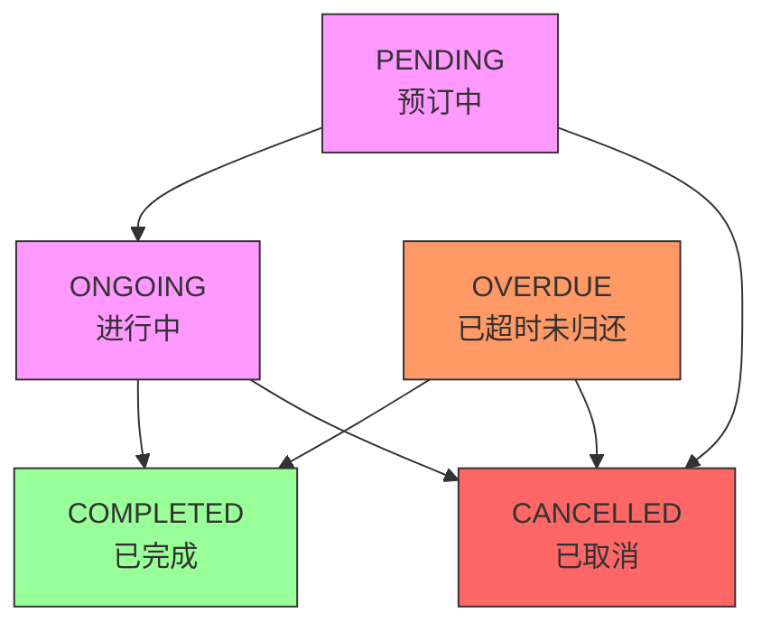

# 订单状态定义

<cite>
**本文档引用的文件**   
- [models.py](file://code/car_rental_system/rentals/models.py#L12-L115)
- [0001_initial.py](file://code/car_rental_system/rentals/migrations/0001_initial.py#L26)
- [forms.py](file://code/car_rental_system/rentals/forms.py#L277-L309)
- [views.py](file://code/car_rental_system/rentals/views.py#L20)
- [update_expired_rentals.py](file://code/car_rental_system/rentals/management/commands/update_expired_rentals.py#L12)
</cite>

## 目录
1. [订单状态定义](#订单状态定义)
2. [数据库实现](#数据库实现)
3. [状态业务含义](#状态业务含义)
4. [状态转换规则](#状态转换规则)
5. [自动状态更新机制](#自动状态更新机制)
6. [查询示例](#查询示例)

## 订单状态定义

租赁订单（Rental）模型定义了五种订单状态：PENDING（预订中）、ONGOING（进行中）、OVERDUE（已超时未归还）、COMPLETED（已完成）和CANCELLED（已取消）。这些状态通过RENTAL_STATUS_CHOICES元组在Rental模型中定义，为订单的生命周期提供了清晰的状态划分。

**文档来源**
- [models.py](file://code/car_rental_system/rentals/models.py#L12-L19)

## 数据库实现

订单状态字段在数据库中通过CharField(max_length=20)实现，并配合choices参数（RENTAL_STATUS_CHOICES）进行约束。这种实现方式确保了数据库中存储的状态值只能是预定义的五个选项之一，从而保证了数据的完整性和一致性。

在模型的Meta类中，已为status字段建立了数据库索引（models.Index(fields=['status'])），以优化基于状态的查询性能。此外，还建立了复合索引（如customer和status、vehicle和status），以支持更复杂的查询场景。

**文档来源**
- [models.py](file://code/car_rental_system/rentals/models.py#L109-L115)
- [models.py](file://code/car_rental_system/rentals/models.py#L163-L169)
- [0001_initial.py](file://code/car_rental_system/rentals/migrations/0001_initial.py#L26)
- [0001_initial.py](file://code/car_rental_system/rentals/migrations/0001_initial.py#L39)

## 状态业务含义

每种订单状态代表了租赁流程中的一个特定阶段，具有明确的业务含义：

- **PENDING（预订中）**：表示订单已创建，但租赁尚未开始。此状态下的订单通常对应未来的租赁日期。
- **ONGOING（进行中）**：表示租赁正在进行中，客户已取车，租赁期已开始。
- **OVERDUE（已超时未归还）**：表示租赁已过结束日期，但客户尚未归还车辆。此状态用于标识逾期未还的订单。
- **COMPLETED（已完成）**：表示租赁已成功完成，车辆已归还，订单已结算。
- **CANCELLED（已取消）**：表示订单已被取消，租赁不会发生。

**文档来源**
- [models.py](file://code/car_rental_system/rentals/models.py#L13-L18)

## 状态转换规则

系统通过RentalStatusForm表单类定义了严格的状态转换规则，确保状态变更的合法性。有效的状态转换包括：
- PENDING → ONGOING 或 CANCELLED
- ONGOING → COMPLETED 或 CANCELLED
- COMPLETED 和 CANCELLED 状态不可再转换

这些规则在表单的clean_status方法中实现，防止了非法的状态转换。

**图表来源**
- [forms.py](file://code/car_rental_system/rentals/forms.py#L296-L304)

**文档来源**
- [forms.py](file://code/car_rental_system/rentals/forms.py#L277-L309)

## 自动状态更新机制

系统通过Rental模型的auto_update_status类方法和管理命令update_expired_rentals.py实现了自动状态更新。该机制每天运行，执行以下操作：
- 将start_date小于等于今天的PENDING订单自动更新为ONGOING状态。
- 将end_date小于今天的ONGOING订单自动更新为OVERDUE状态。

此机制通过缓存（每5分钟最多执行一次）避免了频繁更新，提高了系统性能。

**文档来源**
- [models.py](file://code/car_rental_system/rentals/models.py#L171-L229)
- [views.py](file://code/car_rental_system/rentals/views.py#L20)
- [update_expired_rentals.py](file://code/car_rental_system/rentals/management/commands/update_expired_rentals.py#L12)

## 查询示例

由于status字段已建立数据库索引，可以高效地执行基于状态的查询。以下是一些常见的ORM查询示例：

- 查询所有逾期未还的订单：`Rental.objects.filter(status='OVERDUE')`
- 查询特定客户的所有进行中订单：`Rental.objects.filter(customer=customer, status='ONGOING')`
- 统计各状态订单数量：`Rental.objects.values('status').annotate(count=Count('id'))`

**文档来源**
- [models.py](file://code/car_rental_system/rentals/models.py#L166)
- [views.py](file://code/car_rental_system/rentals/views.py#L27-L32)