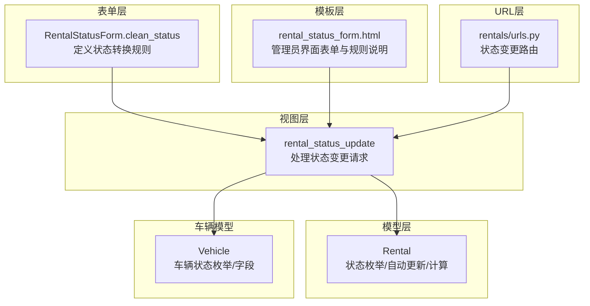
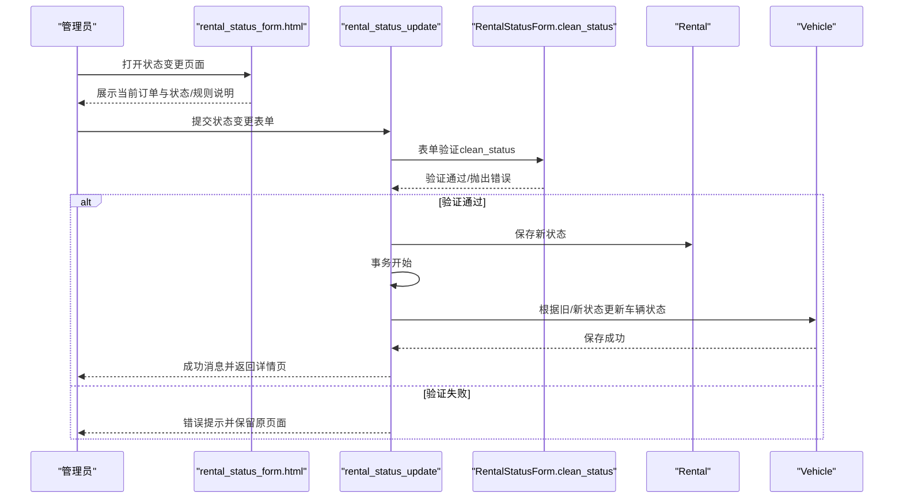
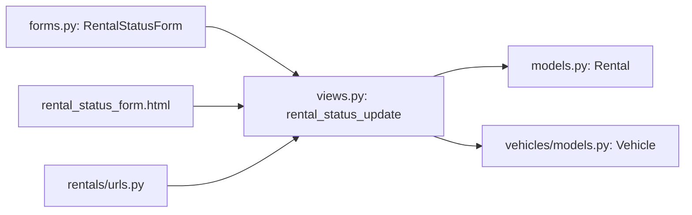

# 订单状态流转规则

<cite>
**本文引用的文件**
- [forms.py](file://code/car_rental_system/rentals/forms.py)
- [views.py](file://code/car_rental_system/rentals/views.py)
- [models.py](file://code/car_rental_system/rentals/models.py)
- [rental_status_form.html](file://code/car_rental_system/templates/rentals/rental_status_form.html)
- [urls.py](file://code/car_rental_system/rentals/urls.py)
- [vehicles/models.py](file://code/car_rental_system/vehicles/models.py)
- [test_order_status_update.py](file://code/car_rental_system/test_order_status_update.py)
</cite>

## 目录
1. [简介](#简介)
2. [项目结构](#项目结构)
3. [核心组件](#核心组件)
4. [架构总览](#架构总览)
5. [详细组件分析](#详细组件分析)
6. [依赖关系分析](#依赖关系分析)
7. [性能考量](#性能考量)
8. [故障排查指南](#故障排查指南)
9. [结论](#结论)

## 简介
本文件围绕“订单状态的合法流转规则及其实现机制”展开，重点基于 RentalStatusForm 表单中的 clean_status 方法，明确状态转换的业务约束：  
- “预订中”可转为“进行中”或“已取消”；  
- “进行中”可转为“已完成”或“已取消”；  
- “已完成”和“已取消”为终态，不可再变更。  

同时，文档阐述 rental_status_update 视图函数如何处理状态变更请求，包括事务性操作（transaction.atomic）确保车辆状态同步更新（如“进行中”→“已完成”时车辆状态变更为“AVAILABLE”），并结合 rental_status_form.html 模板描述管理员界面的状态变更表单交互流程，提供前后端验证协同工作的示例，确保系统状态一致性。

## 项目结构
与订单状态流转直接相关的模块与文件如下：
- 表单层：RentalStatusForm（定义状态转换规则与校验）
- 视图层：rental_status_update（处理状态变更请求，协调事务与车辆状态）
- 模型层：Rental（定义状态枚举、自动更新逻辑、计算与财务刷新）
- 模板层：rental_status_form.html（管理员界面的状态变更表单与规则说明）
- URL 层：rentals/urls.py（状态变更路由）
- 车辆模型：vehicles/models.py（车辆状态枚举与状态字段）



图表来源
- [forms.py](file://code/car_rental_system/rentals/forms.py#L277-L310)
- [views.py](file://code/car_rental_system/rentals/views.py#L234-L276)
- [models.py](file://code/car_rental_system/rentals/models.py#L12-L26)
- [rental_status_form.html](file://code/car_rental_system/templates/rentals/rental_status_form.html#L1-L96)
- [urls.py](file://code/car_rental_system/rentals/urls.py#L9-L19)
- [vehicles/models.py](file://code/car_rental_system/vehicles/models.py#L6-L12)

章节来源
- [forms.py](file://code/car_rental_system/rentals/forms.py#L277-L310)
- [views.py](file://code/car_rental_system/rentals/views.py#L234-L276)
- [models.py](file://code/car_rental_system/rentals/models.py#L12-L26)
- [rental_status_form.html](file://code/car_rental_system/templates/rentals/rental_status_form.html#L1-L96)
- [urls.py](file://code/car_rental_system/rentals/urls.py#L9-L19)
- [vehicles/models.py](file://code/car_rental_system/vehicles/models.py#L6-L12)

## 核心组件
- 状态转换规则定义：RentalStatusForm.clean_status 中通过字典 valid_transitions 明确各状态的允许目标状态集合，非法转换将抛出验证错误。
- 视图处理：rental_status_update 接收 POST 请求，先由表单 clean_status 校验，再在事务中更新订单状态，并根据旧状态与新状态联动更新车辆状态。
- 自动更新：Rental.auto_update_status 在首页/列表页等入口调用，自动将“预订中”激活为“进行中”，或将“进行中”更新为“已超时未归还”，并在事务中同步车辆状态。
- 模板与交互：rental_status_form.html 展示当前订单信息、当前状态、状态选择控件以及状态转换规则说明，便于管理员正确操作。

章节来源
- [forms.py](file://code/car_rental_system/rentals/forms.py#L277-L310)
- [views.py](file://code/car_rental_system/rentals/views.py#L234-L276)
- [models.py](file://code/car_rental_system/rentals/models.py#L171-L229)
- [rental_status_form.html](file://code/car_rental_system/templates/rentals/rental_status_form.html#L1-L96)

## 架构总览
下面的序列图展示了管理员在 rental_status_form.html 页面提交状态变更请求后的完整处理链路，包括前后端验证协同与事务性更新。



图表来源
- [rental_status_form.html](file://code/car_rental_system/templates/rentals/rental_status_form.html#L1-L96)
- [views.py](file://code/car_rental_system/rentals/views.py#L234-L276)
- [forms.py](file://code/car_rental_system/rentals/forms.py#L277-L310)
- [models.py](file://code/car_rental_system/rentals/models.py#L12-L26)
- [vehicles/models.py](file://code/car_rental_system/vehicles/models.py#L6-L12)

## 详细组件分析

### 状态转换规则与表单校验（RentalStatusForm.clean_status）
- 规则来源：valid_transitions 字典定义了每个当前状态允许的目标状态集合，非法转换将触发验证错误。
- 规则要点：
  - “预订中”→“进行中”或“已取消”
  - “进行中”→“已完成”或“已取消”
  - “已完成”和“已取消”为终态，不可再变更
- 表单渲染：rental_status_form.html 的状态选择控件绑定 RentalStatusForm，展示当前状态与可选目标状态，同时在页面底部给出状态转换规则说明，辅助管理员正确选择。

章节来源
- [forms.py](file://code/car_rental_system/rentals/forms.py#L277-L310)
- [rental_status_form.html](file://code/car_rental_system/templates/rentals/rental_status_form.html#L33-L57)
- [rental_status_form.html](file://code/car_rental_system/templates/rentals/rental_status_form.html#L63-L93)

### 视图处理流程（rental_status_update）
- 请求入口：URL 路由 rentals:rental_status_update 对应视图函数 rental_status_update。
- 处理步骤：
  1) 表单验证：使用 RentalStatusForm(request.POST, instance=rental)，调用 clean_status 校验状态转换合法性。
  2) 保存状态：若验证通过，保存新状态到订单。
  3) 事务性更新车辆状态：
     - “预订中”→“进行中”：将车辆状态置为“已租”
     - “预订中/进行中”→“已完成”：将车辆状态置为“可用”
     - “任何状态”→“已取消”：若车辆处于“已租”，将其置为“可用”
  4) 消息反馈与重定向：根据转换类型返回相应提示并跳转至订单详情页。

```mermaid
flowchart TD
Start(["进入 rental_status_update"]) --> Validate["表单验证 clean_status"]
Validate --> Valid{"验证通过？"}
Valid --> |否| ShowError["显示错误并返回页面"]
Valid --> |是| SaveStatus["保存新状态"]
SaveStatus --> TxnStart["开启事务"]
TxnStart --> Transition{"旧/新状态组合"}
Transition --> |预订中→进行中| SetRented["车辆状态=已租"]
Transition --> |"预订中/进行中"→"已完成"| SetAvailable["车辆状态=可用"]
Transition --> |"任何状态"→"已取消"| CheckRented{"车辆是否已租？"}
CheckRented --> |是| SetAvailable2["车辆状态=可用"]
CheckRented --> |否| Skip["无需变更车辆状态"]
SetRented --> Done["提交事务并返回详情页"]
SetAvailable --> Done
SetAvailable2 --> Done
Skip --> Done
ShowError --> End(["结束"])
Done --> End
```

图表来源
- [views.py](file://code/car_rental_system/rentals/views.py#L234-L276)
- [forms.py](file://code/car_rental_system/rentals/forms.py#L277-L310)
- [vehicles/models.py](file://code/car_rental_system/vehicles/models.py#L6-L12)

章节来源
- [views.py](file://code/car_rental_system/rentals/views.py#L234-L276)

### 自动状态更新与车辆状态联动（Rental.auto_update_status）
- 触发时机：在首页/列表页等入口处调用，避免频繁更新（使用缓存控制更新频率）。
- 更新策略：
  - “预订中”→“进行中”：当到达开始日期时激活订单，并将对应车辆状态置为“已租”
  - “进行中”→“已超时未归还”：当超过结束日期时更新订单状态
- 事务保障：自动更新在事务中执行，保证订单与车辆状态的一致性。

章节来源
- [models.py](file://code/car_rental_system/rentals/models.py#L171-L229)

### 模板交互与前端验证协同（rental_status_form.html）
- 页面结构：
  - 展示订单号、客户、车辆等基本信息
  - 显示当前订单状态
  - 提供状态选择控件（仅显示允许的目标状态）
  - 展示状态转换规则说明，帮助管理员理解可选动作
- 前端验证与后端验证协同：
  - 前端：模板层面限制可选状态（由表单控件决定），并显示错误信息
  - 后端：RentalStatusForm.clean_status 再次严格校验转换合法性，防止绕过前端限制
  - 若验证失败，返回错误信息并保留页面，确保状态一致性

章节来源
- [rental_status_form.html](file://code/car_rental_system/templates/rentals/rental_status_form.html#L1-L96)
- [forms.py](file://code/car_rental_system/rentals/forms.py#L277-L310)

### URL 路由与访问入口
- 路由定义：rentals/urls.py 将状态变更请求映射到 rental_status_update 视图函数，路径为 <int:pk>/status/
- 访问方式：管理员在订单详情页点击“更新状态”按钮，进入状态变更页面并提交表单

章节来源
- [urls.py](file://code/car_rental_system/rentals/urls.py#L9-L19)

## 依赖关系分析
- 表单依赖模型：RentalStatusForm 依赖 Rental 的状态枚举与实例状态字段，用于构建 valid_transitions 并进行转换校验。
- 视图依赖表单与模型：rental_status_update 依赖 RentalStatusForm 进行状态校验，并依赖 Rental/ Vehicle 模型进行状态持久化与车辆状态联动。
- 模板依赖视图：rental_status_form.html 依赖视图传入的 form 与 rental 实例，渲染当前状态与规则说明。
- URL 依赖视图：URL 路由将请求转发至 rental_status_update。



图表来源
- [forms.py](file://code/car_rental_system/rentals/forms.py#L277-L310)
- [views.py](file://code/car_rental_system/rentals/views.py#L234-L276)
- [models.py](file://code/car_rental_system/rentals/models.py#L12-L26)
- [vehicles/models.py](file://code/car_rental_system/vehicles/models.py#L6-L12)
- [rental_status_form.html](file://code/car_rental_system/templates/rentals/rental_status_form.html#L1-L96)
- [urls.py](file://code/car_rental_system/rentals/urls.py#L9-L19)

章节来源
- [forms.py](file://code/car_rental_system/rentals/forms.py#L277-L310)
- [views.py](file://code/car_rental_system/rentals/views.py#L234-L276)
- [models.py](file://code/car_rental_system/rentals/models.py#L12-L26)
- [vehicles/models.py](file://code/car_rental_system/vehicles/models.py#L6-L12)
- [rental_status_form.html](file://code/car_rental_system/templates/rentals/rental_status_form.html#L1-L96)
- [urls.py](file://code/car_rental_system/rentals/urls.py#L9-L19)

## 性能考量
- 自动更新缓存：Rental.auto_update_status 使用缓存避免每请求都执行状态更新，降低数据库压力。
- 事务边界：状态变更与车辆状态更新均在事务中执行，确保原子性与一致性。
- 查询优化：列表页与详情页使用 select_related 减少 N+1 查询，提升响应速度。

章节来源
- [models.py](file://code/car_rental_system/rentals/models.py#L171-L229)
- [views.py](file://code/car_rental_system/rentals/views.py#L17-L59)

## 故障排查指南
- 状态转换报错
  - 现象：提交状态变更后提示“不能从X转换为Y”
  - 原因：违反了 valid_transitions 中的转换规则
  - 处理：参考 rental_status_form.html 的规则说明，选择允许的目标状态
- 车辆状态未同步
  - 现象：订单状态已更新，但车辆状态未改变
  - 原因：事务未提交或异常导致回滚
  - 处理：确认 rental_status_update 是否在事务中执行，查看是否有异常日志
- 自动更新未生效
  - 现象：到达开始/结束日期后订单状态未自动更新
  - 原因：缓存限制或异常
  - 处理：等待缓存过期或检查日志；必要时手动触发自动更新命令

章节来源
- [forms.py](file://code/car_rental_system/rentals/forms.py#L277-L310)
- [views.py](file://code/car_rental_system/rentals/views.py#L234-L276)
- [models.py](file://code/car_rental_system/rentals/models.py#L171-L229)
- [test_order_status_update.py](file://code/car_rental_system/test_order_status_update.py#L1-L288)

## 结论
- 业务规则清晰：通过 RentalStatusForm.clean_status 明确“预订中/进行中/已完成/已取消”的转换边界，非法转换直接被拦截。
- 实现可靠：rental_status_update 在事务中完成订单与车辆状态的同步更新，确保一致性。
- 用户体验友好：rental_status_form.html 提供直观的状态选择与规则说明，减少误操作。
- 可扩展性强：自动更新与缓存机制降低了系统负载，便于后续扩展更多状态或联动逻辑。