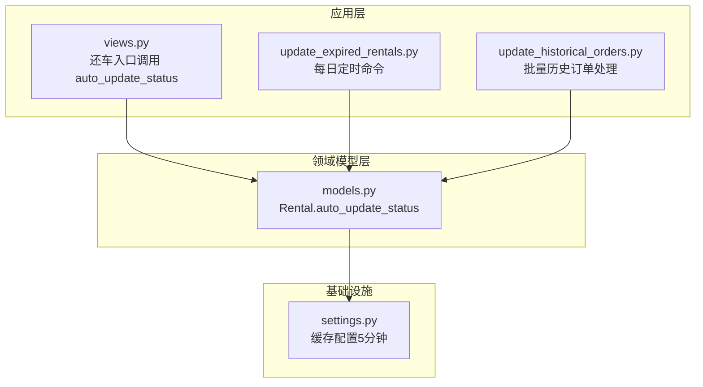
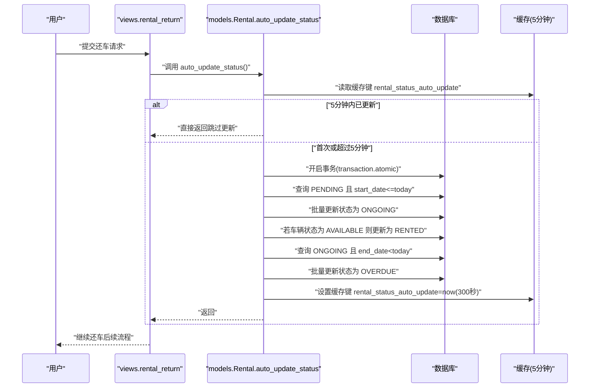
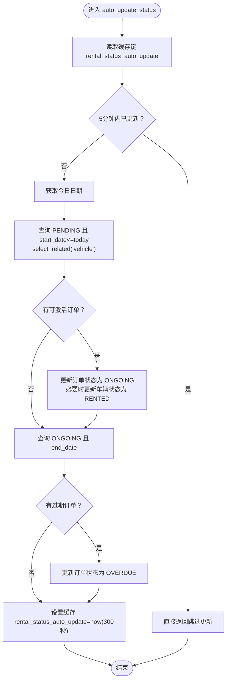
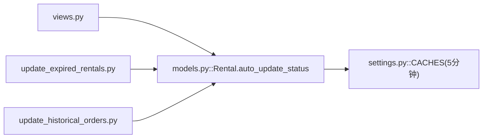

# 订单状态自动更新机制

<cite>
**本文引用的文件**
- [models.py](file://code/car_rental_system/rentals/models.py)
- [views.py](file://code/car_rental_system/rentals/views.py)
- [update_expired_rentals.py](file://code/car_rental_system/rentals/management/commands/update_expired_rentals.py)
- [update_historical_orders.py](file://code/car_rental_system/rentals/management/commands/update_historical_orders.py)
- [settings.py](file://code/car_rental_system/car_rental_system/settings.py)
- [订单自动更新使用说明.md](file://code/car_rental_system/订单自动更新使用说明.md)
</cite>

## 目录
1. [简介](#简介)
2. [项目结构](#项目结构)
3. [核心组件](#核心组件)
4. [架构总览](#架构总览)
5. [详细组件分析](#详细组件分析)
6. [依赖关系分析](#依赖关系分析)
7. [性能考量](#性能考量)
8. [故障排查指南](#故障排查指南)
9. [结论](#结论)

## 简介
本文聚焦于 Rental 模型的 auto_update_status 类方法，系统化阐述其自动状态更新机制：
- 将“预订中”在到达开始日期时升级为“进行中”，并联动更新对应车辆状态
- 将“进行中”在超过结束日期时升级为“已超时未归还”
- 使用 Django 缓存框架实现 5 分钟内防重复执行，避免频繁数据库写入
- 结合管理命令 update_historical_orders 的批量处理流程，说明其在历史订单批量处理中的调用与协同

同时给出性能优化建议（如 select_related 减少查询次数）与事务处理（transaction.atomic）保障数据一致性的最佳实践。

## 项目结构
围绕订单状态自动更新的关键文件与职责如下：
- rentals/models.py：定义 Rental 模型及 auto_update_status 类方法
- rentals/views.py：在还车入口处调用 auto_update_status，确保状态最新
- rentals/management/commands/update_expired_rentals.py：每日定时执行的命令，批量激活“预订中”与更新“进行中”为“已超时未归还”
- rentals/management/commands/update_historical_orders.py：批量处理历史订单，包含状态更新、押金退还、财务刷新等
- car_rental_system/settings.py：Django 缓存配置（默认 LocMemCache，5 分钟超时）
- 订单自动更新使用说明.md：Windows/Linux 定时任务配置与使用说明

图表来源
- [models.py](file://code/car_rental_system/rentals/models.py#L171-L229)
- [views.py](file://code/car_rental_system/rentals/views.py#L279-L392)
- [update_expired_rentals.py](file://code/car_rental_system/rentals/management/commands/update_expired_rentals.py#L15-L143)
- [update_historical_orders.py](file://code/car_rental_system/rentals/management/commands/update_historical_orders.py#L96-L165)
- [settings.py](file://code/car_rental_system/car_rental_system/settings.py#L141-L151)

章节来源
- [models.py](file://code/car_rental_system/rentals/models.py#L171-L229)
- [views.py](file://code/car_rental_system/rentals/views.py#L279-L392)
- [update_expired_rentals.py](file://code/car_rental_system/rentals/management/commands/update_expired_rentals.py#L15-L143)
- [update_historical_orders.py](file://code/car_rental_system/rentals/management/commands/update_historical_orders.py#L96-L165)
- [settings.py](file://code/car_rental_system/car_rental_system/settings.py#L141-L151)

## 核心组件
- auto_update_status 类方法：负责在单次调用中完成“预订中→进行中”和“进行中→已超时未归还”的状态更新；通过缓存键 rental_status_auto_update 实现 5 分钟内只执行一次；使用事务包裹，保证原子性
- 还车视图入口：在还车处理前主动调用 auto_update_status，确保状态与业务流程一致
- 定时命令 update_expired_rentals：每日定时执行，批量激活“预订中”并更新“进行中”为“已超时未归还”
- 批量命令 update_historical_orders：支持 dry-run，批量处理历史订单的状态更新、押金退还与财务刷新

章节来源
- [models.py](file://code/car_rental_system/rentals/models.py#L171-L229)
- [views.py](file://code/car_rental_system/rentals/views.py#L279-L392)
- [update_expired_rentals.py](file://code/car_rental_system/rentals/management/commands/update_expired_rentals.py#L15-L143)
- [update_historical_orders.py](file://code/car_rental_system/rentals/management/commands/update_historical_orders.py#L96-L165)

## 架构总览
下面的序列图展示了“还车入口”触发 auto_update_status 的完整流程，以及与定时命令的关系：

图表来源
- [views.py](file://code/car_rental_system/rentals/views.py#L279-L392)
- [models.py](file://code/car_rental_system/rentals/models.py#L171-L229)
- [settings.py](file://code/car_rental_system/car_rental_system/settings.py#L141-L151)

## 详细组件分析

### auto_update_status 类方法实现
- 触发时机
  - 在还车入口显式调用，确保还车前状态最新
  - 可由定时命令间接触发（命令内部也可调用该方法）
- 更新规则
  - “预订中”→“进行中”：当 start_date ≤ 今日
  - “进行中”→“已超时未归还”：当 end_date < 今日
- 防重复执行
  - 使用缓存键 rental_status_auto_update，若缓存存在则直接返回，避免同一分钟内重复更新
  - 缓存超时 300 秒（5 分钟），与定时任务频率相匹配
- 事务与一致性
  - 使用 transaction.atomic 包裹整个更新过程，任一步骤异常都不会导致部分更新
- 性能优化
  - 对“预订中”查询使用 select_related('vehicle')，减少车辆二次查询
  - 仅更新必要字段（status、updated_at、vehicle.status），降低写入开销

图表来源
- [models.py](file://code/car_rental_system/rentals/models.py#L171-L229)

章节来源
- [models.py](file://code/car_rental_system/rentals/models.py#L171-L229)

### 还车视图入口与 auto_update_status 的集成
- 还车入口在处理前先调用 auto_update_status，确保状态与业务一致
- 之后再进行还车日期、异地还车费用、超时费用、车辆状态释放、押金退还与财务刷新等后续流程

章节来源
- [views.py](file://code/car_rental_system/rentals/views.py#L279-L392)

### 定时命令 update_expired_rentals 的批量处理
- 每日定时执行，分阶段处理：
  - 阶段1：激活“预订中”为“进行中”
  - 阶段2：检查“进行中”过期订单，更新为“已超时未归还”（仅状态更新，不自动完成）
- 采用事务包裹，保证每个阶段内的原子性

章节来源
- [update_expired_rentals.py](file://code/car_rental_system/rentals/management/commands/update_expired_rentals.py#L15-L143)

### 批量命令 update_historical_orders 的协同
- 支持 dry-run 预览，批量处理历史订单：
  - 更新订单状态（PENDING→ONGOING，ONGOING→OVERDUE）
  - 退还已完成订单押金、已取消订单已支付金额
  - 刷新所有订单财务信息
- 该命令内部同样使用 select_related 与事务，确保批量更新的性能与一致性

章节来源
- [update_historical_orders.py](file://code/car_rental_system/rentals/management/commands/update_historical_orders.py#L96-L165)

## 依赖关系分析
- auto_update_status 依赖 Django 缓存框架（LocMemCache，默认 5 分钟超时）
- auto_update_status 依赖事务（transaction.atomic）保证原子性
- 还车视图依赖 auto_update_status 保证状态一致性
- 定时命令与批量命令均依赖 auto_update_status 的更新逻辑

图表来源
- [models.py](file://code/car_rental_system/rentals/models.py#L171-L229)
- [views.py](file://code/car_rental_system/rentals/views.py#L279-L392)
- [update_expired_rentals.py](file://code/car_rental_system/rentals/management/commands/update_expired_rentals.py#L15-L143)
- [update_historical_orders.py](file://code/car_rental_system/rentals/management/commands/update_historical_orders.py#L96-L165)
- [settings.py](file://code/car_rental_system/car_rental_system/settings.py#L141-L151)

章节来源
- [models.py](file://code/car_rental_system/rentals/models.py#L171-L229)
- [views.py](file://code/car_rental_system/rentals/views.py#L279-L392)
- [update_expired_rentals.py](file://code/car_rental_system/rentals/management/commands/update_expired_rentals.py#L15-L143)
- [update_historical_orders.py](file://code/car_rental_system/rentals/management/commands/update_historical_orders.py#L96-L165)
- [settings.py](file://code/car_rental_system/car_rental_system/settings.py#L141-L151)

## 性能考量
- 使用 select_related 减少 N+1 查询
  - 在“预订中”查询中使用 select_related('vehicle')，避免逐条访问车辆对象时的额外查询
  - 批量命令 update_historical_orders 中也对相关对象使用 select_related，提升批量处理效率
- 事务包裹
  - 使用 transaction.atomic 将多步更新合并为一个原子单元，减少锁竞争与中间态数据
- 缓存防重复
  - 通过缓存键 rental_status_auto_update 控制 5 分钟内只执行一次，显著降低数据库写入压力
- 索引优化
  - 模型索引包含 start_date、end_date、status、customer/status、vehicle/status，有助于过滤与排序查询的性能

章节来源
- [models.py](file://code/car_rental_system/rentals/models.py#L171-L229)
- [update_historical_orders.py](file://code/car_rental_system/rentals/management/commands/update_historical_orders.py#L96-L165)
- [settings.py](file://code/car_rental_system/car_rental_system/settings.py#L141-L151)

## 故障排查指南
- 状态未更新
  - 检查缓存是否命中：若缓存键 rental_status_auto_update 存在且未过期，auto_update_status 会直接返回
  - 确认定时任务是否正确执行（参考使用说明文档）
- 事务异常
  - 若某一步骤抛出异常，事务回滚，不会产生部分更新；可在日志中定位具体异常
- 还车后状态异常
  - 确保还车入口已调用 auto_update_status，并检查后续流程（异地还车费用、超时费用、车辆状态释放、押金退还、财务刷新）

章节来源
- [models.py](file://code/car_rental_system/rentals/models.py#L171-L229)
- [views.py](file://code/car_rental_system/rentals/views.py#L279-L392)
- [订单自动更新使用说明.md](file://code/car_rental_system/订单自动更新使用说明.md#L1-L119)

## 结论
Rental.auto_update_status 通过缓存与事务的组合，实现了高效、幂等的订单状态自动更新：
- 5 分钟内防重复执行，避免频繁写入
- 事务包裹保证批量更新的一致性
- 与还车入口、定时命令、批量命令形成闭环，覆盖日常运营与历史修复场景
- 建议在生产环境中配合合适的定时任务调度与监控，持续优化缓存与查询策略