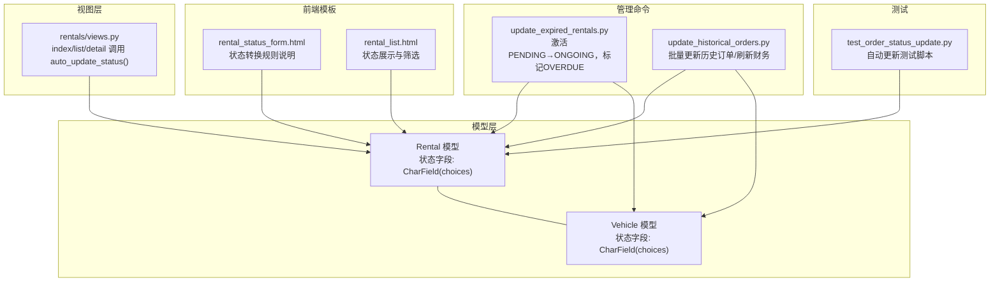
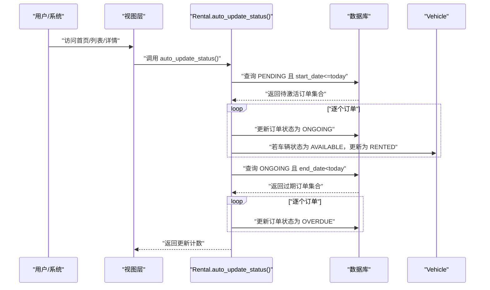
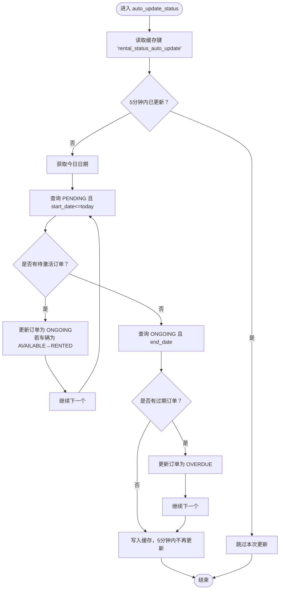
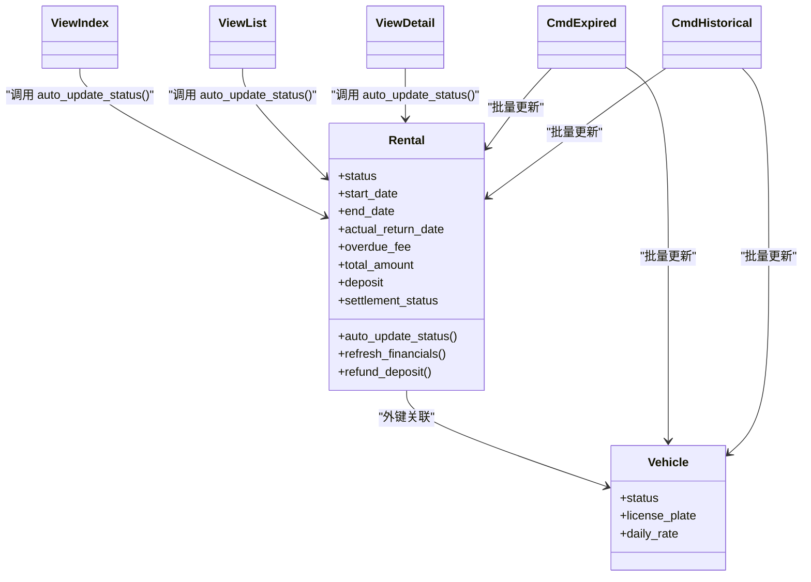

# 订单状态设计

<cite>
**本文引用的文件**
- [rentals/models.py](file://code/car_rental_system/rentals/models.py)
- [vehicles/models.py](file://code/car_rental_system/vehicles/models.py)
- [rentals/management/commands/update_expired_rentals.py](file://code/car_rental_system/rentals/management/commands/update_expired_rentals.py)
- [rentals/management/commands/update_historical_orders.py](file://code/car_rental_system/rentals/management/commands/update_historical_orders.py)
- [rentals/views.py](file://code/car_rental_system/rentals/views.py)
- [templates/rentals/rental_status_form.html](file://code/car_rental_system/templates/rentals/rental_status_form.html)
- [templates/rentals/rental_list.html](file://code/car_rental_system/templates/rentals/rental_list.html)
- [test_order_status_update.py](file://code/car_rental_system/test_order_status_update.py)
- [accounts/models.py](file://code/car_rental_system/accounts/models.py)
</cite>

## 目录
1. [简介](#简介)
2. [项目结构](#项目结构)
3. [核心组件](#核心组件)
4. [架构总览](#架构总览)
5. [详细组件分析](#详细组件分析)
6. [依赖关系分析](#依赖关系分析)
7. [性能考量](#性能考量)
8. [故障排查指南](#故障排查指南)
9. [结论](#结论)
10. [附录](#附录)

## 简介
本文件系统性文档化 Rental 模型的订单状态设计，覆盖五种状态的业务含义与流转规则，并解释状态字段在数据库中的存储方式（CharField+choices）、状态变更对车辆状态的联动影响（如“预订中→进行中”时车辆从 AVAILABLE 变为 RENTED）、auto_update_status 类方法的定时更新机制（每 5 分钟检查一次，避免重复执行），以及状态查询的 ORM 示例与索引优化建议。同时结合管理命令与视图层调用，帮助读者全面理解状态生命周期与系统集成点。

## 项目结构
围绕订单状态设计的关键文件分布如下：
- 模型层：Rental（订单）与 Vehicle（车辆）模型，定义状态字段与索引
- 视图层：首页、列表页、详情页均调用自动更新入口
- 管理命令：批量更新历史订单与过期订单的自动化脚本
- 前端模板：展示状态与状态转换规则
- 测试脚本：验证自动更新行为与边界条件

图表来源
- [rentals/models.py](file://code/car_rental_system/rentals/models.py#L12-L169)
- [vehicles/models.py](file://code/car_rental_system/vehicles/models.py#L6-L85)
- [rentals/views.py](file://code/car_rental_system/rentals/views.py#L17-L26)
- [rentals/management/commands/update_expired_rentals.py](file://code/car_rental_system/rentals/management/commands/update_expired_rentals.py#L12-L143)
- [rentals/management/commands/update_historical_orders.py](file://code/car_rental_system/rentals/management/commands/update_historical_orders.py#L96-L165)
- [templates/rentals/rental_status_form.html](file://code/car_rental_system/templates/rentals/rental_status_form.html#L63-L96)
- [templates/rentals/rental_list.html](file://code/car_rental_system/templates/rentals/rental_list.html#L140-L160)
- [test_order_status_update.py](file://code/car_rental_system/test_order_status_update.py#L1-L288)

章节来源
- [rentals/models.py](file://code/car_rental_system/rentals/models.py#L12-L169)
- [vehicles/models.py](file://code/car_rental_system/vehicles/models.py#L6-L85)
- [rentals/views.py](file://code/car_rental_system/rentals/views.py#L17-L26)

## 核心组件
- 订单模型（Rental）
  - 状态字段：CharField(max_length=20, choices=RENTAL_STATUS_CHOICES, default='PENDING')
  - 关键索引：status、(customer,status)、(vehicle,status)、start_date、end_date
  - 自动更新入口：类方法 auto_update_status()
  - 财务刷新：refresh_financials() 与退款：refund_deposit()

- 车辆模型（Vehicle）
  - 状态字段：CharField(max_length=20, choices=VEHICLE_STATUS_CHOICES, default='AVAILABLE')
  - 关键索引：license_plate、status、brand/model、seats

- 视图层
  - 在首页、列表页、详情页均调用 Rental.auto_update_status()，确保每次访问都进行状态检查与更新

- 管理命令
  - update_expired_rentals：激活 PENDING→ONGOING，标记 ONGOING→OVERDUE，并可自动退还已完成订单押金
  - update_historical_orders：批量更新历史订单状态、退还押金、刷新财务信息

章节来源
- [rentals/models.py](file://code/car_rental_system/rentals/models.py#L12-L169)
- [vehicles/models.py](file://code/car_rental_system/vehicles/models.py#L6-L85)
- [rentals/views.py](file://code/car_rental_system/rentals/views.py#L17-L26)
- [rentals/management/commands/update_expired_rentals.py](file://code/car_rental_system/rentals/management/commands/update_expired_rentals.py#L12-L143)
- [rentals/management/commands/update_historical_orders.py](file://code/car_rental_system/rentals/management/commands/update_historical_orders.py#L96-L165)

## 架构总览
订单状态与车辆状态联动的整体流程如下：
- 用户创建订单时，若状态为 PENDING，车辆状态被置为 RENTED（视图层逻辑）
- 系统通过 auto_update_status() 或管理命令定期扫描，将到达开始日期的 PENDING 订单转为 ONGOING，并将对应车辆状态置为 RENTED
- 若 ONGOING 订单超过结束日期，系统将其标记为 OVERDUE
- 订单完成后（还车），系统刷新财务并可能退还押金

图表来源
- [rentals/views.py](file://code/car_rental_system/rentals/views.py#L17-L26)
- [rentals/models.py](file://code/car_rental_system/rentals/models.py#L171-L229)
- [vehicles/models.py](file://code/car_rental_system/vehicles/models.py#L52-L58)

## 详细组件分析

### 状态字段与数据库存储
- 字段类型：CharField(max_length=20)
- 选择项：PENDING、ONGOING、OVERDUE、COMPLETED、CANCELLED
- 默认值：PENDING
- 存储位置：表 rentals 的 status 字段
- 索引策略：为 status、(customer,status)、(vehicle,status)、start_date、end_date 建立索引，提升按状态与日期过滤的查询性能

章节来源
- [rentals/models.py](file://code/car_rental_system/rentals/models.py#L12-L169)

### 业务含义与流转规则
- PENDING（预订中）
  - 含义：已创建但尚未开始的订单；通常表示已锁定车辆（视图层逻辑）
  - 流转：到达开始日期→ONGOING；管理员可直接取消→CANCELLED
- ONGOING（进行中）
  - 含义：正在使用的订单；车辆处于 RENTED 状态
  - 流转：到期未还→OVERDUE；还车后→COMPLETED
- OVERDUE（已超时未归还）
  - 含义：超过结束日期仍未归还的订单；系统标记为超时
  - 流转：还车后→COMPLETED；管理员可取消→CANCELLED
- COMPLETED（已完成）
  - 含义：订单已结束，通常伴随财务结算与押金退还
  - 流转：不可再改变
- CANCELLED（已取消）
  - 含义：订单被取消；可能涉及已支付金额的退款
  - 流转：不可再改变

章节来源
- [templates/rentals/rental_status_form.html](file://code/car_rental_system/templates/rentals/rental_status_form.html#L63-L96)
- [templates/rentals/rental_list.html](file://code/car_rental_system/templates/rentals/rental_list.html#L140-L160)

### 状态变更对车辆状态的联动
- PENDING→ONGOING：当订单开始日期到达时，系统将订单状态更新为 ONGOING，并将对应车辆状态从 AVAILABLE 更新为 RENTED
- ONGOING→OVERDUE：到期未还车时不自动释放车辆，仅标记为超时
- 还车后（COMPLETED）：系统刷新财务并可能退还押金，车辆状态在还车流程中由业务逻辑控制释放

章节来源
- [rentals/models.py](file://code/car_rental_system/rentals/models.py#L195-L209)
- [rentals/management/commands/update_expired_rentals.py](file://code/car_rental_system/rentals/management/commands/update_expired_rentals.py#L66-L88)
- [rentals/management/commands/update_historical_orders.py](file://code/car_rental_system/rentals/management/commands/update_historical_orders.py#L110-L120)

### auto_update_status 类方法与定时更新机制
- 触发时机：视图层在首页、列表页、详情页均调用 Rental.auto_update_status()
- 执行逻辑：
  - 预订中→进行中：查询 start_date≤today 且 status='PENDING' 的订单，逐个更新为 ONGOING，并联动更新车辆状态为 RENTED
  - 进行中→已超时未归还：查询 end_date<today 且 status='ONGOING' 的订单，逐个更新为 OVERDUE
- 防抖机制：使用缓存键 'rental_status_auto_update'，在 5 分钟内只执行一次，避免重复执行
- 错误处理：捕获异常并记录日志，不影响正常流程

图表来源
- [rentals/views.py](file://code/car_rental_system/rentals/views.py#L17-L26)
- [rentals/models.py](file://code/car_rental_system/rentals/models.py#L171-L229)

章节来源
- [rentals/views.py](file://code/car_rental_system/rentals/views.py#L17-L26)
- [rentals/models.py](file://code/car_rental_system/rentals/models.py#L171-L229)

### 管理命令与批量处理
- update_expired_rentals
  - 功能：激活 PENDING→ONGOING，标记 ONGOING→OVERDUE，并输出统计
  - 注意：订单只有在用户还车后才完成，系统不会自动完成订单
- update_historical_orders
  - 功能：批量更新历史订单状态、退还已完成订单押金、退还已取消订单已支付金额、刷新所有订单财务信息
  - 支持 dry-run 与跳过选项，便于预览与安全执行

章节来源
- [rentals/management/commands/update_expired_rentals.py](file://code/car_rental_system/rentals/management/commands/update_expired_rentals.py#L12-L143)
- [rentals/management/commands/update_historical_orders.py](file://code/car_rental_system/rentals/management/commands/update_historical_orders.py#L96-L165)

### 前端状态展示与状态转换
- rental_status_form.html 展示状态转换规则，明确 PENDING 可转 ONGOING/CANCELLED，ONGOING 可转 COMPLETED/CANCELLED，COMPLETED/CANCELLED 不可再转
- rental_list.html 使用徽章展示当前状态，便于快速识别

章节来源
- [templates/rentals/rental_status_form.html](file://code/car_rental_system/templates/rentals/rental_status_form.html#L63-L96)
- [templates/rentals/rental_list.html](file://code/car_rental_system/templates/rentals/rental_list.html#L140-L160)

### 财务刷新与押金退还
- refresh_financials()：根据支付记录刷新累计支付/退款信息，并依据应付金额与实付金额更新结算状态
- refund_deposit()：在订单完成时自动退还押金（若满足条件）

章节来源
- [rentals/models.py](file://code/car_rental_system/rentals/models.py#L296-L333)
- [rentals/models.py](file://code/car_rental_system/rentals/models.py#L334-L394)
- [accounts/models.py](file://code/car_rental_system/accounts/models.py)

## 依赖关系分析
- Rental 与 Vehicle：一对多外键关系，Rental.vehicle 用于状态联动
- 视图层依赖：index/list/detail 三处调用 auto_update_status()
- 管理命令依赖：Rental.auto_update_status() 与 Vehicle 模型
- 前端模板依赖：状态字段与显示规则

图表来源
- [rentals/models.py](file://code/car_rental_system/rentals/models.py#L12-L169)
- [vehicles/models.py](file://code/car_rental_system/vehicles/models.py#L6-L85)
- [rentals/views.py](file://code/car_rental_system/rentals/views.py#L17-L26)
- [rentals/management/commands/update_expired_rentals.py](file://code/car_rental_system/rentals/management/commands/update_expired_rentals.py#L12-L143)
- [rentals/management/commands/update_historical_orders.py](file://code/car_rental_system/rentals/management/commands/update_historical_orders.py#L96-L165)

## 性能考量
- 数据库索引
  - 为 rentals.status、(customer,status)、(vehicle,status)、start_date、end_date 建立索引，显著提升按状态与日期过滤的查询性能
- 缓存防抖
  - auto_update_status 使用缓存键 'rental_status_auto_update'，5 分钟内仅执行一次，避免高频请求导致的重复更新
- 原子事务
  - 状态更新与车辆状态更新均在事务中执行，保证一致性
- 视图层调用频率
  - 首页、列表页、详情页均调用 auto_update_status()，建议配合缓存与索引，确保响应时间稳定

章节来源
- [rentals/models.py](file://code/car_rental_system/rentals/models.py#L158-L169)
- [rentals/models.py](file://code/car_rental_system/rentals/models.py#L171-L229)
- [rentals/views.py](file://code/car_rental_system/rentals/views.py#L17-L26)

## 故障排查指南
- 状态未更新
  - 检查 auto_update_status 是否被调用（视图层已统一调用）
  - 检查缓存键 'rental_status_auto_update' 是否存在（5 分钟内不会重复执行）
  - 确认订单日期是否满足 start_date≤today 或 end_date<today
- 车辆状态未联动
  - 确认订单状态确实从 PENDING→ONGOING 或 ONGOING→OVERDUE
  - 检查车辆当前状态是否为 AVAILABLE（仅 AVAILABLE 才会被更新为 RENTED）
- 管理命令执行异常
  - 查看命令输出与日志，确认事务是否成功提交
  - 使用 --dry-run 预览操作，确认无误后再执行真实更新
- 财务信息不一致
  - 调用 refresh_financials() 刷新累计支付/退款
  - 检查是否存在未完成的退款记录

章节来源
- [rentals/views.py](file://code/car_rental_system/rentals/views.py#L17-L26)
- [rentals/models.py](file://code/car_rental_system/rentals/models.py#L171-L229)
- [rentals/management/commands/update_expired_rentals.py](file://code/car_rental_system/rentals/management/commands/update_expired_rentals.py#L12-L143)
- [rentals/management/commands/update_historical_orders.py](file://code/car_rental_system/rentals/management/commands/update_historical_orders.py#L96-L165)

## 结论
本系统采用 CharField+choices 的状态设计，清晰表达五种订单状态及其业务含义；通过 auto_update_status 与管理命令实现自动化状态流转，并在关键节点联动车辆状态，确保业务一致性。配合数据库索引与缓存防抖，系统在高并发场景下仍能保持稳定与高效。前端模板直观展示状态与转换规则，便于运营与用户理解。

## 附录

### 状态查询的 ORM 示例与索引优化
- 查询所有超时订单
  - 示例路径：Rental.objects.filter(status='OVERDUE')
  - 说明：利用索引 rentals_status_idx 与 (vehicle,status)/ (customer,status) 等索引，提升过滤效率
- 其他常用查询
  - 查询今日开始的订单：Rental.objects.filter(start_date=date.today())
  - 查询今日到期的订单：Rental.objects.filter(end_date=date.today())
  - 按客户与状态组合查询：Rental.objects.filter(customer=customer, status='ONGOING')
  - 按车辆与状态组合查询：Rental.objects.filter(vehicle=vehicle, status='ONGOING')

章节来源
- [rentals/models.py](file://code/car_rental_system/rentals/models.py#L158-L169)
- [test_order_status_update.py](file://code/car_rental_system/test_order_status_update.py#L1-L288)