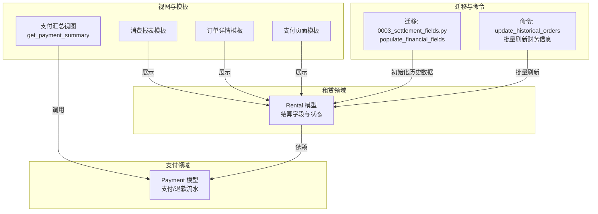
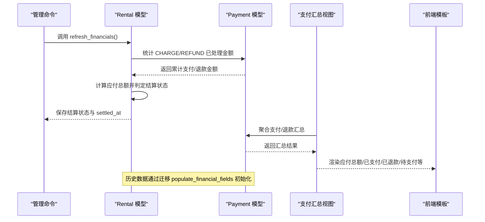
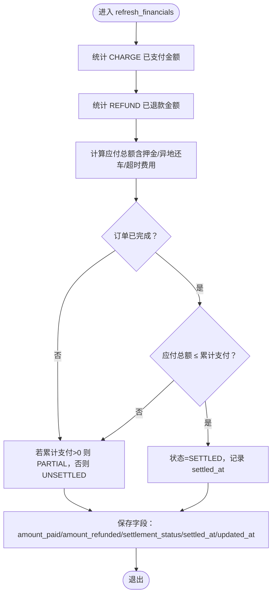
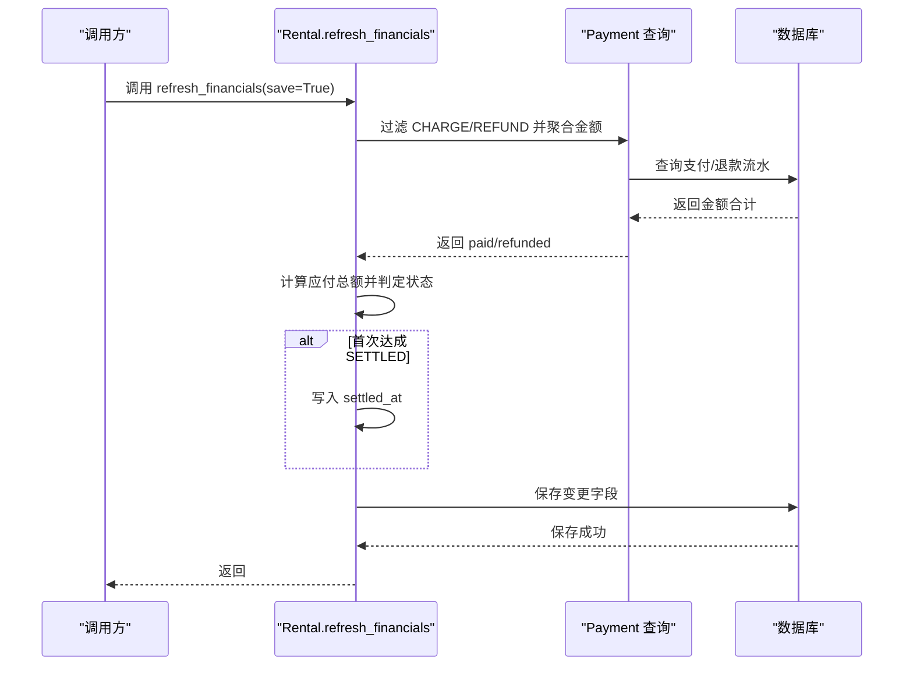
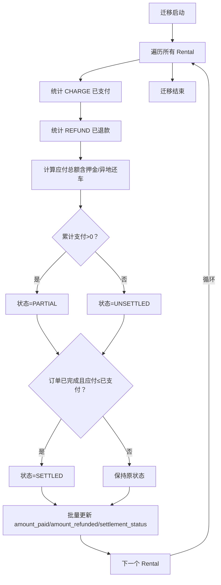
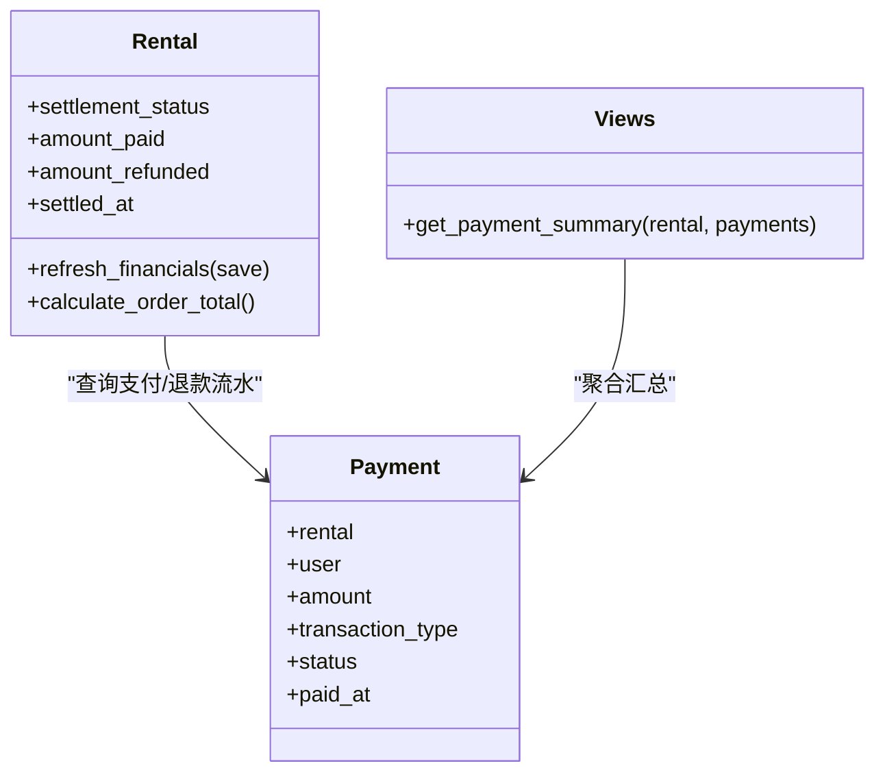

# 结算状态管理

<cite>
**本文引用的文件**
- [rentals/models.py](file://code/car_rental_system/rentals/models.py)
- [rentals/migrations/0003_settlement_fields.py](file://code/car_rental_system/rentals/migrations/0003_settlement_fields.py)
- [accounts/models.py](file://code/car_rental_system/accounts/models.py)
- [accounts/views.py](file://code/car_rental_system/accounts/views.py)
- [rentals/management/commands/update_historical_orders.py](file://code/car_rental_system/rentals/management/commands/update_historical_orders.py)
- [templates/accounts/consumption_report.html](file://code/car_rental_system/templates/accounts/consumption_report.html)
- [templates/accounts/order_detail.html](file://code/car_rental_system/templates/accounts/order_detail.html)
- [templates/accounts/payment.html](file://code/car_rental_system/templates/accounts/payment.html)
</cite>

## 目录
1. [引言](#引言)
2. [项目结构](#项目结构)
3. [核心组件](#核心组件)
4. [架构总览](#架构总览)
5. [详细组件分析](#详细组件分析)
6. [依赖关系分析](#依赖关系分析)
7. [性能考量](#性能考量)
8. [故障排查指南](#故障排查指南)
9. [结论](#结论)

## 引言
本文件围绕 Rental 模型的结算状态（settlement_status）管理机制展开，系统性阐述以下内容：
- UNSETTLED（未结算）、PARTIAL（部分结算）、SETTLED（已结算）三种状态的转换逻辑
- refresh_financials() 方法如何基于 Payment 记录动态更新 amount_paid（累计支付金额）与 amount_refunded（累计退款金额），并据此自动调整结算状态
- settled_at（结算时间）字段的更新时机（仅在状态从非 SETTLED 变为 SETTLED 时记录）
- 历史数据初始化过程：通过 0003_settlement_fields.py 迁移文件中的 populate_financial_fields 函数对存量订单进行一次性补算与赋值

## 项目结构
与结算状态相关的代码主要分布在以下模块：
- 租赁领域模型：Rental 模型及其结算字段、状态转换逻辑
- 支付领域模型：Payment 模型提供支付/退款流水
- 视图层：支付汇总与前端展示
- 迁移脚本：历史数据初始化
- 管理命令：批量刷新历史订单财务信息

图表来源
- [rentals/models.py](file://code/car_rental_system/rentals/models.py#L120-L170)
- [accounts/models.py](file://code/car_rental_system/accounts/models.py#L147-L200)
- [accounts/views.py](file://code/car_rental_system/accounts/views.py#L243-L268)
- [rentals/migrations/0003_settlement_fields.py](file://code/car_rental_system/rentals/migrations/0003_settlement_fields.py#L1-L95)
- [rentals/management/commands/update_historical_orders.py](file://code/car_rental_system/rentals/management/commands/update_historical_orders.py#L286-L311)

章节来源
- [rentals/models.py](file://code/car_rental_system/rentals/models.py#L120-L170)
- [accounts/models.py](file://code/car_rental_system/accounts/models.py#L147-L200)
- [rentals/migrations/0003_settlement_fields.py](file://code/car_rental_system/rentals/migrations/0003_settlement_fields.py#L1-L95)
- [rentals/management/commands/update_historical_orders.py](file://code/car_rental_system/rentals/management/commands/update_historical_orders.py#L286-L311)

## 核心组件
- Rental 模型新增结算字段
  - amount_paid：累计支付金额（不含退款）
  - amount_refunded：累计退款金额
  - settlement_status：结算状态（UNSETTLED/PARTIAL/SETTLED）
  - settled_at：结算完成时间（仅在状态变为 SETTLED 时记录）

- refresh_financials() 方法
  - 动态统计指定 Rental 下的 CHARGE（支付）与 REFUND（退款）两类交易的已处理金额
  - 基于 calculate_order_total() 计算应付总额，按支付与订单总费用的关系自动调整 settlement_status
  - 在状态由非 SETTLED 变为 SETTLED 时写入 settled_at

- 历史数据初始化
  - 迁移 0003_settlement_fields.py 为 Rental 表添加结算字段，并通过 populate_financial_fields 对历史订单进行一次性补算与赋值

章节来源
- [rentals/models.py](file://code/car_rental_system/rentals/models.py#L120-L170)
- [rentals/models.py](file://code/car_rental_system/rentals/models.py#L296-L333)
- [rentals/migrations/0003_settlement_fields.py](file://code/car_rental_system/rentals/migrations/0003_settlement_fields.py#L1-L95)

## 架构总览
下图展示了结算状态管理在系统中的关键交互路径：Rental 依赖 Payment 进行财务统计；视图层提供支付汇总；模板层展示结算状态与金额；迁移与命令负责历史数据初始化与批量刷新。

图表来源
- [rentals/models.py](file://code/car_rental_system/rentals/models.py#L296-L333)
- [accounts/views.py](file://code/car_rental_system/accounts/views.py#L243-L268)
- [templates/accounts/consumption_report.html](file://code/car_rental_system/templates/accounts/consumption_report.html#L31-L54)
- [templates/accounts/order_detail.html](file://code/car_rental_system/templates/accounts/order_detail.html#L298-L330)
- [templates/accounts/payment.html](file://code/car_rental_system/templates/accounts/payment.html#L79-L101)
- [rentals/migrations/0003_settlement_fields.py](file://code/car_rental_system/rentals/migrations/0003_settlement_fields.py#L1-L95)

## 详细组件分析

### 结算状态转换逻辑
Rental 模型的结算状态转换遵循如下规则：
- 若存在任何已支付的 CHARGE 交易，且订单尚未完成，则状态为 PARTIAL
- 若订单已完成（status=COMPLETED），且应付总额小于等于累计支付金额，则状态为 SETTLED，并记录 settled_at
- 否则状态为 UNSETTLED，并清空 settled_at

图表来源
- [rentals/models.py](file://code/car_rental_system/rentals/models.py#L296-L333)

章节来源
- [rentals/models.py](file://code/car_rental_system/rentals/models.py#L296-L333)

### refresh_financials() 方法的工作机制
- 输入：Rental 实例
- 关键步骤
  - 通过 Payment 查询指定 Rental 的 CHARGE（已支付）与 REFUND（已退款）两类交易，分别求和得到 amount_paid 与 amount_refunded
  - 调用 calculate_order_total() 计算应付总额（包含基础租金、押金、异地还车费用、超时费用）
  - 根据上述条件更新 settlement_status，并在首次达成 SETTLED 条件时写入 settled_at
  - 可选保存：仅保存变更字段以减少开销

图表来源
- [rentals/models.py](file://code/car_rental_system/rentals/models.py#L296-L333)

章节来源
- [rentals/models.py](file://code/car_rental_system/rentals/models.py#L296-L333)

### settled_at 字段的更新时机
- 仅在结算状态从非 SETTLED 变为 SETTLED 时写入当前时间
- 当状态回到 UNSETTLED 或保持 PARTIAL 时，settled_at 会被清空
- 该策略确保 settled_at 仅指向最后一次完成结算的时间点

章节来源
- [rentals/models.py](file://code/car_rental_system/rentals/models.py#L313-L324)

### 历史数据初始化：populate_financial_fields
- 迁移在 Rental 表上新增结算字段后，遍历所有 Rental 记录
- 对每个订单：
  - 统计 CHARGE（已支付）与 REFUND（已退款）两类交易的合计金额，填充 amount_paid 与 amount_refunded
  - 计算应付总额（基础租金+押金，若异地还车则加上异地还车费用）
  - 根据是否存在已支付以及订单是否已完成，确定 settlement_status
  - 一次性更新对应 Rental 记录

图表来源
- [rentals/migrations/0003_settlement_fields.py](file://code/car_rental_system/rentals/migrations/0003_settlement_fields.py#L1-L95)

章节来源
- [rentals/migrations/0003_settlement_fields.py](file://code/car_rental_system/rentals/migrations/0003_settlement_fields.py#L1-L95)

### 前端展示与支付汇总
- 视图层提供 get_payment_summary，统一计算应付总额、已支付、已退款、待支付与净支付等指标
- 模板层在多个页面展示结算状态与金额，便于用户理解当前结算情况

章节来源
- [accounts/views.py](file://code/car_rental_system/accounts/views.py#L243-L268)
- [templates/accounts/consumption_report.html](file://code/car_rental_system/templates/accounts/consumption_report.html#L31-L54)
- [templates/accounts/order_detail.html](file://code/car_rental_system/templates/accounts/order_detail.html#L298-L330)
- [templates/accounts/payment.html](file://code/car_rental_system/templates/accounts/payment.html#L79-L101)

### 批量刷新历史订单财务信息
- 管理命令 update_historical_orders 提供“批量刷新财务信息”子功能，逐个订单调用 refresh_financials，确保历史数据与最新逻辑一致
- 支持预览模式（--dry-run）与分步执行，降低风险

章节来源
- [rentals/management/commands/update_historical_orders.py](file://code/car_rental_system/rentals/management/commands/update_historical_orders.py#L286-L311)

## 依赖关系分析
- Rental 与 Payment 的依赖
  - Rental.refresh_financials 通过 Payment 查询 CHARGE/REFUND 交易
  - Payment 作为支付/退款流水的唯一权威来源，决定 amount_paid/amount_refunded 的准确性
- 视图与模板
  - 视图层通过 Payment 聚合数据，模板层渲染结算状态与金额
- 迁移与命令
  - 迁移 populate_financial_fields 保证历史数据一致性
  - 命令 update_historical_orders 保障后续维护与修复

图表来源
- [rentals/models.py](file://code/car_rental_system/rentals/models.py#L296-L333)
- [accounts/models.py](file://code/car_rental_system/accounts/models.py#L147-L200)
- [accounts/views.py](file://code/car_rental_system/accounts/views.py#L243-L268)

章节来源
- [rentals/models.py](file://code/car_rental_system/rentals/models.py#L296-L333)
- [accounts/models.py](file://code/car_rental_system/accounts/models.py#L147-L200)
- [accounts/views.py](file://code/car_rental_system/accounts/views.py#L243-L268)

## 性能考量
- refresh_financials() 采用聚合查询（Sum）一次性统计，避免逐条遍历带来的 N+1 查询问题
- 仅在状态发生必要变化时更新 settled_at，减少不必要的写操作
- 批量刷新命令支持预览与分步执行，降低大范围数据变更的风险与开销

[本节为通用性能讨论，不直接分析具体文件，故无章节来源]

## 故障排查指南
- 结算状态异常
  - 检查 Payment 中是否存在未正确标记为 PAID/REFUNDED 的交易
  - 确认订单状态是否为 COMPLETED 且应付总额计算是否包含押金/异地还车费用
- settled_at 未更新
  - 确认订单已完成且应付总额不大于累计支付金额
  - 检查 refresh_financials 是否被调用（如批量命令或手动触发）
- 历史数据不一致
  - 重新执行迁移 populate_financial_fields（注意备份）
  - 使用 update_historical_orders 的“刷新财务信息”子功能进行批量修复

章节来源
- [rentals/models.py](file://code/car_rental_system/rentals/models.py#L296-L333)
- [rentals/migrations/0003_settlement_fields.py](file://code/car_rental_system/rentals/migrations/0003_settlement_fields.py#L1-L95)
- [rentals/management/commands/update_historical_orders.py](file://code/car_rental_system/rentals/management/commands/update_historical_orders.py#L286-L311)

## 结论
Rental 模型的结算状态管理通过清晰的状态转换规则与可靠的财务统计机制，实现了对支付与退款的准确追踪。refresh_financials() 与 populate_financial_fields 共同保证了实时与历史数据的一致性，而 settled_at 的条件写入确保了结算完成时间的准确性。配合视图与模板的展示，以及批量维护命令，系统在复杂业务场景下仍能保持高可用与可维护性。