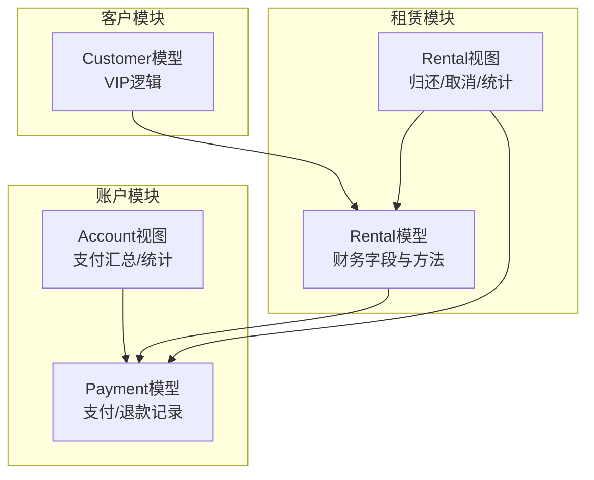
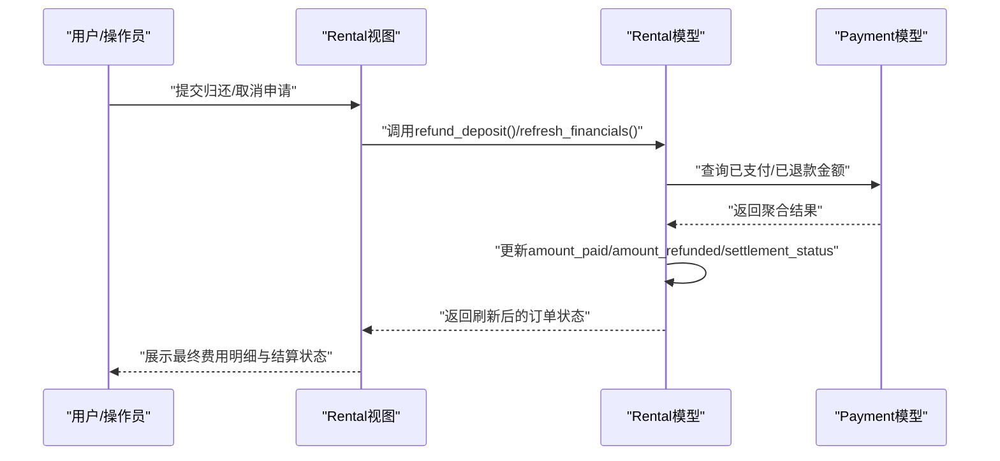
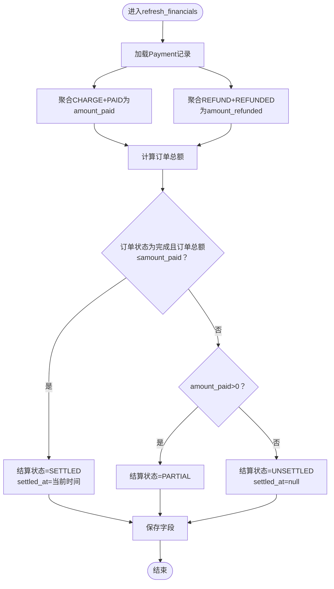
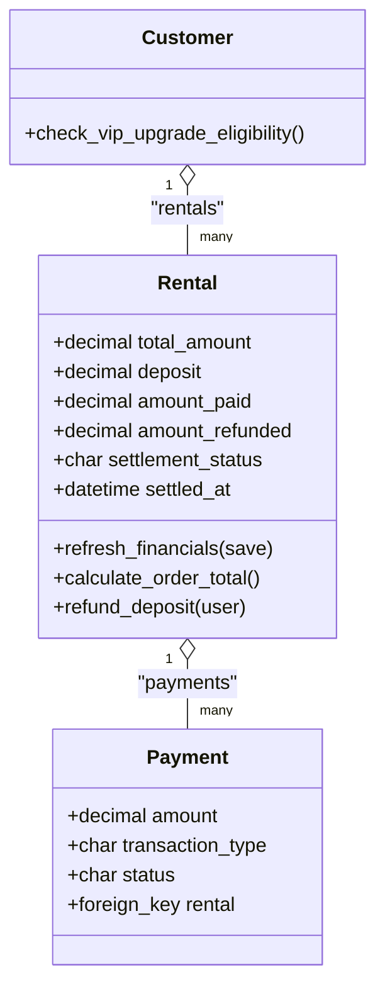

# 财务字段设计

<cite>
**本文引用的文件**
- [rentals/models.py](file://code/car_rental_system/rentals/models.py)
- [rentals/migrations/0003_settlement_fields.py](file://code/car_rental_system/rentals/migrations/0003_settlement_fields.py)
- [accounts/models.py](file://code/car_rental_system/accounts/models.py)
- [rentals/views.py](file://code/car_rental_system/rentals/views.py)
- [accounts/views.py](file://code/car_rental_system/accounts/views.py)
- [customers/models.py](file://code/car_rental_system/customers/models.py)
- [create_rental_test_data.py](file://code/car_rental_system/create_rental_test_data.py)
</cite>

## 目录
1. [简介](#简介)
2. [项目结构](#项目结构)
3. [核心组件](#核心组件)
4. [架构概览](#架构概览)
5. [详细组件分析](#详细组件分析)
6. [依赖关系分析](#依赖关系分析)
7. [性能考量](#性能考量)
8. [故障排查指南](#故障排查指南)
9. [结论](#结论)
10. [附录](#附录)

## 简介
本章节聚焦于Rental模型中的财务相关字段设计，包括总金额(total_amount)、押金(deposit)、累计支付金额(amount_paid)、累计退款金额(amount_refunded)、结算状态(settlement_status)等。文档将阐述这些字段的业务逻辑与实现细节，并结合refresh_financials方法说明如何基于Payment记录刷新财务数据。同时提供财务统计的ORM示例与数据库索引优化建议，帮助读者快速理解并正确使用这些字段。

## 项目结构
围绕财务字段的关键代码分布在以下模块：
- 租赁模型与财务字段：rentals/models.py
- 财务字段迁移与初始数据填充：rentals/migrations/0003_settlement_fields.py
- 支付模型与支付记录：accounts/models.py
- 视图层对财务字段的使用：rentals/views.py、accounts/views.py
- 客户模型中的VIP逻辑：customers/models.py
- 测试数据脚本（包含总金额计算示例）：create_rental_test_data.py

图表来源
- [rentals/models.py](file://code/car_rental_system/rentals/models.py#L12-L169)
- [rentals/migrations/0003_settlement_fields.py](file://code/car_rental_system/rentals/migrations/0003_settlement_fields.py#L1-L95)
- [accounts/models.py](file://code/car_rental_system/accounts/models.py#L147-L248)
- [rentals/views.py](file://code/car_rental_system/rentals/views.py#L279-L392)
- [accounts/views.py](file://code/car_rental_system/accounts/views.py#L243-L269)
- [customers/models.py](file://code/car_rental_system/customers/models.py#L99-L130)

章节来源
- [rentals/models.py](file://code/car_rental_system/rentals/models.py#L12-L169)
- [accounts/models.py](file://code/car_rental_system/accounts/models.py#L147-L248)

## 核心组件
- Rental模型中的财务字段与方法
  - total_amount：总金额，由日租金×租赁天数计算得出
  - deposit：押金，VIP客户为0，普通客户为日租金的10倍
  - amount_paid：累计支付金额（不含退款）
  - amount_refunded：累计退款金额
  - settlement_status：结算状态（UNSETTLED/PARTIAL/SETTLED）
  - refresh_financials：根据Payment记录刷新累计支付/退款与结算状态
  - calculate_order_total：计算订单总额（基础租金+押金+异地还车费+超时费用）
  - refund_deposit：退还押金并刷新财务

- Payment模型
  - 作为财务数据来源，区分交易类型(CHARGE/REFUND)与状态(PAID/REFUNDED)，支持按rental关联查询

- 视图层使用
  - 归还流程中调用refresh_financials与refund_deposit
  - 取消流程中根据已支付金额创建退款并刷新财务
  - 统计接口使用聚合查询计算收入与客户消费

章节来源
- [rentals/models.py](file://code/car_rental_system/rentals/models.py#L68-L156)
- [rentals/models.py](file://code/car_rental_system/rentals/models.py#L296-L333)
- [accounts/models.py](file://code/car_rental_system/accounts/models.py#L147-L248)
- [rentals/views.py](file://code/car_rental_system/rentals/views.py#L279-L392)
- [accounts/views.py](file://code/car_rental_system/accounts/views.py#L243-L269)

## 架构概览
财务数据流从Payment流向Rental，通过refresh_financials同步累计支付与退款，并据此更新结算状态。归还与取消流程触发退款与结算状态变更。

图表来源
- [rentals/models.py](file://code/car_rental_system/rentals/models.py#L296-L333)
- [rentals/views.py](file://code/car_rental_system/rentals/views.py#L279-L392)
- [accounts/models.py](file://code/car_rental_system/accounts/models.py#L147-L248)

## 详细组件分析

### 字段与业务逻辑
- 总金额(total_amount)
  - 计算方式：日租金×租赁天数（包含起止日）
  - 保存时自动计算，若未设置则按开始/结束日期与日租金推导
  - VIP客户在计算总金额时享受折扣，但此折扣不改变Rental.total_amount，而是影响最终应付总额（见“订单总额”）

- 押金(deposit)
  - VIP客户：0元
  - 普通客户：日租金×10（默认值）
  - 若异地还车且费用为0，系统会默认设置异地还车费用（日租金×0.5），与押金逻辑相互独立

- 订单总额(order_total)
  - 计算公式：基础租金 + 押金 + 异地还车费 + 超时费用
  - 当未异地还车时，异地还车费视为0

- 结算状态(settlement_status)
  - UNSETTLED：未结算（amount_paid=0）
  - PARTIAL：部分结算（amount_paid>0）
  - SETTLED：已结算（订单完成且订单总额≤amount_paid，且settled_at被设置）

- 累计支付/退款(amount_paid/amount_refunded)
  - 由refresh_financials根据Payment记录聚合得出
  - 仅统计交易类型为CHARGE且状态为PAID的支付，以及交易类型为REFUND且状态为REFUNDED的退款

- refresh_financials方法
  - 功能：刷新amount_paid、amount_refunded、settlement_status、settled_at
  - 逻辑要点：
    - 以rental为维度过滤Payment记录
    - CHARGE+PAID聚合得到amount_paid
    - REFUND+REFUNDED聚合得到amount_refunded
    - 根据订单总额与amount_paid决定结算状态
    - COMPLETED且满足条件时设置settled_at为当前时间

- refund_deposit方法
  - 功能：退还押金
  - 逻辑要点：
    - 计算可退押金=押金-已退款押金
    - 创建REFUND类型的Payment记录，状态为REFUNDED
    - 刷新财务数据

章节来源
- [rentals/models.py](file://code/car_rental_system/rentals/models.py#L246-L271)
- [rentals/models.py](file://code/car_rental_system/rentals/models.py#L286-L295)
- [rentals/models.py](file://code/car_rental_system/rentals/models.py#L296-L333)
- [rentals/models.py](file://code/car_rental_system/rentals/models.py#L334-L394)

### 结算状态更新流程

图表来源
- [rentals/models.py](file://code/car_rental_system/rentals/models.py#L296-L333)

### 归还与取消流程中的财务处理
- 归还流程
  - 更新实际还车日期/地点，必要时追加异地还车费用与超时费用
  - 将订单状态置为已完成
  - 退还押金（refund_deposit），并刷新财务（refresh_financials）
  - 展示费用明细与VIP升级提示

- 取消流程
  - 计算已支付金额（扣除已退款金额）并创建REFUND记录
  - 刷新财务（refresh_financials）
  - 恢复车辆状态为可用

章节来源
- [rentals/views.py](file://code/car_rental_system/rentals/views.py#L279-L392)
- [rentals/views.py](file://code/car_rental_system/rentals/views.py#L395-L467)

### 财务统计与ORM示例
- 客户累计消费
  - ORM示例路径：[accounts/views.py](file://code/car_rental_system/accounts/views.py#L160-L170)
  - 说明：对指定客户的所有Rental记录按amount_paid进行求和，可用于统计客户累计消费

- 平台收入统计
  - ORM示例路径：[views.py](file://code/car_rental_system/views.py#L69-L82)
  - 说明：对已完成的Rental按total_amount进行求和，统计平台总收入、月度收入、当日收入

- 支付/退款汇总
  - ORM示例路径：[accounts/views.py](file://code/car_rental_system/accounts/views.py#L243-L269)
  - 说明：对Payment记录按交易类型与状态进行聚合，计算已支付、已退款、净支付与剩余应付

章节来源
- [accounts/views.py](file://code/car_rental_system/accounts/views.py#L160-L170)
- [views.py](file://code/car_rental_system/views.py#L69-L82)
- [accounts/views.py](file://code/car_rental_system/accounts/views.py#L243-L269)

### 数据库索引优化
- Rental模型索引
  - 用途：加速按状态、开始/结束日期、客户/车辆状态组合的查询
  - 索引字段：start_date、end_date、status、customer+status、vehicle+status
  - 参考路径：[rentals/models.py](file://code/car_rental_system/rentals/models.py#L163-L169)

- Payment模型索引
  - 用途：加速按用户、订单、交易号、交易类型等维度的查询
  - 索引字段：user+status、rental、transaction_id、transaction_type
  - 参考路径：[accounts/models.py](file://code/car_rental_system/accounts/models.py#L242-L247)

- 迁移初始化
  - 在迁移中为Rental新增amount_paid、amount_refunded、settled_at、settlement_status字段，并批量填充历史数据
  - 参考路径：[rentals/migrations/0003_settlement_fields.py](file://code/car_rental_system/rentals/migrations/0003_settlement_fields.py#L1-L95)

章节来源
- [rentals/models.py](file://code/car_rental_system/rentals/models.py#L163-L169)
- [accounts/models.py](file://code/car_rental_system/accounts/models.py#L242-L247)
- [rentals/migrations/0003_settlement_fields.py](file://code/car_rental_system/rentals/migrations/0003_settlement_fields.py#L1-L95)

## 依赖关系分析
- Rental与Payment的关联
  - Rental通过外键关联Payment，refresh_financials基于Payment记录聚合
  - 归还/取消流程中，Rental直接创建REFUND类型的Payment记录并刷新财务

- VIP与总金额的关系
  - VIP客户在计算总金额时享受折扣（影响最终应付总额），但Rental.total_amount仍按原价计算
  - 押金规则与VIP无关，VIP客户押金为0

- 客户升级逻辑
  - 客户模型提供检查VIP升级条件的方法，与财务字段无直接耦合，但会影响后续业务流程

图表来源
- [rentals/models.py](file://code/car_rental_system/rentals/models.py#L68-L156)
- [accounts/models.py](file://code/car_rental_system/accounts/models.py#L147-L248)
- [customers/models.py](file://code/car_rental_system/customers/models.py#L99-L130)

章节来源
- [rentals/models.py](file://code/car_rental_system/rentals/models.py#L68-L156)
- [accounts/models.py](file://code/car_rental_system/accounts/models.py#L147-L248)
- [customers/models.py](file://code/car_rental_system/customers/models.py#L99-L130)

## 性能考量
- 单次聚合查询
  - 使用聚合查询一次性计算amount_paid/amount_refunded，避免多次往返数据库
  - 参考路径：[rentals/models.py](file://code/car_rental_system/rentals/models.py#L296-L309)

- 索引优化
  - 为Rental与Payment常用查询字段建立索引，显著降低复杂查询成本
  - 参考路径：[rentals/models.py](file://code/car_rental_system/rentals/models.py#L163-L169)、[accounts/models.py](file://code/car_rental_system/accounts/models.py#L242-L247)

- 批量初始化
  - 迁移阶段批量填充历史订单的amount_paid/amount_refunded/settlement_status，避免运行时逐条计算
  - 参考路径：[rentals/migrations/0003_settlement_fields.py](file://code/car_rental_system/rentals/migrations/0003_settlement_fields.py#L1-L95)

- 视图层优化
  - Dashboard与统计接口采用单次聚合查询，减少数据库访问次数
  - 参考路径：[views.py](file://code/car_rental_system/views.py#L55-L82)

## 故障排查指南
- 结算状态异常
  - 现象：结算状态未按预期更新
  - 排查要点：
    - 确认Rental.status为COMPLETED且订单总额≤amount_paid
    - 检查refresh_financials是否被调用
    - 参考路径：[rentals/models.py](file://code/car_rental_system/rentals/models.py#L313-L324)

- 押金未退还
  - 现象：订单完成后押金未自动退还
  - 排查要点：
    - 确认refund_deposit被调用
    - 检查Payment中是否存在REFUND记录且状态为REFUNDED
    - 参考路径：[rentals/models.py](file://code/car_rental_system/rentals/models.py#L334-L394)、[rentals/views.py](file://code/car_rental_system/rentals/views.py#L347-L356)

- 财务统计不准确
  - 现象：客户累计消费或平台收入与预期不符
  - 排查要点：
    - 检查Payment记录的交易类型与状态是否正确
    - 确认聚合查询范围与过滤条件
    - 参考路径：[accounts/views.py](file://code/car_rental_system/accounts/views.py#L243-L269)

- VIP折扣与总金额
  - 现象：VIP客户应付金额与total_amount不一致
  - 说明：VIP折扣影响最终应付总额，但Rental.total_amount按原价计算
  - 参考路径：[rentals/views.py](file://code/car_rental_system/rentals/views.py#L469-L484)

章节来源
- [rentals/models.py](file://code/car_rental_system/rentals/models.py#L296-L333)
- [rentals/models.py](file://code/car_rental_system/rentals/models.py#L334-L394)
- [accounts/views.py](file://code/car_rental_system/accounts/views.py#L243-L269)
- [rentals/views.py](file://code/car_rental_system/rentals/views.py#L469-L484)

## 结论
Rental模型的财务字段设计清晰地分离了“应收费用”与“实收/退款”两类数据：total_amount与deposit反映业务定价，amount_paid/amount_refunded与settlement_status反映实际资金流转。refresh_financials提供了可靠的刷新机制，配合Payment模型的交易类型与状态，能够准确追踪每一笔支付与退款。通过聚合查询与索引优化，系统在大数据量下仍能保持良好的性能表现。建议在业务流程中始终调用refresh_financials与refund_deposit，确保财务数据一致性。

## 附录
- VIP客户押金规则
  - VIP客户押金为0，普通客户押金为日租金×10
  - 参考路径：[rentals/models.py](file://code/car_rental_system/rentals/models.py#L253-L259)

- 测试数据中的总金额计算
  - 示例脚本展示了按日租金×天数计算总金额的方式
  - 参考路径：[create_rental_test_data.py](file://code/car_rental_system/create_rental_test_data.py#L289-L297)