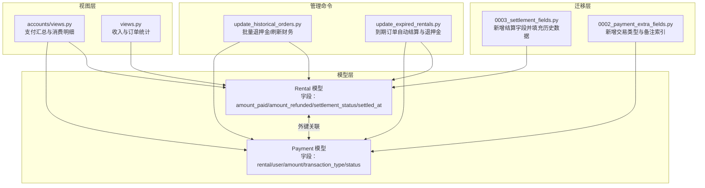
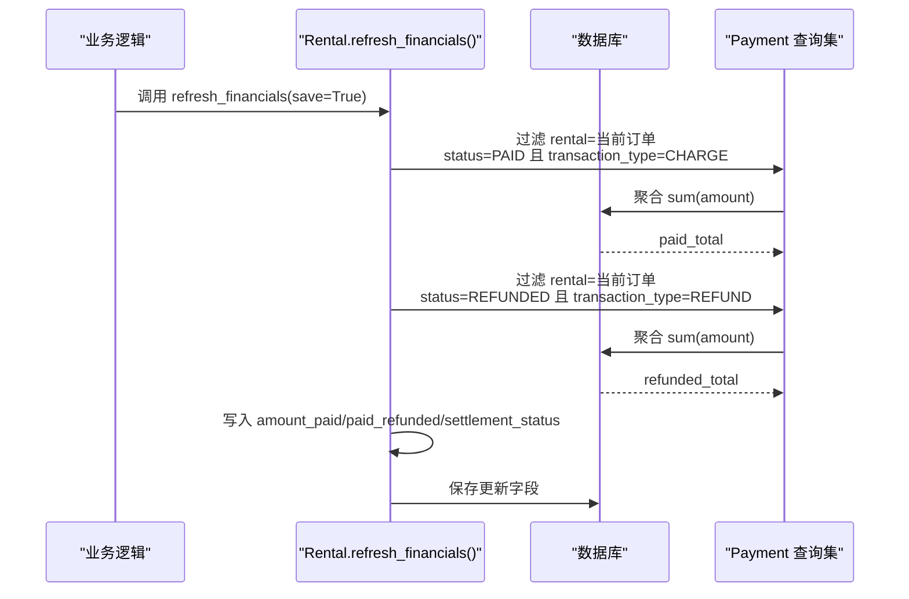
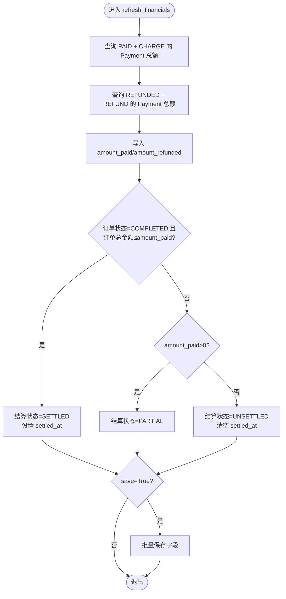
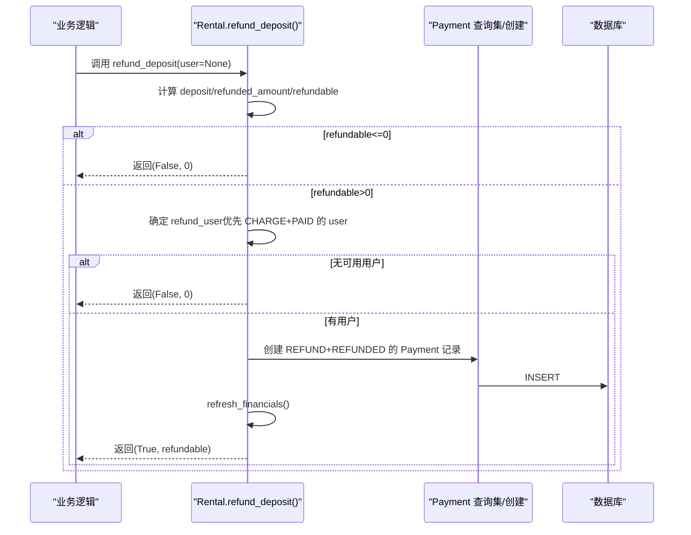
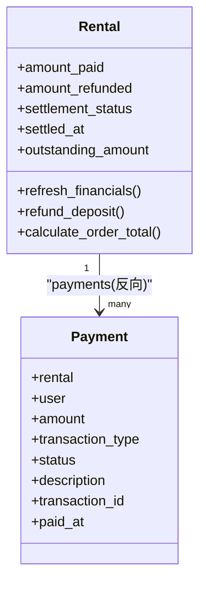

# 财务数据关联

<cite>
**本文引用的文件**
- [rentals/models.py](file://code/car_rental_system/rentals/models.py)
- [accounts/models.py](file://code/car_rental_system/accounts/models.py)
- [rentals/migrations/0003_settlement_fields.py](file://code/car_rental_system/rentals/migrations/0003_settlement_fields.py)
- [accounts/migrations/0002_payment_extra_fields.py](file://code/car_rental_system/accounts/migrations/0002_payment_extra_fields.py)
- [rentals/management/commands/update_historical_orders.py](file://code/car_rental_system/rentals/management/commands/update_historical_orders.py)
- [rentals/management/commands/update_expired_rentals.py](file://code/car_rental_system/rentals/management/commands/update_expired_rentals.py)
- [accounts/views.py](file://code/car_rental_system/accounts/views.py)
- [views.py](file://code/car_rental_system/views.py)
- [退款信息显示说明.md](file://code/car_rental_system/退款信息显示说明.md)
</cite>

## 目录
1. [简介](#简介)
2. [项目结构](#项目结构)
3. [核心组件](#核心组件)
4. [架构总览](#架构总览)
5. [详细组件分析](#详细组件分析)
6. [依赖关系分析](#依赖关系分析)
7. [性能考量](#性能考量)
8. [故障排查指南](#故障排查指南)
9. [结论](#结论)
10. [附录](#附录)

## 简介
本文件聚焦于 Rental 模型与 Payment 模型之间的财务关联机制，系统性阐述：
- amount_paid 与 amount_refunded 字段如何通过 refresh_financials() 方法从 Payment 记录中聚合得出，查询条件为 rental 关联、transaction_type（CHARGE/REFUND）与 status（PAID/REFUNDED）。
- 订单完成后如何触发押金退还流程 refund_deposit()，包括可退金额计算、退款用户确定与 Payment 记录创建。
- 提供 ORM 查询示例与数据库索引优化建议，帮助读者理解并高效使用相关统计接口。

## 项目结构
围绕财务关联的关键文件分布如下：
- 模型层：Rental 与 Payment 模型定义及其索引
- 迁移层：新增结算字段与支付记录扩展字段
- 管理命令：批量刷新历史订单财务信息与自动退押金
- 视图层：消费明细与支付汇总逻辑
- 文档：退款信息显示说明

图表来源
- [rentals/models.py](file://code/car_rental_system/rentals/models.py#L143-L169)
- [accounts/models.py](file://code/car_rental_system/accounts/models.py#L147-L248)
- [rentals/migrations/0003_settlement_fields.py](file://code/car_rental_system/rentals/migrations/0003_settlement_fields.py#L1-L95)
- [accounts/migrations/0002_payment_extra_fields.py](file://code/car_rental_system/accounts/migrations/0002_payment_extra_fields.py#L1-L42)
- [rentals/management/commands/update_historical_orders.py](file://code/car_rental_system/rentals/management/commands/update_historical_orders.py#L65-L211)
- [rentals/management/commands/update_expired_rentals.py](file://code/car_rental_system/rentals/management/commands/update_expired_rentals.py#L144-L190)
- [accounts/views.py](file://code/car_rental_system/accounts/views.py#L243-L268)
- [views.py](file://code/car_rental_system/views.py#L52-L85)

章节来源
- [rentals/models.py](file://code/car_rental_system/rentals/models.py#L143-L169)
- [accounts/models.py](file://code/car_rental_system/accounts/models.py#L147-L248)
- [rentals/migrations/0003_settlement_fields.py](file://code/car_rental_system/rentals/migrations/0003_settlement_fields.py#L1-L95)
- [accounts/migrations/0002_payment_extra_fields.py](file://code/car_rental_system/accounts/migrations/0002_payment_extra_fields.py#L1-L42)

## 核心组件
- Rental 模型
  - 新增字段：amount_paid、amount_refunded、settlement_status、settled_at
  - 索引：customer+status、vehicle+status、status、start_date、end_date 等
  - 关键方法：refresh_financials()、refund_deposit()、calculate_order_total()、outstanding_amount
- Payment 模型
  - 外键关联到 Rental 与 User
  - 新增字段：transaction_type（CHARGE/REFUND）、description、transaction_id
  - 索引：rental、transaction_type、user+status、transaction_id
- 迁移脚本
  - 0003_settlement_fields.py：为历史订单填充 amount_paid/amount_refunded/settlement_status
  - 0002_payment_extra_fields.py：为 Payment 表添加交易类型与索引

章节来源
- [rentals/models.py](file://code/car_rental_system/rentals/models.py#L143-L169)
- [accounts/models.py](file://code/car_rental_system/accounts/models.py#L147-L248)
- [rentals/migrations/0003_settlement_fields.py](file://code/car_rental_system/rentals/migrations/0003_settlement_fields.py#L1-L95)
- [accounts/migrations/0002_payment_extra_fields.py](file://code/car_rental_system/accounts/migrations/0002_payment_extra_fields.py#L1-L42)

## 架构总览
Rental 与 Payment 通过外键建立一对多关系，财务数据以 Payment 为事实表，Rental 作为汇总表维护聚合值。refresh_financials() 在业务关键节点（如订单完成、批量刷新）调用，将 Payment 中的 CHARGE/REFUND 与 PAID/REFUNDED 条件聚合结果写回 Rental，从而实现“事实表驱动汇总”的财务架构。

图表来源
- [rentals/models.py](file://code/car_rental_system/rentals/models.py#L296-L333)

章节来源
- [rentals/models.py](file://code/car_rental_system/rentals/models.py#L296-L333)

## 详细组件分析

### Rental.refresh_financials()：从 Payment 聚合金额
- 聚合逻辑
  - amount_paid：按 rental 关联、status=PAID、transaction_type=CHARGE 的 Payment.amount 求和
  - amount_refunded：按 rental 关联、status=REFUNDED、transaction_type=REFUND 的 Payment.amount 求和
- 结算状态联动
  - 当订单状态为 COMPLETED 且订单总金额 ≤ amount_paid 时，结算状态置为 SETTLED，并记录 settled_at
  - 若 amount_paid > 0，则为 PARTIAL；否则为 UNSETTLED 并清空 settled_at
- 保存策略
  - 可选 save=True 时批量更新上述字段与 updated_at

图表来源
- [rentals/models.py](file://code/car_rental_system/rentals/models.py#L296-L333)

章节来源
- [rentals/models.py](file://code/car_rental_system/rentals/models.py#L296-L333)

### Rental.refund_deposit()：订单完成后押金退还流程
- 可退金额计算
  - refundable = deposit - 已退还 REFUNDED 金额（按 REFUND 类型与 REFUNDED 状态聚合）
- 退款用户确定
  - 优先使用 CHARGE 且 PAID 的 Payment 中最早一条的 user
  - 若无支付记录，使用 Rental.customer.user
  - 若仍无用户则放弃退款
- Payment 记录创建
  - transaction_type=REFUND、status=REFUNDED、description 描述、paid_at 当前时间、transaction_id 唯一标识
- 后续处理
  - 调用 refresh_financials() 刷新汇总

图表来源
- [rentals/models.py](file://code/car_rental_system/rentals/models.py#L334-L394)

章节来源
- [rentals/models.py](file://code/car_rental_system/rentals/models.py#L334-L394)

### 历史订单批量处理与自动退押金
- update_historical_orders.py
  - 为已完成订单创建押金退款记录（若可退）
  - 为已取消订单退还已支付金额（若可退）
  - 刷新所有订单财务信息
- update_expired_rentals.py
  - 订单完成后自动结算押金/更新财务数据，逻辑与 refund_deposit() 类似

章节来源
- [rentals/management/commands/update_historical_orders.py](file://code/car_rental_system/rentals/management/commands/update_historical_orders.py#L65-L211)
- [rentals/management/commands/update_expired_rentals.py](file://code/car_rental_system/rentals/management/commands/update_expired_rentals.py#L144-L190)

### 支付汇总与消费明细
- accounts/views.py 中的 get_payment_summary()
  - 依据 CHARGE/PAID 与 REFUND/REFUNDED 聚合 paid/refunded/net_paid/remaining/order_total_amount
- 消费明细页面展示退款记录（类型为退款、状态为已退款）

章节来源
- [accounts/views.py](file://code/car_rental_system/accounts/views.py#L243-L268)
- [退款信息显示说明.md](file://code/car_rental_system/退款信息显示说明.md#L1-L124)

## 依赖关系分析
- Rental 与 Payment 的外键关系
  - Rental.payments 反向关联 Payment.rental
  - Payment.user 与 Rental.customer.user 用于退款用户匹配
- 索引与查询条件
  - Payment.rental、transaction_type、user+status、transaction_id 索引支持高频过滤
  - Rental.status、customer+status、vehicle+status 索引支持订单筛选与排序

图表来源
- [rentals/models.py](file://code/car_rental_system/rentals/models.py#L143-L169)
- [accounts/models.py](file://code/car_rental_system/accounts/models.py#L147-L248)

章节来源
- [rentals/models.py](file://code/car_rental_system/rentals/models.py#L143-L169)
- [accounts/models.py](file://code/car_rental_system/accounts/models.py#L147-L248)

## 性能考量
- 索引优化
  - Payment 表新增 transaction_type 索引，显著降低按 CHARGE/REFUND 与 PAID/REFUNDED 聚合的扫描成本
  - Rental 表新增 customer+status、vehicle+status 等复合索引，提升订单筛选与排序效率
- 聚合查询
  - refresh_financials() 与 get_payment_summary() 均采用单次聚合查询，避免 N+1 与多次往返
- 批量处理
  - 管理命令 update_historical_orders.py 与 update_expired_rentals.py 通过批量创建 Payment 与批量刷新汇总，减少事务开销

章节来源
- [accounts/migrations/0002_payment_extra_fields.py](file://code/car_rental_system/accounts/migrations/0002_payment_extra_fields.py#L1-L42)
- [rentals/migrations/0003_settlement_fields.py](file://code/car_rental_system/rentals/migrations/0003_settlement_fields.py#L1-L95)
- [rentals/models.py](file://code/car_rental_system/rentals/models.py#L296-L333)
- [accounts/views.py](file://code/car_rental_system/accounts/views.py#L243-L268)

## 故障排查指南
- 退款未显示
  - 历史订单可能未刷新财务信息，可通过批量更新命令刷新
  - 已完成订单可能尚未创建押金退款记录
- 退款金额不正确
  - 检查订单押金与已退还金额是否正确
  - 确认退款用户是否关联到有效账户
- 退款用户缺失
  - 若无 CHARGE+PAID 的 Payment 记录，将回退到 Rental.customer.user
  - 若仍无用户，退款流程会终止

章节来源
- [退款信息显示说明.md](file://code/car_rental_system/退款信息显示说明.md#L1-L124)
- [rentals/models.py](file://code/car_rental_system/rentals/models.py#L334-L394)

## 结论
Rental 与 Payment 的财务关联以 Payment 为事实表、Rental 为汇总表的设计清晰明确。通过 refresh_financials() 与 refund_deposit() 两个关键方法，系统实现了从支付记录到订单汇总的闭环管理，并辅以批量命令与索引优化保障性能与一致性。建议在业务关键路径上主动调用 refresh_financials()，并在历史数据迁移后执行批量刷新，确保财务数据准确可靠。

## 附录

### ORM 查询示例与最佳实践
- 客户消费统计（示例路径）
  - 使用单次聚合查询统计客户总消费金额，避免多次往返与 N+1 查询
  - 示例路径参考：[views.py](file://code/car_rental_system/views.py#L52-L85)
- 订单支付汇总（示例路径）
  - 按 CHARGE/PAID 与 REFUND/REFUNDED 聚合 paid/refunded/net_paid/remaining
  - 示例路径参考：[accounts/views.py](file://code/car_rental_system/accounts/views.py#L243-L268)
- 历史数据填充（示例路径）
  - 迁移脚本 populate_financial_fields 为历史订单填充 amount_paid/amount_refunded/settlement_status
  - 示例路径参考：[rentals/migrations/0003_settlement_fields.py](file://code/car_rental_system/rentals/migrations/0003_settlement_fields.py#L1-L95)

章节来源
- [views.py](file://code/car_rental_system/views.py#L52-L85)
- [accounts/views.py](file://code/car_rental_system/accounts/views.py#L243-L268)
- [rentals/migrations/0003_settlement_fields.py](file://code/car_rental_system/rentals/migrations/0003_settlement_fields.py#L1-L95)